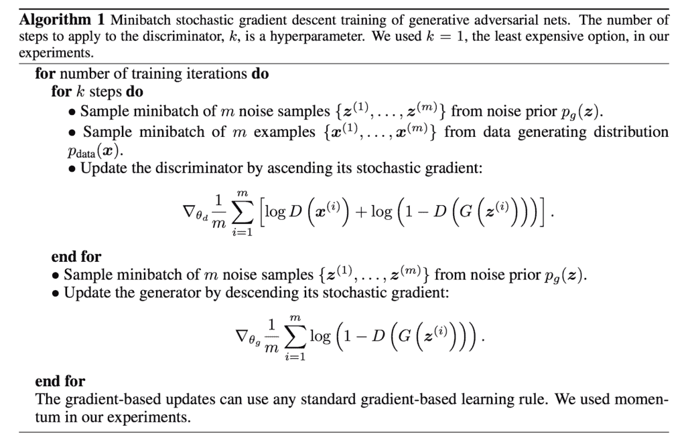

# 如何对 GAN 训练算法和损失函数进行编码

> 原文：<https://machinelearningmastery.com/how-to-code-the-generative-adversarial-network-training-algorithm-and-loss-functions/>

最后更新于 2020 年 1 月 10 日

生成性对抗网络，简称 GAN，是一种用于训练生成模型的架构。

该架构由两个模型组成。我们感兴趣的生成器，以及用于帮助训练生成器的鉴别器模型。最初，生成器和鉴别器模型都被实现为多层感知器(MLP)，尽管最近，模型被实现为深度卷积神经网络。

理解 GAN 是如何训练的，以及如何理解和实现发生器和鉴别器模型的损失函数可能是一个挑战。

在本教程中，您将发现如何实现生成性对抗网络训练算法和损失函数。

完成本教程后，您将知道:

*   如何实现生成性对抗网络的训练算法？
*   鉴别器和发生器的损失函数是如何工作的。
*   如何在实践中实现鉴别器和生成器模型的权重更新？

**用我的新书[Python 生成性对抗网络](https://machinelearningmastery.com/generative_adversarial_networks/)启动你的项目**，包括*分步教程*和所有示例的 *Python 源代码*文件。

我们开始吧。

*   **2020 年 1 月更新**:修正了训练算法描述中的小错别字。


如何编码生成性对抗网络训练算法和损失函数
图片由[希拉里·夏洛特](https://www.flickr.com/photos/58747781@N00/4333584925)提供，版权所有。

## 教程概述

本教程分为三个部分；它们是:

1.  如何实现氮化镓训练算法
2.  理解氮化镓损耗函数
3.  如何在实践中训练氮化镓模型

**注意**:本教程中的代码示例只是片段，不是独立的可运行示例。它们旨在帮助您开发算法的直觉，并且可以作为在您自己的项目中实现 GAN 训练算法的起点。

## 如何实现氮化镓训练算法

GAN 训练算法包括并行训练鉴别器和生成器模型。

该算法总结如下图，摘自古德费勒等人 2014 年发表的题为“[生成性对抗网络](https://arxiv.org/abs/1406.2661)”的原始论文



生成性对抗网络训练算法综述。摘自:生成性对抗网络。

让我们花点时间打开包装，熟悉一下这个算法。

算法的外部循环包括迭代步骤来训练架构中的模型。通过这个循环的一个周期不是一个纪元:它是一个由鉴别器和生成器模型的特定批量更新组成的单一更新。

一个[时期](https://machinelearningmastery.com/difference-between-a-batch-and-an-epoch/)被定义为通过训练数据集的一个循环，其中训练数据集中的样本被用于以小批量更新模型权重。例如，100 个样本的训练数据集用于训练具有 10 个样本的小批量大小的模型，将涉及每个时期 10 个小批量更新。该模型将适用于给定数量的时代，如 500 年。

通过调用 *fit()* 函数并指定时期的数量和每个小批量的大小来自动训练模型，这通常对您是隐藏的。

在 GAN 的情况下，必须根据训练数据集的大小和批处理大小来定义训练迭代的次数。在数据集包含 100 个样本、10 个批次大小和 500 个训练时期的情况下，我们将首先计算每个时期的批次数量，并使用它来计算使用时期数量的训练迭代总数。

例如:

```py
...
batches_per_epoch = floor(dataset_size / batch_size)
total_iterations = batches_per_epoch * total_epochs
```

在 100 个样本、10 个批次和 500 个时期的数据集的情况下，GAN 将被训练为最低(100 / 10) * 500 或 5000 次总迭代。

接下来，我们可以看到训练的一次迭代可能导致鉴别器的多次更新和生成器的一次更新，其中鉴别器的更新次数是一个设置为 1 的超参数。

> 培训过程包括同步 SGD。在每个步骤中，对两个小批次进行采样:一个是来自数据集的 x 值小批次，另一个是来自模型先验潜在变量的 z 值小批次。然后同时进行两个梯度步骤…

——[NIPS 2016 教程:生成性对抗网络](https://arxiv.org/abs/1701.00160)，2016。

因此，我们可以用 Python 伪代码将训练算法总结如下:

```py
# gan training algorithm
def train_gan(dataset, n_epochs, n_batch):
	# calculate the number of batches per epoch
	batches_per_epoch = int(len(dataset) / n_batch)
	# calculate the number of training iterations
	n_steps = batches_per_epoch * n_epochs
	# gan training algorithm
	for i in range(n_steps):
		# update the discriminator model
		# ...
		# update the generator model
		# ...
```

另一种方法可以包括枚举训练时期的数量，并为每个时期将训练数据集分成批次。

更新鉴别器模型需要几个步骤。

首先，必须从潜在空间中选择一批随机点作为生成器模型的输入，为生成的或“*伪造的”*样本提供基础。然后，必须从训练数据集中选择一批样本作为“*真实*样本输入到鉴别器。

接下来，鉴别器模型必须对真样本和假样本进行预测，并且鉴别器的权重必须与这些预测的正确或不正确程度成比例地更新。预测是概率，我们将在下一节讨论预测的性质和最小化的损失函数。现在，我们可以概述这些步骤在实践中的实际情况。

我们需要一个生成器和一个鉴别器模型，例如像 Keras 模型。这些可以作为参数提供给训练函数。

接下来，我们必须从潜在空间生成点，然后使用当前形式的生成器模型来生成一些假图像。例如:

```py
...
# generate points in the latent space
z = randn(latent_dim * n_batch)
# reshape into a batch of inputs for the network
z = x_input.reshape(n_batch, latent_dim)
# generate fake images
fake = generator.predict(z)
```

注意，潜在维度的大小也被提供作为训练算法的超参数。

然后我们必须选择一批真实的样本，这也将被包装成一个函数。

```py
...
# select a batch of random real images
ix = randint(0, len(dataset), n_batch)
# retrieve real images
real = dataset[ix]
```

然后，鉴别器模型必须对每个生成的和真实的图像进行预测，并且权重必须更新。

```py
# gan training algorithm
def train_gan(generator, discriminator, dataset, latent_dim, n_epochs, n_batch):
	# calculate the number of batches per epoch
	batches_per_epoch = int(len(dataset) / n_batch)
	# calculate the number of training iterations
	n_steps = batches_per_epoch * n_epochs
	# gan training algorithm
	for i in range(n_steps):
		# generate points in the latent space
		z = randn(latent_dim * n_batch)
		# reshape into a batch of inputs for the network
		z = z.reshape(n_batch, latent_dim)
		# generate fake images
		fake = generator.predict(z)
		# select a batch of random real images
		ix = randint(0, len(dataset), n_batch)
		# retrieve real images
		real = dataset[ix]
		# update weights of the discriminator model
		# ...

		# update the generator model
		# ...
```

接下来，必须更新生成器模型。

同样，必须从潜在空间中选择一批随机点，并传递给生成器以生成假图像，然后传递给鉴别器以进行分类。

```py
...
# generate points in the latent space
z = randn(latent_dim * n_batch)
# reshape into a batch of inputs for the network
z = z.reshape(n_batch, latent_dim)
# generate fake images
fake = generator.predict(z)
# classify as real or fake
result = discriminator.predict(fake)
```

然后，该响应可用于更新发电机模型的权重。

```py
# gan training algorithm
def train_gan(generator, discriminator, dataset, latent_dim, n_epochs, n_batch):
	# calculate the number of batches per epoch
	batches_per_epoch = int(len(dataset) / n_batch)
	# calculate the number of training iterations
	n_steps = batches_per_epoch * n_epochs
	# gan training algorithm
	for i in range(n_steps):
		# generate points in the latent space
		z = randn(latent_dim * n_batch)
		# reshape into a batch of inputs for the network
		z = z.reshape(n_batch, latent_dim)
		# generate fake images
		fake = generator.predict(z)
		# select a batch of random real images
		ix = randint(0, len(dataset), n_batch)
		# retrieve real images
		real = dataset[ix]
		# update weights of the discriminator model
		# ...
		# generate points in the latent space
		z = randn(latent_dim * n_batch)
		# reshape into a batch of inputs for the network
		z = z.reshape(n_batch, latent_dim)
		# generate fake images
		fake = generator.predict(z)
		# classify as real or fake
		result = discriminator.predict(fake)
		# update weights of the generator model
		# ...
```

有趣的是，鉴别器在每次训练迭代中更新两批样本，而生成器在每次训练迭代中仅更新一批样本。

现在我们已经定义了 GAN 的训练算法，我们需要了解模型权重是如何更新的。这需要了解用于训练氮化镓的损耗函数。

## 理解氮化镓损耗函数

鉴别器被训练来正确地分类真实和伪造的图像。

这是通过最大化真实图像的预测概率的对数和伪造图像的反转概率的对数来实现的，在每一个小批量的例子上取平均值。

回想一下，我们将对数概率相加，这与乘法概率相同，尽管不会消失为小数字。因此，我们可以将这个损失函数理解为寻找真实图像接近 1.0 的概率和伪造图像接近 0.0 的概率，反过来成为更大的数字。这些值的相加意味着该损失函数的较低平均值导致鉴别器的更好性能。

将这个问题转化为一个最小化问题，如果你熟悉为二进制分类开发神经网络，这应该不足为奇，因为这正是所使用的方法。

> 这只是在训练具有 sigmoid 输出的标准二进制分类器时最小化的标准交叉熵成本。唯一的区别是分类器是在两个小批量的数据上训练的；一个来自数据集，其中所有示例的标签都是 1，一个来自生成器，其中所有示例的标签都是 0。

——[NIPS 2016 教程:生成性对抗网络](https://arxiv.org/abs/1701.00160)，2016。

发电机更棘手。

GAN 算法将生成器模型的损失定义为最小化鉴别器对假图像的预测的反转概率的对数，在小批量上求平均值。

这很简单，但是根据作者的说法，当生成器很差并且鉴别器擅长以高置信度拒绝假图像时，这在实践中是无效的。损失函数不再给出发生器可以用来调整权重的良好梯度信息，而是饱和。

> 在这种情况下，对数(1d(G(z))饱和。我们可以训练 G 来最大化 log D(G(z))，而不是训练 G 来最小化 log D(1-D(G(z))。这个目标函数导致 G 和 D 的动力学相同的不动点，但是在学习的早期提供更强的梯度。

——[生成性对抗网络](https://arxiv.org/abs/1406.2661)，2014。

相反，作者建议最大化鉴别器对假图像的预测概率的对数。

变化是微妙的。

在第一种情况下，生成器被训练成最小化鉴别器正确的概率。随着损失函数的改变，发生器被训练成最大化鉴别器不正确的概率。

> 在极小极大博弈中，生成器最小化鉴别器正确的对数概率。在这个游戏中，生成器最大化鉴别器出错的对数概率。

——[NIPS 2016 教程:生成性对抗网络](https://arxiv.org/abs/1701.00160)，2016。

然后可以将这个损失函数的符号反转，给出一个熟悉的最小化损失函数，用于训练发生器。因此，这有时被称为训练 GANs 的 D-log 技巧。

> 我们的基线比较是 DCGAN，一种卷积结构的 GAN，使用对数 D 技巧用标准 GAN 程序训练。

——2017 年[一根筋](https://arxiv.org/abs/1701.07875)。

现在我们已经理解了 GAN 损耗函数，我们可以看看如何在实践中更新鉴别器和发生器模型。

## 如何在实践中训练氮化镓模型

GAN 损耗函数和模型更新的实际实现非常简单。

我们将看看使用 Keras 库的例子。

我们可以通过配置鉴别器模型来直接实现鉴别器，以预测真实图像的概率为 1，伪造图像的概率为 0，并最小化交叉熵损失，特别是二进制交叉熵损失。

例如，我们的模型定义的一个片段，带有用于鉴别器的 Keras，对于输出层和具有适当损失函数的模型编译可能如下所示。

```py
...
# output layer
model.add(Dense(1, activation='sigmoid'))
# compile model
model.compile(loss='binary_crossentropy', ...)
```

可以为每一批真实和虚假样本训练定义的模型，为预期结果提供 1 和 0 的数组。

可以使用[1()](https://docs.scipy.org/doc/numpy/reference/generated/numpy.ones.html)和[0()](https://docs.scipy.org/doc/numpy/reference/generated/numpy.zeros.html)NumPy 函数来创建这些目标标签，可以使用 Keras 函数 *train_on_batch()* 来更新每批样本的模型。

```py
...
X_fake = ...
X_real = ...
# define target labels for fake images
y_fake = zeros((n_batch, 1))
# update the discriminator for fake images
discriminator.train_on_batch(X_fake, y_fake)
# define target labels for real images
y_real = ones((n_batch, 1))
# update the discriminator for real images
discriminator.train_on_batch(X_real, y_real)
```

鉴别器模型将被训练来预测给定输入图像的“*真实度*”的概率，该概率可以被解释为类标签，假的类=0，真的类=1。

生成器被训练为最大化鉴别器，该鉴别器为生成的图像预测高概率的“*真实度*”。

这是通过鉴别器为生成的图像更新类别标签为 1 的生成器来实现的。鉴别器在此操作中不更新，但提供更新生成器模型权重所需的梯度信息。

例如，如果鉴别器预测该批生成图像的平均概率较低，那么这将导致大的误差信号向后传播到生成器中，给定样本的“*预期概率*”实际为 1.0。这个大的误差信号反过来会导致发生器发生相对较大的变化，从而有望提高其在下一批中生成假样本的能力。

这可以在 Keras 中通过创建一个组合生成器和鉴别器模型的复合模型来实现，允许来自生成器的输出图像直接流入鉴别器，进而允许来自鉴别器的预测概率的误差信号通过生成器模型的权重流回。

例如:

```py
# define a composite gan model for the generator and discriminator
def define_gan(generator, discriminator):
	# make weights in the discriminator not trainable
	discriminator.trainable = False
	# connect them
	model = Sequential()
	# add generator
	model.add(generator)
	# add the discriminator
	model.add(discriminator)
	# compile model
	model.compile(loss='binary_crossentropy', optimizer='adam')
	return model
```

然后可以使用假图像和真实类别标签更新复合模型。

```py
...
# generate points in the latent space
z = randn(latent_dim * n_batch)
# reshape into a batch of inputs for the network
z = z.reshape(n_batch, latent_dim)
# define target labels for real images
y_real = ones((n_batch, 1))
# update generator model
gan_model.train_on_batch(z, y_real)
```

这就完成了鉴别器和生成器模型的 GAN 训练算法、损失函数和权重更新细节的外巡。

## 进一步阅读

如果您想更深入地了解这个主题，本节将提供更多资源。

### 报纸

*   [生成性对抗网络](https://arxiv.org/abs/1406.2661)，2014。
*   [NIPS 2016 教程:生成性对抗网络](https://arxiv.org/abs/1701.00160)，2016。
*   [水的输入 gan](https://arxiv.org/abs/1701.07875)2017 年。

### 文章

*   [理解生成性对抗网络](https://danieltakeshi.github.io/2017/03/05/understanding-generative-adversarial-networks/)，2017。

## 摘要

在本教程中，您发现了如何实现生成性对抗网络训练算法和损失函数。

具体来说，您了解到:

*   如何实现生成性对抗网络的训练算法？
*   鉴别器和发生器的损失函数是如何工作的。
*   如何在实践中实现鉴别器和生成器模型的权重更新？

你有什么问题吗？
在下面的评论中提问，我会尽力回答。