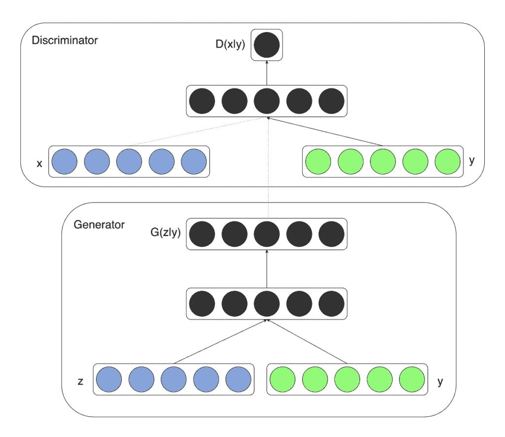
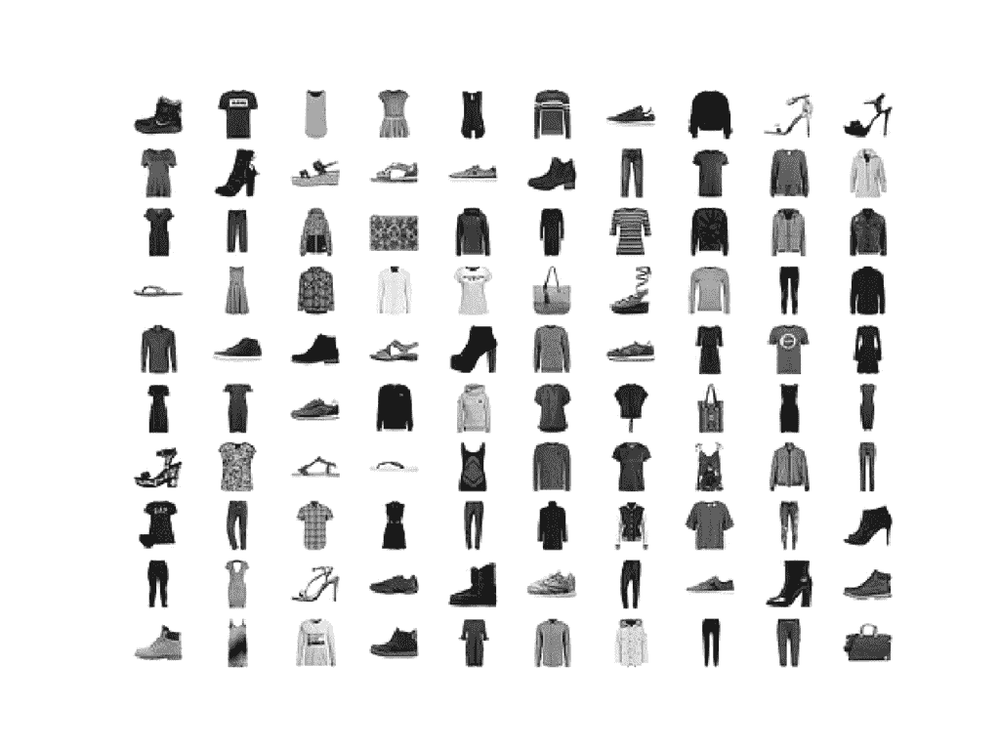
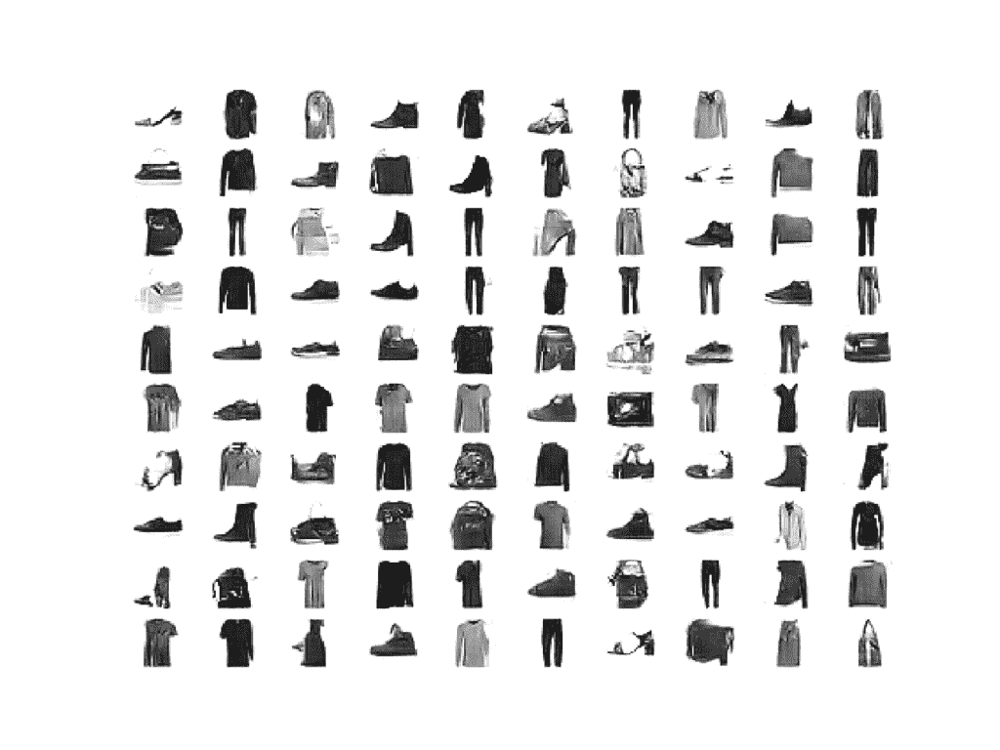
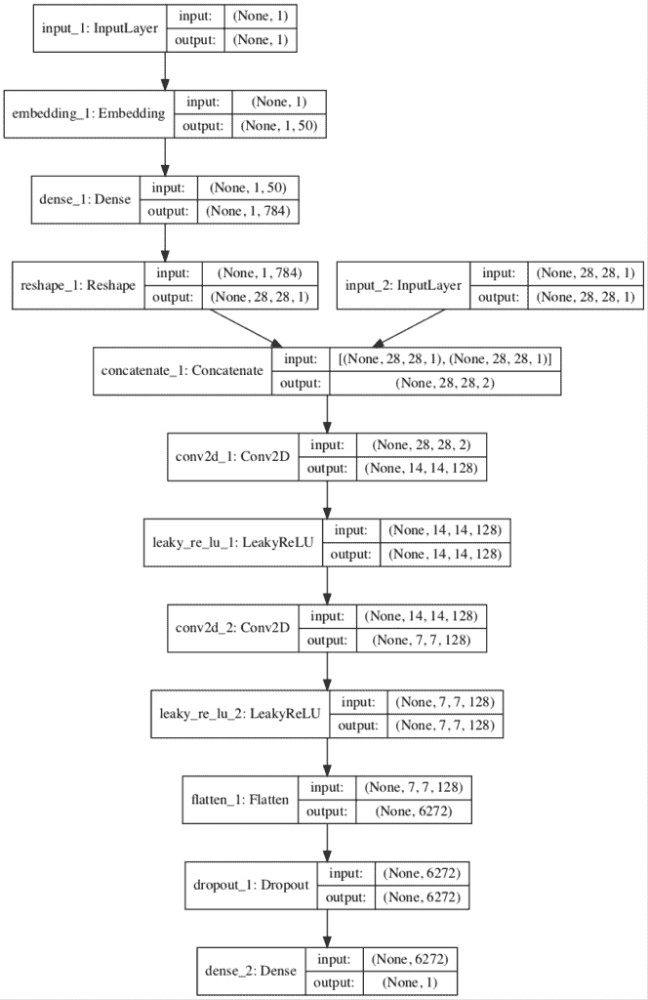
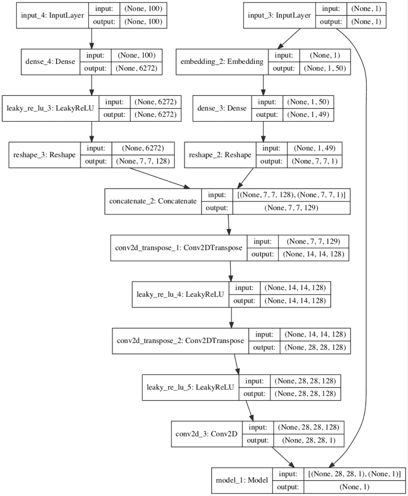
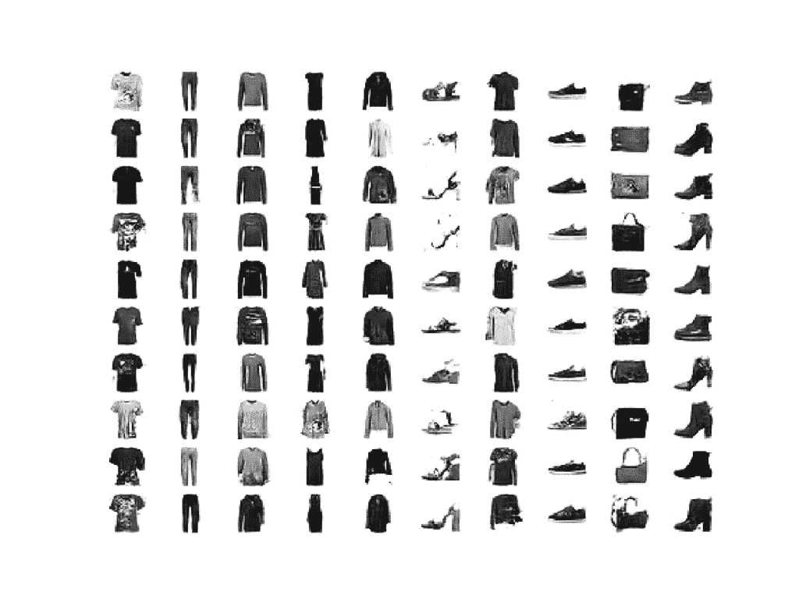

# 如何从头开发一个条件 GAN（CGAN）

> 原文：<https://machinelearningmastery.com/how-to-develop-a-conditional-generative-adversarial-network-from-scratch/>

最后更新于 2020 年 9 月 1 日

生成对抗网络是一种用于训练生成模型的体系结构，例如用于生成图像的深度卷积神经网络。

尽管 GAN 模型能够为给定数据集生成新的随机似是而非的示例，但是除了试图找出输入到生成器的潜在空间和生成的图像之间的复杂关系之外，没有办法控制生成的图像类型。

条件生成对抗网络，简称 cGAN，是一种 GAN，涉及到通过生成器模型有条件地生成图像。图像生成可以以类标签为条件(如果可用)，允许有针对性地生成给定类型的图像。

在本教程中，您将发现如何开发一个有条件的生成对抗网络，用于有针对性地生成衣物。

完成本教程后，您将知道:

*   用 GAN 生成随机样本的局限性可以用条件生成对抗网络来克服。
*   如何开发和评估一个无条件生成的敌对网络，用于生成衣服的照片。
*   如何开发和评估生成服装照片的条件生成对抗网络？

**用我的新书[Python 生成对抗网络](https://machinelearningmastery.com/generative_adversarial_networks/)启动你的项目**，包括*分步教程*和所有示例的 *Python 源代码*文件。

我们开始吧。


如何从零开始开发条件生成对抗网络
图片由[大柏树国家保护区](https://www.flickr.com/photos/72362382@N04/33129838416)提供，版权所有

## 教程概述

本教程分为五个部分；它们是:

1.  条件生成对抗网络
2.  时尚-MNIST 服装照片数据集
3.  时尚无条件 GAN-MNIST
4.  时尚 MNIST 的条件 GAN
5.  条件服装生成

## 条件生成对抗网络

生成对抗网络，简称 GAN，是一种用于训练基于深度学习的生成模型的架构。

该架构由一个生成器和一个鉴别器模型组成。生成器模型负责生成新的似是而非的示例，这些示例在理想情况下无法与数据集中的真实示例区分开来。鉴别器模型负责将给定图像分类为真实图像(从数据集绘制)或伪造图像(生成)。

模型以零和或对抗的方式一起训练，使得鉴别器的改进以降低发生器的能力为代价，反之亦然。

GANs 在图像合成方面很有效，也就是说，为目标数据集生成新的图像示例。有些数据集有附加信息，如类标签，希望利用这些信息。

例如，MNIST 手写数字数据集具有相应整数的类别标签，CIFAR-10 小对象照片数据集具有照片中相应对象的类别标签，而 Fashion-MNIST 服装数据集具有相应服装项目的类别标签。

在 GAN 模型中使用类标签信息有两个动机。

1.  完善 GAN。
2.  目标图像生成。

与输入图像相关的附加信息，例如类别标签，可以用于改进 GAN。这种改进可能以更稳定的训练、更快的训练和/或生成质量更好的图像的形式出现。

类标签也可以用于有意或有针对性地生成给定类型的图像。

GAN 模型的一个限制是它可能从域中生成随机图像。潜在空间中的点与生成的图像之间存在关系，但这种关系复杂且难以映射。

或者，可以以生成器和鉴别器模型都以类标签为条件的方式来训练 GAN。这意味着，当训练的生成器模型用作独立模型来生成域中的图像时，可以生成给定类型或类标签的图像。

> 如果发生器和鉴别器都以某些额外的信息 y 为条件，则生成对抗网可以扩展为条件模型。[……]我们可以通过将 y 作为额外的输入层输入到鉴别器和发生器中来进行条件化。

——[条件生成对抗网](https://arxiv.org/abs/1411.1784)，2014。

例如，在 MNIST 的情况下，可以生成特定的手写数字，例如数字 9；在 CIFAR-10 的情况下，可以生成特定对象的照片，例如“*青蛙*”；在时尚 MNIST 数据集的情况下，可以生成特定的服装项目，例如“*服饰*”

这种类型的模型被称为条件生成对抗网络，简称 CGAN。

迈赫迪·米尔扎和西蒙·奥森德罗在他们 2014 年的论文《条件生成对抗网络》中首次描述了 cGAN 在本文中，作者基于指导生成器模型的图像生成过程的愿望来激励该方法。

> ……通过根据附加信息调整模型，可以指导数据生成过程。这种调节可以基于类别标签

——[条件生成对抗网](https://arxiv.org/abs/1411.1784)，2014。

他们的方法在 MNIST 手写数字数据集中进行了演示，其中类标签是一个热编码，并与生成器和鉴别器模型的输入相连接。

下图提供了模型架构的摘要。



条件生成对抗网络中的条件生成器和条件鉴别器示例。
摘自《条件生成对抗性网络》，2014 年。

在 GAN 模型的设计和训练方面已经有了许多进步，最显著的是[深度卷积 GAN](https://arxiv.org/abs/1511.06434) ，简称 DCGAN，它概述了模型配置和训练过程，这些过程可靠地导致 GAN 模型针对各种各样的问题进行稳定的训练。基于 DCGAN 的模型的条件训练可以简称为 cDCGAN 或 CDCGAN。

有许多方法可以将类标签编码并合并到鉴别器和生成器模型中。最佳实践包括使用嵌入层，随后是具有线性激活的完全连接层，该线性激活将嵌入缩放到图像的大小，然后将其作为附加通道或特征图连接到模型中。

该建议的一个版本在 2015 年的论文《使用对抗性网络的拉普拉斯金字塔的深度生成图像模型》中进行了描述

> …我们还探索了模型的类条件版本，其中向量 c 编码标签。它通过一个线性层集成到 Gk & Dk 中，该层的输出被重新整形为单个平面要素图，然后与第一个层图连接。

——[使用对抗性网络拉普拉斯金字塔的深度生成图像模型](https://arxiv.org/abs/1506.05751)，2015 年。

该建议后来被添加到设计和训练 GAN 模型时的启发式建议列表中，总结如下:

> 16:条件 GANs 中的离散变量
> –使用嵌入层
> –作为附加通道添加到图像中
> –保持低嵌入维度并向上采样以匹配图像通道大小

— [GAN 黑客](https://github.com/soumith/ganhacks)

虽然 GANs 可以以类标签为条件，即所谓的类条件 GANs，但在 GAN 用于图像到图像转换任务的情况下，它们也可以以其他输入为条件，如图像。

在本教程中，我们将开发一个 GAN，特别是 DCGAN，然后更新它以在 CGAN，特别是 cDCGAN 模型架构中使用类标签。

## 时尚-MNIST 服装照片数据集

[时尚-MNIST](https://machinelearningmastery.com/how-to-develop-a-cnn-from-scratch-for-fashion-mnist-clothing-classification/) 数据集被提议作为 MNIST 数据集的更具挑战性的替代数据集。

它是一个数据集，由 60，000 个 28×28 像素的小正方形灰度图像组成，包括 10 种服装，如鞋子、t 恤、连衣裙等。

Keras 通过 [fashion_mnist.load_dataset()函数](https://keras.io/datasets/#fashion-mnist-database-of-fashion-articles)提供对时尚 MNIST 数据集的访问。它返回两个元组，一个包含标准训练数据集的输入和输出元素，另一个包含标准测试数据集的输入和输出元素。

下面的示例加载数据集并总结加载数据集的形状。

注意:第一次加载数据集时，Keras 会自动下载图像的压缩版本，并保存在 *~/的主目录下。keras/数据集/* 。下载速度很快，因为压缩形式的数据集只有大约 25 兆字节。

```py
# example of loading the fashion_mnist dataset
from keras.datasets.fashion_mnist import load_data
# load the images into memory
(trainX, trainy), (testX, testy) = load_data()
# summarize the shape of the dataset
print('Train', trainX.shape, trainy.shape)
print('Test', testX.shape, testy.shape)
```

运行该示例将加载数据集，并打印训练的输入和输出组件的形状，以及测试图像的分割。

我们可以看到训练集中有 60K 个例子，测试集中有 10K，每个图像都是 28 乘 28 像素的正方形。

```py
Train (60000, 28, 28) (60000,)
Test (10000, 28, 28) (10000,)
```

图像是黑色背景的灰度图像(像素值为 0)，衣服是白色的(像素值接近 255)。这意味着如果图像被绘制出来，它们大部分是黑色的，中间有一件白色的衣服。

我们可以使用带有 [imshow()函数](https://matplotlib.org/api/_as_gen/matplotlib.pyplot.imshow.html)的 matplotlib 库绘制训练数据集中的一些图像，并通过“ *cmap* ”参数将颜色映射指定为“*灰色*，以正确显示像素值。

```py
# plot raw pixel data
pyplot.imshow(trainX[i], cmap='gray')
```

或者，当我们颠倒颜色，将背景画成白色，将服装画成黑色时，图像更容易查看。

它们更容易观看，因为大部分图像现在是白色的，而感兴趣的区域是黑色的。这可以通过使用反向灰度色图来实现，如下所示:

```py
# plot raw pixel data
pyplot.imshow(trainX[i], cmap='gray_r')
```

以下示例将训练数据集中的前 100 幅图像绘制成 10 乘 10 的正方形。

```py
# example of loading the fashion_mnist dataset
from keras.datasets.fashion_mnist import load_data
from matplotlib import pyplot
# load the images into memory
(trainX, trainy), (testX, testy) = load_data()
# plot images from the training dataset
for i in range(100):
	# define subplot
	pyplot.subplot(10, 10, 1 + i)
	# turn off axis
	pyplot.axis('off')
	# plot raw pixel data
	pyplot.imshow(trainX[i], cmap='gray_r')
pyplot.show()
```

运行该示例会创建一个图形，其中包含 100 幅来自 MNIST 训练数据集的图像，排列成 10×10 的正方形。



时尚 MNIST 数据集中前 100 件服装的图表。

我们将使用训练数据集中的图像作为训练生成对抗网络的基础。

具体来说，生成器模型将学习如何使用鉴别器生成新的似是而非的服装项目，该鉴别器将尝试区分来自时尚 MNIST 训练数据集的真实图像和生成器模型输出的新图像。

这是一个相对简单的问题，不需要复杂的生成器或鉴别器模型，尽管它确实需要生成灰度输出图像。

## 时尚无条件 GAN-MNIST

在本节中，我们将为时尚-MNIST 数据集开发一个无条件 GAN。

第一步是定义模型。

鉴别器模型将一幅 28×28 灰度图像作为输入，并输出关于图像是真实的(类=1)还是假的(类=0)的二进制预测。它被实现为一个适度的卷积神经网络，使用 GAN 设计的最佳实践，例如使用斜率为 0.2 的 LeakyReLU 激活函数，使用 [2×2 步长对](https://machinelearningmastery.com/padding-and-stride-for-convolutional-neural-networks/)进行下采样，以及学习率为 0.0002、动量为 0.5 的随机梯度下降的 [adam 版本](https://machinelearningmastery.com/adam-optimization-algorithm-for-deep-learning/)

下面的 define_discriminator()函数实现了这一点，定义并编译鉴别器模型并返回它。图像的输入形状被参数化为一个默认的函数参数，以防您以后想要为自己的图像数据重用该函数。

```py
# define the standalone discriminator model
def define_discriminator(in_shape=(28,28,1)):
	model = Sequential()
	# downsample
	model.add(Conv2D(128, (3,3), strides=(2,2), padding='same', input_shape=in_shape))
	model.add(LeakyReLU(alpha=0.2))
	# downsample
	model.add(Conv2D(128, (3,3), strides=(2,2), padding='same'))
	model.add(LeakyReLU(alpha=0.2))
	# classifier
	model.add(Flatten())
	model.add(Dropout(0.4))
	model.add(Dense(1, activation='sigmoid'))
	# compile model
	opt = Adam(lr=0.0002, beta_1=0.5)
	model.compile(loss='binary_crossentropy', optimizer=opt, metrics=['accuracy'])
	return model
```

生成器模型将潜在空间中的一个点作为输入，并输出单个 28×28 灰度图像。这是通过使用完全连接的层来解释潜在空间中的点并提供足够的激活来实现的，这些激活可以被重新成形为输出图像的低分辨率版本(例如 7×7)的许多副本(在这种情况下为 128 个)。然后对其进行两次上采样，每次使用转置卷积层，将激活区域的大小增加一倍，面积增加四倍。该模型使用了最佳实践，例如 LeakyReLU 激活、作为步长因子的内核大小以及输出层中的双曲正切(tanh)激活函数。

下面的 *define_generator()* 函数定义了生成器模型，但由于没有直接训练，所以故意不编译，然后返回模型。潜在空间的大小被参数化为函数参数。

```py
# define the standalone generator model
def define_generator(latent_dim):
	model = Sequential()
	# foundation for 7x7 image
	n_nodes = 128 * 7 * 7
	model.add(Dense(n_nodes, input_dim=latent_dim))
	model.add(LeakyReLU(alpha=0.2))
	model.add(Reshape((7, 7, 128)))
	# upsample to 14x14
	model.add(Conv2DTranspose(128, (4,4), strides=(2,2), padding='same'))
	model.add(LeakyReLU(alpha=0.2))
	# upsample to 28x28
	model.add(Conv2DTranspose(128, (4,4), strides=(2,2), padding='same'))
	model.add(LeakyReLU(alpha=0.2))
	# generate
	model.add(Conv2D(1, (7,7), activation='tanh', padding='same'))
	return model
```

接下来，可以定义一个 GAN 模型，它将生成器模型和鉴别器模型组合成一个更大的模型。这个更大的模型将被用于训练生成器中的模型权重，使用由鉴别器模型计算的输出和误差。鉴别器模型是单独训练的，因此，在这个更大的 GAN 模型中，模型权重被标记为不可训练，以确保只有生成器模型的权重被更新。鉴别器权重的可训练性的这种改变仅在训练组合的 GAN 模型时有效，而在单独训练鉴别器时无效。

这个更大的 GAN 模型将潜在空间中的一个点作为输入，使用生成器模型来生成图像，该图像作为输入被馈送到鉴别器模型，然后被输出或者被分类为真实的或者伪造的。

下面的 *define_gan()* 函数实现了这一点，将已经定义的生成器和鉴别器模型作为输入。

```py
# define the combined generator and discriminator model, for updating the generator
def define_gan(generator, discriminator):
	# make weights in the discriminator not trainable
	discriminator.trainable = False
	# connect them
	model = Sequential()
	# add generator
	model.add(generator)
	# add the discriminator
	model.add(discriminator)
	# compile model
	opt = Adam(lr=0.0002, beta_1=0.5)
	model.compile(loss='binary_crossentropy', optimizer=opt)
	return model
```

现在我们已经定义了 GAN 模型，我们需要对它进行训练。但是，在我们训练模型之前，我们需要输入数据。

第一步是加载和准备时尚 MNIST 数据集。我们只需要训练数据集中的图像。图像是黑白的，因此我们必须增加一个额外的通道维度来将它们转换成三维的，正如我们模型的卷积层所预期的那样。最后，像素值必须缩放到[-1，1]的范围，以匹配生成器模型的输出。

下面的 *load_real_samples()* 函数实现了这一点，返回加载并缩放的时尚 MNIST 训练数据集，准备建模。

```py
# load fashion mnist images
def load_real_samples():
	# load dataset
	(trainX, _), (_, _) = load_data()
	# expand to 3d, e.g. add channels
	X = expand_dims(trainX, axis=-1)
	# convert from ints to floats
	X = X.astype('float32')
	# scale from [0,255] to [-1,1]
	X = (X - 127.5) / 127.5
	return X
```

我们将需要数据集的一批(或半批)真实图像来更新 GAN 模型。实现这一点的简单方法是每次从数据集中随机选择一个图像样本。

下面的 *generate_real_samples()* 函数实现了这一点，以准备好的数据集为参数，为鉴别器选择并返回一个时尚 MNIST 图像的随机样本及其对应的类标签，具体为 class=1，表示它们是真实图像。

```py
# select real samples
def generate_real_samples(dataset, n_samples):
	# choose random instances
	ix = randint(0, dataset.shape[0], n_samples)
	# select images
	X = dataset[ix]
	# generate class labels
	y = ones((n_samples, 1))
	return X, y
```

接下来，我们需要发电机模型的输入。这些是来自潜在空间的随机点，特别是高斯分布的随机变量。

*generate _ 潜伏 _points()* 函数实现了这一点，将潜伏空间的大小作为自变量，所需的点数作为生成器模型的一批输入样本返回。

```py
# generate points in latent space as input for the generator
def generate_latent_points(latent_dim, n_samples):
	# generate points in the latent space
	x_input = randn(latent_dim * n_samples)
	# reshape into a batch of inputs for the network
	x_input = x_input.reshape(n_samples, latent_dim)
	return x_input
```

接下来，我们需要使用潜在空间中的点作为生成器的输入，以便生成新的图像。

下面的 *generate_fake_samples()* 函数实现了这一点，将生成器模型和潜在空间的大小作为参数，然后在潜在空间中生成点，并将其用作生成器模型的输入。该函数为鉴别器模型返回生成的图像及其对应的类标签，具体来说，class=0 表示它们是伪造的或生成的。

```py
# use the generator to generate n fake examples, with class labels
def generate_fake_samples(generator, latent_dim, n_samples):
	# generate points in latent space
	x_input = generate_latent_points(latent_dim, n_samples)
	# predict outputs
	X = generator.predict(x_input)
	# create class labels
	y = zeros((n_samples, 1))
	return X, y
```

我们现在准备安装GAN模型。

该模型适合 100 个训练时期，这是任意的，因为该模型在大约 20 个时期后开始生成看似合理的服装项目。使用 128 个样本的批次大小，并且每个训练时期涉及 60，000/128，或者大约 468 批次的真实和虚假样本以及对模型的更新。

首先对半批真实样本更新鉴别器模型，然后对半批伪样本更新鉴别器模型，共同形成一批权重更新。然后通过复合 gan 模型更新发生器。重要的是，对于假样本，类别标签设置为 1 或真。这具有更新生成器以更好地生成下一批真实样本的效果。

下面的 *train()* 函数实现了这一点，将定义的模型、数据集和潜在维度的大小作为参数，并使用默认参数参数化纪元的数量和批处理大小。发电机模型在训练结束时保存。

```py
# train the generator and discriminator
def train(g_model, d_model, gan_model, dataset, latent_dim, n_epochs=100, n_batch=128):
	bat_per_epo = int(dataset.shape[0] / n_batch)
	half_batch = int(n_batch / 2)
	# manually enumerate epochs
	for i in range(n_epochs):
		# enumerate batches over the training set
		for j in range(bat_per_epo):
			# get randomly selected 'real' samples
			X_real, y_real = generate_real_samples(dataset, half_batch)
			# update discriminator model weights
			d_loss1, _ = d_model.train_on_batch(X_real, y_real)
			# generate 'fake' examples
			X_fake, y_fake = generate_fake_samples(g_model, latent_dim, half_batch)
			# update discriminator model weights
			d_loss2, _ = d_model.train_on_batch(X_fake, y_fake)
			# prepare points in latent space as input for the generator
			X_gan = generate_latent_points(latent_dim, n_batch)
			# create inverted labels for the fake samples
			y_gan = ones((n_batch, 1))
			# update the generator via the discriminator's error
			g_loss = gan_model.train_on_batch(X_gan, y_gan)
			# summarize loss on this batch
			print('>%d, %d/%d, d1=%.3f, d2=%.3f g=%.3f' %
				(i+1, j+1, bat_per_epo, d_loss1, d_loss2, g_loss))
	# save the generator model
	g_model.save('generator.h5')
```

然后，我们可以定义潜在空间的大小，定义所有三个模型，并在加载的时尚 MNIST 数据集上训练它们。

```py
# size of the latent space
latent_dim = 100
# create the discriminator
discriminator = define_discriminator()
# create the generator
generator = define_generator(latent_dim)
# create the gan
gan_model = define_gan(generator, discriminator)
# load image data
dataset = load_real_samples()
# train model
train(generator, discriminator, gan_model, dataset, latent_dim)
```

将所有这些结合在一起，下面列出了完整的示例。

```py
# example of training an unconditional gan on the fashion mnist dataset
from numpy import expand_dims
from numpy import zeros
from numpy import ones
from numpy.random import randn
from numpy.random import randint
from keras.datasets.fashion_mnist import load_data
from keras.optimizers import Adam
from keras.models import Sequential
from keras.layers import Dense
from keras.layers import Reshape
from keras.layers import Flatten
from keras.layers import Conv2D
from keras.layers import Conv2DTranspose
from keras.layers import LeakyReLU
from keras.layers import Dropout

# define the standalone discriminator model
def define_discriminator(in_shape=(28,28,1)):
	model = Sequential()
	# downsample
	model.add(Conv2D(128, (3,3), strides=(2,2), padding='same', input_shape=in_shape))
	model.add(LeakyReLU(alpha=0.2))
	# downsample
	model.add(Conv2D(128, (3,3), strides=(2,2), padding='same'))
	model.add(LeakyReLU(alpha=0.2))
	# classifier
	model.add(Flatten())
	model.add(Dropout(0.4))
	model.add(Dense(1, activation='sigmoid'))
	# compile model
	opt = Adam(lr=0.0002, beta_1=0.5)
	model.compile(loss='binary_crossentropy', optimizer=opt, metrics=['accuracy'])
	return model

# define the standalone generator model
def define_generator(latent_dim):
	model = Sequential()
	# foundation for 7x7 image
	n_nodes = 128 * 7 * 7
	model.add(Dense(n_nodes, input_dim=latent_dim))
	model.add(LeakyReLU(alpha=0.2))
	model.add(Reshape((7, 7, 128)))
	# upsample to 14x14
	model.add(Conv2DTranspose(128, (4,4), strides=(2,2), padding='same'))
	model.add(LeakyReLU(alpha=0.2))
	# upsample to 28x28
	model.add(Conv2DTranspose(128, (4,4), strides=(2,2), padding='same'))
	model.add(LeakyReLU(alpha=0.2))
	# generate
	model.add(Conv2D(1, (7,7), activation='tanh', padding='same'))
	return model

# define the combined generator and discriminator model, for updating the generator
def define_gan(generator, discriminator):
	# make weights in the discriminator not trainable
	discriminator.trainable = False
	# connect them
	model = Sequential()
	# add generator
	model.add(generator)
	# add the discriminator
	model.add(discriminator)
	# compile model
	opt = Adam(lr=0.0002, beta_1=0.5)
	model.compile(loss='binary_crossentropy', optimizer=opt)
	return model

# load fashion mnist images
def load_real_samples():
	# load dataset
	(trainX, _), (_, _) = load_data()
	# expand to 3d, e.g. add channels
	X = expand_dims(trainX, axis=-1)
	# convert from ints to floats
	X = X.astype('float32')
	# scale from [0,255] to [-1,1]
	X = (X - 127.5) / 127.5
	return X

# select real samples
def generate_real_samples(dataset, n_samples):
	# choose random instances
	ix = randint(0, dataset.shape[0], n_samples)
	# select images
	X = dataset[ix]
	# generate class labels
	y = ones((n_samples, 1))
	return X, y

# generate points in latent space as input for the generator
def generate_latent_points(latent_dim, n_samples):
	# generate points in the latent space
	x_input = randn(latent_dim * n_samples)
	# reshape into a batch of inputs for the network
	x_input = x_input.reshape(n_samples, latent_dim)
	return x_input

# use the generator to generate n fake examples, with class labels
def generate_fake_samples(generator, latent_dim, n_samples):
	# generate points in latent space
	x_input = generate_latent_points(latent_dim, n_samples)
	# predict outputs
	X = generator.predict(x_input)
	# create class labels
	y = zeros((n_samples, 1))
	return X, y

# train the generator and discriminator
def train(g_model, d_model, gan_model, dataset, latent_dim, n_epochs=100, n_batch=128):
	bat_per_epo = int(dataset.shape[0] / n_batch)
	half_batch = int(n_batch / 2)
	# manually enumerate epochs
	for i in range(n_epochs):
		# enumerate batches over the training set
		for j in range(bat_per_epo):
			# get randomly selected 'real' samples
			X_real, y_real = generate_real_samples(dataset, half_batch)
			# update discriminator model weights
			d_loss1, _ = d_model.train_on_batch(X_real, y_real)
			# generate 'fake' examples
			X_fake, y_fake = generate_fake_samples(g_model, latent_dim, half_batch)
			# update discriminator model weights
			d_loss2, _ = d_model.train_on_batch(X_fake, y_fake)
			# prepare points in latent space as input for the generator
			X_gan = generate_latent_points(latent_dim, n_batch)
			# create inverted labels for the fake samples
			y_gan = ones((n_batch, 1))
			# update the generator via the discriminator's error
			g_loss = gan_model.train_on_batch(X_gan, y_gan)
			# summarize loss on this batch
			print('>%d, %d/%d, d1=%.3f, d2=%.3f g=%.3f' %
				(i+1, j+1, bat_per_epo, d_loss1, d_loss2, g_loss))
	# save the generator model
	g_model.save('generator.h5')

# size of the latent space
latent_dim = 100
# create the discriminator
discriminator = define_discriminator()
# create the generator
generator = define_generator(latent_dim)
# create the gan
gan_model = define_gan(generator, discriminator)
# load image data
dataset = load_real_samples()
# train model
train(generator, discriminator, gan_model, dataset, latent_dim)
```

在普通硬件上运行该示例可能需要很长时间。

我建议在 GPU 硬件上运行该示例。如果您需要帮助，您可以通过使用 AWS EC2 实例来训练模型来快速入门。请参阅教程:

*   [如何设置亚马逊 AWS EC2 GPUs 训练 Keras 深度学习模型(分步)](https://machinelearningmastery.com/develop-evaluate-large-deep-learning-models-keras-amazon-web-services/)

鉴别器在真样品和假样品上的损失，以及发生器的损失，在每批之后报告。

**注**:考虑到算法或评估程序的随机性，或数值准确率的差异，您的[结果可能会有所不同](https://machinelearningmastery.com/different-results-each-time-in-machine-learning/)。考虑运行该示例几次，并比较平均结果。

在这种情况下，在整个训练过程中，鉴频器和发生器的损耗都在 0.6 到 0.7 左右。

```py
...
>100, 464/468, d1=0.681, d2=0.685 g=0.693
>100, 465/468, d1=0.691, d2=0.700 g=0.703
>100, 466/468, d1=0.691, d2=0.703 g=0.706
>100, 467/468, d1=0.698, d2=0.699 g=0.699
>100, 468/468, d1=0.699, d2=0.695 g=0.708
```

训练结束后，发电机模型将保存到文件名为“ *generator.h5* 的文件中。

该模型可以被加载并用于从时尚 MNIST 数据集生成新的随机但似是而非的样本。

以下示例加载保存的模型，并生成 100 件随机的衣服。

```py
# example of loading the generator model and generating images
from keras.models import load_model
from numpy.random import randn
from matplotlib import pyplot

# generate points in latent space as input for the generator
def generate_latent_points(latent_dim, n_samples):
	# generate points in the latent space
	x_input = randn(latent_dim * n_samples)
	# reshape into a batch of inputs for the network
	x_input = x_input.reshape(n_samples, latent_dim)
	return x_input

# create and save a plot of generated images (reversed grayscale)
def show_plot(examples, n):
	# plot images
	for i in range(n * n):
		# define subplot
		pyplot.subplot(n, n, 1 + i)
		# turn off axis
		pyplot.axis('off')
		# plot raw pixel data
		pyplot.imshow(examples[i, :, :, 0], cmap='gray_r')
	pyplot.show()

# load model
model = load_model('generator.h5')
# generate images
latent_points = generate_latent_points(100, 100)
# generate images
X = model.predict(latent_points)
# plot the result
show_plot(X, 10)
```

运行该示例会创建一个由 100 件随机生成的衣服组成的图，这些衣服排列成 10×10 的网格。

**注**:考虑到算法或评估程序的随机性，或数值准确率的差异，您的[结果可能会有所不同](https://machinelearningmastery.com/different-results-each-time-in-machine-learning/)。考虑运行该示例几次，并比较平均结果。

在这种情况下，我们可以看到各种各样的衣服，如鞋子、毛衣和裤子。大多数项目看起来都很合理，可能来自时尚 MNIST 数据集。然而，它们并不完美，因为有些单袖毛衣和鞋子看起来一团糟。



使用无条件 g an 生成的 100 件衣服的示例。

## 时尚 MNIST 的条件 GAN

在本节中，我们将通过更新上一节中开发的无条件 GAN，为时尚-MNIST 数据集开发一个有条件 GAN。

在 Keras 中设计具有多个输入的模型的最佳方式是使用[功能 API](https://machinelearningmastery.com/keras-functional-api-deep-learning/) ，这与上一节中使用的顺序 API 相反。我们将使用功能 API 来重新实现鉴别器、生成器和复合模型。

从鉴别器模型开始，定义一个新的第二个输入，该输入为图像的类标签取一个整数。这具有使输入图像以所提供的类标签为条件的效果。

然后，类标签通过一个大小为 50 的嵌入层。这意味着时尚 MNIST 数据集的 10 个类(0 到 9)中的每一个都将映射到一个不同的 50 元素向量表示，该向量表示将由鉴别器模型学习。

嵌入的输出然后通过线性激活被传递到完全连接的层。重要的是，完全连接的层有足够的激活，可以重塑为 28×28 图像的一个通道。激活被重新整形为单个 28×28 激活图，并与输入图像连接。对于下一个卷积层，这具有看起来像双通道输入图像的效果。

下面的 *define_discriminator()* 实现了对鉴别器模型的更新。在嵌入层之后，输入图像的参数化形状也用于定义完全连接层的激活次数，以重塑其输出。问题中的类的数量也在函数和集合中被参数化。

```py
# define the standalone discriminator model
def define_discriminator(in_shape=(28,28,1), n_classes=10):
	# label input
	in_label = Input(shape=(1,))
	# embedding for categorical input
	li = Embedding(n_classes, 50)(in_label)
	# scale up to image dimensions with linear activation
	n_nodes = in_shape[0] * in_shape[1]
	li = Dense(n_nodes)(li)
	# reshape to additional channel
	li = Reshape((in_shape[0], in_shape[1], 1))(li)
	# image input
	in_image = Input(shape=in_shape)
	# concat label as a channel
	merge = Concatenate()([in_image, li])
	# downsample
	fe = Conv2D(128, (3,3), strides=(2,2), padding='same')(merge)
	fe = LeakyReLU(alpha=0.2)(fe)
	# downsample
	fe = Conv2D(128, (3,3), strides=(2,2), padding='same')(fe)
	fe = LeakyReLU(alpha=0.2)(fe)
	# flatten feature maps
	fe = Flatten()(fe)
	# dropout
	fe = Dropout(0.4)(fe)
	# output
	out_layer = Dense(1, activation='sigmoid')(fe)
	# define model
	model = Model([in_image, in_label], out_layer)
	# compile model
	opt = Adam(lr=0.0002, beta_1=0.5)
	model.compile(loss='binary_crossentropy', optimizer=opt, metrics=['accuracy'])
	return model
```

为了使架构清晰，下面是鉴别器模型的图。

该图显示了两个输入:首先是通过嵌入(左)和图像(右)的类标签，以及它们连接成一个双通道 28×28 图像或特征图(中间)。模型的其余部分与上一节中设计的鉴别器相同。



条件生成对抗网络中鉴别器模型的绘制

接下来，必须更新生成器模型以采用类标签。这具有使潜在空间中的点以提供的类标签为条件的效果。

像在鉴别器中一样，类标签通过一个嵌入层映射到一个唯一的 50 元素向量，然后在调整大小之前通过一个具有线性激活的完全连接层。在这种情况下，完全连接的层的激活将被调整到一个 7×7 的要素图中。这是为了匹配无条件生成器模型的 7×7 特征图激活。新的 7×7 要素图作为一个通道添加到现有的 128 个要素图中，产生 129 个要素图，然后像之前的模型一样进行上采样。

下面的 *define_generator()* 函数实现了这一点，再次参数化了类的数量，就像我们对鉴别器模型所做的那样。

```py
# define the standalone generator model
def define_generator(latent_dim, n_classes=10):
	# label input
	in_label = Input(shape=(1,))
	# embedding for categorical input
	li = Embedding(n_classes, 50)(in_label)
	# linear multiplication
	n_nodes = 7 * 7
	li = Dense(n_nodes)(li)
	# reshape to additional channel
	li = Reshape((7, 7, 1))(li)
	# image generator input
	in_lat = Input(shape=(latent_dim,))
	# foundation for 7x7 image
	n_nodes = 128 * 7 * 7
	gen = Dense(n_nodes)(in_lat)
	gen = LeakyReLU(alpha=0.2)(gen)
	gen = Reshape((7, 7, 128))(gen)
	# merge image gen and label input
	merge = Concatenate()([gen, li])
	# upsample to 14x14
	gen = Conv2DTranspose(128, (4,4), strides=(2,2), padding='same')(merge)
	gen = LeakyReLU(alpha=0.2)(gen)
	# upsample to 28x28
	gen = Conv2DTranspose(128, (4,4), strides=(2,2), padding='same')(gen)
	gen = LeakyReLU(alpha=0.2)(gen)
	# output
	out_layer = Conv2D(1, (7,7), activation='tanh', padding='same')(gen)
	# define model
	model = Model([in_lat, in_label], out_layer)
	return model
```

为了帮助理解新的模型架构，下图提供了新的条件生成器模型。

在这种情况下，您可以看到潜在空间中的 100 元素点作为输入和随后的大小调整(左)以及新的类标签输入和嵌入层(右)，然后是两组要素图的串联(中心)。模型的其余部分与无条件情况相同。


条件生成对抗网络中生成元模型的绘制

最后，复合 GAN 模型需要更新。

新的 GAN 模型将把潜在空间中的一个点作为输入和类标签，并像以前一样生成输入是真还是假的预测。

使用函数式应用编程接口来设计模型，重要的是我们显式地连接从生成器生成的图像输出以及类标签输入，这两者都是鉴别器模型的输入。这允许相同的类标签输入向下流入生成器，向下流入鉴别器。

下面的 *define_gan()* 函数实现了 gan 的条件版本。

```py
# define the combined generator and discriminator model, for updating the generator
def define_gan(g_model, d_model):
	# make weights in the discriminator not trainable
	d_model.trainable = False
	# get noise and label inputs from generator model
	gen_noise, gen_label = g_model.input
	# get image output from the generator model
	gen_output = g_model.output
	# connect image output and label input from generator as inputs to discriminator
	gan_output = d_model([gen_output, gen_label])
	# define gan model as taking noise and label and outputting a classification
	model = Model([gen_noise, gen_label], gan_output)
	# compile model
	opt = Adam(lr=0.0002, beta_1=0.5)
	model.compile(loss='binary_crossentropy', optimizer=opt)
	return model
```

下图总结了复合GAN模型。

重要的是，它完整地显示了以潜在空间中的点和类标签作为输入的生成器模型，以及生成器的输出和作为输入的同一个类标签到鉴别器模型(图底部的最后一个框)的连接，以及真实或虚假的单个类标签分类的输出。



条件生成对抗网络中复合生成元和鉴别元模型的绘制

从无条件到有条件 GAN 转换的困难部分已经完成，即模型架构的定义和配置。

接下来，剩下的就是更新训练过程，也使用类标签。

首先，必须更新 *load_real_samples()* 和 *generate_real_samples()* 函数，分别用于加载数据集和选择一批样本，以利用训练数据集中的真实类标签。重要的是， *generate_real_samples()* 函数现在返回图像、服装标签和鉴别器的类别标签(类别=1)。

```py
# load fashion mnist images
def load_real_samples():
	# load dataset
	(trainX, trainy), (_, _) = load_data()
	# expand to 3d, e.g. add channels
	X = expand_dims(trainX, axis=-1)
	# convert from ints to floats
	X = X.astype('float32')
	# scale from [0,255] to [-1,1]
	X = (X - 127.5) / 127.5
	return [X, trainy]

# select real samples
def generate_real_samples(dataset, n_samples):
	# split into images and labels
	images, labels = dataset
	# choose random instances
	ix = randint(0, images.shape[0], n_samples)
	# select images and labels
	X, labels = images[ix], labels[ix]
	# generate class labels
	y = ones((n_samples, 1))
	return [X, labels], y
```

接下来，必须更新*generate _ 潜伏 _points()* 函数，以生成随机选择的整数类标签数组，以便与潜伏空间中随机选择的点一起使用。

然后必须更新 *generate_fake_samples()* 函数，以便在生成新的假图像时使用这些随机生成的类标签作为生成器模型的输入。

```py
# generate points in latent space as input for the generator
def generate_latent_points(latent_dim, n_samples, n_classes=10):
	# generate points in the latent space
	x_input = randn(latent_dim * n_samples)
	# reshape into a batch of inputs for the network
	z_input = x_input.reshape(n_samples, latent_dim)
	# generate labels
	labels = randint(0, n_classes, n_samples)
	return [z_input, labels]

# use the generator to generate n fake examples, with class labels
def generate_fake_samples(generator, latent_dim, n_samples):
	# generate points in latent space
	z_input, labels_input = generate_latent_points(latent_dim, n_samples)
	# predict outputs
	images = generator.predict([z_input, labels_input])
	# create class labels
	y = zeros((n_samples, 1))
	return [images, labels_input], y
```

最后， *train()* 函数必须更新，以便在更新鉴别器和生成器模型的调用中检索和使用类标签。

```py
# train the generator and discriminator
def train(g_model, d_model, gan_model, dataset, latent_dim, n_epochs=100, n_batch=128):
	bat_per_epo = int(dataset[0].shape[0] / n_batch)
	half_batch = int(n_batch / 2)
	# manually enumerate epochs
	for i in range(n_epochs):
		# enumerate batches over the training set
		for j in range(bat_per_epo):
			# get randomly selected 'real' samples
			[X_real, labels_real], y_real = generate_real_samples(dataset, half_batch)
			# update discriminator model weights
			d_loss1, _ = d_model.train_on_batch([X_real, labels_real], y_real)
			# generate 'fake' examples
			[X_fake, labels], y_fake = generate_fake_samples(g_model, latent_dim, half_batch)
			# update discriminator model weights
			d_loss2, _ = d_model.train_on_batch([X_fake, labels], y_fake)
			# prepare points in latent space as input for the generator
			[z_input, labels_input] = generate_latent_points(latent_dim, n_batch)
			# create inverted labels for the fake samples
			y_gan = ones((n_batch, 1))
			# update the generator via the discriminator's error
			g_loss = gan_model.train_on_batch([z_input, labels_input], y_gan)
			# summarize loss on this batch
			print('>%d, %d/%d, d1=%.3f, d2=%.3f g=%.3f' %
				(i+1, j+1, bat_per_epo, d_loss1, d_loss2, g_loss))
	# save the generator model
	g_model.save('cgan_generator.h5')
```

将所有这些联系在一起，下面列出了时尚 MNIST 数据集的条件深度卷积生成对抗网络的完整示例。

```py
# example of training an conditional gan on the fashion mnist dataset
from numpy import expand_dims
from numpy import zeros
from numpy import ones
from numpy.random import randn
from numpy.random import randint
from keras.datasets.fashion_mnist import load_data
from keras.optimizers import Adam
from keras.models import Model
from keras.layers import Input
from keras.layers import Dense
from keras.layers import Reshape
from keras.layers import Flatten
from keras.layers import Conv2D
from keras.layers import Conv2DTranspose
from keras.layers import LeakyReLU
from keras.layers import Dropout
from keras.layers import Embedding
from keras.layers import Concatenate

# define the standalone discriminator model
def define_discriminator(in_shape=(28,28,1), n_classes=10):
	# label input
	in_label = Input(shape=(1,))
	# embedding for categorical input
	li = Embedding(n_classes, 50)(in_label)
	# scale up to image dimensions with linear activation
	n_nodes = in_shape[0] * in_shape[1]
	li = Dense(n_nodes)(li)
	# reshape to additional channel
	li = Reshape((in_shape[0], in_shape[1], 1))(li)
	# image input
	in_image = Input(shape=in_shape)
	# concat label as a channel
	merge = Concatenate()([in_image, li])
	# downsample
	fe = Conv2D(128, (3,3), strides=(2,2), padding='same')(merge)
	fe = LeakyReLU(alpha=0.2)(fe)
	# downsample
	fe = Conv2D(128, (3,3), strides=(2,2), padding='same')(fe)
	fe = LeakyReLU(alpha=0.2)(fe)
	# flatten feature maps
	fe = Flatten()(fe)
	# dropout
	fe = Dropout(0.4)(fe)
	# output
	out_layer = Dense(1, activation='sigmoid')(fe)
	# define model
	model = Model([in_image, in_label], out_layer)
	# compile model
	opt = Adam(lr=0.0002, beta_1=0.5)
	model.compile(loss='binary_crossentropy', optimizer=opt, metrics=['accuracy'])
	return model

# define the standalone generator model
def define_generator(latent_dim, n_classes=10):
	# label input
	in_label = Input(shape=(1,))
	# embedding for categorical input
	li = Embedding(n_classes, 50)(in_label)
	# linear multiplication
	n_nodes = 7 * 7
	li = Dense(n_nodes)(li)
	# reshape to additional channel
	li = Reshape((7, 7, 1))(li)
	# image generator input
	in_lat = Input(shape=(latent_dim,))
	# foundation for 7x7 image
	n_nodes = 128 * 7 * 7
	gen = Dense(n_nodes)(in_lat)
	gen = LeakyReLU(alpha=0.2)(gen)
	gen = Reshape((7, 7, 128))(gen)
	# merge image gen and label input
	merge = Concatenate()([gen, li])
	# upsample to 14x14
	gen = Conv2DTranspose(128, (4,4), strides=(2,2), padding='same')(merge)
	gen = LeakyReLU(alpha=0.2)(gen)
	# upsample to 28x28
	gen = Conv2DTranspose(128, (4,4), strides=(2,2), padding='same')(gen)
	gen = LeakyReLU(alpha=0.2)(gen)
	# output
	out_layer = Conv2D(1, (7,7), activation='tanh', padding='same')(gen)
	# define model
	model = Model([in_lat, in_label], out_layer)
	return model

# define the combined generator and discriminator model, for updating the generator
def define_gan(g_model, d_model):
	# make weights in the discriminator not trainable
	d_model.trainable = False
	# get noise and label inputs from generator model
	gen_noise, gen_label = g_model.input
	# get image output from the generator model
	gen_output = g_model.output
	# connect image output and label input from generator as inputs to discriminator
	gan_output = d_model([gen_output, gen_label])
	# define gan model as taking noise and label and outputting a classification
	model = Model([gen_noise, gen_label], gan_output)
	# compile model
	opt = Adam(lr=0.0002, beta_1=0.5)
	model.compile(loss='binary_crossentropy', optimizer=opt)
	return model

# load fashion mnist images
def load_real_samples():
	# load dataset
	(trainX, trainy), (_, _) = load_data()
	# expand to 3d, e.g. add channels
	X = expand_dims(trainX, axis=-1)
	# convert from ints to floats
	X = X.astype('float32')
	# scale from [0,255] to [-1,1]
	X = (X - 127.5) / 127.5
	return [X, trainy]

# # select real samples
def generate_real_samples(dataset, n_samples):
	# split into images and labels
	images, labels = dataset
	# choose random instances
	ix = randint(0, images.shape[0], n_samples)
	# select images and labels
	X, labels = images[ix], labels[ix]
	# generate class labels
	y = ones((n_samples, 1))
	return [X, labels], y

# generate points in latent space as input for the generator
def generate_latent_points(latent_dim, n_samples, n_classes=10):
	# generate points in the latent space
	x_input = randn(latent_dim * n_samples)
	# reshape into a batch of inputs for the network
	z_input = x_input.reshape(n_samples, latent_dim)
	# generate labels
	labels = randint(0, n_classes, n_samples)
	return [z_input, labels]

# use the generator to generate n fake examples, with class labels
def generate_fake_samples(generator, latent_dim, n_samples):
	# generate points in latent space
	z_input, labels_input = generate_latent_points(latent_dim, n_samples)
	# predict outputs
	images = generator.predict([z_input, labels_input])
	# create class labels
	y = zeros((n_samples, 1))
	return [images, labels_input], y

# train the generator and discriminator
def train(g_model, d_model, gan_model, dataset, latent_dim, n_epochs=100, n_batch=128):
	bat_per_epo = int(dataset[0].shape[0] / n_batch)
	half_batch = int(n_batch / 2)
	# manually enumerate epochs
	for i in range(n_epochs):
		# enumerate batches over the training set
		for j in range(bat_per_epo):
			# get randomly selected 'real' samples
			[X_real, labels_real], y_real = generate_real_samples(dataset, half_batch)
			# update discriminator model weights
			d_loss1, _ = d_model.train_on_batch([X_real, labels_real], y_real)
			# generate 'fake' examples
			[X_fake, labels], y_fake = generate_fake_samples(g_model, latent_dim, half_batch)
			# update discriminator model weights
			d_loss2, _ = d_model.train_on_batch([X_fake, labels], y_fake)
			# prepare points in latent space as input for the generator
			[z_input, labels_input] = generate_latent_points(latent_dim, n_batch)
			# create inverted labels for the fake samples
			y_gan = ones((n_batch, 1))
			# update the generator via the discriminator's error
			g_loss = gan_model.train_on_batch([z_input, labels_input], y_gan)
			# summarize loss on this batch
			print('>%d, %d/%d, d1=%.3f, d2=%.3f g=%.3f' %
				(i+1, j+1, bat_per_epo, d_loss1, d_loss2, g_loss))
	# save the generator model
	g_model.save('cgan_generator.h5')

# size of the latent space
latent_dim = 100
# create the discriminator
d_model = define_discriminator()
# create the generator
g_model = define_generator(latent_dim)
# create the gan
gan_model = define_gan(g_model, d_model)
# load image data
dataset = load_real_samples()
# train model
train(g_model, d_model, gan_model, dataset, latent_dim)
```

运行示例可能需要一些时间，建议使用 GPU 硬件，但不是必需的。

运行结束时，模型保存到名为“ *cgan_generator.h5* 的文件中。

## 条件服装生成

在本节中，我们将使用训练好的生成器模型来有条件地生成新的衣物照片。

我们可以更新我们的代码示例，用模型生成新的图像，现在生成基于类标签的图像。我们可以为列中的每个类标签生成 10 个示例。

下面列出了完整的示例。

```py
# example of loading the generator model and generating images
from numpy import asarray
from numpy.random import randn
from numpy.random import randint
from keras.models import load_model
from matplotlib import pyplot

# generate points in latent space as input for the generator
def generate_latent_points(latent_dim, n_samples, n_classes=10):
	# generate points in the latent space
	x_input = randn(latent_dim * n_samples)
	# reshape into a batch of inputs for the network
	z_input = x_input.reshape(n_samples, latent_dim)
	# generate labels
	labels = randint(0, n_classes, n_samples)
	return [z_input, labels]

# create and save a plot of generated images
def save_plot(examples, n):
	# plot images
	for i in range(n * n):
		# define subplot
		pyplot.subplot(n, n, 1 + i)
		# turn off axis
		pyplot.axis('off')
		# plot raw pixel data
		pyplot.imshow(examples[i, :, :, 0], cmap='gray_r')
	pyplot.show()

# load model
model = load_model('cgan_generator.h5')
# generate images
latent_points, labels = generate_latent_points(100, 100)
# specify labels
labels = asarray([x for _ in range(10) for x in range(10)])
# generate images
X  = model.predict([latent_points, labels])
# scale from [-1,1] to [0,1]
X = (X + 1) / 2.0
# plot the result
save_plot(X, 10)
```

运行示例加载保存的条件 GAN 模型，并使用它生成 100 件衣服。

服装是按列排列的。从左至右依次为“ *t 恤*”、“*裤*”、“*套头衫*”、“*连衣裙*”、“*外套*”、“*凉鞋*”、“*衬衫*”、“*运动鞋*”、“*包包包*、“*踝靴*”。

我们可以看到，随机生成的服装不仅看似合理，而且也符合他们的预期类别。



使用条件 GAN 生成的 100 件衣服的示例。

## 扩展ˌ扩张

本节列出了一些您可能希望探索的扩展教程的想法。

*   **潜在空间大小**。通过改变潜在空间的大小进行实验，并检查对生成的图像质量的影响。
*   **嵌入尺寸**。通过改变类标签嵌入的大小进行实验，使其变小或变大，并检查对生成的图像质量的影响。
*   **替代架构**。更新模型架构，在生成器和/或鉴别器模型的其他地方连接类标签，可能具有不同的维度，并检查对生成图像质量的影响。

如果你探索这些扩展，我很想知道。
在下面的评论中发表你的发现。

## 进一步阅读

如果您想更深入地了解这个主题，本节将提供更多资源。

### 邮件

*   第二十章。深度生成模型，[深度学习](https://amzn.to/2YuwVjL)，2016。
*   第八章。生成式深度学习，[Python 深度学习](https://amzn.to/2U2bHuP)，2017。

### 报纸

*   [生成对抗网络](https://arxiv.org/abs/1406.2661)，2014。
*   [教程:生成对抗网络，NIPS](https://arxiv.org/abs/1701.00160) ，2016。
*   [深度卷积生成对抗网络的无监督表示学习](https://arxiv.org/abs/1511.06434)，2015
*   [条件生成对抗网](https://arxiv.org/abs/1411.1784)，2014。
*   [条件对抗网络下的图像到图像转换](https://arxiv.org/abs/1611.07004)，2017。
*   [卷积人脸生成的条件生成对抗网](https://www.foldl.me/uploads/2015/conditional-gans-face-generation/paper.pdf)，2015。

### 应用程序接口

*   [硬数据集接口。](https://keras.io/datasets/)
*   [Keras 顺序模型 API](https://keras.io/models/sequential/)
*   [Keras卷积层应用编程接口](https://keras.io/layers/convolutional/)
*   [如何“冻结”Keras 层？](https://keras.io/getting-started/faq/#how-can-i-freeze-keras-layers)
*   [MatplotLib API](https://matplotlib.org/api/)
*   [NumPy 随机采样(numpy.random) API](https://docs.scipy.org/doc/numpy/reference/routines.random.html)
*   [NumPy 数组操作例程](https://docs.scipy.org/doc/numpy/reference/routines.array-manipulation.html)

### 文章

*   [如何训练一个 GAN？让 GANs 发挥作用的提示和技巧](https://github.com/soumith/ganhacks)
*   [时尚-MNIST 项目，GitHub](https://github.com/zalandoresearch/fashion-mnist) 。
*   [在 CIFAR-10](https://medium.com/@utk.is.here/training-a-conditional-dc-gan-on-cifar-10-fce88395d610) ( [代码](https://github.com/utkd/gans/blob/master/cifar10cgan.ipynb))上训练有条件的 DC-GAN，2018。
*   [GAN:从零到英雄第二部分 GAN 的条件生成](http://cican17.com/gan-from-zero-to-hero-part-2-conditional-generation-by-gan/)，2018。
*   [Keras-甘项目。生成对抗网络的 Keras 实现。](https://github.com/eriklindernoren/Keras-GAN)
*   [条件深度卷积 GAN(CDCGAN)–Keras 实现，GitHub](https://github.com/gaborvecsei/CDCGAN-Keras) 。

## 摘要

在本教程中，您发现了如何开发一个有条件的生成对抗网络，用于有针对性地生成衣物。

具体来说，您了解到:

*   用 GAN 生成随机样本的局限性可以用条件生成对抗网络来克服。
*   如何开发和评估一个无条件生成的敌对网络，用于生成衣服的照片。
*   如何开发和评估生成服装照片的条件生成对抗网络？

你有什么问题吗？
在下面的评论中提问，我会尽力回答。