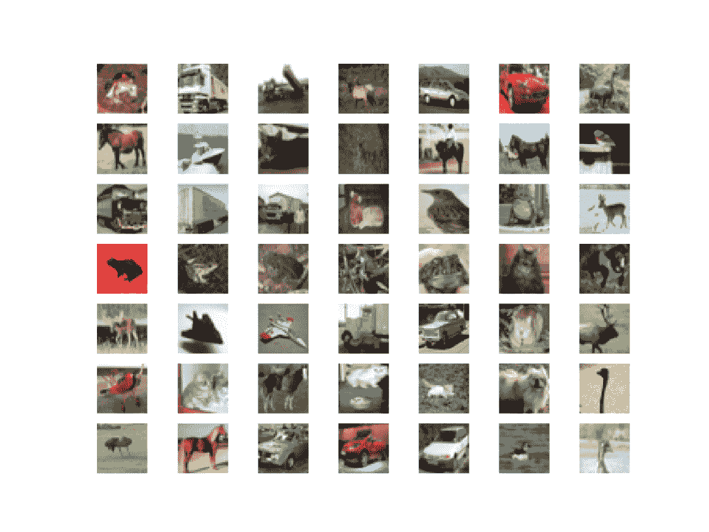
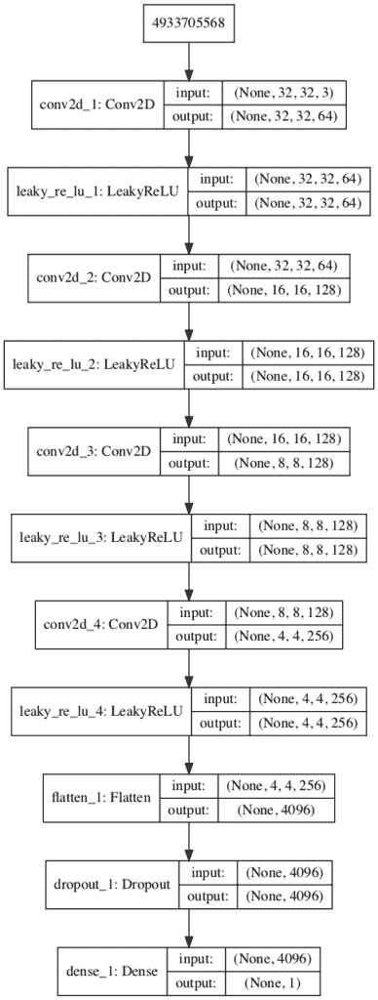
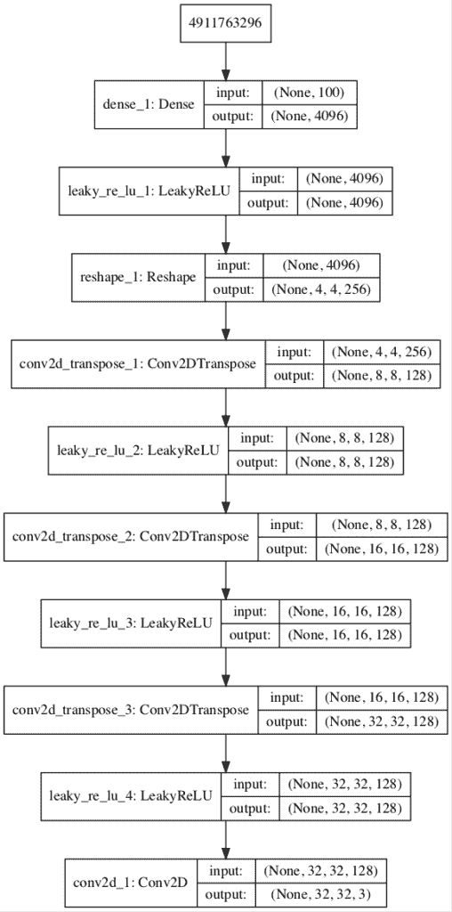
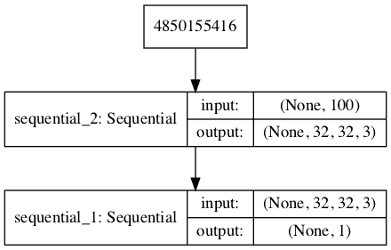
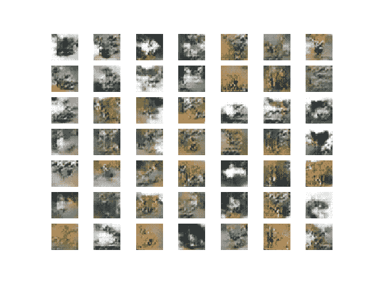
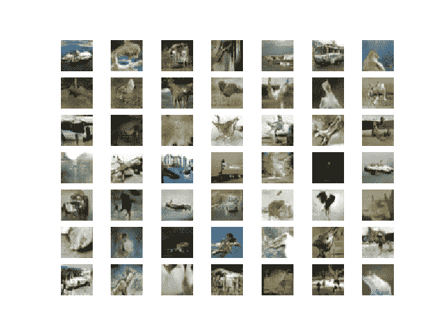
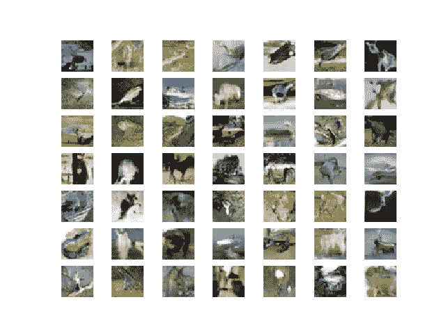
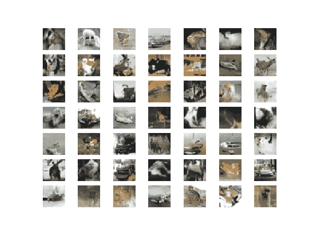
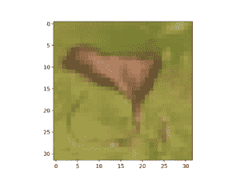

# 如何开发 GAN 来生成 CIFAR10 小型彩色照片

> 原文：<https://machinelearningmastery.com/how-to-develop-a-generative-adversarial-network-for-a-cifar-10-small-object-photographs-from-scratch/>

最后更新于 2020 年 9 月 1 日

生成对抗网络是一种用于训练生成模型的体系结构，例如用于生成图像的深度卷积神经网络。

开发用于生成图像的 GAN 需要用于分类给定图像是真实的还是生成的鉴别器卷积神经网络模型，以及使用逆卷积层将输入转换为像素值的完整二维图像的生成器模型。

理解 GAN 如何工作以及如何在 GAN 架构中训练深度卷积神经网络模型来生成图像可能是一项挑战。对于初学者来说，一个很好的起点是在计算机视觉领域使用的标准图像数据集上练习开发和使用 GANs，例如 CIFAR 小对象照片数据集。使用小型且易于理解的数据集意味着可以快速开发和训练较小的模型，从而可以将重点放在模型架构和图像生成过程本身上。

在本教程中，您将发现如何开发一个带有深度卷积网络的生成对抗网络来生成对象的小照片。

完成本教程后，您将知道:

*   如何定义和训练独立的鉴别器模型来学习真假图像的区别。
*   如何定义独立生成器模型和训练复合生成器和鉴别器模型。
*   如何评估 GAN 的表现并使用最终的独立生成器模型生成新图像。

**用我的新书[Python 生成对抗网络](https://machinelearningmastery.com/generative_adversarial_networks/)启动你的项目**，包括*分步教程*和所有示例的 *Python 源代码*文件。

我们开始吧。

*   **2019 年 7 月**:使用最终模型时更新了功能名称和注释(感谢 Antonio)。


如何为 CIFAR-10 小对象照片开发一个生成对抗网络【从零开始】
图片作者:[高乔治](https://www.flickr.com/photos/141823386@N02/32200477897)，版权所有。

## 教程概述

本教程分为七个部分；它们是:

1.  CIFAR-10 小对象照片数据集
2.  如何定义和训练鉴别器模型
3.  如何定义和使用生成器模型
4.  如何训练发电机模型
5.  如何评估 GAN 模型的表现
6.  CIFAR-10 的完整GAN示例
7.  如何使用最终生成器模型生成图像

## CIFAR-10 小对象照片数据集

CIFAR 是加拿大高级研究所的首字母缩略词, [CIFAR-10 数据集](https://en.wikipedia.org/wiki/CIFAR-10)是由 [CIFAR 研究所](https://www.cs.toronto.edu/~kriz/cifar.html)的研究人员与 CIFAR-100 数据集(将在下一节中介绍)一起开发的。

数据集由 60，000 张 32×32 像素彩色照片组成，这些照片来自 10 个类别的对象，如青蛙、鸟、猫、船、飞机等。

这些都是非常小的图像，比典型的照片小得多，数据集是用于计算机视觉研究的。

Keras 通过 [cifar10.load_dataset()函数](https://keras.io/datasets/#cifar10-small-image-classification)提供对 CIFAR10 数据集的访问。它返回两个元组，一个包含标准训练数据集的输入和输出元素，另一个包含标准测试数据集的输入和输出元素。

下面的示例加载数据集并总结加载数据集的形状。

注意:第一次加载数据集时，Keras 会自动下载图像的压缩版本，并保存在 *~/的主目录下。keras/数据集/* 。下载速度很快，因为压缩形式的数据集只有大约 163 兆字节。

```py
# example of loading the cifar10 dataset
from keras.datasets.cifar10 import load_data
# load the images into memory
(trainX, trainy), (testX, testy) = load_data()
# summarize the shape of the dataset
print('Train', trainX.shape, trainy.shape)
print('Test', testX.shape, testy.shape)
```

运行该示例将加载数据集，并打印训练的输入和输出组件的形状，以及测试图像的分割。

我们可以看到训练集中有 50K 个例子，测试集中有 10K，每个图像都是 32 乘 32 像素的正方形。

```py
Train (50000, 32, 32, 3) (50000, 1)
Test (10000, 32, 32, 3) (10000, 1)
```

图像是彩色的，对象位于框架的中间。

我们可以使用 [imshow()函数](https://matplotlib.org/api/_as_gen/matplotlib.pyplot.imshow.html)使用 matplotlib 库绘制训练数据集中的一些图像。

```py
# plot raw pixel data
pyplot.imshow(trainX[i])
```

以下示例将训练数据集中的前 49 幅图像绘制成一个 7 乘 7 的正方形。

```py
# example of loading and plotting the cifar10 dataset
from keras.datasets.cifar10 import load_data
from matplotlib import pyplot
# load the images into memory
(trainX, trainy), (testX, testy) = load_data()
# plot images from the training dataset
for i in range(49):
	# define subplot
	pyplot.subplot(7, 7, 1 + i)
	# turn off axis
	pyplot.axis('off')
	# plot raw pixel data
	pyplot.imshow(trainX[i])
pyplot.show()
```

运行该示例会创建一个图形，其中包含来自 CIFAR10 训练数据集的 49 幅图像，排列成 7×7 的正方形。

在剧情中，你可以看到飞机、卡车、马、汽车、青蛙等等的小照片。



CIFAR10 数据集的前 49 张小对象照片图。

我们将使用训练数据集中的图像作为训练生成对抗网络的基础。

具体来说，生成器模型将学习如何使用鉴别器生成新的似是而非的对象照片，该鉴别器将尝试区分来自 CIFAR10 训练数据集的真实图像和生成器模型输出的新图像。

这是一个不小的问题，需要适度的生成器和鉴别器模型，这些模型可能在 GPU 硬件上得到最有效的训练。

有关使用廉价的亚马逊 EC2 实例来训练深度学习模型的帮助，请参见帖子:

*   [如何设置亚马逊 AWS EC2 GPUs 训练 Keras 深度学习模型(分步)](https://machinelearningmastery.com/develop-evaluate-large-deep-learning-models-keras-amazon-web-services/)

## 如何定义和训练鉴别器模型

第一步是定义鉴别器模型。

该模型必须从我们的数据集获取一个样本图像作为输入，并输出一个关于样本是真的还是假的分类预测。这是一个二元分类问题。

*   **输入**:三色通道，32×32 像素大小的图像。
*   **输出**:二进制分类，样本真实(或虚假)的可能性。

鉴别器模型有一个正常的卷积层，后面是三个卷积层，使用 2×2 的步长对输入图像进行下采样。该模型没有[汇聚层](https://machinelearningmastery.com/pooling-layers-for-convolutional-neural-networks/)，输出层只有一个节点，具有 sigmoid 激活函数来预测输入样本是真是假。该模型被训练成最小化适用于二进制分类的[二进制交叉熵损失函数](https://machinelearningmastery.com/how-to-choose-loss-functions-when-training-deep-learning-neural-networks/)。

我们将使用一些最佳实践来定义鉴别器模型，例如使用 LeakyReLU 代替 [ReLU](https://machinelearningmastery.com/rectified-linear-activation-function-for-deep-learning-neural-networks/) ，使用 Dropout，以及使用 [Adam 版本的随机梯度下降](https://machinelearningmastery.com/adam-optimization-algorithm-for-deep-learning/)，其[学习率为 0.0002](https://machinelearningmastery.com/learning-rate-for-deep-learning-neural-networks/) ，动量为 0.5。

下面的 *define_discriminator()* 函数定义了鉴别器模型，并参数化了输入图像的大小。

```py
# define the standalone discriminator model
def define_discriminator(in_shape=(32,32,3)):
	model = Sequential()
	# normal
	model.add(Conv2D(64, (3,3), padding='same', input_shape=in_shape))
	model.add(LeakyReLU(alpha=0.2))
	# downsample
	model.add(Conv2D(128, (3,3), strides=(2,2), padding='same'))
	model.add(LeakyReLU(alpha=0.2))
	# downsample
	model.add(Conv2D(128, (3,3), strides=(2,2), padding='same'))
	model.add(LeakyReLU(alpha=0.2))
	# downsample
	model.add(Conv2D(256, (3,3), strides=(2,2), padding='same'))
	model.add(LeakyReLU(alpha=0.2))
	# classifier
	model.add(Flatten())
	model.add(Dropout(0.4))
	model.add(Dense(1, activation='sigmoid'))
	# compile model
	opt = Adam(lr=0.0002, beta_1=0.5)
	model.compile(loss='binary_crossentropy', optimizer=opt, metrics=['accuracy'])
	return model
```

我们可以使用这个函数来定义鉴别器模型并对其进行总结。

下面列出了完整的示例。

```py
# example of defining the discriminator model
from keras.models import Sequential
from keras.optimizers import Adam
from keras.layers import Dense
from keras.layers import Conv2D
from keras.layers import Flatten
from keras.layers import Dropout
from keras.layers import LeakyReLU
from keras.utils.vis_utils import plot_model

# define the standalone discriminator model
def define_discriminator(in_shape=(32,32,3)):
	model = Sequential()
	# normal
	model.add(Conv2D(64, (3,3), padding='same', input_shape=in_shape))
	model.add(LeakyReLU(alpha=0.2))
	# downsample
	model.add(Conv2D(128, (3,3), strides=(2,2), padding='same'))
	model.add(LeakyReLU(alpha=0.2))
	# downsample
	model.add(Conv2D(128, (3,3), strides=(2,2), padding='same'))
	model.add(LeakyReLU(alpha=0.2))
	# downsample
	model.add(Conv2D(256, (3,3), strides=(2,2), padding='same'))
	model.add(LeakyReLU(alpha=0.2))
	# classifier
	model.add(Flatten())
	model.add(Dropout(0.4))
	model.add(Dense(1, activation='sigmoid'))
	# compile model
	opt = Adam(lr=0.0002, beta_1=0.5)
	model.compile(loss='binary_crossentropy', optimizer=opt, metrics=['accuracy'])
	return model

# define model
model = define_discriminator()
# summarize the model
model.summary()
# plot the model
plot_model(model, to_file='discriminator_plot.png', show_shapes=True, show_layer_names=True)
```

运行示例首先总结模型架构，显示每一层的输入和输出。

我们可以看到，激进的 2×2 步长用于对输入图像进行下采样，首先从 32×32 下采样到 16×16，然后在模型进行输出预测之前下采样到 8×8 甚至更多。

这种模式是通过设计实现的，因为我们不使用池化层，而是使用大跨度来实现类似的下采样效果。我们将在下一节的生成器模型中看到类似的模式，但方向相反。

```py
_________________________________________________________________
Layer (type)                 Output Shape              Param #
=================================================================
conv2d_1 (Conv2D)            (None, 32, 32, 64)        1792
_________________________________________________________________
leaky_re_lu_1 (LeakyReLU)    (None, 32, 32, 64)        0
_________________________________________________________________
conv2d_2 (Conv2D)            (None, 16, 16, 128)       73856
_________________________________________________________________
leaky_re_lu_2 (LeakyReLU)    (None, 16, 16, 128)       0
_________________________________________________________________
conv2d_3 (Conv2D)            (None, 8, 8, 128)         147584
_________________________________________________________________
leaky_re_lu_3 (LeakyReLU)    (None, 8, 8, 128)         0
_________________________________________________________________
conv2d_4 (Conv2D)            (None, 4, 4, 256)         295168
_________________________________________________________________
leaky_re_lu_4 (LeakyReLU)    (None, 4, 4, 256)         0
_________________________________________________________________
flatten_1 (Flatten)          (None, 4096)              0
_________________________________________________________________
dropout_1 (Dropout)          (None, 4096)              0
_________________________________________________________________
dense_1 (Dense)              (None, 1)                 4097
=================================================================
Total params: 522,497
Trainable params: 522,497
Non-trainable params: 0
_________________________________________________________________
```

还创建了一个模型图，我们可以看到该模型期望一个向量输入，并将预测一个单一的输出。

**注**:创建此图假设安装了 pydot 和 graphviz 库。如果这是一个问题，您可以注释掉导入语句和对 *plot_model()* 函数的调用。



CIFAR10 生成对抗网络中鉴别器模型的绘制

我们现在可以用类标签为 1 的真实例子开始训练这个模型，并随机生成类标签为 0 的样本。

这些元素的开发将在以后有用，它有助于看到鉴别器只是一个用于二进制分类的普通神经网络模型。

首先，我们需要一个函数来加载和准备真实图像的数据集。

我们将使用 *cifar.load_data()* 函数加载 CIFAR-10 数据集，只使用训练数据集的输入部分作为真实图像。

```py
...
# load cifar10 dataset
(trainX, _), (_, _) = load_data()
```

我们必须[将像素值](https://machinelearningmastery.com/how-to-manually-scale-image-pixel-data-for-deep-learning/)从[0，255]中的无符号整数范围缩放到[-1，1]的归一化范围。

生成器模型将生成像素值在[-1，1]范围内的图像，因为它将使用 tanh 激活函数，这是最佳实践。

将真实图像缩放到相同的范围也是一种很好的做法。

```py
...
# convert from unsigned ints to floats
X = trainX.astype('float32')
# scale from [0,255] to [-1,1]
X = (X - 127.5) / 127.5
```

下面的 *load_real_samples()* 函数实现了真实 CIFAR-10 照片的加载和缩放。

```py
# load and prepare cifar10 training images
def load_real_samples():
	# load cifar10 dataset
	(trainX, _), (_, _) = load_data()
	# convert from unsigned ints to floats
	X = trainX.astype('float32')
	# scale from [0,255] to [-1,1]
	X = (X - 127.5) / 127.5
	return X
```

该模型将分批更新，特别是收集真实样本和生成样本。在训练中，历元被定义为通过整个训练数据集的一次。

我们可以系统地枚举训练数据集中的所有样本，这是一种很好的方法，但是通过随机梯度下降进行良好的训练需要在每个时期之前对训练数据集进行洗牌。一种更简单的方法是从训练数据集中选择图像的随机样本。

下面的 *generate_real_samples()* 函数将以训练数据集为参数，选择图像的随机子样本；它还将返回样本的类标签，特别是类标签 1，以指示真实图像。

```py
# select real samples
def generate_real_samples(dataset, n_samples):
	# choose random instances
	ix = randint(0, dataset.shape[0], n_samples)
	# retrieve selected images
	X = dataset[ix]
	# generate 'real' class labels (1)
	y = ones((n_samples, 1))
	return X, y
```

现在，我们需要一个假图像的来源。

我们还没有一个生成器模型，所以我们可以生成由随机像素值组成的图像，特别是范围[0，1]内的随机像素值，然后像缩放的真实图像一样缩放到范围[-1，1]。

下面的 *generate_fake_samples()* 函数实现了这一行为，并为 fake 生成随机像素值及其关联的类标签为 0 的图像。

```py
# generate n fake samples with class labels
def generate_fake_samples(n_samples):
	# generate uniform random numbers in [0,1]
	X = rand(32 * 32 * 3 * n_samples)
	# update to have the range [-1, 1]
	X = -1 + X * 2
	# reshape into a batch of color images
	X = X.reshape((n_samples, 32, 32, 3))
	# generate 'fake' class labels (0)
	y = zeros((n_samples, 1))
	return X, y
```

最后，我们需要训练鉴别器模型。

这包括重复检索真实图像的样本和生成图像的样本，并在固定的迭代次数内更新模型。

我们现在将忽略时代的概念(例如，通过训练数据集的完整传递)，并为固定数量的批次拟合鉴别器模型。该模型将学会快速辨别真假(随机生成的)图像，因此在学会完美辨别之前不需要很多批次。

*train_discriminator()* 函数实现了这一点，使用 128 个图像的批量大小，其中每次迭代 64 个是真实的，64 个是假的。

我们为真实和虚假的例子分别更新鉴别器，以便我们可以在更新之前计算每个样本上模型的准确性。这让我们深入了解了鉴别器模型在一段时间内的表现。

```py
# train the discriminator model
def train_discriminator(model, dataset, n_iter=20, n_batch=128):
	half_batch = int(n_batch / 2)
	# manually enumerate epochs
	for i in range(n_iter):
		# get randomly selected 'real' samples
		X_real, y_real = generate_real_samples(dataset, half_batch)
		# update discriminator on real samples
		_, real_acc = model.train_on_batch(X_real, y_real)
		# generate 'fake' examples
		X_fake, y_fake = generate_fake_samples(half_batch)
		# update discriminator on fake samples
		_, fake_acc = model.train_on_batch(X_fake, y_fake)
		# summarize performance
		print('>%d real=%.0f%% fake=%.0f%%' % (i+1, real_acc*100, fake_acc*100))
```

将所有这些结合在一起，下面列出了在真实和随机生成(假)图像上训练鉴别器模型实例的完整示例。

```py
# example of training the discriminator model on real and random cifar10 images
from numpy import expand_dims
from numpy import ones
from numpy import zeros
from numpy.random import rand
from numpy.random import randint
from keras.datasets.cifar10 import load_data
from keras.optimizers import Adam
from keras.models import Sequential
from keras.layers import Dense
from keras.layers import Conv2D
from keras.layers import Flatten
from keras.layers import Dropout
from keras.layers import LeakyReLU

# define the standalone discriminator model
def define_discriminator(in_shape=(32,32,3)):
	model = Sequential()
	# normal
	model.add(Conv2D(64, (3,3), padding='same', input_shape=in_shape))
	model.add(LeakyReLU(alpha=0.2))
	# downsample
	model.add(Conv2D(128, (3,3), strides=(2,2), padding='same'))
	model.add(LeakyReLU(alpha=0.2))
	# downsample
	model.add(Conv2D(128, (3,3), strides=(2,2), padding='same'))
	model.add(LeakyReLU(alpha=0.2))
	# downsample
	model.add(Conv2D(256, (3,3), strides=(2,2), padding='same'))
	model.add(LeakyReLU(alpha=0.2))
	# classifier
	model.add(Flatten())
	model.add(Dropout(0.4))
	model.add(Dense(1, activation='sigmoid'))
	# compile model
	opt = Adam(lr=0.0002, beta_1=0.5)
	model.compile(loss='binary_crossentropy', optimizer=opt, metrics=['accuracy'])
	return model

# load and prepare cifar10 training images
def load_real_samples():
	# load cifar10 dataset
	(trainX, _), (_, _) = load_data()
	# convert from unsigned ints to floats
	X = trainX.astype('float32')
	# scale from [0,255] to [-1,1]
	X = (X - 127.5) / 127.5
	return X

# select real samples
def generate_real_samples(dataset, n_samples):
	# choose random instances
	ix = randint(0, dataset.shape[0], n_samples)
	# retrieve selected images
	X = dataset[ix]
	# generate 'real' class labels (1)
	y = ones((n_samples, 1))
	return X, y

# generate n fake samples with class labels
def generate_fake_samples(n_samples):
	# generate uniform random numbers in [0,1]
	X = rand(32 * 32 * 3 * n_samples)
	# update to have the range [-1, 1]
	X = -1 + X * 2
	# reshape into a batch of color images
	X = X.reshape((n_samples, 32, 32, 3))
	# generate 'fake' class labels (0)
	y = zeros((n_samples, 1))
	return X, y

# train the discriminator model
def train_discriminator(model, dataset, n_iter=20, n_batch=128):
	half_batch = int(n_batch / 2)
	# manually enumerate epochs
	for i in range(n_iter):
		# get randomly selected 'real' samples
		X_real, y_real = generate_real_samples(dataset, half_batch)
		# update discriminator on real samples
		_, real_acc = model.train_on_batch(X_real, y_real)
		# generate 'fake' examples
		X_fake, y_fake = generate_fake_samples(half_batch)
		# update discriminator on fake samples
		_, fake_acc = model.train_on_batch(X_fake, y_fake)
		# summarize performance
		print('>%d real=%.0f%% fake=%.0f%%' % (i+1, real_acc*100, fake_acc*100))

# define the discriminator model
model = define_discriminator()
# load image data
dataset = load_real_samples()
# fit the model
train_discriminator(model, dataset)
```

运行该示例首先定义模型，加载 CIFAR-10 数据集，然后训练鉴别器模型。

**注**:考虑到算法或评估程序的随机性，或数值准确率的差异，您的[结果可能会有所不同](https://machinelearningmastery.com/different-results-each-time-in-machine-learning/)。考虑运行该示例几次，并比较平均结果。

在这种情况下，鉴别器模型学会非常快速地分辨真实和随机生成的 CIFAR-10 图像，大约分 20 批。

```py
...
>16 real=100% fake=100%
>17 real=100% fake=100%
>18 real=98% fake=100%
>19 real=100% fake=100%
>20 real=100% fake=100%
```

既然我们知道了如何定义和训练鉴别器模型，我们需要考虑开发生成器模型。

## 如何定义和使用生成器模型

生成器模型负责创建新的、假的但看似合理的对象小照片。

它通过从潜在空间中取一个点作为输入并输出一个正方形彩色图像来实现这一点。

潜在空间是任意定义的[高斯分布值](https://machinelearningmastery.com/statistical-data-distributions/)的向量空间，例如 100 维。它没有任何意义，但是通过从这个空间中随机抽取点，并在训练期间将它们提供给生成器模型，生成器模型将为潜在点以及潜在空间赋予意义，直到训练结束时，潜在向量空间表示输出空间的压缩表示，即 CIFAR-10 图像，只有生成器知道如何变成似是而非的 CIFAR-10 图像。

*   **输入**:潜在空间中的点，例如高斯随机数的 100 元素向量。
*   **输出**:像素值在[-1，1]的 32×32 像素的二维方形彩色图像(3 通道)。

**注**:我们不一定要用一个 100 元素的向量作为输入；这是一个整数，被广泛使用，但我希望 10、50 或 500 也可以。

开发一个生成器模型需要我们将 100 维的潜在空间中的一个向量转换成 32×32×3 或 3，072 个值的 2D 数组。

有许多方法可以实现这一点，但有一种方法在深度卷积生成对抗网络上被证明是有效的。它涉及两个主要因素。

第一个是密集层，作为第一个隐藏层，它有足够的节点来表示输出图像的低分辨率版本。具体来说，输出图像一半大小(四分之一面积)的图像将是 16x16x3，即 768 个节点，四分之一大小(八分之一面积)的图像将是 8 x 8 x 3，即 192 个节点。

通过一些实验，我发现较小的低分辨率版本的图像效果更好。因此，我们将使用 4 x 4 x 3 或 48 个节点。

我们不只是想要一个低分辨率版本的图像；我们想要输入的许多并行版本或解释。这是卷积神经网络中的[模式，其中我们有许多并行滤波器，产生多个并行激活图，称为特征图，对输入有不同的解释。相反，我们想要同样的东西:我们输出的许多并行版本具有不同的学习特性，可以在输出层折叠成最终图像。模型需要空间来发明、创造或生成。](https://machinelearningmastery.com/review-of-architectural-innovations-for-convolutional-neural-networks-for-image-classification/)

因此，第一个隐藏层，密集层，需要足够的节点用于我们输出图像的多个版本，例如 256。

```py
# foundation for 4x4 image
n_nodes = 256 * 4 * 4
model.add(Dense(n_nodes, input_dim=latent_dim))
model.add(LeakyReLU(alpha=0.2))
```

然后，来自这些节点的激活可以被重新整形为类似图像的东西，以传递到卷积层，例如 256 个不同的 4×4 特征图。

```py
model.add(Reshape((4, 4, 256)))
```

下一个主要的架构创新包括将低分辨率图像上采样到图像的更高分辨率版本。

这种上采样过程有两种常见方式，有时称为反卷积。

一种方法是使用一个*upsmampling 2d*层(像一个反向的[池化层](https://machinelearningmastery.com/pooling-layers-for-convolutional-neural-networks/))后跟一个普通的 *Conv2D* 层。另一种或许更现代的方式是将这两种操作组合成一个单一的层，称为*conv2d 转置*。我们将把后一种方法用于我们的生成器。

*conv2d 转置*层可以配置为(2×2) 的[步幅，这将使输入要素地图的面积增加四倍(宽度和高度尺寸增加一倍)。使用作为步长因子的内核大小(例如双倍)来](https://machinelearningmastery.com/padding-and-stride-for-convolutional-neural-networks/)[也是一个很好的做法，以避免在向上采样时有时会观察到的棋盘图案](https://distill.pub/2016/deconv-checkerboard/)。

```py
# upsample to 8x8
model.add(Conv2DTranspose(128, (4,4), strides=(2,2), padding='same'))
model.add(LeakyReLU(alpha=0.2))
```

这可以再重复两次，以获得所需的 32 x 32 输出图像。

同样，我们将使用默认斜率为 0.2 的 LeakyReLU，作为训练 GAN 模型时的最佳实践。

该模型的输出层是一个 Conv2D，三个所需通道有三个过滤器，内核大小为 3×3，相同的*填充，旨在创建一个单一的特征图，并将其尺寸保持在 32×32×3 像素。tanh 激活用于确保输出值在[-1，1]的期望范围内，这是当前的最佳实践。*

 *下面的 *define_generator()* 函数实现了这一点，并定义了生成器模型。

**注**:发电机模型未编译，未指定损失函数或优化算法。这是因为发电机不是直接训练的。我们将在下一节中了解更多信息。

```py
# define the standalone generator model
def define_generator(latent_dim):
	model = Sequential()
	# foundation for 4x4 image
	n_nodes = 256 * 4 * 4
	model.add(Dense(n_nodes, input_dim=latent_dim))
	model.add(LeakyReLU(alpha=0.2))
	model.add(Reshape((4, 4, 256)))
	# upsample to 8x8
	model.add(Conv2DTranspose(128, (4,4), strides=(2,2), padding='same'))
	model.add(LeakyReLU(alpha=0.2))
	# upsample to 16x16
	model.add(Conv2DTranspose(128, (4,4), strides=(2,2), padding='same'))
	model.add(LeakyReLU(alpha=0.2))
	# upsample to 32x32
	model.add(Conv2DTranspose(128, (4,4), strides=(2,2), padding='same'))
	model.add(LeakyReLU(alpha=0.2))
	# output layer
	model.add(Conv2D(3, (3,3), activation='tanh', padding='same'))
	return model
```

我们可以总结模型，以帮助更好地理解输入和输出形状。

下面列出了完整的示例。

```py
# example of defining the generator model
from keras.models import Sequential
from keras.layers import Dense
from keras.layers import Reshape
from keras.layers import Conv2D
from keras.layers import Conv2DTranspose
from keras.layers import LeakyReLU
from keras.utils.vis_utils import plot_model

# define the standalone generator model
def define_generator(latent_dim):
	model = Sequential()
	# foundation for 4x4 image
	n_nodes = 256 * 4 * 4
	model.add(Dense(n_nodes, input_dim=latent_dim))
	model.add(LeakyReLU(alpha=0.2))
	model.add(Reshape((4, 4, 256)))
	# upsample to 8x8
	model.add(Conv2DTranspose(128, (4,4), strides=(2,2), padding='same'))
	model.add(LeakyReLU(alpha=0.2))
	# upsample to 16x16
	model.add(Conv2DTranspose(128, (4,4), strides=(2,2), padding='same'))
	model.add(LeakyReLU(alpha=0.2))
	# upsample to 32x32
	model.add(Conv2DTranspose(128, (4,4), strides=(2,2), padding='same'))
	model.add(LeakyReLU(alpha=0.2))
	# output layer
	model.add(Conv2D(3, (3,3), activation='tanh', padding='same'))
	return model

# define the size of the latent space
latent_dim = 100
# define the generator model
model = define_generator(latent_dim)
# summarize the model
model.summary()
# plot the model
plot_model(model, to_file='generator_plot.png', show_shapes=True, show_layer_names=True)
```

运行该示例总结了模型的层及其输出形状。

我们可以看到，按照设计，第一个隐藏层有 4，096 个参数或 256 x 4，其激活被重新整形为 256 x4 特征图。然后，通过三个*conv2d 转置*层将特征图升级到 32 x 32 的期望输出形状，直到创建三个滤波器图(通道)的输出层。

```py
_________________________________________________________________
Layer (type)                 Output Shape              Param #
=================================================================
dense_1 (Dense)              (None, 4096)              413696
_________________________________________________________________
leaky_re_lu_1 (LeakyReLU)    (None, 4096)              0
_________________________________________________________________
reshape_1 (Reshape)          (None, 4, 4, 256)         0
_________________________________________________________________
conv2d_transpose_1 (Conv2DTr (None, 8, 8, 128)         524416
_________________________________________________________________
leaky_re_lu_2 (LeakyReLU)    (None, 8, 8, 128)         0
_________________________________________________________________
conv2d_transpose_2 (Conv2DTr (None, 16, 16, 128)       262272
_________________________________________________________________
leaky_re_lu_3 (LeakyReLU)    (None, 16, 16, 128)       0
_________________________________________________________________
conv2d_transpose_3 (Conv2DTr (None, 32, 32, 128)       262272
_________________________________________________________________
leaky_re_lu_4 (LeakyReLU)    (None, 32, 32, 128)       0
_________________________________________________________________
conv2d_1 (Conv2D)            (None, 32, 32, 3)         3459
=================================================================
Total params: 1,466,115
Trainable params: 1,466,115
Non-trainable params: 0
_________________________________________________________________
```

还创建了模型的一个图，我们可以看到模型期望来自潜在空间的 100 个元素的点作为输入，并且将预测两个元素的向量作为输出。

**注**:创建此图假设安装了 pydot 和 graphviz 库。如果这是一个问题，您可以注释掉导入语句和对 *plot_model()* 函数的调用。



CIFAR-10 生成对抗网络中的生成者模型图

这种模式目前做不了什么。

然而，我们可以演示如何使用它来生成样本。这是一个很有帮助的演示，可以将生成器理解为另一个模型，其中一些元素在以后会很有用。

第一步是在潜在空间中生成新的点。我们可以通过调用 [randn() NumPy 函数](https://docs.scipy.org/doc/numpy/reference/generated/numpy.random.randn.html)来实现这一点，该函数用于生成从标准高斯分布中提取的随机数的[数组。](https://machinelearningmastery.com/how-to-generate-random-numbers-in-python/)

然后，随机数的数组可以被重新整形为样本，即 n 行，每行 100 个元素。下面的*生成 _ 潜在 _ 点()*函数实现了这一点，并在潜在空间中生成所需数量的点，这些点可用作生成器模型的输入。

```py
# generate points in latent space as input for the generator
def generate_latent_points(latent_dim, n_samples):
	# generate points in the latent space
	x_input = randn(latent_dim * n_samples)
	# reshape into a batch of inputs for the network
	x_input = x_input.reshape(n_samples, latent_dim)
	return x_input
```

接下来，我们可以使用生成的点作为生成器模型的输入来生成新的样本，然后绘制样本。

我们可以更新上一节中的 *generate_fake_samples()* 函数，以生成器模型为参数，使用它来生成所需数量的样本，方法是首先调用*generate _ 潜伏 _points()* 函数来生成潜伏空间中所需数量的点，作为模型的输入。

更新后的 *generate_fake_samples()* 函数如下所示，返回生成的样本和关联的类标签。

```py
# use the generator to generate n fake examples, with class labels
def generate_fake_samples(g_model, latent_dim, n_samples):
	# generate points in latent space
	x_input = generate_latent_points(latent_dim, n_samples)
	# predict outputs
	X = g_model.predict(x_input)
	# create 'fake' class labels (0)
	y = zeros((n_samples, 1))
	return X, y
```

然后，我们可以通过调用 imshow()函数来绘制生成的样本，就像我们在第一部分中所做的真实的 CIFAR-10 示例一样。

下面列出了使用未经培训的生成器模型生成新的 CIFAR-10 映像的完整示例。

```py
# example of defining and using the generator model
from numpy import zeros
from numpy.random import randn
from keras.models import Sequential
from keras.layers import Dense
from keras.layers import Reshape
from keras.layers import Conv2D
from keras.layers import Conv2DTranspose
from keras.layers import LeakyReLU
from matplotlib import pyplot

# define the standalone generator model
def define_generator(latent_dim):
	model = Sequential()
	# foundation for 4x4 image
	n_nodes = 256 * 4 * 4
	model.add(Dense(n_nodes, input_dim=latent_dim))
	model.add(LeakyReLU(alpha=0.2))
	model.add(Reshape((4, 4, 256)))
	# upsample to 8x8
	model.add(Conv2DTranspose(128, (4,4), strides=(2,2), padding='same'))
	model.add(LeakyReLU(alpha=0.2))
	# upsample to 16x16
	model.add(Conv2DTranspose(128, (4,4), strides=(2,2), padding='same'))
	model.add(LeakyReLU(alpha=0.2))
	# upsample to 32x32
	model.add(Conv2DTranspose(128, (4,4), strides=(2,2), padding='same'))
	model.add(LeakyReLU(alpha=0.2))
	# output layer
	model.add(Conv2D(3, (3,3), activation='tanh', padding='same'))
	return model

# generate points in latent space as input for the generator
def generate_latent_points(latent_dim, n_samples):
	# generate points in the latent space
	x_input = randn(latent_dim * n_samples)
	# reshape into a batch of inputs for the network
	x_input = x_input.reshape(n_samples, latent_dim)
	return x_input

# use the generator to generate n fake examples, with class labels
def generate_fake_samples(g_model, latent_dim, n_samples):
	# generate points in latent space
	x_input = generate_latent_points(latent_dim, n_samples)
	# predict outputs
	X = g_model.predict(x_input)
	# create 'fake' class labels (0)
	y = zeros((n_samples, 1))
	return X, y

# size of the latent space
latent_dim = 100
# define the discriminator model
model = define_generator(latent_dim)
# generate samples
n_samples = 49
X, _ = generate_fake_samples(model, latent_dim, n_samples)
# scale pixel values from [-1,1] to [0,1]
X = (X + 1) / 2.0
# plot the generated samples
for i in range(n_samples):
	# define subplot
	pyplot.subplot(7, 7, 1 + i)
	# turn off axis labels
	pyplot.axis('off')
	# plot single image
	pyplot.imshow(X[i])
# show the figure
pyplot.show()
```

运行该示例会生成 49 个伪造的 CIFAR-10 图像示例，并在一个 7 乘 7 的图像图上可视化它们。

由于模型未经训练，生成的图像完全是[-1，1]中的随机像素值，重新缩放为[0，1]。正如我们所料，图像看起来像一团灰色。


未经训练的生成器模型输出的 49 幅 CIFAR-10 图像示例

既然我们知道了如何定义和使用生成器模型，下一步就是训练模型。

## 如何训练发电机模型

生成器模型中的权重根据鉴别器模型的表现进行更新。

当鉴别器擅长检测假样本时，生成器更新较多，当鉴别器模型在检测假样本时相对较差或混乱时，生成器模型更新较少。

这就定义了这两种模式之间的零和或对立关系。

使用 Keras API 实现这一点可能有很多方法，但最简单的方法可能是创建一个新的模型，将生成器和鉴别器模型结合起来。

具体而言，可以定义新的 GAN 模型，该模型堆叠生成器和鉴别器，使得生成器接收潜在空间中的随机点作为输入，并生成样本，这些样本被直接馈送到鉴别器模型中，进行分类，并且该更大模型的输出可以用于更新生成器的模型权重。

明确地说，我们不是在谈论新的第三个模型，只是一个新的逻辑模型，它使用独立生成器和鉴别器模型中已经定义的层和权重。

只有鉴别器关心的是区分真实和虚假的例子，因此鉴别器模型可以以独立的方式对每个例子进行训练，就像我们在上面的鉴别器模型部分所做的那样。

生成器模型只关心鉴别器在假例子上的表现。因此，当它是 GAN 模型的一部分时，我们将把鉴别器中的所有层标记为不可训练的，这样它们就不能被更新和过度训练在假的例子上。

当通过这个逻辑 GAN 模型训练生成器时，还有一个更重要的变化。我们希望鉴别器认为生成器输出的样本是真实的，而不是伪造的。因此，当生成器被训练为 GAN 模型的一部分时，我们将把生成的样本标记为真实的(类 1)。

**我们为什么要这样做？**

我们可以想象，鉴别器然后将生成的样本分类为不真实(类别 0)或真实概率低(0.3 或 0.5)。用于更新模型权重的反向传播过程将认为这是一个很大的误差，并将更新模型权重(即，仅生成器中的权重)来纠正这个误差，这又使得生成器更好地生成好的假样本。

让我们把这个具体化。

*   **输入**:潜在空间中的点，例如高斯随机数的 100 元素向量。
*   **输出**:二进制分类，样本真实(或虚假)的可能性。

下面的 *define_gan()* 函数将已经定义的生成器和鉴别器模型作为参数，并创建包含这两个模型的新的逻辑第三模型。鉴别器中的权重被标记为不可训练，这仅影响 GAN 模型看到的权重，而不影响独立鉴别器模型。

然后，GAN 模型使用与鉴别器相同的二元交叉熵损失函数和高效的 [Adam 版本的随机梯度下降](https://machinelearningmastery.com/adam-optimization-algorithm-for-deep-learning/)，学习率为 0.0002，动量为 0.5，这是在训练深度卷积 GAN 时推荐的。

```py
# define the combined generator and discriminator model, for updating the generator
def define_gan(g_model, d_model):
	# make weights in the discriminator not trainable
	d_model.trainable = False
	# connect them
	model = Sequential()
	# add generator
	model.add(g_model)
	# add the discriminator
	model.add(d_model)
	# compile model
	opt = Adam(lr=0.0002, beta_1=0.5)
	model.compile(loss='binary_crossentropy', optimizer=opt)
	return model
```

使鉴别器不可训练是 Keras API 中的一个聪明的技巧。

可训练属性会在模型编译后影响模型。鉴别器模型是用可训练层编译的，因此当通过调用 *train_on_batch()* 函数更新独立模型时，这些层中的模型权重将被更新。

然后将鉴别器模型标记为不可训练，添加到 GAN 模型中，并进行编译。在该模型中，鉴别器模型的模型权重是不可训练的，并且当通过调用 *train_on_batch()* 函数更新 GAN 模型时，不能改变。可训练属性的这种变化不会影响独立鉴别器模型的训练。

这里的 Keras API 文档中描述了这种行为:

*   [如何“冻结”Keras 层？](https://keras.io/getting-started/faq/#how-can-i-freeze-keras-layers)

下面列出了创建鉴别器、生成器和复合模型的完整示例。

```py
# demonstrate creating the three models in the gan
from keras.optimizers import Adam
from keras.models import Sequential
from keras.layers import Dense
from keras.layers import Reshape
from keras.layers import Flatten
from keras.layers import Conv2D
from keras.layers import Conv2DTranspose
from keras.layers import LeakyReLU
from keras.layers import Dropout
from keras.utils.vis_utils import plot_model

# define the standalone discriminator model
def define_discriminator(in_shape=(32,32,3)):
	model = Sequential()
	# normal
	model.add(Conv2D(64, (3,3), padding='same', input_shape=in_shape))
	model.add(LeakyReLU(alpha=0.2))
	# downsample
	model.add(Conv2D(128, (3,3), strides=(2,2), padding='same'))
	model.add(LeakyReLU(alpha=0.2))
	# downsample
	model.add(Conv2D(128, (3,3), strides=(2,2), padding='same'))
	model.add(LeakyReLU(alpha=0.2))
	# downsample
	model.add(Conv2D(256, (3,3), strides=(2,2), padding='same'))
	model.add(LeakyReLU(alpha=0.2))
	# classifier
	model.add(Flatten())
	model.add(Dropout(0.4))
	model.add(Dense(1, activation='sigmoid'))
	# compile model
	opt = Adam(lr=0.0002, beta_1=0.5)
	model.compile(loss='binary_crossentropy', optimizer=opt, metrics=['accuracy'])
	return model

# define the standalone generator model
def define_generator(latent_dim):
	model = Sequential()
	# foundation for 4x4 image
	n_nodes = 256 * 4 * 4
	model.add(Dense(n_nodes, input_dim=latent_dim))
	model.add(LeakyReLU(alpha=0.2))
	model.add(Reshape((4, 4, 256)))
	# upsample to 8x8
	model.add(Conv2DTranspose(128, (4,4), strides=(2,2), padding='same'))
	model.add(LeakyReLU(alpha=0.2))
	# upsample to 16x16
	model.add(Conv2DTranspose(128, (4,4), strides=(2,2), padding='same'))
	model.add(LeakyReLU(alpha=0.2))
	# upsample to 32x32
	model.add(Conv2DTranspose(128, (4,4), strides=(2,2), padding='same'))
	model.add(LeakyReLU(alpha=0.2))
	# output layer
	model.add(Conv2D(3, (3,3), activation='tanh', padding='same'))
	return model

# define the combined generator and discriminator model, for updating the generator
def define_gan(g_model, d_model):
	# make weights in the discriminator not trainable
	d_model.trainable = False
	# connect them
	model = Sequential()
	# add generator
	model.add(g_model)
	# add the discriminator
	model.add(d_model)
	# compile model
	opt = Adam(lr=0.0002, beta_1=0.5)
	model.compile(loss='binary_crossentropy', optimizer=opt)
	return model

# size of the latent space
latent_dim = 100
# create the discriminator
d_model = define_discriminator()
# create the generator
g_model = define_generator(latent_dim)
# create the gan
gan_model = define_gan(g_model, d_model)
# summarize gan model
gan_model.summary()
# plot gan model
plot_model(gan_model, to_file='gan_plot.png', show_shapes=True, show_layer_names=True)
```

运行这个例子首先会创建一个复合模型的概要，这是非常无趣的。

我们可以看到，该模型期望 CIFAR-10 图像作为输入，并预测单个值作为输出。

```py
_________________________________________________________________
Layer (type)                 Output Shape              Param #
=================================================================
sequential_2 (Sequential)    (None, 32, 32, 3)         1466115
_________________________________________________________________
sequential_1 (Sequential)    (None, 1)                 522497
=================================================================
Total params: 1,988,612
Trainable params: 1,466,115
Non-trainable params: 522,497
_________________________________________________________________
```

还创建了模型的图，我们可以看到模型期望潜在空间中的 100 元素点作为输入，并将预测单个输出分类标签。

**注**:创建此图假设安装了 pydot 和 graphviz 库。如果这是一个问题，您可以注释掉导入语句和对 *plot_model()* 函数的调用。



CIFAR-10 生成对抗网络中复合发生器和鉴别器模型的绘制

训练复合模型包括通过上一节中的*generate _ 潜伏 _points()* 函数在潜伏空间中生成一批有价值的点，class=1 标签并调用 *train_on_batch()* 函数。

下面的 *train_gan()* 函数演示了这一点，尽管它非常简单，因为每个时期只有生成器会被更新，从而给鉴别器留下默认的模型权重。

```py
# train the composite model
def train_gan(gan_model, latent_dim, n_epochs=200, n_batch=128):
	# manually enumerate epochs
	for i in range(n_epochs):
		# prepare points in latent space as input for the generator
		x_gan = generate_latent_points(latent_dim, n_batch)
		# create inverted labels for the fake samples
		y_gan = ones((n_batch, 1))
		# update the generator via the discriminator's error
		gan_model.train_on_batch(x_gan, y_gan)
```

相反，我们需要的是首先用真样本和假样本更新鉴别器模型，然后通过复合模型更新生成器。

这需要组合以上鉴别器部分定义的 *train_discriminator()* 函数和以上定义的 *train_gan()* 函数中的元素。它还要求我们列举一个时代内的时代和批次。

下面列出了更新鉴别器模型和生成器(通过复合模型)的完整训练函数。

在这个模型训练函数中需要注意一些事情。

首先，一个时期内的批次数量由批次大小划分到训练数据集中的次数来定义。我们的数据集大小为 50K 个样本，因此向下舍入后，每个时期有 390 个批次。

鉴别器模型每批更新两次，一次用真实样本，一次用假样本，这是最佳实践，与合并样本并执行单次更新相反。

最后，我们报告每批的损失。保持对批次损失的关注至关重要。其原因是鉴别器丢失的崩溃表明生成器模型已经开始生成鉴别器可以轻松鉴别的垃圾例子。

监控鉴别器损耗，预计每批在 0.5 到 0.8 之间徘徊。发电机损耗不太重要，可能在 0.5 和 2 或更高之间徘徊。一个聪明的程序员甚至可能试图检测鉴别器的崩溃丢失，暂停，然后重新开始训练过程。

```py
# train the generator and discriminator
def train(g_model, d_model, gan_model, dataset, latent_dim, n_epochs=200, n_batch=128):
	bat_per_epo = int(dataset.shape[0] / n_batch)
	half_batch = int(n_batch / 2)
	# manually enumerate epochs
	for i in range(n_epochs):
		# enumerate batches over the training set
		for j in range(bat_per_epo):
			# get randomly selected 'real' samples
			X_real, y_real = generate_real_samples(dataset, half_batch)
			# update discriminator model weights
			d_loss1, _ = d_model.train_on_batch(X_real, y_real)
			# generate 'fake' examples
			X_fake, y_fake = generate_fake_samples(g_model, latent_dim, half_batch)
			# update discriminator model weights
			d_loss2, _ = d_model.train_on_batch(X_fake, y_fake)
			# prepare points in latent space as input for the generator
			X_gan = generate_latent_points(latent_dim, n_batch)
			# create inverted labels for the fake samples
			y_gan = ones((n_batch, 1))
			# update the generator via the discriminator's error
			g_loss = gan_model.train_on_batch(X_gan, y_gan)
			# summarize loss on this batch
			print('>%d, %d/%d, d1=%.3f, d2=%.3f g=%.3f' %
				(i+1, j+1, bat_per_epo, d_loss1, d_loss2, g_loss))
```

我们几乎拥有为 CIFAR-10 对象照片数据集开发 GAN 所需的一切。

剩下的一个方面是对模型的评估。

## 如何评估 GAN 模型的表现

通常，没有客观的方法来评估 GAN 模型的表现。

我们无法计算生成图像的客观误差分数。

相反，图像必须由人工操作员主观评估质量。这意味着，如果不查看生成的图像示例，我们就无法知道何时停止训练。反过来，训练过程的对抗性意味着生成器在每一批之后都在变化，这意味着一旦能够生成足够好的图像，图像的主观质量可能会随着后续的更新而开始变化、提高甚至下降。

有三种方法可以处理这种复杂的训练情况。

1.  定期评估真假图像鉴别器的分类准确率。
2.  定期生成许多图像，并保存到文件中进行主观审查。
3.  定期保存发电机模型。

对于给定的训练时期，可以同时执行所有这三个动作，例如每 10 个训练时期。结果将是一个保存的生成器模型，对于该模型，我们有一种主观评估其输出质量的方法，并且客观地知道在保存模型时鉴别器被愚弄的程度。

在许多时期，例如数百或数千个时期，训练 GAN 将产生模型的许多快照，这些快照可以被检查，并且可以从中挑选特定的输出和模型供以后使用。

首先，我们可以定义一个名为*summary _ performance()*的函数，它将总结鉴别器模型的表现。它通过检索真实 CIFAR-10 图像的样本，以及用生成器模型生成相同数量的假 CIFAR-10 图像，然后评估鉴别器模型对每个样本的分类准确率，并报告这些分数来实现这一点。

```py
# evaluate the discriminator, plot generated images, save generator model
def summarize_performance(epoch, g_model, d_model, dataset, latent_dim, n_samples=150):
	# prepare real samples
	X_real, y_real = generate_real_samples(dataset, n_samples)
	# evaluate discriminator on real examples
	_, acc_real = d_model.evaluate(X_real, y_real, verbose=0)
	# prepare fake examples
	x_fake, y_fake = generate_fake_samples(g_model, latent_dim, n_samples)
	# evaluate discriminator on fake examples
	_, acc_fake = d_model.evaluate(x_fake, y_fake, verbose=0)
	# summarize discriminator performance
	print('>Accuracy real: %.0f%%, fake: %.0f%%' % (acc_real*100, acc_fake*100))
```

该功能可以从*列车()*功能中基于当前历元号调用，如每 10 个历元调用一次。

```py
# train the generator and discriminator
def train(g_model, d_model, gan_model, dataset, latent_dim, n_epochs=200, n_batch=128):
	bat_per_epo = int(dataset.shape[0] / n_batch)
	half_batch = int(n_batch / 2)
	# manually enumerate epochs
	for i in range(n_epochs):
	...
	# evaluate the model performance, sometimes
	if (i+1) % 10 == 0:
		summarize_performance(i, g_model, d_model, dataset, latent_dim)
```

接下来，我们可以更新*summary _ performance()*函数，以保存模型并创建和保存绘图生成的示例。

通过调用发电机模型上的 *save()* 函数，并根据训练时期号提供唯一的文件名，可以保存发电机模型。

```py
...
# save the generator model tile file
filename = 'generator_model_%03d.h5' % (epoch+1)
g_model.save(filename)
```

我们可以开发一个函数来创建生成样本的图。

当我们在 100 张生成的 CIFAR-10 图像上评估鉴别器时，我们可以将大约一半(或 49 张)绘制为 7 乘 7 的网格。下面的 *save_plot()* 函数实现了这一点，再次使用基于纪元号的唯一文件名保存结果图。

```py
# create and save a plot of generated images
def save_plot(examples, epoch, n=7):
	# scale from [-1,1] to [0,1]
	examples = (examples + 1) / 2.0
	# plot images
	for i in range(n * n):
		# define subplot
		pyplot.subplot(n, n, 1 + i)
		# turn off axis
		pyplot.axis('off')
		# plot raw pixel data
		pyplot.imshow(examples[i])
	# save plot to file
	filename = 'generated_plot_e%03d.png' % (epoch+1)
	pyplot.savefig(filename)
	pyplot.close()
```

添加了这些内容的更新后的*summary _ performance()*功能如下所示。

```py
# evaluate the discriminator, plot generated images, save generator model
def summarize_performance(epoch, g_model, d_model, dataset, latent_dim, n_samples=150):
	# prepare real samples
	X_real, y_real = generate_real_samples(dataset, n_samples)
	# evaluate discriminator on real examples
	_, acc_real = d_model.evaluate(X_real, y_real, verbose=0)
	# prepare fake examples
	x_fake, y_fake = generate_fake_samples(g_model, latent_dim, n_samples)
	# evaluate discriminator on fake examples
	_, acc_fake = d_model.evaluate(x_fake, y_fake, verbose=0)
	# summarize discriminator performance
	print('>Accuracy real: %.0f%%, fake: %.0f%%' % (acc_real*100, acc_fake*100))
	# save plot
	save_plot(x_fake, epoch)
	# save the generator model tile file
	filename = 'generator_model_%03d.h5' % (epoch+1)
	g_model.save(filename)
```

## CIFAR-10 的完整GAN示例

我们现在拥有了在 CIFAR-10 小对象照片数据集上训练和评估 GAN 所需的一切。

下面列出了完整的示例。

**注意**:这个例子可以在一个 CPU 上运行，但是可能需要几个小时。该示例可以在图形处理器上运行，例如亚马逊 EC2 p3 实例，并将在几分钟内完成。

有关设置 AWS EC2 实例以运行此代码的帮助，请参见教程:

*   [如何设置亚马逊 AWS EC2 GPUs 训练 Keras 深度学习模型(分步)](https://machinelearningmastery.com/develop-evaluate-large-deep-learning-models-keras-amazon-web-services/)

```py
# example of a dcgan on cifar10
from numpy import expand_dims
from numpy import zeros
from numpy import ones
from numpy import vstack
from numpy.random import randn
from numpy.random import randint
from keras.datasets.cifar10 import load_data
from keras.optimizers import Adam
from keras.models import Sequential
from keras.layers import Dense
from keras.layers import Reshape
from keras.layers import Flatten
from keras.layers import Conv2D
from keras.layers import Conv2DTranspose
from keras.layers import LeakyReLU
from keras.layers import Dropout
from matplotlib import pyplot

# define the standalone discriminator model
def define_discriminator(in_shape=(32,32,3)):
	model = Sequential()
	# normal
	model.add(Conv2D(64, (3,3), padding='same', input_shape=in_shape))
	model.add(LeakyReLU(alpha=0.2))
	# downsample
	model.add(Conv2D(128, (3,3), strides=(2,2), padding='same'))
	model.add(LeakyReLU(alpha=0.2))
	# downsample
	model.add(Conv2D(128, (3,3), strides=(2,2), padding='same'))
	model.add(LeakyReLU(alpha=0.2))
	# downsample
	model.add(Conv2D(256, (3,3), strides=(2,2), padding='same'))
	model.add(LeakyReLU(alpha=0.2))
	# classifier
	model.add(Flatten())
	model.add(Dropout(0.4))
	model.add(Dense(1, activation='sigmoid'))
	# compile model
	opt = Adam(lr=0.0002, beta_1=0.5)
	model.compile(loss='binary_crossentropy', optimizer=opt, metrics=['accuracy'])
	return model

# define the standalone generator model
def define_generator(latent_dim):
	model = Sequential()
	# foundation for 4x4 image
	n_nodes = 256 * 4 * 4
	model.add(Dense(n_nodes, input_dim=latent_dim))
	model.add(LeakyReLU(alpha=0.2))
	model.add(Reshape((4, 4, 256)))
	# upsample to 8x8
	model.add(Conv2DTranspose(128, (4,4), strides=(2,2), padding='same'))
	model.add(LeakyReLU(alpha=0.2))
	# upsample to 16x16
	model.add(Conv2DTranspose(128, (4,4), strides=(2,2), padding='same'))
	model.add(LeakyReLU(alpha=0.2))
	# upsample to 32x32
	model.add(Conv2DTranspose(128, (4,4), strides=(2,2), padding='same'))
	model.add(LeakyReLU(alpha=0.2))
	# output layer
	model.add(Conv2D(3, (3,3), activation='tanh', padding='same'))
	return model

# define the combined generator and discriminator model, for updating the generator
def define_gan(g_model, d_model):
	# make weights in the discriminator not trainable
	d_model.trainable = False
	# connect them
	model = Sequential()
	# add generator
	model.add(g_model)
	# add the discriminator
	model.add(d_model)
	# compile model
	opt = Adam(lr=0.0002, beta_1=0.5)
	model.compile(loss='binary_crossentropy', optimizer=opt)
	return model

# load and prepare cifar10 training images
def load_real_samples():
	# load cifar10 dataset
	(trainX, _), (_, _) = load_data()
	# convert from unsigned ints to floats
	X = trainX.astype('float32')
	# scale from [0,255] to [-1,1]
	X = (X - 127.5) / 127.5
	return X

# select real samples
def generate_real_samples(dataset, n_samples):
	# choose random instances
	ix = randint(0, dataset.shape[0], n_samples)
	# retrieve selected images
	X = dataset[ix]
	# generate 'real' class labels (1)
	y = ones((n_samples, 1))
	return X, y

# generate points in latent space as input for the generator
def generate_latent_points(latent_dim, n_samples):
	# generate points in the latent space
	x_input = randn(latent_dim * n_samples)
	# reshape into a batch of inputs for the network
	x_input = x_input.reshape(n_samples, latent_dim)
	return x_input

# use the generator to generate n fake examples, with class labels
def generate_fake_samples(g_model, latent_dim, n_samples):
	# generate points in latent space
	x_input = generate_latent_points(latent_dim, n_samples)
	# predict outputs
	X = g_model.predict(x_input)
	# create 'fake' class labels (0)
	y = zeros((n_samples, 1))
	return X, y

# create and save a plot of generated images
def save_plot(examples, epoch, n=7):
	# scale from [-1,1] to [0,1]
	examples = (examples + 1) / 2.0
	# plot images
	for i in range(n * n):
		# define subplot
		pyplot.subplot(n, n, 1 + i)
		# turn off axis
		pyplot.axis('off')
		# plot raw pixel data
		pyplot.imshow(examples[i])
	# save plot to file
	filename = 'generated_plot_e%03d.png' % (epoch+1)
	pyplot.savefig(filename)
	pyplot.close()

# evaluate the discriminator, plot generated images, save generator model
def summarize_performance(epoch, g_model, d_model, dataset, latent_dim, n_samples=150):
	# prepare real samples
	X_real, y_real = generate_real_samples(dataset, n_samples)
	# evaluate discriminator on real examples
	_, acc_real = d_model.evaluate(X_real, y_real, verbose=0)
	# prepare fake examples
	x_fake, y_fake = generate_fake_samples(g_model, latent_dim, n_samples)
	# evaluate discriminator on fake examples
	_, acc_fake = d_model.evaluate(x_fake, y_fake, verbose=0)
	# summarize discriminator performance
	print('>Accuracy real: %.0f%%, fake: %.0f%%' % (acc_real*100, acc_fake*100))
	# save plot
	save_plot(x_fake, epoch)
	# save the generator model tile file
	filename = 'generator_model_%03d.h5' % (epoch+1)
	g_model.save(filename)

# train the generator and discriminator
def train(g_model, d_model, gan_model, dataset, latent_dim, n_epochs=200, n_batch=128):
	bat_per_epo = int(dataset.shape[0] / n_batch)
	half_batch = int(n_batch / 2)
	# manually enumerate epochs
	for i in range(n_epochs):
		# enumerate batches over the training set
		for j in range(bat_per_epo):
			# get randomly selected 'real' samples
			X_real, y_real = generate_real_samples(dataset, half_batch)
			# update discriminator model weights
			d_loss1, _ = d_model.train_on_batch(X_real, y_real)
			# generate 'fake' examples
			X_fake, y_fake = generate_fake_samples(g_model, latent_dim, half_batch)
			# update discriminator model weights
			d_loss2, _ = d_model.train_on_batch(X_fake, y_fake)
			# prepare points in latent space as input for the generator
			X_gan = generate_latent_points(latent_dim, n_batch)
			# create inverted labels for the fake samples
			y_gan = ones((n_batch, 1))
			# update the generator via the discriminator's error
			g_loss = gan_model.train_on_batch(X_gan, y_gan)
			# summarize loss on this batch
			print('>%d, %d/%d, d1=%.3f, d2=%.3f g=%.3f' %
				(i+1, j+1, bat_per_epo, d_loss1, d_loss2, g_loss))
		# evaluate the model performance, sometimes
		if (i+1) % 10 == 0:
			summarize_performance(i, g_model, d_model, dataset, latent_dim)

# size of the latent space
latent_dim = 100
# create the discriminator
d_model = define_discriminator()
# create the generator
g_model = define_generator(latent_dim)
# create the gan
gan_model = define_gan(g_model, d_model)
# load image data
dataset = load_real_samples()
# train model
train(g_model, d_model, gan_model, dataset, latent_dim)
```

所选择的配置导致生成模型和判别模型的稳定训练。

每批报告一次模型表现，包括区分模型( *d* )和生成模型( *g* )的损失。

**注**:考虑到算法或评估程序的随机性，或数值准确率的差异，您的[结果可能会有所不同](https://machinelearningmastery.com/different-results-each-time-in-machine-learning/)。考虑运行该示例几次，并比较平均结果。

在这种情况下，损失在整个训练过程中保持稳定。真实例子和生成例子的鉴别器损耗在 0.5 左右，而通过鉴别器训练的生成器在大部分训练过程中的损耗在 1.5 左右。

```py
>1, 1/390, d1=0.720, d2=0.695 g=0.692
>1, 2/390, d1=0.658, d2=0.697 g=0.691
>1, 3/390, d1=0.604, d2=0.700 g=0.687
>1, 4/390, d1=0.522, d2=0.709 g=0.680
>1, 5/390, d1=0.417, d2=0.731 g=0.662
...
>200, 386/390, d1=0.499, d2=0.401 g=1.565
>200, 387/390, d1=0.459, d2=0.623 g=1.481
>200, 388/390, d1=0.588, d2=0.556 g=1.700
>200, 389/390, d1=0.579, d2=0.288 g=1.555
>200, 390/390, d1=0.620, d2=0.453 g=1.466
```

生成器每 10 个时期评估一次，产生 20 个评估、20 个生成的图像图和 20 个保存的模型。

在这种情况下，我们可以看到准确率随着训练而波动。当查看鉴别器模型的准确度分数与生成的图像一致时，我们可以看到假例子的准确度与图像的主观质量没有很好的关联，但是真实例子的准确度可能有关联。

这是一个粗略的，可能不可靠的 GAN 表现指标，以及损失。

```py
>Accuracy real: 55%, fake: 89%
>Accuracy real: 50%, fake: 75%
>Accuracy real: 49%, fake: 86%
>Accuracy real: 60%, fake: 79%
>Accuracy real: 49%, fake: 87%
...
```

超出某个点的更多训练并不意味着生成的图像质量更好。

在这种情况下，10 个时代后的结果是低质量的，尽管我们可以看到背景和前景之间的一些差异，每个图像中间有一个博客。



10 个时代后 49 张GAN生成的 CIFAR-10 照片图

在 90 或 100 个时代之后，我们开始看到看似可信的照片，斑点看起来像鸟、狗、猫和马。

这些对象很熟悉，类似于 CIFAR-10，但其中许多显然不是 10 个指定类之一。



90 年代后 49 张GAN生成的 CIFAR-10 照片图



100 个时代后 49 张GAN生成的 CIFAR-10 照片图

该模型在接下来的 100 个时期内保持稳定，生成的图像几乎没有重大改进。

这些小照片仍然模糊地像 CIFAR-10，并且聚焦于像狗、猫和鸟这样的动物。



200 年后 49 张GAN生成的 CIFAR-10 照片图

## 如何使用最终生成器模型生成图像

一旦选择了最终的生成器模型，它就可以独立地用于您的应用程序。

这包括首先从文件中加载模型，然后使用它生成图像。每个图像的生成需要潜在空间中的一个点作为输入。

下面列出了加载保存的模型并生成图像的完整示例。在这种情况下，我们将使用在 200 个训练时期之后保存的模型，但是在 100 个时期之后保存的模型也同样有效。

```py
# example of loading the generator model and generating images
from keras.models import load_model
from numpy.random import randn
from matplotlib import pyplot

# generate points in latent space as input for the generator
def generate_latent_points(latent_dim, n_samples):
	# generate points in the latent space
	x_input = randn(latent_dim * n_samples)
	# reshape into a batch of inputs for the network
	x_input = x_input.reshape(n_samples, latent_dim)
	return x_input

# plot the generated images
def create_plot(examples, n):
	# plot images
	for i in range(n * n):
		# define subplot
		pyplot.subplot(n, n, 1 + i)
		# turn off axis
		pyplot.axis('off')
		# plot raw pixel data
		pyplot.imshow(examples[i, :, :])
	pyplot.show()

# load model
model = load_model('generator_model_200.h5')
# generate images
latent_points = generate_latent_points(100, 100)
# generate images
X = model.predict(latent_points)
# scale from [-1,1] to [0,1]
X = (X + 1) / 2.0
# plot the result
create_plot(X, 10)
```

运行该示例首先加载模型，对潜在空间中的 100 个随机点进行采样，生成 100 幅图像，然后将结果绘制为一幅图像。

**注**:考虑到算法或评估程序的随机性，或数值准确率的差异，您的[结果可能会有所不同](https://machinelearningmastery.com/different-results-each-time-in-machine-learning/)。考虑运行该示例几次，并比较平均结果。

我们可以看到大多数图像都是可信的，或者说是小对象的可信碎片。

我能看见狗、猫、马、鸟、青蛙，也许还有飞机。


100 张GAN生成的 CIFAR-10 小对象照片示例

潜在空间现在定义了 CIFAR-10 照片的压缩表示。

你可以尝试在这个空间中生成不同的点，看看它们生成什么类型的图像。

下面的示例使用所有 0.75 个值的向量生成一幅图像。

```py
# example of generating an image for a specific point in the latent space
from keras.models import load_model
from numpy import asarray
from matplotlib import pyplot
# load model
model = load_model('generator_model_200.h5')
# all 0s
vector = asarray([[0.75 for _ in range(100)]])
# generate image
X = model.predict(vector)
# scale from [-1,1] to [0,1]
X = (X + 1) / 2.0
# plot the result
pyplot.imshow(X[0, :, :])
pyplot.show()
```

**注**:考虑到算法或评估程序的随机性，或数值准确率的差异，您的[结果可能会有所不同](https://machinelearningmastery.com/different-results-each-time-in-machine-learning/)。考虑运行该示例几次，并比较平均结果。

在这种情况下，向量全为 0.75 会导致绿野中出现一只鹿或者看起来像鹿马的动物。



潜在空间中特定点的 GAN 生成的 CIFAR 小对象照片示例

## 扩展ˌ扩张

本节列出了一些您可能希望探索的扩展教程的想法。

*   **改变潜伏空间**。更新示例以使用更大或更小的潜在空间，并比较结果质量和训练速度。
*   **批量归一化**。更新鉴别器和/或生成器，以利用批处理标准化，推荐用于 DCGAN 模型。
*   **标签平滑**。更新示例以在训练鉴别器时使用单侧标签平滑，具体来说，将真实示例的目标标签从 1.0 更改为 0.9 并添加随机噪声，然后查看对图像质量和训练速度的影响。
*   **型号配置**。更新模型配置，以使用更深或更浅的鉴别器和/或生成器模型，也许可以在生成器中实验 UpSampling2D 层。

如果你探索这些扩展，我很想知道。
在下面的评论中发表你的发现。

## 进一步阅读

如果您想更深入地了解这个主题，本节将提供更多资源。

### 邮件

*   第二十章。深度生成模型，[深度学习](https://amzn.to/2YuwVjL)，2016。
*   第八章。生成式深度学习，[Python 深度学习](https://amzn.to/2U2bHuP)，2017。

### 报纸

*   [生成对抗网络](https://arxiv.org/abs/1406.2661)，2014。
*   [教程:生成对抗网络，NIPS](https://arxiv.org/abs/1701.00160) ，2016。
*   [深度卷积生成对抗网络的无监督表示学习](https://arxiv.org/abs/1511.06434)，2015。

### 应用程序接口

*   [硬数据集接口。](https://keras.io/datasets/)
*   [Keras 顺序模型 API](https://keras.io/models/sequential/)
*   [Keras卷积层应用编程接口](https://keras.io/layers/convolutional/)
*   [如何“冻结”Keras 层？](https://keras.io/getting-started/faq/#how-can-i-freeze-keras-layers)
*   [MatplotLib API](https://matplotlib.org/api/)
*   [NumPy 随机采样(numpy.random) API](https://docs.scipy.org/doc/numpy/reference/routines.random.html)
*   [NumPy 数组操作例程](https://docs.scipy.org/doc/numpy/reference/routines.array-manipulation.html)

### 文章

*   [CIFAR-10，维基百科](https://en.wikipedia.org/wiki/CIFAR-10)。
*   [CIFAR-10 数据集和 CIFAR-100 数据集](https://www.cs.toronto.edu/~kriz/cifar.html)。
*   [DCGAN 与 Cifar10 的冒险，2018](https://medium.com/@stepanulyanin/dcgan-adventures-with-cifar10-905fb0a24d21) 。
*   [DCGAN-CIFAR10 项目，一个针对 CIFAR10 影像的 DCGAN 实现](https://github.com/4thgen/DCGAN-CIFAR10)。
*   [TensorFlow-GAN (TF-GAN)项目](https://github.com/tensorflow/tensorflow/tree/master/tensorflow/contrib/gan)。

## 摘要

在本教程中，您发现了如何开发一个带有深度卷积网络的生成对抗网络来生成对象的小照片。

具体来说，您了解到:

*   如何定义和训练独立的鉴别器模型来学习真假图像的区别。
*   如何定义独立生成器模型和训练复合生成器和鉴别器模型。
*   如何评估 GAN 的表现并使用最终的独立生成器模型生成新图像。

你有什么问题吗？
在下面的评论中提问，我会尽力回答。*