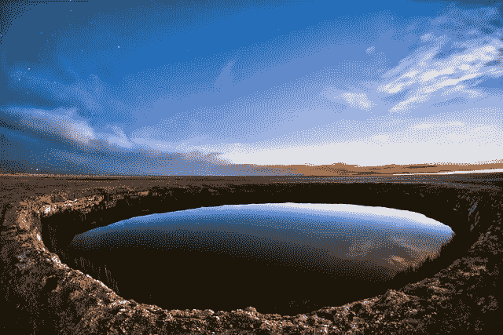
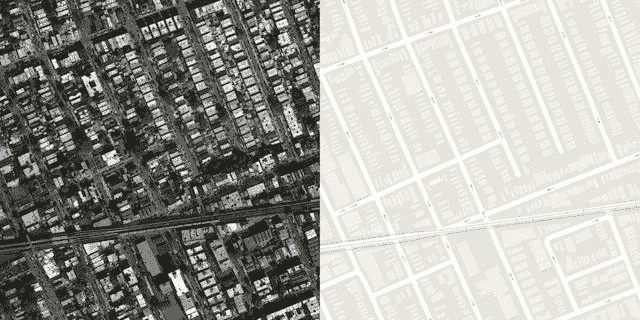
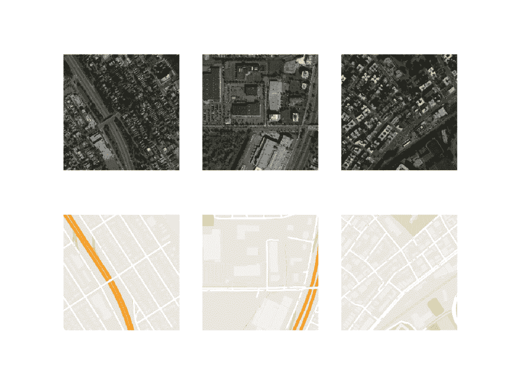
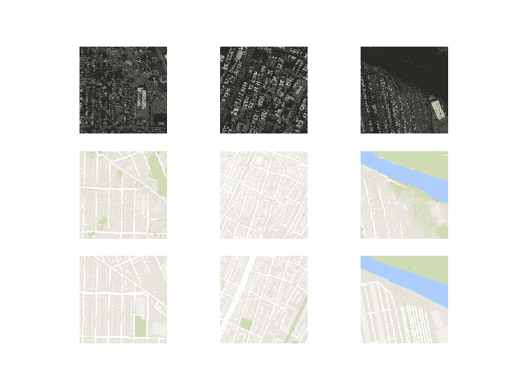
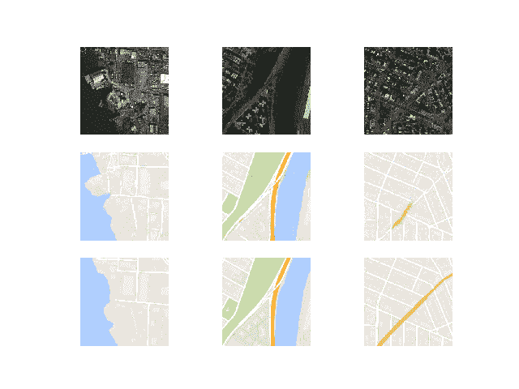
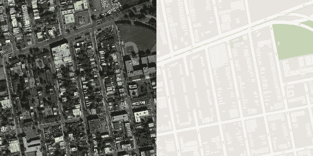
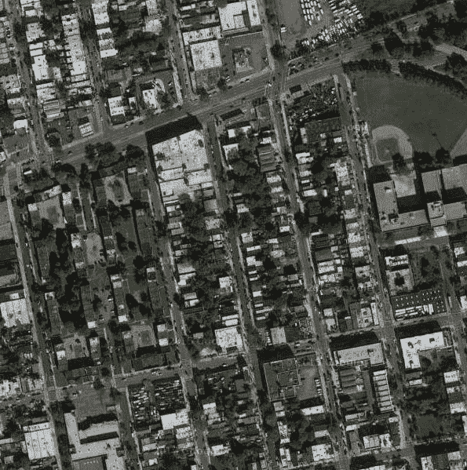
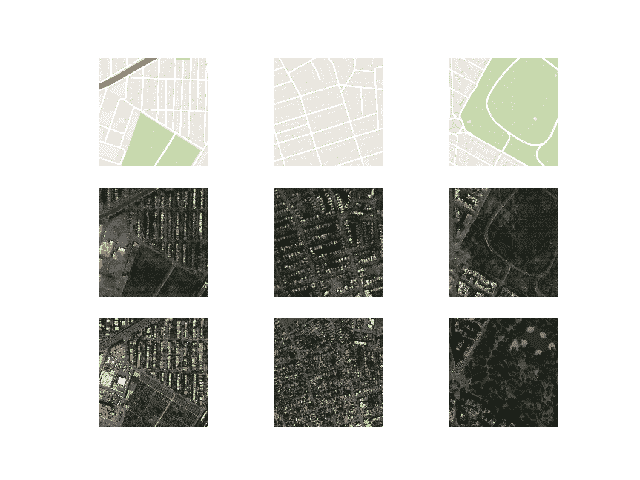
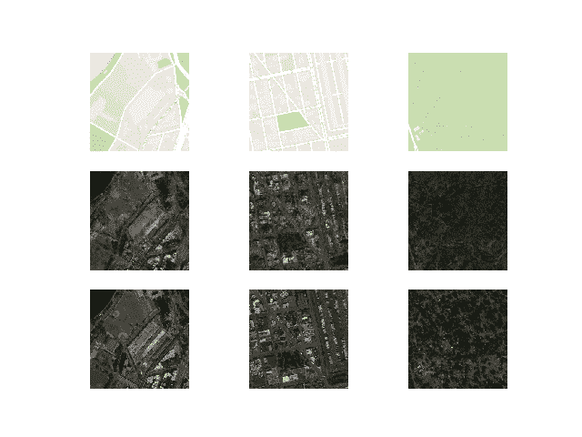

# 如何开发用于图像到图像转换的 Pix2Pix GAN

> 原文：<https://machinelearningmastery.com/how-to-develop-a-pix2pix-gan-for-image-to-image-translation/>

最后更新于 2021 年 1 月 18 日

Pix2Pix 生成对抗网络是一种训练深度卷积神经网络的方法，用于图像到图像的翻译任务。

作为一种有图像条件的 GAN，架构的精心配置允许与现有的 GAN 模型(例如 256×256 像素)相比生成大图像，并且能够在各种不同的图像到图像转换任务中表现良好。

在本教程中，您将发现如何为图像到图像的翻译开发一个 Pix2Pix 生成式对抗网络。

完成本教程后，您将知道:

*   如何将卫星图像加载并准备到谷歌地图图像到图像转换数据集。
*   如何开发一个 Pix2Pix 模型，用于将卫星照片翻译成谷歌地图图像。
*   如何使用最终的 Pix2Pix 生成器模型来翻译临时卫星图像。

**用我的新书[Python 生成对抗网络](https://machinelearningmastery.com/generative_adversarial_networks/)启动你的项目**，包括*分步教程*和所有示例的 *Python 源代码*文件。

我们开始吧。

*   **2021 年 1 月更新**:更新所以层冻结用批量定额。



如何开发用于图像到图像转换的 Pix2Pix 生成对抗网络
图片由[欧洲南方天文台](https://www.flickr.com/photos/esoastronomy/35523808512/)提供，保留部分权利。

## 教程概述

本教程分为五个部分；它们是:

1.  什么是 Pix2Pix GAN？
2.  卫星到地图图像转换数据集
3.  如何开发和训练 Pix2Pix 模型
4.  如何使用 Pix2Pix 模型翻译图像
5.  如何将谷歌地图翻译成卫星图像

## 什么是 Pix2Pix GAN？

Pix2Pix 是一个为通用图像到图像转换而设计的生成对抗网络模型。

这种方法是由菲利普·伊索拉等人在 2016 年发表的论文《条件对抗网络下的 T2 图像到图像转换》和 2017 年在 CVPR 发表的《T4》中提出的。

GAN 架构由一个用于输出新的似是而非的合成图像的生成器模型和一个将图像分类为真实(来自数据集)或虚假(生成)的鉴别器模型组成。鉴别器模型直接更新，而生成器模型通过鉴别器模型更新。这样，两个模型在对抗过程中被同时训练，其中生成器试图更好地欺骗鉴别器，鉴别器试图更好地识别伪造图像。

Pix2Pix 模型是一种条件 GAN 或 cGAN，其中输出图像的生成取决于输入，在这种情况下是源图像。鉴别器同时具有源图像和目标图像，并且必须确定目标是否是源图像的似是而非的变换。

生成器通过对抗性损失进行训练，这鼓励生成器在目标域中生成似是而非的图像。生成器还通过在生成的图像和预期输出图像之间测量的 L1 损耗来更新。这种额外的损失促使生成器模型创建源图像的似是而非的翻译。

Pix2Pix GAN 已经在一系列图像到图像的转换任务中进行了演示，例如将地图转换为卫星照片，将黑白照片转换为彩色照片，以及将产品草图转换为产品照片。

现在我们已经熟悉了 Pix2Pix GAN，让我们准备一个数据集，可以用于图像到图像的转换。

## 卫星到地图图像转换数据集

在本教程中，我们将使用 Pix2Pix 论文中使用的所谓的“*地图*”数据集。

这是一个由纽约卫星图像和相应的谷歌地图页面组成的数据集。图像转换问题涉及将卫星照片转换为谷歌地图格式，或者相反，将谷歌地图图像转换为卫星照片。

该数据集在 pix2pix 网站上提供，可以作为 255 兆字节的 zip 文件下载。

*   [下载地图数据集(maps.tar.gz)](http://efrosgans.eecs.berkeley.edu/pix2pix/datasets/maps.tar.gz)

下载数据集并将其解压缩到当前工作目录中。这将创建一个名为“*地图*”的目录，其结构如下:

```py
maps
├── train
└── val
```

train 文件夹包含 1，097 个图像，而验证数据集包含 1，099 个图像。

图像有一个数字文件名，并且是 JPEG 格式。每幅图像宽 1200 像素，高 600 像素，左侧包含卫星图像，右侧包含谷歌地图图像。



地图数据集中的样本图像，包括卫星和谷歌地图图像。

我们可以准备这个数据集，在Keras训练一个 Pix2Pix GAN 模型。我们将只处理训练数据集中的图像。每张图片都将被加载、重新缩放，并分割成卫星和谷歌地图元素。结果将是 1097 个彩色图像对，宽度和高度为 256×256 像素。

下面的 *load_images()* 函数实现了这一点。它枚举给定目录中的图像列表，加载每个目标大小为 256×512 像素的图像，将每个图像拆分为卫星和地图元素，并返回每个元素的数组。

```py
# load all images in a directory into memory
def load_images(path, size=(256,512)):
	src_list, tar_list = list(), list()
	# enumerate filenames in directory, assume all are images
	for filename in listdir(path):
		# load and resize the image
		pixels = load_img(path + filename, target_size=size)
		# convert to numpy array
		pixels = img_to_array(pixels)
		# split into satellite and map
		sat_img, map_img = pixels[:, :256], pixels[:, 256:]
		src_list.append(sat_img)
		tar_list.append(map_img)
	return [asarray(src_list), asarray(tar_list)]
```

我们可以用训练数据集的路径调用这个函数。加载后，我们可以将准备好的数组保存到一个新的压缩格式的文件中，供以后使用。

下面列出了完整的示例。

```py
# load, split and scale the maps dataset ready for training
from os import listdir
from numpy import asarray
from numpy import vstack
from keras.preprocessing.image import img_to_array
from keras.preprocessing.image import load_img
from numpy import savez_compressed

# load all images in a directory into memory
def load_images(path, size=(256,512)):
	src_list, tar_list = list(), list()
	# enumerate filenames in directory, assume all are images
	for filename in listdir(path):
		# load and resize the image
		pixels = load_img(path + filename, target_size=size)
		# convert to numpy array
		pixels = img_to_array(pixels)
		# split into satellite and map
		sat_img, map_img = pixels[:, :256], pixels[:, 256:]
		src_list.append(sat_img)
		tar_list.append(map_img)
	return [asarray(src_list), asarray(tar_list)]

# dataset path
path = 'maps/train/'
# load dataset
[src_images, tar_images] = load_images(path)
print('Loaded: ', src_images.shape, tar_images.shape)
# save as compressed numpy array
filename = 'maps_256.npz'
savez_compressed(filename, src_images, tar_images)
print('Saved dataset: ', filename)
```

运行该示例将加载训练数据集中的所有图像，总结它们的形状以确保图像被正确加载，然后以压缩的 NumPy 数组格式将数组保存到名为 *maps_256.npz* 的新文件中。

```py
Loaded:  (1096, 256, 256, 3) (1096, 256, 256, 3)
Saved dataset:  maps_256.npz
```

稍后可以通过 [load() NumPy 函数](https://docs.scipy.org/doc/numpy/reference/generated/numpy.load.html)依次检索每个数组来加载该文件。

然后，我们可以绘制一些图像对，以确认数据已被正确处理。

```py
# load the prepared dataset
from numpy import load
from matplotlib import pyplot
# load the dataset
data = load('maps_256.npz')
src_images, tar_images = data['arr_0'], data['arr_1']
print('Loaded: ', src_images.shape, tar_images.shape)
# plot source images
n_samples = 3
for i in range(n_samples):
	pyplot.subplot(2, n_samples, 1 + i)
	pyplot.axis('off')
	pyplot.imshow(src_images[i].astype('uint8'))
# plot target image
for i in range(n_samples):
	pyplot.subplot(2, n_samples, 1 + n_samples + i)
	pyplot.axis('off')
	pyplot.imshow(tar_images[i].astype('uint8'))
pyplot.show()
```

运行此示例加载准备好的数据集并总结每个数组的形状，这证实了我们对 10256×256 个图像对的期望。

```py
Loaded: (1096, 256, 256, 3) (1096, 256, 256, 3)
```

还创建了三个图像对的图，在顶部显示卫星图像，在底部显示谷歌地图图像。

我们可以看到，卫星图像非常复杂，尽管谷歌地图图像简单得多，但它们对主要道路、水和公园等有颜色编码。



显示卫星图像(上)和谷歌地图图像(下)的三对图像图。

现在我们已经为图像转换准备了数据集，我们可以开发我们的 Pix2Pix GAN 模型了。

## 如何开发和训练 Pix2Pix 模型

在本节中，我们将开发 Pix2Pix 模型，用于将卫星照片翻译成谷歌地图图像。

论文中描述的相同模型架构和配置被用于一系列图像转换任务。该架构在论文正文中有所描述，在论文附录中有更多的细节，并且提供了一个[完全工作的实现](https://github.com/phillipi/pix2pix)作为 Torch 深度学习框架的开源。

本节中的实现将使用 Keras 深度学习框架，该框架直接基于本文中描述的模型，并在作者的代码库中实现，旨在拍摄和生成大小为 256×256 像素的彩色图像。

该架构由两个模型组成:鉴别器和生成器。

鉴别器是执行图像分类的深度卷积神经网络。具体来说，条件图像分类。它将源图像(例如卫星照片)和目标图像(例如谷歌地图图像)都作为输入，并预测目标图像是真实的还是源图像的假翻译的可能性。

鉴别器的设计基于模型的有效感受野，它定义了模型的一个输出与输入图像中的像素数之间的关系。这被称为 PatchGAN 模型，经过精心设计，模型的每个输出预测都映射到输入图像的 70×70 的正方形或面片。这种方法的好处是相同的模型可以应用于不同尺寸的输入图像，例如大于或小于 256×256 像素。

模型的输出取决于输入图像的大小，但可能是一个值或值的平方激活图。每一个值都是输入图像中的一个补丁是真实的可能性的概率。如果需要，可以对这些值进行平均，以给出总体可能性或分类分数。

下面的 *define_discriminator()* 函数按照文中模型的设计实现了 70×70 的 PatchGAN 鉴别器模型。该模型采用两个连接在一起的输入图像，并预测预测的补丁输出。使用二进制交叉熵优化模型，并使用权重，使得模型的更新具有通常效果的一半(0.5)。Pix2Pix 的作者推荐这种模型更新的权重，以减缓训练期间相对于生成器模型的鉴别器变化。

```py
# define the discriminator model
def define_discriminator(image_shape):
	# weight initialization
	init = RandomNormal(stddev=0.02)
	# source image input
	in_src_image = Input(shape=image_shape)
	# target image input
	in_target_image = Input(shape=image_shape)
	# concatenate images channel-wise
	merged = Concatenate()([in_src_image, in_target_image])
	# C64
	d = Conv2D(64, (4,4), strides=(2,2), padding='same', kernel_initializer=init)(merged)
	d = LeakyReLU(alpha=0.2)(d)
	# C128
	d = Conv2D(128, (4,4), strides=(2,2), padding='same', kernel_initializer=init)(d)
	d = BatchNormalization()(d)
	d = LeakyReLU(alpha=0.2)(d)
	# C256
	d = Conv2D(256, (4,4), strides=(2,2), padding='same', kernel_initializer=init)(d)
	d = BatchNormalization()(d)
	d = LeakyReLU(alpha=0.2)(d)
	# C512
	d = Conv2D(512, (4,4), strides=(2,2), padding='same', kernel_initializer=init)(d)
	d = BatchNormalization()(d)
	d = LeakyReLU(alpha=0.2)(d)
	# second last output layer
	d = Conv2D(512, (4,4), padding='same', kernel_initializer=init)(d)
	d = BatchNormalization()(d)
	d = LeakyReLU(alpha=0.2)(d)
	# patch output
	d = Conv2D(1, (4,4), padding='same', kernel_initializer=init)(d)
	patch_out = Activation('sigmoid')(d)
	# define model
	model = Model([in_src_image, in_target_image], patch_out)
	# compile model
	opt = Adam(lr=0.0002, beta_1=0.5)
	model.compile(loss='binary_crossentropy', optimizer=opt, loss_weights=[0.5])
	return model
```

生成器模型比鉴别器模型更复杂。

生成器是一个使用 U-Net 架构的编码器-解码器模型。该模型获取源图像(例如卫星照片)并生成目标图像(例如谷歌地图图像)。它通过首先将输入图像向下采样或编码到瓶颈层，然后将瓶颈表示向上采样或解码到输出图像的大小来实现这一点。U-Net 架构意味着在编码层和相应的解码层之间增加了跳跃连接，形成一个 U 形。

下图清楚地显示了跳过连接，显示了编码器的第一层是如何连接到解码器的最后一层的，以此类推。


基于条件对抗网络的图像到图像转换的 U-Net 生成器模型架构

生成器的编码器和解码器由卷积的标准化块、[批处理标准化](https://machinelearningmastery.com/how-to-accelerate-learning-of-deep-neural-networks-with-batch-normalization/)、[丢弃](https://machinelearningmastery.com/how-to-reduce-overfitting-with-dropout-regularization-in-keras/)和激活层组成。这种标准化意味着我们可以开发助手函数来创建每个层块，并重复调用它来构建模型的编码器和解码器部分。

下面的 *define_generator()* 函数实现了 U-Net 编解码生成器模型。它使用*定义 _ 编码器 _ 块()*辅助函数为编码器创建层块，使用*解码器 _ 块()*函数为解码器创建层块。tanh 激活函数用于输出层，这意味着生成的图像中的像素值将在[-1，1]的范围内。

```py
# define an encoder block
def define_encoder_block(layer_in, n_filters, batchnorm=True):
	# weight initialization
	init = RandomNormal(stddev=0.02)
	# add downsampling layer
	g = Conv2D(n_filters, (4,4), strides=(2,2), padding='same', kernel_initializer=init)(layer_in)
	# conditionally add batch normalization
	if batchnorm:
		g = BatchNormalization()(g, training=True)
	# leaky relu activation
	g = LeakyReLU(alpha=0.2)(g)
	return g

# define a decoder block
def decoder_block(layer_in, skip_in, n_filters, dropout=True):
	# weight initialization
	init = RandomNormal(stddev=0.02)
	# add upsampling layer
	g = Conv2DTranspose(n_filters, (4,4), strides=(2,2), padding='same', kernel_initializer=init)(layer_in)
	# add batch normalization
	g = BatchNormalization()(g, training=True)
	# conditionally add dropout
	if dropout:
		g = Dropout(0.5)(g, training=True)
	# merge with skip connection
	g = Concatenate()([g, skip_in])
	# relu activation
	g = Activation('relu')(g)
	return g

# define the standalone generator model
def define_generator(image_shape=(256,256,3)):
	# weight initialization
	init = RandomNormal(stddev=0.02)
	# image input
	in_image = Input(shape=image_shape)
	# encoder model
	e1 = define_encoder_block(in_image, 64, batchnorm=False)
	e2 = define_encoder_block(e1, 128)
	e3 = define_encoder_block(e2, 256)
	e4 = define_encoder_block(e3, 512)
	e5 = define_encoder_block(e4, 512)
	e6 = define_encoder_block(e5, 512)
	e7 = define_encoder_block(e6, 512)
	# bottleneck, no batch norm and relu
	b = Conv2D(512, (4,4), strides=(2,2), padding='same', kernel_initializer=init)(e7)
	b = Activation('relu')(b)
	# decoder model
	d1 = decoder_block(b, e7, 512)
	d2 = decoder_block(d1, e6, 512)
	d3 = decoder_block(d2, e5, 512)
	d4 = decoder_block(d3, e4, 512, dropout=False)
	d5 = decoder_block(d4, e3, 256, dropout=False)
	d6 = decoder_block(d5, e2, 128, dropout=False)
	d7 = decoder_block(d6, e1, 64, dropout=False)
	# output
	g = Conv2DTranspose(3, (4,4), strides=(2,2), padding='same', kernel_initializer=init)(d7)
	out_image = Activation('tanh')(g)
	# define model
	model = Model(in_image, out_image)
	return model
```

鉴别器模型直接在真实和生成的图像上训练，而生成器模型不是。

相反，生成器模型是通过鉴别器模型训练的。它被更新以最小化鉴别器为标记为“*真实*”的生成图像所预测的损失因此，鼓励生成更真实的图像。生成器也会更新，以最小化 [L1 损失](https://machinelearningmastery.com/vector-norms-machine-learning/)或生成的图像和目标图像之间的平均绝对误差。

生成器通过对抗性损失和 L1 损失的加权和来更新，其中模型的作者建议 100 比 1 的加权来支持 L1 损失。这是为了强烈鼓励生成器生成输入图像的似是而非的翻译，而不仅仅是目标域中的似是而非的图像。

这可以通过定义由现有独立生成器和鉴别器模型中的权重组成的新逻辑模型来实现。这个逻辑或复合模型包括将生成器堆叠在鉴别器的顶部。源图像被提供作为发生器和鉴别器的输入，尽管发生器的输出连接到鉴别器作为对应的“*目标*”图像。鉴别器然后预测发生器是源图像的真实翻译的可能性。

鉴别器以独立的方式更新，因此权重在这个复合模型中被重用，但是被标记为不可训练。用两个目标更新合成模型，一个指示生成的图像是真实的([交叉熵损失](https://machinelearningmastery.com/how-to-choose-loss-functions-when-training-deep-learning-neural-networks/))，迫使生成器中的大权重更新朝向生成更真实的图像，并且执行图像的真实平移，其与生成器模型的输出进行比较(L1 损失)。

下面的 *define_gan()* 函数实现了这一点，将已经定义的生成器和鉴别器模型作为参数，并使用 [Keras 函数 API](https://machinelearningmastery.com/keras-functional-api-deep-learning/) 将它们连接到一个复合模型中。为模型的两个输出指定了两个损失函数，并且在*编译()*函数的*损失权重*参数中指定了每个损失函数使用的权重。

```py
# define the combined generator and discriminator model, for updating the generator
def define_gan(g_model, d_model, image_shape):
	# make weights in the discriminator not trainable
	for layer in d_model.layers:
		if not isinstance(layer, BatchNormalization):
			layer.trainable = False
	# define the source image
	in_src = Input(shape=image_shape)
	# connect the source image to the generator input
	gen_out = g_model(in_src)
	# connect the source input and generator output to the discriminator input
	dis_out = d_model([in_src, gen_out])
	# src image as input, generated image and classification output
	model = Model(in_src, [dis_out, gen_out])
	# compile model
	opt = Adam(lr=0.0002, beta_1=0.5)
	model.compile(loss=['binary_crossentropy', 'mae'], optimizer=opt, loss_weights=[1,100])
	return model
```

接下来，我们可以以压缩的 NumPy 数组格式加载我们的配对图像数据集。

这将返回两个 NumPy 数组的列表:第一个用于源图像，第二个用于对应的目标图像。

```py
# load and prepare training images
def load_real_samples(filename):
	# load compressed arrays
	data = load(filename)
	# unpack arrays
	X1, X2 = data['arr_0'], data['arr_1']
	# scale from [0,255] to [-1,1]
	X1 = (X1 - 127.5) / 127.5
	X2 = (X2 - 127.5) / 127.5
	return [X1, X2]
```

训练鉴别器需要一批批的真图像和假图像。

下面的 *generate_real_samples()* 函数将从训练数据集中准备一批随机的图像对，*类对应的鉴别器标签=1* 表示它们是真实的。

```py
# select a batch of random samples, returns images and target
def generate_real_samples(dataset, n_samples, patch_shape):
	# unpack dataset
	trainA, trainB = dataset
	# choose random instances
	ix = randint(0, trainA.shape[0], n_samples)
	# retrieve selected images
	X1, X2 = trainA[ix], trainB[ix]
	# generate 'real' class labels (1)
	y = ones((n_samples, patch_shape, patch_shape, 1))
	return [X1, X2], y
```

下面的 *generate_fake_samples()* 函数使用生成器模型和一批真实源图像为鉴别器生成一批等效的目标图像。

这些与标签类-0 一起返回，以向鉴别器表明它们是假的。

```py
# generate a batch of images, returns images and targets
def generate_fake_samples(g_model, samples, patch_shape):
	# generate fake instance
	X = g_model.predict(samples)
	# create 'fake' class labels (0)
	y = zeros((len(X), patch_shape, patch_shape, 1))
	return X, y
```

典型地，GAN 模型不收敛；相反，在生成器和鉴别器模型之间找到了平衡。因此，我们不能轻易判断何时应该停止训练。因此，我们可以保存模型，并在训练期间定期使用它生成样本图像到图像的转换，例如每 10 个训练时期。

然后，我们可以在训练结束时查看生成的图像，并使用图像质量来选择最终模型。

*summary _ performance()*函数实现了这一点，在训练期间的某个点获取生成器模型，并使用它来生成数据集中随机选择的图像的多个翻译，在本例中为三个。然后将源、生成的图像和预期目标绘制为三行图像，并将绘图保存到文件中。此外，[模型被保存到一个 H5 格式的文件中，以便于以后加载。](https://machinelearningmastery.com/save-load-keras-deep-learning-models/)

图像和模型文件名都包含训练迭代次数，这使得我们在训练结束时可以很容易地将它们区分开来。

```py
# generate samples and save as a plot and save the model
def summarize_performance(step, g_model, dataset, n_samples=3):
	# select a sample of input images
	[X_realA, X_realB], _ = generate_real_samples(dataset, n_samples, 1)
	# generate a batch of fake samples
	X_fakeB, _ = generate_fake_samples(g_model, X_realA, 1)
	# scale all pixels from [-1,1] to [0,1]
	X_realA = (X_realA + 1) / 2.0
	X_realB = (X_realB + 1) / 2.0
	X_fakeB = (X_fakeB + 1) / 2.0
	# plot real source images
	for i in range(n_samples):
		pyplot.subplot(3, n_samples, 1 + i)
		pyplot.axis('off')
		pyplot.imshow(X_realA[i])
	# plot generated target image
	for i in range(n_samples):
		pyplot.subplot(3, n_samples, 1 + n_samples + i)
		pyplot.axis('off')
		pyplot.imshow(X_fakeB[i])
	# plot real target image
	for i in range(n_samples):
		pyplot.subplot(3, n_samples, 1 + n_samples*2 + i)
		pyplot.axis('off')
		pyplot.imshow(X_realB[i])
	# save plot to file
	filename1 = 'plot_%06d.png' % (step+1)
	pyplot.savefig(filename1)
	pyplot.close()
	# save the generator model
	filename2 = 'model_%06d.h5' % (step+1)
	g_model.save(filename2)
	print('>Saved: %s and %s' % (filename1, filename2))
```

最后，我们可以训练生成器和鉴别器模型。

下面的 *train()* 函数实现了这一点，将定义的生成器、鉴别器、复合模型和加载的数据集作为输入。时代的数量被设置为 100，以保持训练次数减少，尽管论文中使用了 200。按照论文中的建议，使用 1 的批量。

训练包括固定次数的训练迭代。训练数据集中有 1，097 幅图像。一个时期是通过这个数量的例子的一次迭代，一个批量意味着 1097 个训练步骤。生成器每 10 个时代或每 10，970 个训练步骤保存和评估一次，模型将运行 100 个时代或总共 109，700 个训练步骤。

每个训练步骤包括首先选择一批真实的例子，然后使用生成器使用真实的源图像生成一批匹配的假样本。鉴别器随后用该批真实图像更新，然后用假图像更新。

接下来，更新生成器模型，提供真实源图像作为输入，并提供类别标签 1(真实)和真实目标图像作为计算损失所需的模型的预期输出。生成器有两个损失分数以及从调用 *train_on_batch()* 返回的加权和分数。我们只对加权和分数(返回的第一个值)感兴趣，因为它用于更新模型权重。

最后，每次更新的损失会在每次训练迭代中报告给控制台，并且每 10 个训练时期评估一次模型表现。

```py
# train pix2pix model
def train(d_model, g_model, gan_model, dataset, n_epochs=100, n_batch=1):
	# determine the output square shape of the discriminator
	n_patch = d_model.output_shape[1]
	# unpack dataset
	trainA, trainB = dataset
	# calculate the number of batches per training epoch
	bat_per_epo = int(len(trainA) / n_batch)
	# calculate the number of training iterations
	n_steps = bat_per_epo * n_epochs
	# manually enumerate epochs
	for i in range(n_steps):
		# select a batch of real samples
		[X_realA, X_realB], y_real = generate_real_samples(dataset, n_batch, n_patch)
		# generate a batch of fake samples
		X_fakeB, y_fake = generate_fake_samples(g_model, X_realA, n_patch)
		# update discriminator for real samples
		d_loss1 = d_model.train_on_batch([X_realA, X_realB], y_real)
		# update discriminator for generated samples
		d_loss2 = d_model.train_on_batch([X_realA, X_fakeB], y_fake)
		# update the generator
		g_loss, _, _ = gan_model.train_on_batch(X_realA, [y_real, X_realB])
		# summarize performance
		print('>%d, d1[%.3f] d2[%.3f] g[%.3f]' % (i+1, d_loss1, d_loss2, g_loss))
		# summarize model performance
		if (i+1) % (bat_per_epo * 10) == 0:
			summarize_performance(i, g_model, dataset)
```

将所有这些结合在一起，下面列出了训练 Pix2Pix GAN 将卫星照片翻译成谷歌地图图像的完整代码示例。

```py
# example of pix2pix gan for satellite to map image-to-image translation
from numpy import load
from numpy import zeros
from numpy import ones
from numpy.random import randint
from keras.optimizers import Adam
from keras.initializers import RandomNormal
from keras.models import Model
from keras.models import Input
from keras.layers import Conv2D
from keras.layers import Conv2DTranspose
from keras.layers import LeakyReLU
from keras.layers import Activation
from keras.layers import Concatenate
from keras.layers import Dropout
from keras.layers import BatchNormalization
from keras.layers import LeakyReLU
from matplotlib import pyplot

# define the discriminator model
def define_discriminator(image_shape):
	# weight initialization
	init = RandomNormal(stddev=0.02)
	# source image input
	in_src_image = Input(shape=image_shape)
	# target image input
	in_target_image = Input(shape=image_shape)
	# concatenate images channel-wise
	merged = Concatenate()([in_src_image, in_target_image])
	# C64
	d = Conv2D(64, (4,4), strides=(2,2), padding='same', kernel_initializer=init)(merged)
	d = LeakyReLU(alpha=0.2)(d)
	# C128
	d = Conv2D(128, (4,4), strides=(2,2), padding='same', kernel_initializer=init)(d)
	d = BatchNormalization()(d)
	d = LeakyReLU(alpha=0.2)(d)
	# C256
	d = Conv2D(256, (4,4), strides=(2,2), padding='same', kernel_initializer=init)(d)
	d = BatchNormalization()(d)
	d = LeakyReLU(alpha=0.2)(d)
	# C512
	d = Conv2D(512, (4,4), strides=(2,2), padding='same', kernel_initializer=init)(d)
	d = BatchNormalization()(d)
	d = LeakyReLU(alpha=0.2)(d)
	# second last output layer
	d = Conv2D(512, (4,4), padding='same', kernel_initializer=init)(d)
	d = BatchNormalization()(d)
	d = LeakyReLU(alpha=0.2)(d)
	# patch output
	d = Conv2D(1, (4,4), padding='same', kernel_initializer=init)(d)
	patch_out = Activation('sigmoid')(d)
	# define model
	model = Model([in_src_image, in_target_image], patch_out)
	# compile model
	opt = Adam(lr=0.0002, beta_1=0.5)
	model.compile(loss='binary_crossentropy', optimizer=opt, loss_weights=[0.5])
	return model

# define an encoder block
def define_encoder_block(layer_in, n_filters, batchnorm=True):
	# weight initialization
	init = RandomNormal(stddev=0.02)
	# add downsampling layer
	g = Conv2D(n_filters, (4,4), strides=(2,2), padding='same', kernel_initializer=init)(layer_in)
	# conditionally add batch normalization
	if batchnorm:
		g = BatchNormalization()(g, training=True)
	# leaky relu activation
	g = LeakyReLU(alpha=0.2)(g)
	return g

# define a decoder block
def decoder_block(layer_in, skip_in, n_filters, dropout=True):
	# weight initialization
	init = RandomNormal(stddev=0.02)
	# add upsampling layer
	g = Conv2DTranspose(n_filters, (4,4), strides=(2,2), padding='same', kernel_initializer=init)(layer_in)
	# add batch normalization
	g = BatchNormalization()(g, training=True)
	# conditionally add dropout
	if dropout:
		g = Dropout(0.5)(g, training=True)
	# merge with skip connection
	g = Concatenate()([g, skip_in])
	# relu activation
	g = Activation('relu')(g)
	return g

# define the standalone generator model
def define_generator(image_shape=(256,256,3)):
	# weight initialization
	init = RandomNormal(stddev=0.02)
	# image input
	in_image = Input(shape=image_shape)
	# encoder model
	e1 = define_encoder_block(in_image, 64, batchnorm=False)
	e2 = define_encoder_block(e1, 128)
	e3 = define_encoder_block(e2, 256)
	e4 = define_encoder_block(e3, 512)
	e5 = define_encoder_block(e4, 512)
	e6 = define_encoder_block(e5, 512)
	e7 = define_encoder_block(e6, 512)
	# bottleneck, no batch norm and relu
	b = Conv2D(512, (4,4), strides=(2,2), padding='same', kernel_initializer=init)(e7)
	b = Activation('relu')(b)
	# decoder model
	d1 = decoder_block(b, e7, 512)
	d2 = decoder_block(d1, e6, 512)
	d3 = decoder_block(d2, e5, 512)
	d4 = decoder_block(d3, e4, 512, dropout=False)
	d5 = decoder_block(d4, e3, 256, dropout=False)
	d6 = decoder_block(d5, e2, 128, dropout=False)
	d7 = decoder_block(d6, e1, 64, dropout=False)
	# output
	g = Conv2DTranspose(3, (4,4), strides=(2,2), padding='same', kernel_initializer=init)(d7)
	out_image = Activation('tanh')(g)
	# define model
	model = Model(in_image, out_image)
	return model

# define the combined generator and discriminator model, for updating the generator
def define_gan(g_model, d_model, image_shape):
	# make weights in the discriminator not trainable
	for layer in d_model.layers:
		if not isinstance(layer, BatchNormalization):
			layer.trainable = False
	# define the source image
	in_src = Input(shape=image_shape)
	# connect the source image to the generator input
	gen_out = g_model(in_src)
	# connect the source input and generator output to the discriminator input
	dis_out = d_model([in_src, gen_out])
	# src image as input, generated image and classification output
	model = Model(in_src, [dis_out, gen_out])
	# compile model
	opt = Adam(lr=0.0002, beta_1=0.5)
	model.compile(loss=['binary_crossentropy', 'mae'], optimizer=opt, loss_weights=[1,100])
	return model

# load and prepare training images
def load_real_samples(filename):
	# load compressed arrays
	data = load(filename)
	# unpack arrays
	X1, X2 = data['arr_0'], data['arr_1']
	# scale from [0,255] to [-1,1]
	X1 = (X1 - 127.5) / 127.5
	X2 = (X2 - 127.5) / 127.5
	return [X1, X2]

# select a batch of random samples, returns images and target
def generate_real_samples(dataset, n_samples, patch_shape):
	# unpack dataset
	trainA, trainB = dataset
	# choose random instances
	ix = randint(0, trainA.shape[0], n_samples)
	# retrieve selected images
	X1, X2 = trainA[ix], trainB[ix]
	# generate 'real' class labels (1)
	y = ones((n_samples, patch_shape, patch_shape, 1))
	return [X1, X2], y

# generate a batch of images, returns images and targets
def generate_fake_samples(g_model, samples, patch_shape):
	# generate fake instance
	X = g_model.predict(samples)
	# create 'fake' class labels (0)
	y = zeros((len(X), patch_shape, patch_shape, 1))
	return X, y

# generate samples and save as a plot and save the model
def summarize_performance(step, g_model, dataset, n_samples=3):
	# select a sample of input images
	[X_realA, X_realB], _ = generate_real_samples(dataset, n_samples, 1)
	# generate a batch of fake samples
	X_fakeB, _ = generate_fake_samples(g_model, X_realA, 1)
	# scale all pixels from [-1,1] to [0,1]
	X_realA = (X_realA + 1) / 2.0
	X_realB = (X_realB + 1) / 2.0
	X_fakeB = (X_fakeB + 1) / 2.0
	# plot real source images
	for i in range(n_samples):
		pyplot.subplot(3, n_samples, 1 + i)
		pyplot.axis('off')
		pyplot.imshow(X_realA[i])
	# plot generated target image
	for i in range(n_samples):
		pyplot.subplot(3, n_samples, 1 + n_samples + i)
		pyplot.axis('off')
		pyplot.imshow(X_fakeB[i])
	# plot real target image
	for i in range(n_samples):
		pyplot.subplot(3, n_samples, 1 + n_samples*2 + i)
		pyplot.axis('off')
		pyplot.imshow(X_realB[i])
	# save plot to file
	filename1 = 'plot_%06d.png' % (step+1)
	pyplot.savefig(filename1)
	pyplot.close()
	# save the generator model
	filename2 = 'model_%06d.h5' % (step+1)
	g_model.save(filename2)
	print('>Saved: %s and %s' % (filename1, filename2))

# train pix2pix models
def train(d_model, g_model, gan_model, dataset, n_epochs=100, n_batch=1):
	# determine the output square shape of the discriminator
	n_patch = d_model.output_shape[1]
	# unpack dataset
	trainA, trainB = dataset
	# calculate the number of batches per training epoch
	bat_per_epo = int(len(trainA) / n_batch)
	# calculate the number of training iterations
	n_steps = bat_per_epo * n_epochs
	# manually enumerate epochs
	for i in range(n_steps):
		# select a batch of real samples
		[X_realA, X_realB], y_real = generate_real_samples(dataset, n_batch, n_patch)
		# generate a batch of fake samples
		X_fakeB, y_fake = generate_fake_samples(g_model, X_realA, n_patch)
		# update discriminator for real samples
		d_loss1 = d_model.train_on_batch([X_realA, X_realB], y_real)
		# update discriminator for generated samples
		d_loss2 = d_model.train_on_batch([X_realA, X_fakeB], y_fake)
		# update the generator
		g_loss, _, _ = gan_model.train_on_batch(X_realA, [y_real, X_realB])
		# summarize performance
		print('>%d, d1[%.3f] d2[%.3f] g[%.3f]' % (i+1, d_loss1, d_loss2, g_loss))
		# summarize model performance
		if (i+1) % (bat_per_epo * 10) == 0:
			summarize_performance(i, g_model, dataset)

# load image data
dataset = load_real_samples('maps_256.npz')
print('Loaded', dataset[0].shape, dataset[1].shape)
# define input shape based on the loaded dataset
image_shape = dataset[0].shape[1:]
# define the models
d_model = define_discriminator(image_shape)
g_model = define_generator(image_shape)
# define the composite model
gan_model = define_gan(g_model, d_model, image_shape)
# train model
train(d_model, g_model, gan_model, dataset)
```

这个例子可以在 CPU 硬件上运行，虽然推荐 [GPU 硬件](https://machinelearningmastery.com/develop-evaluate-large-deep-learning-models-keras-amazon-web-services/)。

该示例可能需要大约两个小时才能在现代 GPU 硬件上运行。

**注**:考虑到算法或评估程序的随机性，或数值精度的差异，您的[结果可能会有所不同](https://machinelearningmastery.com/different-results-each-time-in-machine-learning/)。考虑运行该示例几次，并比较平均结果。

在每次训练迭代中报告损失，包括真实例子的鉴别器损失(d1)、生成或伪造例子的鉴别器损失(d2)和生成器损失，生成器损失是对抗性和 L1 损失(g)的加权平均值。

如果鉴别器的损耗变为零并在那里停留很长时间，考虑重新开始训练，因为这是训练失败的一个例子。

```py
>1, d1[0.566] d2[0.520] g[82.266]
>2, d1[0.469] d2[0.484] g[66.813]
>3, d1[0.428] d2[0.477] g[79.520]
>4, d1[0.362] d2[0.405] g[78.143]
>5, d1[0.416] d2[0.406] g[72.452]
...
>109596, d1[0.303] d2[0.006] g[5.792]
>109597, d1[0.001] d2[1.127] g[14.343]
>109598, d1[0.000] d2[0.381] g[11.851]
>109599, d1[1.289] d2[0.547] g[6.901]
>109600, d1[0.437] d2[0.005] g[10.460]
>Saved: plot_109600.png and model_109600.h5
```

模型每 10 个时期保存一次，并保存到带有训练迭代号的文件中。此外，每 10 个时期生成一次图像，并与预期的目标图像进行比较。这些图可以在运行结束时进行评估，并用于根据生成的图像质量选择最终的生成器模型。

在运行结束时，您将拥有 10 个已保存的模型文件和 10 个生成的图像图。

在前 10 个时代之后，生成的地图图像看起来似乎是可信的，尽管街道的线条并不完全直，并且图像包含一些模糊。尽管如此，大的结构是在正确的地方，大多是正确的颜色。



使用 Pix2Pix 绘制 10 个训练时期后的卫星至谷歌地图翻译图像

大约 50 个训练阶段后生成的图像开始看起来非常真实，至少意味着，并且在训练过程的剩余时间内质量似乎保持良好。

请注意下面第一个生成的图像示例(右列，中间一行)，它包含比真实的谷歌地图图像更有用的细节。



100 个训练时期后使用 Pix2Pix 绘制卫星到谷歌地图的翻译图像

现在我们已经开发并训练了 Pix2Pix 模型，我们可以探索如何以独立的方式使用它们。

## 如何使用 Pix2Pix 模型翻译图像

训练 Pix2Pix 模型会为每个模型生成许多保存的模型和生成的图像样本。

更多的训练时期不一定意味着更好的质量模式。因此，我们可以根据生成图像的质量选择一个模型，并使用它来执行特定的图像到图像的翻译。

在这种情况下，我们将使用运行结束时保存的模型，例如在 100 个时期或 109，600 次训练迭代之后。

一个很好的起点是加载模型，并使用它对训练数据集中的源图像进行临时翻译。

首先，我们可以加载训练数据集。我们可以使用名为 *load_real_samples()* 的相同函数来加载数据集，就像训练模型时使用的一样。

```py
# load and prepare training images
def load_real_samples(filename):
	# load compressed ararys
	data = load(filename)
	# unpack arrays
	X1, X2 = data['arr_0'], data['arr_1']
	# scale from [0,255] to [-1,1]
	X1 = (X1 - 127.5) / 127.5
	X2 = (X2 - 127.5) / 127.5
	return [X1, X2]
```

这个函数可以如下调用:

```py
...
# load dataset
[X1, X2] = load_real_samples('maps_256.npz')
print('Loaded', X1.shape, X2.shape)
```

接下来，我们可以加载保存的 Keras 模型。

```py
...
# load model
model = load_model('model_109600.h5')
```

接下来，我们可以从训练数据集中选择一个随机图像对作为示例。

```py
...
# select random example
ix = randint(0, len(X1), 1)
src_image, tar_image = X1[ix], X2[ix]
```

我们可以提供源卫星图像作为模型的输入，并使用它来预测谷歌地图图像。

```py
...
# generate image from source
gen_image = model.predict(src_image)
```

最后，我们可以绘制源图像、生成的图像和预期的目标图像。

下面的 *plot_images()* 函数实现了这一点，在每个图像上方提供了一个漂亮的标题。

```py
# plot source, generated and target images
def plot_images(src_img, gen_img, tar_img):
	images = vstack((src_img, gen_img, tar_img))
	# scale from [-1,1] to [0,1]
	images = (images + 1) / 2.0
	titles = ['Source', 'Generated', 'Expected']
	# plot images row by row
	for i in range(len(images)):
		# define subplot
		pyplot.subplot(1, 3, 1 + i)
		# turn off axis
		pyplot.axis('off')
		# plot raw pixel data
		pyplot.imshow(images[i])
		# show title
		pyplot.title(titles[i])
	pyplot.show()
```

这个函数可以用我们的每个源图像、生成图像和目标图像来调用。

```py
...
# plot all three images
plot_images(src_image, gen_image, tar_image)
```

将所有这些结合在一起，下面列出了使用训练数据集中的一个示例执行特定图像到图像转换的完整示例。

```py
# example of loading a pix2pix model and using it for image to image translation
from keras.models import load_model
from numpy import load
from numpy import vstack
from matplotlib import pyplot
from numpy.random import randint

# load and prepare training images
def load_real_samples(filename):
	# load compressed arrays
	data = load(filename)
	# unpack arrays
	X1, X2 = data['arr_0'], data['arr_1']
	# scale from [0,255] to [-1,1]
	X1 = (X1 - 127.5) / 127.5
	X2 = (X2 - 127.5) / 127.5
	return [X1, X2]

# plot source, generated and target images
def plot_images(src_img, gen_img, tar_img):
	images = vstack((src_img, gen_img, tar_img))
	# scale from [-1,1] to [0,1]
	images = (images + 1) / 2.0
	titles = ['Source', 'Generated', 'Expected']
	# plot images row by row
	for i in range(len(images)):
		# define subplot
		pyplot.subplot(1, 3, 1 + i)
		# turn off axis
		pyplot.axis('off')
		# plot raw pixel data
		pyplot.imshow(images[i])
		# show title
		pyplot.title(titles[i])
	pyplot.show()

# load dataset
[X1, X2] = load_real_samples('maps_256.npz')
print('Loaded', X1.shape, X2.shape)
# load model
model = load_model('model_109600.h5')
# select random example
ix = randint(0, len(X1), 1)
src_image, tar_image = X1[ix], X2[ix]
# generate image from source
gen_image = model.predict(src_image)
# plot all three images
plot_images(src_image, gen_image, tar_image)
```

运行该示例将从训练数据集中选择一幅随机图像，将其转换为谷歌地图，并将结果与预期图像进行比较。

**注**:考虑到算法或评估程序的随机性，或数值精度的差异，您的[结果可能会有所不同](https://machinelearningmastery.com/different-results-each-time-in-machine-learning/)。考虑运行该示例几次，并比较平均结果。

在这种情况下，我们可以看到生成的图像捕捉到带有橙色和黄色以及绿色公园区域的大型道路。生成的图像并不完美，但非常接近预期图像。


用最终的 Pix2Pix GAN 模型绘制卫星到谷歌地图的图像转换

我们可能还想使用模型来翻译给定的独立图像。

我们可以从 maps/val 下的验证数据集中选择一幅图像，并裁剪图像的卫星元素。然后可以保存并用作模型的输入。

在这种情况下，我们将使用“ *maps/val/1.jpg* ”。



地图数据集验证部分的示例图像

我们可以使用图像程序创建该图像的卫星元素的粗略裁剪以用作输入，并将文件保存为当前工作目录中的[satellite.jpg](https://machinelearningmastery.com/wp-content/uploads/2019/05/Example-of-a-Cropped-Satellite-Image-to-Use-as-Input-to-the-Pix2Pix-Model..jpg)。



用作 Pix2Pix 模型输入的裁剪卫星图像示例。

我们必须将图像加载为大小为 256×256 的 NumPy 像素阵列，将像素值重新缩放到范围[-1，1]，然后扩展单个图像维度以表示一个输入样本。

下面的 *load_image()* 函数实现了这一点，返回可以直接提供给加载的 Pix2Pix 模型的图像像素。

```py
# load an image
def load_image(filename, size=(256,256)):
	# load image with the preferred size
	pixels = load_img(filename, target_size=size)
	# convert to numpy array
	pixels = img_to_array(pixels)
	# scale from [0,255] to [-1,1]
	pixels = (pixels - 127.5) / 127.5
	# reshape to 1 sample
	pixels = expand_dims(pixels, 0)
	return pixels
```

然后我们可以加载我们裁剪后的卫星图像。

```py
...
# load source image
src_image = load_image('satellite.jpg')
print('Loaded', src_image.shape)
```

像以前一样，我们可以加载我们保存的 Pix2Pix 生成器模型，并生成加载图像的翻译。

```py
...
# load model
model = load_model('model_109600.h5')
# generate image from source
gen_image = model.predict(src_image)
```

最后，我们可以将像素值缩放回范围[0，1]并绘制结果。

```py
...
# scale from [-1,1] to [0,1]
gen_image = (gen_image + 1) / 2.0
# plot the image
pyplot.imshow(gen_image[0])
pyplot.axis('off')
pyplot.show()
```

将所有这些结合在一起，下面列出了使用单个图像文件执行临时图像转换的完整示例。

```py
# example of loading a pix2pix model and using it for one-off image translation
from keras.models import load_model
from keras.preprocessing.image import img_to_array
from keras.preprocessing.image import load_img
from numpy import load
from numpy import expand_dims
from matplotlib import pyplot

# load an image
def load_image(filename, size=(256,256)):
	# load image with the preferred size
	pixels = load_img(filename, target_size=size)
	# convert to numpy array
	pixels = img_to_array(pixels)
	# scale from [0,255] to [-1,1]
	pixels = (pixels - 127.5) / 127.5
	# reshape to 1 sample
	pixels = expand_dims(pixels, 0)
	return pixels

# load source image
src_image = load_image('satellite.jpg')
print('Loaded', src_image.shape)
# load model
model = load_model('model_109600.h5')
# generate image from source
gen_image = model.predict(src_image)
# scale from [-1,1] to [0,1]
gen_image = (gen_image + 1) / 2.0
# plot the image
pyplot.imshow(gen_image[0])
pyplot.axis('off')
pyplot.show()
```

运行该示例从文件加载图像，创建图像的翻译，并绘制结果。

生成的图像似乎是源图像的合理翻译。

街道看起来不是直线，建筑的细节有点欠缺。也许通过进一步的训练或选择不同的模型，可以生成更高质量的图像。


最终 Pix2Pix GAN 模型转换为谷歌地图的卫星图像图

## 如何将谷歌地图翻译成卫星图像

既然我们已经熟悉了如何开发和使用 Pix2Pix 模型将卫星图像转换成谷歌地图，我们也可以探索相反的情况。

也就是说，我们可以开发一个 Pix2Pix 模型，将谷歌地图图像转换成可信的卫星图像。这需要模型发明或产生似是而非的建筑、道路、公园等等。

我们可以使用相同的代码来训练模型，只有一点点不同。我们可以改变 *load_real_samples()* 函数返回的数据集的顺序；例如:

```py
# load and prepare training images
def load_real_samples(filename):
	# load compressed arrays
	data = load(filename)
	# unpack arrays
	X1, X2 = data['arr_0'], data['arr_1']
	# scale from [0,255] to [-1,1]
	X1 = (X1 - 127.5) / 127.5
	X2 = (X2 - 127.5) / 127.5
	# return in reverse order
	return [X2, X1]
```

**注**:X1 和 X2 的顺序颠倒。

这意味着该模型将以谷歌地图图像为输入，并学习生成卫星图像。

像以前一样运行示例。

**注**:考虑到算法或评估程序的随机性，或数值精度的差异，您的[结果可能会有所不同](https://machinelearningmastery.com/different-results-each-time-in-machine-learning/)。考虑运行该示例几次，并比较平均结果。

和以前一样，在每次训练迭代中都会报告模型的丢失。如果鉴别器的损耗变为零并在那里停留很长时间，考虑重新开始训练，因为这是训练失败的一个例子。

```py
>1, d1[0.442] d2[0.650] g[49.790]
>2, d1[0.317] d2[0.478] g[56.476]
>3, d1[0.376] d2[0.450] g[48.114]
>4, d1[0.396] d2[0.406] g[62.903]
>5, d1[0.496] d2[0.460] g[40.650]
...
>109596, d1[0.311] d2[0.057] g[25.376]
>109597, d1[0.028] d2[0.070] g[16.618]
>109598, d1[0.007] d2[0.208] g[18.139]
>109599, d1[0.358] d2[0.076] g[22.494]
>109600, d1[0.279] d2[0.049] g[9.941]
>Saved: plot_109600.png and model_109600.h5
```

很难判断生成的卫星图像的质量，尽管如此，看似可信的图像仅在 10 个时代后就生成了。



使用 Pix2Pix 绘制 10 个训练时期后的谷歌地图到卫星翻译图像

像以前一样，图像质量将会提高，并且在训练过程中会继续变化。最终模型可以基于生成的图像质量来选择，而不是基于总的训练时期。

该模型在生成合理的水、公园、道路等方面似乎没有什么困难。



使用 Pix2Pix 绘制 90 后训练时期的谷歌地图到卫星翻译图像

## 扩展ˌ扩张

本节列出了一些您可能希望探索的扩展教程的想法。

*   **独立卫星**。开发一个将独立的谷歌地图图像转换为卫星图像的例子，就像我们对卫星到谷歌地图图像所做的那样。
*   **新形象**。找到一个全新位置的卫星图像，并将其转换为谷歌地图，然后将结果与谷歌地图中的实际图像进行比较。
*   **更多训练**。继续为另一个 100 个时期训练模型，并评估额外的训练是否导致图像质量的进一步提高。
*   **图像扩充**。按照 Pix2Pix 论文中的描述，在训练过程中使用一些小的图像扩充，并评估它是否会产生更好质量的生成图像。

如果你探索这些扩展，我很想知道。
在下面的评论中发表你的发现。

## 进一步阅读

如果您想更深入地了解这个主题，本节将提供更多资源。

### 正式的

*   [条件对抗网络下的图像到图像转换](https://arxiv.org/abs/1611.07004)，2016。
*   [带条件对抗网的图像到图像转换，主页](https://phillipi.github.io/pix2pix/)。
*   [带条件对抗网的图像到图像转换，GitHub](https://github.com/phillipi/pix2pix) 。
*   [pytorch-cyclelegan-and-pix 2 pix，GitHub](https://github.com/junyanz/pytorch-CycleGAN-and-pix2pix) 。
*   [互动影像转影像演示](https://affinelayer.com/pixsrv/)，2017 年。
*   [Pix2Pix 数据集](http://efrosgans.eecs.berkeley.edu/pix2pix/datasets/)

### 应用程序接口

*   [硬数据集接口。](https://keras.io/datasets/)
*   [Keras 顺序模型 API](https://keras.io/models/sequential/)
*   [Keras卷积层应用编程接口](https://keras.io/layers/convolutional/)
*   [如何“冻结”Keras 层？](https://keras.io/getting-started/faq/#how-can-i-freeze-keras-layers)

## 摘要

在本教程中，您发现了如何为图像到图像的翻译开发一个 Pix2Pix 生成式对抗网络。

具体来说，您了解到:

*   如何将卫星图像加载并准备到谷歌地图图像到图像转换数据集。
*   如何开发一个 Pix2Pix 模型，用于将卫星照片翻译成谷歌地图图像。
*   如何使用最终的 Pix2Pix 生成器模型来翻译临时卫星图像。

你有什么问题吗？
在下面的评论中提问，我会尽力回答。