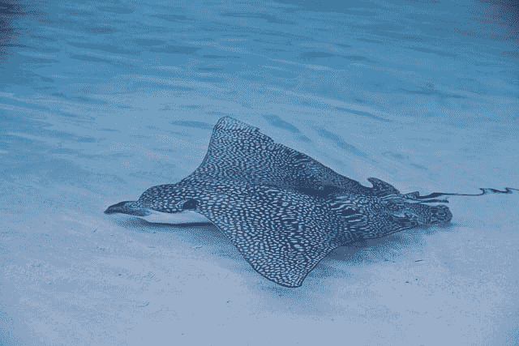
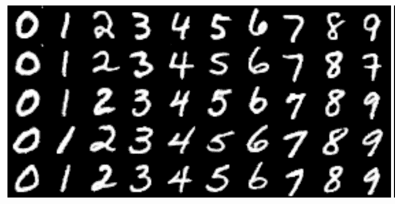
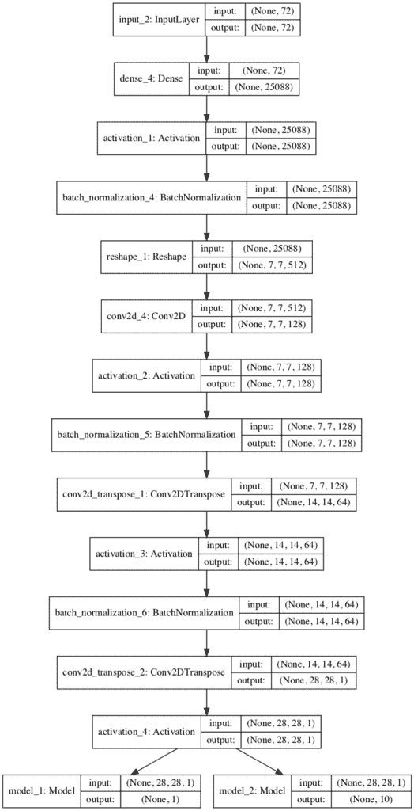
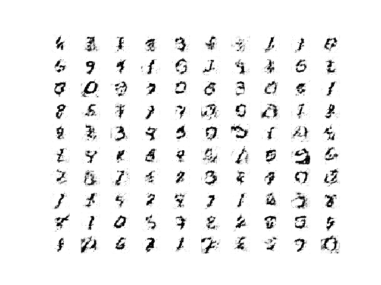
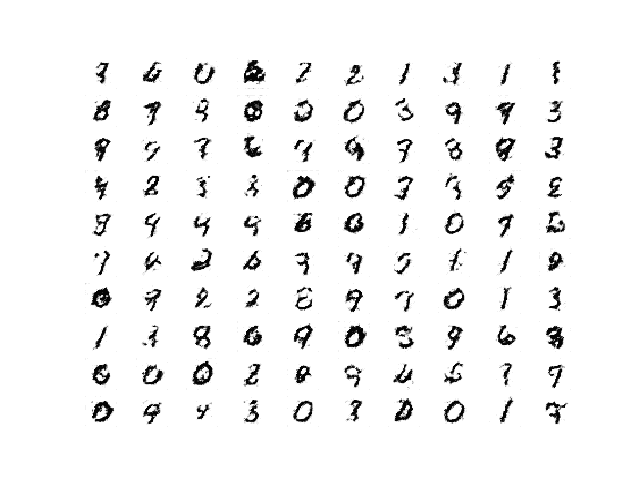
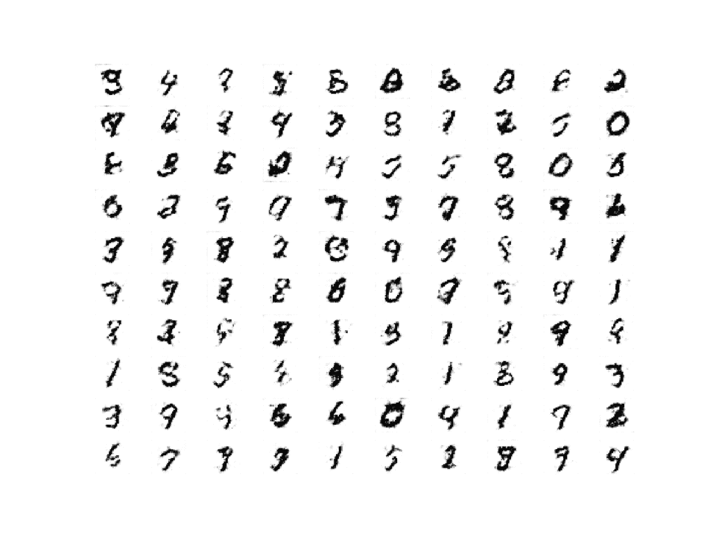
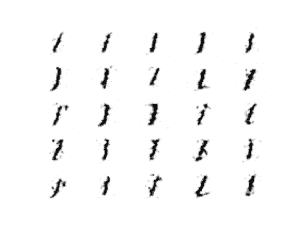
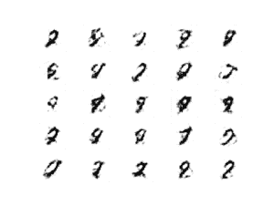

# 如何在 Keras 开发信息最大化 GAN(InfoGAN)

> 原文：<https://machinelearningmastery.com/how-to-develop-an-information-maximizing-generative-adversarial-network-infogan-in-keras/>

最后更新于 2021 年 1 月 18 日

生成对抗网络是一种用于训练深度卷积模型以生成合成图像的体系结构。

尽管非常有效，但默认的 GAN 无法控制生成的图像类型。信息最大化 GAN，简称 InfoGAN，是 GAN 架构的扩展，它引入了由架构自动学习的控制变量，并允许对生成的图像进行控制，例如在生成手写数字图像的情况下的样式、厚度和类型。

在本教程中，您将发现如何从零开始实施信息最大化生成对抗网络模型。

完成本教程后，您将知道:

*   InfoGAN 的动机是希望解开和控制生成图像中的属性。
*   InfoGAN 包括添加控制变量，以生成预测控制变量的辅助模型，该模型通过相互信息损失函数进行训练。
*   如何从零开始开发和训练一个 InfoGAN 模型，并使用控制变量来控制模型生成哪个数字。

**用我的新书[Python 生成对抗网络](https://machinelearningmastery.com/generative_adversarial_networks/)启动你的项目**，包括*分步教程*和所有示例的 *Python 源代码*文件。

我们开始吧。

*   **2019 年 10 月更新**:修正了相互信息丢失解释中的错别字。
*   **2021 年 1 月更新**:更新了所以图层冻结用批量定额工作。



如何在喀拉斯开发一个信息最大化的生成对抗网络(InfoGAN)图片由[伊罗尔·特拉蒙特](https://www.flickr.com/photos/iroltrasmonte/7351467350)提供，版权所有。

## 教程概述

本教程分为四个部分；它们是:

1.  什么是信息最大化
2.  如何实现信息增益损耗函数
3.  如何为 MNIST 开发信息甘
4.  如何使用训练有素的信息甘模型的控制代码

## 什么是信息最大化

生成对抗网络，简称 GAN，是一种用于训练生成模型的架构，例如用于生成合成图像的模型。

它包括用鉴别器模型同时训练用于生成图像的生成器模型，该鉴别器模型学习将图像分类为真实的(来自训练数据集)或虚假的(生成的)。这两个模型在零和游戏中竞争，因此训练过程的收敛包括在生成器生成令人信服的图像的技能和鉴别器检测图像的能力之间找到平衡。

生成器模型将潜在空间中的随机点作为输入，通常是 50 到 100 个随机高斯变量。生成器通过训练对潜在空间中的点应用唯一的含义，并将点映射到特定的输出合成图像。这意味着，尽管潜在空间是由生成器模型构造的，但是对生成的图像没有控制。

> GAN 公式使用简单的因子化连续输入噪声矢量 z，同时对发生器使用该噪声的方式没有限制。因此，噪声可能会被生成器以高度纠缠的方式使用，导致 z 的各个维度与数据的语义特征不一致。

——[InfoGAN:通过信息最大化生成对抗网进行可解释表征学习](https://arxiv.org/abs/1606.03657)，2016。

可以探索潜在空间并比较生成的图像，以试图理解生成器模型已经学习的映射。或者，可以对生成过程进行调节，例如通过类别标签，以便可以按需创建特定类型的图像。这是条件生成对抗网络的基础。

另一种方法是提供控制变量作为发生器的输入，以及潜在空间中的点(噪声)。可以训练生成器使用控制变量来影响生成图像的特定属性。这是信息最大化生成对抗网络(简称 InfoGAN)采用的方法。

> InfoGAN，生成对抗网络的信息论扩展，能够以完全无监督的方式学习不纠缠的表示。

——[InfoGAN:通过信息最大化生成对抗网进行可解释表征学习](https://arxiv.org/abs/1606.03657)，2016。

生成器在训练过程中学习的结构化映射有些随机。尽管生成器模型学习在潜在空间中空间分离生成的图像的属性，但是没有控制。性质是纠缠的。InfoGAN 的动机是希望解开生成图像的属性。

例如，在面的情况下，生成面的属性可以被解开和控制，例如面的形状、头发颜色、发型等等。

> 例如，对于人脸数据集，有用的解纠结表示可以为以下属性中的每一个分配单独的维度集:面部表情、眼睛颜色、发型、有无眼镜以及相应人的身份。

——[InfoGAN:通过信息最大化生成对抗网进行可解释表征学习](https://arxiv.org/abs/1606.03657)，2016。

控制变量与噪声一起作为输入提供给发生器，模型通过互信息损失函数进行训练。

> ……我们对生成对抗网络目标提出了一个简单的修改，鼓励它学习可解释和有意义的表示。我们通过最大化 GAN 噪声变量的固定小子集和观测值之间的互信息来做到这一点，这被证明是相对简单的。

——[InfoGAN:通过信息最大化生成对抗网进行可解释表征学习](https://arxiv.org/abs/1606.03657)，2016。

[互信息](https://machinelearningmastery.com/information-gain-and-mutual-information/)是指在给定一个变量的情况下，对另一个变量所学习的信息量。在这种情况下，给定使用噪声和控制变量生成的图像，我们对关于控制变量的信息感兴趣。

在信息论中，X 和 Y 之间的互信息，I(X；Y)，衡量从随机变量 Y 关于另一个随机变量 x 的知识中学到的“*信息量*

互信息(MI)计算为给定图像的控制变量(c)的条件熵(由生成器(G)从噪声(z)和控制变量(c)中创建)减去控制变量(c)的边缘熵；例如:

*   MI =熵(c)–熵(c)；G(z，c))

实际上，计算真实的互信息通常是困难的，尽管本文采用了简化的方法，称为变分信息最大化，并且控制码的熵保持不变。有关相互信息的更多信息，请参见教程:

*   [机器学习的信息增益和互信息](https://machinelearningmastery.com/information-gain-and-mutual-information/)

通过相互信息训练发电机是通过使用一个新的模型，称为 Q 或辅助模型来实现的。新模型与用于解释输入图像的鉴别器模型共享所有相同的权重，但是与预测图像是真还是假的鉴别器模型不同，辅助模型预测用于生成图像的控制代码。

这两个模型都用于更新生成器模型，首先是为了提高生成欺骗鉴别器模型的图像的可能性，其次是为了提高用于生成图像的控制代码和辅助模型对控制代码的预测之间的互信息。

结果是，生成器模型通过互信息损失被正则化，使得控制代码捕获生成的图像的显著属性，并且反过来可以用于控制图像生成过程。

> ……只要我们有兴趣学习从给定输入 X 到保留原始输入信息的更高级表示 Y 的参数化映射，就可以利用互信息。[……]表明最大化互信息的任务本质上等同于训练自动编码器以最小化重构误差。

——[了解互信息及其在 InfoGAN](https://mrdrozdov.github.io/static/papers/infogan.pdf) 中的使用，2016。

## 如何实现信息增益损耗函数

一旦您熟悉了模型的输入和输出，InfoGAN 就相当容易实现了。

唯一的绊脚石可能是相互信息丢失函数，尤其是如果你没有像大多数开发人员那样强大的数学背景。

InfoGan 使用的控制变量主要有两种类型:分类变量和连续变量，连续变量可能具有不同的数据分布，这会影响相互损失的计算方式。基于变量类型，可以跨所有控制变量计算和求和相互损失，这是 OpenAI 为 TensorFlow 发布的[官方 InfoGAN 实现](https://github.com/openai/InfoGAN)中使用的方法。

在 Keras 中，可能更容易将控制变量简化为分类变量和高斯或均匀连续变量，并在辅助模型上为每种控制变量类型提供单独的输出。这样可以使用不同的损耗函数，大大简化了实现。

请参阅“进一步阅读”部分的文章和帖子，了解本部分建议的更多背景信息。

### 分类控制变量

分类变量可用于控制生成图像的类型或类别。

这被实现为[一个热编码向量](https://machinelearningmastery.com/why-one-hot-encode-data-in-machine-learning/)。也就是说，如果该类有 10 个值，那么控制代码将是一个类，例如 6，并且生成器模型的分类控制向量输入将是所有零值的 10 元素向量，对于类 6 具有 1 个值，例如[0，0，0，0，0，0，0，1，0，0]。

在训练模型时，我们不需要选择分类控制变量；取而代之的是，它们是随机生成的，例如，每个样本以统一的概率被选择。

> ……潜在码 c∞Cat 上的一致分类分布(K = 10，p = 0.1)

——[InfoGAN:通过信息最大化生成对抗网进行可解释表征学习](https://arxiv.org/abs/1606.03657)，2016。

在辅助模型中，分类变量的输出层也将是一个热编码向量，以匹配输入控制代码，并使用 softmax 激活函数。

> 对于分类潜在码 ci，我们使用 softmax 非线性的自然选择来表示 Q(ci |x)。

——[InfoGAN:通过信息最大化生成对抗网进行可解释表征学习](https://arxiv.org/abs/1606.03657)，2016。

回想一下，互信息被计算为来自控制变量的条件熵，以及从提供给输入变量的控制变量的熵中减去辅助模型的输出。我们可以直接实现这个，但是没有必要。

控制变量的熵是一个常数，结果是一个非常小的接近于零的数字；因此，我们可以将其从我们的计算中移除。条件熵可以直接计算为控制变量输入和辅助模型输出之间的交叉熵。因此，可以使用分类交叉熵损失函数，就像我们对任何多类分类问题一样。

超参数 lambda 用于缩放互信息损失函数，并设置为 1，因此可以忽略。

> 即使 InfoGAN 引入了一个额外的超参数λ，它也很容易调整，简单地设置为 1 就足以处理离散的潜在代码。

——[InfoGAN:通过信息最大化生成对抗网进行可解释表征学习](https://arxiv.org/abs/1606.03657)，2016。

### 连续控制变量

连续控制变量可用于控制图像的风格。

连续变量从均匀分布(例如-1 和 1 之间)中采样，并作为输入提供给生成器模型。

> …能够捕捉本质上连续变化的连续代码:c2，C3∞Unif(1，1)

——[InfoGAN:通过信息最大化生成对抗网进行可解释表征学习](https://arxiv.org/abs/1606.03657)，2016。

辅助模型可以实现对具有高斯分布的连续控制变量的预测，其中输出层被配置为具有一个节点，即平均值，和一个高斯标准差的节点，例如每个连续控制变量需要两个输出。

> 对于连续潜在码 cj，取决于什么是真正的后验 P(cj |x)，有更多的选择。在我们的实验中，我们发现简单地将 Q(cj |x)视为因子化高斯就足够了。

——[InfoGAN:通过信息最大化生成对抗网进行可解释表征学习](https://arxiv.org/abs/1606.03657)，2016。

输出平均值的节点可以使用线性激活函数，而输出标准差的节点必须产生正值，因此可以使用激活函数(如 sigmoid)来创建 0 到 1 之间的值。

> 对于连续潜在码，我们通过对角高斯分布参数化近似后验，识别网络输出其均值和标准差，其中标准差通过网络输出的指数变换参数化以确保正定性。

——[InfoGAN:通过信息最大化生成对抗网进行可解释表征学习](https://arxiv.org/abs/1606.03657)，2016。

损失函数必须作为高斯控制码的互信息来计算，这意味着在计算损失之前，必须根据平均值和标准偏差来重构它们。计算高斯分布变量的熵和条件熵可以直接实现，尽管不是必须的。相反，可以使用均方误差损失。

或者，输出分布可以简化为每个控制变量的均匀分布，可以使用具有线性激活的辅助模型中每个变量的单个输出节点，并且模型可以使用均方误差损失函数。

## 如何为 MNIST 开发信息甘

在这一节中，我们将仔细研究生成器(g)、鉴别器(d)和辅助模型(q)以及如何在 Keras 中实现它们。

我们将为 MNIST 数据集开发一个 InfoGAN 实现，正如 InfoGAN 论文中所做的那样。

本文探讨了两个版本；第一种只使用分类控制代码，允许模型将一个分类变量映射到大约一个数字(尽管没有分类变量对数字的排序)。



通过类别控制代码的值改变生成数字的示例。
摘自 InfoGan 论文。

本文还探讨了 InfoGAN 架构的一个版本，其中包含一个热编码分类变量(c1)和两个连续控制变量(c2 和 c3)。

发现第一个连续变量控制手指的旋转，第二个变量控制手指的粗细。


使用连续控制代码改变生成的数字倾斜度和厚度的示例。
摘自 InfoGan 论文。

我们将关注使用具有 10 个值的分类控制变量的简单情况，并鼓励模型学习让这个变量控制生成的数字。您可能希望通过更改分类控制变量的基数或添加连续控制变量来扩展这个示例。

用于在 MNIST 数据集上进行训练的全球导航卫星系统模型的配置作为该文件的附录提供，转载如下。我们将使用列出的配置作为开发我们自己的生成器(g)、鉴别器(d)和辅助(q)模型的起点。


MNIST 训练信息网的发生器、鉴别器和辅助模型配置总结。
摘自 InfoGan 论文。

让我们从将生成器模型开发为深度卷积神经网络(例如 DCGAN)开始。

该模型可以将噪声向量(z)和控制向量(c)作为单独的输入，并在将它们用作生成图像的基础之前将它们连接起来。或者，可以预先将向量连接起来，并提供给模型中的单个输入层。这两种方法是等效的，在这种情况下，我们将使用后者来保持模型简单。

下面的 *define_generator()* 函数定义了生成器模型，并将输入向量的大小作为参数。

一个完全连通的图层获取输入向量，并产生足够数量的激活，以创建 512 个 7×7 的特征图，从这些特征图中激活被重塑。然后，这些通过具有 1×1 步距的正常卷积层，然后两个后续的上放大以 [2×2 步距](https://machinelearningmastery.com/padding-and-stride-for-convolutional-neural-networks/)将卷积层首先转置到 14×14 特征映射，然后通过 tanh 激活函数转置到像素值在[-1，-1]范围内的期望 1 通道 28×28 特征映射输出。

好的生成器配置试探法如下，包括随机高斯权重初始化、[隐藏层中的 ReLU 激活](https://machinelearningmastery.com/rectified-linear-activation-function-for-deep-learning-neural-networks/)，以及使用批量归一化。

```py
# define the standalone generator model
def define_generator(gen_input_size):
	# weight initialization
	init = RandomNormal(stddev=0.02)
	# image generator input
	in_lat = Input(shape=(gen_input_size,))
	# foundation for 7x7 image
	n_nodes = 512 * 7 * 7
	gen = Dense(n_nodes, kernel_initializer=init)(in_lat)
	gen = Activation('relu')(gen)
	gen = BatchNormalization()(gen)
	gen = Reshape((7, 7, 512))(gen)
	# normal
	gen = Conv2D(128, (4,4), padding='same', kernel_initializer=init)(gen)
	gen = Activation('relu')(gen)
	gen = BatchNormalization()(gen)
	# upsample to 14x14
	gen = Conv2DTranspose(64, (4,4), strides=(2,2), padding='same', kernel_initializer=init)(gen)
	gen = Activation('relu')(gen)
	gen = BatchNormalization()(gen)
	# upsample to 28x28
	gen = Conv2DTranspose(1, (4,4), strides=(2,2), padding='same', kernel_initializer=init)(gen)
	# tanh output
	out_layer = Activation('tanh')(gen)
	# define model
	model = Model(in_lat, out_layer)
	return model
```

接下来，我们可以定义鉴别器和辅助模型。

鉴别器模型以独立的方式在真实和虚假图像上进行训练，就像普通的 GAN 一样。发电机和辅助模型都不直接匹配；相反，它们适合作为复合模型的一部分。

鉴别器和辅助模型共享相同的输入和特征提取层，但输出层不同。因此，同时定义它们是有意义的。

同样，这种体系结构有许多实现方式，但是首先将鉴别器和辅助模型定义为单独的模型允许我们稍后通过[功能 API](https://machinelearningmastery.com/keras-functional-api-deep-learning/) 直接将它们组合成一个更大的 GAN 模型。

下面的 *define_discriminator()* 函数定义了鉴别器和辅助模型，并将分类变量的基数(例如数值的个数，如 10)作为输入。输入图像的形状也被参数化为函数参数，并设置为 MNIST 图像大小的默认值。

特征提取层涉及两个下采样层，作为最佳实践，使用这两个下采样层代替[池化层](https://machinelearningmastery.com/pooling-layers-for-convolutional-neural-networks/)。同样遵循 DCGAN 模型的最佳实践，我们使用 LeakyReLU 激活和[批处理规范化](https://machinelearningmastery.com/batch-normalization-for-training-of-deep-neural-networks/)。

鉴别器模型(d)具有单个输出节点，并通过 sigmoid 激活函数预测输入图像真实的概率。该模型将独立使用，通过具有最佳实践学习率和动量的随机梯度下降的[亚当版本](https://machinelearningmastery.com/adam-optimization-algorithm-for-deep-learning/)优化[二元交叉熵函数](https://machinelearningmastery.com/how-to-choose-loss-functions-when-training-deep-learning-neural-networks/)。

辅助模型(q)对于分类变量中的每个值都有一个节点输出，并使用 softmax 激活函数。像 InfoGAN 论文中使用的那样，在特征提取层和输出层之间添加了一个完全连接的层。模型不会被编译，因为它不是以独立的方式形成或使用的。

```py
# define the standalone discriminator model
def define_discriminator(n_cat, in_shape=(28,28,1)):
	# weight initialization
	init = RandomNormal(stddev=0.02)
	# image input
	in_image = Input(shape=in_shape)
	# downsample to 14x14
	d = Conv2D(64, (4,4), strides=(2,2), padding='same', kernel_initializer=init)(in_image)
	d = LeakyReLU(alpha=0.1)(d)
	# downsample to 7x7
	d = Conv2D(128, (4,4), strides=(2,2), padding='same', kernel_initializer=init)(d)
	d = LeakyReLU(alpha=0.1)(d)
	d = BatchNormalization()(d)
	# normal
	d = Conv2D(256, (4,4), padding='same', kernel_initializer=init)(d)
	d = LeakyReLU(alpha=0.1)(d)
	d = BatchNormalization()(d)
	# flatten feature maps
	d = Flatten()(d)
	# real/fake output
	out_classifier = Dense(1, activation='sigmoid')(d)
	# define d model
	d_model = Model(in_image, out_classifier)
	# compile d model
	d_model.compile(loss='binary_crossentropy', optimizer=Adam(lr=0.0002, beta_1=0.5))
	# create q model layers
	q = Dense(128)(d)
	q = BatchNormalization()(q)
	q = LeakyReLU(alpha=0.1)(q)
	# q model output
	out_codes = Dense(n_cat, activation='softmax')(q)
	# define q model
	q_model = Model(in_image, out_codes)
	return d_model, q_model
```

接下来，我们可以定义复合 GAN 模型。

该模型使用所有子模型，并且是训练生成器模型的权重的基础。

下面的 *define_gan()* 函数实现了这一点，定义并返回模型，将三个子模型作为输入。

如上所述，鉴别器是以独立方式训练的，因此鉴别器的所有权重都被设置为不可训练(仅在本文中)。生成器模型的输出连接到鉴别器模型的输入和辅助模型的输入。

这将创建一个新的复合模型，该模型将[噪声+控制]向量作为输入，然后通过生成器生成图像。图像然后通过鉴别器模型产生分类，并通过辅助模型产生控制变量的预测。

该模型有两个输出层，需要用不同的损失函数进行训练。二进制交叉熵损失用于鉴别器输出，正如我们在编译独立使用的鉴别器时所做的那样，互信息损失用于辅助模型，在这种情况下，辅助模型可以直接实现为分类交叉熵，并获得期望的结果。

```py
# define the combined discriminator, generator and q network model
def define_gan(g_model, d_model, q_model):
	# make weights in the discriminator (some shared with the q model) as not trainable
	for layer in d_model.layers:
		if not isinstance(layer, BatchNormalization):
			layer.trainable = False
	# connect g outputs to d inputs
	d_output = d_model(g_model.output)
	# connect g outputs to q inputs
	q_output = q_model(g_model.output)
	# define composite model
	model = Model(g_model.input, [d_output, q_output])
	# compile model
	opt = Adam(lr=0.0002, beta_1=0.5)
	model.compile(loss=['binary_crossentropy', 'categorical_crossentropy'], optimizer=opt)
	return model
```

为了使 GAN 模型架构更加清晰，我们可以创建模型和复合模型的图。

下面列出了完整的示例。

```py
# create and plot the infogan model for mnist
from keras.optimizers import Adam
from keras.models import Model
from keras.layers import Input
from keras.layers import Dense
from keras.layers import Reshape
from keras.layers import Flatten
from keras.layers import Conv2D
from keras.layers import Conv2DTranspose
from keras.layers import LeakyReLU
from keras.layers import BatchNormalization
from keras.layers import Activation
from keras.initializers import RandomNormal
from keras.utils.vis_utils import plot_model

# define the standalone discriminator model
def define_discriminator(n_cat, in_shape=(28,28,1)):
	# weight initialization
	init = RandomNormal(stddev=0.02)
	# image input
	in_image = Input(shape=in_shape)
	# downsample to 14x14
	d = Conv2D(64, (4,4), strides=(2,2), padding='same', kernel_initializer=init)(in_image)
	d = LeakyReLU(alpha=0.1)(d)
	# downsample to 7x7
	d = Conv2D(128, (4,4), strides=(2,2), padding='same', kernel_initializer=init)(d)
	d = LeakyReLU(alpha=0.1)(d)
	d = BatchNormalization()(d)
	# normal
	d = Conv2D(256, (4,4), padding='same', kernel_initializer=init)(d)
	d = LeakyReLU(alpha=0.1)(d)
	d = BatchNormalization()(d)
	# flatten feature maps
	d = Flatten()(d)
	# real/fake output
	out_classifier = Dense(1, activation='sigmoid')(d)
	# define d model
	d_model = Model(in_image, out_classifier)
	# compile d model
	d_model.compile(loss='binary_crossentropy', optimizer=Adam(lr=0.0002, beta_1=0.5))
	# create q model layers
	q = Dense(128)(d)
	q = BatchNormalization()(q)
	q = LeakyReLU(alpha=0.1)(q)
	# q model output
	out_codes = Dense(n_cat, activation='softmax')(q)
	# define q model
	q_model = Model(in_image, out_codes)
	return d_model, q_model

# define the standalone generator model
def define_generator(gen_input_size):
	# weight initialization
	init = RandomNormal(stddev=0.02)
	# image generator input
	in_lat = Input(shape=(gen_input_size,))
	# foundation for 7x7 image
	n_nodes = 512 * 7 * 7
	gen = Dense(n_nodes, kernel_initializer=init)(in_lat)
	gen = Activation('relu')(gen)
	gen = BatchNormalization()(gen)
	gen = Reshape((7, 7, 512))(gen)
	# normal
	gen = Conv2D(128, (4,4), padding='same', kernel_initializer=init)(gen)
	gen = Activation('relu')(gen)
	gen = BatchNormalization()(gen)
	# upsample to 14x14
	gen = Conv2DTranspose(64, (4,4), strides=(2,2), padding='same', kernel_initializer=init)(gen)
	gen = Activation('relu')(gen)
	gen = BatchNormalization()(gen)
	# upsample to 28x28
	gen = Conv2DTranspose(1, (4,4), strides=(2,2), padding='same', kernel_initializer=init)(gen)
	# tanh output
	out_layer = Activation('tanh')(gen)
	# define model
	model = Model(in_lat, out_layer)
	return model

# define the combined discriminator, generator and q network model
def define_gan(g_model, d_model, q_model):
	# make weights in the discriminator (some shared with the q model) as not trainable
	for layer in d_model.layers:
		if not isinstance(layer, BatchNormalization):
			layer.trainable = False
	# connect g outputs to d inputs
	d_output = d_model(g_model.output)
	# connect g outputs to q inputs
	q_output = q_model(g_model.output)
	# define composite model
	model = Model(g_model.input, [d_output, q_output])
	# compile model
	opt = Adam(lr=0.0002, beta_1=0.5)
	model.compile(loss=['binary_crossentropy', 'categorical_crossentropy'], optimizer=opt)
	return model

# number of values for the categorical control code
n_cat = 10
# size of the latent space
latent_dim = 62
# create the discriminator
d_model, q_model = define_discriminator(n_cat)
# create the generator
gen_input_size = latent_dim + n_cat
g_model = define_generator(gen_input_size)
# create the gan
gan_model = define_gan(g_model, d_model, q_model)
# plot the model
plot_model(gan_model, to_file='gan_plot.png', show_shapes=True, show_layer_names=True)
```

运行该示例会创建所有三个模型，然后创建复合 GAN 模型并保存模型体系结构图。

**注**:创建此图假设安装了 pydot 和 graphviz 库。如果这是一个问题，您可以注释掉导入语句和对 *plot_model()* 函数的调用。

该图显示了生成器模型的所有细节以及鉴别器和辅助模型的压缩描述。重要的是，注意鉴别器输出的形状，作为预测图像是真还是假的单个节点，10 个节点用于辅助模型来预测分类控制代码。

回想一下，该复合模型将仅用于更新生成器和辅助模型的模型权重，并且鉴别器模型中的所有权重将保持不可跟踪，即仅在独立鉴别器模型更新时更新。



用于训练发电机和辅助模型的复合信息甘模型图

接下来，我们将开发发电机的输入。

每个输入都是由噪声和控制代码组成的矢量。具体来说，[高斯随机数](https://machinelearningmastery.com/how-to-generate-random-numbers-in-python/)的向量和一个热编码随机选择的分类值。

下面的*generate _ 潜伏 _points()* 函数实现了这一点，将潜伏空间的大小、分类值的数量和要生成的样本数量作为参数作为输入。该函数返回输入串联矢量作为发电机模型的输入，以及独立控制代码。当通过复合 GAN 模型更新发电机和辅助模型时，将需要独立的控制代码，特别是用于计算辅助模型的相互信息损失。

```py
# generate points in latent space as input for the generator
def generate_latent_points(latent_dim, n_cat, n_samples):
	# generate points in the latent space
	z_latent = randn(latent_dim * n_samples)
	# reshape into a batch of inputs for the network
	z_latent = z_latent.reshape(n_samples, latent_dim)
	# generate categorical codes
	cat_codes = randint(0, n_cat, n_samples)
	# one hot encode
	cat_codes = to_categorical(cat_codes, num_classes=n_cat)
	# concatenate latent points and control codes
	z_input = hstack((z_latent, cat_codes))
	return [z_input, cat_codes]
```

接下来，我们可以生成真实和虚假的例子。

可以加载 MNIST 数据集，通过为灰度图像添加额外的维度并将所有像素值缩放到范围[-1，1]以匹配生成器模型的输出，将其转换为 3D 输入。这在下面的 *load_real_samples()* 函数中实现。

我们可以通过选择数据集的随机子集来检索训练鉴别器时所需的真实样本批次。这在下面的 *generate_real_samples()* 函数中实现，该函数返回图像和类别标签 1，以向鉴别器指示它们是真实图像。

鉴别器还需要通过生成器生成成批的假样本，使用来自*generate _ 潜伏 _points()* 函数的向量作为输入。下面的 *generate_fake_samples()* 函数实现了这一点，返回生成的图像以及类标签 0，以向鉴别器指示它们是假图像。

```py
# load images
def load_real_samples():
	# load dataset
	(trainX, _), (_, _) = load_data()
	# expand to 3d, e.g. add channels
	X = expand_dims(trainX, axis=-1)
	# convert from ints to floats
	X = X.astype('float32')
	# scale from [0,255] to [-1,1]
	X = (X - 127.5) / 127.5
	print(X.shape)
	return X

# select real samples
def generate_real_samples(dataset, n_samples):
	# choose random instances
	ix = randint(0, dataset.shape[0], n_samples)
	# select images and labels
	X = dataset[ix]
	# generate class labels
	y = ones((n_samples, 1))
	return X, y

# use the generator to generate n fake examples, with class labels
def generate_fake_samples(generator, latent_dim, n_cat, n_samples):
	# generate points in latent space and control codes
	z_input, _ = generate_latent_points(latent_dim, n_cat, n_samples)
	# predict outputs
	images = generator.predict(z_input)
	# create class labels
	y = zeros((n_samples, 1))
	return images, y
```

接下来，我们需要跟踪生成图像的质量。

我们将定期使用生成器生成图像样本，并将生成器和合成模型保存到文件中。然后，我们可以在训练结束时查看生成的图像，以便选择最终的生成器模型，并加载该模型以开始使用它来生成图像。

下面的*summary _ performance()*函数实现了这一点，首先生成 100 个图像，将它们的像素值缩放回范围[0，1]，并将其保存为 10×10 平方的图像图。

生成器和复合 GAN 模型也保存到文件中，并根据训练迭代号使用唯一的文件名。

```py
# generate samples and save as a plot and save the model
def summarize_performance(step, g_model, gan_model, latent_dim, n_cat, n_samples=100):
	# prepare fake examples
	X, _ = generate_fake_samples(g_model, latent_dim, n_cat, n_samples)
	# scale from [-1,1] to [0,1]
	X = (X + 1) / 2.0
	# plot images
	for i in range(100):
		# define subplot
		pyplot.subplot(10, 10, 1 + i)
		# turn off axis
		pyplot.axis('off')
		# plot raw pixel data
		pyplot.imshow(X[i, :, :, 0], cmap='gray_r')
	# save plot to file
	filename1 = 'generated_plot_%04d.png' % (step+1)
	pyplot.savefig(filename1)
	pyplot.close()
	# save the generator model
	filename2 = 'model_%04d.h5' % (step+1)
	g_model.save(filename2)
	# save the gan model
	filename3 = 'gan_model_%04d.h5' % (step+1)
	gan_model.save(filename3)
	print('>Saved: %s, %s, and %s' % (filename1, filename2, filename3))
```

最后，我们可以训练信息甘。

这在下面的 *train()* 函数中实现，该函数将定义的模型和配置作为参数并运行训练过程。

模型被训练了 100 个时期，每个批次使用 64 个样本。MNIST 训练数据集中有 60，000 幅图像，因此一个时期涉及 60，000/64，或 937 个批次或训练迭代。将其乘以纪元的数量，即 100，意味着总共将有 93，700 次训练迭代。

每次训练迭代都包括首先用半批真实样本和半批伪样本更新鉴别器，以在每次迭代中形成一批有价值的权重更新，即 64。接下来，基于一批有价值的噪声和控制代码输入来更新复合 GAN 模型。在每次训练迭代中报告真假图像鉴别器的损失以及生成器和辅助模型的损失。

```py
# train the generator and discriminator
def train(g_model, d_model, gan_model, dataset, latent_dim, n_cat, n_epochs=100, n_batch=64):
	# calculate the number of batches per training epoch
	bat_per_epo = int(dataset.shape[0] / n_batch)
	# calculate the number of training iterations
	n_steps = bat_per_epo * n_epochs
	# calculate the size of half a batch of samples
	half_batch = int(n_batch / 2)
	# manually enumerate epochs
	for i in range(n_steps):
		# get randomly selected 'real' samples
		X_real, y_real = generate_real_samples(dataset, half_batch)
		# update discriminator and q model weights
		d_loss1 = d_model.train_on_batch(X_real, y_real)
		# generate 'fake' examples
		X_fake, y_fake = generate_fake_samples(g_model, latent_dim, n_cat, half_batch)
		# update discriminator model weights
		d_loss2 = d_model.train_on_batch(X_fake, y_fake)
		# prepare points in latent space as input for the generator
		z_input, cat_codes = generate_latent_points(latent_dim, n_cat, n_batch)
		# create inverted labels for the fake samples
		y_gan = ones((n_batch, 1))
		# update the g via the d and q error
		_,g_1,g_2 = gan_model.train_on_batch(z_input, [y_gan, cat_codes])
		# summarize loss on this batch
		print('>%d, d[%.3f,%.3f], g[%.3f] q[%.3f]' % (i+1, d_loss1, d_loss2, g_1, g_2))
		# evaluate the model performance every 'epoch'
		if (i+1) % (bat_per_epo * 10) == 0:
			summarize_performance(i, g_model, gan_model, latent_dim, n_cat)
```

然后，我们可以配置和创建模型，然后运行培训过程。

我们将使用单个分类变量的 10 个值来匹配 MNIST 数据集中的 10 个已知类。我们将使用 64 维的潜在空间来匹配 InfoGAN 论文，这意味着，在这种情况下，生成器模型的每个输入向量将是 64(随机高斯变量)+ 10(一个热编码控制变量)或 72 个元素的长度。

```py
# number of values for the categorical control code
n_cat = 10
# size of the latent space
latent_dim = 62
# create the discriminator
d_model, q_model = define_discriminator(n_cat)
# create the generator
gen_input_size = latent_dim + n_cat
g_model = define_generator(gen_input_size)
# create the gan
gan_model = define_gan(g_model, d_model, q_model)
# load image data
dataset = load_real_samples()
# train model
train(g_model, d_model, gan_model, dataset, latent_dim, n_cat)
```

将这些联系在一起，下面列出了在 MNIST 数据集上使用单个分类控制变量训练 InfoGAN 模型的完整示例。

```py
# example of training an infogan on mnist
from numpy import zeros
from numpy import ones
from numpy import expand_dims
from numpy import hstack
from numpy.random import randn
from numpy.random import randint
from keras.datasets.mnist import load_data
from keras.optimizers import Adam
from keras.initializers import RandomNormal
from keras.utils import to_categorical
from keras.models import Model
from keras.layers import Input
from keras.layers import Dense
from keras.layers import Reshape
from keras.layers import Flatten
from keras.layers import Conv2D
from keras.layers import Conv2DTranspose
from keras.layers import LeakyReLU
from keras.layers import BatchNormalization
from keras.layers import Activation
from matplotlib import pyplot

# define the standalone discriminator model
def define_discriminator(n_cat, in_shape=(28,28,1)):
	# weight initialization
	init = RandomNormal(stddev=0.02)
	# image input
	in_image = Input(shape=in_shape)
	# downsample to 14x14
	d = Conv2D(64, (4,4), strides=(2,2), padding='same', kernel_initializer=init)(in_image)
	d = LeakyReLU(alpha=0.1)(d)
	# downsample to 7x7
	d = Conv2D(128, (4,4), strides=(2,2), padding='same', kernel_initializer=init)(d)
	d = LeakyReLU(alpha=0.1)(d)
	d = BatchNormalization()(d)
	# normal
	d = Conv2D(256, (4,4), padding='same', kernel_initializer=init)(d)
	d = LeakyReLU(alpha=0.1)(d)
	d = BatchNormalization()(d)
	# flatten feature maps
	d = Flatten()(d)
	# real/fake output
	out_classifier = Dense(1, activation='sigmoid')(d)
	# define d model
	d_model = Model(in_image, out_classifier)
	# compile d model
	d_model.compile(loss='binary_crossentropy', optimizer=Adam(lr=0.0002, beta_1=0.5))
	# create q model layers
	q = Dense(128)(d)
	q = BatchNormalization()(q)
	q = LeakyReLU(alpha=0.1)(q)
	# q model output
	out_codes = Dense(n_cat, activation='softmax')(q)
	# define q model
	q_model = Model(in_image, out_codes)
	return d_model, q_model

# define the standalone generator model
def define_generator(gen_input_size):
	# weight initialization
	init = RandomNormal(stddev=0.02)
	# image generator input
	in_lat = Input(shape=(gen_input_size,))
	# foundation for 7x7 image
	n_nodes = 512 * 7 * 7
	gen = Dense(n_nodes, kernel_initializer=init)(in_lat)
	gen = Activation('relu')(gen)
	gen = BatchNormalization()(gen)
	gen = Reshape((7, 7, 512))(gen)
	# normal
	gen = Conv2D(128, (4,4), padding='same', kernel_initializer=init)(gen)
	gen = Activation('relu')(gen)
	gen = BatchNormalization()(gen)
	# upsample to 14x14
	gen = Conv2DTranspose(64, (4,4), strides=(2,2), padding='same', kernel_initializer=init)(gen)
	gen = Activation('relu')(gen)
	gen = BatchNormalization()(gen)
	# upsample to 28x28
	gen = Conv2DTranspose(1, (4,4), strides=(2,2), padding='same', kernel_initializer=init)(gen)
	# tanh output
	out_layer = Activation('tanh')(gen)
	# define model
	model = Model(in_lat, out_layer)
	return model

# define the combined discriminator, generator and q network model
def define_gan(g_model, d_model, q_model):
	# make weights in the discriminator (some shared with the q model) as not trainable
	for layer in d_model.layers:
		if not isinstance(layer, BatchNormalization):
			layer.trainable = False
	# connect g outputs to d inputs
	d_output = d_model(g_model.output)
	# connect g outputs to q inputs
	q_output = q_model(g_model.output)
	# define composite model
	model = Model(g_model.input, [d_output, q_output])
	# compile model
	opt = Adam(lr=0.0002, beta_1=0.5)
	model.compile(loss=['binary_crossentropy', 'categorical_crossentropy'], optimizer=opt)
	return model

# load images
def load_real_samples():
	# load dataset
	(trainX, _), (_, _) = load_data()
	# expand to 3d, e.g. add channels
	X = expand_dims(trainX, axis=-1)
	# convert from ints to floats
	X = X.astype('float32')
	# scale from [0,255] to [-1,1]
	X = (X - 127.5) / 127.5
	print(X.shape)
	return X

# select real samples
def generate_real_samples(dataset, n_samples):
	# choose random instances
	ix = randint(0, dataset.shape[0], n_samples)
	# select images and labels
	X = dataset[ix]
	# generate class labels
	y = ones((n_samples, 1))
	return X, y

# generate points in latent space as input for the generator
def generate_latent_points(latent_dim, n_cat, n_samples):
	# generate points in the latent space
	z_latent = randn(latent_dim * n_samples)
	# reshape into a batch of inputs for the network
	z_latent = z_latent.reshape(n_samples, latent_dim)
	# generate categorical codes
	cat_codes = randint(0, n_cat, n_samples)
	# one hot encode
	cat_codes = to_categorical(cat_codes, num_classes=n_cat)
	# concatenate latent points and control codes
	z_input = hstack((z_latent, cat_codes))
	return [z_input, cat_codes]

# use the generator to generate n fake examples, with class labels
def generate_fake_samples(generator, latent_dim, n_cat, n_samples):
	# generate points in latent space and control codes
	z_input, _ = generate_latent_points(latent_dim, n_cat, n_samples)
	# predict outputs
	images = generator.predict(z_input)
	# create class labels
	y = zeros((n_samples, 1))
	return images, y

# generate samples and save as a plot and save the model
def summarize_performance(step, g_model, gan_model, latent_dim, n_cat, n_samples=100):
	# prepare fake examples
	X, _ = generate_fake_samples(g_model, latent_dim, n_cat, n_samples)
	# scale from [-1,1] to [0,1]
	X = (X + 1) / 2.0
	# plot images
	for i in range(100):
		# define subplot
		pyplot.subplot(10, 10, 1 + i)
		# turn off axis
		pyplot.axis('off')
		# plot raw pixel data
		pyplot.imshow(X[i, :, :, 0], cmap='gray_r')
	# save plot to file
	filename1 = 'generated_plot_%04d.png' % (step+1)
	pyplot.savefig(filename1)
	pyplot.close()
	# save the generator model
	filename2 = 'model_%04d.h5' % (step+1)
	g_model.save(filename2)
	# save the gan model
	filename3 = 'gan_model_%04d.h5' % (step+1)
	gan_model.save(filename3)
	print('>Saved: %s, %s, and %s' % (filename1, filename2, filename3))

# train the generator and discriminator
def train(g_model, d_model, gan_model, dataset, latent_dim, n_cat, n_epochs=100, n_batch=64):
	# calculate the number of batches per training epoch
	bat_per_epo = int(dataset.shape[0] / n_batch)
	# calculate the number of training iterations
	n_steps = bat_per_epo * n_epochs
	# calculate the size of half a batch of samples
	half_batch = int(n_batch / 2)
	# manually enumerate epochs
	for i in range(n_steps):
		# get randomly selected 'real' samples
		X_real, y_real = generate_real_samples(dataset, half_batch)
		# update discriminator and q model weights
		d_loss1 = d_model.train_on_batch(X_real, y_real)
		# generate 'fake' examples
		X_fake, y_fake = generate_fake_samples(g_model, latent_dim, n_cat, half_batch)
		# update discriminator model weights
		d_loss2 = d_model.train_on_batch(X_fake, y_fake)
		# prepare points in latent space as input for the generator
		z_input, cat_codes = generate_latent_points(latent_dim, n_cat, n_batch)
		# create inverted labels for the fake samples
		y_gan = ones((n_batch, 1))
		# update the g via the d and q error
		_,g_1,g_2 = gan_model.train_on_batch(z_input, [y_gan, cat_codes])
		# summarize loss on this batch
		print('>%d, d[%.3f,%.3f], g[%.3f] q[%.3f]' % (i+1, d_loss1, d_loss2, g_1, g_2))
		# evaluate the model performance every 'epoch'
		if (i+1) % (bat_per_epo * 10) == 0:
			summarize_performance(i, g_model, gan_model, latent_dim, n_cat)

# number of values for the categorical control code
n_cat = 10
# size of the latent space
latent_dim = 62
# create the discriminator
d_model, q_model = define_discriminator(n_cat)
# create the generator
gen_input_size = latent_dim + n_cat
g_model = define_generator(gen_input_size)
# create the gan
gan_model = define_gan(g_model, d_model, q_model)
# load image data
dataset = load_real_samples()
# train model
train(g_model, d_model, gan_model, dataset, latent_dim, n_cat)
```

运行示例可能需要一些时间，建议使用 GPU 硬件，但不是必需的。

**注**:考虑到算法或评估程序的随机性，或数值精度的差异，您的[结果可能会有所不同](https://machinelearningmastery.com/different-results-each-time-in-machine-learning/)。考虑运行该示例几次，并比较平均结果。

在每次训练迭代中报告模型间的损失。如果鉴别器的损失保持在 0.0 或长时间达到 0.0，这可能是训练失败的信号，您可能需要重新开始训练过程。鉴别器损耗可能从 0.0 开始，但很可能会上升，就像在这种特定情况下一样。

辅助模型的损失可能会为零，因为它完美地预测了分类变量。生成器和鉴别器模型的损失最终可能会在 1.0 左右徘徊，以证明两个模型的训练过程稳定或平衡。

```py
>1, d[0.924,0.758], g[0.448] q[2.909]
>2, d[0.000,2.699], g[0.547] q[2.704]
>3, d[0.000,1.557], g[1.175] q[2.820]
>4, d[0.000,0.941], g[1.466] q[2.813]
>5, d[0.000,1.013], g[1.908] q[2.715]
...
>93696, d[0.814,1.212], g[1.283] q[0.000]
>93697, d[1.063,0.920], g[1.132] q[0.000]
>93698, d[0.999,1.188], g[1.128] q[0.000]
>93699, d[0.935,0.985], g[1.229] q[0.000]
>93700, d[0.968,1.016], g[1.200] q[0.001]
>Saved: generated_plot_93700.png, model_93700.h5, and gan_model_93700.h5
```

绘图和模型每 10 个时代或每 9370 次训练迭代保存一次。

审查图应显示早期的低质量图像和后期的改进和稳定质量图像。

例如，前 10 个纪元后保存的图像图如下，显示了低质量生成的图像。



信息甘在 10 个训练阶段后生成的 100 幅随机图像图

更多的时期并不意味着更好的质量，这意味着质量最好的图像可能不是那些在训练结束时保存的最终模型的图像。

查看图并选择具有最佳图像质量的最终模型。在这种情况下，我们将使用 100 个时代或 93，700 次训练迭代后保存的模型。



InfoGAN 在 100 个训练时期后生成的 100 幅随机图像的绘图

## 如何使用训练有素的信息甘模型的控制代码

现在我们已经训练了 InfoGAN 模型，我们可以探索如何使用它。

首先，我们可以加载模型，并使用它来生成随机图像，就像我们在训练期间所做的那样。

下面列出了完整的示例。

更改模型文件名，使其与训练运行期间生成最佳图像的模型文件名相匹配。

```py
# example of loading the generator model and generating images
from math import sqrt
from numpy import hstack
from numpy.random import randn
from numpy.random import randint
from keras.models import load_model
from keras.utils import to_categorical
from matplotlib import pyplot

# generate points in latent space as input for the generator
def generate_latent_points(latent_dim, n_cat, n_samples):
	# generate points in the latent space
	z_latent = randn(latent_dim * n_samples)
	# reshape into a batch of inputs for the network
	z_latent = z_latent.reshape(n_samples, latent_dim)
	# generate categorical codes
	cat_codes = randint(0, n_cat, n_samples)
	# one hot encode
	cat_codes = to_categorical(cat_codes, num_classes=n_cat)
	# concatenate latent points and control codes
	z_input = hstack((z_latent, cat_codes))
	return [z_input, cat_codes]

# create a plot of generated images
def create_plot(examples, n_examples):
	# plot images
	for i in range(n_examples):
		# define subplot
		pyplot.subplot(sqrt(n_examples), sqrt(n_examples), 1 + i)
		# turn off axis
		pyplot.axis('off')
		# plot raw pixel data
		pyplot.imshow(examples[i, :, :, 0], cmap='gray_r')
	pyplot.show()

# load model
model = load_model('model_93700.h5')
# number of values for the categorical control code
n_cat = 10
# size of the latent space
latent_dim = 62
# number of examples to generate
n_samples = 100
# generate points in latent space and control codes
z_input, _ = generate_latent_points(latent_dim, n_cat, n_samples)
# predict outputs
X = model.predict(z_input)
# scale from [-1,1] to [0,1]
X = (X + 1) / 2.0
# plot the result
create_plot(X, n_samples)
```

运行该示例将加载保存的生成器模型，并使用它生成 100 个随机图像，并将图像绘制在 10×10 的网格上。



通过加载保存的信息甘生成器模型创建的 100 幅随机图像图

接下来，我们可以更新这个例子来测试我们的控制变量给了我们多少控制。

我们可以更新*generate _ 潜伏 _points()* 函数，获取[0，9]中分类值的参数值，对其进行编码，并将其与噪声向量一起用作输入。

```py
# generate points in latent space as input for the generator
def generate_latent_points(latent_dim, n_cat, n_samples, digit):
	# generate points in the latent space
	z_latent = randn(latent_dim * n_samples)
	# reshape into a batch of inputs for the network
	z_latent = z_latent.reshape(n_samples, latent_dim)
	# define categorical codes
	cat_codes = asarray([digit for _ in range(n_samples)])
	# one hot encode
	cat_codes = to_categorical(cat_codes, num_classes=n_cat)
	# concatenate latent points and control codes
	z_input = hstack((z_latent, cat_codes))
	return [z_input, cat_codes]
```

我们可以通过生成分类值为 1 的 25 幅图像的网格来测试这一点。

下面列出了完整的示例。

```py
# example of testing different values of the categorical control variable
from math import sqrt
from numpy import asarray
from numpy import hstack
from numpy.random import randn
from numpy.random import randint
from keras.models import load_model
from keras.utils import to_categorical
from matplotlib import pyplot

# generate points in latent space as input for the generator
def generate_latent_points(latent_dim, n_cat, n_samples, digit):
	# generate points in the latent space
	z_latent = randn(latent_dim * n_samples)
	# reshape into a batch of inputs for the network
	z_latent = z_latent.reshape(n_samples, latent_dim)
	# define categorical codes
	cat_codes = asarray([digit for _ in range(n_samples)])
	# one hot encode
	cat_codes = to_categorical(cat_codes, num_classes=n_cat)
	# concatenate latent points and control codes
	z_input = hstack((z_latent, cat_codes))
	return [z_input, cat_codes]

# create and save a plot of generated images
def save_plot(examples, n_examples):
	# plot images
	for i in range(n_examples):
		# define subplot
		pyplot.subplot(sqrt(n_examples), sqrt(n_examples), 1 + i)
		# turn off axis
		pyplot.axis('off')
		# plot raw pixel data
		pyplot.imshow(examples[i, :, :, 0], cmap='gray_r')
	pyplot.show()

# load model
model = load_model('model_93700.h5')
# number of categorical control codes
n_cat = 10
# size of the latent space
latent_dim = 62
# number of examples to generate
n_samples = 25
# define digit
digit = 1
# generate points in latent space and control codes
z_input, _ = generate_latent_points(latent_dim, n_cat, n_samples, digit)
# predict outputs
X = model.predict(z_input)
# scale from [-1,1] to [0,1]
X = (X + 1) / 2.0
# plot the result
save_plot(X, n_samples)
```

结果是生成了一个由 25 幅图像组成的网格，分类代码设置为值 1。

**注**:考虑到算法或评估程序的随机性，或数值精度的差异，您的[结果可能会有所不同](https://machinelearningmastery.com/different-results-each-time-in-machine-learning/)。考虑运行该示例几次，并比较平均结果。

控制代码的值预计会影响生成的图像；具体来说，它们会影响数字类型。但是，不希望对它们进行排序，例如，1、2 和 3 的控制代码会创建这些数字。

然而，在这种情况下，值为 1 的控制代码产生了看起来像 1 的图像。



分类控制代码设置为 1 时由 InfoGAN 模型生成的 25 幅图像图

用不同的数字进行实验，并查看图像的确切控制值。

例如，在这种情况下将该值设置为 5(数字= 5)会生成看起来像数字“ *8* ”的图像。



分类控制代码设置为 5 的 InfoGAN 模型生成的 25 幅图像的图

## 扩展ˌ扩张

本节列出了一些您可能希望探索的扩展教程的想法。

*   **改变基数**。更新示例以使用分类控制变量的不同基数(例如，更多或更少的值)，并查看对训练过程和对生成图像的控制的影响。
*   **统一控制变量**。更新示例，向辅助模型添加两个统一的连续控制变量，并检查对训练过程的影响和对生成图像的控制。
*   **高斯控制变量**。更新示例，向辅助模型添加两个高斯连续控制变量，并查看对训练过程的影响和对生成图像的控制。

如果你探索这些扩展，我很想知道。
在下面的评论中发表你的发现。

## 进一步阅读

如果您想更深入地了解这个主题，本节将提供更多资源。

### 报纸

*   [InfoGAN:通过信息最大化生成对抗网络进行可解释表征学习](https://arxiv.org/abs/1606.03657)，2016。
*   [了解互信息及其在 InfoGAN](https://mrdrozdov.github.io/static/papers/infogan.pdf) 中的使用，2016。
*   [即时消息算法:信息最大化的变分方法](http://web4.cs.ucl.ac.uk/staff/D.Barber/publications/barber-agakov-IM-nips03.pdf)，2004。

### 应用程序接口

*   [硬数据集 API](https://keras.io/datasets/) .
*   [Keras 顺序模型 API](https://keras.io/models/sequential/)
*   [喀拉斯卷积层应用编程接口](https://keras.io/layers/convolutional/)
*   [如何“冻结”Keras 图层？](https://keras.io/getting-started/faq/#how-can-i-freeze-keras-layers)
*   [MatplotLib API](https://matplotlib.org/api/)
*   [NumPy 随机采样(numpy.random) API](https://docs.scipy.org/doc/numpy/reference/routines.random.html)
*   [NumPy 数组操作例程](https://docs.scipy.org/doc/numpy/reference/routines.array-manipulation.html)

### 项目

*   [InfoGAN(官方)，OpenAI，GitHub](https://github.com/openai/InfoGAN) 。
*   [一次性插入:一次性执行插入，GitHub](https://github.com/EmilienDupont/infogan) 。
*   [Keras-GAN:生成对抗网络的 Keras 实现，GitHub](https://github.com/eriklindernoren/Keras-GAN) 。
*   [高级-深度-与-Keras 学习，PacktPublishing，GitHub](https://github.com/PacktPublishing/Advanced-Deep-Learning-with-Keras) 。
*   [深度学习实施:实施最近的深度学习论文，GitHub](https://github.com/tdeboissiere/DeepLearningImplementations) 。

### 文章

*   [互信息，维基百科](https://en.wikipedia.org/wiki/Mutual_information)。
*   [条件互信息，维基百科](https://en.wikipedia.org/wiki/Conditional_mutual_information)。
*   [InfoGAN:利用互信息上的变分界(两次)](https://www.inference.vc/infogan-variational-bound-on-mutual-information-twice/)，2016。
*   [GANs，互信息，可能还有算法选择？](http://www.yingzhenli.net/home/blog/?p=421)，2016 年。
*   [实现 InfoGAN:比看起来容易？](http://aiden.nibali.org/blog/2016-12-01-implementing-infogan/)，2016 年。
*   [成本函数问题，深度学习实施项目，GitHub](https://github.com/tdeboissiere/DeepLearningImplementations/issues/47) 。

## 摘要

在本教程中，您发现了如何从零开始实现信息最大化生成对抗网络模型。

具体来说，您了解到:

*   InfoGAN 的动机是希望解开和控制生成图像中的属性。
*   InfoGAN 包括添加控制变量，以生成预测控制变量的辅助模型，该模型通过相互信息损失函数进行训练。
*   如何从零开始开发和训练一个 InfoGAN 模型，并使用控制变量来控制模型生成哪个数字。

你有什么问题吗？
在下面的评论中提问，我会尽力回答。