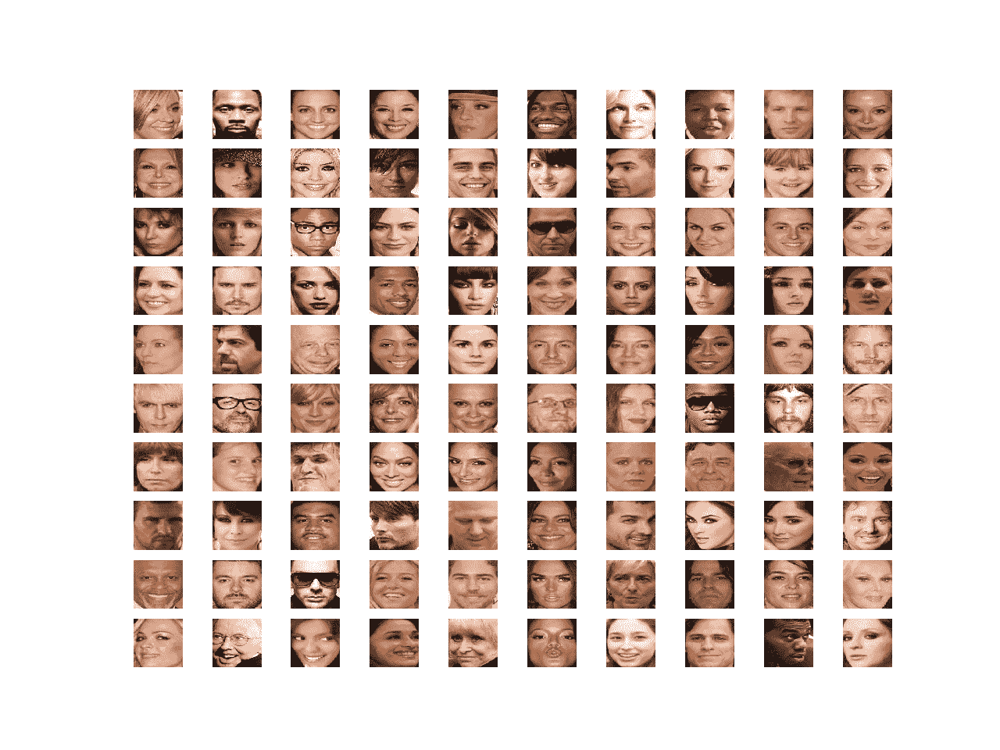
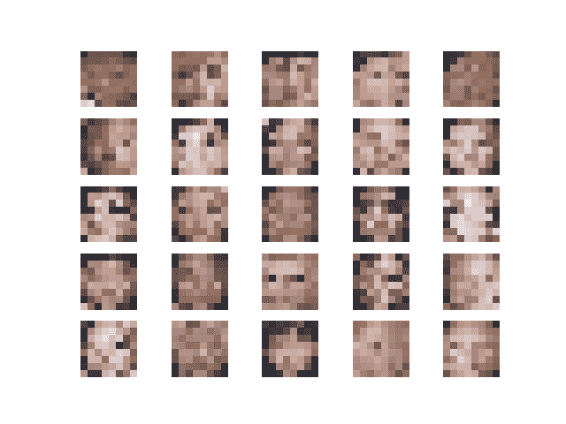
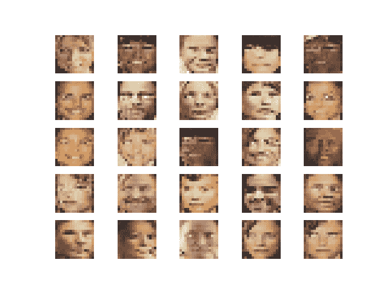
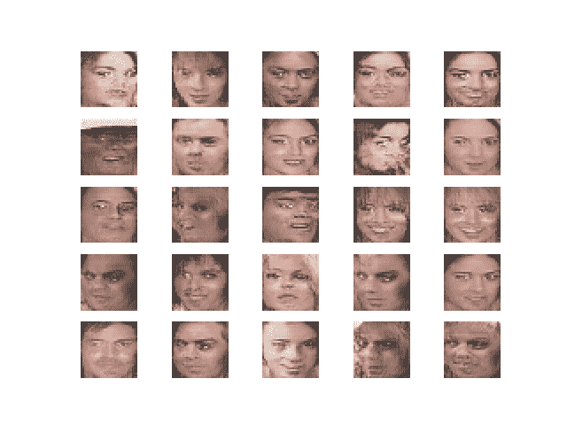
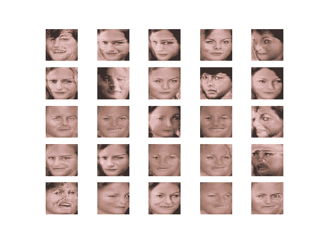
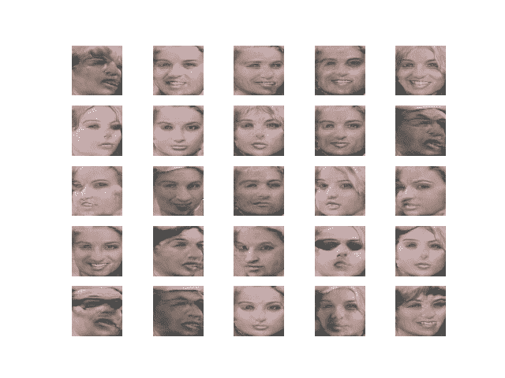
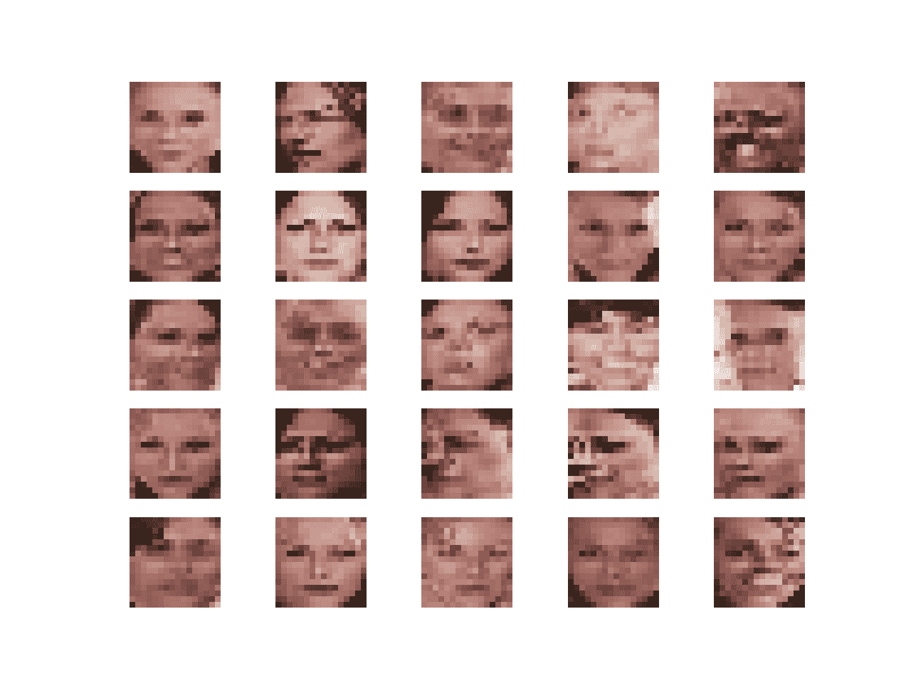
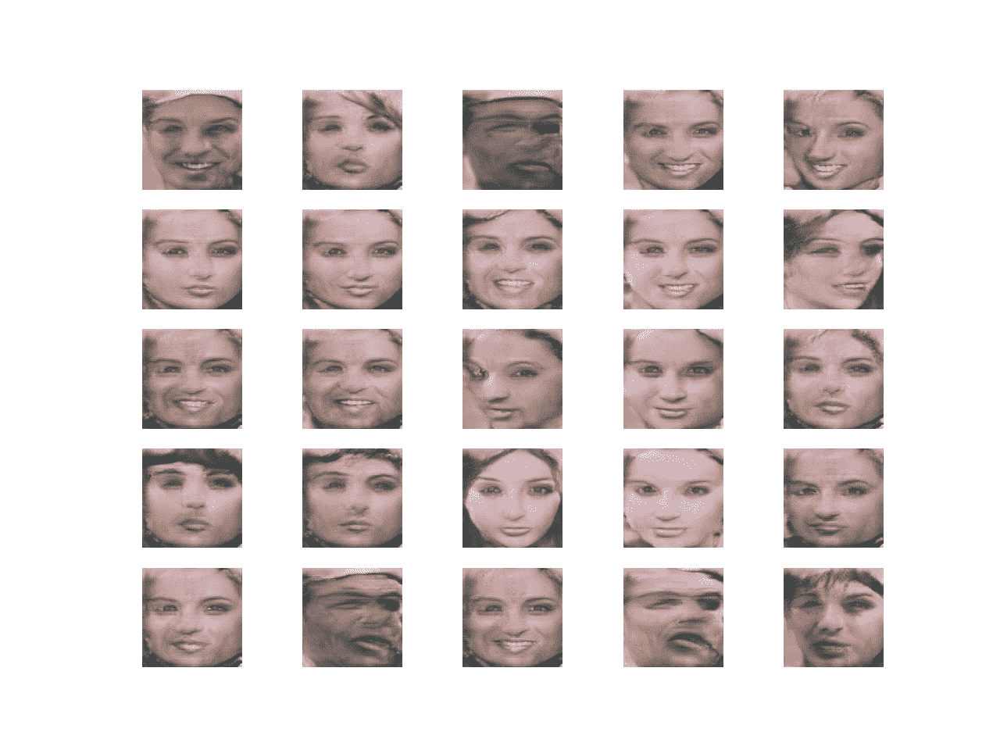

# 如何在 Keras 训练一个渐进生长的 GAN 来合成人脸

> 原文:[https://machinelearning master . com/如何训练一个用于合成面部的渐进生长 gan-in-keras/](https://machinelearningmastery.com/how-to-train-a-progressive-growing-gan-in-keras-for-synthesizing-faces/)

最后更新于 2020 年 9 月 1 日

[生成性对抗网络](https://machinelearningmastery.com/what-are-generative-adversarial-networks-gans/)，或 GANs，在生成高质量的合成图像方面是有效的。

GANs 的一个限制是只能生成相对较小的图像，例如 64×64 像素。

渐进生长氮化镓是氮化镓训练程序的扩展，包括训练氮化镓生成非常小的图像，如 4×4，并将生成的图像大小逐渐增加到 8×8、16×16，直到达到所需的输出大小。这使得渐进式 GAN 能够生成 1024×1024 像素分辨率的真实感合成人脸。

渐进式生长氮化镓的关键创新是两阶段训练过程，包括新块的淡入，以支持更高分辨率的图像，然后进行微调。

在本教程中，你将发现如何实现和训练一个渐进增长的生成性对抗网络来生成名人面孔。

完成本教程后，您将知道:

*   如何准备名人脸数据集来训练一个渐进增长的 GAN 模型。
*   如何在名人脸数据集上定义和训练渐进式生长 GAN？
*   如何加载保存的生成器模型，并使用它们来生成特别的合成名人脸。

**用我的新书[Python 生成性对抗网络](https://machinelearningmastery.com/generative_adversarial_networks/)启动你的项目**，包括*分步教程*和所有示例的 *Python 源代码*文件。

我们开始吧。

*   **2019 年 9 月更新**:修复了训练中总结成绩时的小 bug。


如何在 Keras 训练一个渐进生长的 GAN 来合成人脸？
图片由[亚历山德罗·卡普尼](https://www.flickr.com/photos/weyes/14273137213/)提供，版权所有。

## 教程概述

本教程分为五个部分；它们是:

1.  什么是渐进式生长氮化镓
2.  如何准备名人脸数据集
3.  如何开发渐进式生长氮化镓模型
4.  如何训练渐进式生长氮化镓模型
5.  如何用渐进生长的氮化镓模型合成图像

## 什么是渐进式生长氮化镓

GANs 在生成清晰的合成图像方面很有效，尽管通常受限于可以生成的图像的大小。

渐进式生长 GAN 是 GAN 的扩展，它允许训练生成器模型能够生成大的高质量图像，例如大小为 1024×1024 像素的真实感人脸。英伟达的 [Tero Karras](https://research.nvidia.com/person/tero-karras) 等人在 2017 年的论文中描述了这一点，论文标题为“[为提高质量、稳定性和变化性而对 GANs 进行渐进生长](https://arxiv.org/abs/1710.10196)”

渐进式生长 GAN 的关键创新是发生器输出图像尺寸的递增，从 4×4 像素图像开始，加倍到 8×8、16×16，以此类推，直至达到所需的输出分辨率。

这是通过一个训练过程来实现的，该过程包括用给定的输出分辨率对模型进行微调的阶段，以及用更大的分辨率缓慢地逐步引入新模型的阶段。在训练过程中，所有图层都保持可训练状态，包括添加新图层时的现有图层。

渐进式生长 GAN 涉及使用具有相同一般结构的生成器和鉴别器模型，并从非常小的图像开始。在训练期间，新的卷积层块被系统地添加到生成器模型和鉴别器模型中。

层的增量添加允许模型有效地学习粗略层次的细节，并在以后学习更精细的细节，包括生成器和鉴别器。

这种增量性质允许训练首先发现图像分布的大尺度结构，然后将注意力转移到越来越精细的细节上，而不是必须同时学习所有尺度。

下一步是选择一个数据集，用于开发渐进式生长氮化镓。

## 如何准备名人脸数据集

在本教程中，我们将使用[大规模名人脸属性数据集](http://mmlab.ie.cuhk.edu.hk/projects/CelebA.html)，简称 CelebA。

这个数据集是由[刘紫薇](https://liuziwei7.github.io/)等人开发和发布的，他们在 2015 年发表的论文倾斜为“[从面部部位反应到面部检测:深度学习方法](https://arxiv.org/abs/1509.06451)”

该数据集提供了大约 200，000 张名人脸的照片，以及给定照片中出现的内容的注释，例如眼镜、脸型、帽子、头发类型等。作为数据集的一部分，作者提供了以面部为中心的每张照片的版本，并将其裁剪成大约 150 像素宽、200 像素高的不同大小的人像。我们将以此为基础开发我们的 GAN 模型。

数据集可以很容易地从 Kaggle 网页上下载。注意:这可能需要在 Kaggle 有一个账户。

*   [名人脸属性(名人脸)数据集](https://www.kaggle.com/jessicali9530/celeba-dataset)

具体来说，下载文件“ *img_align_celeba.zip* ，大概是 1.3 千兆字节。为此，请单击 Kaggle 网站上的文件名，然后单击下载图标。

下载可能需要一段时间，这取决于您的互联网连接速度。

下载后，解压缩档案。

这将创建一个名为“ *img_align_celeba* ”的新目录，其中包含所有文件名像*【202599.jpg】*和*202598.jpg*的图像。

当使用 GAN 时，如果所有的图像都很小并且是正方形的，那么对数据集建模会更容易。

此外，由于我们只对每张照片中的人脸感兴趣，而对背景不感兴趣，因此我们可以在将结果调整到固定大小之前执行人脸检测并仅提取人脸。

有许多方法可以进行人脸检测。在这种情况下，我们将使用预训练的[多任务级联卷积神经网络](https://machinelearningmastery.com/how-to-perform-face-detection-with-classical-and-deep-learning-methods-in-python-with-keras/)，或 MTCNN。这是一个用于人脸检测的最先进的深度学习模型，在 2016 年发表的论文《使用多任务级联卷积网络的联合人脸检测和对齐》中有描述

我们将在 [ipazc/mtcnn 项目](https://github.com/ipazc/mtcnn)中使用 [Iván de Paz Centeno](https://github.com/ipazc) 提供的实现。这也可以通过 pip 安装，如下所示:

```py
sudo pip install mtcnn
```

我们可以通过导入库并打印版本来确认库安装正确；例如:

```py
# confirm mtcnn was installed correctly
import mtcnn
# print version
print(mtcnn.__version__)
```

运行该示例将打印库的当前版本。

```py
0.0.8
```

MTCNN 模型非常容易使用。

首先创建一个 MTCNN 模型的实例，然后可以调用 *detect_faces()* 函数传入一幅图像的像素数据。

结果是检测到的人脸列表，边界框以像素偏移值定义。

```py
...
# prepare model
model = MTCNN()
# detect face in the image
faces = model.detect_faces(pixels)
# extract details of the face
x1, y1, width, height = faces[0]['box']
```

虽然渐进式增长的 GAN 支持大图像的合成，比如 1024×1024，但这需要巨大的资源，比如单个顶级 GPU 训练模型一个月。

相反，我们将把生成的图像的大小减少到 128×128，这反过来将允许我们在几个小时内[在 GPU](https://machinelearningmastery.com/develop-evaluate-large-deep-learning-models-keras-amazon-web-services/) 上训练一个合理的模型，并且仍然发现如何实现、训练和使用渐进增长模型。

因此，我们可以开发一个函数来加载一个文件并从照片中提取人脸，然后将提取的人脸像素调整到预定义的大小。在这种情况下，我们将使用 128×128 像素的正方形。

下面的 *load_image()* 函数会将一个给定的照片文件名加载为一个 NumPy 像素数组。

```py
# load an image as an rgb numpy array
def load_image(filename):
	# load image from file
	image = Image.open(filename)
	# convert to RGB, if needed
	image = image.convert('RGB')
	# convert to array
	pixels = asarray(image)
	return pixels
```

下面的 *extract_face()* 函数以一张照片的 MTCNN 模型和像素值为参数，返回仅包含人脸的 128x128x3 像素值数组，如果没有检测到人脸，则返回 *None* (这种情况很少发生)。

```py
# extract the face from a loaded image and resize
def extract_face(model, pixels, required_size=(128, 128)):
	# detect face in the image
	faces = model.detect_faces(pixels)
	# skip cases where we could not detect a face
	if len(faces) == 0:
		return None
	# extract details of the face
	x1, y1, width, height = faces[0]['box']
	# force detected pixel values to be positive (bug fix)
	x1, y1 = abs(x1), abs(y1)
	# convert into coordinates
	x2, y2 = x1 + width, y1 + height
	# retrieve face pixels
	face_pixels = pixels[y1:y2, x1:x2]
	# resize pixels to the model size
	image = Image.fromarray(face_pixels)
	image = image.resize(required_size)
	face_array = asarray(image)
	return face_array
```

下面的 *load_faces()* 函数枚举一个目录中的所有照片文件，并从每个文件中提取人脸并调整其大小，然后返回一个 NumPy 人脸数组。

我们通过 *n_faces* 参数限制加载的面的总数，因为我们不需要所有面。

```py
# load images and extract faces for all images in a directory
def load_faces(directory, n_faces):
	# prepare model
	model = MTCNN()
	faces = list()
	# enumerate files
	for filename in listdir(directory):
		# load the image
		pixels = load_image(directory + filename)
		# get face
		face = extract_face(model, pixels)
		if face is None:
			continue
		# store
		faces.append(face)
		print(len(faces), face.shape)
		# stop once we have enough
		if len(faces) >= n_faces:
			break
	return asarray(faces)
```

将这些联系在一起，下面列出了准备名人脸数据集来训练 GAN 模型的完整示例。

在这种情况下，我们将加载的人脸总数增加到 50，000 个，以便为我们的 GAN 模型提供一个良好的训练数据集。

```py
# example of extracting and resizing faces into a new dataset
from os import listdir
from numpy import asarray
from numpy import savez_compressed
from PIL import Image
from mtcnn.mtcnn import MTCNN
from matplotlib import pyplot

# load an image as an rgb numpy array
def load_image(filename):
	# load image from file
	image = Image.open(filename)
	# convert to RGB, if needed
	image = image.convert('RGB')
	# convert to array
	pixels = asarray(image)
	return pixels

# extract the face from a loaded image and resize
def extract_face(model, pixels, required_size=(128, 128)):
	# detect face in the image
	faces = model.detect_faces(pixels)
	# skip cases where we could not detect a face
	if len(faces) == 0:
		return None
	# extract details of the face
	x1, y1, width, height = faces[0]['box']
	# force detected pixel values to be positive (bug fix)
	x1, y1 = abs(x1), abs(y1)
	# convert into coordinates
	x2, y2 = x1 + width, y1 + height
	# retrieve face pixels
	face_pixels = pixels[y1:y2, x1:x2]
	# resize pixels to the model size
	image = Image.fromarray(face_pixels)
	image = image.resize(required_size)
	face_array = asarray(image)
	return face_array

# load images and extract faces for all images in a directory
def load_faces(directory, n_faces):
	# prepare model
	model = MTCNN()
	faces = list()
	# enumerate files
	for filename in listdir(directory):
		# load the image
		pixels = load_image(directory + filename)
		# get face
		face = extract_face(model, pixels)
		if face is None:
			continue
		# store
		faces.append(face)
		print(len(faces), face.shape)
		# stop once we have enough
		if len(faces) >= n_faces:
			break
	return asarray(faces)

# directory that contains all images
directory = 'img_align_celeba/'
# load and extract all faces
all_faces = load_faces(directory, 50000)
print('Loaded: ', all_faces.shape)
# save in compressed format
savez_compressed('img_align_celeba_128.npz', all_faces)
```

鉴于要加载的人脸数量较多，运行该示例可能需要几分钟时间。

在运行结束时，提取和调整大小的面的数组被保存为文件名为“ *img_align_celeba_128.npz* 的压缩 NumPy 数组。

然后可以随时加载准备好的数据集，如下所示。

```py
# load the prepared dataset
from numpy import load
# load the face dataset
data = load('img_align_celeba_128.npz')
faces = data['arr_0']
print('Loaded: ', faces.shape)
```

加载数据集总结了阵列的形状，显示了 50K 图像，大小为 128×128 像素，有三个颜色通道。

```py
Loaded: (50000, 128, 128, 3)
```

我们可以详细说明这个例子，并将数据集中的前 100 个面绘制成 10×10 的网格。下面列出了完整的示例。

```py
# load the prepared dataset
from numpy import load
from matplotlib import pyplot

# plot a list of loaded faces
def plot_faces(faces, n):
	for i in range(n * n):
		# define subplot
		pyplot.subplot(n, n, 1 + i)
		# turn off axis
		pyplot.axis('off')
		# plot raw pixel data
		pyplot.imshow(faces[i].astype('uint8'))
	pyplot.show()

# load the face dataset
data = load('img_align_celeba_128.npz')
faces = data['arr_0']
print('Loaded: ', faces.shape)
plot_faces(faces, 10)
```

运行该示例将加载数据集并创建前 100 幅图像的图。

我们可以看到，每个图像只包含人脸，所有的人脸都是相同的正方形。我们的目标是生成具有相同一般属性的新面孔。



10×10 网格中的 100 张名人脸图

我们现在准备开发一个 GAN 模型来使用这个数据集生成人脸。

## 如何开发渐进式生长氮化镓模型

有许多方法可以实现渐进增长的氮化镓模型。

在本教程中，我们将开发和实现增长的每个阶段作为一个单独的 Keras 模型，每个模型将共享相同的层和权重。

这种方法允许对每个模型进行方便的训练，就像普通的 Keras 模型一样，尽管它需要稍微复杂的模型构建过程来确保层被正确重用。

首先，我们将定义生成器和鉴别器模型定义中所需的一些自定义层，然后继续定义函数来创建和扩展鉴别器和生成器模型本身。

### 渐进增长的自定义图层

实现渐进增长的生成性对抗网络需要三个定制层。

它们是层次:

*   **加权总和**:用于控制生长阶段新旧层的加权总和。
*   **MinibatchStdev** :用于对鉴别器中的一批图像进行统计汇总。
*   **像素归一化**:用于归一化生成器模型中的激活图。

此外，本文中使用的权重约束称为“*均衡学习率*”。这也需要作为定制层来实现。为了简洁起见，我们不会在本教程中使用均衡学习率，而是使用简单的最大范数权重约束。

#### 加权求和层

*加权总和*层是一个合并层，它组合了来自两个输入层的激活，例如鉴别器中的两个输入路径或生成器模型中的两个输出路径。它使用一个名为*阿尔法*的变量来控制第一个和第二个输入的权重。

当模型从一个图像尺寸过渡到具有两倍宽度和高度(四倍面积)的新图像尺寸时，例如从 4×4 到 8×8 像素，在训练的增长阶段使用它。

在生长阶段，alpha 参数从开始时的 0.0 线性缩放到结束时的 1.0，允许图层的输出从对旧图层赋予全部权重过渡到对新图层赋予全部权重(第二次输入)。

*   加权和=((1.0–α)*输入 1)+(α*输入 2)

下面将*加权求和*类定义为*添加*合并层的扩展。

```py
# weighted sum output
class WeightedSum(Add):
	# init with default value
	def __init__(self, alpha=0.0, **kwargs):
		super(WeightedSum, self).__init__(**kwargs)
		self.alpha = backend.variable(alpha, name='ws_alpha')

	# output a weighted sum of inputs
	def _merge_function(self, inputs):
		# only supports a weighted sum of two inputs
		assert (len(inputs) == 2)
		# ((1-a) * input1) + (a * input2)
		output = ((1.0 - self.alpha) * inputs[0]) + (self.alpha * inputs[1])
		return output
```

#### MinibatchStdev

小批量标准偏差层或*小批量标准偏差层*仅用于鉴别器层的输出块。

该层的目标是提供激活批次的统计摘要。然后，鉴别器可以学会从一批批真实样本中更好地检测出一批批假样本。这反过来鼓励通过鉴别器训练的生成器创建具有真实批次统计数据的批次样本。

它的实现是计算整个批次激活图中每个像素值的标准偏差，计算该值的平均值，然后创建一个新的激活图(一个通道)，该激活图被附加到作为输入提供的激活图列表中。

下面定义了*迷你 batchStdev* 层。

```py
# mini-batch standard deviation layer
class MinibatchStdev(Layer):
	# initialize the layer
	def __init__(self, **kwargs):
		super(MinibatchStdev, self).__init__(**kwargs)

	# perform the operation
	def call(self, inputs):
		# calculate the mean value for each pixel across channels
		mean = backend.mean(inputs, axis=0, keepdims=True)
		# calculate the squared differences between pixel values and mean
		squ_diffs = backend.square(inputs - mean)
		# calculate the average of the squared differences (variance)
		mean_sq_diff = backend.mean(squ_diffs, axis=0, keepdims=True)
		# add a small value to avoid a blow-up when we calculate stdev
		mean_sq_diff += 1e-8
		# square root of the variance (stdev)
		stdev = backend.sqrt(mean_sq_diff)
		# calculate the mean standard deviation across each pixel coord
		mean_pix = backend.mean(stdev, keepdims=True)
		# scale this up to be the size of one input feature map for each sample
		shape = backend.shape(inputs)
		output = backend.tile(mean_pix, (shape[0], shape[1], shape[2], 1))
		# concatenate with the output
		combined = backend.concatenate([inputs, output], axis=-1)
		return combined

	# define the output shape of the layer
	def compute_output_shape(self, input_shape):
		# create a copy of the input shape as a list
		input_shape = list(input_shape)
		# add one to the channel dimension (assume channels-last)
		input_shape[-1] += 1
		# convert list to a tuple
		return tuple(input_shape)
```

#### 像素归一化

生成器和鉴别器模型不像其他 GAN 模型那样使用[批量归一化](https://machinelearningmastery.com/how-to-accelerate-learning-of-deep-neural-networks-with-batch-normalization/)；相反，激活图中的每个像素被归一化为单位长度。

这是局部响应归一化的变体，在本文中被称为像素化特征向量归一化。此外，与其他 GAN 模型不同，归一化仅用于生成器模型，而不是鉴别器。

这是一种活动正则化，可以作为活动约束来实现，尽管它很容易作为一个新的层来实现，该层可以扩展前一层的激活。

下面的*像素归一化*类实现了这一点，可以在生成器中的每个[卷积层](https://machinelearningmastery.com/convolutional-layers-for-deep-learning-neural-networks/)之后，但在任何激活功能之前使用。

```py
# pixel-wise feature vector normalization layer
class PixelNormalization(Layer):
	# initialize the layer
	def __init__(self, **kwargs):
		super(PixelNormalization, self).__init__(**kwargs)

	# perform the operation
	def call(self, inputs):
		# calculate square pixel values
		values = inputs**2.0
		# calculate the mean pixel values
		mean_values = backend.mean(values, axis=-1, keepdims=True)
		# ensure the mean is not zero
		mean_values += 1.0e-8
		# calculate the sqrt of the mean squared value (L2 norm)
		l2 = backend.sqrt(mean_values)
		# normalize values by the l2 norm
		normalized = inputs / l2
		return normalized

	# define the output shape of the layer
	def compute_output_shape(self, input_shape):
		return input_shape
```

我们现在有了所有需要的定制层，并且可以定义我们的模型。

### 渐进增长鉴别器模型

鉴别器模型被定义为一个深度卷积神经网络，它期望一个 4×4 的彩色图像作为输入，并预测它是真的还是假的。

第一隐藏层是 1×1 卷积层。输出块包括一个*迷你 batchStdev* 、3×3 和 4×4 卷积层，以及一个输出预测的全连接层。[漏 ReLU 激活函数](https://machinelearningmastery.com/rectified-linear-activation-function-for-deep-learning-neural-networks/)在所有层和输出层使用线性激活函数后使用。

该模型按正常间隔进行训练，然后经历一个 8×8 的增长阶段。这包括添加两个 3×3 卷积层的块和一个[平均汇集下采样层](https://machinelearningmastery.com/pooling-layers-for-convolutional-neural-networks/)。输入图像通过具有新的 [1×1 卷积隐藏层](https://machinelearningmastery.com/introduction-to-1x1-convolutions-to-reduce-the-complexity-of-convolutional-neural-networks/)的新块。输入图像也通过下采样层和旧的 1×1 卷积隐藏层。旧的 1×1 卷积层和新块的输出然后通过*加权求和*层组合。

经过一段时间的训练，将*加权 Sum 的*α参数从 0.0(全部旧)转换为 1.0(全部新)，然后运行另一个训练阶段，在移除旧图层和路径的情况下调整新模型。

重复这个过程，直到达到所需的图像尺寸，在我们的例子中，128×128 像素的图像。

我们可以通过两个函数来实现这一点: *define_discriminator()* 函数定义了接受 4×4 图像的基本模型，以及*add _ discriminator _ block()*函数，该函数采用一个模型并创建一个具有两个路径的模型的增长版本，以及 *WeightedSum* 和具有相同层/权重但没有旧的 1×1 层和 *WeightedSum* 层的模型的第二个版本。然后， *define_discriminator()* 函数可以根据需要多次调用*add _ discriminator _ block()*函数来创建达到所需增长水平的模型。

所有层都用标准偏差为 0.02 的小[高斯随机数](https://machinelearningmastery.com/how-to-generate-random-numbers-in-python/)初始化，这在 GAN 模型中很常见。使用值为 1.0 的[最大范数权重约束](https://machinelearningmastery.com/how-to-reduce-overfitting-in-deep-neural-networks-with-weight-constraints-in-keras/)，而不是本文中使用的更复杂的“*均衡学习率*”权重约束。

论文定义了一些过滤器，随着模型的深度从 16 增加到 32，64，一直到 512。这需要在生长阶段投影特征图的数量，以便正确计算加权和。为了避免这种复杂性，我们将所有层中的过滤器数量固定为相同。

每一个模型都是经过编译的，并且是合适的。在这种情况下，我们将使用瓦瑟斯坦损失(或 WGAN 损失)和论文中指定的随机梯度下降的[亚当版本](https://machinelearningmastery.com/adam-optimization-algorithm-for-deep-learning/)。该论文的作者建议探索使用 WGAN-GP 损失和最小二乘损失，并发现前者表现稍好。然而，我们将使用瓦瑟斯坦损失，因为它大大简化了实现。

首先，我们必须将损失函数定义为平均预测值乘以目标值。真实图像的目标值为 1，伪造图像的目标值为-1。这意味着权重更新将寻求增加真实图像和虚假图像之间的差异。

```py
# calculate wasserstein loss
def wasserstein_loss(y_true, y_pred):
	return backend.mean(y_true * y_pred)
```

下面列出了定义和创建鉴别器模型增长版本的函数。

我们仔细利用[功能 API](https://machinelearningmastery.com/keras-functional-api-deep-learning/) 和模型结构的知识为每个增长阶段创建两个模型。成长阶段也总是使预期的输入形状翻倍。

```py
# add a discriminator block
def add_discriminator_block(old_model, n_input_layers=3):
	# weight initialization
	init = RandomNormal(stddev=0.02)
	# weight constraint
	const = max_norm(1.0)
	# get shape of existing model
	in_shape = list(old_model.input.shape)
	# define new input shape as double the size
	input_shape = (in_shape[-2].value*2, in_shape[-2].value*2, in_shape[-1].value)
	in_image = Input(shape=input_shape)
	# define new input processing layer
	d = Conv2D(128, (1,1), padding='same', kernel_initializer=init, kernel_constraint=const)(in_image)
	d = LeakyReLU(alpha=0.2)(d)
	# define new block
	d = Conv2D(128, (3,3), padding='same', kernel_initializer=init, kernel_constraint=const)(d)
	d = LeakyReLU(alpha=0.2)(d)
	d = Conv2D(128, (3,3), padding='same', kernel_initializer=init, kernel_constraint=const)(d)
	d = LeakyReLU(alpha=0.2)(d)
	d = AveragePooling2D()(d)
	block_new = d
	# skip the input, 1x1 and activation for the old model
	for i in range(n_input_layers, len(old_model.layers)):
		d = old_model.layers[i](d)
	# define straight-through model
	model1 = Model(in_image, d)
	# compile model
	model1.compile(loss=wasserstein_loss, optimizer=Adam(lr=0.001, beta_1=0, beta_2=0.99, epsilon=10e-8))
	# downsample the new larger image
	downsample = AveragePooling2D()(in_image)
	# connect old input processing to downsampled new input
	block_old = old_model.layers[1](downsample)
	block_old = old_model.layers[2](block_old)
	# fade in output of old model input layer with new input
	d = WeightedSum()([block_old, block_new])
	# skip the input, 1x1 and activation for the old model
	for i in range(n_input_layers, len(old_model.layers)):
		d = old_model.layers[i](d)
	# define straight-through model
	model2 = Model(in_image, d)
	# compile model
	model2.compile(loss=wasserstein_loss, optimizer=Adam(lr=0.001, beta_1=0, beta_2=0.99, epsilon=10e-8))
	return [model1, model2]

# define the discriminator models for each image resolution
def define_discriminator(n_blocks, input_shape=(4,4,3)):
	# weight initialization
	init = RandomNormal(stddev=0.02)
	# weight constraint
	const = max_norm(1.0)
	model_list = list()
	# base model input
	in_image = Input(shape=input_shape)
	# conv 1x1
	d = Conv2D(128, (1,1), padding='same', kernel_initializer=init, kernel_constraint=const)(in_image)
	d = LeakyReLU(alpha=0.2)(d)
	# conv 3x3 (output block)
	d = MinibatchStdev()(d)
	d = Conv2D(128, (3,3), padding='same', kernel_initializer=init, kernel_constraint=const)(d)
	d = LeakyReLU(alpha=0.2)(d)
	# conv 4x4
	d = Conv2D(128, (4,4), padding='same', kernel_initializer=init, kernel_constraint=const)(d)
	d = LeakyReLU(alpha=0.2)(d)
	# dense output layer
	d = Flatten()(d)
	out_class = Dense(1)(d)
	# define model
	model = Model(in_image, out_class)
	# compile model
	model.compile(loss=wasserstein_loss, optimizer=Adam(lr=0.001, beta_1=0, beta_2=0.99, epsilon=10e-8))
	# store model
	model_list.append([model, model])
	# create submodels
	for i in range(1, n_blocks):
		# get prior model without the fade-on
		old_model = model_list[i - 1][0]
		# create new model for next resolution
		models = add_discriminator_block(old_model)
		# store model
		model_list.append(models)
	return model_list
```

通过指定要创建的块数来调用 *define_discriminator()* 函数。

我们将创建 6 个块，这将创建 6 对模型，预计输入图像大小为 4×4、8×8、16×16、32×32、64×64、128×128。

该函数返回一个列表，其中列表中的每个元素包含两个模型。第一个模型是“*正常模型*”或直通模型，第二个是包含旧的 1×1 和新的带加权和的块的模型版本，用于训练的过渡或增长阶段。

### 渐进增长发电机模型

生成器模型将潜在空间中的随机点作为输入，并生成合成图像。

生成器模型的定义方式与鉴别器模型相同。

具体来说，定义了用于生成 4×4 图像的基础模型，并且为大图像输出尺寸创建了模型的增长版本。

主要区别是在生长阶段，模型的输出是 *WeightedSum* 层的输出。模型的生长阶段版本包括首先添加最近邻上采样层；然后，它连接到带有新输出层的新块和旧的旧输出层。旧的和新的输出层然后通过*加权求和*输出层组合。

基本模型有一个输入块，该输入块定义有一个完全连接的图层，该图层具有足够数量的激活，可以创建给定数量的 4×4 要素图。接下来是 [4×4 和 3×3 卷积层](https://machinelearningmastery.com/convolutional-layers-for-deep-learning-neural-networks/)和生成彩色图像的 [1×1 输出层](https://machinelearningmastery.com/introduction-to-1x1-convolutions-to-reduce-the-complexity-of-convolutional-neural-networks/)。新的块增加了一个上采样层和两个 3×3 卷积层。

在每个卷积层之后，使用 *LeakyReLU* 激活功能和*像素归一化*层。在输出层使用线性激活函数，而不是更常见的 tanh 函数，然而真实图像仍然被缩放到[-1，1]的范围，这对于大多数 GAN 模型是常见的。

本文定义了随着模型深度的增加，特征图的数量从 512 个减少到 16 个。与鉴别器一样，跨块的特征图数量的差异给*加权求和*带来了挑战，因此为了简单起见，我们将所有图层固定为具有相同数量的过滤器。

同样像鉴别器模型一样，权重用标准偏差为 0.02 的[高斯随机数](https://machinelearningmastery.com/how-to-generate-random-numbers-in-python/)初始化，并且使用值为 1.0 的[最大范数权重约束](https://machinelearningmastery.com/introduction-to-weight-constraints-to-reduce-generalization-error-in-deep-learning/)，而不是本文中使用的均衡学习率权重约束。

定义和增长生成器模型的功能定义如下。

```py
# add a generator block
def add_generator_block(old_model):
	# weight initialization
	init = RandomNormal(stddev=0.02)
	# weight constraint
	const = max_norm(1.0)
	# get the end of the last block
	block_end = old_model.layers[-2].output
	# upsample, and define new block
	upsampling = UpSampling2D()(block_end)
	g = Conv2D(128, (3,3), padding='same', kernel_initializer=init, kernel_constraint=const)(upsampling)
	g = PixelNormalization()(g)
	g = LeakyReLU(alpha=0.2)(g)
	g = Conv2D(128, (3,3), padding='same', kernel_initializer=init, kernel_constraint=const)(g)
	g = PixelNormalization()(g)
	g = LeakyReLU(alpha=0.2)(g)
	# add new output layer
	out_image = Conv2D(3, (1,1), padding='same', kernel_initializer=init, kernel_constraint=const)(g)
	# define model
	model1 = Model(old_model.input, out_image)
	# get the output layer from old model
	out_old = old_model.layers[-1]
	# connect the upsampling to the old output layer
	out_image2 = out_old(upsampling)
	# define new output image as the weighted sum of the old and new models
	merged = WeightedSum()([out_image2, out_image])
	# define model
	model2 = Model(old_model.input, merged)
	return [model1, model2]

# define generator models
def define_generator(latent_dim, n_blocks, in_dim=4):
	# weight initialization
	init = RandomNormal(stddev=0.02)
	# weight constraint
	const = max_norm(1.0)
	model_list = list()
	# base model latent input
	in_latent = Input(shape=(latent_dim,))
	# linear scale up to activation maps
	g  = Dense(128 * in_dim * in_dim, kernel_initializer=init, kernel_constraint=const)(in_latent)
	g = Reshape((in_dim, in_dim, 128))(g)
	# conv 4x4, input block
	g = Conv2D(128, (3,3), padding='same', kernel_initializer=init, kernel_constraint=const)(g)
	g = PixelNormalization()(g)
	g = LeakyReLU(alpha=0.2)(g)
	# conv 3x3
	g = Conv2D(128, (3,3), padding='same', kernel_initializer=init, kernel_constraint=const)(g)
	g = PixelNormalization()(g)
	g = LeakyReLU(alpha=0.2)(g)
	# conv 1x1, output block
	out_image = Conv2D(3, (1,1), padding='same', kernel_initializer=init, kernel_constraint=const)(g)
	# define model
	model = Model(in_latent, out_image)
	# store model
	model_list.append([model, model])
	# create submodels
	for i in range(1, n_blocks):
		# get prior model without the fade-on
		old_model = model_list[i - 1][0]
		# create new model for next resolution
		models = add_generator_block(old_model)
		# store model
		model_list.append(models)
	return model_list
```

调用 *define_generator()* 函数需要定义潜在空间的大小。

和鉴别器一样，我们将 *n_blocks* 参数设置为 6，创建六对模型。

该函数返回一个模型列表，其中列表中的每个项目都包含每个生成器的正常版本或直通版本，以及用于在较大输出图像大小下逐步引入新块的增长版本。

### 训练发电机的复合模型

发电机模型没有被编译，因为它们没有被直接训练。

相反，生成器模型通过使用瓦瑟斯坦损失的鉴别器模型来训练。

这包括将生成的图像作为真实图像呈现给鉴别器，并计算损失，然后用于更新生成器模型。

给定的生成器模型必须与给定的鉴别器模型配对，既要考虑相同的图像大小(例如 4×4 或 8×8)，也要考虑相同的训练阶段，例如生长阶段(引入新块)或微调阶段(正常或直通)。

我们可以通过为每对模型创建一个新模型来实现这一点，该模型将生成器堆叠在鉴别器的顶部，以便合成图像直接输入鉴别器模型，从而被认为是真的或假的。然后，该复合模型可用于通过鉴别器训练生成器，并且鉴别器的权重可被标记为不可训练(仅在该模型中)，以确保它们在该误导过程中不被改变。

因此，我们可以创建成对的合成模型，例如，用于六个级别的图像增长的六对，其中每对由用于正常或直通模型的合成模型以及模型的增长版本组成。

*define_composite()* 函数实现了这一点，定义如下。

```py
# define composite models for training generators via discriminators
def define_composite(discriminators, generators):
	model_list = list()
	# create composite models
	for i in range(len(discriminators)):
		g_models, d_models = generators[i], discriminators[i]
		# straight-through model
		d_models[0].trainable = False
		model1 = Sequential()
		model1.add(g_models[0])
		model1.add(d_models[0])
		model1.compile(loss=wasserstein_loss, optimizer=Adam(lr=0.001, beta_1=0, beta_2=0.99, epsilon=10e-8))
		# fade-in model
		d_models[1].trainable = False
		model2 = Sequential()
		model2.add(g_models[1])
		model2.add(d_models[1])
		model2.compile(loss=wasserstein_loss, optimizer=Adam(lr=0.001, beta_1=0, beta_2=0.99, epsilon=10e-8))
		# store
		model_list.append([model1, model2])
	return model_list
```

既然我们已经看到了如何定义生成器和鉴别器模型，让我们看看如何在名人脸数据集上拟合这些模型。

## 如何训练渐进式生长氮化镓模型

首先，我们需要定义一些方便的函数来处理数据样本。

下面的 *load_real_samples()* 函数加载我们准备好的名人脸数据集，然后将像素转换为浮点值，并将其缩放到[-1，1]范围，这是大多数 GAN 实现所共有的。

```py
# load dataset
def load_real_samples(filename):
	# load dataset
	data = load(filename)
	# extract numpy array
	X = data['arr_0']
	# convert from ints to floats
	X = X.astype('float32')
	# scale from [0,255] to [-1,1]
	X = (X - 127.5) / 127.5
	return X
```

接下来，我们需要能够检索用于更新鉴别器的随机图像样本。

下面的 *generate_real_samples()* 函数实现了这一点，从加载的数据集中返回图像的随机样本以及它们对应的目标值 *class=1* ，以指示图像是真实的。

```py
# select real samples
def generate_real_samples(dataset, n_samples):
	# choose random instances
	ix = randint(0, dataset.shape[0], n_samples)
	# select images
	X = dataset[ix]
	# generate class labels
	y = ones((n_samples, 1))
	return X, y
```

接下来，我们需要一个潜在点的样本，用于使用生成器模型创建合成图像。

下面的*generate _ 潜伏 _points()* 函数实现了这一点，返回一批具有所需维度的潜伏点。

```py
# generate points in latent space as input for the generator
def generate_latent_points(latent_dim, n_samples):
	# generate points in the latent space
	x_input = randn(latent_dim * n_samples)
	# reshape into a batch of inputs for the network
	x_input = x_input.reshape(n_samples, latent_dim)
	return x_input
```

潜在点可以用作生成器的输入，以创建一批合成图像。

这是更新鉴别器模型所必需的。还需要使用上一节中定义的复合模型通过鉴别器模型更新生成器模型。

下面的 *generate_fake_samples()* 函数取一个生成器模型，生成并返回一批合成图像和对应的目标给 *class=-1* 的鉴别器，表示图像是假的。调用*生成潜在点()*函数来创建随机潜在点所需的批量值。

```py
# use the generator to generate n fake examples, with class labels
def generate_fake_samples(generator, latent_dim, n_samples):
	# generate points in latent space
	x_input = generate_latent_points(latent_dim, n_samples)
	# predict outputs
	X = generator.predict(x_input)
	# create class labels
	y = -ones((n_samples, 1))
	return X, y
```

模型的训练分两个阶段进行:淡入阶段，涉及从较低分辨率图像到较高分辨率图像的过渡，以及正常阶段，涉及在给定的较高分辨率图像下模型的微调。

在相位输入期间，给定级别的鉴别器和生成器模型中的*加权求和*层的*α*值需要基于训练步骤从 0.0 到 1.0 的线性转换。下面的 *update_fadein()* 功能实现了这一点；给定一个模型列表(如生成器、鉴别器和复合模型)，该函数会在每个模型中定位*加权求和*层，并根据当前训练步数设置 alpha 属性的值。

重要的是，这个 alpha 属性不是常量，而是定义为 *WeightedSum* 类中的一个可变变量，其值可以使用 Keras 后端 *set_value()* 函数进行更改。

这是一种笨拙但有效的改变*α*值的方法。也许一个更干净的实现会包含一个 Keras 回调，留给读者作为练习。

```py
# update the alpha value on each instance of WeightedSum
def update_fadein(models, step, n_steps):
	# calculate current alpha (linear from 0 to 1)
	alpha = step / float(n_steps - 1)
	# update the alpha for each model
	for model in models:
		for layer in model.layers:
			if isinstance(layer, WeightedSum):
				backend.set_value(layer.alpha, alpha)
```

接下来，我们可以为给定的训练阶段定义训练模型的过程。

训练阶段使用一个生成器、鉴别器和复合模型，并针对给定数量的训练时期在数据集上更新它们。训练阶段可以是向更高分辨率的淡入过渡，在这种情况下，每次迭代都必须调用 *update_fadein()* ，或者它可以是正常的调优训练阶段，在这种情况下，不存在*加权求和*层。

下面的 *train_epochs()* 函数为单个训练阶段实现鉴别器和生成器模型的训练。

单次训练迭代包括首先从数据集中选择半批真实图像，然后从生成器模型的当前状态生成半批假图像。这些样本随后被用于更新鉴别器模型。

接下来，生成器模型通过具有合成模型的鉴别器被更新，指示所生成的图像实际上是真实的，并且更新生成器权重以更好地欺骗鉴别器。

每次训练迭代结束时都会打印模型性能摘要，总结真实(d1)和虚假(d2)图像上鉴别器的损失以及生成器(g)的损失。

```py
# train a generator and discriminator
def train_epochs(g_model, d_model, gan_model, dataset, n_epochs, n_batch, fadein=False):
	# calculate the number of batches per training epoch
	bat_per_epo = int(dataset.shape[0] / n_batch)
	# calculate the number of training iterations
	n_steps = bat_per_epo * n_epochs
	# calculate the size of half a batch of samples
	half_batch = int(n_batch / 2)
	# manually enumerate epochs
	for i in range(n_steps):
		# update alpha for all WeightedSum layers when fading in new blocks
		if fadein:
			update_fadein([g_model, d_model, gan_model], i, n_steps)
		# prepare real and fake samples
		X_real, y_real = generate_real_samples(dataset, half_batch)
		X_fake, y_fake = generate_fake_samples(g_model, latent_dim, half_batch)
		# update discriminator model
		d_loss1 = d_model.train_on_batch(X_real, y_real)
		d_loss2 = d_model.train_on_batch(X_fake, y_fake)
		# update the generator via the discriminator's error
		z_input = generate_latent_points(latent_dim, n_batch)
		y_real2 = ones((n_batch, 1))
		g_loss = gan_model.train_on_batch(z_input, y_real2)
		# summarize loss on this batch
		print('>%d, d1=%.3f, d2=%.3f g=%.3f' % (i+1, d_loss1, d_loss2, g_loss))
```

接下来，我们需要为每个训练阶段调用*train _ epoch()*函数。

这包括首先将训练数据集缩放到所需的像素维度，例如 4×4 或 8×8。下面的 *scale_dataset()* 函数实现了这一点，获取数据集并返回一个缩放版本。

数据集的这些缩放版本可以预先计算和加载，而不是在每次运行时重新缩放。如果您打算多次运行该示例，这可能是一个不错的扩展。

```py
# scale images to preferred size
def scale_dataset(images, new_shape):
	images_list = list()
	for image in images:
		# resize with nearest neighbor interpolation
		new_image = resize(image, new_shape, 0)
		# store
		images_list.append(new_image)
	return asarray(images_list)
```

每次训练运行后，我们还需要保存生成的图像图和生成器模型的当前状态。

这很有用，这样在运行结束时，我们可以看到模型的能力和质量的发展，并在训练过程中的任何时候加载和使用生成器模型。生成器模型可用于创建临时图像，或用作继续训练的起点。

下面的*summary _ performance()*函数实现了这一点，给定一个状态字符串，如“*褪色的*或“*调谐的*”，一个发电机模型，以及潜在空间的大小。该功能将使用“*状态*”字符串(如“*04×04-褪色的*”)为系统状态创建一个唯一的名称，然后创建一个包含 25 个生成图像的绘图，并使用定义的名称将绘图和生成器模型保存到文件中。

```py
# generate samples and save as a plot and save the model
def summarize_performance(status, g_model, latent_dim, n_samples=25):
	# devise name
	gen_shape = g_model.output_shape
	name = '%03dx%03d-%s' % (gen_shape[1], gen_shape[2], status)
	# generate images
	X, _ = generate_fake_samples(g_model, latent_dim, n_samples)
	# normalize pixel values to the range [0,1]
	X = (X - X.min()) / (X.max() - X.min())
	# plot real images
	square = int(sqrt(n_samples))
	for i in range(n_samples):
		pyplot.subplot(square, square, 1 + i)
		pyplot.axis('off')
		pyplot.imshow(X[i])
	# save plot to file
	filename1 = 'plot_%s.png' % (name)
	pyplot.savefig(filename1)
	pyplot.close()
	# save the generator model
	filename2 = 'model_%s.h5' % (name)
	g_model.save(filename2)
	print('>Saved: %s and %s' % (filename1, filename2))
```

下面的 *train()* 函数将此集合在一起，将定义的模型列表作为输入，以及模型每个增长级别的正常和淡入阶段的批次大小和训练时期数量列表。

4×4 图像的第一个生成器和鉴别器模型通过调用*train _ epoch()*进行拟合，并通过调用*summary _ performance()*进行保存。

然后列举增长的步骤，包括首先将图像数据集缩放到优选尺寸，为新图像尺寸训练和保存淡入模型，然后为新图像尺寸训练和保存正常或微调模型。

```py
# train the generator and discriminator
def train(g_models, d_models, gan_models, dataset, latent_dim, e_norm, e_fadein, n_batch):
	# fit the baseline model
	g_normal, d_normal, gan_normal = g_models[0][0], d_models[0][0], gan_models[0][0]
	# scale dataset to appropriate size
	gen_shape = g_normal.output_shape
	scaled_data = scale_dataset(dataset, gen_shape[1:])
	print('Scaled Data', scaled_data.shape)
	# train normal or straight-through models
	train_epochs(g_normal, d_normal, gan_normal, scaled_data, e_norm[0], n_batch[0])
	summarize_performance('tuned', g_normal, latent_dim)
	# process each level of growth
	for i in range(1, len(g_models)):
		# retrieve models for this level of growth
		[g_normal, g_fadein] = g_models[i]
		[d_normal, d_fadein] = d_models[i]
		[gan_normal, gan_fadein] = gan_models[i]
		# scale dataset to appropriate size
		gen_shape = g_normal.output_shape
		scaled_data = scale_dataset(dataset, gen_shape[1:])
		print('Scaled Data', scaled_data.shape)
		# train fade-in models for next level of growth
		train_epochs(g_fadein, d_fadein, gan_fadein, scaled_data, e_fadein[i], n_batch[i], True)
		summarize_performance('faded', g_fadein, latent_dim)
		# train normal or straight-through models
		train_epochs(g_normal, d_normal, gan_normal, scaled_data, e_norm[i], n_batch[i])
		summarize_performance('tuned', g_normal, latent_dim)
```

然后我们可以定义配置、模型，调用 *train()* 开始训练过程。

本文建议在缩小尺寸之前，对尺寸在 4×4 和 128×128 之间的图像使用 16 的批量。它还建议每个阶段训练大约 80 万张图像。论文还推荐了一个 512 维的潜在空间。

这些模型定义了六个增长级别，以满足数据集 128×128 像素的大小。我们也相应地将潜在空间缩小到 100 维。

我们不是保持[批次大小和时期数量](https://machinelearningmastery.com/how-to-control-the-speed-and-stability-of-training-neural-networks-with-gradient-descent-batch-size/)不变，而是改变它来加快训练过程，早期训练阶段使用更大的批次大小，后期训练阶段使用更小的批次大小来进行微调和稳定。此外，较小的模型使用较少的训练时期，而较大的模型使用较多的时期。

批次大小和训练时期的选择有些随意，您可能想要试验不同的值并检查它们的效果。

```py
# number of growth phases, e.g. 6 == [4, 8, 16, 32, 64, 128]
n_blocks = 6
# size of the latent space
latent_dim = 100
# define models
d_models = define_discriminator(n_blocks)
# define models
g_models = define_generator(latent_dim, n_blocks)
# define composite models
gan_models = define_composite(d_models, g_models)
# load image data
dataset = load_real_samples('img_align_celeba_128.npz')
print('Loaded', dataset.shape)
# train model
n_batch = [16, 16, 16, 8, 4, 4]
# 10 epochs == 500K images per training phase
n_epochs = [5, 8, 8, 10, 10, 10]
train(g_models, d_models, gan_models, dataset, latent_dim, n_epochs, n_epochs, n_batch)
```

我们可以把这一切联系起来。

下面列出了在名人面孔数据集上训练渐进增长的生成性对抗网络的完整示例。

```py
# example of progressive growing gan on celebrity faces dataset
from math import sqrt
from numpy import load
from numpy import asarray
from numpy import zeros
from numpy import ones
from numpy.random import randn
from numpy.random import randint
from skimage.transform import resize
from keras.optimizers import Adam
from keras.models import Sequential
from keras.models import Model
from keras.layers import Input
from keras.layers import Dense
from keras.layers import Flatten
from keras.layers import Reshape
from keras.layers import Conv2D
from keras.layers import UpSampling2D
from keras.layers import AveragePooling2D
from keras.layers import LeakyReLU
from keras.layers import Layer
from keras.layers import Add
from keras.constraints import max_norm
from keras.initializers import RandomNormal
from keras import backend
from matplotlib import pyplot

# pixel-wise feature vector normalization layer
class PixelNormalization(Layer):
	# initialize the layer
	def __init__(self, **kwargs):
		super(PixelNormalization, self).__init__(**kwargs)

	# perform the operation
	def call(self, inputs):
		# calculate square pixel values
		values = inputs**2.0
		# calculate the mean pixel values
		mean_values = backend.mean(values, axis=-1, keepdims=True)
		# ensure the mean is not zero
		mean_values += 1.0e-8
		# calculate the sqrt of the mean squared value (L2 norm)
		l2 = backend.sqrt(mean_values)
		# normalize values by the l2 norm
		normalized = inputs / l2
		return normalized

	# define the output shape of the layer
	def compute_output_shape(self, input_shape):
		return input_shape

# mini-batch standard deviation layer
class MinibatchStdev(Layer):
	# initialize the layer
	def __init__(self, **kwargs):
		super(MinibatchStdev, self).__init__(**kwargs)

	# perform the operation
	def call(self, inputs):
		# calculate the mean value for each pixel across channels
		mean = backend.mean(inputs, axis=0, keepdims=True)
		# calculate the squared differences between pixel values and mean
		squ_diffs = backend.square(inputs - mean)
		# calculate the average of the squared differences (variance)
		mean_sq_diff = backend.mean(squ_diffs, axis=0, keepdims=True)
		# add a small value to avoid a blow-up when we calculate stdev
		mean_sq_diff += 1e-8
		# square root of the variance (stdev)
		stdev = backend.sqrt(mean_sq_diff)
		# calculate the mean standard deviation across each pixel coord
		mean_pix = backend.mean(stdev, keepdims=True)
		# scale this up to be the size of one input feature map for each sample
		shape = backend.shape(inputs)
		output = backend.tile(mean_pix, (shape[0], shape[1], shape[2], 1))
		# concatenate with the output
		combined = backend.concatenate([inputs, output], axis=-1)
		return combined

	# define the output shape of the layer
	def compute_output_shape(self, input_shape):
		# create a copy of the input shape as a list
		input_shape = list(input_shape)
		# add one to the channel dimension (assume channels-last)
		input_shape[-1] += 1
		# convert list to a tuple
		return tuple(input_shape)

# weighted sum output
class WeightedSum(Add):
	# init with default value
	def __init__(self, alpha=0.0, **kwargs):
		super(WeightedSum, self).__init__(**kwargs)
		self.alpha = backend.variable(alpha, name='ws_alpha')

	# output a weighted sum of inputs
	def _merge_function(self, inputs):
		# only supports a weighted sum of two inputs
		assert (len(inputs) == 2)
		# ((1-a) * input1) + (a * input2)
		output = ((1.0 - self.alpha) * inputs[0]) + (self.alpha * inputs[1])
		return output

# calculate wasserstein loss
def wasserstein_loss(y_true, y_pred):
	return backend.mean(y_true * y_pred)

# add a discriminator block
def add_discriminator_block(old_model, n_input_layers=3):
	# weight initialization
	init = RandomNormal(stddev=0.02)
	# weight constraint
	const = max_norm(1.0)
	# get shape of existing model
	in_shape = list(old_model.input.shape)
	# define new input shape as double the size
	input_shape = (in_shape[-2].value*2, in_shape[-2].value*2, in_shape[-1].value)
	in_image = Input(shape=input_shape)
	# define new input processing layer
	d = Conv2D(128, (1,1), padding='same', kernel_initializer=init, kernel_constraint=const)(in_image)
	d = LeakyReLU(alpha=0.2)(d)
	# define new block
	d = Conv2D(128, (3,3), padding='same', kernel_initializer=init, kernel_constraint=const)(d)
	d = LeakyReLU(alpha=0.2)(d)
	d = Conv2D(128, (3,3), padding='same', kernel_initializer=init, kernel_constraint=const)(d)
	d = LeakyReLU(alpha=0.2)(d)
	d = AveragePooling2D()(d)
	block_new = d
	# skip the input, 1x1 and activation for the old model
	for i in range(n_input_layers, len(old_model.layers)):
		d = old_model.layers[i](d)
	# define straight-through model
	model1 = Model(in_image, d)
	# compile model
	model1.compile(loss=wasserstein_loss, optimizer=Adam(lr=0.001, beta_1=0, beta_2=0.99, epsilon=10e-8))
	# downsample the new larger image
	downsample = AveragePooling2D()(in_image)
	# connect old input processing to downsampled new input
	block_old = old_model.layers[1](downsample)
	block_old = old_model.layers[2](block_old)
	# fade in output of old model input layer with new input
	d = WeightedSum()([block_old, block_new])
	# skip the input, 1x1 and activation for the old model
	for i in range(n_input_layers, len(old_model.layers)):
		d = old_model.layers[i](d)
	# define straight-through model
	model2 = Model(in_image, d)
	# compile model
	model2.compile(loss=wasserstein_loss, optimizer=Adam(lr=0.001, beta_1=0, beta_2=0.99, epsilon=10e-8))
	return [model1, model2]

# define the discriminator models for each image resolution
def define_discriminator(n_blocks, input_shape=(4,4,3)):
	# weight initialization
	init = RandomNormal(stddev=0.02)
	# weight constraint
	const = max_norm(1.0)
	model_list = list()
	# base model input
	in_image = Input(shape=input_shape)
	# conv 1x1
	d = Conv2D(128, (1,1), padding='same', kernel_initializer=init, kernel_constraint=const)(in_image)
	d = LeakyReLU(alpha=0.2)(d)
	# conv 3x3 (output block)
	d = MinibatchStdev()(d)
	d = Conv2D(128, (3,3), padding='same', kernel_initializer=init, kernel_constraint=const)(d)
	d = LeakyReLU(alpha=0.2)(d)
	# conv 4x4
	d = Conv2D(128, (4,4), padding='same', kernel_initializer=init, kernel_constraint=const)(d)
	d = LeakyReLU(alpha=0.2)(d)
	# dense output layer
	d = Flatten()(d)
	out_class = Dense(1)(d)
	# define model
	model = Model(in_image, out_class)
	# compile model
	model.compile(loss=wasserstein_loss, optimizer=Adam(lr=0.001, beta_1=0, beta_2=0.99, epsilon=10e-8))
	# store model
	model_list.append([model, model])
	# create submodels
	for i in range(1, n_blocks):
		# get prior model without the fade-on
		old_model = model_list[i - 1][0]
		# create new model for next resolution
		models = add_discriminator_block(old_model)
		# store model
		model_list.append(models)
	return model_list

# add a generator block
def add_generator_block(old_model):
	# weight initialization
	init = RandomNormal(stddev=0.02)
	# weight constraint
	const = max_norm(1.0)
	# get the end of the last block
	block_end = old_model.layers[-2].output
	# upsample, and define new block
	upsampling = UpSampling2D()(block_end)
	g = Conv2D(128, (3,3), padding='same', kernel_initializer=init, kernel_constraint=const)(upsampling)
	g = PixelNormalization()(g)
	g = LeakyReLU(alpha=0.2)(g)
	g = Conv2D(128, (3,3), padding='same', kernel_initializer=init, kernel_constraint=const)(g)
	g = PixelNormalization()(g)
	g = LeakyReLU(alpha=0.2)(g)
	# add new output layer
	out_image = Conv2D(3, (1,1), padding='same', kernel_initializer=init, kernel_constraint=const)(g)
	# define model
	model1 = Model(old_model.input, out_image)
	# get the output layer from old model
	out_old = old_model.layers[-1]
	# connect the upsampling to the old output layer
	out_image2 = out_old(upsampling)
	# define new output image as the weighted sum of the old and new models
	merged = WeightedSum()([out_image2, out_image])
	# define model
	model2 = Model(old_model.input, merged)
	return [model1, model2]

# define generator models
def define_generator(latent_dim, n_blocks, in_dim=4):
	# weight initialization
	init = RandomNormal(stddev=0.02)
	# weight constraint
	const = max_norm(1.0)
	model_list = list()
	# base model latent input
	in_latent = Input(shape=(latent_dim,))
	# linear scale up to activation maps
	g  = Dense(128 * in_dim * in_dim, kernel_initializer=init, kernel_constraint=const)(in_latent)
	g = Reshape((in_dim, in_dim, 128))(g)
	# conv 4x4, input block
	g = Conv2D(128, (3,3), padding='same', kernel_initializer=init, kernel_constraint=const)(g)
	g = PixelNormalization()(g)
	g = LeakyReLU(alpha=0.2)(g)
	# conv 3x3
	g = Conv2D(128, (3,3), padding='same', kernel_initializer=init, kernel_constraint=const)(g)
	g = PixelNormalization()(g)
	g = LeakyReLU(alpha=0.2)(g)
	# conv 1x1, output block
	out_image = Conv2D(3, (1,1), padding='same', kernel_initializer=init, kernel_constraint=const)(g)
	# define model
	model = Model(in_latent, out_image)
	# store model
	model_list.append([model, model])
	# create submodels
	for i in range(1, n_blocks):
		# get prior model without the fade-on
		old_model = model_list[i - 1][0]
		# create new model for next resolution
		models = add_generator_block(old_model)
		# store model
		model_list.append(models)
	return model_list

# define composite models for training generators via discriminators
def define_composite(discriminators, generators):
	model_list = list()
	# create composite models
	for i in range(len(discriminators)):
		g_models, d_models = generators[i], discriminators[i]
		# straight-through model
		d_models[0].trainable = False
		model1 = Sequential()
		model1.add(g_models[0])
		model1.add(d_models[0])
		model1.compile(loss=wasserstein_loss, optimizer=Adam(lr=0.001, beta_1=0, beta_2=0.99, epsilon=10e-8))
		# fade-in model
		d_models[1].trainable = False
		model2 = Sequential()
		model2.add(g_models[1])
		model2.add(d_models[1])
		model2.compile(loss=wasserstein_loss, optimizer=Adam(lr=0.001, beta_1=0, beta_2=0.99, epsilon=10e-8))
		# store
		model_list.append([model1, model2])
	return model_list

# load dataset
def load_real_samples(filename):
	# load dataset
	data = load(filename)
	# extract numpy array
	X = data['arr_0']
	# convert from ints to floats
	X = X.astype('float32')
	# scale from [0,255] to [-1,1]
	X = (X - 127.5) / 127.5
	return X

# select real samples
def generate_real_samples(dataset, n_samples):
	# choose random instances
	ix = randint(0, dataset.shape[0], n_samples)
	# select images
	X = dataset[ix]
	# generate class labels
	y = ones((n_samples, 1))
	return X, y

# generate points in latent space as input for the generator
def generate_latent_points(latent_dim, n_samples):
	# generate points in the latent space
	x_input = randn(latent_dim * n_samples)
	# reshape into a batch of inputs for the network
	x_input = x_input.reshape(n_samples, latent_dim)
	return x_input

# use the generator to generate n fake examples, with class labels
def generate_fake_samples(generator, latent_dim, n_samples):
	# generate points in latent space
	x_input = generate_latent_points(latent_dim, n_samples)
	# predict outputs
	X = generator.predict(x_input)
	# create class labels
	y = -ones((n_samples, 1))
	return X, y

# update the alpha value on each instance of WeightedSum
def update_fadein(models, step, n_steps):
	# calculate current alpha (linear from 0 to 1)
	alpha = step / float(n_steps - 1)
	# update the alpha for each model
	for model in models:
		for layer in model.layers:
			if isinstance(layer, WeightedSum):
				backend.set_value(layer.alpha, alpha)

# train a generator and discriminator
def train_epochs(g_model, d_model, gan_model, dataset, n_epochs, n_batch, fadein=False):
	# calculate the number of batches per training epoch
	bat_per_epo = int(dataset.shape[0] / n_batch)
	# calculate the number of training iterations
	n_steps = bat_per_epo * n_epochs
	# calculate the size of half a batch of samples
	half_batch = int(n_batch / 2)
	# manually enumerate epochs
	for i in range(n_steps):
		# update alpha for all WeightedSum layers when fading in new blocks
		if fadein:
			update_fadein([g_model, d_model, gan_model], i, n_steps)
		# prepare real and fake samples
		X_real, y_real = generate_real_samples(dataset, half_batch)
		X_fake, y_fake = generate_fake_samples(g_model, latent_dim, half_batch)
		# update discriminator model
		d_loss1 = d_model.train_on_batch(X_real, y_real)
		d_loss2 = d_model.train_on_batch(X_fake, y_fake)
		# update the generator via the discriminator's error
		z_input = generate_latent_points(latent_dim, n_batch)
		y_real2 = ones((n_batch, 1))
		g_loss = gan_model.train_on_batch(z_input, y_real2)
		# summarize loss on this batch
		print('>%d, d1=%.3f, d2=%.3f g=%.3f' % (i+1, d_loss1, d_loss2, g_loss))

# scale images to preferred size
def scale_dataset(images, new_shape):
	images_list = list()
	for image in images:
		# resize with nearest neighbor interpolation
		new_image = resize(image, new_shape, 0)
		# store
		images_list.append(new_image)
	return asarray(images_list)

# generate samples and save as a plot and save the model
def summarize_performance(status, g_model, latent_dim, n_samples=25):
	# devise name
	gen_shape = g_model.output_shape
	name = '%03dx%03d-%s' % (gen_shape[1], gen_shape[2], status)
	# generate images
	X, _ = generate_fake_samples(g_model, latent_dim, n_samples)
	# normalize pixel values to the range [0,1]
	X = (X - X.min()) / (X.max() - X.min())
	# plot real images
	square = int(sqrt(n_samples))
	for i in range(n_samples):
		pyplot.subplot(square, square, 1 + i)
		pyplot.axis('off')
		pyplot.imshow(X[i])
	# save plot to file
	filename1 = 'plot_%s.png' % (name)
	pyplot.savefig(filename1)
	pyplot.close()
	# save the generator model
	filename2 = 'model_%s.h5' % (name)
	g_model.save(filename2)
	print('>Saved: %s and %s' % (filename1, filename2))

# train the generator and discriminator
def train(g_models, d_models, gan_models, dataset, latent_dim, e_norm, e_fadein, n_batch):
	# fit the baseline model
	g_normal, d_normal, gan_normal = g_models[0][0], d_models[0][0], gan_models[0][0]
	# scale dataset to appropriate size
	gen_shape = g_normal.output_shape
	scaled_data = scale_dataset(dataset, gen_shape[1:])
	print('Scaled Data', scaled_data.shape)
	# train normal or straight-through models
	train_epochs(g_normal, d_normal, gan_normal, scaled_data, e_norm[0], n_batch[0])
	summarize_performance('tuned', g_normal, latent_dim)
	# process each level of growth
	for i in range(1, len(g_models)):
		# retrieve models for this level of growth
		[g_normal, g_fadein] = g_models[i]
		[d_normal, d_fadein] = d_models[i]
		[gan_normal, gan_fadein] = gan_models[i]
		# scale dataset to appropriate size
		gen_shape = g_normal.output_shape
		scaled_data = scale_dataset(dataset, gen_shape[1:])
		print('Scaled Data', scaled_data.shape)
		# train fade-in models for next level of growth
		train_epochs(g_fadein, d_fadein, gan_fadein, scaled_data, e_fadein[i], n_batch[i], True)
		summarize_performance('faded', g_fadein, latent_dim)
		# train normal or straight-through models
		train_epochs(g_normal, d_normal, gan_normal, scaled_data, e_norm[i], n_batch[i])
		summarize_performance('tuned', g_normal, latent_dim)

# number of growth phases, e.g. 6 == [4, 8, 16, 32, 64, 128]
n_blocks = 6
# size of the latent space
latent_dim = 100
# define models
d_models = define_discriminator(n_blocks)
# define models
g_models = define_generator(latent_dim, n_blocks)
# define composite models
gan_models = define_composite(d_models, g_models)
# load image data
dataset = load_real_samples('img_align_celeba_128.npz')
print('Loaded', dataset.shape)
# train model
n_batch = [16, 16, 16, 8, 4, 4]
# 10 epochs == 500K images per training phase
n_epochs = [5, 8, 8, 10, 10, 10]
train(g_models, d_models, gan_models, dataset, latent_dim, n_epochs, n_epochs, n_batch)
```

**注意**:这个例子可以在 CPU 上运行，虽然推荐一个[GPU](https://machinelearningmastery.com/develop-evaluate-large-deep-learning-models-keras-amazon-web-services/)。

在现代 GPU 硬件上运行该示例可能需要几个小时才能完成。

**注**:考虑到算法或评估程序的随机性，或数值精度的差异，您的[结果可能会有所不同](https://machinelearningmastery.com/different-results-each-time-in-machine-learning/)。考虑运行该示例几次，并比较平均结果。

如果训练迭代期间的损失值为零或非常大/小的数字，这可能是故障模式的一个例子，可能需要重新开始训练过程。

运行该示例首先报告准备好的数据集的成功加载以及数据集缩放到第一个图像大小，然后报告训练过程的每个步骤中每个模型的损失。

```py
Loaded (50000, 128, 128, 3)
Scaled Data (50000, 4, 4, 3)
>1, d1=0.993, d2=0.001 g=0.951
>2, d1=0.861, d2=0.118 g=0.982
>3, d1=0.829, d2=0.126 g=0.875
>4, d1=0.774, d2=0.202 g=0.912
>5, d1=0.687, d2=0.035 g=0.911
...
```

生成的图像图和生成器模型在每个淡入训练阶段后保存，文件名如下:

*   *plot _ 008 x008-褪色. png*
*   *型号 _ 008 x008-褪色. h5*

绘图和模型也会在每个调优阶段后保存，文件名如下:

*   *plot_008x008-tuned.png*
*   *model_008x008-tuned.h5*

查看每个点上生成的图像图有助于了解调整阶段前后支持的图像大小及其质量的变化。

例如，下面是在第一个 4×4 训练阶段(*plot _ 004×004-tuned . png*)后生成的图像样本。此时，我们根本看不到什么。


渐进生长氮化镓生成的 4×4 分辨率合成名人脸

查看 8×8 图像的淡入训练阶段后生成的图像会显示更多的结构(*plot _ 008 x008-淡出. png* )。图像是块状的，但我们可以看到人脸。



渐进生长氮化镓生成淡入后 8×8 分辨率的合成名人脸

接下来，我们可以对比淡入训练阶段(*plot _ 016 x 016-淡出. png* )和调谐训练阶段(*plot _ 016 x 016-调谐. png* )后生成的 16×16 的图像。

我们可以看到图像明显是面部，我们可以看到微调阶段似乎改善了面部的颜色或色调，也许还有结构。



渐进生长 GAN 生成淡入后 16×16 分辨率的合成名人脸


渐进生长氮化镓调谐后 16×16 分辨率合成名人脸

最后，我们可以在调整剩余的 32×32、64×64 和 128×128 分辨率后查看生成的人脸。我们可以看到，分辨率的每一步，图像质量都有所提高，允许模型填充更多的结构和细节。

虽然不完美，但生成的图像显示，渐进生长的氮化镓不仅能够以不同的分辨率生成可信的人脸，而且能够在较低分辨率下学习的基础上进行扩展，以生成较高分辨率下的可信人脸。



渐进生长氮化镓调谐后 32×32 分辨率合成名人脸



渐进生长氮化镓调谐后的 64×64 分辨率合成名人脸



渐进生长氮化镓调谐后 128×128 分辨率合成名人脸

既然我们已经了解了如何适应发电机模型，接下来我们可以了解如何加载和使用保存的发电机模型。

## 如何用渐进生长的氮化镓模型合成图像

在本节中，我们将探讨如何加载一个生成器模型，并根据需要使用它来生成合成图像。

通过*加载 _ 模型()*功能可以加载[保存的 Keras 模型](https://machinelearningmastery.com/save-load-keras-deep-learning-models/)。

因为生成器模型使用自定义图层，所以我们必须指定如何加载自定义图层。这是通过向 load_model()函数提供 dict 来实现的，该函数将每个自定义图层名称映射到适当的类。

```py
...
# load model
cust = {'PixelNormalization': PixelNormalization, 'MinibatchStdev': MinibatchStdev, 'WeightedSum': WeightedSum}
model = load_model('model_016x016-tuned.h5', cust)
```

然后，我们可以使用上一节中的*生成 _ 潜在点()*函数来生成潜在空间中的点，作为生成器模型的输入。

```py
...
# size of the latent space
latent_dim = 100
# number of images to generate
n_images = 25
# generate images
latent_points = generate_latent_points(latent_dim, n_images)
# generate images
X = model.predict(latent_points)
```

然后，我们可以通过首先将像素值缩放到范围[0，1]并绘制每个图像来绘制结果，在这种情况下是以正方形网格模式绘制。

```py
# create a plot of generated images
def plot_generated(images, n_images):
	# plot images
	square = int(sqrt(n_images))
	# normalize pixel values to the range [0,1]
	images = (images - images.min()) / (images.max() - images.min())
	for i in range(n_images):
		# define subplot
		pyplot.subplot(square, square, 1 + i)
		# turn off axis
		pyplot.axis('off')
		# plot raw pixel data
		pyplot.imshow(images[i])
	pyplot.show()
```

将这些联系在一起，下面列出了加载保存的渐进生长 GAN 生成器模型并使用它生成新面孔的完整示例。

在这种情况下，我们演示加载调谐模型以生成 16×16 个面。

```py
# example of loading the generator model and generating images
from math import sqrt
from numpy import asarray
from numpy.random import randn
from numpy.random import randint
from keras.layers import Layer
from keras.layers import Add
from keras import backend
from keras.models import load_model
from matplotlib import pyplot

# pixel-wise feature vector normalization layer
class PixelNormalization(Layer):
	# initialize the layer
	def __init__(self, **kwargs):
		super(PixelNormalization, self).__init__(**kwargs)

	# perform the operation
	def call(self, inputs):
		# calculate square pixel values
		values = inputs**2.0
		# calculate the mean pixel values
		mean_values = backend.mean(values, axis=-1, keepdims=True)
		# ensure the mean is not zero
		mean_values += 1.0e-8
		# calculate the sqrt of the mean squared value (L2 norm)
		l2 = backend.sqrt(mean_values)
		# normalize values by the l2 norm
		normalized = inputs / l2
		return normalized

	# define the output shape of the layer
	def compute_output_shape(self, input_shape):
		return input_shape

# mini-batch standard deviation layer
class MinibatchStdev(Layer):
	# initialize the layer
	def __init__(self, **kwargs):
		super(MinibatchStdev, self).__init__(**kwargs)

	# perform the operation
	def call(self, inputs):
		# calculate the mean value for each pixel across channels
		mean = backend.mean(inputs, axis=0, keepdims=True)
		# calculate the squared differences between pixel values and mean
		squ_diffs = backend.square(inputs - mean)
		# calculate the average of the squared differences (variance)
		mean_sq_diff = backend.mean(squ_diffs, axis=0, keepdims=True)
		# add a small value to avoid a blow-up when we calculate stdev
		mean_sq_diff += 1e-8
		# square root of the variance (stdev)
		stdev = backend.sqrt(mean_sq_diff)
		# calculate the mean standard deviation across each pixel coord
		mean_pix = backend.mean(stdev, keepdims=True)
		# scale this up to be the size of one input feature map for each sample
		shape = backend.shape(inputs)
		output = backend.tile(mean_pix, (shape[0], shape[1], shape[2], 1))
		# concatenate with the output
		combined = backend.concatenate([inputs, output], axis=-1)
		return combined

	# define the output shape of the layer
	def compute_output_shape(self, input_shape):
		# create a copy of the input shape as a list
		input_shape = list(input_shape)
		# add one to the channel dimension (assume channels-last)
		input_shape[-1] += 1
		# convert list to a tuple
		return tuple(input_shape)

# weighted sum output
class WeightedSum(Add):
	# init with default value
	def __init__(self, alpha=0.0, **kwargs):
		super(WeightedSum, self).__init__(**kwargs)
		self.alpha = backend.variable(alpha, name='ws_alpha')

	# output a weighted sum of inputs
	def _merge_function(self, inputs):
		# only supports a weighted sum of two inputs
		assert (len(inputs) == 2)
		# ((1-a) * input1) + (a * input2)
		output = ((1.0 - self.alpha) * inputs[0]) + (self.alpha * inputs[1])
		return output

# generate points in latent space as input for the generator
def generate_latent_points(latent_dim, n_samples):
	# generate points in the latent space
	x_input = randn(latent_dim * n_samples)
	# reshape into a batch of inputs for the network
	z_input = x_input.reshape(n_samples, latent_dim)
	return z_input

# create a plot of generated images
def plot_generated(images, n_images):
	# plot images
	square = int(sqrt(n_images))
	# normalize pixel values to the range [0,1]
	images = (images - images.min()) / (images.max() - images.min())
	for i in range(n_images):
		# define subplot
		pyplot.subplot(square, square, 1 + i)
		# turn off axis
		pyplot.axis('off')
		# plot raw pixel data
		pyplot.imshow(images[i])
	pyplot.show()

# load model
cust = {'PixelNormalization': PixelNormalization, 'MinibatchStdev': MinibatchStdev, 'WeightedSum': WeightedSum}
model = load_model('model_016x016-tuned.h5', cust)
# size of the latent space
latent_dim = 100
# number of images to generate
n_images = 25
# generate images
latent_points = generate_latent_points(latent_dim, n_images)
# generate images
X  = model.predict(latent_points)
# plot the result
plot_generated(X, n_images)
```

运行该示例将加载模型并生成 25 个面，这些面绘制在 5×5 的网格中。

**注**:考虑到算法或评估程序的随机性，或数值精度的差异，您的[结果可能会有所不同](https://machinelearningmastery.com/different-results-each-time-in-machine-learning/)。考虑运行该示例几次，并比较平均结果。



最终渐进生长 GAN 模型生成的 25 个分辨率为 16×16 的合成面图

然后，我们可以将文件名更改为不同的模型，例如用于生成 128×128 个面的调整模型。

```py
...
model = load_model('model_128x128-tuned.h5', cust)
```

重新运行该示例会生成一个更高分辨率的合成人脸图。



最终渐进生长 GAN 模型生成的 25 个 128×128 分辨率合成面图

## 扩展ˌ扩张

本节列出了一些您可能希望探索的扩展教程的想法。

*   **通过回调**改变阿尔法。更新该示例，以便在淡入训练期间使用 Keras 回调来更新加权合成图层的 alpha 值。
*   **预缩放数据集**。更新示例以预缩放每个数据集，并将每个版本保存到文件中，以便在培训期间需要时加载。
*   **均衡学习率**。更新示例以实现本文中描述的均衡学习速率权重缩放方法。
*   **过滤器数量的增加**。更新示例以减少生成器中具有深度的过滤器的数量，并增加鉴别器中具有深度的过滤器的数量，以匹配本文中的配置。
*   **更大的图像尺寸**。更新示例以生成大的图像尺寸，例如 512×512。

如果你探索这些扩展，我很想知道。
在下面的评论中发表你的发现。

## 进一步阅读

如果您想更深入地了解这个主题，本节将提供更多资源。

### 正式的

*   [为改善质量、稳定性和变异而进行的肝的渐进生长](https://arxiv.org/abs/1710.10196)，2017 年。
*   [为提高质量、稳定性和变异性而逐渐生长的肝，官方](https://research.nvidia.com/publication/2017-10_Progressive-Growing-of)。
*   [GitHub](https://github.com/tkarras/progressive_growing_of_gans)gans 项目(官方)的递进生长。
*   [为了提高品质、稳定性和变异，进行性生长肝。开启审核](https://openreview.net/forum?id=Hk99zCeAb&noteId=Hk99zCeAb)。
*   [为提高质量、稳定性和变化性而进行的肝的渐进生长，YouTube](https://www.youtube.com/watch?v=G06dEcZ-QTg) 。
*   [为提高质量、稳定性和变化性而逐渐生长的肝。](https://www.youtube.com/watch?v=ReZiqCybQPA)

### 应用程序接口

*   [硬数据集 API](https://keras.io/datasets/) .
*   [Keras 顺序模型 API](https://keras.io/models/sequential/)
*   [喀拉斯卷积层应用编程接口](https://keras.io/layers/convolutional/)
*   [如何“冻结”Keras 图层？](https://keras.io/getting-started/faq/#how-can-i-freeze-keras-layers)
*   [硬贡献项目](https://github.com/keras-team/keras-contrib)
*   [浏览.转换.调整应用编程接口](https://scikit-image.org/docs/dev/api/skimage.transform.html#skimage.transform.resize)

### 文章

*   [GitHub](https://github.com/MSC-BUAA/Keras-progressive_growing_of_gans)gans 项目的 Keras-progressive _ growing _。
*   [动手生成-对抗-网络-与-Keras 项目，GitHub](https://github.com/PacktPublishing/Hands-On-Generative-Adversarial-Networks-with-Keras) 。

## 摘要

在本教程中，您发现了如何实现和训练一个渐进增长的生成性对抗网络来生成名人面孔。

具体来说，您了解到:

*   如何准备名人脸数据集来训练一个渐进增长的 GAN 模型。
*   如何在名人脸数据集上定义和训练渐进式生长 GAN？
*   如何加载保存的生成器模型，并使用它们来生成特别的合成名人脸。

你有什么问题吗？
在下面的评论中提问，我会尽力回答。