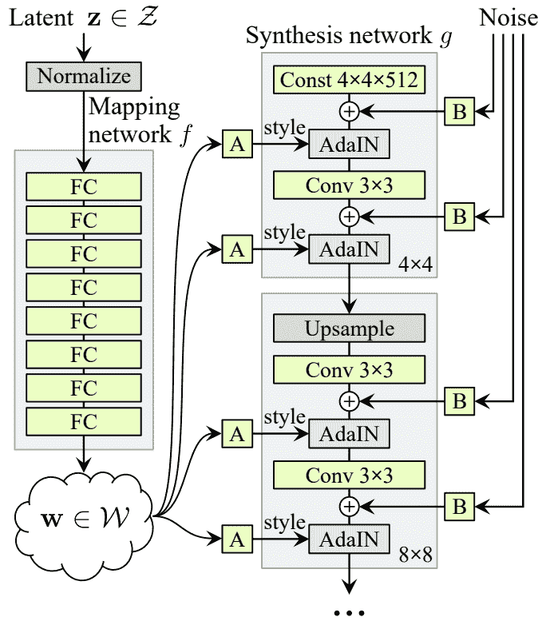

# 风格的温和介绍——风格生成对抗网络

> 原文:[https://machinelearning master . com/introduction-to-style-generated-对抗性-network-stylegan/](https://machinelearningmastery.com/introduction-to-style-generative-adversarial-network-stylegan/)

最后更新于 2020 年 5 月 10 日

生成性对抗网络，简称 GANs，在生成大型高质量图像方面非常有效。

为了训练更有效的发电机模型，已经对鉴别器模型进行了大部分改进，尽管在改进发电机模型方面投入的精力较少。

样式生成对抗网络(简称 StyleGAN)是 GAN 架构的扩展，它对生成器模型提出了较大的更改，包括使用映射网络将潜在空间中的点映射到中间潜在空间，使用中间潜在空间来控制生成器模型中每个点的样式，以及引入噪声作为生成器模型中每个点的变化源。

生成的模型不仅能够生成令人印象深刻的照片级高质量人脸照片，还可以通过改变样式向量和噪声来控制生成的图像在不同细节级别的样式。

在这篇文章中，您将发现风格生成对抗网络，它可以控制生成的合成图像的风格。

看完这篇文章，你会知道:

*   对传统 GAN 模型生成的合成图像的风格缺乏控制。
*   StyleGAN 模型的体系结构引入了对生成的图像在不同细节层次上的风格的控制。
*   当用于生成合成人脸时，StyleGAN 架构取得了令人印象深刻的结果。

**用我的新书[Python 生成性对抗网络](https://machinelearningmastery.com/generative_adversarial_networks/)启动你的项目**，包括*分步教程*和所有示例的 *Python 源代码*文件。

我们开始吧。

风格生成对抗网络简介(StyleGAN)
图片由[伊恩·d·基廷](https://www.flickr.com/photos/ian-arlett/35803601234/)提供，版权所有。

## 概观

本教程分为四个部分；它们是:

1.  对合成图像缺乏控制
2.  使用新生成器模型的控制方式
3.  什么是 StyleGAN 模型架构
4.  样式生成的图像示例

## 对合成图像缺乏控制

生成性对抗网络在生成高质量和高分辨率的合成图像方面是有效的。

生成器模型将来自潜在空间的点作为输入，并生成图像。这个模型由第二个模型训练，称为鉴别器，它学习将训练数据集中的真实图像与生成器模型生成的假图像区分开来。因此，这两个模型在一个对抗性的游戏中竞争，并在训练过程中找到平衡或均衡。

通过对鉴别器模型的增强，已经实现了对 GAN 体系结构的许多改进。这些变化的动机是，更好的鉴别器模型将反过来导致生成更真实的合成图像。

因此，发电机在某种程度上被忽视了，仍然是一个黑匣子。例如，在合成图像的生成中使用的随机性的来源没有被很好地理解，包括采样点中的随机性的量和潜在空间的结构。

> 然而，发电机仍然像黑匣子一样运行，尽管最近做出了努力，但对图像合成过程的各个方面的理解仍然缺乏。对潜在空间的特性也知之甚少…

——[一种基于风格的生成性对抗网络生成器架构](https://arxiv.org/abs/1812.04948)，2018 年。

对发生器的这种有限理解最典型的例子可能是对生成的图像普遍缺乏控制。很少有工具可以控制生成图像的属性，例如样式。这包括高级特征，如背景和前景，以及细粒度细节，如合成对象或主体的特征。

这需要解开图像中的特征或属性，并将这些属性的控件添加到生成器模型中。

## 使用新生成器模型的控制方式

风格生成对抗网络，简称 StyleGAN，是 GAN 架构的扩展，用于控制生成图像的松散风格属性。

> 我们的生成器从学习的常量输入开始，并基于潜在代码调整每个卷积层的图像“样式”，因此直接控制不同比例下的图像特征强度

——[一种基于风格的生成性对抗网络生成器架构](https://arxiv.org/abs/1812.04948)，2018 年。

StyleGAN 是渐进式生长 GAN 的扩展，这是一种训练生成器模型的方法，能够在训练过程中通过鉴别器和生成器模型从小图像到大图像的增量扩展来合成非常大的高质量图像。

除了模型在训练期间的增量增长之外，GAN 的风格显著改变了生成器的架构。

StyleGAN 生成器不再从潜在空间中获取一个点作为输入；相反，有两种新的随机性来源用于生成合成图像:独立的映射网络和噪声层。

映射网络的输出是一个定义样式的向量，这些样式通过一个称为自适应实例规范化的新图层集成在生成器模型的每个点上。使用这种风格矢量可以控制生成图像的风格。

随机变化是通过在发电机模型中的每个点添加噪声而引入的。噪声被添加到整个特征映射中，这允许模型以细粒度、每像素的方式解释样式。

风格向量和噪声的每块结合允许每个块将风格的解释和随机变化定位到给定的细节水平。

> 新的架构导致高级属性(例如，在人脸上训练时的姿势和身份)和生成的图像(例如，雀斑、头发)中的随机变化的自动学习的、无监督的分离，并且它实现了合成的直观的、比例特定的控制

——[一种基于风格的生成性对抗网络生成器架构](https://arxiv.org/abs/1812.04948)，2018 年。

## 什么是 StyleGAN 模型架构

StyleGAN 被描述为一种渐进增长的 GAN 架构，有五种修改，每种修改都是在消融研究中逐步增加和评估的。

生成器的增量更改列表如下:

*   基线渐进性 GAN。
*   添加调谐和双线性上采样。
*   添加映射网络和 AdaIN(样式)。
*   消除发电机的潜在矢量输入。
*   向每个块添加噪声。
*   加法混合正则化。

下图总结了 StyleGAN 生成器的体系结构。

样式生成器模型体系结构概述。
摘自:生成性对抗网络的基于风格的生成器架构。

我们可以更详细地回顾这些变化。

### 1.基线进行性肝动脉栓塞

StyleGAN 生成器和鉴别器模型使用渐进增长 GAN 训练方法进行训练。

这意味着两个模型都是从小图像开始的，在本例中是 4×4 图像。模型被拟合直到稳定，然后鉴别器和发生器都被扩展到宽度和高度的两倍(面积的四倍)，例如 8×8。

每个模型都添加了一个新的块来支持更大的图像尺寸，随着训练的进行，图像尺寸会慢慢变小。一旦淡入，模型再次被训练，直到相当稳定，并且该过程以越来越大的图像尺寸重复，直到满足期望的目标图像尺寸，例如 1024×1024。

有关渐进生长氮化镓的更多信息，请参见论文:

*   [为改善质量、稳定性和变异而进行的肝的渐进生长](https://arxiv.org/abs/1710.10196)，2017 年。

### 2.双线性采样

渐进增长的 GAN 使用最近邻层进行上采样，而不是其他生成器模型中常见的转置卷积层。

StyleGAN 的第一个偏差点是双线性上采样层未被使用，而不是最近邻层。

> 我们用双线性采样替换了两个网络中的最近邻上/下采样，这是通过在每个上采样层之后和每个下采样层之前用可分离的二阶二项式滤波器对激活进行低通滤波来实现的。

——[一种基于风格的生成性对抗网络生成器架构](https://arxiv.org/abs/1812.04948)，2018 年。

### 3.映射网络和数据适配器

接下来，使用独立的映射网络，该网络从潜在空间中获取随机采样点作为输入，并生成样式向量。

映射网络由八个完全连接的层组成，例如，它是一个标准的深度神经网络。

> 为了简单起见，我们将[潜在和中间潜在]空间的维数都设置为 512，并且使用 8 层 MLP …

——[一种基于风格的生成性对抗网络生成器架构](https://arxiv.org/abs/1812.04948)，2018 年。

然后，通过一种称为自适应实例归一化或 AdaIN 的操作，在卷积层之后，样式向量被转换并合并到生成器模型的每个块中。

AdaIN 图层首先将要素地图的输出标准化为标准高斯，然后添加样式向量作为偏差项。

> 然后，学习的仿射变换将[中间潜在向量]专门化为样式 y = (ys，yb)，这些样式控制合成网络 g 的每个卷积层之后的自适应实例归一化(AdaIN)操作。

——[一种基于风格的生成性对抗网络生成器架构](https://arxiv.org/abs/1812.04948)，2018 年。

StyleGAN 中自适应实例归一化的计算。
摘自:生成性对抗网络的基于风格的生成器架构。

向架构中添加新的映射网络还会导致将生成器模型重命名为“*合成网络*”

### 4.潜在点输入的移除

下一个变化涉及修改生成器模型，使其不再从潜在空间中选取一个点作为输入。

相反，模型具有恒定的 4x4x512 常数值输入，以便开始图像合成过程。

### 5.添加噪声

合成网络中每个卷积层的输出是一组激活图。

在 AdaIN 操作之前，高斯噪声被添加到这些激活映射中的每一个。为每个块生成不同的噪声样本，并使用每层比例因子进行解释。

> 这些是由不相关的高斯噪声组成的单通道图像，我们向合成网络的每一层馈送一个专用噪声图像。使用学习的每个特征的缩放因子将噪声图像广播到所有特征图，然后添加到相应卷积的输出中…

——[一种基于风格的生成性对抗网络生成器架构](https://arxiv.org/abs/1812.04948)，2018 年。

该噪声用于在给定的细节级别引入风格级别的变化。

### 6.混合正则化

混合正则化包括首先从映射网络生成两个样式向量。

选择合成网络中的一个分割点，并且在分割点之前的所有 AdaIN 操作使用第一个样式向量，并且在分割点之后的所有 AdaIN 操作获得第二个样式向量。

> ……我们采用混合正则化，其中给定百分比的图像是使用两个随机潜在代码生成的，而不是在训练期间使用一个。

——[一种基于风格的生成性对抗网络生成器架构](https://arxiv.org/abs/1812.04948)，2018 年。

这有助于图层和块将样式定位到模型的特定部分以及生成的图像中的相应细节级别。

## 样式生成的图像示例

StyleGAN 在生成大的高质量图像和控制生成图像的风格方面都很有效。

在本节中，我们将回顾一些生成图像的示例。

论文作者发布了一段展示该模型能力的视频，提供了一个有用的概述。

*   [StyleGAN 结果视频，YouTube](https://www.youtube.com/watch?v=kSLJriaOumA) 。

<iframe loading="lazy" title="A Style-Based Generator Architecture for Generative Adversarial Networks" width="500" height="281" src="about:blank" frameborder="0" allow="accelerometer; autoplay; encrypted-media; gyroscope; picture-in-picture" allowfullscreen="" data-rocket-lazyload="fitvidscompatible" data-lazy-src="https://www.youtube.com/embed/kSLJriaOumA?feature=oembed"><iframe title="A Style-Based Generator Architecture for Generative Adversarial Networks" width="500" height="281" src="https://www.youtube.com/embed/kSLJriaOumA?feature=oembed" frameborder="0" allow="accelerometer; autoplay; encrypted-media; gyroscope; picture-in-picture" allowfullscreen=""/>
 
 <h3>高质量的面孔</h3> 
下图是用 4×4、8×8、16×16 和 32×32 的 StyleGAN 生成的合成人脸。
 

使用样式生成高质量人脸的示例。 摘自:生成性对抗网络的基于风格的生成器架构。

 <h3>根据细节层次改变风格</h3> 
在合成网络的不同点使用不同的风格矢量，可以在不同的细节层次上控制最终图像的风格。
 
例如，合成网络中较低分辨率(例如 4×4 和 8×8)的层块控制高级风格，例如姿势和发型。网络模型中的层块(例如 16×16 和 32×32)控制发型和面部表情。最后，更靠近网络输出端的层块(例如 64×64 到 1024×1024)控制色彩方案和非常精细的细节。
 
下面这张从纸上拍摄的图像显示了左侧和顶部生成的图像。中间图像的两行是用于生成左侧图像的样式向量的示例，其中用于顶部图像的样式向量仅在较低级别使用。这允许左边的图像采用每列顶部图像的高级风格，如姿势和发型。
 <blockquote>
复制对应于粗略空间分辨率(4^2-8^2)的样式会带来高级方面，例如来自源 b 的姿势、一般发型、脸型和眼镜，而所有颜色(眼睛、头发、照明)和更精细的面部特征都类似于源 a。
</blockquote> 
——<a href="https://arxiv.org/abs/1812.04948">一种基于风格的生成性对抗网络生成器架构</a>，2018 年。
 

一组生成面的示例(左)采用另一组生成面的粗略样式(上) 摘自:生成性对抗网络的基于样式的生成器体系结构。

 <h3>使用噪声控制细节水平</h3> 
作者在模型的不同细节层次(如精细、中等、粗糙)改变了噪声的使用，很像前面不同风格的例子。
 
结果是噪声控制了细节的产生，从在粗糙层块中使用噪声时的更宽结构，到在更接近网络输出的层中添加噪声时的精细细节的产生。
 <blockquote>
我们可以看到噪音的人为省略导致了毫无特色的“绘画式”外观。粗噪声会导致大规模的头发卷曲和较大背景特征的出现，而细噪声会带来更细的头发卷曲、更细的背景细节和皮肤毛孔。
</blockquote> 
——<a href="https://arxiv.org/abs/1812.04948">一种基于风格的生成性对抗网络生成器架构</a>，2018 年。
 

发电机模型不同级别的噪声变化示例。 摘自:生成性对抗网络的基于风格的生成器架构。

 <h2>进一步阅读</h2> 
如果您想更深入地了解这个主题，本节将提供更多资源。
 <ul> <li><a href="https://arxiv.org/abs/1812.04948">一种基于风格的生成对抗网络生成器架构</a>，2018。</li> <li><a href="https://arxiv.org/abs/1710.10196">为改善质量、稳定性和变异而进行的肝的渐进生长</a>，2017 年。</li> <li><a href="https://github.com/NVlabs/stylegan">style gan–官方 TensorFlow 实现，GitHub </a>。</li> <li><a href="https://www.youtube.com/watch?v=kSLJriaOumA"> StyleGAN 结果视频，YouTube </a>。</li> </ul> <h2>摘要</h2> 
在这篇文章中，你发现了风格生成对抗网络，它可以控制生成的合成图像的风格。
 
具体来说，您了解到:
 <ul> <li>对传统 GAN 模型生成的合成图像的风格缺乏控制。</li> <li>StyleGAN 模型的体系结构 GAN 模型引入了对生成的图像在不同细节级别上的风格的控制</li> <li>当用于生成合成人脸时，StyleGAN 架构取得了令人印象深刻的结果。</li> </ul> 
你有什么问题吗？ 在下面的评论中提问，我会尽力回答。
 
 </body></html></iframe>