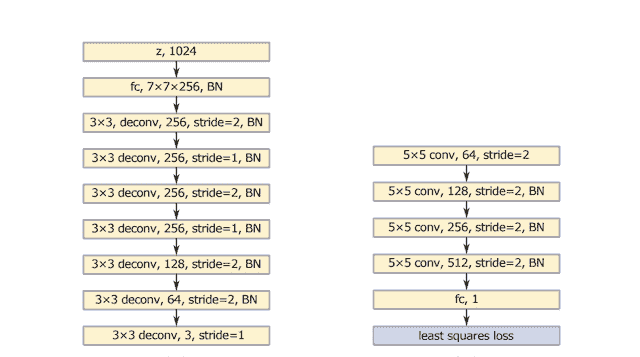
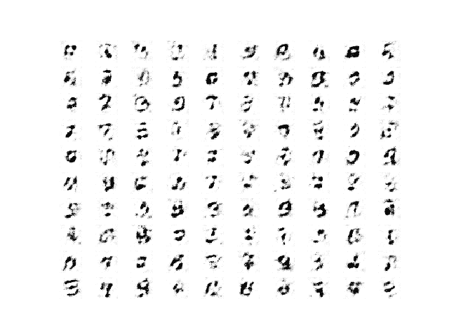
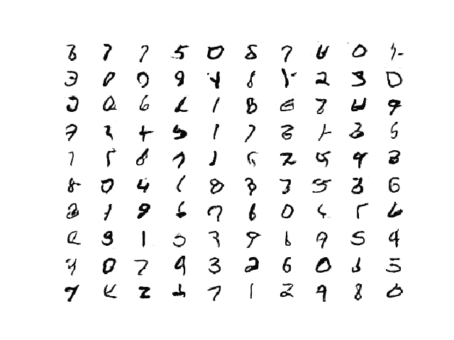
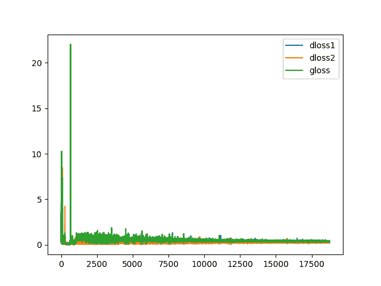
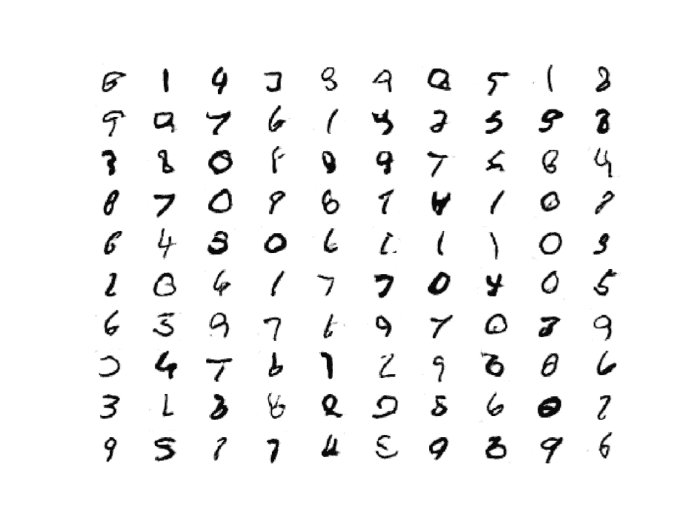

# 如何在 Keras 开发最小二乘生成对抗网络

> 原文：<https://machinelearningmastery.com/least-squares-generative-adversarial-network/>

最后更新于 2021 年 1 月 18 日

最小二乘生成对抗网络，简称 LSGAN，是 GAN 架构的扩展，解决了梯度消失和损耗饱和的问题。

它的动机是希望向生成器提供关于假样本的信号，这些假样本远离鉴别器模型的决策边界，用于将它们分类为真或假。生成的图像离决策边界越远，提供给生成器的误差信号就越大，从而鼓励生成更真实的图像。

LSGAN 可以通过对鉴别器层的输出层的微小改变和采用最小二乘或 L2 损失函数来实现。

在本教程中，您将发现如何开发一个最小二乘生成性对抗网络。

完成本教程后，您将知道:

*   LSGAN 解决了深度卷积 GAN 的消失梯度和损耗饱和问题。
*   LSGAN 可以通过鉴别器模型的均方误差或 L2 损失函数来实现。
*   如何实现为 MNIST 数据集生成手写数字的 LSGAN 模型。

**用我的新书[Python 生成性对抗网络](https://machinelearningmastery.com/generative_adversarial_networks/)启动你的项目**，包括*分步教程*和所有示例的 *Python 源代码*文件。

我们开始吧。

*   **2021 年 1 月更新**:更新所以图层冻结用批量定额。


如何开发用于图像生成的最小二乘生成对抗网络。，保留部分权利。

## 教程概述

本教程分为三个部分；它们是:

1.  什么是最小二乘法
2.  如何开发 MNIST 手写数字的 LSGAN
3.  如何用 LSGAN 生成图像

## 什么是最小二乘法

标准的生成对抗网络，简称 GAN，是一种训练无监督生成模型的有效架构。

该体系结构包括训练鉴别器模型来区分真实(来自数据集)和虚假(生成的)图像，并依次使用鉴别器来训练生成器模型。生成器以这样一种方式更新，即鼓励它生成更有可能欺骗鉴别器的图像。

鉴别器是一个二进制分类器，使用二进制交叉熵损失函数进行训练。这种损失函数的一个局限性是，它主要关心预测是否正确，而不太关心它们可能有多正确或不正确。

> ……当我们使用假样本通过使鉴别器相信它们来自真实数据来更新生成器时，它几乎不会导致错误，因为它们位于决策边界的正确侧，即真实数据侧

——[最小二乘生成对抗网络](https://arxiv.org/abs/1611.04076)，2016。

这可以在两个维度上概念化为一条线或决定边界，将代表真实和虚假图像的点分开。鉴别器负责设计判定边界，以最好地分离真实和虚假图像，生成器负责创建看起来像真实点的新点，混淆鉴别器。

交叉熵损失的选择意味着远离边界生成的点是对的还是错的，但是向生成器提供的关于如何生成更好的图像的梯度信息非常少。

远离决策边界的生成图像的这种小梯度被称为消失梯度问题或损失饱和度。损失函数无法给出关于如何最好地更新模型的强信号。

最小二乘生成对抗网络，简称 LSGAN，是毛旭东等人在 2016 年发表的论文《T2 最小二乘生成对抗网络》中提出的 GAN 架构的扩展 LSGAN 是对 GAN 架构的修改，将鉴别器的损耗函数从二进制交叉熵变为最小二乘损耗。

这种变化的动机是最小二乘损失将根据图像与决策边界的距离来惩罚生成的图像。这将为与现有数据非常不同或相差甚远的生成图像提供强梯度信号，并解决饱和损失问题。

> ……最小化规则 GAN 的目标函数会遭受渐变消失的困扰，这使得生成器很难更新。LSGANs 可以缓解这个问题，因为 LSGANs 根据样本到决策边界的距离来惩罚样本，这会生成更多的梯度来更新生成器。

——[最小二乘生成对抗网络](https://arxiv.org/abs/1611.04076)，2016。

这可以通过以下取自论文的图来概念化，该图在左侧显示了 sigmoid 决策边界(蓝色)和远离决策边界的生成的伪点(粉色)，在右侧显示了最小二乘决策边界(红色)和远离边界的点(粉色)，给定一个梯度将它们移近边界。


更新生成器的 Sigmoid 决策边界与最小平方决策边界的关系图。
摘自:最小二乘生成对抗网络。

除了避免损失饱和之外，与传统的深度卷积 GAN 相比，LSGAN 还导致更稳定的训练过程和更高质量和更大图像的生成。

> 首先，低分辨率图像传感器能够产生比普通图像传感器更高质量的图像。第二，LSGANs 在学习过程中表现更稳定。

——[最小二乘生成对抗网络](https://arxiv.org/abs/1611.04076)，2016。

可以通过使用真实图像的 1.0 和伪造图像的 0.0 的目标值，并使用均方误差损失函数(例如，L2 损失)优化模型来实现 LSGAN。鉴别器模型的输出层必须是线性激活函数。

作者提出了一个生成器和鉴别器模型架构，灵感来自 VGG 模型架构，并在生成器模型中使用交错上采样和正常卷积层，如下图左侧所示。



LSGAN 实验中使用的发生器(左)和鉴别器(右)模型架构总结。
摘自:最小二乘生成对抗网络。

## 如何开发 MNIST 手写数字的 LSGAN

在本节中，我们将为 [MNIST 手写数字数据集](https://machinelearningmastery.com/how-to-develop-a-convolutional-neural-network-from-scratch-for-mnist-handwritten-digit-classification/)开发一个 LSGAN。

第一步是定义模型。

鉴别器和发生器都将基于深度卷积 GAN 或 DCGAN 架构。这包括使用卷积-批处理-激活层块，使用 [2×2 步距](https://machinelearningmastery.com/padding-and-stride-for-convolutional-neural-networks/)进行下采样，转置卷积层进行上采样。鉴别器中使用了 LeakyReLU 激活层，发生器中使用了 [ReLU 激活层](https://machinelearningmastery.com/rectified-linear-activation-function-for-deep-learning-neural-networks/)。

鉴别器期望灰度输入图像具有 28×28 的形状，图像的形状在 MNIST 数据集中，并且输出层是具有线性激活函数的单个节点。根据最小二乘法，使用均方误差损失函数优化模型。下面的 *define_discriminator()* 函数定义了鉴别器模型。

```py
# define the standalone discriminator model
def define_discriminator(in_shape=(28,28,1)):
	# weight initialization
	init = RandomNormal(stddev=0.02)
	# define model
	model = Sequential()
	# downsample to 14x14
	model.add(Conv2D(64, (4,4), strides=(2,2), padding='same', kernel_initializer=init, input_shape=in_shape))
	model.add(BatchNormalization())
	model.add(LeakyReLU(alpha=0.2))
	# downsample to 7x7
	model.add(Conv2D(128, (4,4), strides=(2,2), padding='same', kernel_initializer=init))
	model.add(BatchNormalization())
	model.add(LeakyReLU(alpha=0.2))
	# classifier
	model.add(Flatten())
	model.add(Dense(1, activation='linear', kernel_initializer=init))
	# compile model with L2 loss
	model.compile(loss='mse', optimizer=Adam(lr=0.0002, beta_1=0.5))
	return model
```

生成器模型以潜在空间中的一点作为输入，并通过输出层上的 tanh 激活函数输出形状为 28×28 像素的灰度图像，其中像素值在[-1，1]的范围内。

下面的 *define_generator()* 函数定义了生成器模型。这个模型没有被编译，因为它不是以独立的方式训练的。

```py
# define the standalone generator model
def define_generator(latent_dim):
	# weight initialization
	init = RandomNormal(stddev=0.02)
	# define model
	model = Sequential()
	# foundation for 7x7 image
	n_nodes = 256 * 7 * 7
	model.add(Dense(n_nodes, kernel_initializer=init, input_dim=latent_dim))
	model.add(BatchNormalization())
	model.add(Activation('relu'))
	model.add(Reshape((7, 7, 256)))
	# upsample to 14x14
	model.add(Conv2DTranspose(128, (4,4), strides=(2,2), padding='same', kernel_initializer=init))
	model.add(BatchNormalization())
	model.add(Activation('relu'))
	# upsample to 28x28
	model.add(Conv2DTranspose(64, (4,4), strides=(2,2), padding='same', kernel_initializer=init))
	model.add(BatchNormalization())
	model.add(Activation('relu'))
	# output 28x28x1
	model.add(Conv2D(1, (7,7), padding='same', kernel_initializer=init))
	model.add(Activation('tanh'))
	return model
```

生成器模型通过鉴别器模型进行更新。这是通过创建一个复合模型来实现的，该模型将发生器堆叠在鉴别器的顶部，以便误差信号可以通过鉴别器流回发生器。

当在该复合模型中使用时，鉴别器的权重被标记为不可训练。通过合成模型的更新包括使用生成器通过提供潜在空间中的随机点作为输入来创建新图像。生成的图像被传递给鉴别器，鉴别器将把它们分为真的或假的。权重被更新，就像生成的图像是真实的一样(例如，目标为 1.0)，允许生成器被更新以生成更真实的图像。

*define_gan()* 函数定义并编译复合模型，用于通过鉴别器更新发电机模型，再次根据 LSGAN 通过均方误差进行优化。

```py
# define the combined generator and discriminator model, for updating the generator
def define_gan(generator, discriminator):
	# make weights in the discriminator not trainable
	for layer in discriminator.layers:
		if not isinstance(layer, BatchNormalization):
			layer.trainable = False
	# connect them
	model = Sequential()
	# add generator
	model.add(generator)
	# add the discriminator
	model.add(discriminator)
	# compile model with L2 loss
	model.compile(loss='mse', optimizer=Adam(lr=0.0002, beta_1=0.5))
	return model
```

接下来，我们可以定义一个函数来加载 MNIST 手写数字数据集，并将像素值缩放到[-1，1]的范围，以匹配生成器模型输出的图像。

仅使用了 MNIST 数据集的训练部分，其中包含 60，000 幅居中的灰度图像，位数从零到九。

```py
# load mnist images
def load_real_samples():
	# load dataset
	(trainX, _), (_, _) = load_data()
	# expand to 3d, e.g. add channels
	X = expand_dims(trainX, axis=-1)
	# convert from ints to floats
	X = X.astype('float32')
	# scale from [0,255] to [-1,1]
	X = (X - 127.5) / 127.5
	return X
```

然后，我们可以定义一个函数，从训练数据集中检索一批随机选择的图像。

真实图像与鉴别器模型的相应目标值一起返回，例如 y=1.0，以指示它们是真实的。

```py
# select real samples
def generate_real_samples(dataset, n_samples):
	# choose random instances
	ix = randint(0, dataset.shape[0], n_samples)
	# select images
	X = dataset[ix]
	# generate class labels
	y = ones((n_samples, 1))
	return X, y
```

接下来，我们可以为生成器开发相应的功能。

首先，用于在潜在空间中生成随机点以用作通过生成器模型生成图像的输入的函数。

```py
# generate points in latent space as input for the generator
def generate_latent_points(latent_dim, n_samples):
	# generate points in the latent space
	x_input = randn(latent_dim * n_samples)
	# reshape into a batch of inputs for the network
	x_input = x_input.reshape(n_samples, latent_dim)
	return x_input
```

接下来，一个函数将使用生成器模型生成一批假图像，用于更新鉴别器模型，以及指示图像是假的目标值(y=0)。

```py
# use the generator to generate n fake examples, with class labels
def generate_fake_samples(generator, latent_dim, n_samples):
	# generate points in latent space
	x_input = generate_latent_points(latent_dim, n_samples)
	# predict outputs
	X = generator.predict(x_input)
	# create class labels
	y = zeros((n_samples, 1))
	return X, y
```

我们需要在训练期间定期使用生成器来生成图像，我们可以主观检查这些图像，并将其用作选择最终生成器模型的基础。

在训练过程中可以调用下面的*summary _ performance()*函数，生成并保存一张图像图，保存生成器模型。使用反向灰度色图绘制图像，使数字在白色背景上变成黑色。

```py
# generate samples and save as a plot and save the model
def summarize_performance(step, g_model, latent_dim, n_samples=100):
	# prepare fake examples
	X, _ = generate_fake_samples(g_model, latent_dim, n_samples)
	# scale from [-1,1] to [0,1]
	X = (X + 1) / 2.0
	# plot images
	for i in range(10 * 10):
		# define subplot
		pyplot.subplot(10, 10, 1 + i)
		# turn off axis
		pyplot.axis('off')
		# plot raw pixel data
		pyplot.imshow(X[i, :, :, 0], cmap='gray_r')
	# save plot to file
	filename1 = 'generated_plot_%06d.png' % (step+1)
	pyplot.savefig(filename1)
	pyplot.close()
	# save the generator model
	filename2 = 'model_%06d.h5' % (step+1)
	g_model.save(filename2)
	print('Saved %s and %s' % (filename1, filename2))
```

我们也对训练中的损失行为感兴趣。

因此，我们可以在每次训练迭代的列表中记录损失，然后创建并保存模型学习动态的线图。创建并保存[学习曲线](https://machinelearningmastery.com/learning-curves-for-diagnosing-machine-learning-model-performance/)的绘图在*绘图 _ 历史()*功能中实现。

```py
# create a line plot of loss for the gan and save to file
def plot_history(d1_hist, d2_hist, g_hist):
	pyplot.plot(d1_hist, label='dloss1')
	pyplot.plot(d2_hist, label='dloss2')
	pyplot.plot(g_hist, label='gloss')
	pyplot.legend()
	filename = 'plot_line_plot_loss.png'
	pyplot.savefig(filename)
	pyplot.close()
	print('Saved %s' % (filename))
```

最后，我们可以通过 *train()* 函数定义主训练循环。

该函数将定义的模型和数据集作为参数，并将训练时期的数量和批处理大小作为默认函数参数进行参数化。

每个训练循环首先生成半批真样本和假样本，并使用它们为鉴别器创建一批有价值的权重更新。接下来，通过复合模型更新生成器，提供真实(y=1)目标作为模型的预期输出。

在每次训练迭代中报告损失，并根据每个时期结束时生成的图像图总结模型性能。学习曲线的绘图在运行结束时创建并保存。

```py
# train the generator and discriminator
def train(g_model, d_model, gan_model, dataset, latent_dim, n_epochs=20, n_batch=64):
	# calculate the number of batches per training epoch
	bat_per_epo = int(dataset.shape[0] / n_batch)
	# calculate the number of training iterations
	n_steps = bat_per_epo * n_epochs
	# calculate the size of half a batch of samples
	half_batch = int(n_batch / 2)
	# lists for storing loss, for plotting later
	d1_hist, d2_hist, g_hist = list(), list(), list()
	# manually enumerate epochs
	for i in range(n_steps):
		# prepare real and fake samples
		X_real, y_real = generate_real_samples(dataset, half_batch)
		X_fake, y_fake = generate_fake_samples(g_model, latent_dim, half_batch)
		# update discriminator model
		d_loss1 = d_model.train_on_batch(X_real, y_real)
		d_loss2 = d_model.train_on_batch(X_fake, y_fake)
		# update the generator via the discriminator's error
		z_input = generate_latent_points(latent_dim, n_batch)
		y_real2 = ones((n_batch, 1))
		g_loss = gan_model.train_on_batch(z_input, y_real2)
		# summarize loss on this batch
		print('>%d, d1=%.3f, d2=%.3f g=%.3f' % (i+1, d_loss1, d_loss2, g_loss))
		# record history
		d1_hist.append(d_loss1)
		d2_hist.append(d_loss2)
		g_hist.append(g_loss)
		# evaluate the model performance every 'epoch'
		if (i+1) % (bat_per_epo * 1) == 0:
			summarize_performance(i, g_model, latent_dim)
	# create line plot of training history
	plot_history(d1_hist, d2_hist, g_hist)
```

将所有这些结合在一起，下面列出了在 MNIST 手写数字数据集上训练 LSGAN 的完整代码示例。

```py
# example of lsgan for mnist
from numpy import expand_dims
from numpy import zeros
from numpy import ones
from numpy.random import randn
from numpy.random import randint
from keras.datasets.mnist import load_data
from keras.optimizers import Adam
from keras.models import Sequential
from keras.layers import Dense
from keras.layers import Reshape
from keras.layers import Flatten
from keras.layers import Conv2D
from keras.layers import Conv2DTranspose
from keras.layers import Activation
from keras.layers import LeakyReLU
from keras.layers import BatchNormalization
from keras.initializers import RandomNormal
from matplotlib import pyplot

# define the standalone discriminator model
def define_discriminator(in_shape=(28,28,1)):
	# weight initialization
	init = RandomNormal(stddev=0.02)
	# define model
	model = Sequential()
	# downsample to 14x14
	model.add(Conv2D(64, (4,4), strides=(2,2), padding='same', kernel_initializer=init, input_shape=in_shape))
	model.add(BatchNormalization())
	model.add(LeakyReLU(alpha=0.2))
	# downsample to 7x7
	model.add(Conv2D(128, (4,4), strides=(2,2), padding='same', kernel_initializer=init))
	model.add(BatchNormalization())
	model.add(LeakyReLU(alpha=0.2))
	# classifier
	model.add(Flatten())
	model.add(Dense(1, activation='linear', kernel_initializer=init))
	# compile model with L2 loss
	model.compile(loss='mse', optimizer=Adam(lr=0.0002, beta_1=0.5))
	return model

# define the standalone generator model
def define_generator(latent_dim):
	# weight initialization
	init = RandomNormal(stddev=0.02)
	# define model
	model = Sequential()
	# foundation for 7x7 image
	n_nodes = 256 * 7 * 7
	model.add(Dense(n_nodes, kernel_initializer=init, input_dim=latent_dim))
	model.add(BatchNormalization())
	model.add(Activation('relu'))
	model.add(Reshape((7, 7, 256)))
	# upsample to 14x14
	model.add(Conv2DTranspose(128, (4,4), strides=(2,2), padding='same', kernel_initializer=init))
	model.add(BatchNormalization())
	model.add(Activation('relu'))
	# upsample to 28x28
	model.add(Conv2DTranspose(64, (4,4), strides=(2,2), padding='same', kernel_initializer=init))
	model.add(BatchNormalization())
	model.add(Activation('relu'))
	# output 28x28x1
	model.add(Conv2D(1, (7,7), padding='same', kernel_initializer=init))
	model.add(Activation('tanh'))
	return model

# define the combined generator and discriminator model, for updating the generator
def define_gan(generator, discriminator):
	# make weights in the discriminator not trainable
	for layer in discriminator.layers:
		if not isinstance(layer, BatchNormalization):
			layer.trainable = False
	# connect them
	model = Sequential()
	# add generator
	model.add(generator)
	# add the discriminator
	model.add(discriminator)
	# compile model with L2 loss
	model.compile(loss='mse', optimizer=Adam(lr=0.0002, beta_1=0.5))
	return model

# load mnist images
def load_real_samples():
	# load dataset
	(trainX, _), (_, _) = load_data()
	# expand to 3d, e.g. add channels
	X = expand_dims(trainX, axis=-1)
	# convert from ints to floats
	X = X.astype('float32')
	# scale from [0,255] to [-1,1]
	X = (X - 127.5) / 127.5
	return X

# # select real samples
def generate_real_samples(dataset, n_samples):
	# choose random instances
	ix = randint(0, dataset.shape[0], n_samples)
	# select images
	X = dataset[ix]
	# generate class labels
	y = ones((n_samples, 1))
	return X, y

# generate points in latent space as input for the generator
def generate_latent_points(latent_dim, n_samples):
	# generate points in the latent space
	x_input = randn(latent_dim * n_samples)
	# reshape into a batch of inputs for the network
	x_input = x_input.reshape(n_samples, latent_dim)
	return x_input

# use the generator to generate n fake examples, with class labels
def generate_fake_samples(generator, latent_dim, n_samples):
	# generate points in latent space
	x_input = generate_latent_points(latent_dim, n_samples)
	# predict outputs
	X = generator.predict(x_input)
	# create class labels
	y = zeros((n_samples, 1))
	return X, y

# generate samples and save as a plot and save the model
def summarize_performance(step, g_model, latent_dim, n_samples=100):
	# prepare fake examples
	X, _ = generate_fake_samples(g_model, latent_dim, n_samples)
	# scale from [-1,1] to [0,1]
	X = (X + 1) / 2.0
	# plot images
	for i in range(10 * 10):
		# define subplot
		pyplot.subplot(10, 10, 1 + i)
		# turn off axis
		pyplot.axis('off')
		# plot raw pixel data
		pyplot.imshow(X[i, :, :, 0], cmap='gray_r')
	# save plot to file
	filename1 = 'generated_plot_%06d.png' % (step+1)
	pyplot.savefig(filename1)
	pyplot.close()
	# save the generator model
	filename2 = 'model_%06d.h5' % (step+1)
	g_model.save(filename2)
	print('Saved %s and %s' % (filename1, filename2))

# create a line plot of loss for the gan and save to file
def plot_history(d1_hist, d2_hist, g_hist):
	pyplot.plot(d1_hist, label='dloss1')
	pyplot.plot(d2_hist, label='dloss2')
	pyplot.plot(g_hist, label='gloss')
	pyplot.legend()
	filename = 'plot_line_plot_loss.png'
	pyplot.savefig(filename)
	pyplot.close()
	print('Saved %s' % (filename))

# train the generator and discriminator
def train(g_model, d_model, gan_model, dataset, latent_dim, n_epochs=20, n_batch=64):
	# calculate the number of batches per training epoch
	bat_per_epo = int(dataset.shape[0] / n_batch)
	# calculate the number of training iterations
	n_steps = bat_per_epo * n_epochs
	# calculate the size of half a batch of samples
	half_batch = int(n_batch / 2)
	# lists for storing loss, for plotting later
	d1_hist, d2_hist, g_hist = list(), list(), list()
	# manually enumerate epochs
	for i in range(n_steps):
		# prepare real and fake samples
		X_real, y_real = generate_real_samples(dataset, half_batch)
		X_fake, y_fake = generate_fake_samples(g_model, latent_dim, half_batch)
		# update discriminator model
		d_loss1 = d_model.train_on_batch(X_real, y_real)
		d_loss2 = d_model.train_on_batch(X_fake, y_fake)
		# update the generator via the discriminator's error
		z_input = generate_latent_points(latent_dim, n_batch)
		y_real2 = ones((n_batch, 1))
		g_loss = gan_model.train_on_batch(z_input, y_real2)
		# summarize loss on this batch
		print('>%d, d1=%.3f, d2=%.3f g=%.3f' % (i+1, d_loss1, d_loss2, g_loss))
		# record history
		d1_hist.append(d_loss1)
		d2_hist.append(d_loss2)
		g_hist.append(g_loss)
		# evaluate the model performance every 'epoch'
		if (i+1) % (bat_per_epo * 1) == 0:
			summarize_performance(i, g_model, latent_dim)
	# create line plot of training history
	plot_history(d1_hist, d2_hist, g_hist)

# size of the latent space
latent_dim = 100
# create the discriminator
discriminator = define_discriminator()
# create the generator
generator = define_generator(latent_dim)
# create the gan
gan_model = define_gan(generator, discriminator)
# load image data
dataset = load_real_samples()
print(dataset.shape)
# train model
train(generator, discriminator, gan_model, dataset, latent_dim)
```

**注**:示例可以在 CPU 上运行，虽然可能需要一段时间，建议在 GPU 硬件上运行。

**注**:考虑到算法或评估程序的随机性，或数值精度的差异，您的[结果可能会有所不同](https://machinelearningmastery.com/different-results-each-time-in-machine-learning/)。考虑运行该示例几次，并比较平均结果。

运行该示例将报告真实( *d1* )和虚假( *d2* )示例上的鉴别器的丢失，以及生成的呈现为真实( *g* )的示例上的鉴别器的生成器的丢失。

这些分数会在每次培训结束时打印出来，预计在整个培训过程中保持较小的值。长时间的零值可能表示故障模式，应重新开始培训过程。

```py
>1, d1=9.292, d2=0.153 g=2.530
>2, d1=1.173, d2=2.057 g=0.903
>3, d1=1.347, d2=1.922 g=2.215
>4, d1=0.604, d2=0.545 g=1.846
>5, d1=0.643, d2=0.734 g=1.619
...
```

生成的图像图是在每个时期结束时创建的。

运行开始时生成的图像很粗糙。



1 个训练周期后 100 个 LSGAN 生成的手写数字示例

经过几个训练阶段后，生成的图像开始看起来清晰逼真。

请记住:更多的训练时期可能对应于也可能不对应于输出更高质量图像的生成器。查看生成的图，并选择具有最佳图像质量的最终模型。



20 个训练时期后 100 个 LSGAN 生成的手写数字示例

在训练运行结束时，为鉴别器和生成器创建一个学习曲线图。

在这种情况下，我们可以看到训练在整个跑步过程中保持一定的稳定性，观察到一些非常大的峰值，这洗去了情节的规模。



训练期间 LSGAN 中发生器和鉴别器的学习曲线图。

## 如何用 LSGAN 生成图像

我们可以使用保存的生成器模型按需创建新图像。

这可以通过首先基于图像质量选择最终模型，然后加载它并提供来自潜在空间的新点作为输入，以便从该域生成新的似是而非的图像来实现。

在这种情况下，我们将使用在 20 个时期后保存的模型，或 18，740 (60K/64 或每个时期 937 批次* 20 个时期)训练迭代。

```py
# example of loading the generator model and generating images
from keras.models import load_model
from numpy.random import randn
from matplotlib import pyplot

# generate points in latent space as input for the generator
def generate_latent_points(latent_dim, n_samples):
	# generate points in the latent space
	x_input = randn(latent_dim * n_samples)
	# reshape into a batch of inputs for the network
	x_input = x_input.reshape(n_samples, latent_dim)
	return x_input

# create a plot of generated images (reversed grayscale)
def plot_generated(examples, n):
	# plot images
	for i in range(n * n):
		# define subplot
		pyplot.subplot(n, n, 1 + i)
		# turn off axis
		pyplot.axis('off')
		# plot raw pixel data
		pyplot.imshow(examples[i, :, :, 0], cmap='gray_r')
	pyplot.show()

# load model
model = load_model('model_018740.h5')
# generate images
latent_points = generate_latent_points(100, 100)
# generate images
X = model.predict(latent_points)
# plot the result
plot_generated(X, 10)
```

运行该示例会生成 10×10 或 100 个新的看似可信的手写数字。



100 LSGAN 生成的可信手写数字图

## 进一步阅读

如果您想更深入地了解这个主题，本节将提供更多资源。

### 报纸

*   [最小二乘生成对抗网络](https://arxiv.org/abs/1611.04076)，2016。

### 应用程序接口

*   [硬数据集接口。](https://keras.io/datasets/)
*   [Keras 顺序模型 API](https://keras.io/models/sequential/)
*   [喀拉斯卷积层应用编程接口](https://keras.io/layers/convolutional/)
*   [如何“冻结”Keras 图层？](https://keras.io/getting-started/faq/#how-can-i-freeze-keras-layers)
*   [MatplotLib API](https://matplotlib.org/api/)
*   [NumPy 随机采样(numpy.random) API](https://docs.scipy.org/doc/numpy/reference/routines.random.html)
*   [NumPy 数组操作例程](https://docs.scipy.org/doc/numpy/reference/routines.array-manipulation.html)

### 文章

*   [最小二乘法 GAN](https://wiseodd.github.io/techblog/2017/03/02/least-squares-gan/) ，2017。
*   [LSGAN 项目(官方)，GitHub](https://github.com/xudonmao/LSGAN) 。
*   [Keras-GAN 项目，GitHub](https://github.com/eriklindernoren/Keras-GAN) 。

## 摘要

在本教程中，您发现了如何开发最小二乘生成性对抗网络。

具体来说，您了解到:

*   LSGAN 解决了深度卷积 GAN 的消失梯度和损耗饱和问题。
*   LSGAN 可以通过鉴别器模型的均方误差或 L2 损失函数来实现。
*   如何实现为 MNIST 数据集生成手写数字的 LSGAN 模型。

你有什么问题吗？
在下面的评论中提问，我会尽力回答。