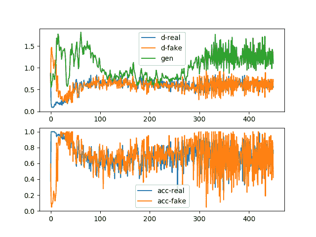
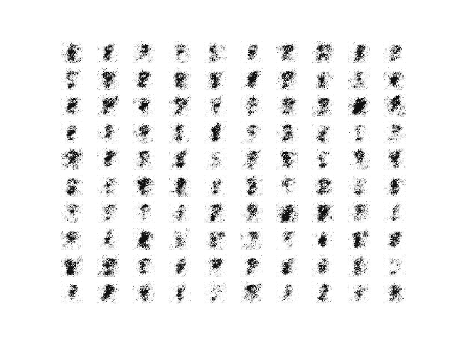
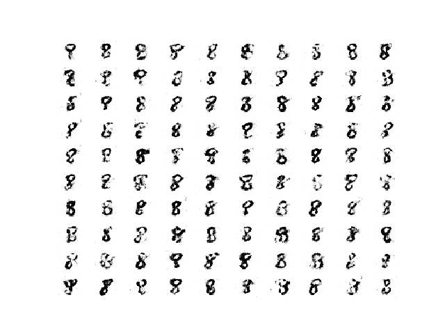
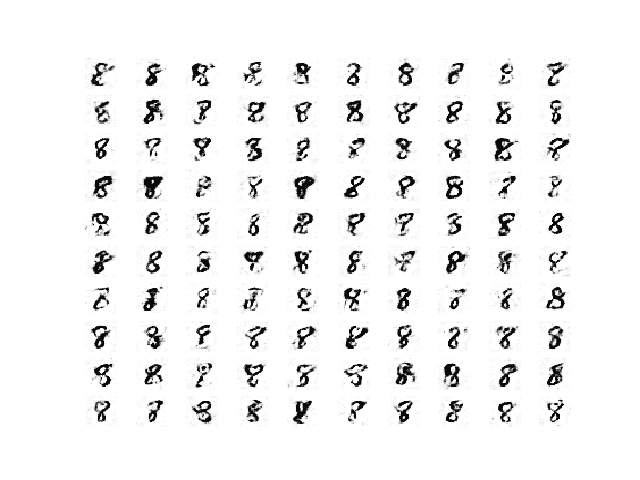
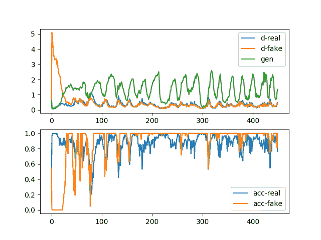
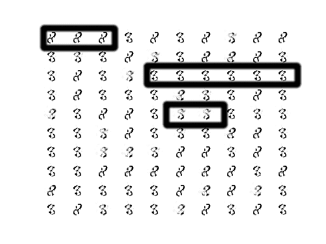
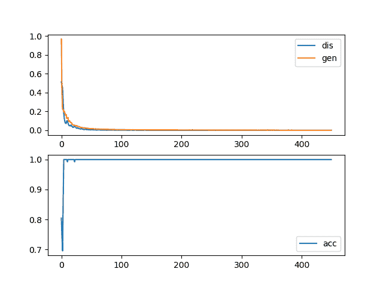
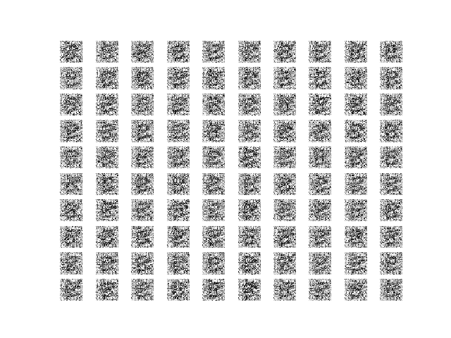
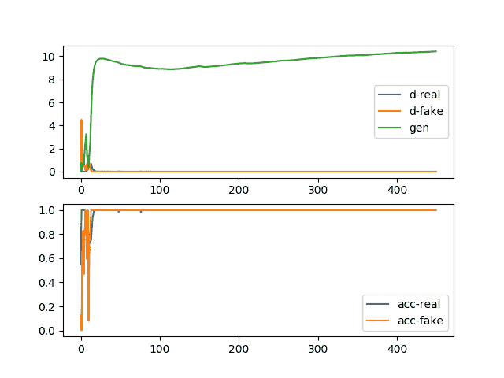

# 如何识别和诊断 GAN 故障模式

> 原文:[https://machinelearning master . com/实用-gan 指南-故障模式/](https://machinelearningmastery.com/practical-guide-to-gan-failure-modes/)

最后更新于 2021 年 1 月 21 日

#### 生成性对抗网络训练中如何识别不稳定模型？

[GANs](https://machinelearningmastery.com/generative-adversarial-network-loss-functions/) 很难训练。

它们难以训练的原因是生成器模型和鉴别器模型都是在零和博弈中同时训练的。这意味着一个模型的改进是以另一个模型为代价的。

训练两个模型的目标包括在两个相互竞争的关注点之间找到平衡点。

这也意味着，每次更新其中一个模型的参数时，正在解决的优化问题的性质都会发生变化。这具有创建动态系统的效果。用神经网络术语来说，同时训练两个竞争神经网络的技术挑战是它们可能无法收敛。

对于氮化镓模型的正常收敛和氮化镓模型的异常收敛(有时称为失效模式)，开发一种直觉是很重要的。

在本教程中，我们将首先为一个简单的图像生成任务开发一个稳定的 GAN 模型，以便建立正常收敛的样子和更普遍的期望。

然后，我们将以不同的方式削弱氮化镓模型，并探索您在训练氮化镓模型时可能遇到的一系列故障模式。这些场景将帮助你形成一种直觉，当一个 GAN 模型训练失败时，你应该寻找什么或者期待什么，以及你可以做什么的想法。

完成本教程后，您将知道:

*   如何从发生器和鉴别器随时间的损耗中识别稳定的 GAN 训练过程。
*   如何通过查看学习曲线和生成的图像来识别模式崩溃？
*   如何通过查看生成器和鉴别器损耗随时间的学习曲线来识别收敛失败。

**用我的新书[Python 生成性对抗网络](https://machinelearningmastery.com/generative_adversarial_networks/)启动你的项目**，包括*分步教程*和所有示例的 *Python 源代码*文件。

我们开始吧。

*   **2020 年 8 月更新**:在线图上修正标签。
*   **2021 年 1 月更新**:更新所以图层冻结用批量定额。
*   **2021 年 1 月更新**:简化模型架构，确保我们看到故障。


生成性对抗性网络故障模式实用指南
图片由[杰森·海夫纳](https://www.flickr.com/photos/58515256@N07/24791307810)提供，版权所有。

## 教程概述

本教程分为三个部分；它们是:

1.  如何识别稳定的生成性对抗网络
2.  如何识别生成性对抗网络中的模式崩溃
3.  如何识别生成性对抗网络中的收敛失败

## 如何培养稳定的生成性对抗网络

在本节中，我们将训练一个稳定的 GAN 来生成手写数字的图像。

具体来说，我们将使用 MNIST 手写数字数据集中的数字“8”。

这个模型的结果将建立一个稳定的氮化镓，可以用于以后的实验，以及一个轮廓什么产生的图像和学习曲线看起来像一个稳定的氮化镓训练过程。

第一步是定义模型。

鉴别器模型将一幅 28×28 灰度图像作为输入，并输出该图像是真实的(*类=1* )还是假的(*类=0* )的二进制预测。它被实现为一个适度的卷积神经网络，使用 GAN 设计的最佳实践，例如使用斜率为 0.2 的 [LeakyReLU 激活函数](https://machinelearningmastery.com/rectified-linear-activation-function-for-deep-learning-neural-networks/)、2×2 步距下采样以及学习率为 0.0002、动量为 0.5 的随机梯度下降的 [adam 版本](https://machinelearningmastery.com/adam-optimization-algorithm-for-deep-learning/)

下面的 *define_discriminator()* 函数实现了这一点，定义并编译鉴别器模型并返回。图像的输入形状被参数化为默认函数参数，以使其清晰。

```
# define the standalone discriminator model
def define_discriminator(in_shape=(28,28,1)):
	# weight initialization
	init = RandomNormal(stddev=0.02)
	# define model
	model = Sequential()
	# downsample to 14x14
	model.add(Conv2D(64, (4,4), strides=(2,2), padding='same', kernel_initializer=init, input_shape=in_shape))
	model.add(LeakyReLU(alpha=0.2))
	# downsample to 7x7
	model.add(Conv2D(64, (4,4), strides=(2,2), padding='same', kernel_initializer=init))
	model.add(LeakyReLU(alpha=0.2))
	# classifier
	model.add(Flatten())
	model.add(Dense(1, activation='sigmoid'))
	# compile model
	opt = Adam(lr=0.0002, beta_1=0.5)
	model.compile(loss='binary_crossentropy', optimizer=opt, metrics=['accuracy'])
	return model
```

生成器模型将潜在空间中的一个点作为输入，并输出单个 28×28 灰度图像。这是通过使用完全连接的层来解释潜在空间中的点并提供足够的激活来实现的，这些激活可以被重新成形为输出图像的低分辨率版本(例如 7×7)的许多副本(在这种情况下，128 个)。然后对其进行两次上采样，每次使用转置卷积层，将激活区域的大小增加一倍，面积增加四倍。该模型使用了最佳实践，例如 LeakyReLU 激活、作为步长因子的内核大小以及输出层中的双曲正切(tanh)激活函数。

下面的 *define_generator()* 函数定义了生成器模型，但由于没有直接训练，所以故意不编译，然后返回模型。潜在空间的大小被参数化为函数参数。

```
# define the standalone generator model
def define_generator(latent_dim):
	# weight initialization
	init = RandomNormal(stddev=0.02)
	# define model
	model = Sequential()
	# foundation for 7x7 image
	n_nodes = 128 * 7 * 7
	model.add(Dense(n_nodes, kernel_initializer=init, input_dim=latent_dim))
	model.add(LeakyReLU(alpha=0.2))
	model.add(Reshape((7, 7, 128)))
	# upsample to 14x14
	model.add(Conv2DTranspose(128, (4,4), strides=(2,2), padding='same', kernel_initializer=init))
	model.add(LeakyReLU(alpha=0.2))
	# upsample to 28x28
	model.add(Conv2DTranspose(128, (4,4), strides=(2,2), padding='same', kernel_initializer=init))
	model.add(LeakyReLU(alpha=0.2))
	# output 28x28x1
	model.add(Conv2D(1, (7,7), activation='tanh', padding='same', kernel_initializer=init))
	return model
```

接下来，可以定义一个 GAN 模型，它将生成器模型和鉴别器模型组合成一个更大的模型。这个更大的模型将被用于训练生成器中的模型权重，使用由鉴别器模型计算的输出和误差。鉴别器模型是单独训练的，因此，在这个更大的 GAN 模型中，模型权重被标记为不可训练，以确保只有生成器模型的权重被更新。鉴别器权重的可训练性的这种改变仅在训练组合的 GAN 模型时有效，而在单独训练鉴别器时无效。

这个更大的 GAN 模型将潜在空间中的一个点作为输入，使用生成器模型生成图像，该图像作为输入被馈送到鉴别器模型，然后输出或分类为真实或虚假。

下面的 *define_gan()* 函数实现了这一点，将已经定义的生成器和鉴别器模型作为输入。

```
# define the combined generator and discriminator model, for updating the generator
def define_gan(generator, discriminator):
	# make weights in the discriminator not trainable
	discriminator.trainable = False
	# connect them
	model = Sequential()
	# add generator
	model.add(generator)
	# add the discriminator
	model.add(discriminator)
	# compile model
	opt = Adam(lr=0.0002, beta_1=0.5)
	model.compile(loss='binary_crossentropy', optimizer=opt)
	return model
```

现在我们已经定义了 GAN 模型，我们需要对它进行训练。但是，在我们训练模型之前，我们需要输入数据。

第一步是加载和缩放 MNIST 数据集。通过调用 *load_data()* Keras 函数加载整个数据集，然后选择属于类别 8 的图像子集(约 5，000 个)，例如数字 8 的手写描述。然后，像素值必须缩放到范围[-1，1]以匹配生成器模型的输出。

下面的 *load_real_samples()* 函数实现了这一点，返回 MNIST 训练数据集的加载和缩放子集，为建模做好准备。

```
# load mnist images
def load_real_samples():
	# load dataset
	(trainX, trainy), (_, _) = load_data()
	# expand to 3d, e.g. add channels
	X = expand_dims(trainX, axis=-1)
	# select all of the examples for a given class
	selected_ix = trainy == 8
	X = X[selected_ix]
	# convert from ints to floats
	X = X.astype('float32')
	# scale from [0,255] to [-1,1]
	X = (X - 127.5) / 127.5
	return X
```

我们将需要数据集的一批(或半批)真实图像来更新 GAN 模型。实现这一点的简单方法是每次从数据集中随机选择一个图像样本。

下面的 *generate_real_samples()* 函数实现了这一点，以准备好的数据集为自变量，选择并返回一个人脸图像的随机样本，以及它们对应的类别标签给鉴别器，具体为 class=1 表示它们是真实图像。

```
# select real samples
def generate_real_samples(dataset, n_samples):
	# choose random instances
	ix = randint(0, dataset.shape[0], n_samples)
	# select images
	X = dataset[ix]
	# generate class labels
	y = ones((n_samples, 1))
	return X, y
```

接下来，我们需要发电机模型的输入。这些是来自潜在空间的随机点，具体为[高斯分布随机变量](https://machinelearningmastery.com/how-to-generate-random-numbers-in-python/)。

*generate _ 潜伏 _points()* 函数实现了这一点，将潜伏空间的大小作为自变量和所需的点数，作为生成器模型的一批输入样本返回。

```
# generate points in latent space as input for the generator
def generate_latent_points(latent_dim, n_samples):
	# generate points in the latent space
	x_input = randn(latent_dim * n_samples)
	# reshape into a batch of inputs for the network
	x_input = x_input.reshape(n_samples, latent_dim)
	return x_input
```

接下来，我们需要使用潜在空间中的点作为生成器的输入，以便生成新的图像。

下面的 *generate_fake_samples()* 函数实现了这一点，将生成器模型和潜在空间的大小作为参数，然后在潜在空间中生成点，并将其用作生成器模型的输入。该函数为鉴别器模型返回生成的图像及其对应的类标签，具体来说，class=0 表示它们是伪造的或生成的。

```
# use the generator to generate n fake examples, with class labels
def generate_fake_samples(generator, latent_dim, n_samples):
	# generate points in latent space
	x_input = generate_latent_points(latent_dim, n_samples)
	# predict outputs
	X = generator.predict(x_input)
	# create class labels
	y = zeros((n_samples, 1))
	return X, y
```

我们需要记录模型的性能。评估 GAN 性能最可靠的方法可能是使用生成器生成图像，然后对其进行审查和主观评估。

下面的*summary _ performance()*函数在训练过程中获取给定点的生成器模型，并使用它在 10×10 的网格中生成 100 个图像，然后绘制并保存到文件中。这个模型现在也保存到文件中，以防我们以后想用它来生成更多的图像。

```
# generate samples and save as a plot and save the model
def summarize_performance(step, g_model, latent_dim, n_samples=100):
	# prepare fake examples
	X, _ = generate_fake_samples(g_model, latent_dim, n_samples)
	# scale from [-1,1] to [0,1]
	X = (X + 1) / 2.0
	# plot images
	for i in range(10 * 10):
		# define subplot
		pyplot.subplot(10, 10, 1 + i)
		# turn off axis
		pyplot.axis('off')
		# plot raw pixel data
		pyplot.imshow(X[i, :, :, 0], cmap='gray_r')
	# save plot to file
	pyplot.savefig('results_baseline/generated_plot_%03d.png' % (step+1))
	pyplot.close()
	# save the generator model
	g_model.save('results_baseline/model_%03d.h5' % (step+1))
```

除了图像质量，跟踪模型随时间的损失和准确性也是一个好主意。

对于每个模型更新，可以跟踪真假样本鉴别器的损失和分类精度，对于每个更新，生成器的损失也是如此。然后，这些可以用于在训练结束时创建损耗和精度的线图。

下面的 *plot_history()* 函数实现了这一点，并将结果保存到文件中。

```
# create a line plot of loss for the gan and save to file
def plot_history(d1_hist, d2_hist, g_hist, a1_hist, a2_hist):
	# plot loss
	pyplot.subplot(2, 1, 1)
	pyplot.plot(d1_hist, label='d-real')
	pyplot.plot(d2_hist, label='d-fake')
	pyplot.plot(g_hist, label='gen')
	pyplot.legend()
	# plot discriminator accuracy
	pyplot.subplot(2, 1, 2)
	pyplot.plot(a1_hist, label='acc-real')
	pyplot.plot(a2_hist, label='acc-fake')
	pyplot.legend()
	# save plot to file
	pyplot.savefig('results_baseline/plot_line_plot_loss.png')
	pyplot.close()
```

我们现在已经准备好适应氮化镓模型。

该模型适用于 10 个训练时期，这是任意的，因为该模型可能在最初的几个时期之后开始生成似是而非的数字 8。使用 128 个样本的批次大小，并且每个训练时期涉及 5，851/128 或大约 45 批次的真实和虚假样本以及对模型的更新。因此，模型被训练了 45 个批次的 10 个时期，或 450 次迭代。

首先对半批真实样本更新鉴别器模型，然后对半批伪样本更新鉴别器模型，共同形成一批权重更新。然后通过复合氮化镓模型更新发生器。重要的是，对于假样本，类标签被设置为 1 或真。这具有更新生成器以更好地生成下一批真实样本的效果。

下面的 *train()* 函数实现了这一点，将定义的模型、数据集和潜在维度的大小作为参数，并使用默认参数参数化纪元的数量和批处理大小。发电机模型在训练结束时保存。

每次迭代都报告鉴别器和生成器模型的性能。样本图像在每个时期生成并保存，模型性能的线图在运行结束时创建并保存。

```
# train the generator and discriminator
def train(g_model, d_model, gan_model, dataset, latent_dim, n_epochs=10, n_batch=128):
	# calculate the number of batches per epoch
	bat_per_epo = int(dataset.shape[0] / n_batch)
	# calculate the total iterations based on batch and epoch
	n_steps = bat_per_epo * n_epochs
	# calculate the number of samples in half a batch
	half_batch = int(n_batch / 2)
	# prepare lists for storing stats each iteration
	d1_hist, d2_hist, g_hist, a1_hist, a2_hist = list(), list(), list(), list(), list()
	# manually enumerate epochs
	for i in range(n_steps):
		# get randomly selected 'real' samples
		X_real, y_real = generate_real_samples(dataset, half_batch)
		# update discriminator model weights
		d_loss1, d_acc1 = d_model.train_on_batch(X_real, y_real)
		# generate 'fake' examples
		X_fake, y_fake = generate_fake_samples(g_model, latent_dim, half_batch)
		# update discriminator model weights
		d_loss2, d_acc2 = d_model.train_on_batch(X_fake, y_fake)
		# prepare points in latent space as input for the generator
		X_gan = generate_latent_points(latent_dim, n_batch)
		# create inverted labels for the fake samples
		y_gan = ones((n_batch, 1))
		# update the generator via the discriminator's error
		g_loss = gan_model.train_on_batch(X_gan, y_gan)
		# summarize loss on this batch
		print('>%d, d1=%.3f, d2=%.3f g=%.3f, a1=%d, a2=%d' %
			(i+1, d_loss1, d_loss2, g_loss, int(100*d_acc1), int(100*d_acc2)))
		# record history
		d1_hist.append(d_loss1)
		d2_hist.append(d_loss2)
		g_hist.append(g_loss)
		a1_hist.append(d_acc1)
		a2_hist.append(d_acc2)
		# evaluate the model performance every 'epoch'
		if (i+1) % bat_per_epo == 0:
			summarize_performance(i, g_model, latent_dim)
	plot_history(d1_hist, d2_hist, g_hist, a1_hist, a2_hist)
```

既然已经定义了所有的函数，我们可以创建存储图像和模型的目录(在本例中为“ *results_baseline* ”)，创建模型，加载数据集，并开始训练过程。

```
# make folder for results
makedirs('results_baseline', exist_ok=True)
# size of the latent space
latent_dim = 50
# create the discriminator
discriminator = define_discriminator()
# create the generator
generator = define_generator(latent_dim)
# create the gan
gan_model = define_gan(generator, discriminator)
# load image data
dataset = load_real_samples()
print(dataset.shape)
# train model
train(generator, discriminator, gan_model, dataset, latent_dim)
```

将所有这些结合在一起，下面列出了完整的示例。

```
# example of training a stable gan for generating a handwritten digit
from os import makedirs
from numpy import expand_dims
from numpy import zeros
from numpy import ones
from numpy.random import randn
from numpy.random import randint
from keras.datasets.mnist import load_data
from keras.optimizers import Adam
from keras.models import Sequential
from keras.layers import Dense
from keras.layers import Reshape
from keras.layers import Flatten
from keras.layers import Conv2D
from keras.layers import Conv2DTranspose
from keras.layers import LeakyReLU
from keras.initializers import RandomNormal
from matplotlib import pyplot

# define the standalone discriminator model
def define_discriminator(in_shape=(28,28,1)):
	# weight initialization
	init = RandomNormal(stddev=0.02)
	# define model
	model = Sequential()
	# downsample to 14x14
	model.add(Conv2D(64, (4,4), strides=(2,2), padding='same', kernel_initializer=init, input_shape=in_shape))
	model.add(LeakyReLU(alpha=0.2))
	# downsample to 7x7
	model.add(Conv2D(64, (4,4), strides=(2,2), padding='same', kernel_initializer=init))
	model.add(LeakyReLU(alpha=0.2))
	# classifier
	model.add(Flatten())
	model.add(Dense(1, activation='sigmoid'))
	# compile model
	opt = Adam(lr=0.0002, beta_1=0.5)
	model.compile(loss='binary_crossentropy', optimizer=opt, metrics=['accuracy'])
	return model

# define the standalone generator model
def define_generator(latent_dim):
	# weight initialization
	init = RandomNormal(stddev=0.02)
	# define model
	model = Sequential()
	# foundation for 7x7 image
	n_nodes = 128 * 7 * 7
	model.add(Dense(n_nodes, kernel_initializer=init, input_dim=latent_dim))
	model.add(LeakyReLU(alpha=0.2))
	model.add(Reshape((7, 7, 128)))
	# upsample to 14x14
	model.add(Conv2DTranspose(128, (4,4), strides=(2,2), padding='same', kernel_initializer=init))
	model.add(LeakyReLU(alpha=0.2))
	# upsample to 28x28
	model.add(Conv2DTranspose(128, (4,4), strides=(2,2), padding='same', kernel_initializer=init))
	model.add(LeakyReLU(alpha=0.2))
	# output 28x28x1
	model.add(Conv2D(1, (7,7), activation='tanh', padding='same', kernel_initializer=init))
	return model

# define the combined generator and discriminator model, for updating the generator
def define_gan(generator, discriminator):
	# make weights in the discriminator not trainable
	discriminator.trainable = False
	# connect them
	model = Sequential()
	# add generator
	model.add(generator)
	# add the discriminator
	model.add(discriminator)
	# compile model
	opt = Adam(lr=0.0002, beta_1=0.5)
	model.compile(loss='binary_crossentropy', optimizer=opt)
	return model

# load mnist images
def load_real_samples():
	# load dataset
	(trainX, trainy), (_, _) = load_data()
	# expand to 3d, e.g. add channels
	X = expand_dims(trainX, axis=-1)
	# select all of the examples for a given class
	selected_ix = trainy == 8
	X = X[selected_ix]
	# convert from ints to floats
	X = X.astype('float32')
	# scale from [0,255] to [-1,1]
	X = (X - 127.5) / 127.5
	return X

# select real samples
def generate_real_samples(dataset, n_samples):
	# choose random instances
	ix = randint(0, dataset.shape[0], n_samples)
	# select images
	X = dataset[ix]
	# generate class labels
	y = ones((n_samples, 1))
	return X, y

# generate points in latent space as input for the generator
def generate_latent_points(latent_dim, n_samples):
	# generate points in the latent space
	x_input = randn(latent_dim * n_samples)
	# reshape into a batch of inputs for the network
	x_input = x_input.reshape(n_samples, latent_dim)
	return x_input

# use the generator to generate n fake examples, with class labels
def generate_fake_samples(generator, latent_dim, n_samples):
	# generate points in latent space
	x_input = generate_latent_points(latent_dim, n_samples)
	# predict outputs
	X = generator.predict(x_input)
	# create class labels
	y = zeros((n_samples, 1))
	return X, y

# generate samples and save as a plot and save the model
def summarize_performance(step, g_model, latent_dim, n_samples=100):
	# prepare fake examples
	X, _ = generate_fake_samples(g_model, latent_dim, n_samples)
	# scale from [-1,1] to [0,1]
	X = (X + 1) / 2.0
	# plot images
	for i in range(10 * 10):
		# define subplot
		pyplot.subplot(10, 10, 1 + i)
		# turn off axis
		pyplot.axis('off')
		# plot raw pixel data
		pyplot.imshow(X[i, :, :, 0], cmap='gray_r')
	# save plot to file
	pyplot.savefig('results_baseline/generated_plot_%03d.png' % (step+1))
	pyplot.close()
	# save the generator model
	g_model.save('results_baseline/model_%03d.h5' % (step+1))

# create a line plot of loss for the gan and save to file
def plot_history(d1_hist, d2_hist, g_hist, a1_hist, a2_hist):
	# plot loss
	pyplot.subplot(2, 1, 1)
	pyplot.plot(d1_hist, label='d-real')
	pyplot.plot(d2_hist, label='d-fake')
	pyplot.plot(g_hist, label='gen')
	pyplot.legend()
	# plot discriminator accuracy
	pyplot.subplot(2, 1, 2)
	pyplot.plot(a1_hist, label='acc-real')
	pyplot.plot(a2_hist, label='acc-fake')
	pyplot.legend()
	# save plot to file
	pyplot.savefig('results_baseline/plot_line_plot_loss.png')
	pyplot.close()

# train the generator and discriminator
def train(g_model, d_model, gan_model, dataset, latent_dim, n_epochs=10, n_batch=128):
	# calculate the number of batches per epoch
	bat_per_epo = int(dataset.shape[0] / n_batch)
	# calculate the total iterations based on batch and epoch
	n_steps = bat_per_epo * n_epochs
	# calculate the number of samples in half a batch
	half_batch = int(n_batch / 2)
	# prepare lists for storing stats each iteration
	d1_hist, d2_hist, g_hist, a1_hist, a2_hist = list(), list(), list(), list(), list()
	# manually enumerate epochs
	for i in range(n_steps):
		# get randomly selected 'real' samples
		X_real, y_real = generate_real_samples(dataset, half_batch)
		# update discriminator model weights
		d_loss1, d_acc1 = d_model.train_on_batch(X_real, y_real)
		# generate 'fake' examples
		X_fake, y_fake = generate_fake_samples(g_model, latent_dim, half_batch)
		# update discriminator model weights
		d_loss2, d_acc2 = d_model.train_on_batch(X_fake, y_fake)
		# prepare points in latent space as input for the generator
		X_gan = generate_latent_points(latent_dim, n_batch)
		# create inverted labels for the fake samples
		y_gan = ones((n_batch, 1))
		# update the generator via the discriminator's error
		g_loss = gan_model.train_on_batch(X_gan, y_gan)
		# summarize loss on this batch
		print('>%d, d1=%.3f, d2=%.3f g=%.3f, a1=%d, a2=%d' %
			(i+1, d_loss1, d_loss2, g_loss, int(100*d_acc1), int(100*d_acc2)))
		# record history
		d1_hist.append(d_loss1)
		d2_hist.append(d_loss2)
		g_hist.append(g_loss)
		a1_hist.append(d_acc1)
		a2_hist.append(d_acc2)
		# evaluate the model performance every 'epoch'
		if (i+1) % bat_per_epo == 0:
			summarize_performance(i, g_model, latent_dim)
	plot_history(d1_hist, d2_hist, g_hist, a1_hist, a2_hist)

# make folder for results
makedirs('results_baseline', exist_ok=True)
# size of the latent space
latent_dim = 50
# create the discriminator
discriminator = define_discriminator()
# create the generator
generator = define_generator(latent_dim)
# create the gan
gan_model = define_gan(generator, discriminator)
# load image data
dataset = load_real_samples()
print(dataset.shape)
# train model
train(generator, discriminator, gan_model, dataset, latent_dim)
```

运行这个例子很快，在没有图形处理器的现代硬件上大约需要 10 分钟。

鉴于学习算法的随机性，您的具体结果会有所不同。尽管如此，培训的总体结构应该非常相似。

首先，在训练循环的每次迭代中，都会向控制台报告鉴别器的损失和准确性以及生成器模型的损失。

这很重要。稳定的氮化镓的鉴别器损耗约为 0.5，通常在 0.5 到 0.7 或 0.8 之间。发电机损耗通常较高，可能在 1.0、1.5、2.0 左右徘徊，甚至更高。

鉴别器在真实和生成(假)图像上的准确度不会是 50%，但通常应该在 70%到 80%之间徘徊。

对于鉴别器和发生器来说，在模型收敛到一个稳定的平衡之前，行为很可能开始不稳定并移动很多。

```
>1, d1=0.859, d2=0.664 g=0.872, a1=37, a2=59
>2, d1=0.190, d2=1.429 g=0.555, a1=100, a2=10
>3, d1=0.094, d2=1.467 g=0.597, a1=100, a2=4
>4, d1=0.097, d2=1.315 g=0.686, a1=100, a2=9
>5, d1=0.100, d2=1.241 g=0.714, a1=100, a2=9
...
>446, d1=0.593, d2=0.546 g=1.330, a1=76, a2=82
>447, d1=0.551, d2=0.739 g=0.981, a1=82, a2=39
>448, d1=0.628, d2=0.505 g=1.420, a1=79, a2=89
>449, d1=0.641, d2=0.533 g=1.381, a1=60, a2=85
>450, d1=0.550, d2=0.731 g=1.100, a1=76, a2=42
```

在运行结束时，创建并保存损耗和精度的线图。

该图包含两个支线剧情。顶部子图显示了真实图像的鉴别器损耗(蓝色)、生成的假图像的鉴别器损耗(橙色)和生成的假图像的发生器损耗(绿色)的线图。

我们可以看到，在 100 到 300 点稳定之前，这三次损失在早期都有些不稳定。此后亏损保持稳定，尽管方差增加。

这是训练中正常或预期损失的一个例子。也就是说，真样本和假样本的鉴别器损耗在 0.5 左右大致相同，发生器的损耗在 0.5 和 2.0 之间略高。如果生成器模型能够生成似是而非的图像，那么预期这些图像将在 100 到 300 个时代之间生成，并且也可能在 300 到 450 个时代之间生成。

底部子图显示了训练期间真实(蓝色)和假(橙色)图像上鉴别器准确度的线图。我们看到一个类似的结构作为损失的子图，即两种图像类型之间的精度开始时非常不同，然后在 100 到 300 个时期之间稳定在大约 70%到 80%，并且在此之后保持稳定，尽管方差增加。

这些模式和绝对值的时间尺度(例如迭代次数或训练时期)将因 GAN 模型的问题和类型而异，尽管该图为训练稳定的 GAN 模型时的预期提供了良好的基线。



稳定生成对抗网络的损失和精度线图

最后，我们可以查看生成图像的样本。注意:我们使用反向灰度色图生成图像，这意味着背景上的正常白色图形被反转为白色背景上的黑色图形。这样做是为了使生成的数字更容易查看。

正如我们所料，纪元 100 之前生成的图像样本质量相对较差。



来自稳定 GAN 的 100 个手写数字 8 在纪元 45 的生成图像样本。

在 100 到 300 个时代之间产生的图像样本是可信的，也许是最好的质量。



来自稳定 GAN 的 100 个手写数字 8 在纪元 180 的生成图像样本。

并且在时期 300 之后生成的图像的样本仍然是可信的，尽管可能具有更多的噪声，例如背景噪声。



来自稳定 GAN 的 100 个手写数字 8 在纪元 450 的生成图像样本。

这些结果很重要，因为它强调了即使在训练过程变得稳定之后，所产生的质量也可以并且确实在整个过程中变化。

超过某个训练稳定性点的更多训练迭代可能会也可能不会产生更高质量的图像。

对于稳定的 GAN 训练，我们可以将这些观察总结如下:

*   真假图像的鉴别器损失预计在 0.5 左右。
*   假图像的发电机损耗预计在 0.5 到 2.0 之间。
*   真假图像的鉴别准确率预计在 80%左右。
*   发生器和鉴别器损耗的变化预计保持适度。
*   该发生器有望在稳定期间产生最高质量的图像。
*   训练稳定性可能退化为高方差损失期和相应的低质量生成图像。

现在我们有了一个稳定的 GAN 模型，我们可以考虑修改它来产生一些特定的故障案例。

在新问题上训练 GAN 模型时，有两个常见的失败案例；它们是模式崩溃和收敛失败。

## 如何识别生成性对抗网络中的模式崩溃

模式崩溃指的是一个生成器模型，它只能生成一个或一小部分不同的结果或模式。

这里，模式指的是输出分布，例如，多模式函数指的是具有多于一个峰值或最优值的函数。对于 GAN 生成器模型，模式失败意味着输入潜在空间中的大量点(例如，在许多情况下为 100 维的超球)导致生成图像的一个或一个小子集。

> 模式崩溃，也称为场景，是发生在生成器学习将几个不同的输入 z 值映射到同一个输出点时的问题。

——[NIPS 2016 教程:生成性对抗网络](https://arxiv.org/abs/1701.00160)，2016。

查看生成图像的大样本时，可以识别模式崩溃。图像将表现出低多样性，相同的图像或相同图像的相同小子集重复多次。

也可以通过查看模型损失的线图来识别模式崩溃。线图将显示损耗随时间的振荡，尤其是在发电机模型中，因为发电机模型被更新，并从一个发电模式跳到另一个具有不同损耗的模型。

我们可以通过多种方式削弱我们稳定的氮化镓，使其遭受模式崩溃。也许最可靠的方法是直接限制潜在维度的大小，迫使模型只生成看似合理的输出的一小部分。

具体来说，‘*潜伏 _ dim*’变量可以从 100 变为 1，实验重新运行。

```
# size of the latent space
latent_dim = 1
```

为了完整起见，下面提供了完整的代码列表。

```
# example of training an unstable gan for generating a handwritten digit
from os import makedirs
from numpy import expand_dims
from numpy import zeros
from numpy import ones
from numpy.random import randn
from numpy.random import randint
from keras.datasets.mnist import load_data
from keras.optimizers import Adam
from keras.models import Sequential
from keras.layers import Dense
from keras.layers import Reshape
from keras.layers import Flatten
from keras.layers import Conv2D
from keras.layers import Conv2DTranspose
from keras.layers import LeakyReLU
from keras.initializers import RandomNormal
from matplotlib import pyplot

# define the standalone discriminator model
def define_discriminator(in_shape=(28,28,1)):
	# weight initialization
	init = RandomNormal(stddev=0.02)
	# define model
	model = Sequential()
	# downsample to 14x14
	model.add(Conv2D(64, (4,4), strides=(2,2), padding='same', kernel_initializer=init, input_shape=in_shape))
	model.add(LeakyReLU(alpha=0.2))
	# downsample to 7x7
	model.add(Conv2D(64, (4,4), strides=(2,2), padding='same', kernel_initializer=init))
	model.add(LeakyReLU(alpha=0.2))
	# classifier
	model.add(Flatten())
	model.add(Dense(1, activation='sigmoid'))
	# compile model
	opt = Adam(lr=0.0002, beta_1=0.5)
	model.compile(loss='binary_crossentropy', optimizer=opt, metrics=['accuracy'])
	return model

# define the standalone generator model
def define_generator(latent_dim):
	# weight initialization
	init = RandomNormal(stddev=0.02)
	# define model
	model = Sequential()
	# foundation for 7x7 image
	n_nodes = 128 * 7 * 7
	model.add(Dense(n_nodes, kernel_initializer=init, input_dim=latent_dim))
	model.add(LeakyReLU(alpha=0.2))
	model.add(Reshape((7, 7, 128)))
	# upsample to 14x14
	model.add(Conv2DTranspose(128, (4,4), strides=(2,2), padding='same', kernel_initializer=init))
	model.add(LeakyReLU(alpha=0.2))
	# upsample to 28x28
	model.add(Conv2DTranspose(128, (4,4), strides=(2,2), padding='same', kernel_initializer=init))
	model.add(LeakyReLU(alpha=0.2))
	# output 28x28x1
	model.add(Conv2D(1, (7,7), activation='tanh', padding='same', kernel_initializer=init))
	return model

# define the combined generator and discriminator model, for updating the generator
def define_gan(generator, discriminator):
	# make weights in the discriminator not trainable
	discriminator.trainable = False
	# connect them
	model = Sequential()
	# add generator
	model.add(generator)
	# add the discriminator
	model.add(discriminator)
	# compile model
	opt = Adam(lr=0.0002, beta_1=0.5)
	model.compile(loss='binary_crossentropy', optimizer=opt)
	return model

# load mnist images
def load_real_samples():
	# load dataset
	(trainX, trainy), (_, _) = load_data()
	# expand to 3d, e.g. add channels
	X = expand_dims(trainX, axis=-1)
	# select all of the examples for a given class
	selected_ix = trainy == 8
	X = X[selected_ix]
	# convert from ints to floats
	X = X.astype('float32')
	# scale from [0,255] to [-1,1]
	X = (X - 127.5) / 127.5
	return X

# # select real samples
def generate_real_samples(dataset, n_samples):
	# choose random instances
	ix = randint(0, dataset.shape[0], n_samples)
	# select images
	X = dataset[ix]
	# generate class labels
	y = ones((n_samples, 1))
	return X, y

# generate points in latent space as input for the generator
def generate_latent_points(latent_dim, n_samples):
	# generate points in the latent space
	x_input = randn(latent_dim * n_samples)
	# reshape into a batch of inputs for the network
	x_input = x_input.reshape(n_samples, latent_dim)
	return x_input

# use the generator to generate n fake examples, with class labels
def generate_fake_samples(generator, latent_dim, n_samples):
	# generate points in latent space
	x_input = generate_latent_points(latent_dim, n_samples)
	# predict outputs
	X = generator.predict(x_input)
	# create class labels
	y = zeros((n_samples, 1))
	return X, y

# generate samples and save as a plot and save the model
def summarize_performance(step, g_model, latent_dim, n_samples=100):
	# prepare fake examples
	X, _ = generate_fake_samples(g_model, latent_dim, n_samples)
	# scale from [-1,1] to [0,1]
	X = (X + 1) / 2.0
	# plot images
	for i in range(10 * 10):
		# define subplot
		pyplot.subplot(10, 10, 1 + i)
		# turn off axis
		pyplot.axis('off')
		# plot raw pixel data
		pyplot.imshow(X[i, :, :, 0], cmap='gray_r')
	# save plot to file
	pyplot.savefig('results_collapse/generated_plot_%03d.png' % (step+1))
	pyplot.close()
	# save the generator model
	g_model.save('results_collapse/model_%03d.h5' % (step+1))

# create a line plot of loss for the gan and save to file
def plot_history(d1_hist, d2_hist, g_hist, a1_hist, a2_hist):
	# plot loss
	pyplot.subplot(2, 1, 1)
	pyplot.plot(d1_hist, label='d-real')
	pyplot.plot(d2_hist, label='d-fake')
	pyplot.plot(g_hist, label='gen')
	pyplot.legend()
	# plot discriminator accuracy
	pyplot.subplot(2, 1, 2)
	pyplot.plot(a1_hist, label='acc-real')
	pyplot.plot(a2_hist, label='acc-fake')
	pyplot.legend()
	# save plot to file
	pyplot.savefig('results_collapse/plot_line_plot_loss.png')
	pyplot.close()

# train the generator and discriminator
def train(g_model, d_model, gan_model, dataset, latent_dim, n_epochs=10, n_batch=128):
	# calculate the number of batches per epoch
	bat_per_epo = int(dataset.shape[0] / n_batch)
	# calculate the total iterations based on batch and epoch
	n_steps = bat_per_epo * n_epochs
	# calculate the number of samples in half a batch
	half_batch = int(n_batch / 2)
	# prepare lists for storing stats each iteration
	d1_hist, d2_hist, g_hist, a1_hist, a2_hist = list(), list(), list(), list(), list()
	# manually enumerate epochs
	for i in range(n_steps):
		# get randomly selected 'real' samples
		X_real, y_real = generate_real_samples(dataset, half_batch)
		# update discriminator model weights
		d_loss1, d_acc1 = d_model.train_on_batch(X_real, y_real)
		# generate 'fake' examples
		X_fake, y_fake = generate_fake_samples(g_model, latent_dim, half_batch)
		# update discriminator model weights
		d_loss2, d_acc2 = d_model.train_on_batch(X_fake, y_fake)
		# prepare points in latent space as input for the generator
		X_gan = generate_latent_points(latent_dim, n_batch)
		# create inverted labels for the fake samples
		y_gan = ones((n_batch, 1))
		# update the generator via the discriminator's error
		g_loss = gan_model.train_on_batch(X_gan, y_gan)
		# summarize loss on this batch
		print('>%d, d1=%.3f, d2=%.3f g=%.3f, a1=%d, a2=%d' %
			(i+1, d_loss1, d_loss2, g_loss, int(100*d_acc1), int(100*d_acc2)))
		# record history
		d1_hist.append(d_loss1)
		d2_hist.append(d_loss2)
		g_hist.append(g_loss)
		a1_hist.append(d_acc1)
		a2_hist.append(d_acc2)
		# evaluate the model performance every 'epoch'
		if (i+1) % bat_per_epo == 0:
			summarize_performance(i, g_model, latent_dim)
	plot_history(d1_hist, d2_hist, g_hist, a1_hist, a2_hist)

# make folder for results
makedirs('results_collapse', exist_ok=True)
# size of the latent space
latent_dim = 1
# create the discriminator
discriminator = define_discriminator()
# create the generator
generator = define_generator(latent_dim)
# create the gan
gan_model = define_gan(generator, discriminator)
# load image data
dataset = load_real_samples()
print(dataset.shape)
# train model
train(generator, discriminator, gan_model, dataset, latent_dim)
```

运行该示例将报告每一步训练的损失和准确性，就像以前一样。

在这种情况下，鉴频器的损耗位于一个合理的范围内，尽管发生器的损耗会上下跳动。鉴别器的准确度也显示出更高的值，许多值在 100%左右，这意味着对于许多批次，它在识别真实或虚假例子方面具有完美的技能，这是图像质量或多样性的一个不好的迹象。

```
>1, d1=0.963, d2=0.699 g=0.614, a1=28, a2=54
>2, d1=0.185, d2=5.084 g=0.097, a1=96, a2=0
>3, d1=0.088, d2=4.861 g=0.065, a1=100, a2=0
>4, d1=0.077, d2=4.202 g=0.090, a1=100, a2=0
>5, d1=0.062, d2=3.533 g=0.128, a1=100, a2=0
...
>446, d1=0.277, d2=0.261 g=0.684, a1=95, a2=100
>447, d1=0.201, d2=0.247 g=0.713, a1=96, a2=100
>448, d1=0.285, d2=0.285 g=0.728, a1=89, a2=100
>449, d1=0.351, d2=0.467 g=1.184, a1=92, a2=81
>450, d1=0.492, d2=0.388 g=1.351, a1=76, a2=100
```

创建并保存带有学习曲线和精度线图的图形。

在顶部的子图中，我们可以看到发电机(绿色)的损耗随着时间从可感知值振荡到高值，大约有 25 次模型更新(批次)。我们还可以在真样本和假样本(橙色和蓝色)上看到鉴别器损耗的一些小振荡。

在底部的子图中，我们可以看到鉴别器识别假图像的分类精度在整个运行过程中保持很高。这表明生成器在以某种一致的方式生成示例方面很差，这使得鉴别器很容易识别假图像。



具有模式崩溃的生成对抗网络的损失和精度线图

查看生成的图像显示了模式崩溃的预期特征，即许多相同的生成示例，而不考虑潜在空间中的输入点。碰巧的是，我们把潜在空间的维度改变得非常小，以至于产生了这种效果。

我选择了一个生成图像的例子来帮助弄清楚这一点。图像中似乎只有几种 8 字形，一种向左倾斜，一种向右倾斜，还有一种模糊地坐起来。

我已经围绕下图中的一些类似示例绘制了方框，以使其更加清晰。



100 张手写数字 8 在 315 时代的图像样本，来自遭受模式崩溃的 GAN。

根据 DCGAN 模型架构和训练配置的发现，模式崩溃在训练期间不太常见。

总之，您可以按如下方式识别模式折叠:

*   发生器的损耗，可能还有鉴别器的损耗，预计会随时间振荡。
*   生成器模型被期望从潜在空间中的不同点生成相同的输出图像。

## 如何识别生成性对抗网络中的收敛失败

也许训练 GAN 最常见的失败是无法收敛。

典型地，当模型损失在训练过程中没有稳定下来时，神经网络不能收敛。在氮化镓的情况下，无法收敛是指在鉴别器和发生器之间找不到平衡。

您识别这种故障的可能方式是鉴别器的损耗已经变为零或接近于零。在某些情况下，发电机的损耗也可能上升，并在同一时期继续上升。

这种类型的丢失最常见的原因是生成器输出垃圾图像，鉴别器可以很容易地识别出来。

这种失败可能发生在跑步开始时，并在整个训练过程中持续，此时您应该停止训练过程。对于一些不稳定的 GAN，GAN 可能会因为多次批量更新，甚至多次时代更新而陷入这种故障模式，然后恢复。

有很多方法可以削弱我们稳定的 GAN 来实现收敛失败，例如将一个或两个模型更改为容量不足，将 [Adam 优化算法](https://machinelearningmastery.com/adam-optimization-algorithm-for-deep-learning/)更改为过于激进，以及在模型中使用非常大或非常小的内核大小。

在这种情况下，我们将更新示例，以便在更新鉴别器时结合真实和虚假样本。这个简单的改变会导致模型无法收敛。

这个变化很简单，使用 [vstack() NumPy 函数](https://docs.scipy.org/doc/numpy/reference/generated/numpy.vstack.html)将真假样本结合，然后调用 *train_on_batch()* 函数更新鉴别器模型。结果也是单一的损失和准确性分数，这意味着模型性能的报告也必须更新。

为了完整起见，下面提供了包含这些更改的完整代码列表。

```
# example of training an unstable gan for generating a handwritten digit
from os import makedirs
from numpy import expand_dims
from numpy import zeros
from numpy import ones
from numpy import vstack
from numpy.random import randn
from numpy.random import randint
from keras.datasets.mnist import load_data
from keras.optimizers import Adam
from keras.models import Sequential
from keras.layers import Dense
from keras.layers import Reshape
from keras.layers import Flatten
from keras.layers import Conv2D
from keras.layers import Conv2DTranspose
from keras.layers import LeakyReLU
from keras.initializers import RandomNormal
from matplotlib import pyplot

# define the standalone discriminator model
def define_discriminator(in_shape=(28,28,1)):
	# weight initialization
	init = RandomNormal(stddev=0.02)
	# define model
	model = Sequential()
	# downsample to 14x14
	model.add(Conv2D(64, (4,4), strides=(2,2), padding='same', kernel_initializer=init, input_shape=in_shape))
	model.add(LeakyReLU(alpha=0.2))
	# downsample to 7x7
	model.add(Conv2D(64, (4,4), strides=(2,2), padding='same', kernel_initializer=init))
	model.add(LeakyReLU(alpha=0.2))
	# classifier
	model.add(Flatten())
	model.add(Dense(1, activation='sigmoid'))
	# compile model
	opt = Adam(lr=0.0002, beta_1=0.5)
	model.compile(loss='binary_crossentropy', optimizer=opt, metrics=['accuracy'])
	return model

# define the standalone generator model
def define_generator(latent_dim):
	# weight initialization
	init = RandomNormal(stddev=0.02)
	# define model
	model = Sequential()
	# foundation for 7x7 image
	n_nodes = 128 * 7 * 7
	model.add(Dense(n_nodes, kernel_initializer=init, input_dim=latent_dim))
	model.add(LeakyReLU(alpha=0.2))
	model.add(Reshape((7, 7, 128)))
	# upsample to 14x14
	model.add(Conv2DTranspose(128, (4,4), strides=(2,2), padding='same', kernel_initializer=init))
	model.add(LeakyReLU(alpha=0.2))
	# upsample to 28x28
	model.add(Conv2DTranspose(128, (4,4), strides=(2,2), padding='same', kernel_initializer=init))
	model.add(LeakyReLU(alpha=0.2))
	# output 28x28x1
	model.add(Conv2D(1, (7,7), activation='tanh', padding='same', kernel_initializer=init))
	return model

# define the combined generator and discriminator model, for updating the generator
def define_gan(generator, discriminator):
	# make weights in the discriminator not trainable
	discriminator.trainable = False
	# connect them
	model = Sequential()
	# add generator
	model.add(generator)
	# add the discriminator
	model.add(discriminator)
	# compile model
	opt = Adam(lr=0.0002, beta_1=0.5)
	model.compile(loss='binary_crossentropy', optimizer=opt)
	return model

# load mnist images
def load_real_samples():
	# load dataset
	(trainX, trainy), (_, _) = load_data()
	# expand to 3d, e.g. add channels
	X = expand_dims(trainX, axis=-1)
	# select all of the examples for a given class
	selected_ix = trainy == 8
	X = X[selected_ix]
	# convert from ints to floats
	X = X.astype('float32')
	# scale from [0,255] to [-1,1]
	X = (X - 127.5) / 127.5
	return X

# # select real samples
def generate_real_samples(dataset, n_samples):
	# choose random instances
	ix = randint(0, dataset.shape[0], n_samples)
	# select images
	X = dataset[ix]
	# generate class labels
	y = ones((n_samples, 1))
	return X, y

# generate points in latent space as input for the generator
def generate_latent_points(latent_dim, n_samples):
	# generate points in the latent space
	x_input = randn(latent_dim * n_samples)
	# reshape into a batch of inputs for the network
	x_input = x_input.reshape(n_samples, latent_dim)
	return x_input

# use the generator to generate n fake examples, with class labels
def generate_fake_samples(generator, latent_dim, n_samples):
	# generate points in latent space
	x_input = generate_latent_points(latent_dim, n_samples)
	# predict outputs
	X = generator.predict(x_input)
	# create class labels
	y = zeros((n_samples, 1))
	return X, y

# generate samples and save as a plot and save the model
def summarize_performance(step, g_model, latent_dim, n_samples=100):
	# prepare fake examples
	X, _ = generate_fake_samples(g_model, latent_dim, n_samples)
	# scale from [-1,1] to [0,1]
	X = (X + 1) / 2.0
	# plot images
	for i in range(10 * 10):
		# define subplot
		pyplot.subplot(10, 10, 1 + i)
		# turn off axis
		pyplot.axis('off')
		# plot raw pixel data
		pyplot.imshow(X[i, :, :, 0], cmap='gray_r')
	# save plot to file
	pyplot.savefig('results_convergence/generated_plot_%03d.png' % (step+1))
	pyplot.close()
	# save the generator model
	g_model.save('results_convergence/model_%03d.h5' % (step+1))

# create a line plot of loss for the gan and save to file
def plot_history(d_hist, g_hist, a_hist):
	# plot loss
	pyplot.subplot(2, 1, 1)
	pyplot.plot(d_hist, label='dis')
	pyplot.plot(g_hist, label='gen')
	pyplot.legend()
	# plot discriminator accuracy
	pyplot.subplot(2, 1, 2)
	pyplot.plot(a_hist, label='acc')
	pyplot.legend()
	# save plot to file
	pyplot.savefig('results_convergence/plot_line_plot_loss.png')
	pyplot.close()

# train the generator and discriminator
def train(g_model, d_model, gan_model, dataset, latent_dim, n_epochs=10, n_batch=128):
	# calculate the number of batches per epoch
	bat_per_epo = int(dataset.shape[0] / n_batch)
	# calculate the total iterations based on batch and epoch
	n_steps = bat_per_epo * n_epochs
	# calculate the number of samples in half a batch
	half_batch = int(n_batch / 2)
	# prepare lists for storing stats each iteration
	d_hist, g_hist, a_hist = list(), list(), list()
	# manually enumerate epochs
	for i in range(n_steps):
		# get randomly selected 'real' samples
		X_real, y_real = generate_real_samples(dataset, half_batch)
		# generate 'fake' examples
		X_fake, y_fake = generate_fake_samples(g_model, latent_dim, half_batch)
		# combine into one batch
		X, y = vstack((X_real, X_fake)), vstack((y_real, y_fake))
		# update discriminator model weights
		d_loss, d_acc = d_model.train_on_batch(X, y)
		# prepare points in latent space as input for the generator
		X_gan = generate_latent_points(latent_dim, n_batch)
		# create inverted labels for the fake samples
		y_gan = ones((n_batch, 1))
		# update the generator via the discriminator's error
		g_loss = gan_model.train_on_batch(X_gan, y_gan)
		# summarize loss on this batch
		print('>%d, d=%.3f, g=%.3f, a=%d' % (i+1, d_loss, g_loss, int(100*d_acc)))
		# record history
		d_hist.append(d_loss)
		g_hist.append(g_loss)
		a_hist.append(d_acc)
		# evaluate the model performance every 'epoch'
		if (i+1) % bat_per_epo == 0:
			summarize_performance(i, g_model, latent_dim)
	plot_history(d_hist, g_hist, a_hist)

# make folder for results
makedirs('results_convergence', exist_ok=True)
# size of the latent space
latent_dim = 50
# create the discriminator
discriminator = define_discriminator()
# create the generator
generator = define_generator(latent_dim)
# create the gan
gan_model = define_gan(generator, discriminator)
# load image data
dataset = load_real_samples()
print(dataset.shape)
# train model
train(generator, discriminator, gan_model, dataset, latent_dim)
```

运行该示例会报告每个模型更新的损失和准确性。

这种故障的一个明显标志是鉴频器损耗迅速下降到零，并保持在零上。

这就是我们在这个案例中看到的。

```
>1, d=0.514, g=0.969, a=80
>2, d=0.475, g=0.395, a=74
>3, d=0.452, g=0.223, a=69
>4, d=0.302, g=0.220, a=85
>5, d=0.177, g=0.195, a=100
>6, d=0.122, g=0.200, a=100
>7, d=0.088, g=0.179, a=100
>8, d=0.075, g=0.159, a=100
>9, d=0.071, g=0.167, a=100
>10, d=0.102, g=0.127, a=100
...
>446, d=0.000, g=0.001, a=100
>447, d=0.000, g=0.001, a=100
>448, d=0.000, g=0.001, a=100
>449, d=0.000, g=0.001, a=100
>450, d=0.000, g=0.001, a=100
```

创建学习曲线和分类精度的线图。

顶部的子图显示了鉴别器(蓝色)和生成器(橙色)的损失，并清楚地显示了在最初的 20 到 30 次迭代中，这两个值向零下降，在剩余的运行中保持不变。

底部的子图显示了同一时期的鉴别器分类准确率为 100%，这意味着该模型在识别真假图像方面是完美的。人们的期望是，假图像有一些东西使鉴别者很容易识别它们。



收敛失败的生成对抗网络的损失和精度线图

最后，查看生成图像的样本可以清楚地知道为什么鉴别器如此成功。

每个时期生成的图像样本质量都很低，呈现静态，背景中可能有一个模糊的数字 8。



通过对鉴别器的组合更新，从具有收敛失败的 GAN 获得的 100 个在时期 450 的手写数字 8 的生成图像样本。

看到这种失败的另一个例子是很有用的。

在这种情况下， [Adam 优化算法](https://machinelearningmastery.com/adam-optimization-algorithm-for-deep-learning/)的配置可以修改为使用默认值，这反过来使得模型的更新具有攻击性，并导致训练过程无法在训练两个模型之间找到平衡点。

例如，鉴别器可以编译如下:

```
...
# compile model
model.compile(loss='binary_crossentropy', optimizer='adam', metrics=['accuracy'])
```

复合氮化镓模型可以编制如下:

```
...
# compile model
model.compile(loss='binary_crossentropy', optimizer='adam')
```

为了完整起见，下面提供了完整的代码列表。

```
# example of training an unstable gan for generating a handwritten digit
from os import makedirs
from numpy import expand_dims
from numpy import zeros
from numpy import ones
from numpy.random import randn
from numpy.random import randint
from keras.datasets.mnist import load_data
from keras.models import Sequential
from keras.layers import Dense
from keras.layers import Reshape
from keras.layers import Flatten
from keras.layers import Conv2D
from keras.layers import Conv2DTranspose
from keras.layers import LeakyReLU
from keras.initializers import RandomNormal
from matplotlib import pyplot

# define the standalone discriminator model
def define_discriminator(in_shape=(28,28,1)):
	# weight initialization
	init = RandomNormal(stddev=0.02)
	# define model
	model = Sequential()
	# downsample to 14x14
	model.add(Conv2D(64, (4,4), strides=(2,2), padding='same', kernel_initializer=init, input_shape=in_shape))
	model.add(LeakyReLU(alpha=0.2))
	# downsample to 7x7
	model.add(Conv2D(64, (4,4), strides=(2,2), padding='same', kernel_initializer=init))
	model.add(LeakyReLU(alpha=0.2))
	# classifier
	model.add(Flatten())
	model.add(Dense(1, activation='sigmoid'))
	# compile model
	model.compile(loss='binary_crossentropy', optimizer='adam', metrics=['accuracy'])
	return model

# define the standalone generator model
def define_generator(latent_dim):
	# weight initialization
	init = RandomNormal(stddev=0.02)
	# define model
	model = Sequential()
	# foundation for 7x7 image
	n_nodes = 128 * 7 * 7
	model.add(Dense(n_nodes, kernel_initializer=init, input_dim=latent_dim))
	model.add(LeakyReLU(alpha=0.2))
	model.add(Reshape((7, 7, 128)))
	# upsample to 14x14
	model.add(Conv2DTranspose(128, (4,4), strides=(2,2), padding='same', kernel_initializer=init))
	model.add(LeakyReLU(alpha=0.2))
	# upsample to 28x28
	model.add(Conv2DTranspose(128, (4,4), strides=(2,2), padding='same', kernel_initializer=init))
	model.add(LeakyReLU(alpha=0.2))
	# output 28x28x1
	model.add(Conv2D(1, (7,7), activation='tanh', padding='same', kernel_initializer=init))
	return model

# define the combined generator and discriminator model, for updating the generator
def define_gan(generator, discriminator):
	# make weights in the discriminator not trainable
	discriminator.trainable = False
	# connect them
	model = Sequential()
	# add generator
	model.add(generator)
	# add the discriminator
	model.add(discriminator)
	# compile model
	model.compile(loss='binary_crossentropy', optimizer='adam')
	return model

# load mnist images
def load_real_samples():
	# load dataset
	(trainX, trainy), (_, _) = load_data()
	# expand to 3d, e.g. add channels
	X = expand_dims(trainX, axis=-1)
	# select all of the examples for a given class
	selected_ix = trainy == 8
	X = X[selected_ix]
	# convert from ints to floats
	X = X.astype('float32')
	# scale from [0,255] to [-1,1]
	X = (X - 127.5) / 127.5
	return X

# select real samples
def generate_real_samples(dataset, n_samples):
	# choose random instances
	ix = randint(0, dataset.shape[0], n_samples)
	# select images
	X = dataset[ix]
	# generate class labels
	y = ones((n_samples, 1))
	return X, y

# generate points in latent space as input for the generator
def generate_latent_points(latent_dim, n_samples):
	# generate points in the latent space
	x_input = randn(latent_dim * n_samples)
	# reshape into a batch of inputs for the network
	x_input = x_input.reshape(n_samples, latent_dim)
	return x_input

# use the generator to generate n fake examples, with class labels
def generate_fake_samples(generator, latent_dim, n_samples):
	# generate points in latent space
	x_input = generate_latent_points(latent_dim, n_samples)
	# predict outputs
	X = generator.predict(x_input)
	# create class labels
	y = zeros((n_samples, 1))
	return X, y

# generate samples and save as a plot and save the model
def summarize_performance(step, g_model, latent_dim, n_samples=100):
	# prepare fake examples
	X, _ = generate_fake_samples(g_model, latent_dim, n_samples)
	# scale from [-1,1] to [0,1]
	X = (X + 1) / 2.0
	# plot images
	for i in range(10 * 10):
		# define subplot
		pyplot.subplot(10, 10, 1 + i)
		# turn off axis
		pyplot.axis('off')
		# plot raw pixel data
		pyplot.imshow(X[i, :, :, 0], cmap='gray_r')
	# save plot to file
	pyplot.savefig('results_opt/generated_plot_%03d.png' % (step+1))
	pyplot.close()
	# save the generator model
	g_model.save('results_opt/model_%03d.h5' % (step+1))

# create a line plot of loss for the gan and save to file
def plot_history(d1_hist, d2_hist, g_hist, a1_hist, a2_hist):
	# plot loss
	pyplot.subplot(2, 1, 1)
	pyplot.plot(d1_hist, label='d-real')
	pyplot.plot(d2_hist, label='d-fake')
	pyplot.plot(g_hist, label='gen')
	pyplot.legend()
	# plot discriminator accuracy
	pyplot.subplot(2, 1, 2)
	pyplot.plot(a1_hist, label='acc-real')
	pyplot.plot(a2_hist, label='acc-fake')
	pyplot.legend()
	# save plot to file
	pyplot.savefig('results_opt/plot_line_plot_loss.png')
	pyplot.close()

# train the generator and discriminator
def train(g_model, d_model, gan_model, dataset, latent_dim, n_epochs=10, n_batch=128):
	# calculate the number of batches per epoch
	bat_per_epo = int(dataset.shape[0] / n_batch)
	# calculate the total iterations based on batch and epoch
	n_steps = bat_per_epo * n_epochs
	# calculate the number of samples in half a batch
	half_batch = int(n_batch / 2)
	# prepare lists for storing stats each iteration
	d1_hist, d2_hist, g_hist, a1_hist, a2_hist = list(), list(), list(), list(), list()
	# manually enumerate epochs
	for i in range(n_steps):
		# get randomly selected 'real' samples
		X_real, y_real = generate_real_samples(dataset, half_batch)
		# update discriminator model weights
		d_loss1, d_acc1 = d_model.train_on_batch(X_real, y_real)
		# generate 'fake' examples
		X_fake, y_fake = generate_fake_samples(g_model, latent_dim, half_batch)
		# update discriminator model weights
		d_loss2, d_acc2 = d_model.train_on_batch(X_fake, y_fake)
		# prepare points in latent space as input for the generator
		X_gan = generate_latent_points(latent_dim, n_batch)
		# create inverted labels for the fake samples
		y_gan = ones((n_batch, 1))
		# update the generator via the discriminator's error
		g_loss = gan_model.train_on_batch(X_gan, y_gan)
		# summarize loss on this batch
		print('>%d, d1=%.3f, d2=%.3f g=%.3f, a1=%d, a2=%d' %
			(i+1, d_loss1, d_loss2, g_loss, int(100*d_acc1), int(100*d_acc2)))
		# record history
		d1_hist.append(d_loss1)
		d2_hist.append(d_loss2)
		g_hist.append(g_loss)
		a1_hist.append(d_acc1)
		a2_hist.append(d_acc2)
		# evaluate the model performance every 'epoch'
		if (i+1) % bat_per_epo == 0:
			summarize_performance(i, g_model, latent_dim)
	plot_history(d1_hist, d2_hist, g_hist, a1_hist, a2_hist)

# make folder for results
makedirs('results_opt', exist_ok=True)
# size of the latent space
latent_dim = 50
# create the discriminator
discriminator = define_discriminator()
# create the generator
generator = define_generator(latent_dim)
# create the gan
gan_model = define_gan(generator, discriminator)
# load image data
dataset = load_real_samples()
print(dataset.shape)
# train model
train(generator, discriminator, gan_model, dataset, latent_dim)
```

像以前一样，运行示例会报告训练期间每个步骤的损失和准确性。

正如我们预期的那样，鉴别器的损失迅速下降到接近于零的值，并且鉴别器在真实和虚假例子上的分类精度保持在 100%。

```
>1, d1=0.728, d2=0.902 g=0.763, a1=54, a2=12
>2, d1=0.001, d2=4.509 g=0.033, a1=100, a2=0
>3, d1=0.000, d2=0.486 g=0.542, a1=100, a2=76
>4, d1=0.000, d2=0.446 g=0.733, a1=100, a2=82
>5, d1=0.002, d2=0.855 g=0.649, a1=100, a2=46
...
>446, d1=0.000, d2=0.000 g=10.410, a1=100, a2=100
>447, d1=0.000, d2=0.000 g=10.414, a1=100, a2=100
>448, d1=0.000, d2=0.000 g=10.419, a1=100, a2=100
>449, d1=0.000, d2=0.000 g=10.424, a1=100, a2=100
>450, d1=0.000, d2=0.000 g=10.427, a1=100, a2=100
```

创建了通过使用这一单一变化来训练模型的学习曲线和准确度的图。

该图显示，这种变化导致鉴频器的损耗降至接近零的值，并保持在该值。这种情况的一个重要区别是，发电机的损耗上升很快，并在训练期间继续上升。



激进优化导致收敛失败的生成对抗网络的损失和精度线图

我们可以按如下方式查看收敛失败的属性:

*   鉴频器的损耗预计会迅速降低到接近零的值，在训练过程中仍保持在该值。
*   发电机的损耗预计会在训练期间减少到零或持续减少。
*   该发生器预计会产生极低质量的图像，很容易被鉴别器识别为假图像。

## 进一步阅读

如果您想更深入地了解这个主题，本节将提供更多资源。

### 报纸

*   [生成性对抗网络](https://arxiv.org/abs/1406.2661)，2014。
*   [教程:生成性对抗网络，NIPS](https://arxiv.org/abs/1701.00160) ，2016。
*   [深度卷积生成对抗网络的无监督表示学习](https://arxiv.org/abs/1511.06434)，2015。

### 文章

*   [如何训练一个 GAN？让 GANs 发挥作用的提示和技巧](https://github.com/soumith/ganhacks)

## 摘要

在本教程中，您通过查看生成的图像示例和培训期间记录的指标图，发现了如何识别稳定和不稳定的 GAN 培训。

具体来说，您了解到:

*   如何从发生器和鉴别器随时间的损耗中识别稳定的 GAN 训练过程。
*   如何通过查看学习曲线和生成的图像来识别模式崩溃？
*   如何通过查看生成器和鉴别器损耗随时间的学习曲线来识别收敛失败。

你有什么问题吗？
在下面的评论中提问，我会尽力回答。