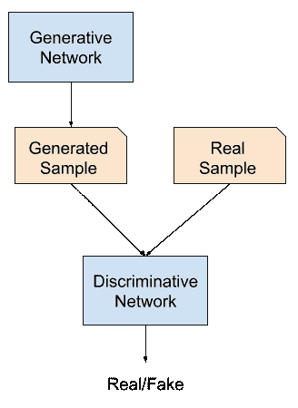
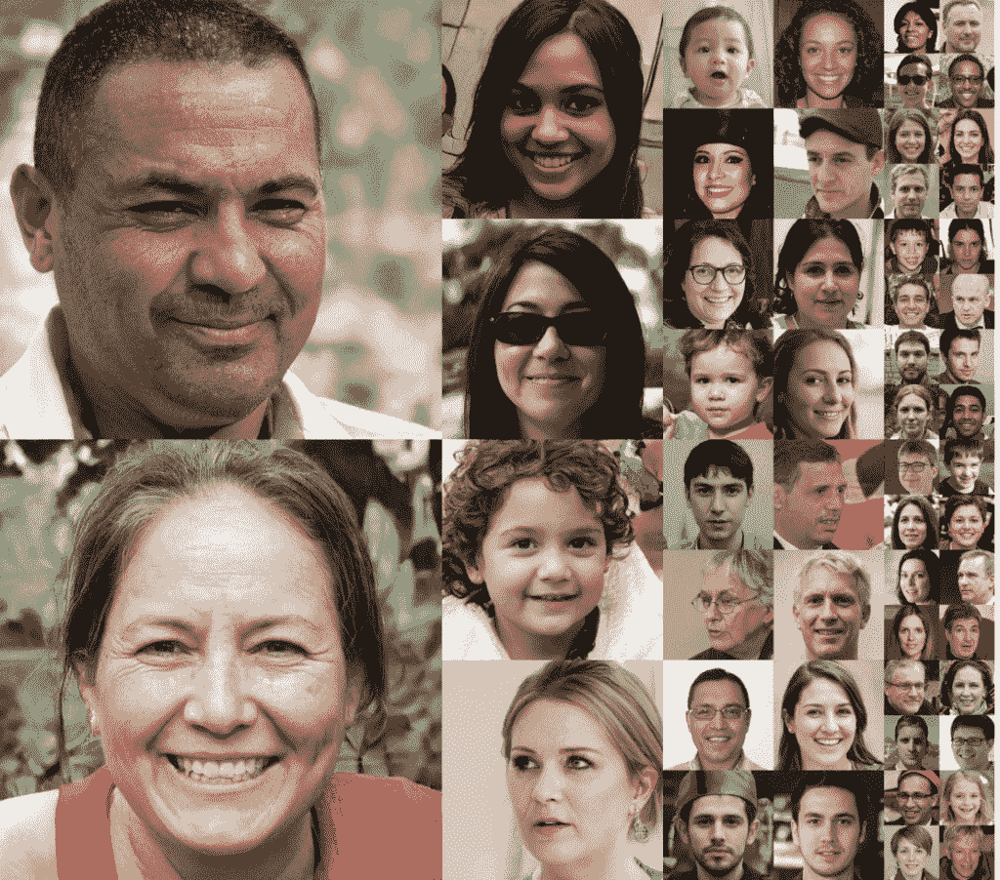

# 开始使用 GANs 的最佳资源

> 原文：<https://machinelearningmastery.com/resources-for-getting-started-with-generative-adversarial-networks/>

最后更新于 2019 年 7 月 12 日

[生成对抗网络，或 GANs](https://machinelearningmastery.com/what-are-generative-adversarial-networks-gans/) ，是一种用于生成性建模的深度学习技术。

GANs 是令人惊讶的真实感人脸生成背后的技术，以及令人印象深刻的图像翻译任务，如照片着色、人脸去老化、超分辨率等。

开始使用 GANs 可能非常具有挑战性。这既是因为该领域非常年轻，从 2014 年第一篇论文开始，也是因为每个月都有大量关于该主题的论文和应用发表。

在这篇文章中，你将发现可以用来学习生成对抗网络的最佳资源。

看完这篇文章，你会知道:

*   什么是生成对抗网络，以及该技术的具体应用示例。
*   该技术的发明者提供了关于 GANs 的视频教程和讲座。
*   阅读列表包括最常阅读的关于 GANs 的论文和关于深度生成模型的书籍。

**用我的新书[Python 生成对抗网络](https://machinelearningmastery.com/generative_adversarial_networks/)启动你的项目**，包括*分步教程*和所有示例的 *Python 源代码*文件。

我们开始吧。

## 概观

本教程分为五个部分；它们是:

1.  什么是 GANs？
2.  GAN应用
3.  GAN视频演示
4.  GAN 论文阅读列表
5.  GAN书籍

## 什么是生成对抗网络？

生成对抗网络是一种用于生成建模的神经网络体系结构。

生成性建模包括使用模型生成新的示例，这些示例似乎来自现有的样本分布，例如生成新的照片，这些照片通常与现有照片数据集相似，但又有所不同。

GAN 是使用两个神经网络模型训练的生成模型。一种模型被称为“T0”生成器或“T2”生成网络模型，它学习生成新的似是而非的样本。另一个模型称为“*鉴别器*”或“*鉴别网络*”，并学习将生成的示例与真实示例区分开来。

这两个模型是在竞赛或游戏(在博弈论意义上)中建立的，其中生成器模型试图欺骗鉴别器模型，并且鉴别器被提供真实和生成的例子的例子。

生成对抗网络综述

经过训练后，生成模型可以用于按需创建新的似是而非的样本。

## 生成对抗网络的应用

GANs 的大部分研究和应用都集中在计算机视觉领域。

其原因是，在过去的 5 到 7 年里，卷积神经网络(CNNs)等深度学习模型在计算机视觉领域取得了巨大的成功，例如在对象检测和人脸识别等具有挑战性的任务上取得了最先进的结果。

GAN 的典型例子是新的逼真照片的生成，最令人吃惊的是照片级逼真人脸的生成。

GAN 生成的真实感人脸示例。摘自《生成对抗网络的基于风格的生成器体系结构》。

还有很多“*生成新实例*”的问题，比如:

*   生成新的动漫角色。
*   生成新的徽标。
*   生成新的口袋妖怪。
*   生产新衣服。

GANs 可以用于令人惊讶的照片和视频图像处理任务。广义上，这被称为图像翻译，例如:

*   把夏天的照片翻译成冬天。
*   把草图翻译成照片。
*   把白天的照片翻译成晚上的。

一些更具体的图像翻译示例包括:

*   人脸照片的自动老化或去老化。
*   黑白照片的自动着色。
*   照片的自动分辨率增强。
*   自动风格转换(例如，将绘画风格应用于照片)。
*   自动图像修复(例如，填充图像的模糊部分)。

GANs 还可以用于生成图像或视频序列，并用于自动预测视频帧序列甚至幻觉场景等任务，用于训练强化学习模型。

除了图像处理之外，该技术通常还可以用于数据扩充，在训练模型时，可以生成全新的似是而非的样本作为输入。

有关 GANs 有趣应用的更多示例，请参见:

*   [gans-awesome-applications:精选的 awesome GAN 应用和演示列表](https://github.com/nashory/gans-awesome-applications)。
*   [GANs 的一些很酷的应用](https://medium.com/@jonathan_hui/gan-some-cool-applications-of-gans-4c9ecca35900)，2018。

## 生成对抗网络的视频展示

观看视频演示是温和介绍 GANs、其工作原理和应用程序的好方法。

作为这项技术的发明者，伊恩·古德费勒(Ian Goodfellow)已经做了许多讲座和教程演示，这些都可以在 YouTube 上免费获得。伊恩是一个优秀的沟通者，他清晰地展示了这项技术。

我推荐在 NIPS(现在的[neurops](https://nips.cc/))看 Ian 的 2016 教程。

*   [生成对抗网络，伊恩·古德费勒，NIPS 2016 教程](https://www.youtube.com/watch?v=HGYYEUSm-0Q)。

<iframe loading="lazy" title="Ian Goodfellow: Generative Adversarial Networks (NIPS 2016 tutorial)" width="500" height="281" src="about:blank" frameborder="0" allow="accelerometer; autoplay; encrypted-media; gyroscope; picture-in-picture" allowfullscreen="" data-rocket-lazyload="fitvidscompatible" data-lazy-src="https://www.youtube.com/embed/HGYYEUSm-0Q?feature=oembed"><iframe title="Ian Goodfellow: Generative Adversarial Networks (NIPS 2016 tutorial)" width="500" height="281" src="https://www.youtube.com/embed/HGYYEUSm-0Q?feature=oembed" frameborder="0" allow="accelerometer; autoplay; encrypted-media; gyroscope; picture-in-picture" allowfullscreen=""/>
 
 
视频时长约两个小时，包括对 GANs、理论和应用的详细回顾，并在最后与观众进行问答。
 
我也强烈建议阅读附带的幻灯片和纸质版教程:
 <ul> <li><a href="https://media.nips.cc/Conferences/2016/Slides/6202-Slides.pdf"> NIPS 2016 教程:生成对抗网络</a>，幻灯片，2016。</li> <li><a href="https://arxiv.org/abs/1701.00160"> NIPS 2016 教程:生成对抗网络</a>，论文，2016。</li> </ul> 
如果你对理论较少的相同材料的更集中的演示(约 28 分钟)感兴趣，我推荐伊恩 2016 年的在线会议“<em>AI With Best</em>”的演示。
 <ul> <li><a href="https://www.youtube.com/watch?v=HN9NRhm9waY">生成对抗网络，伊恩·古德费勒，AIWTB </a>，2016。</li> </ul> 

 
<iframe loading="lazy" title="Ian Goodfellow, Research Scientist OpenAI : Generative Adversarial Networks (GANs) #AIWTB 2016" width="500" height="281" src="about:blank" frameborder="0" allow="accelerometer; autoplay; encrypted-media; gyroscope; picture-in-picture" allowfullscreen="" data-rocket-lazyload="fitvidscompatible" data-lazy-src="https://www.youtube.com/embed/HN9NRhm9waY?feature=oembed"/><iframe title="Ian Goodfellow, Research Scientist OpenAI : Generative Adversarial Networks (GANs) #AIWTB 2016" width="500" height="281" src="https://www.youtube.com/embed/HN9NRhm9waY?feature=oembed" frameborder="0" allow="accelerometer; autoplay; encrypted-media; gyroscope; picture-in-picture" allowfullscreen=""/>
 
 
最近，伊恩在 2019 年给 AAAI 做了一个演讲，主题是对抗性机器学习，也涵盖了 GANs，这个演讲也非常值得推荐。
 <ul> <li><a href="https://www.youtube.com/watch?v=AJJRWFVfNPg">对抗性机器学习，伊恩·古德费勒，AAAI </a>，2019。</li> </ul> 

 
<iframe loading="lazy" title="AAAI-19 Invited Talk - Ian Goodfellow (Google AI) - Adversarial Machine Learning" width="500" height="281" src="about:blank" frameborder="0" allow="accelerometer; autoplay; encrypted-media; gyroscope; picture-in-picture" allowfullscreen="" data-rocket-lazyload="fitvidscompatible" data-lazy-src="https://www.youtube.com/embed/AJJRWFVfNPg?feature=oembed"/><iframe title="AAAI-19 Invited Talk - Ian Goodfellow (Google AI) - Adversarial Machine Learning" width="500" height="281" src="https://www.youtube.com/embed/AJJRWFVfNPg?feature=oembed" frameborder="0" allow="accelerometer; autoplay; encrypted-media; gyroscope; picture-in-picture" allowfullscreen=""/>
 
 
如果你正在寻找一个更学术的 GANs 演示，那么我会推荐斯坦福卷积神经网络课程中关于生成模型的讲座。
 
这堂课为 GANs 提供了一个有用的背景，也涵盖了变分自动编码器和像素神经网络的相关技术。
 <ul> <li><a href="https://www.youtube.com/watch?v=5WoItGTWV54">生成模型，用于视觉识别的卷积神经网络</a>，2017。</li> </ul> 

 
<iframe loading="lazy" title="Lecture 13 | Generative Models" width="500" height="281" src="about:blank" frameborder="0" allow="accelerometer; autoplay; encrypted-media; gyroscope; picture-in-picture" allowfullscreen="" data-rocket-lazyload="fitvidscompatible" data-lazy-src="https://www.youtube.com/embed/5WoItGTWV54?feature=oembed"/><iframe title="Lecture 13 | Generative Models" width="500" height="281" src="https://www.youtube.com/embed/5WoItGTWV54?feature=oembed" frameborder="0" allow="accelerometer; autoplay; encrypted-media; gyroscope; picture-in-picture" allowfullscreen=""/>
 
 <h2>生成对抗网络的论文阅读列表</h2> 
GANs 是一个非常新的研究领域。
 
我试图将这份阅读清单与更广泛的GAN应用论文清单分开，重点是GAN模型的理论发展和训练。
 
伊恩·古德费勒等人在 2014 年发表了第一篇专门关于作为生成模型的遗传神经网络的论文，题为“生成对抗网络”
 
本文介绍了这种通用技术，并用一些简单的例子来说明它，这些例子包括从 MNIST(手写数字)、CIFAR-10(小照片)和人脸生成图像。
 <ul> <li><a href="https://arxiv.org/abs/1406.2661">生成对抗网络</a>，2014。</li> </ul> 
亚历克·拉德福德等人在 2015 年发表的题为“深度卷积生成对抗网络的无监督表示学习”的论文中提供了一个使用现代配置和卷积神经网络训练实践的更新版本的遗传神经网络，称为深度卷积生成对抗网络，或称之为离散余弦变换遗传神经网络。
 
这是一篇重要的论文，因为它展示了该技术的力量是如何通过生成逼真的房间和人脸等例子来释放的。
 <ul> <li><a href="https://arxiv.org/abs/1511.06434">深度卷积生成对抗网络的无监督表示学习</a>，2015。</li> </ul> 
在 DCGAN 论文发表之后，一系列的论文被写出来，为训练 GAN 模型的固有的不稳定过程提供了改进。也许这些论文中最重要的包括:
 <ul> <li><a href="https://arxiv.org/abs/1606.03498">训练 GANs 的改进技术</a>，2016。</li> <li><a href="https://arxiv.org/abs/1609.03126">基于能量的生成对抗网络</a>，2016。</li> <li><a href="https://arxiv.org/abs/1606.03657"> InfoGAN:通过信息最大化生成对抗网络进行可解释表征学习</a>，2016。</li> </ul> 
最近一些关于培训和评估 GANs 挑战的高质量论文包括:
 <ul> <li><a href="https://arxiv.org/abs/1701.07875">水的输入 gan</a>2017 年。</li> <li>【GANs 生来平等吗？一项大型研究，2017 年。</li> <li><a href="https://arxiv.org/abs/1807.04720">GAN 景观:损失、架构、规范化和标准化</a>，2018 年。</li> </ul> 
除了这些论文之外，可以在 GANs 的<a href="https://en.wikipedia.org/wiki/Generative_adversarial_network">维基百科页面上看到相关生成模型历史的高级概述。</a>
 
有许多 GAN 调查论文可以帮助了解该领域的范围。少数几个选择包括:
 <ul> <li><a href="https://arxiv.org/abs/1710.07035">生成对抗网络:概述</a>，2017。</li> <li><a href="https://ieeexplore.ieee.org/stamp/stamp.jsp?arnumber=8039016">生成对抗网络:介绍与展望</a>，2017</li> </ul> 
许多人试图为 GANs 整理阅读清单，考虑到该领域的新鲜感和新论文的速度，这非常具有挑战性。其他一些纸质阅读清单包括:
 <ul> <li><a href="https://github.com/zhangqianhui/AdversarialNetsPapers">对抗网论文</a>。</li> </ul> <h2>生成对抗网络</h2> 
现代深度学习书籍中有一些关于 GANs 的内容。
 
也许最重要的起点是古德费勒等人编写的深度学习教科书。第 20 章的标题是“<em>深度生成模型</em>”，它提供了一系列技术的有用总结，包括第 20.10.4 节中涵盖的 GANs。
 <ul> <li><a href="https://amzn.to/2YuwVjL">第二十章。深度生成模型，深度学习</a>，2016。</li> </ul> 
《Keras 深度学习框架》的作者 Francois Chollet 在他 2017 年出版的名为《用 Python 进行深度学习》的书中，提供了一章关于深度生成模型的内容具体来说，第 8.5 节标题为“生成对抗网络的<em>介绍”，涵盖了 GANs 和如何在 Keras 训练 DCGAN。</em>
 <ul> <li><a href="https://amzn.to/2U2bHuP">第八章。生成式深度学习，Python 深度学习</a>，2017。</li> </ul> 
在撰写本文时，在预计于今年晚些时候发行的作品中，还有两本关于生成建模深度学习的有趣书籍。它们是:
 <ul> <li><a href="https://amzn.to/2Fxprnj">生成性深度学习</a>，2019</li> <li><a href="https://amzn.to/2FE3fZT"> GANs 在行动</a>，2019 年。</li> </ul> 
看到这些书涵盖的内容将是令人兴奋的。
 <h2>进一步阅读</h2> 
如果您想更深入地了解这个主题，本节将提供更多资源。
 <h3>书</h3> <ul> <li>第二十章。深度生成模型，<a href="https://amzn.to/2YuwVjL">深度学习</a>，2016。</li> <li>第八章。生成式深度学习，<a href="https://amzn.to/2U2bHuP">Python 深度学习</a>，2017。</li> <li><a href="https://amzn.to/2Fxprnj">生成性深度学习</a>，2019</li> <li><a href="https://amzn.to/2FE3fZT"> GANs 在行动</a>，2019 年。</li> </ul> <h3>报纸</h3> <ul> <li><a href="https://arxiv.org/abs/1701.00160"> NIPS 2016 教程:生成对抗网络</a>，2016。</li> <li><a href="https://arxiv.org/abs/1406.2661">生成对抗网络</a>，2014。</li> <li><a href="https://arxiv.org/abs/1511.06434">深度卷积生成对抗网络的无监督表示学习</a>，2015。</li> <li><a href="https://arxiv.org/abs/1701.07875">水的输入 gan</a>2017 年。</li> <li>【GANs 生来平等吗？一项大型研究，2017 年。</li> <li><a href="https://arxiv.org/abs/1807.04720">GAN 景观:损失、架构、规范化和标准化</a>，2018 年。</li> <li><a href="https://arxiv.org/abs/1710.07035">生成对抗网络:概述</a>，2017。</li> <li><a href="https://ieeexplore.ieee.org/stamp/stamp.jsp?arnumber=8039016">生成对抗网络:介绍与展望</a>，2017</li> </ul> <h3>录像</h3> <ul> <li><a href="https://www.youtube.com/watch?v=HGYYEUSm-0Q">生成对抗网络，伊恩·古德费勒，NIPS </a>，2016。</li> <li><a href="https://www.youtube.com/watch?v=HN9NRhm9waY">生成对抗网络，伊恩·古德费勒，AIWTB </a>，2016。</li> <li><a href="https://www.youtube.com/watch?v=AJJRWFVfNPg">对抗性机器学习，伊恩·古德费勒，AAAI </a>，2019。</li> <li><a href="https://www.youtube.com/watch?v=5WoItGTWV54">生成模型，用于视觉识别的卷积神经网络</a>，2017。</li> </ul> <h3>文章</h3> <ul> <li><a href="https://en.wikipedia.org/wiki/Generative_adversarial_network">生成对抗网络，维基百科</a>。</li> <li><a href="https://github.com/nashory/gans-awesome-applications"> gans-awesome-applications:精选的 awesome GAN 应用和演示列表</a>。</li> <li><a href="https://medium.com/@jonathan_hui/gan-some-cool-applications-of-gans-4c9ecca35900">GANs 的一些很酷的应用</a>，2018。</li> </ul> <h2>摘要</h2> 
在这篇文章中，你发现了可以用来学习生成对抗网络的最佳资源。
 
具体来说，您了解到:
 <ul> <li>什么是生成对抗网络，以及该技术的具体应用示例。</li> <li>该技术的发明者提供了关于 GANs 的视频教程和讲座。</li> <li>阅读列表包括最常阅读的关于 GANs 的论文和关于深度生成模型的书籍。</li> </ul> 
你有什么问题吗？ 在下面的评论中提问，我会尽力回答。
 
 </body></html></iframe>