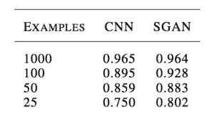
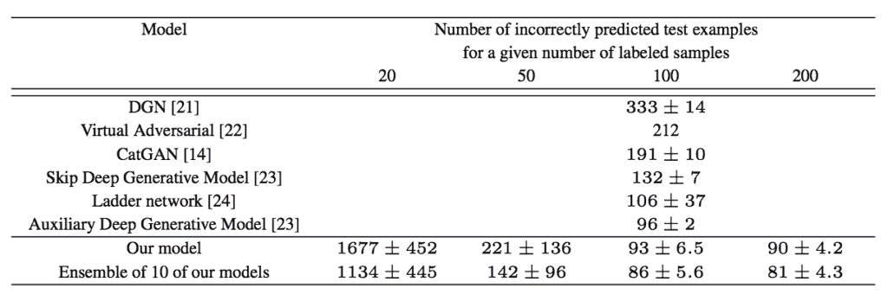
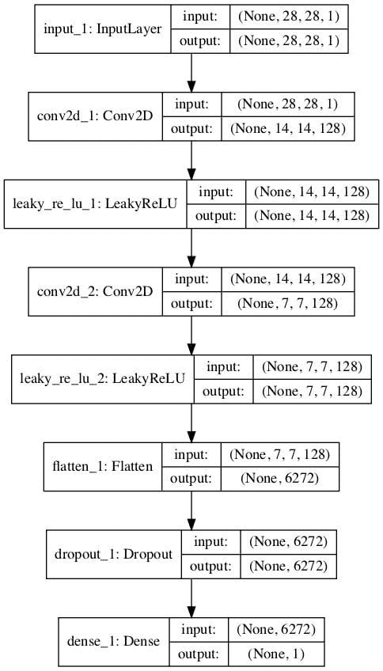
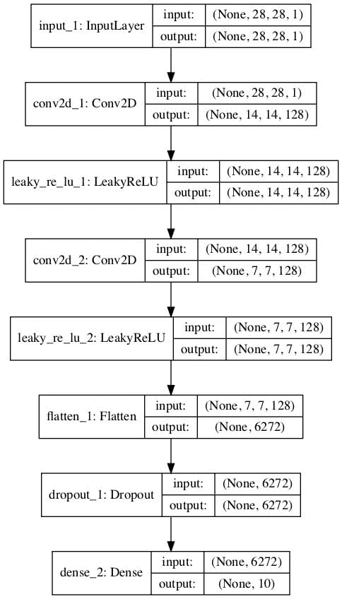
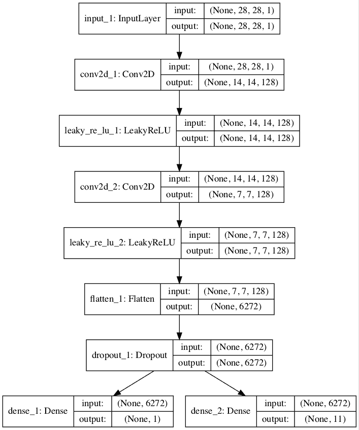
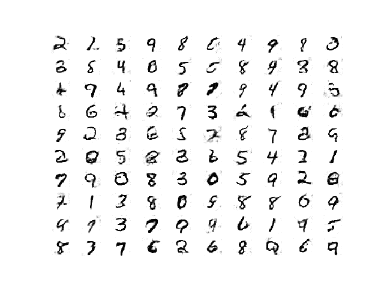

# 如何在 Keras 中从头实现半监督 GAN(SGAN)

> 原文：<https://machinelearningmastery.com/semi-supervised-generative-adversarial-network/>

最后更新于 2020 年 9 月 1 日

半监督学习是在包含少量已标记示例和大量未标记示例的数据集中训练分类器的挑战性问题。

生成对抗网络(GAN)是一种有效利用大型未标记数据集，通过图像鉴别器模型训练图像生成器模型的体系结构。在某些情况下，鉴别器模型可以用作开发分类器模型的起点。

半监督的 GAN，或 SGAN，模型是 GAN 体系结构的扩展，包括同时训练监督鉴别器、非监督鉴别器和生成器模型。结果是一个监督分类模型和一个生成器模型，前者能很好地概括出看不见的例子，后者能从该领域输出看似合理的图像例子。

在本教程中，您将发现如何从零开始开发一个半监督生成式对抗网络。

完成本教程后，您将知道:

*   半监督遗传神经网络是遗传神经网络体系结构的扩展，用于训练分类器模型，同时利用标记和未标记的数据。
*   在用于半监督 GAN 的 Keras 中，至少有三种方法来实现监督和非监督鉴别器模型。
*   如何在 MNIST 上从零开始训练半监督的 GAN，并加载和使用训练好的分类器进行预测。

**用我的新书[Python 生成对抗网络](https://machinelearningmastery.com/generative_adversarial_networks/)启动你的项目**，包括*分步教程*和所有示例的 *Python 源代码*文件。

我们开始吧。


如何从零开始实现半监督生成对抗网络？
卡洛斯·约翰逊摄影，版权所有。

## 教程概述

本教程分为四个部分；它们是:

1.  什么是半监督 GAN？
2.  如何实现半监督鉴别器模型
3.  如何为 MNIST 开发半监督式GAN
4.  如何加载和使用最终的 SGAN 分类器模型

## 什么是半监督 GAN？

半监督学习是指一个问题，其中需要一个预测模型，有标签的例子很少，无标签的例子很多。

最常见的例子是分类预测建模问题，其中可能有非常大的示例数据集，但只有一小部分具有目标标签。该模型必须从小的已标记示例集合中学习，并以某种方式利用较大的未标记示例数据集，以便在未来对新示例进行分类。

半监督网络，有时简称 SGAN，是生成对抗网络体系结构的扩展，用于解决半监督学习问题。

> 这项工作的主要目标之一是提高半监督学习的生成对抗网络的有效性(通过在额外的未标记例子上学习来提高监督任务的表现，在这种情况下是分类)。

——[训练 GANs 的改进技术](https://arxiv.org/abs/1606.03498)，2016 年。

传统 GAN 中的鉴别器被训练来预测给定图像是真实的(来自数据集)还是虚假的(生成的)，从而允许它从未标记的图像中学习特征。然后，当为同一数据集开发分类器时，可以通过[转移学习](https://machinelearningmastery.com/how-to-use-transfer-learning-when-developing-convolutional-neural-network-models/)使用鉴别器作为起点，从而允许有监督的预测任务受益于无监督的神经网络训练。

在半监督 GAN 中，更新鉴别器模型来预测 K+1 个类，其中 K 是预测问题中的类数，并为新的“*伪*”类添加额外的类标签。它包括同时为无监督的 GAN 任务和有监督的分类任务直接训练鉴别器模型。

> 我们在输入属于 N 个类之一的数据集上训练生成模型 G 和鉴别器 D。在训练时，让 D 预测输入属于 N+1 个类中的哪一个，其中增加一个额外的类来对应 g 的输出

——[生成对抗网络的半监督学习](https://arxiv.org/abs/1606.01583)，2016。

因此，鉴别器以两种模式训练:监督和非监督模式。

*   **无监督训练**:在无监督模式下，对鉴别器进行和传统 GAN 一样的训练，来预测例子是真的还是假的。
*   **监督训练**:在监督模式下，训练鉴别器预测真实例子的类标签。

无监督模式下的训练允许模型从大的未标记数据集中学习有用的特征提取能力，而有监督模式下的训练允许模型使用提取的特征并应用类别标签。

结果是一个分类器模型，当在很少的标记例子上训练时，例如几十个、几百个或一千个，它可以在标准问题上获得最先进的结果，例如 MNIST 问题。此外，训练过程还可以导致生成器模型输出质量更好的图像。

例如，[奥古斯都·奥达](http://www.augustusodena.com/)在他 2016 年发表的题为《[带有生成对抗网络的半监督学习](https://arxiv.org/abs/1606.01583)》的论文中，展示了当用 25 个、50 个、100 个和 1000 个标记的例子进行训练时，GAN 训练的分类器在 [MNIST 手写数字识别任务](https://machinelearningmastery.com/how-to-develop-a-convolutional-neural-network-from-scratch-for-mnist-handwritten-digit-classification/)上的表现如何与独立的 CNN 模型一样好或更好。



比较美国有线电视新闻网和 MNIST 国家地理通道分类准确度的结果表示例。
摘自:生成对抗网络的半监督学习

[来自 OpenAI 的 Tim Salimans](http://timsalimans.com/) 等人在他们 2016 年发表的题为“[训练 GANs](https://arxiv.org/abs/1606.03498) 的改进技术”的论文中，使用半监督 GAN(包括 MNIST)在许多图像分类任务上取得了当时最先进的结果。



将其他 GAN 模型的分类精度与 MNIST 的 SGAN 进行比较的结果表示例。
摘自:训练 GANs 的改进技术

## 如何实现半监督鉴别器模型

有许多方法可以实现半监督 GAN 的鉴别器模型。

在本节中，我们将回顾三种候选方法。

### 传统鉴别器模型

考虑标准 GAN 模型的鉴别器模型。

它必须以一幅图像作为输入，并预测它是真的还是假的。更具体地说，它预测输入图像是真实的可能性。输出层使用 sigmoid 激活函数预测[0，1]中的概率值，模型通常使用二元交叉熵损失函数进行优化。

例如，我们可以定义一个简单的鉴别器模型，它以 28×28 像素的灰度图像作为输入，并预测图像真实的概率。我们可以使用最佳实践并使用卷积层对图像进行下采样，卷积层具有 [2×2 步长](https://machinelearningmastery.com/padding-and-stride-for-convolutional-neural-networks/)和[泄漏 ReLU 激活函数](https://machinelearningmastery.com/rectified-linear-activation-function-for-deep-learning-neural-networks/)。

下面的 *define_discriminator()* 函数实现了这一点，并定义了我们的标准鉴别器模型。

```py
# example of defining the discriminator model
from keras.models import Model
from keras.layers import Input
from keras.layers import Dense
from keras.layers import Conv2D
from keras.layers import LeakyReLU
from keras.layers import Dropout
from keras.layers import Flatten
from keras.optimizers import Adam
from keras.utils.vis_utils import plot_model

# define the standalone discriminator model
def define_discriminator(in_shape=(28,28,1)):
	# image input
	in_image = Input(shape=in_shape)
	# downsample
	fe = Conv2D(128, (3,3), strides=(2,2), padding='same')(in_image)
	fe = LeakyReLU(alpha=0.2)(fe)
	# downsample
	fe = Conv2D(128, (3,3), strides=(2,2), padding='same')(fe)
	fe = LeakyReLU(alpha=0.2)(fe)
	# downsample
	fe = Conv2D(128, (3,3), strides=(2,2), padding='same')(fe)
	fe = LeakyReLU(alpha=0.2)(fe)
	# flatten feature maps
	fe = Flatten()(fe)
	# dropout
	fe = Dropout(0.4)(fe)
	# output layer
	d_out_layer = Dense(1, activation='sigmoid')(fe)
	# define and compile discriminator model
	d_model = Model(in_image, d_out_layer)
	d_model.compile(loss='binary_crossentropy', optimizer=Adam(lr=0.0002, beta_1=0.5))
	return d_model

# create model
model = define_discriminator()
# plot the model
plot_model(model, to_file='discriminator_plot.png', show_shapes=True, show_layer_names=True)
```

运行该示例创建了鉴别器模型的图，清楚地显示了输入图像的 28x28x1 形状和单个概率值的预测。


标准GAN鉴别器模型图

### 具有共享权重的独立鉴别器模型

从标准的 GAN 鉴别器模型开始，我们可以更新它来创建两个共享特征提取权重的模型。

具体来说，我们可以定义一个分类器模型来预测输入图像是真的还是假的，以及定义第二个分类器模型来预测给定模型的类别。

*   **二元分类器模型**。预测图像是真的还是假的，输出层中的 sigmoid 激活函数，并使用[二进制交叉熵损失函数](https://machinelearningmastery.com/how-to-choose-loss-functions-when-training-deep-learning-neural-networks/)进行优化。
*   **多类分类器模型**。预测图像的类别，输出层中的 softmax 激活函数，并使用[分类交叉熵损失函数](https://machinelearningmastery.com/how-to-choose-loss-functions-when-training-deep-learning-neural-networks/)进行优化。

两种模型具有不同的输出图层，但共享所有的要素提取图层。这意味着对其中一个分类器模型的更新将影响两个模型。

下面的示例首先创建具有二进制输出的传统鉴别器模型，然后重新使用特征提取图层，并创建一个新的多类预测模型，在本例中有 10 个类。

```py
# example of defining semi-supervised discriminator model
from keras.models import Model
from keras.layers import Input
from keras.layers import Dense
from keras.layers import Conv2D
from keras.layers import LeakyReLU
from keras.layers import Dropout
from keras.layers import Flatten
from keras.optimizers import Adam
from keras.utils.vis_utils import plot_model

# define the standalone supervised and unsupervised discriminator models
def define_discriminator(in_shape=(28,28,1), n_classes=10):
	# image input
	in_image = Input(shape=in_shape)
	# downsample
	fe = Conv2D(128, (3,3), strides=(2,2), padding='same')(in_image)
	fe = LeakyReLU(alpha=0.2)(fe)
	# downsample
	fe = Conv2D(128, (3,3), strides=(2,2), padding='same')(fe)
	fe = LeakyReLU(alpha=0.2)(fe)
	# downsample
	fe = Conv2D(128, (3,3), strides=(2,2), padding='same')(fe)
	fe = LeakyReLU(alpha=0.2)(fe)
	# flatten feature maps
	fe = Flatten()(fe)
	# dropout
	fe = Dropout(0.4)(fe)
	# unsupervised output
	d_out_layer = Dense(1, activation='sigmoid')(fe)
	# define and compile unsupervised discriminator model
	d_model = Model(in_image, d_out_layer)
	d_model.compile(loss='binary_crossentropy', optimizer=Adam(lr=0.0002, beta_1=0.5))
	# supervised output
	c_out_layer = Dense(n_classes, activation='softmax')(fe)
	# define and compile supervised discriminator model
	c_model = Model(in_image, c_out_layer)
	c_model.compile(loss='sparse_categorical_crossentropy', optimizer=Adam(lr=0.0002, beta_1=0.5), metrics=['accuracy'])
	return d_model, c_model

# create model
d_model, c_model = define_discriminator()
# plot the model
plot_model(d_model, to_file='discriminator1_plot.png', show_shapes=True, show_layer_names=True)
plot_model(c_model, to_file='discriminator2_plot.png', show_shapes=True, show_layer_names=True)
```

运行该示例会创建和绘制两个模型。

第一个模型的图和之前一样。



无监督二进制分类 GAN 鉴别器模型的绘制

第二个模型的图显示了相同的预期输入形状和相同的特征提取层，以及新的 10 类分类输出层。



一种有监督的多类分类 GAN 鉴别器模型的绘制

### 多输出单鉴别器模型

实现半监督鉴别器模型的另一种方法是使用具有多个输出层的单一模型。

具体来说，这是一个单一模型，一个输出层用于无监督任务，一个输出层用于有监督任务。

这就像有监督和无监督任务的独立模型，因为它们都共享相同的特征提取层，除了在这种情况下，每个输入图像总是有两个输出预测，特别是真实/虚假预测和监督类预测。

这种方法的一个问题是，当更新模型时，没有标记和生成的图像，没有监督类标签。在这种情况下，这些图像必须具有来自监督输出的“未知的”*或“假的”*的输出标签。这意味着监督输出层需要一个额外的类标签。**

 **下面的例子实现了半监督 GAN 架构中鉴别器模型的多输出单模型方法。

我们可以看到，模型由两个输出层定义，监督任务的输出层由 n _ classes 定义。在这种情况下为 11，为额外的“*未知*”类标签腾出空间。

我们还可以看到，模型被编译为两个损失函数，模型的每个输出层一个。

```py
# example of defining semi-supervised discriminator model
from keras.models import Model
from keras.layers import Input
from keras.layers import Dense
from keras.layers import Conv2D
from keras.layers import LeakyReLU
from keras.layers import Dropout
from keras.layers import Flatten
from keras.optimizers import Adam
from keras.utils.vis_utils import plot_model

# define the standalone supervised and unsupervised discriminator models
def define_discriminator(in_shape=(28,28,1), n_classes=10):
	# image input
	in_image = Input(shape=in_shape)
	# downsample
	fe = Conv2D(128, (3,3), strides=(2,2), padding='same')(in_image)
	fe = LeakyReLU(alpha=0.2)(fe)
	# downsample
	fe = Conv2D(128, (3,3), strides=(2,2), padding='same')(fe)
	fe = LeakyReLU(alpha=0.2)(fe)
	# downsample
	fe = Conv2D(128, (3,3), strides=(2,2), padding='same')(fe)
	fe = LeakyReLU(alpha=0.2)(fe)
	# flatten feature maps
	fe = Flatten()(fe)
	# dropout
	fe = Dropout(0.4)(fe)
	# unsupervised output
	d_out_layer = Dense(1, activation='sigmoid')(fe)
	# supervised output
	c_out_layer = Dense(n_classes + 1, activation='softmax')(fe)
	# define and compile supervised discriminator model
	model = Model(in_image, [d_out_layer, c_out_layer])
	model.compile(loss=['binary_crossentropy', 'sparse_categorical_crossentropy'], optimizer=Adam(lr=0.0002, beta_1=0.5), metrics=['accuracy'])
	return model

# create model
model = define_discriminator()
# plot the model
plot_model(model, to_file='multioutput_discriminator_plot.png', show_shapes=True, show_layer_names=True)
```

运行该示例会创建并绘制单个多输出模型。

该图清楚地显示了共享图层以及单独的无监督和有监督输出图层。



具有无监督和有监督输出层的半监督GAN鉴别器模型图

### 具有共享权重的堆叠鉴别器模型

最后一种方法非常类似于前面的两种方法，包括创建单独的逻辑无监督模型和有监督模型，但试图重用一个模型的输出层作为另一个模型的输入。

该方法基于 OpenAI 的 Tim Salimans 等人在 2016 年的论文[中对半监督模型的定义，该论文题为“](http://timsalimans.com/)[训练 GANs 的改进技术](https://arxiv.org/abs/1606.03498)

在这篇论文中，他们描述了一个有效的实现，首先用 K 个输出类和一个 softmax 激活函数创建监督模型。然后定义无监督模型，该模型在 softmax 激活之前获取有监督模型的输出，然后计算指数输出的归一化和。


SGAN 中无监督鉴别器模型的输出函数示例。
摘自:训练 GANs 的改进技术

为了更清楚地说明这一点，我们可以在 NumPy 中实现这个激活函数，并通过它运行一些示例激活，看看会发生什么。

下面列出了完整的示例。

```py
# example of custom activation function
import numpy as np

# custom activation function
def custom_activation(output):
	logexpsum = np.sum(np.exp(output))
	result = logexpsum / (logexpsum + 1.0)
	return result

# all -10s
output = np.asarray([-10.0, -10.0, -10.0])
print(custom_activation(output))
# all -1s
output = np.asarray([-1.0, -1.0, -1.0])
print(custom_activation(output))
# all 0s
output = np.asarray([0.0, 0.0, 0.0])
print(custom_activation(output))
# all 1s
output = np.asarray([1.0, 1.0, 1.0])
print(custom_activation(output))
# all 10s
output = np.asarray([10.0, 10.0, 10.0])
print(custom_activation(output))
```

请记住，在 softmax 激活函数之前，无监督模型的输出将是节点的直接激活。它们将是小的正值或负值，但不会标准化，因为这将由 softmax 激活来执行。

自定义激活函数将输出一个介于 0.0 和 1.0 之间的值。

对于小激活或负激活，输出接近 0.0 的值，对于正激活或大激活，输出接近 1.0 的值。当我们运行示例时，我们可以看到这一点。

```py
0.00013618124143106674
0.5246331135813284
0.75
0.890768227426964
0.9999848669190928
```

这意味着鼓励模型为真实示例输出强类预测，为虚假示例输出小类预测或低激活。这是一个聪明的技巧，允许在两个模型中重用监督模型的相同输出节点。

激活功能几乎可以直接通过 Keras 后端实现，并从 *Lambda* 层调用，例如，将自定义功能应用于层输入的层。

下面列出了完整的示例。首先，用软最大激活和分类交叉熵损失函数定义监督模型。在 softmax 激活之前，无监督模型被堆叠在有监督模型的输出层之上，节点的激活通过 Lambda 层传递给我们的自定义激活函数。

不需要 sigmoid 激活函数，因为我们已经标准化了激活。如前所述，使用二元交叉熵损失拟合无监督模型。

```py
# example of defining semi-supervised discriminator model
from keras.models import Model
from keras.layers import Input
from keras.layers import Dense
from keras.layers import Conv2D
from keras.layers import LeakyReLU
from keras.layers import Dropout
from keras.layers import Flatten
from keras.layers import Activation
from keras.layers import Lambda
from keras.optimizers import Adam
from keras.utils.vis_utils import plot_model
from keras import backend

# custom activation function
def custom_activation(output):
	logexpsum = backend.sum(backend.exp(output), axis=-1, keepdims=True)
	result = logexpsum / (logexpsum + 1.0)
	return result

# define the standalone supervised and unsupervised discriminator models
def define_discriminator(in_shape=(28,28,1), n_classes=10):
	# image input
	in_image = Input(shape=in_shape)
	# downsample
	fe = Conv2D(128, (3,3), strides=(2,2), padding='same')(in_image)
	fe = LeakyReLU(alpha=0.2)(fe)
	# downsample
	fe = Conv2D(128, (3,3), strides=(2,2), padding='same')(fe)
	fe = LeakyReLU(alpha=0.2)(fe)
	# downsample
	fe = Conv2D(128, (3,3), strides=(2,2), padding='same')(fe)
	fe = LeakyReLU(alpha=0.2)(fe)
	# flatten feature maps
	fe = Flatten()(fe)
	# dropout
	fe = Dropout(0.4)(fe)
	# output layer nodes
	fe = Dense(n_classes)(fe)
	# supervised output
	c_out_layer = Activation('softmax')(fe)
	# define and compile supervised discriminator model
	c_model = Model(in_image, c_out_layer)
	c_model.compile(loss='sparse_categorical_crossentropy', optimizer=Adam(lr=0.0002, beta_1=0.5), metrics=['accuracy'])
	# unsupervised output
	d_out_layer = Lambda(custom_activation)(fe)
	# define and compile unsupervised discriminator model
	d_model = Model(in_image, d_out_layer)
	d_model.compile(loss='binary_crossentropy', optimizer=Adam(lr=0.0002, beta_1=0.5))
	return d_model, c_model

# create model
d_model, c_model = define_discriminator()
# plot the model
plot_model(d_model, to_file='stacked_discriminator1_plot.png', show_shapes=True, show_layer_names=True)
plot_model(c_model, to_file='stacked_discriminator2_plot.png', show_shapes=True, show_layer_names=True)
```

运行该示例会创建并绘制两个模型，这两个模型看起来与第一个示例中的两个模型非常相似。

无监督鉴别器模型的堆叠版本:


半监督GAN无监督鉴别器模型的堆叠图

监督鉴别器模型的堆叠版本:


半监督GAN监督鉴别器模型的堆叠图

现在我们已经看到了如何在半监督 GAN 中实现鉴别器模型，我们可以为图像生成和半监督分类开发一个完整的例子。

## 如何为 MNIST 开发半监督式GAN

在本节中，我们将为 [MNIST 手写数字数据集](https://machinelearningmastery.com/how-to-develop-a-convolutional-neural-network-from-scratch-for-mnist-handwritten-digit-classification/)开发半监督 GAN 模型。

数据集对于数字 0-9 有 10 个类，因此分类器模型将有 10 个输出节点。该模型将适合包含 60，000 个示例的训练数据集。训练数据集中只有 100 个图像将与标签一起使用，10 个类别中各有 10 个。

我们将从定义模型开始。

我们将使用堆叠鉴别器模型，正如上一节所定义的那样。

接下来，我们可以定义生成器模型。在这种情况下，生成器模型将把潜在空间中的一个点作为输入，并将使用转置卷积层来输出 28×28 灰度图像。下面的 *define_generator()* 函数实现了这一点，并返回定义的生成器模型。

```py
# define the standalone generator model
def define_generator(latent_dim):
	# image generator input
	in_lat = Input(shape=(latent_dim,))
	# foundation for 7x7 image
	n_nodes = 128 * 7 * 7
	gen = Dense(n_nodes)(in_lat)
	gen = LeakyReLU(alpha=0.2)(gen)
	gen = Reshape((7, 7, 128))(gen)
	# upsample to 14x14
	gen = Conv2DTranspose(128, (4,4), strides=(2,2), padding='same')(gen)
	gen = LeakyReLU(alpha=0.2)(gen)
	# upsample to 28x28
	gen = Conv2DTranspose(128, (4,4), strides=(2,2), padding='same')(gen)
	gen = LeakyReLU(alpha=0.2)(gen)
	# output
	out_layer = Conv2D(1, (7,7), activation='tanh', padding='same')(gen)
	# define model
	model = Model(in_lat, out_layer)
	return model
```

生成器模型将通过无监督鉴别器模型进行拟合。

我们将使用复合模型架构，当在 Keras 中实现时，该架构通常用于训练生成器模型。具体来说，在生成器模型的输出被直接传递给无监督鉴别器模型，并且鉴别器的权重被标记为不可训练的情况下，使用权重共享。

下面的 *define_gan()* 函数实现了这一点，将已经定义的生成器和鉴别器模型作为输入，并返回用于训练生成器模型权重的复合模型。

```py
# define the combined generator and discriminator model, for updating the generator
def define_gan(g_model, d_model):
	# make weights in the discriminator not trainable
	d_model.trainable = False
	# connect image output from generator as input to discriminator
	gan_output = d_model(g_model.output)
	# define gan model as taking noise and outputting a classification
	model = Model(g_model.input, gan_output)
	# compile model
	opt = Adam(lr=0.0002, beta_1=0.5)
	model.compile(loss='binary_crossentropy', optimizer=opt)
	return model
```

我们可以加载训练数据集[并将像素](https://machinelearningmastery.com/how-to-manually-scale-image-pixel-data-for-deep-learning/)缩放到范围[-1，1]以匹配生成器模型的输出值。

```py
# load the images
def load_real_samples():
	# load dataset
	(trainX, trainy), (_, _) = load_data()
	# expand to 3d, e.g. add channels
	X = expand_dims(trainX, axis=-1)
	# convert from ints to floats
	X = X.astype('float32')
	# scale from [0,255] to [-1,1]
	X = (X - 127.5) / 127.5
	print(X.shape, trainy.shape)
	return [X, trainy]
```

我们还可以定义一个函数来选择训练数据集的一个子集，在该子集中我们保留标签并训练鉴别器模型的监督版本。

下面的*select _ supervised _ samples()*函数实现了这一点，并小心地确保示例的选择是随机的，并且类是平衡的。标记示例的数量被参数化并设置为 100，这意味着 10 个类中的每一个都将有 10 个随机选择的示例。

```py
# select a supervised subset of the dataset, ensures classes are balanced
def select_supervised_samples(dataset, n_samples=100, n_classes=10):
	X, y = dataset
	X_list, y_list = list(), list()
	n_per_class = int(n_samples / n_classes)
	for i in range(n_classes):
		# get all images for this class
		X_with_class = X[y == i]
		# choose random instances
		ix = randint(0, len(X_with_class), n_per_class)
		# add to list
		[X_list.append(X_with_class[j]) for j in ix]
		[y_list.append(i) for j in ix]
	return asarray(X_list), asarray(y_list)
```

接下来，我们可以定义一个函数来检索一批真实的训练示例。

选择图像和标签的样本，并进行替换。这个相同的函数可以用来从标记和未标记的数据集中检索示例，稍后当我们训练模型时。在“*无标签数据集*的情况下，我们将忽略标签。

```py
# select real samples
def generate_real_samples(dataset, n_samples):
	# split into images and labels
	images, labels = dataset
	# choose random instances
	ix = randint(0, images.shape[0], n_samples)
	# select images and labels
	X, labels = images[ix], labels[ix]
	# generate class labels
	y = ones((n_samples, 1))
	return [X, labels], y
```

接下来，我们可以定义函数来帮助使用生成器模型生成图像。

首先，*generate _ 潜伏 _points()* 函数会在潜伏空间中创建一批有价值的随机点，这些随机点可以作为生成图像的输入。 *generate_fake_samples()* 函数将调用该函数来生成一批有价值的图像，这些图像可以在训练期间被馈送到无监督鉴别器模型或复合 GAN 模型。

```py
# generate points in latent space as input for the generator
def generate_latent_points(latent_dim, n_samples):
	# generate points in the latent space
	z_input = randn(latent_dim * n_samples)
	# reshape into a batch of inputs for the network
	z_input = z_input.reshape(n_samples, latent_dim)
	return z_input

# use the generator to generate n fake examples, with class labels
def generate_fake_samples(generator, latent_dim, n_samples):
	# generate points in latent space
	z_input = generate_latent_points(latent_dim, n_samples)
	# predict outputs
	images = generator.predict(z_input)
	# create class labels
	y = zeros((n_samples, 1))
	return images, y
```

接下来，当我们想要评估模型的表现时，我们可以定义一个要调用的函数。

该功能将使用发电机模型的当前状态生成并绘制 100 幅图像。该图像图可用于主观评估发电机模型的表现。

然后在整个训练数据集上评估监督鉴别器模型，并报告分类精度。最后，生成器模型和监督鉴别器模型被保存到文件中，以供以后使用。

下面的*summary _ performance()*函数实现了这一点，可以定期调用，比如每个[训练时期](https://machinelearningmastery.com/difference-between-a-batch-and-an-epoch/)的结束。可以在运行结束时查看结果，以选择分类器甚至生成器模型。

```py
# generate samples and save as a plot and save the model
def summarize_performance(step, g_model, c_model, latent_dim, dataset, n_samples=100):
	# prepare fake examples
	X, _ = generate_fake_samples(g_model, latent_dim, n_samples)
	# scale from [-1,1] to [0,1]
	X = (X + 1) / 2.0
	# plot images
	for i in range(100):
		# define subplot
		pyplot.subplot(10, 10, 1 + i)
		# turn off axis
		pyplot.axis('off')
		# plot raw pixel data
		pyplot.imshow(X[i, :, :, 0], cmap='gray_r')
	# save plot to file
	filename1 = 'generated_plot_%04d.png' % (step+1)
	pyplot.savefig(filename1)
	pyplot.close()
	# evaluate the classifier model
	X, y = dataset
	_, acc = c_model.evaluate(X, y, verbose=0)
	print('Classifier Accuracy: %.3f%%' % (acc * 100))
	# save the generator model
	filename2 = 'g_model_%04d.h5' % (step+1)
	g_model.save(filename2)
	# save the classifier model
	filename3 = 'c_model_%04d.h5' % (step+1)
	c_model.save(filename3)
	print('>Saved: %s, %s, and %s' % (filename1, filename2, filename3))
```

接下来，我们可以定义一个函数来训练模型。定义的模型和加载的训练数据集作为参数提供，训练时期的数量和批处理大小用默认值参数化，在本例中是 20 个时期和 100 个批处理大小。

发现所选择的模型配置快速过度训练数据集，因此训练时期的数量相对较少。将纪元增加到 100 个或更多会产生质量更高的图像，但分类器模型的质量较低。平衡这两个问题可能是一个有趣的扩展。

首先，选择训练数据集的标记子集，并计算训练步骤的数量。

训练过程几乎与普通 GAN 模型的训练相同，只是增加了用标记的例子更新监督模型。

通过更新模型的单个周期包括首先用标记的例子更新有监督的鉴别器模型，然后用未标记的真实和生成的例子更新无监督的鉴别器模型。最后，通过复合模型更新发电机模型。

鉴别器模型的共享权重用 1.5 批样本更新，而生成器模型的权重每次迭代用一批样本更新。改变这一点，使每个模型更新相同的量，可能会改善模型训练过程。

```py
# train the generator and discriminator
def train(g_model, d_model, c_model, gan_model, dataset, latent_dim, n_epochs=20, n_batch=100):
	# select supervised dataset
	X_sup, y_sup = select_supervised_samples(dataset)
	print(X_sup.shape, y_sup.shape)
	# calculate the number of batches per training epoch
	bat_per_epo = int(dataset[0].shape[0] / n_batch)
	# calculate the number of training iterations
	n_steps = bat_per_epo * n_epochs
	# calculate the size of half a batch of samples
	half_batch = int(n_batch / 2)
	print('n_epochs=%d, n_batch=%d, 1/2=%d, b/e=%d, steps=%d' % (n_epochs, n_batch, half_batch, bat_per_epo, n_steps))
	# manually enumerate epochs
	for i in range(n_steps):
		# update supervised discriminator (c)
		[Xsup_real, ysup_real], _ = generate_real_samples([X_sup, y_sup], half_batch)
		c_loss, c_acc = c_model.train_on_batch(Xsup_real, ysup_real)
		# update unsupervised discriminator (d)
		[X_real, _], y_real = generate_real_samples(dataset, half_batch)
		d_loss1 = d_model.train_on_batch(X_real, y_real)
		X_fake, y_fake = generate_fake_samples(g_model, latent_dim, half_batch)
		d_loss2 = d_model.train_on_batch(X_fake, y_fake)
		# update generator (g)
		X_gan, y_gan = generate_latent_points(latent_dim, n_batch), ones((n_batch, 1))
		g_loss = gan_model.train_on_batch(X_gan, y_gan)
		# summarize loss on this batch
		print('>%d, c[%.3f,%.0f], d[%.3f,%.3f], g[%.3f]' % (i+1, c_loss, c_acc*100, d_loss1, d_loss2, g_loss))
		# evaluate the model performance every so often
		if (i+1) % (bat_per_epo * 1) == 0:
			summarize_performance(i, g_model, c_model, latent_dim, dataset)
```

最后，我们可以定义模型并调用函数来训练和保存模型。

```py
# size of the latent space
latent_dim = 100
# create the discriminator models
d_model, c_model = define_discriminator()
# create the generator
g_model = define_generator(latent_dim)
# create the gan
gan_model = define_gan(g_model, d_model)
# load image data
dataset = load_real_samples()
# train model
train(g_model, d_model, c_model, gan_model, dataset, latent_dim)
```

将所有这些结合在一起，下面列出了在 MNIST 手写数字图像分类任务上训练半监督 GAN 的完整示例。

```py
# example of semi-supervised gan for mnist
from numpy import expand_dims
from numpy import zeros
from numpy import ones
from numpy import asarray
from numpy.random import randn
from numpy.random import randint
from keras.datasets.mnist import load_data
from keras.optimizers import Adam
from keras.models import Model
from keras.layers import Input
from keras.layers import Dense
from keras.layers import Reshape
from keras.layers import Flatten
from keras.layers import Conv2D
from keras.layers import Conv2DTranspose
from keras.layers import LeakyReLU
from keras.layers import Dropout
from keras.layers import Lambda
from keras.layers import Activation
from matplotlib import pyplot
from keras import backend

# custom activation function
def custom_activation(output):
	logexpsum = backend.sum(backend.exp(output), axis=-1, keepdims=True)
	result = logexpsum / (logexpsum + 1.0)
	return result

# define the standalone supervised and unsupervised discriminator models
def define_discriminator(in_shape=(28,28,1), n_classes=10):
	# image input
	in_image = Input(shape=in_shape)
	# downsample
	fe = Conv2D(128, (3,3), strides=(2,2), padding='same')(in_image)
	fe = LeakyReLU(alpha=0.2)(fe)
	# downsample
	fe = Conv2D(128, (3,3), strides=(2,2), padding='same')(fe)
	fe = LeakyReLU(alpha=0.2)(fe)
	# downsample
	fe = Conv2D(128, (3,3), strides=(2,2), padding='same')(fe)
	fe = LeakyReLU(alpha=0.2)(fe)
	# flatten feature maps
	fe = Flatten()(fe)
	# dropout
	fe = Dropout(0.4)(fe)
	# output layer nodes
	fe = Dense(n_classes)(fe)
	# supervised output
	c_out_layer = Activation('softmax')(fe)
	# define and compile supervised discriminator model
	c_model = Model(in_image, c_out_layer)
	c_model.compile(loss='sparse_categorical_crossentropy', optimizer=Adam(lr=0.0002, beta_1=0.5), metrics=['accuracy'])
	# unsupervised output
	d_out_layer = Lambda(custom_activation)(fe)
	# define and compile unsupervised discriminator model
	d_model = Model(in_image, d_out_layer)
	d_model.compile(loss='binary_crossentropy', optimizer=Adam(lr=0.0002, beta_1=0.5))
	return d_model, c_model

# define the standalone generator model
def define_generator(latent_dim):
	# image generator input
	in_lat = Input(shape=(latent_dim,))
	# foundation for 7x7 image
	n_nodes = 128 * 7 * 7
	gen = Dense(n_nodes)(in_lat)
	gen = LeakyReLU(alpha=0.2)(gen)
	gen = Reshape((7, 7, 128))(gen)
	# upsample to 14x14
	gen = Conv2DTranspose(128, (4,4), strides=(2,2), padding='same')(gen)
	gen = LeakyReLU(alpha=0.2)(gen)
	# upsample to 28x28
	gen = Conv2DTranspose(128, (4,4), strides=(2,2), padding='same')(gen)
	gen = LeakyReLU(alpha=0.2)(gen)
	# output
	out_layer = Conv2D(1, (7,7), activation='tanh', padding='same')(gen)
	# define model
	model = Model(in_lat, out_layer)
	return model

# define the combined generator and discriminator model, for updating the generator
def define_gan(g_model, d_model):
	# make weights in the discriminator not trainable
	d_model.trainable = False
	# connect image output from generator as input to discriminator
	gan_output = d_model(g_model.output)
	# define gan model as taking noise and outputting a classification
	model = Model(g_model.input, gan_output)
	# compile model
	opt = Adam(lr=0.0002, beta_1=0.5)
	model.compile(loss='binary_crossentropy', optimizer=opt)
	return model

# load the images
def load_real_samples():
	# load dataset
	(trainX, trainy), (_, _) = load_data()
	# expand to 3d, e.g. add channels
	X = expand_dims(trainX, axis=-1)
	# convert from ints to floats
	X = X.astype('float32')
	# scale from [0,255] to [-1,1]
	X = (X - 127.5) / 127.5
	print(X.shape, trainy.shape)
	return [X, trainy]

# select a supervised subset of the dataset, ensures classes are balanced
def select_supervised_samples(dataset, n_samples=100, n_classes=10):
	X, y = dataset
	X_list, y_list = list(), list()
	n_per_class = int(n_samples / n_classes)
	for i in range(n_classes):
		# get all images for this class
		X_with_class = X[y == i]
		# choose random instances
		ix = randint(0, len(X_with_class), n_per_class)
		# add to list
		[X_list.append(X_with_class[j]) for j in ix]
		[y_list.append(i) for j in ix]
	return asarray(X_list), asarray(y_list)

# select real samples
def generate_real_samples(dataset, n_samples):
	# split into images and labels
	images, labels = dataset
	# choose random instances
	ix = randint(0, images.shape[0], n_samples)
	# select images and labels
	X, labels = images[ix], labels[ix]
	# generate class labels
	y = ones((n_samples, 1))
	return [X, labels], y

# generate points in latent space as input for the generator
def generate_latent_points(latent_dim, n_samples):
	# generate points in the latent space
	z_input = randn(latent_dim * n_samples)
	# reshape into a batch of inputs for the network
	z_input = z_input.reshape(n_samples, latent_dim)
	return z_input

# use the generator to generate n fake examples, with class labels
def generate_fake_samples(generator, latent_dim, n_samples):
	# generate points in latent space
	z_input = generate_latent_points(latent_dim, n_samples)
	# predict outputs
	images = generator.predict(z_input)
	# create class labels
	y = zeros((n_samples, 1))
	return images, y

# generate samples and save as a plot and save the model
def summarize_performance(step, g_model, c_model, latent_dim, dataset, n_samples=100):
	# prepare fake examples
	X, _ = generate_fake_samples(g_model, latent_dim, n_samples)
	# scale from [-1,1] to [0,1]
	X = (X + 1) / 2.0
	# plot images
	for i in range(100):
		# define subplot
		pyplot.subplot(10, 10, 1 + i)
		# turn off axis
		pyplot.axis('off')
		# plot raw pixel data
		pyplot.imshow(X[i, :, :, 0], cmap='gray_r')
	# save plot to file
	filename1 = 'generated_plot_%04d.png' % (step+1)
	pyplot.savefig(filename1)
	pyplot.close()
	# evaluate the classifier model
	X, y = dataset
	_, acc = c_model.evaluate(X, y, verbose=0)
	print('Classifier Accuracy: %.3f%%' % (acc * 100))
	# save the generator model
	filename2 = 'g_model_%04d.h5' % (step+1)
	g_model.save(filename2)
	# save the classifier model
	filename3 = 'c_model_%04d.h5' % (step+1)
	c_model.save(filename3)
	print('>Saved: %s, %s, and %s' % (filename1, filename2, filename3))

# train the generator and discriminator
def train(g_model, d_model, c_model, gan_model, dataset, latent_dim, n_epochs=20, n_batch=100):
	# select supervised dataset
	X_sup, y_sup = select_supervised_samples(dataset)
	print(X_sup.shape, y_sup.shape)
	# calculate the number of batches per training epoch
	bat_per_epo = int(dataset[0].shape[0] / n_batch)
	# calculate the number of training iterations
	n_steps = bat_per_epo * n_epochs
	# calculate the size of half a batch of samples
	half_batch = int(n_batch / 2)
	print('n_epochs=%d, n_batch=%d, 1/2=%d, b/e=%d, steps=%d' % (n_epochs, n_batch, half_batch, bat_per_epo, n_steps))
	# manually enumerate epochs
	for i in range(n_steps):
		# update supervised discriminator (c)
		[Xsup_real, ysup_real], _ = generate_real_samples([X_sup, y_sup], half_batch)
		c_loss, c_acc = c_model.train_on_batch(Xsup_real, ysup_real)
		# update unsupervised discriminator (d)
		[X_real, _], y_real = generate_real_samples(dataset, half_batch)
		d_loss1 = d_model.train_on_batch(X_real, y_real)
		X_fake, y_fake = generate_fake_samples(g_model, latent_dim, half_batch)
		d_loss2 = d_model.train_on_batch(X_fake, y_fake)
		# update generator (g)
		X_gan, y_gan = generate_latent_points(latent_dim, n_batch), ones((n_batch, 1))
		g_loss = gan_model.train_on_batch(X_gan, y_gan)
		# summarize loss on this batch
		print('>%d, c[%.3f,%.0f], d[%.3f,%.3f], g[%.3f]' % (i+1, c_loss, c_acc*100, d_loss1, d_loss2, g_loss))
		# evaluate the model performance every so often
		if (i+1) % (bat_per_epo * 1) == 0:
			summarize_performance(i, g_model, c_model, latent_dim, dataset)

# size of the latent space
latent_dim = 100
# create the discriminator models
d_model, c_model = define_discriminator()
# create the generator
g_model = define_generator(latent_dim)
# create the gan
gan_model = define_gan(g_model, d_model)
# load image data
dataset = load_real_samples()
# train model
train(g_model, d_model, c_model, gan_model, dataset, latent_dim)
```

该示例可以在带有中央处理器或图形处理器硬件的工作站上运行，尽管建议使用图形处理器来加快执行速度。

**注**:考虑到算法或评估程序的随机性，或数值精度的差异，您的[结果可能会有所不同](https://machinelearningmastery.com/different-results-each-time-in-machine-learning/)。考虑运行该示例几次，并比较平均结果。

在运行开始时，总结了训练数据集的大小，以及监督子集，从而确认了我们的配置。

每个模型的表现在每次更新结束时进行总结，包括有监督鉴别器模型的损失和准确性( *c* )、无监督鉴别器模型在真实和生成示例上的损失( *d* )以及通过复合模型更新的生成器模型的损失( *g* )。

监督模型的损失将缩小到接近于零的小值，并且精度将达到 100%，这将在整个运行期间保持不变。如果无监督鉴别器和发生器保持平衡，它们的损失在整个运行过程中应保持在适当的值。

```py
(60000, 28, 28, 1) (60000,)
(100, 28, 28, 1) (100,)
n_epochs=20, n_batch=100, 1/2=50, b/e=600, steps=12000
>1, c[2.305,6], d[0.096,2.399], g[0.095]
>2, c[2.298,18], d[0.089,2.399], g[0.095]
>3, c[2.308,10], d[0.084,2.401], g[0.095]
>4, c[2.304,8], d[0.080,2.404], g[0.095]
>5, c[2.254,18], d[0.077,2.407], g[0.095]
...
```

在每个训练时期结束时，在每 600 次训练更新之后，在整个训练数据集上评估监督分类模型。此时，对该模型的表现进行了总结，表明其快速获得了良好的技能。

这是令人惊讶的，因为该模型只在每个类的 10 个有标签的例子上训练。

```py
Classifier Accuracy: 85.543%
Classifier Accuracy: 91.487%
Classifier Accuracy: 92.628%
Classifier Accuracy: 94.017%
Classifier Accuracy: 94.252%
Classifier Accuracy: 93.828%
Classifier Accuracy: 94.122%
Classifier Accuracy: 93.597%
Classifier Accuracy: 95.283%
Classifier Accuracy: 95.287%
Classifier Accuracy: 95.263%
Classifier Accuracy: 95.432%
Classifier Accuracy: 95.270%
Classifier Accuracy: 95.212%
Classifier Accuracy: 94.803%
Classifier Accuracy: 94.640%
Classifier Accuracy: 93.622%
Classifier Accuracy: 91.870%
Classifier Accuracy: 92.525%
Classifier Accuracy: 92.180%
```

模型也在每个训练时期结束时保存，并且生成的图像图也被创建。

给定相对少量的训练时期，所生成的图像的质量是好的。



8400 次更新后半监督 GAN 生成的手写数字图。

## 如何加载和使用最终的 SGAN 分类器模型

既然我们已经训练了生成器和鉴别器模型，我们就可以使用它们了。

在半监督 GAN 的情况下，我们对生成器模型不太感兴趣，而对监督模型更感兴趣。

查看特定运行的结果，我们可以选择已知在测试数据集上具有良好表现的特定保存模型。在这种情况下，模型在 12 个训练时期或 7，200 次更新后保存，在训练数据集上的分类准确率约为 95.432%。

我们可以通过 *load_model()* Keras 函数直接加载模型。

```py
...
# load the model
model = load_model('c_model_7200.h5')
```

一旦加载，我们可以在整个训练数据集上再次评估它以确认发现，然后在保持测试数据集上评估它。

回想一下，特征提取层期望输入图像的像素值缩放到范围[-1，1]，因此，这必须在将任何图像提供给模型之前执行。

下面列出了加载保存的半监督分类器模型并在完整的 MNIST 数据集中对其进行评估的完整示例。

```py
# example of loading the classifier model and generating images
from numpy import expand_dims
from keras.models import load_model
from keras.datasets.mnist import load_data
# load the model
model = load_model('c_model_7200.h5')
# load the dataset
(trainX, trainy), (testX, testy) = load_data()
# expand to 3d, e.g. add channels
trainX = expand_dims(trainX, axis=-1)
testX = expand_dims(testX, axis=-1)
# convert from ints to floats
trainX = trainX.astype('float32')
testX = testX.astype('float32')
# scale from [0,255] to [-1,1]
trainX = (trainX - 127.5) / 127.5
testX = (testX - 127.5) / 127.5
# evaluate the model
_, train_acc = model.evaluate(trainX, trainy, verbose=0)
print('Train Accuracy: %.3f%%' % (train_acc * 100))
_, test_acc = model.evaluate(testX, testy, verbose=0)
print('Test Accuracy: %.3f%%' % (test_acc * 100))
```

运行该示例会加载模型，并在 MNIST 数据集上对其进行评估。

**注**:考虑到算法或评估程序的随机性，或数值精度的差异，您的[结果可能会有所不同](https://machinelearningmastery.com/different-results-each-time-in-machine-learning/)。考虑运行该示例几次，并比较平均结果。

我们可以看到，在这种情况下，模型在训练数据集上达到了 95.432%的预期表现，证实我们已经加载了正确的模型。

我们还可以看到，在保持测试数据集上的精度同样好，或者略好，大约为 95.920%。这表明所学习的分类器具有良好的泛化能力。

```py
Train Accuracy: 95.432%
Test Accuracy: 95.920%
```

我们已经通过 GAN 架构成功地演示了半监督分类器模型拟合的训练和评估。

## 扩展ˌ扩张

本节列出了一些您可能希望探索的扩展教程的想法。

*   **独立分类器**。将一个独立的分类器模型直接安装在标记的数据集上，并将表现与 SGAN 模型进行比较。
*   **标注示例数量**。重复更多或更少的标记示例，并比较模型的表现
*   **模型调整**。调整鉴别器和生成器模型的表现，以进一步提升监督模型的表现，使其更接近最先进的结果。

如果你探索这些扩展，我很想知道。
在下面的评论中发表你的发现。

## 进一步阅读

如果您想更深入地了解这个主题，本节将提供更多资源。

### 报纸

*   [生成对抗网络的半监督学习](https://arxiv.org/abs/1606.01583)，2016。
*   [训练 GANs 的改进技术](https://arxiv.org/abs/1606.03498)，2016。
*   [分类生成对抗网络的无监督和半监督学习](https://arxiv.org/abs/1511.06390)，2015。
*   [带 GANs 的半监督学习:改进推理的流形不变性](https://arxiv.org/abs/1705.08850)，2017。
*   [带 GANs 的半监督学习:重温流形正则化](https://arxiv.org/abs/1805.08957)，2018。

### 应用程序接口

*   [硬数据集接口。](https://keras.io/datasets/)
*   [Keras 顺序模型 API](https://keras.io/models/sequential/)
*   [喀拉斯卷积层应用编程接口](https://keras.io/layers/convolutional/)
*   [如何“冻结”Keras 图层？](https://keras.io/getting-started/faq/#how-can-i-freeze-keras-layers)
*   [MatplotLib API](https://matplotlib.org/api/)
*   [NumPy 随机采样(numpy.random) API](https://docs.scipy.org/doc/numpy/reference/routines.random.html)
*   [NumPy 数组操作例程](https://docs.scipy.org/doc/numpy/reference/routines.array-manipulation.html)

### 文章

*   [与 GANs 的半监督学习](https://medium.com/@jos.vandewolfshaar/semi-supervised-learning-with-gans-23255865d0a4)，2018。
*   [生成对抗网络半监督学习(GANs)](https://towardsdatascience.com/semi-supervised-learning-with-gans-9f3cb128c5e) ，2017。

### 项目

*   [改良 GAN 项目(官方)，GitHub。](https://github.com/openai/improved-gan)
*   [Hard GAN Project， GitHub](https://github.com/eriklindernoren/Keras-GAN/) 。
*   [半监督学习项目 GAN，GitHub](https://github.com/cympfh/GAN-semisup-MNIST-Keras)

## 摘要

在本教程中，您发现了如何从零开始开发半监督生成式对抗网络。

具体来说，您了解到:

*   半监督遗传神经网络是遗传神经网络体系结构的扩展，用于训练分类器模型，同时利用标记和未标记的数据。
*   在用于半监督 GAN 的 Keras 中，至少有三种方法来实现监督和非监督鉴别器模型。
*   如何在 MNIST 上从零开始训练半监督的 GAN，并加载和使用训练好的分类器进行预测。

你有什么问题吗？
在下面的评论中提问，我会尽力回答。**