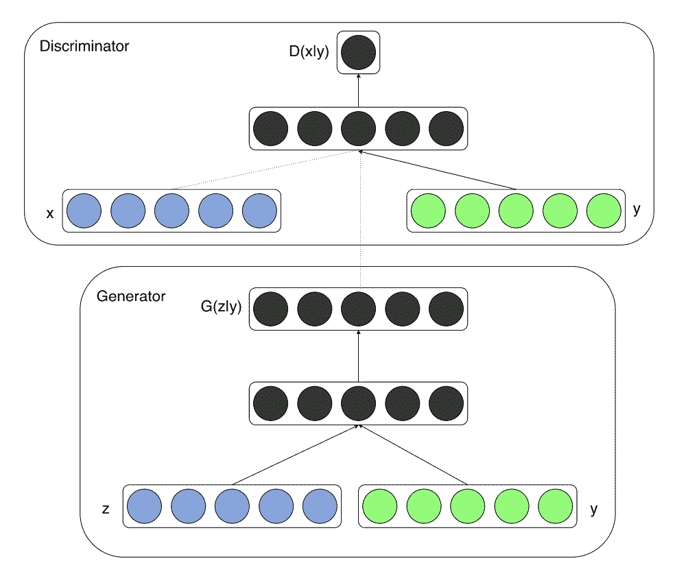
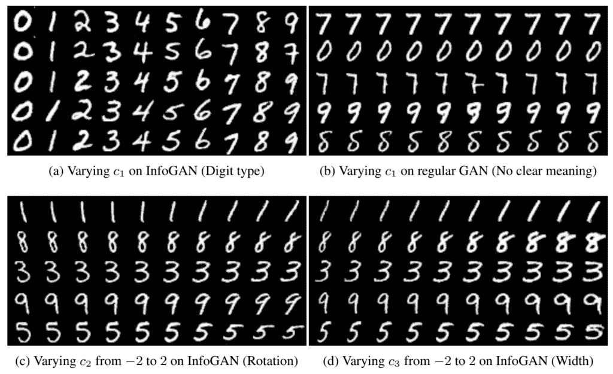
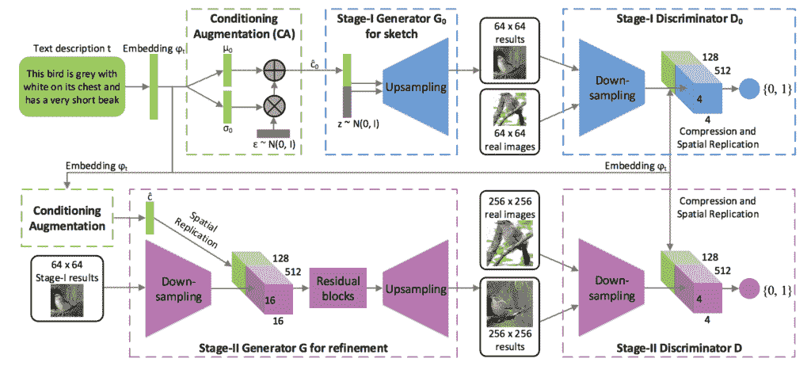
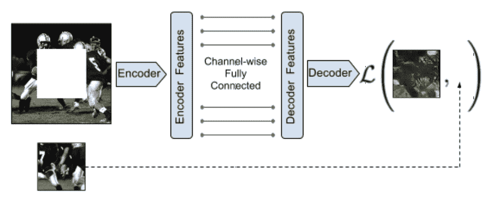
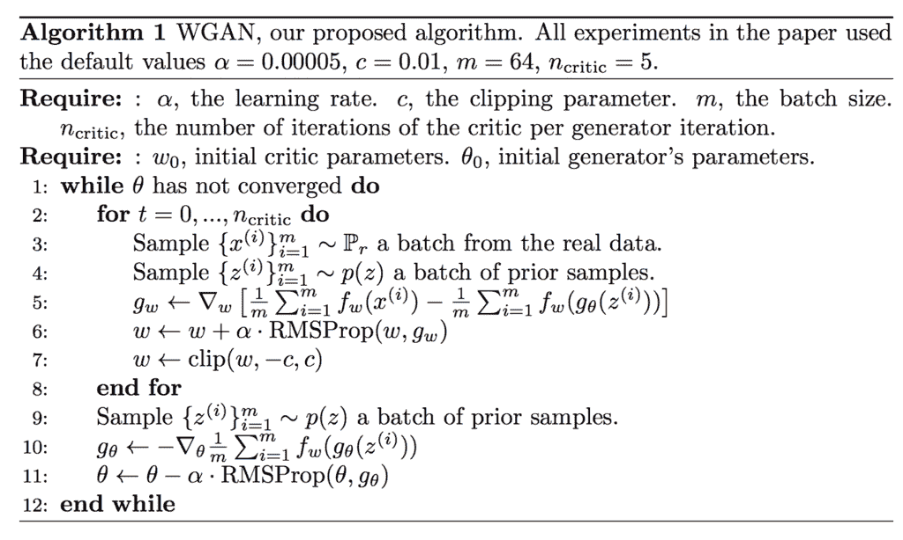
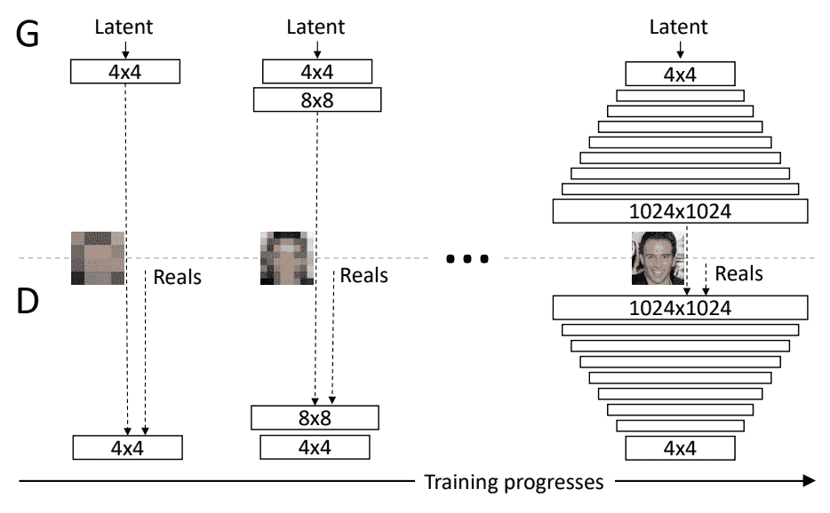
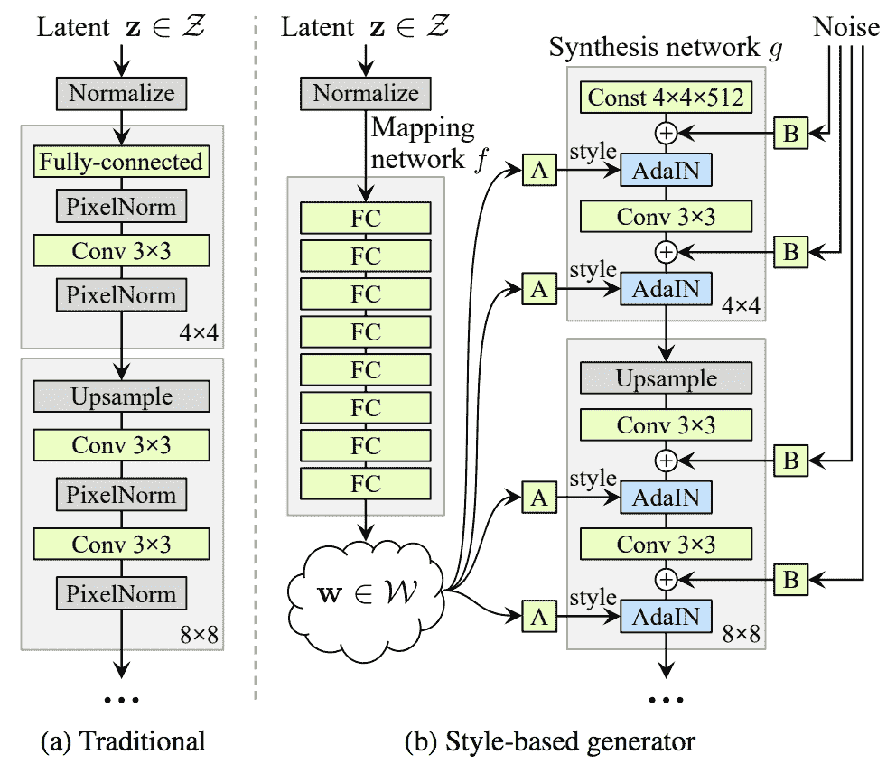

# 生成性对抗网络模型之旅

> 原文:[https://machinelearning master . com/生成-对抗-网络模型之旅/](https://machinelearningmastery.com/tour-of-generative-adversarial-network-models/)

最后更新于 2019 年 7 月 12 日

生成性对抗网络，或称 GANs，是已经获得广泛成功的深度学习架构生成模型。

关于 GANs 的论文有几千篇，命名的-GANs 有几百篇，也就是定义了名字的模型，通常包括“ *GAN* ”，比如 DCGAN，而不是方法的一个小的扩展。考虑到 GAN 文献的巨大规模和模型的数量，知道 GAN 模型应该关注什么至少是令人困惑和沮丧的。

在这篇文章中，你将发现生成性对抗网络模型，你需要知道这些模型才能在这个领域建立有用和有效的基础。

看完这篇文章，你会知道:

*   为研究领域提供基础的基础 GAN 模型。
*   GAN 扩展模型建立在可行的基础上，并为更高级的模型开辟了道路。
*   先进的氮化镓模型，推动了架构的极限，并取得了令人印象深刻的结果。

**用我的新书[Python 生成性对抗网络](https://machinelearningmastery.com/generative_adversarial_networks/)启动你的项目**，包括*分步教程*和所有示例的 *Python 源代码*文件。

我们开始吧。

生成性对抗网络模型和扩展之旅
图片由 [Tomek Niedzwiedz](https://www.flickr.com/photos/132328696@N07/42406855824) 提供，保留部分权利。

## 概观

本教程分为三个部分；它们是:

*   基础
    *   生成性对抗网络
    *   深度卷积生成对抗网络
*   扩展ˌ扩张
    *   条件生成对抗网络
    *   信息最大化生成性对抗网络
    *   辅助分类器生成对抗网络
    *   堆叠生成对抗网络
    *   上下文编码器
    *   Pix2Pix
*   先进的
    *   瓦瑟斯坦生成性对抗网络
    *   循环一致生成对抗网络
    *   渐进增长的生成性对抗网络
    *   基于风格的生成性对抗网络
    *   大生成对抗网络

## 基础生成对抗网络

本节总结了大多数(如果不是全部的话)其他 GAN 所基于的基础 GAN 模型。

### 生成性对抗网络

伊恩·古德费勒等人在 2014 年发表的题为“生成性对抗网络”的论文中描述了生成性对抗网络体系结构和该方法的首次经验演示

该论文简洁地描述了该体系结构，包括一个生成器模型和一个鉴别器模型，该生成器模型将潜在空间中的点作为输入并生成图像，该鉴别器模型将图像分类为真实(来自数据集)或虚假(由生成器输出)。

> 我们提出了一个通过对抗过程估计生成模型的新框架，其中我们同时训练两个模型:捕获数据分布的生成模型 G 和估计样本来自训练数据而不是 G 的概率的判别模型 D。G 的训练过程是最大化 D 出错的概率。

——[生成性对抗网络](https://arxiv.org/abs/1406.2661)，2014。

这些模型由完全连接的层(MLPs)组成，生成器中的 [ReLU 激活](https://machinelearningmastery.com/rectified-linear-activation-function-for-deep-learning-neural-networks/)和鉴别器中的 maxout 激活，并应用于标准图像数据集，如 MNIST 和 CIFAR-10。

> 我们将对抗网络训练为一系列数据集，包括 MNIST、多伦多人脸数据库(TFD)和 CIFAR-10。发生器网络混合使用整流器线性激活和 sigmoid 激活，而鉴别器网络使用 maxout 激活。在训练鉴别器网络时使用了 Dropout。

——[生成性对抗网络](https://arxiv.org/abs/1406.2661)，2014。

### 深度卷积生成对抗网络

深度卷积生成对抗网络，简称 DCGAN，是 GAN 体系结构的扩展，用于将深度卷积神经网络用于生成器和鉴别器模型，以及模型和训练的配置，导致生成器模型的稳定训练。

> 我们引入了一类称为深度卷积生成对抗网络(DCGANs)的 CNNs，它们具有一定的体系结构约束，并证明了它们是无监督学习的强候选。

——[深度卷积生成对抗网络的无监督表示学习](https://arxiv.org/abs/1511.06434)，2015。

DCGAN 很重要，因为它提出了在实践中有效开发高质量发电机模型所需的模型约束。这种架构反过来为大量 GAN 扩展和应用的快速发展提供了基础。

> 我们提出并评估了卷积神经网络体系结构拓扑上的一组约束，这些约束使它们在大多数环境下训练都很稳定。

——[深度卷积生成对抗网络的无监督表示学习](https://arxiv.org/abs/1511.06434)，2015。

## 生成性对抗网络扩展

本节总结了命名的 GAN 模型，这些模型为 GAN 模型体系结构或训练过程提供了一些更常见或广泛使用的离散扩展。

### 条件生成对抗网络

条件生成对抗网络，简称 cGAN，是 GAN 体系结构的扩展，它利用图像之外的信息作为生成器和鉴别器模型的输入。例如，如果类标签可用，它们可以用作输入。

> 如果生成器和鉴别器都以某些额外信息为条件，那么生成对抗网可以扩展到条件模型。y 可以是任何类型的辅助信息，例如类标签或来自其他模态的数据。我们可以通过将 y 作为附加输入层输入鉴别器和发生器来执行调节。

——[条件生成对抗网](https://arxiv.org/abs/1411.1784)，2014。

条件生成对抗网络模型架构示例。
摘自:条件生成对抗网。

### 信息最大化生成性对抗网络

信息生成对抗网络，简称 InfoGAN，是 GAN 的扩展，它试图为生成器构建输入或潜在空间。具体来说，目标是为潜在空间中的变量添加特定的语义含义。

> …，当从 MNIST 数据集生成图像时，如果模型自动选择分配一个离散的随机变量来表示手指的数字标识(0-9)，并选择有两个额外的连续变量来表示手指的角度和手指笔画的粗细，这将是理想的。

——[InfoGAN:通过信息最大化生成对抗网进行可解释表征学习](https://arxiv.org/abs/1606.03657)，2016。

这是通过将潜在空间中的点分成噪声和潜在代码来实现的。潜在代码随后被用于调节或控制生成的图像中的特定语义属性。

> ……我们建议将输入噪声向量分解为两部分，而不是使用单一的非结构化噪声向量:(i) z，它被视为不可压缩噪声的来源；(ii) c，我们称之为潜在代码，目标是数据分布的显著结构化语义特征

——[InfoGAN:通过信息最大化生成对抗网进行可解释表征学习](https://arxiv.org/abs/1606.03657)，2016。

使用潜在代码改变生成的手写数字特征的示例。
摘自:InfoGAN:信息最大化生成对抗网的可解释表征学习。

### 辅助分类器生成对抗网络

辅助分类器生成对抗网络(AC-GAN)是 GAN 的扩展，它既像 cGAN 一样将生成器更改为类条件，又为经过训练以重建类标签的鉴别器添加附加或辅助模型。

> …我们引入了一个模型，它结合了利用辅助信息的两种策略。也就是说，下面提出的模型是类条件的，但是带有一个辅助解码器，其任务是重构类标签。

——[辅助分类器条件图像合成 GANs](https://arxiv.org/abs/1610.09585) ，2016。

这种体系结构意味着鉴别器既预测给定类别标签的图像的可能性，也预测给定图像的类别标签的可能性。

> 鉴别器给出了源上的概率分布和类标签上的概率分布，P(S | X)，P(C | X) = D(X)。

——[辅助分类器条件图像合成 GANs](https://arxiv.org/abs/1610.09585) ，2016。

### 堆叠生成对抗网络

堆叠生成性对抗网络，或称堆叠网络，是遗传神经网络的扩展，使用条件遗传神经网络模型的分层堆叠从文本生成图像。

> ……我们提出堆叠生成对抗网络(StackGAN)来生成以文本描述为条件的 256×256 的照片真实感图像。

——[stack gan:使用堆叠生成对抗网络的文本到照片真实感图像合成](https://arxiv.org/abs/1612.03242)，2016 年。

该架构由一系列基于文本和图像的 GAN 模型组成。第一级发生器(第一级 GAN)以文本为条件，产生低分辨率图像。第二级发生器(第二级氮化镓)以文本和第一级输出的低分辨率图像为条件，输出高分辨率图像。

> 低分辨率图像首先由我们的第一阶段 GAN 生成。在我们的第一阶段 GAN 的顶部，我们堆叠第二阶段 GAN，以根据第一阶段结果和文本描述生成逼真的高分辨率(例如，256×256)图像。通过再次调节阶段一的结果和文本，阶段二的 GAN 学会捕捉被阶段一的 GAN 省略的文本信息，并为对象绘制更多的细节

——[stack gan:使用堆叠生成对抗网络的文本到照片真实感图像合成](https://arxiv.org/abs/1612.03242)，2016 年。

用于文本到图像生成的堆叠生成对抗网络的体系结构示例。
摄自:StackGAN:使用堆叠生成对抗网络的文本到照片真实感图像合成。

### 上下文编码器

上下文编码器模型是用于条件图像生成的编码器-解码器模型，使用为 GANs 设计的对抗方法进行训练。虽然在论文中没有将其称为 GAN 模型，但它具有许多 GAN 特性。

> 通过与自动编码器的类比，我们提出了上下文编码器——一种卷积神经网络，它被训练来生成以周围环境为条件的任意图像区域的内容。

——[上下文编码器:通过修复进行特征学习](https://arxiv.org/abs/1604.07379)，2016。

上下文编码器编码器-解码器模型架构示例。
摘自:上下文编码器:通过修复进行特征学习

用联合损失训练该模型，该联合损失结合了发生器和鉴别器模型的对抗损失和计算预测和预期输出图像之间的向量范数距离的重建损失。

> 当训练上下文编码器时，我们已经试验了标准像素级重建损失，以及重建加对抗损失。后者产生更清晰的结果，因为它可以更好地处理输出中的多种模式。

——[上下文编码器:通过修复进行特征学习](https://arxiv.org/abs/1604.07379)，2016。

### Pix2Pix

pix2pix 模型是用于图像条件图像生成的 GAN 的扩展，称为任务图像到图像翻译。生成器模型采用 U-Net 模型架构，鉴别器模型采用 PatchGAN 模型架构。

> 我们的方法在生成器和鉴别器的几个架构选择上也不同于先前的工作。与以往的工作不同，对于我们的生成器，我们使用了基于“U-Net”的体系结构，对于我们的鉴别器，我们使用了卷积的“PatchGAN”分类器，它只在图像块的尺度上惩罚结构。

——[条件对抗网络下的图像到图像翻译](https://arxiv.org/abs/1611.07004)，2016。

生成器模型的损失被更新，以包括到目标输出图像的矢量距离。

> 鉴别器的工作保持不变，但是生成器的任务不仅是愚弄鉴别器，而且是在 L2 意义上接近地面真实输出。我们还探索了这个选项，使用 L1 距离而不是 L2，因为 L1 鼓励减少模糊。

——[条件对抗网络下的图像到图像翻译](https://arxiv.org/abs/1611.07004)，2016。

## 高级生成对抗网络

本节列出了最近在先前的氮化镓扩展的基础上导致令人惊讶或印象深刻的结果的氮化镓模型。

这些模型主要集中在允许生成大的真实感图像的开发上。

### 瓦瑟斯坦生成性对抗网络

瓦瑟斯坦生成对抗网络，简称 WGAN，是 GAN 的一个扩展，它改变训练过程来更新鉴别器模型，现在被称为批评家，每次迭代比生成器模型多很多倍。

瓦瑟斯坦生成对抗网络的算法。
取自:瓦瑟斯坦 GAN。

批评器被更新以输出实值(线性激活)，而不是具有 sigmoid 激活的二进制预测，并且批评器和生成器模型都使用“*瓦瑟斯坦损失*来训练，该损失是来自批评器的实值和预测值的乘积的平均值，设计用于提供对更新模型有用的线性梯度。

> 鉴别器学习辨别真假非常快，而且不出所料，没有提供可靠的梯度信息。然而，批评家不能饱和，并且收敛到一个线性函数，该函数在任何地方都给出非常干净的梯度。我们限制权重的事实限制了函数在空间的不同部分至多线性的可能增长，迫使最优批评家具有这种行为。

——2017 年[一根筋](https://arxiv.org/abs/1701.07875)。

此外，批评模型的权重被剪裁以保持较小，例如[-0.01 的边界框。0.01].

> 为了使参数 W 位于一个紧凑的空间中，我们可以做一些简单的事情，即在每次梯度更新后将权重固定在一个固定的框中(比如 W =[0.01，0.01]l)。

——2017 年[一根筋](https://arxiv.org/abs/1701.07875)。

### 循环一致生成对抗网络

循环一致生成对抗网络，简称 CycleGAN，是 GAN 的扩展，用于在没有成对图像数据的情况下进行图像到图像的翻译。这意味着目标图像的例子并不像条件 GANs 那样是必需的，例如 Pix2Pix。

> …对于许多任务，配对的训练数据将不可用。我们提出了一种在没有配对例子的情况下学习将图像从源域 X 翻译到目标域 Y 的方法。

——[使用循环一致对抗网络的不成对图像到图像翻译](https://arxiv.org/abs/1703.10593)，2017。

他们的方法寻求“*周期一致性*”，使得从一个域到另一个域的图像翻译是可逆的，这意味着它形成了一个一致的翻译周期。

> ……我们利用了翻译应该“循环一致”的特性，也就是说，如果我们把一个句子从英语翻译成法语，然后再把它从法语翻译回英语，我们就应该回到原来的句子

——[使用循环一致对抗网络的不成对图像到图像翻译](https://arxiv.org/abs/1703.10593)，2017。

这是通过拥有两个生成器模型来实现的:一个用于将 X 转换为 Y，另一个用于重构给定的 Y。

> ……我们的模型包括两个映射 G : X -> Y 和 F : Y -> X，此外，我们引入了两个对抗性判别器 DX 和 DY，其中 DX 旨在区分图像{x}和翻译图像{ F(Y)}；同样，DY 旨在区分{y}和{G(x)}。

——[使用循环一致对抗网络的不成对图像到图像翻译](https://arxiv.org/abs/1703.10593)，2017。

### 渐进增长的生成性对抗网络

渐进增长的生成性对抗网络，简称渐进 GAN，是对 GAN 模型的架构和训练的改变，包括在训练过程中逐步增加模型深度。

> 关键思想是逐步增长生成器和鉴别器:从低分辨率开始，我们添加新的层，随着训练的进行，这些层对越来越精细的细节进行建模。这既加快了训练速度，又极大地稳定了训练，使我们能够生成前所未有质量的图像…

——[为提高质量、稳定性和变化性而进行的肝的渐进生长](https://arxiv.org/abs/1710.10196)，2017 年。

这是通过在训练期间保持生成器和鉴别器在深度上对称并逐步添加层来实现的，很像深度神经网络早期开发中的贪婪逐层预训练技术，只是先前层中的权重没有冻结。

> 我们使用的生成器和鉴别器网络是彼此的镜像，并且总是同步增长。两个网络中的所有现有层在整个训练过程中都是可训练的。当新图层添加到网络中时，我们会平滑地淡入它们…

——[为提高质量、稳定性和变化性而进行的肝的渐进生长](https://arxiv.org/abs/1710.10196)，2017 年。

训练过程中生成性对抗网络逐渐发展的例子。
取自:为提高质量、稳定性和变异而进行的肝的渐进生长。

### 大生成对抗网络

大生成性对抗网络，简称 BigGAN，是一种展示如何通过扩展现有的类条件 GAN 模型来创建高质量输出图像的方法。

> 我们证明，与现有技术相比，GANs 从扩展中受益匪浅，训练模型的参数是现有技术的 2 到 4 倍，批量是现有技术的 8 倍

——[高保真自然图像合成的大规模 GAN 训练](https://arxiv.org/abs/1809.11096)，2018。

模型架构是基于一系列 GAN 模型和扩展的最佳实践的集合。通过系统的实验实现了进一步的改进。

使用“*截断技巧*”，其中在生成时从截断的高斯潜在空间采样点，这不同于训练时的未截断分布。

> 值得注意的是，我们最好的结果来自于使用与训练中不同的潜在抽样分布。采用用 z∞N(0，1)训练的模型并从截断的法线采样 z(其中落在范围之外的值被重新采样以落在该范围之内)立即提供了提升

——[高保真自然图像合成的大规模 GAN 训练](https://arxiv.org/abs/1809.11096)，2018。

### 基于风格的生成性对抗网络

基于样式的生成对抗网络，简称 StyleGAN，是生成器的扩展，它允许潜在代码在模型的不同点用作输入，以控制生成图像的特征。

> …我们重新设计了生成器架构，以展示控制图像合成过程的新颖方法。我们的生成器从学习的常量输入开始，并基于潜在代码调整每个卷积层的图像“样式”，从而直接控制不同比例下图像特征的强度。

——[一种基于风格的生成性对抗网络生成器架构](https://arxiv.org/abs/1812.04948)，2018 年。

代替将潜在空间中的点作为输入，该点在被提供作为发生器模型中的多个点的输入之前通过深度嵌入网络被馈送。此外，噪声也随着嵌入网络的输出而增加。

> 传统上，潜在代码是通过输入层提供给生成器的[……]我们从这个设计出发，完全省略了输入层，而是从一个已知的常数开始。给定输入潜在空间 Z 中的潜在代码 Z，非线性映射网络 f : Z -> W 首先产生 w ∈ W。

——[一种基于风格的生成性对抗网络生成器架构](https://arxiv.org/abs/1812.04948)，2018 年。

传统生成器体系结构与基于样式的生成器模型体系结构的比较示例。
摘自:生成性对抗网络的基于风格的生成器架构。

## 进一步阅读

如果您想更深入地了解这个主题，本节将提供更多资源。

### 基础论文

*   [生成性对抗网络](https://arxiv.org/abs/1406.2661)，2014。
*   [深度卷积生成对抗网络的无监督表示学习](https://arxiv.org/abs/1511.06434)，2015。

### 扩展文件

*   [条件生成对抗网](https://arxiv.org/abs/1411.1784)，2014。
*   [InfoGAN:通过信息最大化生成对抗网络进行可解释表征学习](https://arxiv.org/abs/1606.03657)，2016。
*   [辅助分类器的条件图像合成 GANs](https://arxiv.org/abs/1610.09585) ，2016。
*   [StackGAN:使用堆叠生成对抗网络的文本到照片真实感图像合成](https://arxiv.org/abs/1612.03242)，2016。
*   [上下文编码器:通过修复进行特征学习](https://arxiv.org/abs/1604.07379)，2016。
*   [条件对抗网络下的图像到图像翻译](https://arxiv.org/abs/1611.07004)，2016。

### 高级论文

*   [水的输入 gan](https://arxiv.org/abs/1701.07875)2017 年。
*   [使用循环一致对抗网络的不成对图像到图像翻译](https://arxiv.org/abs/1703.10593)，2017。
*   [为改善质量、稳定性和变异而进行的肝的渐进生长](https://arxiv.org/abs/1710.10196)，2017 年。
*   [一种基于风格的生成对抗网络生成器架构](https://arxiv.org/abs/1812.04948)，2018。
*   [高保真自然图像合成的大规模 GAN 训练](https://arxiv.org/abs/1809.11096)，2018。

### 文章

*   [Keras-GAN:生成性对抗网络的 Keras 实现](https://github.com/eriklindernoren/Keras-GAN)。
*   [the-gan-zoo:一份所有被命名的 gan 的名单！](https://github.com/hindupuravinash/the-gan-zoo)

## 摘要

在这篇文章中，你发现了生成性对抗网络模型，你需要知道这些模型才能在这个领域建立有用和有效的基础

具体来说，您了解到:

*   为研究领域提供基础的基础 GAN 模型。
*   GAN 扩展模型建立在可行的基础上，并为更高级的模型开辟了道路。
*   先进的氮化镓模型，推动了架构的极限，并取得了令人印象深刻的结果。

你有什么问题吗？
在下面的评论中提问，我会尽力回答。