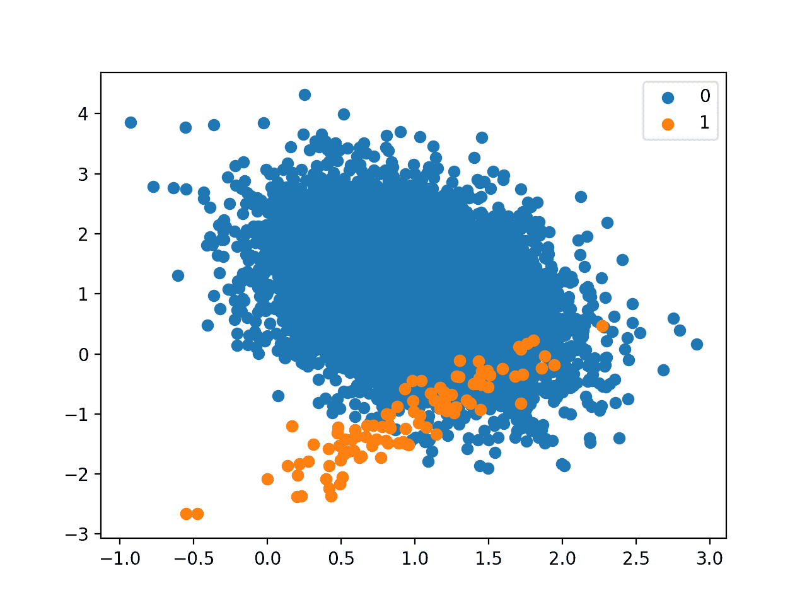

# 用于不平衡分类的成本敏感决策树

> 原文：<https://machinelearningmastery.com/cost-sensitive-decision-trees-for-imbalanced-classification/>

最后更新于 2020 年 8 月 21 日

决策树算法对于平衡分类是有效的，尽管它在不平衡的数据集上表现不佳。

选择树的分割点，以便最好地将示例分成两组，同时最小化混合。当两个组都被来自一个类的例子支配时，用于选择分裂点的标准将看到良好的分离，而事实上，来自少数类的例子被忽略了。

这个问题可以通过修改用于评估分割点的标准来克服，以考虑每个类的重要性，通常称为加权分割点或加权决策树。

在本教程中，您将发现用于不平衡分类的加权决策树。

完成本教程后，您将知道:

*   标准决策树算法如何不支持不平衡分类？
*   选择拆分时如何修改决策树算法以按类权重加权模型误差。
*   如何为决策树算法配置类权重，如何网格搜索不同的类权重配置。

**用我的新书[Python 不平衡分类](https://machinelearningmastery.com/imbalanced-classification-with-python/)启动你的项目**，包括*分步教程*和所有示例的 *Python 源代码*文件。

我们开始吧。


如何实现不平衡分类的加权决策树
[Bonnie Moreland](https://flickr.com/photos/icetsarina/33074457825/)摄，保留部分权利。

## 教程概述

本教程分为四个部分；它们是:

1.  不平衡分类数据集
2.  不平衡分类的决策树
3.  基于 Scikit-Learn 的加权决策树
4.  网格搜索加权决策树

## 不平衡分类数据集

在我们深入研究不平衡分类的决策修改之前，让我们首先定义一个不平衡分类数据集。

我们可以使用 [make_classification()函数](https://scikit-learn.org/stable/modules/generated/sklearn.datasets.make_classification.html)定义一个合成的不平衡两类分类数据集。我们将生成 10，000 个少数与多数类比例大约为 1:100 的示例。

```py
...
# define dataset
X, y = make_classification(n_samples=10000, n_features=2, n_redundant=0,
	n_clusters_per_class=1, weights=[0.99], flip_y=0, random_state=3)
```

生成后，我们可以总结类分布，以确认数据集是按照我们的预期创建的。

```py
...
# summarize class distribution
counter = Counter(y)
print(counter)
```

最后，我们可以创建示例的散点图，并按类别标签对它们进行着色，以帮助理解从该数据集中对示例进行分类的挑战。

```py
...
# scatter plot of examples by class label
for label, _ in counter.items():
	row_ix = where(y == label)[0]
	pyplot.scatter(X[row_ix, 0], X[row_ix, 1], label=str(label))
pyplot.legend()
pyplot.show()
```

将这些联系在一起，下面列出了生成合成数据集和绘制示例的完整示例。

```py
# Generate and plot a synthetic imbalanced classification dataset
from collections import Counter
from sklearn.datasets import make_classification
from matplotlib import pyplot
from numpy import where
# define dataset
X, y = make_classification(n_samples=10000, n_features=2, n_redundant=0,
	n_clusters_per_class=1, weights=[0.99], flip_y=0, random_state=3)
# summarize class distribution
counter = Counter(y)
print(counter)
# scatter plot of examples by class label
for label, _ in counter.items():
	row_ix = where(y == label)[0]
	pyplot.scatter(X[row_ix, 0], X[row_ix, 1], label=str(label))
pyplot.legend()
pyplot.show()
```

运行该示例首先创建数据集并总结类分布。

我们可以看到，数据集具有大约 1:100 的类分布，多数类中的示例不到 10，000 个，少数类中的示例不到 100 个。

```py
Counter({0: 9900, 1: 100})
```

接下来，创建数据集的散点图，显示多数类的大量示例(蓝色)和少数类的少量示例(橙色)，并有一些适度的类重叠。



1-100 类不平衡的二进制分类数据集散点图

接下来，我们可以在数据集上拟合标准决策树模型。

决策树可以使用 scikit-learn 库中的[决策树分类器](https://scikit-learn.org/stable/modules/generated/sklearn.tree.DecisionTreeClassifier.html)类来定义。

```py
...
# define model
model = DecisionTreeClassifier()
```

我们将使用重复交叉验证来评估模型，重复三次 [10 倍交叉验证](https://machinelearningmastery.com/k-fold-cross-validation/)。模式表现将使用重复和所有折叠的平均曲线下面积来报告。

```py
...
# define evaluation procedure
cv = RepeatedStratifiedKFold(n_splits=10, n_repeats=3, random_state=1)
# evaluate model
scores = cross_val_score(model, X, y, scoring='roc_auc', cv=cv, n_jobs=-1)
# summarize performance
print('Mean ROC AUC: %.3f' % mean(scores))
```

将这些联系在一起，下面列出了定义和评估不平衡分类问题的标准决策树模型的完整示例。

决策树是二进制分类任务的有效模型，尽管默认情况下，它们在不平衡分类方面并不有效。

```py
# fit a decision tree on an imbalanced classification dataset
from numpy import mean
from sklearn.datasets import make_classification
from sklearn.model_selection import cross_val_score
from sklearn.model_selection import RepeatedStratifiedKFold
from sklearn.tree import DecisionTreeClassifier
# generate dataset
X, y = make_classification(n_samples=10000, n_features=2, n_redundant=0,
	n_clusters_per_class=1, weights=[0.99], flip_y=0, random_state=3)
# define model
model = DecisionTreeClassifier()
# define evaluation procedure
cv = RepeatedStratifiedKFold(n_splits=10, n_repeats=3, random_state=1)
# evaluate model
scores = cross_val_score(model, X, y, scoring='roc_auc', cv=cv, n_jobs=-1)
# summarize performance
print('Mean ROC AUC: %.3f' % mean(scores))
```

运行该示例评估不平衡数据集上的标准决策树模型，并报告平均 ROC AUC。

**注**:考虑到算法或评估程序的随机性，或数值精度的差异，您的[结果可能会有所不同](https://machinelearningmastery.com/different-results-each-time-in-machine-learning/)。考虑运行该示例几次，并比较平均结果。

我们可以看到模型有技巧，实现了 0.5 以上的 ROC AUC，在这种情况下实现了 0.746 的平均得分。

```py
Mean ROC AUC: 0.746
```

这为标准决策树算法的任何修改提供了一个比较基准。

## 不平衡分类的决策树

决策树算法也被称为[分类和回归树](https://machinelearningmastery.com/classification-and-regression-trees-for-machine-learning/) (CART)，包括从训练数据集中生长一棵树来分类例子。

可以认为树划分了训练数据集，其中示例沿着树的决策点向下前进，到达树的叶子，并被分配一个类标签。

该树是通过使用数据集中的变量值拆分训练数据集来构建的。在每一点上，以贪婪的方式选择导致最纯(最少混合)的示例组的数据分割。

这里，纯度意味着将实例干净地分成组，其中所有 0 或所有 1 类的一组实例是最纯的，两类的 50-50 混合物是最不纯的。纯度最常用基尼杂质计算，虽然也可以用[熵](https://machinelearningmastery.com/information-gain-and-mutual-information/)计算。

纯度度量的计算包括计算给定类别的示例被拆分错误分类的概率。计算这些概率包括对每组中每一类的例子数量进行求和。

拆分标准可以更新，不仅要考虑拆分的纯度，还要根据每个类的重要性进行加权。

> 对于成本敏感的树归纳，我们的直觉是修改实例的权重，使其与错误分类实例所属类的成本成比例…

——[一种诱导成本敏感树的实例加权方法](https://ieeexplore.ieee.org/document/1000348)，2002。

这可以通过用加权和代替每组中的实例数来实现，其中提供系数来加权和。

较大的权重分配给重要性较高的类，较小的权重分配给重要性较低的类。

*   **小权重**:重要性较小，对节点纯度影响较小。
*   **大权重**:重要性更高，对节点纯度影响更大。

可以给多数类分配一个较小的权重，这可以提高(降低)节点的纯度分数，否则该节点可能看起来排序不太好。反过来，这可能允许多数阶级的更多例子被归类为少数阶级，更好地适应少数阶级的那些例子。

> 更高的权重[被]分配给来自错误分类成本值更高的类的实例。

—第 71 页，[从不平衡数据集](https://amzn.to/307Xlva)中学习，2018。

因此，决策树算法的这种修改被称为加权决策树、类加权决策树或成本敏感决策树。

分裂点计算的修改是最常见的，尽管已经对决策树构造算法的一系列其他修改进行了大量研究，以更好地适应类别不平衡。

## 带 Scikit-Learn 的加权决策树

scikit-learn Python 机器学习库提供了支持类加权的决策树算法的实现。

[决策树分类器类](https://scikit-learn.org/stable/modules/generated/sklearn.tree.DecisionTreeClassifier.html)提供了可以指定为模型超参数的*类权重*参数。*类别权重*是一个字典，它定义了每个类别标签(例如 0 和 1)以及权重，当拟合模型时，该权重应用于决策树中拆分的组纯度计算。

例如，每个类别 0 和 1 的 1 比 1 权重可以定义如下:

```py
...
# define model
weights = {0:1.0, 1:1.0}
model = DecisionTreeClassifier(class_weight=weights)
```

类别称重可以多种方式定义；例如:

*   **领域专长**，通过与主题专家交谈确定。
*   **调谐**，由超参数搜索如网格搜索确定。
*   **启发式**，使用一般最佳实践指定。

使用类别权重的最佳实践是使用训练数据集中类别分布的倒数。

例如，测试数据集的类分布是少数类与多数类的比例为 1:100。该比率的倒数可以与多数类的 1 和少数类的 100 一起使用。

例如:

```py
...
# define model
weights = {0:1.0, 1:100.0}
model = DecisionTreeClassifier(class_weight=weights)
```

我们也可以使用分数来定义相同的比率，并获得相同的结果。

例如:

```py
...
# define model
weights = {0:0.01, 1:1.0}
model = DecisionTreeClassifier(class_weight=weights)
```

通过将*类权重*设置为“*平衡*，可以直接使用该启发式算法。

例如:

```py
...
# define model
model = DecisionTreeClassifier(class_weight='balanced')
```

我们可以使用上一节中定义的相同评估过程来评估带有类权重的决策树算法。

我们期望决策树的类加权版本比没有任何类加权的标准版本的决策树表现得更好。

下面列出了完整的示例。

```py
# decision tree with class weight on an imbalanced classification dataset
from numpy import mean
from sklearn.datasets import make_classification
from sklearn.model_selection import cross_val_score
from sklearn.model_selection import RepeatedStratifiedKFold
from sklearn.tree import DecisionTreeClassifier
# generate dataset
X, y = make_classification(n_samples=10000, n_features=2, n_redundant=0,
	n_clusters_per_class=1, weights=[0.99], flip_y=0, random_state=3)
# define model
model = DecisionTreeClassifier(class_weight='balanced')
# define evaluation procedure
cv = RepeatedStratifiedKFold(n_splits=10, n_repeats=3, random_state=1)
# evaluate model
scores = cross_val_score(model, X, y, scoring='roc_auc', cv=cv, n_jobs=-1)
# summarize performance
print('Mean ROC AUC: %.3f' % mean(scores))
```

运行该示例准备合成不平衡分类数据集，然后使用重复交叉验证评估决策树算法的类加权版本。

**注**:考虑到算法或评估程序的随机性，或数值精度的差异，您的[结果可能会有所不同](https://machinelearningmastery.com/different-results-each-time-in-machine-learning/)。考虑运行该示例几次，并比较平均结果。

在这种情况下，报告的平均 ROC AUC 分数显示出比决策树算法的未加权版本更好的分数:0.759，而不是 0.746。

```py
Mean ROC AUC: 0.759
```

## 网格搜索加权决策树

使用与训练数据成反比的类权重只是一种启发。

使用不同的类权重可以获得更好的表现，这也将取决于用于评估模型的表现度量的选择。

在本节中，我们将网格搜索一系列不同的类别权重，以获得加权决策树，并发现哪一个导致最佳的 ROC AUC 分数。

我们将对类别 0 和 1 尝试以下权重:

*   0:100 班，1:1 班。
*   0:10 班，1:1 班。
*   0:1 班，1:1 班。
*   0:1 班，1:10 班。
*   0:1 班，1:100 班。

这些可以被定义为[网格搜索参数，如下所示:](https://scikit-learn.org/stable/modules/generated/sklearn.model_selection.GridSearchCV.html)

```py
...
# define grid
balance = [{0:100,1:1}, {0:10,1:1}, {0:1,1:1}, {0:1,1:10}, {0:1,1:100}]
param_grid = dict(class_weight=balance)
```

我们可以使用重复交叉验证对这些参数执行网格搜索，并使用 ROC AUC 估计模型表现:

```py
...
# define evaluation procedure
cv = RepeatedStratifiedKFold(n_splits=10, n_repeats=3, random_state=1)
# define grid search
grid = GridSearchCV(estimator=model, param_grid=param_grid, n_jobs=-1, cv=cv, scoring='roc_auc')
```

一旦执行，我们可以将最佳配置以及所有结果总结如下:

```py
...
# report the best configuration
print("Best: %f using %s" % (grid_result.best_score_, grid_result.best_params_))
# report all configurations
means = grid_result.cv_results_['mean_test_score']
stds = grid_result.cv_results_['std_test_score']
params = grid_result.cv_results_['params']
for mean, stdev, param in zip(means, stds, params):
    print("%f (%f) with: %r" % (mean, stdev, param))
```

将这些联系在一起，下面的示例在不平衡的数据集上为决策树算法搜索五个不同的类权重。

我们可能会认为启发式类加权是表现最好的配置。

```py
# grid search class weights with decision tree for imbalance classification
from numpy import mean
from sklearn.datasets import make_classification
from sklearn.model_selection import GridSearchCV
from sklearn.model_selection import RepeatedStratifiedKFold
from sklearn.tree import DecisionTreeClassifier
# generate dataset
X, y = make_classification(n_samples=10000, n_features=2, n_redundant=0,
	n_clusters_per_class=1, weights=[0.99], flip_y=0, random_state=3)
# define model
model = DecisionTreeClassifier()
# define grid
balance = [{0:100,1:1}, {0:10,1:1}, {0:1,1:1}, {0:1,1:10}, {0:1,1:100}]
param_grid = dict(class_weight=balance)
# define evaluation procedure
cv = RepeatedStratifiedKFold(n_splits=10, n_repeats=3, random_state=1)
# define grid search
grid = GridSearchCV(estimator=model, param_grid=param_grid, n_jobs=-1, cv=cv, scoring='roc_auc')
# execute the grid search
grid_result = grid.fit(X, y)
# report the best configuration
print("Best: %f using %s" % (grid_result.best_score_, grid_result.best_params_))
# report all configurations
means = grid_result.cv_results_['mean_test_score']
stds = grid_result.cv_results_['std_test_score']
params = grid_result.cv_results_['params']
for mean, stdev, param in zip(means, stds, params):
    print("%f (%f) with: %r" % (mean, stdev, param))
```

运行该示例使用重复的 k 倍交叉验证评估每个类别权重，并报告最佳配置和相关的平均 ROC AUC 分数。

**注**:考虑到算法或评估程序的随机性，或数值精度的差异，您的[结果可能会有所不同](https://machinelearningmastery.com/different-results-each-time-in-machine-learning/)。考虑运行该示例几次，并比较平均结果。

在这种情况下，我们可以看到 1:100 的多数对少数类权重获得了最佳的平均 ROC 分数。这与一般启发式算法的配置相匹配。

探索更严格的类别权重，看看它们对平均 ROC AUC 评分的影响，可能会很有趣。

```py
Best: 0.752643 using {'class_weight': {0: 1, 1: 100}}
0.737306 (0.080007) with: {'class_weight': {0: 100, 1: 1}}
0.747306 (0.075298) with: {'class_weight': {0: 10, 1: 1}}
0.740606 (0.074948) with: {'class_weight': {0: 1, 1: 1}}
0.747407 (0.068104) with: {'class_weight': {0: 1, 1: 10}}
0.752643 (0.073195) with: {'class_weight': {0: 1, 1: 100}}
```

## 进一步阅读

如果您想更深入地了解这个主题，本节将提供更多资源。

### 报纸

*   [一种诱导成本敏感树的实例加权方法](https://ieeexplore.ieee.org/document/1000348)，2002。

### 书

*   [从不平衡数据集中学习](https://amzn.to/307Xlva)，2018。
*   [不平衡学习:基础、算法和应用](https://amzn.to/32K9K6d)，2013。

### 蜜蜂

*   [sklearn . utils . class _ weight . compute _ class _ weight API](https://scikit-learn.org/stable/modules/generated/sklearn.utils.class_weight.compute_class_weight.html)。
*   [硬化. tree .决策树分类器 API](https://scikit-learn.org/stable/modules/generated/sklearn.tree.DecisionTreeClassifier.html) 。
*   [sklearn.model_selection。GridSearchCV API](https://scikit-learn.org/stable/modules/generated/sklearn.model_selection.GridSearchCV.html) 。

## 摘要

在本教程中，您发现了用于不平衡分类的加权决策树。

具体来说，您了解到:

*   标准决策树算法如何不支持不平衡分类？
*   选择拆分时如何修改决策树算法以按类权重加权模型误差。
*   如何为决策树算法配置类权重，如何网格搜索不同的类权重配置。

你有什么问题吗？
在下面的评论中提问，我会尽力回答。