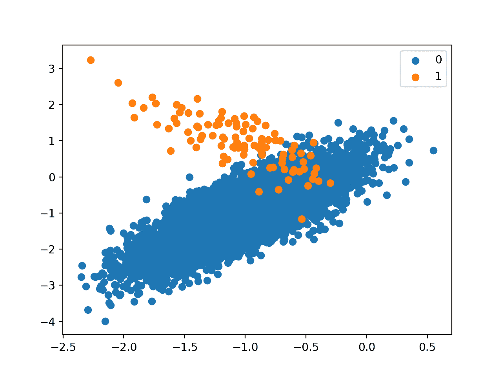

# 成本敏感的不平衡分类 SVM

> 原文:[https://machinelearning master . com/成本敏感-SVM-针对不平衡分类/](https://machinelearningmastery.com/cost-sensitive-svm-for-imbalanced-classification/)

最后更新于 2020 年 8 月 21 日

支持向量机算法对于平衡分类是有效的，尽管它在不平衡数据集上表现不佳。

SVM 算法找到了一个超平面决策边界，可以最好地将示例分为两类。通过使用允许某些点被错误分类的边距，分割变得柔和。默认情况下，该余量有利于不平衡数据集上的多数类，尽管它可以更新以考虑每个类的重要性，并显著提高算法在具有偏斜类分布的数据集上的性能。

SVM 的这种将边际与阶级重要性成正比的修正通常被称为加权 SVM，或成本敏感型 SVM。

在本教程中，您将发现用于不平衡分类的加权支持向量机。

完成本教程后，您将知道:

*   标准支持向量机算法对不平衡分类的限制。
*   如何修改支持向量机算法以在训练过程中根据类的重要性来加权边际惩罚。
*   如何为 SVM 配置类别权重，以及如何网格搜索不同的类别权重配置。

**用我的新书[Python 不平衡分类](https://machinelearningmastery.com/imbalanced-classification-with-python/)启动你的项目**，包括*分步教程*和所有示例的 *Python 源代码*文件。

我们开始吧。


如何实现加权支持向量机不平衡分类
图片由 [Bas Leenders](https://flickr.com/photos/basl/7843896514/) 提供，保留部分权利。

## 教程概述

本教程分为四个部分；它们是:

1.  不平衡分类数据集
2.  不平衡分类 SVM
3.  用 Scikit 学习加权 SVM
4.  网格搜索加权 SVM

## 不平衡分类数据集

在我们深入研究 SVM 对不平衡分类的修改之前，让我们首先定义一个不平衡分类数据集。

我们可以使用 [make_classification()函数](https://scikit-learn.org/stable/modules/generated/sklearn.datasets.make_classification.html)定义一个合成的不平衡两类分类数据集。我们将生成 10，000 个少数与多数类比例大约为 1:100 的示例。

```
...
# define dataset
X, y = make_classification(n_samples=10000, n_features=2, n_redundant=0,
	n_clusters_per_class=1, weights=[0.99], flip_y=0, random_state=4)
```

生成后，我们可以总结类分布，以确认数据集是按照我们的预期创建的。

```
...
# summarize class distribution
counter = Counter(y)
print(counter)
```

最后，我们可以创建示例的散点图，并按类别标签对它们进行着色，以帮助理解从该数据集中对示例进行分类的挑战。

```
...
# scatter plot of examples by class label
for label, _ in counter.items():
	row_ix = where(y == label)[0]
	pyplot.scatter(X[row_ix, 0], X[row_ix, 1], label=str(label))
pyplot.legend()
pyplot.show()
```

将这些联系在一起，下面列出了生成合成数据集和绘制示例的完整示例。

```
# Generate and plot a synthetic imbalanced classification dataset
from collections import Counter
from sklearn.datasets import make_classification
from matplotlib import pyplot
from numpy import where
# define dataset
X, y = make_classification(n_samples=10000, n_features=2, n_redundant=0,
	n_clusters_per_class=1, weights=[0.99], flip_y=0, random_state=4)
# summarize class distribution
counter = Counter(y)
print(counter)
# scatter plot of examples by class label
for label, _ in counter.items():
	row_ix = where(y == label)[0]
	pyplot.scatter(X[row_ix, 0], X[row_ix, 1], label=str(label))
pyplot.legend()
pyplot.show()
```

运行该示例首先创建数据集并总结类分布。

我们可以看到，数据集具有大约 1:100 的类分布，多数类中的示例不到 10，000 个，少数类中的示例不到 100 个。

```
Counter({0: 9900, 1: 100})
```

接下来，创建数据集的散点图，显示多数类的大量示例(蓝色)和少数类的少量示例(橙色)，并有一些适度的类重叠。



1-100 类不平衡的二进制分类数据集散点图

接下来，我们可以在数据集上拟合标准 SVM 模型。

可以使用 scikit-learn 库中的 SVC 类来定义 SVM。

```
...
# define model
model = SVC(gamma='scale')
```

我们将使用重复交叉验证来评估模型，重复三次 [10 倍交叉验证](https://machinelearningmastery.com/k-fold-cross-validation/)。模式性能将使用重复和所有折叠的平均[曲线下面积(ROC AUC)](https://machinelearningmastery.com/roc-curves-and-precision-recall-curves-for-classification-in-python/) 来报告。

```
...
# define evaluation procedure
cv = RepeatedStratifiedKFold(n_splits=10, n_repeats=3, random_state=1)
# evaluate model
scores = cross_val_score(model, X, y, scoring='roc_auc', cv=cv, n_jobs=-1)
# summarize performance
print('Mean ROC AUC: %.3f' % mean(scores))
```

将这些联系在一起，下面列出了定义和评估关于不平衡分类问题的标准 SVM 模型的完整示例。

支持向量机是二进制分类任务的有效模型，尽管默认情况下，它们在不平衡分类方面无效。

```
# fit a svm on an imbalanced classification dataset
from numpy import mean
from sklearn.datasets import make_classification
from sklearn.model_selection import cross_val_score
from sklearn.model_selection import RepeatedStratifiedKFold
from sklearn.svm import SVC
# generate dataset
X, y = make_classification(n_samples=10000, n_features=2, n_redundant=0,
	n_clusters_per_class=1, weights=[0.99], flip_y=0, random_state=4)
# define model
model = SVC(gamma='scale')
# define evaluation procedure
cv = RepeatedStratifiedKFold(n_splits=10, n_repeats=3, random_state=1)
# evaluate model
scores = cross_val_score(model, X, y, scoring='roc_auc', cv=cv, n_jobs=-1)
# summarize performance
print('Mean ROC AUC: %.3f' % mean(scores))
```

运行该示例在不平衡数据集上评估标准 SVM 模型，并报告平均 ROC AUC。

**注**:考虑到算法或评估程序的随机性，或数值精度的差异，您的[结果可能会有所不同](https://machinelearningmastery.com/different-results-each-time-in-machine-learning/)。考虑运行该示例几次，并比较平均结果。

我们可以看到模型有技巧，实现了 0.5 以上的 ROC AUC，在这种情况下实现了 0.804 的平均得分。

```
Mean ROC AUC: 0.804
```

这为对标准 SVM 算法进行的任何修改提供了比较基准。

## 不平衡分类 SVM

[支持向量机](https://machinelearningmastery.com/support-vector-machines-for-machine-learning/)，简称 SVMs，是一种有效的非线性机器学习算法。

SVM 训练算法寻找一条线或超平面来最好地划分类别。超平面由最大化决策边界和来自两个类中的每一个的最接近的例子之间的距离的边界来定义。

> 粗略地说，余量是分类边界和最近的训练集点之间的距离。

—第 343-344 页，[应用预测建模](https://amzn.to/2W8wnPS)，2013 年。

可以使用核来变换数据，以允许定义线性超平面来分离变换特征空间中的类，该变换特征空间对应于原始特征空间中的非线性类边界。常见的核变换包括线性、多项式和径向基函数变换。这种数据转换被称为“*内核技巧*”

通常，类是不可分离的，即使有数据转换。因此，余量被软化，以允许一些点出现在决策边界的错误侧。保证金的这种软化由被称为软保证金参数的正则化超参数*λ*或大写字母-C(“*C*”)控制。

> ……其中 C 代表正则化参数，该参数控制最大化类间分离裕度和最小化错误分类实例数量之间的权衡。

—第 125 页，[从不平衡数据集](https://amzn.to/307Xlva)中学习，2018。

*C* 值表示硬边界，不允许违反边界。小正值允许一些违规，而大的整数值，如 1、10 和 100，则允许更软的余量。

> … [C]决定了我们所能容忍的违反边界(和超平面)的数量和严重程度。我们可以把 C 看作是 n 个观测值可能违反的差额的预算。

—第 347 页，[统计学习导论:在 R](https://amzn.to/33VF02Z) 中的应用，2013。

尽管有效，但当类分布严重倾斜时，支持向量机的性能很差。因此，该算法有许多扩展，以使其在不平衡数据集上更有效。

> 尽管支持向量机经常为平衡数据集产生有效的解决方案，但它们对数据集的不平衡很敏感，并产生次优模型。

—第 86 页，[不平衡学习:基础、算法和应用](https://amzn.to/32K9K6d)，2013。

*C* 参数在模型拟合期间用作惩罚，特别是寻找决策边界。默认情况下，每个类都有相同的权重，这意味着边距的柔和度是对称的。

考虑到多数群体比少数群体有更多的例子，这意味着软边际和决策边界将有利于多数群体。

> …[该]学习算法将有利于多数类，因为专注于它将导致分类误差和利润最大化之间更好的权衡。这将以少数类为代价，尤其是当不平衡率较高时，因为忽略少数类会导致更好的优化结果。

—第 126 页，[从不平衡数据集](https://amzn.to/307Xlva)中学习，2018。

对于不平衡分类，SVM 最简单和最常见的扩展可能是根据每个类的重要性按比例加权 *C* 值。

> 为了适应支持向量机中的这些因素，提出了实例级加权修改。[……]权重值可以根据类之间的不平衡比率或单个实例的复杂性因素给出。

—第 130 页，[从不平衡数据集](https://amzn.to/307Xlva)中学习，2018。

具体而言，训练数据集中的每个示例都有其自己的惩罚项( *C* 值)，用于拟合 SVM 模型时计算余量。示例的 *C* 值可以作为全局 *C-* 值的权重来计算，其中权重定义为与类别分布成比例。

*   重量=重量*重量

少数类可以使用较大的权重，使边距更软，而多数类可以使用较小的权重，使边距更硬，并防止错误分类的示例。

*   **小权重**:较小的 *C* 值，对误分类的例子处罚较大。
*   **较大的权重**:较大的 *C* 值，对于错误分类的例子惩罚较小。

这样做的效果是鼓励差额以较小的灵活性包含多数类，但允许少数类具有灵活性，如果需要，可以将多数类示例错误分类到少数类一侧。

> 也就是说，改进的 SVM 算法不会倾向于将分离超平面向少数类示例倾斜以减少总的误分类，因为少数类示例现在被分配了更高的误分类成本。

—第 89 页，[不平衡学习:基础、算法和应用](https://amzn.to/32K9K6d)，2013。

SVM 的这种修改可以称为加权支持向量机(SVM)，或者更一般地称为类加权 SVM、实例加权 SVM 或成本敏感 SVM。

> 基本思想是给不同的数据点分配不同的权重，使得 WSVM 训练算法根据数据点在训练数据集中的相对重要性来学习决策面。

——[一种用于数据分类的加权支持向量机](https://www.worldscientific.com/doi/abs/10.1142/S0218001407005703)，2007。

## 用 Scikit 学习加权 SVM

scikit-learn Python 机器学习库提供了支持类加权的 SVM 算法的实现。

[线性支持向量机](https://scikit-learn.org/stable/modules/generated/sklearn.svm.LinearSVC.html)和[支持向量机](https://scikit-learn.org/stable/modules/generated/sklearn.svm.SVC.html)类提供了可指定为模型超参数的*类权重*参数。*类权重*是一个字典，它定义了每个类标签(例如 0 和 1)以及在计算软余量时应用于 *C* 值的权重。

例如，每个类别 0 和 1 的 1 比 1 权重可以定义如下:

```
...
# define model
weights = {0:1.0, 1:1.0}
model = SVC(gamma='scale', class_weight=weights)
```

类别称重可以多种方式定义；例如:

*   **领域专长**，通过与主题专家交谈确定。
*   **调谐**，由超参数搜索如网格搜索确定。
*   **启发式**，使用一般最佳实践指定。

使用类别权重的最佳实践是使用训练数据集中类别分布的倒数。

例如，测试数据集的类分布是少数类与多数类的比例为 1:100。该比率的倒数可以用于多数类的 1 和少数类的 100；例如:

```
...
# define model
weights = {0:1.0, 1:100.0}
model = SVC(gamma='scale', class_weight=weights)
```

我们也可以使用分数来定义相同的比率，并获得相同的结果；例如:

```
...
# define model
weights = {0:0.01, 1:1.0}
model = SVC(gamma='scale', class_weight=weights)
```

通过将*类权重*设置为“*平衡*，可以直接使用该启发式算法。例如:

```
...
# define model
model = SVC(gamma='scale', class_weight='balanced')
```

我们可以使用上一节中定义的相同评估过程，使用类权重来评估 SVM 算法。

我们希望等级加权版的 SVM 比没有任何等级加权的标准版的 SVM 表现得更好。

下面列出了完整的示例。

```
# svm with class weight on an imbalanced classification dataset
from numpy import mean
from sklearn.datasets import make_classification
from sklearn.model_selection import cross_val_score
from sklearn.model_selection import RepeatedStratifiedKFold
from sklearn.svm import SVC
# generate dataset
X, y = make_classification(n_samples=10000, n_features=2, n_redundant=0,
	n_clusters_per_class=1, weights=[0.99], flip_y=0, random_state=4)
# define model
model = SVC(gamma='scale', class_weight='balanced')
# define evaluation procedure
cv = RepeatedStratifiedKFold(n_splits=10, n_repeats=3, random_state=1)
# evaluate model
scores = cross_val_score(model, X, y, scoring='roc_auc', cv=cv, n_jobs=-1)
# summarize performance
print('Mean ROC AUC: %.3f' % mean(scores))
```

运行该示例准备合成不平衡分类数据集，然后使用重复交叉验证评估 SVM 算法的类加权版本。

**注**:考虑到算法或评估程序的随机性，或数值精度的差异，您的[结果可能会有所不同](https://machinelearningmastery.com/different-results-each-time-in-machine-learning/)。考虑运行该示例几次，并比较平均结果。

在这种情况下，报告的平均 ROC AUC 分数比 SVM 算法的未加权版本显示更好的分数，0.964 比 0.804。

```
Mean ROC AUC: 0.964
```

## 网格搜索加权 SVM

使用与训练数据成反比的类权重只是一种启发。

使用不同的类权重可以获得更好的性能，这也将取决于用于评估模型的性能度量的选择。

在这一部分，我们将网格搜索一系列不同的类别权重的加权 SVM，并发现哪一个导致最好的 ROC AUC 分数。

我们将对类别 0 和 1 尝试以下权重:

*   0 级:100，1 级:1
*   0: 10 班，1: 1 班
*   0: 1 级，1: 1 级
*   0: 1 班，1: 10 班
*   0: 1 班，1: 100 班

这些可以定义为 [GridSearchCV](https://scikit-learn.org/stable/modules/generated/sklearn.model_selection.GridSearchCV.html) 类的网格搜索参数，如下所示:

```
...
# define grid
balance = [{0:100,1:1}, {0:10,1:1}, {0:1,1:1}, {0:1,1:10}, {0:1,1:100}]
param_grid = dict(class_weight=balance)
```

我们可以使用重复交叉验证对这些参数执行网格搜索，并使用 ROC AUC 估计模型性能:

```
...
# define evaluation procedure
cv = RepeatedStratifiedKFold(n_splits=10, n_repeats=3, random_state=1)
# define grid search
grid = GridSearchCV(estimator=model, param_grid=param_grid, n_jobs=-1, cv=cv, scoring='roc_auc')
```

一旦执行，我们可以将最佳配置以及所有结果总结如下:

```
...
# report the best configuration
print("Best: %f using %s" % (grid_result.best_score_, grid_result.best_params_))
# report all configurations
means = grid_result.cv_results_['mean_test_score']
stds = grid_result.cv_results_['std_test_score']
params = grid_result.cv_results_['params']
for mean, stdev, param in zip(means, stds, params):
    print("%f (%f) with: %r" % (mean, stdev, param))
```

将这些联系在一起，下面的示例在不平衡的数据集上为 SVM 算法搜索五个不同的类权重。

我们可能会认为启发式类加权是性能最好的配置。

```
# grid search class weights with svm for imbalance classification
from numpy import mean
from sklearn.datasets import make_classification
from sklearn.model_selection import GridSearchCV
from sklearn.model_selection import RepeatedStratifiedKFold
from sklearn.svm import SVC
# generate dataset
X, y = make_classification(n_samples=10000, n_features=2, n_redundant=0,
	n_clusters_per_class=1, weights=[0.99], flip_y=0, random_state=4)
# define model
model = SVC(gamma='scale')
# define grid
balance = [{0:100,1:1}, {0:10,1:1}, {0:1,1:1}, {0:1,1:10}, {0:1,1:100}]
param_grid = dict(class_weight=balance)
# define evaluation procedure
cv = RepeatedStratifiedKFold(n_splits=10, n_repeats=3, random_state=1)
# define grid search
grid = GridSearchCV(estimator=model, param_grid=param_grid, n_jobs=-1, cv=cv, scoring='roc_auc')
# execute the grid search
grid_result = grid.fit(X, y)
# report the best configuration
print("Best: %f using %s" % (grid_result.best_score_, grid_result.best_params_))
# report all configurations
means = grid_result.cv_results_['mean_test_score']
stds = grid_result.cv_results_['std_test_score']
params = grid_result.cv_results_['params']
for mean, stdev, param in zip(means, stds, params):
    print("%f (%f) with: %r" % (mean, stdev, param))
```

运行该示例使用重复的 k 倍交叉验证评估每个类别权重，并报告最佳配置和相关的平均 ROC AUC 分数。

**注**:考虑到算法或评估程序的随机性，或数值精度的差异，您的[结果可能会有所不同](https://machinelearningmastery.com/different-results-each-time-in-machine-learning/)。考虑运行该示例几次，并比较平均结果。

在这种情况下，我们可以看到 1:100 的多数对少数类权重获得了最佳的平均 ROC 分数。这与一般启发式算法的配置相匹配。

探索更严格的类别权重，看看它们对平均 ROC AUC 评分的影响，可能会很有趣。

```
Best: 0.966189 using {'class_weight': {0: 1, 1: 100}}
0.745249 (0.129002) with: {'class_weight': {0: 100, 1: 1}}
0.748407 (0.128049) with: {'class_weight': {0: 10, 1: 1}}
0.803727 (0.103536) with: {'class_weight': {0: 1, 1: 1}}
0.932620 (0.059869) with: {'class_weight': {0: 1, 1: 10}}
0.966189 (0.036310) with: {'class_weight': {0: 1, 1: 100}}
```

## 进一步阅读

如果您想更深入地了解这个主题，本节将提供更多资源。

### 报纸

*   [控制支持向量机的灵敏度](https://seis.bristol.ac.uk/~enicgc/pubs/1999/ijcai_ss.pdf)，1999。
*   [数据分类的加权支持向量机](https://ieeexplore.ieee.org/document/1555965)，2005。
*   [一种用于数据分类的加权支持向量机](https://www.worldscientific.com/doi/abs/10.1142/S0218001407005703)，2007。
*   [成本敏感支持向量机](https://arxiv.org/abs/1212.0975)，2012。

### 书

*   [统计学习导论:在 R](https://amzn.to/33VF02Z) 中的应用，2013。
*   [应用预测建模](https://amzn.to/2W8wnPS)，2013。
*   [从不平衡数据集中学习](https://amzn.to/307Xlva)，2018。
*   [不平衡学习:基础、算法和应用](https://amzn.to/32K9K6d)，2013。

蜜蜂

*   [sklearn . utils . class _ weight . compute _ class _ weight API](https://scikit-learn.org/stable/modules/generated/sklearn.utils.class_weight.compute_class_weight.html)。
*   [硬化. svm.SVC API](https://scikit-learn.org/stable/modules/generated/sklearn.svm.SVC.html) 。
*   [硬化. svm.LinearSVC API](https://scikit-learn.org/stable/modules/generated/sklearn.svm.LinearSVC.html) 。
*   [sklearn.model_selection。GridSearchCV API](https://scikit-learn.org/stable/modules/generated/sklearn.model_selection.GridSearchCV.html) 。

### 文章

*   [支持向量机，维基百科](https://en.wikipedia.org/wiki/Support-vector_machine)。

## 摘要

在本教程中，您发现了用于不平衡分类的加权支持向量机。

具体来说，您了解到:

*   标准支持向量机算法对不平衡分类的限制。
*   如何修改支持向量机算法以在训练过程中根据类的重要性来加权边际惩罚。
*   如何为 SVM 配置类别权重，以及如何网格搜索不同的类别权重配置。

你有什么问题吗？
在下面的评论中提问，我会尽力回答。