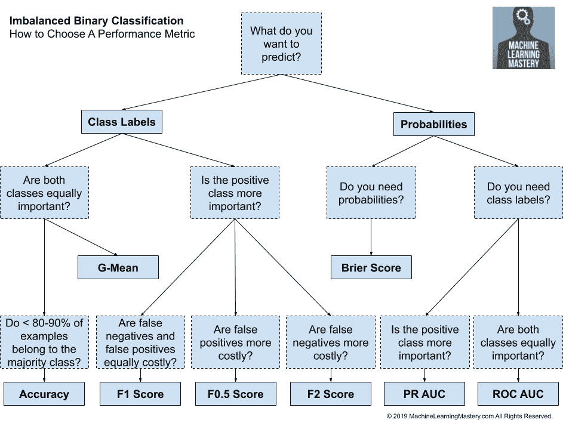

# 不平衡分类项目分步框架

> 原文：<https://machinelearningmastery.com/framework-for-imbalanced-classification-projects/>

最后更新于 2020 年 3 月 19 日

分类预测建模问题包括预测给定输入集的类别标签。

总的来说，这是一个具有挑战性的问题，尤其是如果对数据集知之甚少的话，因为有几十个(如果不是几百个)机器学习算法可供选择。如果示例在类之间的分布不平衡，那么这个问题就会变得更加困难。这需要使用专门的方法来改变数据集或者改变学习算法来处理倾斜的类分布。

处理一个新分类项目的压倒性优势的一个常见方法是使用一个喜欢的机器学习算法，如随机森林或 SMOTE。另一种常见的方法是在研究文献中寻找模糊相似问题的描述，并尝试重新实现所描述的算法和配置。

这些方法可能是有效的，尽管它们分别是命中或未命中和耗时的。相反，在新的分类任务中获得好结果的最短路径是系统地评估一套机器学习算法，以便发现哪些算法运行良好，然后加倍。这种方法也可以用于不平衡的分类问题，为数据采样、成本敏感和一类分类算法的范围量身定制，可供选择。

在本教程中，您将发现一个处理不平衡分类数据集的系统框架。

完成本教程后，您将知道:

*   选择不平衡分类算法的挑战。
*   通过不平衡分类项目系统工作的高级框架。
*   在不平衡分类项目的每一步尝试的具体算法建议。

**用我的新书[Python 不平衡分类](https://machinelearningmastery.com/imbalanced-classification-with-python/)启动你的项目**，包括*分步教程*和所有示例的 *Python 源代码*文件。

我们开始吧。

不平衡分类项目分步框架
图片由 [~jar{}](https://flickr.com/photos/jariceiii/49086477433/) 提供，保留部分权利。

## 教程概述

本教程分为三个部分；它们是:

1.  使用什么算法？
2.  使用系统框架
3.  不平衡分类的详细框架
    1.  选择一个指标
    2.  抽查算法
    3.  抽查不平衡算法
    4.  超参数调谐

## 1.使用什么算法？

你得到了一个不平衡的分类数据集。*现在怎么办？*

有这么多机器学习算法可供选择，更不用说专门为不平衡分类设计的技术了。

**你用哪些算法？** *你怎么选？*

这是每个新的不平衡分类项目开始时面临的挑战。正是这一挑战使得应用机器学习既令人兴奋又令人恐惧。

或许有两种常见的方法来解决这个问题:

*   使用最喜欢的算法。
*   使用以前有效的方法。

一种方法可能是选择一个喜欢的算法，并开始调整超参数。这是一种快速的解决方案，但只有当您最喜欢的算法恰好是特定数据集的最佳解决方案时，这种方法才有效。

另一种方法可能是回顾文献，看看像您这样的数据集使用了什么技术。如果许多人在类似的数据集上研究并报告了结果，这可能是有效的。

实际上，这种情况很少，研究出版物倾向于展示 pet 算法的前景，而不是对方法进行诚实的比较。充其量，文学可以作为尝试技术的思路。

相反，如果对这个问题知之甚少，那么获得“*好的*”结果的最短路径是在你的数据集上系统地测试一套不同的算法。

## 2.使用系统框架

考虑一个平衡的分类任务。

您面临着选择使用哪些算法来处理数据集的同样挑战。

这个问题有很多解决方案，但最稳健的可能是系统地测试一套算法，并使用经验结果进行选择。

像“*我最喜欢的算法*”或“*过去有效的算法*”这样的偏见可以为研究提供思路，但如果依赖它们，可能会把你引入歧途。相反，您需要让系统经验实验的结果来告诉您什么算法对您的不平衡分类数据集是好的或最好的。

一旦有了数据集，这个过程包括三个步骤:(1)选择评估候选模型的度量标准，(2)测试一套算法，以及(3)调整性能最好的模型。这可能不是唯一的方法；只是最简单可靠的过程让你从*我有新数据集*到*我很快就有好结果*。

这个过程可以总结如下:

1.  选择一个指标
2.  抽查算法
3.  超参数调谐

抽查算法稍微复杂一些，因为许多算法需要专门的数据准备，如缩放、去除异常值等。此外，评估候选算法需要仔细设计测试工具，通常包括使用 [k 倍交叉验证](https://machinelearningmastery.com/k-fold-cross-validation/)来估计给定模型在未知数据上的性能。

我们可以用这个简单的过程进行不平衡分类。

抽查不平衡分类的标准机器学习算法仍然很重要。当类分布不均衡时，标准算法通常表现不佳。然而，首先测试它们提供了一个性能基线，通过这个基线可以比较更专业的模型，并且必须表现出色。

调整性能良好的算法的超参数也很重要。这包括专门为不平衡分类设计的模型的超参数。

因此，我们可以使用相同的三步过程，并插入一个额外的步骤来评估不平衡的分类算法。

我们可以将这个过程总结如下:

1.  选择一个指标
2.  抽查算法
3.  抽查不平衡算法
4.  超参数调谐

这为解决不平衡分类问题提供了一个高层次的系统框架。

然而，有许多不平衡的算法可供选择，更不用说许多不同的标准机器学习算法可供选择。

我们要求每个步骤都有一个类似的低级系统框架。

## 3.不平衡分类的详细框架

我们可以开发一个类似的低级框架，系统地完成不平衡分类项目的每一步。

从选择度量到超参数调整。

### 3.1.选择一个指标

选择度量标准可能是项目中最重要的一步。

公制是用来评估和比较所有模型的标尺。选择错误的度量可能意味着选择错误的算法。也就是说，一个模型解决了一个与你实际想要解决的问题不同的问题。

度量必须捕捉关于模型或其预测的那些细节，这些细节对项目或项目涉众来说是最重要的。

这很难，因为有很多度量标准可供选择，而且项目涉众通常不确定他们想要什么。也可能有多种方法来描述这个问题，探索一些不同的框架可能是有益的，反过来，探索不同的度量标准，看看什么对利益相关者是有意义的。

首先，你必须决定你是想要预测概率还是简单的类标签。回想一下，对于二元不平衡分类任务，多数类是正常的，称为“*负类*，少数类是例外的，称为“*正类*”。

概率捕捉预测的不确定性，而清晰的类标签可以立即使用。

*   **概率**:预测每个例子的类成员概率。
*   **类标签**:为每个示例预测一个清晰的类标签。

#### 3.1.1.预测概率

如果打算直接使用概率，那么一个好的度量标准可能是简单分数和简单技能分数。

或者，您可能希望预测概率，并允许用户通过用户选择的阈值将概率映射到清晰的类标签本身。在这种情况下，可以选择一个度量来总结模型在可能阈值范围内的性能。

如果正类最重要，那么可以使用精度-召回曲线和曲线下面积(PR AUC)。这将优化所有阈值的精确度和召回率。

或者，如果两个类别同等重要，可以使用 ROC 曲线和曲线下面积(ROC AUC)。这将最大化真阳性率，最小化假阳性率。

#### 3.1.2.预测类别标签

如果需要类别标签，并且两个类别同等重要，那么一个好的默认度量是分类精度。这只有在多数阶层偏离数据不到 80%的情况下才有意义。偏斜度大于 80%或 90%的多数类将淹没准确性度量，并且将失去其对比较算法的意义。

如果类别分布严重偏斜，那么可以使用 G 均值度量来优化灵敏度和特异性度量。

如果正类更重要，那么可以使用变异的 F-Measure 来优化精度和召回率。如果假阳性和假阴性同样重要，那么可以使用 F1。如果假阴性成本更高，则可以使用 F2-Measure，否则，如果假阳性成本更高，则可以使用 F0.5-Measure。

#### 3.1.3.选择指标的框架

这些只是试探法，但如果您觉得为不平衡的分类任务选择一个度量标准有所损失，则提供了一个有用的起点。

我们可以将这些试探法总结成如下框架:

*   **你在预测概率吗？**
    *   **需要类标签吗？**
        *   **正课更重要吗？**
            *   使用精度-召回 AUC
        *   **两个班都重要吗？**
            *   使用 ROC AUC
    *   **你需要概率吗？**
        *   使用简短分数和简短技能分数
*   **你在预测类标签吗？**
    *   **正课更重要吗？**
        *   **假阴性和假阳性的成本一样高吗？**
            *   使用 F1-测量
        *   **假阴性成本更高吗？**
            *   使用 F2-测量
        *   **误报成本更高吗？**
            *   使用 f 0.5-测量
    *   **两个班都重要吗？**
        *   **多数班有< 80%-90%的例子吗？**
            *   使用精确度
        *   **多数班有> 80%-90%的例子吗？**
            *   使用 G 均值

我们还可以将这些决策转换成决策树，如下所示。

如何选择不平衡分类的度量

一旦选择了度量标准，您就可以开始评估机器学习算法了。

### 3.2.抽查算法

抽查机器学习算法意味着用最小的超参数调整来评估一套不同类型的算法。

具体来说，这意味着给每个算法一个了解问题的好机会，包括执行算法预期的任何所需数据准备，以及使用最佳实践配置选项或默认值。

目标是快速测试一系列标准机器学习算法，并提供一个性能基线，专门用于不平衡分类的技术必须与该基线进行比较并超越该基线才能被认为是熟练的。这里的想法是，如果他们不能执行所谓的不平衡算法，那么使用花哨的不平衡算法就没有什么意义。

必须定义一个健壮的测试线束。这通常涉及 [k 倍交叉验证](https://machinelearningmastery.com/k-fold-cross-validation/)，通常以 k-10 作为合理的默认值。通常需要分层交叉验证来确保每个折叠与原始数据集具有相同的类分布。并且交叉验证过程经常重复多次，例如 3 次、10 次或 30 次，以便有效地捕获数据集上模型性能的样本，用分数的平均值和标准偏差进行总结。

可能有四个级别的算法需要抽查；它们是:

1.  朴素算法
2.  线性算法
3.  非线性算法
4.  集成算法

#### 3.2.1.朴素算法

首先，必须评估一个简单的分类。

这提供了一个最低的性能基线，任何算法都必须克服这个基线才能掌握数据集。

天真意味着算法除了 if 语句或预测一个常量值之外没有其他逻辑。朴素算法的选择是基于性能度量的选择。

例如，一个合适的用于分类精度的朴素算法是预测所有情况下的多数类。在评估概率时，一个适用于 Brier Score 的简单算法是预测训练数据集中每个类的先验概率。

建议将性能指标映射到简单算法如下:

*   **准确度**:预测多数类(0 类)。
*   **G 均值**:预测一个一致随机类。
*   **F-Measure** :预测少数类(1 类)。
*   **ROC AUC** :预测一个分层随机类。
*   **PR ROC** :预测一个分层的随机类。
*   **Brier 评分**:预测多数类优先。

如果您不确定度量标准的“最佳”*“简单”算法，或许可以测试一些，并发现哪种算法能带来更好的性能，您可以将其用作最低基准。*

 *一些选项包括:

*   预测所有情况下的多数类。
*   预测所有情况下的少数阶级。
*   预测一个均匀随机选择的班级。
*   用每个类别的先验概率预测随机选择的类别。
*   预测类先验概率。

#### 3.2.2.线性算法

线性算法是那些经常从统计领域中提取出来的算法，并且对问题的函数形式做出强有力的假设。

我们可以称它们为线性的，因为输出是输入的线性组合，或者是加权输入，尽管这个定义有些牵强。您也可以将这些算法称为概率算法，因为它们通常适用于概率框架。

他们通常训练速度很快，表现也很好。您应该考虑尝试的线性算法示例包括:

*   逻辑回归
*   线性判别分析
*   朴素贝叶斯

#### 3.2.3.非线性算法

非线性算法来源于机器学习领域，对问题的函数形式几乎不做假设。

我们可以称之为非线性，因为输出通常是输入到输出的非线性映射。

它们通常比线性算法需要更多的数据，并且训练速度更慢。您应该考虑尝试的非线性算法示例包括:

*   决策图表
*   k-最近邻
*   人工神经网络
*   支持向量机

#### 3.2.4.集成算法

集成算法也是从机器学习领域中提取出来的，并且结合了来自两个或更多模型的预测。

有许多集成算法可供选择，但在抽查算法时，最好将重点放在决策树算法的集成上，因为众所周知，它们在实践中对各种问题都有很好的表现。

您应该考虑尝试的决策树算法集成示例包括:

*   袋装决策树
*   随机森林
*   额外的树
*   随机梯度升压

#### 3.2.5.抽查机器学习算法框架

我们可以将这些建议总结成一个在数据集上测试机器学习算法的框架。

*   朴素算法
    *   多数阶级
    *   少数民族阶层
    *   阶级优先
*   线性算法
    *   逻辑回归
    *   线性判别分析
    *   朴素贝叶斯
*   非线性算法
    *   决策图表
    *   k-最近邻
    *   人工神经网络
    *   支持向量机
*   集成算法
    *   袋装决策树
    *   随机森林
    *   额外的树
    *   随机梯度升压

步骤的顺序可能不灵活。把算法的顺序看作是复杂性的增加，进而是能力的增加。

每一步中算法的顺序是灵活的，算法的列表是不完整的，并且可能永远无法给出大量可用的算法。将测试的算法限制在最常见或最广泛使用的子集是一个良好的开端。使用数据准备建议和超参数默认值也是一个好的开始。

下图总结了框架的这一步。

如何抽查机器学习算法

### 3.3.抽查不平衡算法

抽查不平衡算法很像抽查机器学习算法。

目标是快速测试大量的技术，以便发现哪些技术有希望，这样您就可以在稍后的超参数调优过程中更加关注它。

在前一节中执行的抽查提供了幼稚和适度熟练的模型，通过这些模型可以比较所有不平衡的技术。这使您能够专注于这些真正显示问题前景的方法，而不是对仅与其他不平衡分类技术相比看起来有效的结果感到兴奋(这是一个容易陷入的陷阱)。

可能有四种类型的不平衡分类技术需要抽查:

1.  数据采样算法
2.  成本敏感算法
3.  一类算法
4.  概率调整算法

#### 3.3.1.数据采样算法

数据采样算法改变训练数据集的组成，以提高标准机器学习算法在不平衡分类问题上的性能。

数据采样技术可能有三种主要类型；它们是:

*   数据过放大。
*   数据欠采样。
*   组合过采样和欠采样。

数据过采样包括复制少数类的例子，或者从现有例子中合成少数类的新例子。也许最受欢迎的方法是 SMOTE 和变体，如边界线 SMOTE。也许要调整的最重要的超参数是要执行的过采样量。

数据过采样方法的示例包括:

*   随机过采样
*   重击
*   边界线 SMOTE
*   SVM·斯摩尔特
*   k-Means SMOTE
*   阿达林

欠采样包括从多数类中删除示例，例如随机删除或使用算法仔细选择要删除的示例。流行的编辑算法包括编辑的最近邻和 Tomek 链接。

数据欠采样方法的示例包括:

*   随机欠采样
*   凝聚最近邻
*   托梅克左边
*   编辑的最近邻居
*   邻域清理规则
*   片面选择

几乎任何过采样方法都可以与几乎任何欠采样技术相结合。因此，测试一套不同的过采样和欠采样技术组合可能是有益的。

过采样和欠采样的常见组合包括:

*   SMOTE 和随机欠采样
*   SMOTE 和 Tomek 链接
*   移动和编辑最近的邻居

根据机器学习算法的选择，数据采样算法的性能可能会有所不同。

因此，测试一套标准的机器学习算法可能是有益的，例如前面部分中抽查时使用的所有算法或这些算法的子集。

此外，大多数数据采样算法在内部使用 [k 最近邻算法](https://machinelearningmastery.com/tutorial-to-implement-k-nearest-neighbors-in-python-from-scratch/)。该算法对输入变量的数据类型和规模非常敏感。因此，在测试方法之前，至少标准化具有不同标度的输入变量可能是重要的，并且如果一些输入变量是分类的而不是数字的，则可能使用专门的方法。

#### 3.3.2.成本敏感算法

成本敏感算法是机器学习算法的改进版本，设计用于在训练数据集上拟合模型时考虑错误分类的不同成本。

当用于不平衡分类时，这些算法可以是有效的，其中错误分类的成本被配置成与训练数据集中的示例分布成反比。

有许多对成本敏感的算法可供选择，尽管测试一系列对成本敏感的线性、非线性和集成算法可能是实用的。

可以使用成本敏感训练配置的机器学习算法的一些例子包括:

*   逻辑回归
*   决策树
*   支持向量机
*   人工神经网络
*   袋装决策树
*   随机森林
*   随机梯度升压

#### 3.3.3.一类算法

用于异常检测和异常检测的算法可以用于分类任务。

虽然不常见，但当以这种方式使用时，它们通常被称为一类分类算法。

在某些情况下，单类分类算法可能非常有效，例如当存在严重的类不平衡，并且正类的例子很少时。

可以尝试的一类分类算法包括:

*   一类支持向量机
*   隔离森林
*   最小协方差行列式
*   局部异常因子

#### 3.3.4.概率调整算法

预测概率可以通过两种方式提高；它们是:

*   校准概率。
*   调整分类阈值。

##### 校准概率

一些算法使用概率框架进行拟合，并依次校准概率。

这意味着，当预测 100 个示例具有 80%概率的正类标签时，算法将在 80%的时间内预测正确的类标签。

当需要概率作为输出或用于评估模型时(例如，ROC AUC 或 PR AUC)，模型需要校准的概率才能被认为在二元分类任务中是熟练的。

预测校准概率的机器学习算法的一些例子如下:

*   逻辑回归
*   线性判别分析
*   朴素贝叶斯
*   人工神经网络

大多数非线性算法不预测校准的概率，因此可以使用算法对预测的概率进行后处理以校准它们。

因此，当概率被直接要求或用于评估模型，并且使用非线性算法时，重要的是[校准预测概率](https://machinelearningmastery.com/calibrated-classification-model-in-scikit-learn/)。

尝试概率校准算法的一些例子包括:

*   普拉特缩放
*   等渗回归

##### 调整分类阈值

一些算法被设计成天真地预测概率，这些概率随后必须被映射到清晰的类标签。

如果需要类标签作为问题的输出，或者使用类标签评估模型，就会出现这种情况。

默认预测概率的概率机器学习算法的例子包括:

*   逻辑回归
*   线性判别分析
*   朴素贝叶斯
*   人工神经网络

使用阈值概率值将概率映射到类标签。所有低于阈值的概率被映射到类别 0，所有等于或高于阈值的概率被映射到类别 1。

默认阈值为 0.5，尽管可以使用不同的阈值，这将极大地影响类标签，进而影响本机预测概率的机器学习模型的性能。

因此，如果使用概率算法来自然预测概率，并且需要类别标签作为输出或用于评估模型，那么尝试调整分类阈值是一个好主意。

#### 3.3.5.抽查不平衡算法框架

我们可以将这些建议总结成一个在数据集上测试不平衡机器学习算法的框架。

1.  数据采样算法
    *   数据过采样
        *   随机过采样
        *   重击
        *   边界线 SMOTE
        *   SVM·斯摩尔特
        *   k-Means SMOTE
        *   阿达林
    *   数据欠采样
        *   随机欠采样
        *   凝聚最近邻
        *   托梅克左边
        *   编辑的最近邻居
        *   邻域清理规则
        *   片面选择
    *   组合过采样和欠采样
        *   SMOTE 和随机欠采样
        *   SMOTE 和 Tomek 链接
        *   移动和编辑最近的邻居
2.  成本敏感算法
    *   逻辑回归
    *   决策树
    *   支持向量机
    *   人工神经网络
    *   袋装决策树
    *   随机森林
    *   随机梯度升压
3.  一类算法
    *   一类支持向量机
    *   隔离森林
    *   最小协方差行列式
    *   局部异常因子
4.  概率调整算法
    *   校准概率
        *   普拉特缩放
        *   等渗回归
    *   调整分类阈值

步骤的顺序是灵活的，每个步骤内算法的顺序也是灵活的，算法列表不完整。

该结构旨在让您系统地思考评估什么算法。

下图总结了该框架。

如何抽查不平衡机器学习算法

### 3.4.超参数调谐

在抽查机器学习算法和不平衡算法后，您将对特定数据集上哪些可行，哪些不可行有所了解。

超参数调整的最简单方法是选择表现良好的前五或前十个算法或算法组合，并为每个算法调整超参数。

有三种流行的超参数调整算法可供您选择:

*   随机搜索
*   网格搜索
*   贝叶斯优化

如果您知道要尝试什么样的超参数值，一个好的缺省值是网格搜索，否则，应该使用随机搜索。[如果可能的话，应该使用贝叶斯优化](https://machinelearningmastery.com/what-is-bayesian-optimization/)，但是设置和运行可能更具挑战性。

调整最佳执行方法是一个好的开始，但不是唯一的方法。

可能有一些标准的机器学习算法表现良好，但与数据采样或概率校准一起使用时表现不佳。这些算法可以与它们的不平衡分类增强相协调，看看是否能获得更好的性能。

此外，可能存在不平衡分类算法，例如导致一个或多个算法性能显著提升的数据采样方法。这些算法本身可能会为进一步调整提供一个有趣的基础，以查看是否可以实现性能的额外提升。

## 进一步阅读

如果您想更深入地了解这个主题，本节将提供更多资源。

### 教程

*   [应用机器学习过程](https://machinelearningmastery.com/process-for-working-through-machine-learning-problems/)
*   [如何使用机器学习清单可靠地获得准确的预测](https://machinelearningmastery.com/machine-learning-checklist/)

### 书

*   [从不平衡数据集中学习](https://amzn.to/307Xlva)，2018。
*   [不平衡学习:基础、算法和应用](https://amzn.to/32K9K6d)，2013。

## 摘要

在本教程中，您发现了一个处理不平衡分类数据集的系统框架。

具体来说，您了解到:

*   选择不平衡分类算法的挑战。
*   通过不平衡分类项目系统工作的高级框架。
*   在不平衡分类项目的每一步尝试的具体算法建议。

你有什么问题吗？
在下面的评论中提问，我会尽力回答。*