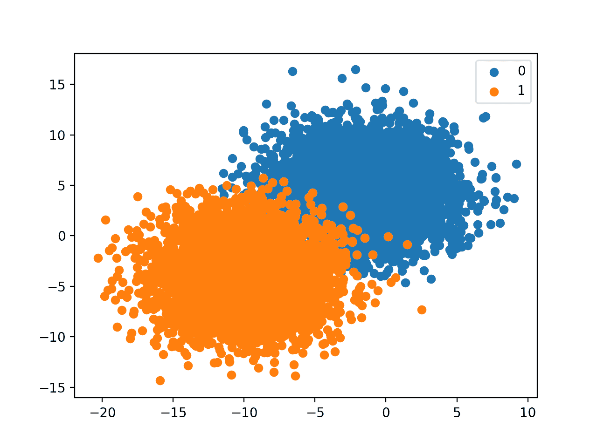
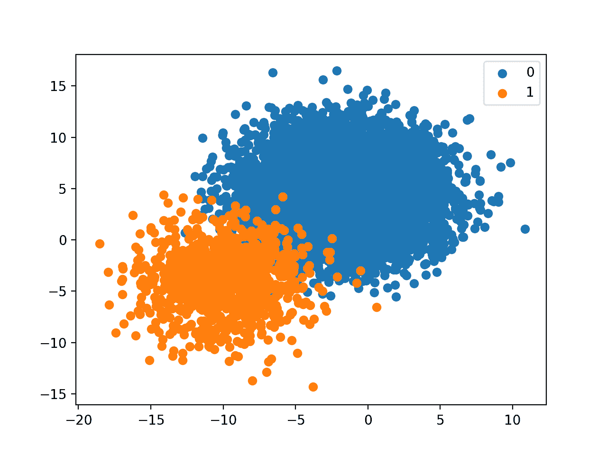
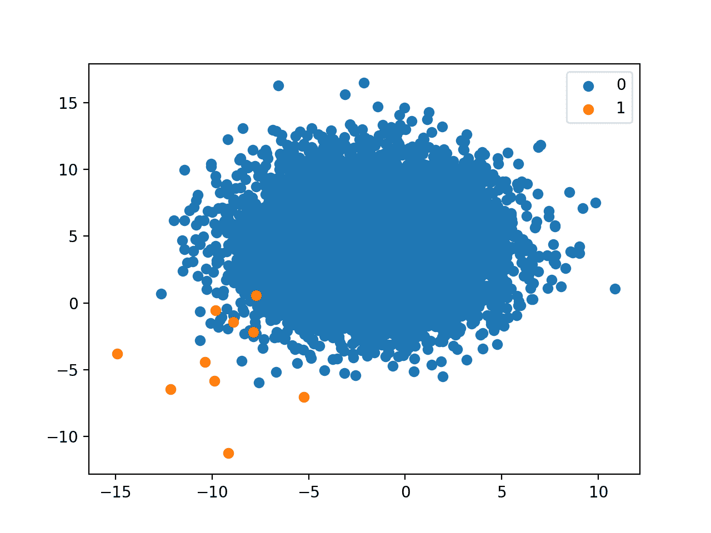

# 为严重扭曲的类分布开发直觉

> 原文：<https://machinelearningmastery.com/how-to-develop-an-intuition-skewed-class-distributions/>

最后更新于 2020 年 1 月 14 日

不平衡分类问题是涉及预测类别标签的问题，其中类别标签在训练数据集中的分布不相等。

对于处理不平衡分类问题的初学者来说，一个挑战是特定的倾斜类分布意味着什么。例如，1:10 与 1:100 的班级比例的区别和含义是什么？

不平衡分类问题的类分布差异将影响数据准备和建模算法的选择。因此，对于不同的类分布，从业者发展一种直觉是至关重要的。

在本教程中，您将发现如何为不平衡和高度倾斜的类分布开发实用的直觉。

完成本教程后，您将知道:

*   如何创建用于二进制分类的合成数据集，并按类绘制示例。
*   如何创建任何给定类别分布的合成类别数据集？
*   不同的倾斜类分布实际上是怎样的。

**用我的新书[Python 不平衡分类](https://machinelearningmastery.com/imbalanced-classification-with-python/)启动你的项目**，包括*分步教程*和所有示例的 *Python 源代码*文件。

我们开始吧。

*   **2020 年 1 月更新**:针对 Sklearn v0.22 API 的变化进行了更新。


为严重扭曲的类分布开发一种直觉
图片由[鲍里斯·卡西莫夫](https://flickr.com/photos/kasio69/40486873483/)提供，保留部分权利。

## 教程概述

本教程分为三个部分；它们是:

1.  创建并绘制二元分类问题
2.  创建具有类别分布的合成数据集
3.  偏斜类分布的影响

## 创建并绘制二元分类问题

Sklearn Python 机器学习库提供了生成合成数据集的[功能。](https://machinelearningmastery.com/generate-test-datasets-python-Sklearn/)

[make_blobs()函数](https://Sklearn.org/stable/modules/generated/sklearn.datasets.make_blobs.html)可用于从具有指定类别数的测试分类问题中生成指定数量的示例。该函数返回准备建模的每个示例的输入和输出部分。

例如，下面的代码片段将为具有两个输入变量的两类(二进制)分类问题生成 1000 个示例。类值的值为 0 和 1。

```py
...
X, y = make_blobs(n_samples=1000, centers=2, n_features=2, random_state=1, cluster_std=3)
```

一旦生成，我们就可以绘制数据集以获得示例之间空间关系的直觉。

因为只有两个输入变量，所以我们可以创建散点图，将每个示例绘制为一个点。这可以通过[散射()matplotlib 功能](https://matplotlib.org/3.1.1/api/_as_gen/matplotlib.pyplot.scatter.html)来实现。

然后可以根据类别值改变点的颜色。这可以通过首先为给定类的示例选择数组索引，然后只绘制这些点，然后为另一个类重复选择和绘制过程来实现。 [where() NumPy 函数](https://docs.scipy.org/doc/numpy/reference/generated/numpy.where.html)可用于检索符合标准的数组索引，例如具有给定值的类标签。

例如:

```py
...
# create scatter plot for samples from each class
for class_value in range(2):
	# get row indexes for samples with this class
	row_ix = where(y == class_value)
	# create scatter of these samples
	pyplot.scatter(X[row_ix, 0], X[row_ix, 1])
```

下面列出了创建二进制分类测试数据集并将示例绘制为散点图的完整示例。

```py
# generate binary classification dataset and plot
from numpy import where
from matplotlib import pyplot
from sklearn.datasets import make_blobs
# generate dataset
X, y = make_blobs(n_samples=1000, centers=2, n_features=2, random_state=1, cluster_std=3)
# create scatter plot for samples from each class
for class_value in range(2):
	# get row indexes for samples with this class
	row_ix = where(y == class_value)
	# create scatter of these samples
	pyplot.scatter(X[row_ix, 0], X[row_ix, 1])
# show the plot
pyplot.show()
```

运行该示例会创建数据集和散点图，用不同的颜色显示两个类的示例。

我们可以看到每个类中有相同数量的例子，在本例中是 500 个，我们可以想象画一条线来合理地划分类，很像分类预测模型在学习如何区分例子时可能做的那样。


二元类别数据集的散点图

既然我们知道了如何创建一个合成的二进制类别数据集并绘制示例，那么让我们来看看示例中的类不平衡示例。

## 创建具有类别分布的合成数据集

*make_blobs()* 函数将始终创建类分布相等的合成数据集。

然而，我们可以使用这个函数来创建具有任意类分布的合成类别数据集，只需要几行额外的代码。

类别分布可以定义为字典，其中关键字是类别值(例如 0 或 1)，值是要包含在数据集中的随机生成的示例数。

例如，每个类中有 5，000 个示例的相等类分布将被定义为:

```py
...
# define the class distribution
proportions = {0:5000, 1:5000}
```

然后我们可以枚举不同的分布并找到最大的分布，然后使用 *make_blobs()* 函数为每个类创建一个包含如此多示例的数据集。

```py
...
# determine the number of classes
n_classes = len(proportions)
# determine the number of examples to generate for each class
largest = max([v for k,v in proportions.items()])
n_samples = largest * n_classes
```

这是一个很好的起点，但会给我们比每个类别标签所需的更多的样本。

然后，我们可以枚举类标签，并为每个类选择所需数量的示例，以构成将要返回的数据集。

```py
...
# collect the examples
X_list, y_list = list(), list()
for k,v in proportions.items():
	row_ix = where(y == k)[0]
	selected = row_ix[:v]
	X_list.append(X[selected, :])
	y_list.append(y[selected])
```

我们可以将它绑定到一个名为 *get_dataset()* 的新函数中，该函数将采用一个类分布，并返回一个具有该类分布的合成数据集。

```py
# create a dataset with a given class distribution
def get_dataset(proportions):
	# determine the number of classes
	n_classes = len(proportions)
	# determine the number of examples to generate for each class
	largest = max([v for k,v in proportions.items()])
	n_samples = largest * n_classes
	# create dataset
	X, y = make_blobs(n_samples=n_samples, centers=n_classes, n_features=2, random_state=1, cluster_std=3)
	# collect the examples
	X_list, y_list = list(), list()
	for k,v in proportions.items():
		row_ix = where(y == k)[0]
		selected = row_ix[:v]
		X_list.append(X[selected, :])
		y_list.append(y[selected])
	return vstack(X_list), hstack(y_list)
```

该函数可以接受任意数量的类，尽管我们将把它用于简单的二进制分类问题。

接下来，我们可以使用上一节中的代码为已创建的数据集创建散点图，并将其放入助手函数中。下面是 *plot_dataset()* 函数，该函数将绘制数据集并显示一个图例，以指示颜色到类标签的映射。

```py
# scatter plot of dataset, different color for each class
def plot_dataset(X, y):
	# create scatter plot for samples from each class
	n_classes = len(unique(y))
	for class_value in range(n_classes):
		# get row indexes for samples with this class
		row_ix = where(y == class_value)[0]
		# create scatter of these samples
		pyplot.scatter(X[row_ix, 0], X[row_ix, 1], label=str(class_value))
	# show a legend
	pyplot.legend()
	# show the plot
	pyplot.show()
```

最后，我们可以测试这些新功能。

我们将为每个类定义一个包含 5，000 个示例的数据集(总共 10，000 个示例)，并绘制结果。

下面列出了完整的示例。

```py
# create and plot synthetic dataset with a given class distribution
from numpy import unique
from numpy import hstack
from numpy import vstack
from numpy import where
from matplotlib import pyplot
from sklearn.datasets import make_blobs

# create a dataset with a given class distribution
def get_dataset(proportions):
	# determine the number of classes
	n_classes = len(proportions)
	# determine the number of examples to generate for each class
	largest = max([v for k,v in proportions.items()])
	n_samples = largest * n_classes
	# create dataset
	X, y = make_blobs(n_samples=n_samples, centers=n_classes, n_features=2, random_state=1, cluster_std=3)
	# collect the examples
	X_list, y_list = list(), list()
	for k,v in proportions.items():
		row_ix = where(y == k)[0]
		selected = row_ix[:v]
		X_list.append(X[selected, :])
		y_list.append(y[selected])
	return vstack(X_list), hstack(y_list)

# scatter plot of dataset, different color for each class
def plot_dataset(X, y):
	# create scatter plot for samples from each class
	n_classes = len(unique(y))
	for class_value in range(n_classes):
		# get row indexes for samples with this class
		row_ix = where(y == class_value)[0]
		# create scatter of these samples
		pyplot.scatter(X[row_ix, 0], X[row_ix, 1], label=str(class_value))
	# show a legend
	pyplot.legend()
	# show the plot
	pyplot.show()

# define the class distribution
proportions = {0:5000, 1:5000}
# generate dataset
X, y = get_dataset(proportions)
# plot dataset
plot_dataset(X, y)
```

运行该示例会像以前一样创建数据集并绘制结果，尽管这次是使用我们提供的类分布。

在这种情况下，我们有更多的每个类的例子和一个有用的图例来指示绘图颜色到类标签的映射。



具有给定类别分布的二元类别数据集的散点图

现在，我们已经拥有了创建和绘制具有任意倾斜类分布的合成数据集的工具，让我们来看看不同分布的效果。

## 偏斜类分布的影响

对于不同阶级不平衡的空间关系，发展一种直觉是很重要的。

比如 1:1000 的类分配关系是什么样的？

这是一种抽象的关系，我们需要把它和具体的东西联系起来。

我们可以生成具有不同不平衡类分布的合成测试数据集，并以此为基础，为我们在真实数据集中可能遇到的不同偏斜分布开发直觉。

查看不同类别分布的散点图可以大致了解类别之间的关系，这在考虑将来处理类似类别分布时的技术选择和模型评估时非常有用。它们提供了一个参考点。

我们在前面的部分已经看到了 1:1 的关系(例如 5000:5000)。

请注意，当处理二进制分类问题，尤其是不平衡问题时，重要的是多数类被分配给类 0，少数类被分配给类 1。这是因为许多评估指标将假设这种关系。

因此，我们可以通过在对 *get_dataset()* 函数的调用中先定义多数类，再定义少数类来确保我们的类分布符合这一实践；例如:

```py
...
# define the class distribution
proportions = {0:10000, 1:10}
# generate dataset
X, y = get_dataset(proportions)
...
```

在本节中，我们可以看到不同的倾斜类分布，少数类的大小以对数尺度增加，例如:

*   1:10 或{0:10000，1:1000}
*   1:100 或{0:10000，1:100}
*   1:1000 或{0:10000，1:10}

让我们依次仔细看看每个班级的分布情况。

### 1:10 不平衡的阶级分布

包含 10，000 到 1，000 个示例的 1:10 类分布意味着数据集中有 11，000 个示例，其中 0 类约占 91%，1 类约占 9%。

下面列出了完整的代码示例。

```py
# create and plot synthetic dataset with a given class distribution
from numpy import unique
from numpy import hstack
from numpy import vstack
from numpy import where
from matplotlib import pyplot
from sklearn.datasets import make_blobs

# create a dataset with a given class distribution
def get_dataset(proportions):
	# determine the number of classes
	n_classes = len(proportions)
	# determine the number of examples to generate for each class
	largest = max([v for k,v in proportions.items()])
	n_samples = largest * n_classes
	# create dataset
	X, y = make_blobs(n_samples=n_samples, centers=n_classes, n_features=2, random_state=1, cluster_std=3)
	# collect the examples
	X_list, y_list = list(), list()
	for k,v in proportions.items():
		row_ix = where(y == k)[0]
		selected = row_ix[:v]
		X_list.append(X[selected, :])
		y_list.append(y[selected])
	return vstack(X_list), hstack(y_list)

# scatter plot of dataset, different color for each class
def plot_dataset(X, y):
	# create scatter plot for samples from each class
	n_classes = len(unique(y))
	for class_value in range(n_classes):
		# get row indexes for samples with this class
		row_ix = where(y == class_value)[0]
		# create scatter of these samples
		pyplot.scatter(X[row_ix, 0], X[row_ix, 1], label=str(class_value))
	# show a legend
	pyplot.legend()
	# show the plot
	pyplot.show()

# define the class distribution
proportions = {0:10000, 1:1000}
# generate dataset
X, y = get_dataset(proportions)
# plot dataset
plot_dataset(X, y)
```

运行该示例将创建具有定义的类分布的数据集，并绘制结果。

虽然这种平衡看起来很明显，但情节表明，少数族裔与多数族裔相比，大约有 10%的分数没有我们想象的那么差。

这种关系看起来是可以管理的，尽管如果课程明显重叠，我们可以想象一个非常不同的故事。



具有 1 到 10 类分布的二元类别数据集的散点图

### 1:100 不平衡的阶级分布

包含 10，000 到 100 个示例的 1:100 类分布意味着数据集中有 10，100 个示例，其中 0 类大约占 99%，1 类大约占 1%。

下面列出了完整的代码示例。

```py
# create and plot synthetic dataset with a given class distribution
from numpy import unique
from numpy import hstack
from numpy import vstack
from numpy import where
from matplotlib import pyplot
from sklearn.datasets import make_blobs

# create a dataset with a given class distribution
def get_dataset(proportions):
	# determine the number of classes
	n_classes = len(proportions)
	# determine the number of examples to generate for each class
	largest = max([v for k,v in proportions.items()])
	n_samples = largest * n_classes
	# create dataset
	X, y = make_blobs(n_samples=n_samples, centers=n_classes, n_features=2, random_state=1, cluster_std=3)
	# collect the examples
	X_list, y_list = list(), list()
	for k,v in proportions.items():
		row_ix = where(y == k)[0]
		selected = row_ix[:v]
		X_list.append(X[selected, :])
		y_list.append(y[selected])
	return vstack(X_list), hstack(y_list)

# scatter plot of dataset, different color for each class
def plot_dataset(X, y):
	# create scatter plot for samples from each class
	n_classes = len(unique(y))
	for class_value in range(n_classes):
		# get row indexes for samples with this class
		row_ix = where(y == class_value)[0]
		# create scatter of these samples
		pyplot.scatter(X[row_ix, 0], X[row_ix, 1], label=str(class_value))
	# show a legend
	pyplot.legend()
	# show the plot
	pyplot.show()

# define the class distribution
proportions = {0:10000, 1:100}
# generate dataset
X, y = get_dataset(proportions)
# plot dataset
plot_dataset(X, y)
```

运行该示例将创建具有定义的类分布的数据集，并绘制结果。

1 比 100 的关系是一个很大的偏差。

与大多数阶级相比，剧情让这一点变得清晰起来，感觉像是一点点的分数。

现实世界的数据集很可能落在 1:10 和 1:100 的类分布之间，1:100 的图确实强调了需要仔细考虑少数类中的每个点，包括测量误差(例如异常值)和模型可能产生的预测误差。


1 到 100 类分布的二元类别数据集散点图

### 1:1000 不平衡的阶级分布

包含 10，000 到 10 个示例的 1:100 类分布意味着数据集中有 10，010 个示例，其中 0 类约占 99.9%，1 类约占 0.1%。

下面列出了完整的代码示例。

```py
# create and plot synthetic dataset with a given class distribution
from numpy import unique
from numpy import hstack
from numpy import vstack
from numpy import where
from matplotlib import pyplot
from sklearn.datasets import make_blobs

# create a dataset with a given class distribution
def get_dataset(proportions):
	# determine the number of classes
	n_classes = len(proportions)
	# determine the number of examples to generate for each class
	largest = max([v for k,v in proportions.items()])
	n_samples = largest * n_classes
	# create dataset
	X, y = make_blobs(n_samples=n_samples, centers=n_classes, n_features=2, random_state=1, cluster_std=3)
	# collect the examples
	X_list, y_list = list(), list()
	for k,v in proportions.items():
		row_ix = where(y == k)[0]
		selected = row_ix[:v]
		X_list.append(X[selected, :])
		y_list.append(y[selected])
	return vstack(X_list), hstack(y_list)

# scatter plot of dataset, different color for each class
def plot_dataset(X, y):
	# create scatter plot for samples from each class
	n_classes = len(unique(y))
	for class_value in range(n_classes):
		# get row indexes for samples with this class
		row_ix = where(y == class_value)[0]
		# create scatter of these samples
		pyplot.scatter(X[row_ix, 0], X[row_ix, 1], label=str(class_value))
	# show a legend
	pyplot.legend()
	# show the plot
	pyplot.show()

# define the class distribution
proportions = {0:10000, 1:10}
# generate dataset
X, y = get_dataset(proportions)
# plot dataset
plot_dataset(X, y)
```

运行该示例将创建具有定义的类分布的数据集，并绘制结果。

正如我们可能已经怀疑的那样，1 比 1000 的关系是侵略性的。在我们选择的设置中，只有 10 个少数民族的例子呈现给 10，000 个多数民族。

在如此缺乏数据的情况下，我们可以看到，在以如此戏剧性的偏差建模问题时，我们可能应该花很多时间在可用的实际少数示例上，并看看领域知识是否可以以某种方式使用。自动建模方法将面临严峻的挑战。

这个例子也强调了与类分布正交的另一个重要方面，那就是例子的数量。例如，虽然数据集具有 1:1000 的类分布，但是只有 10 个少数类的例子是非常具有挑战性的。尽管，如果我们有相同的类分布，有 100 万个多数类和 1000 个少数类的例子，额外的 990 个少数类例子在开发一个有效的模型中可能是非常宝贵的。



1 到 1000 类分布的二元类别数据集的散点图

## 进一步阅读

如果您想更深入地了解这个主题，本节将提供更多资源。

### 应用程序接口

*   [sklearn . dataset . make _ blobs API](https://Sklearn.org/stable/modules/generated/sklearn.datasets.make_blobs.html)。
*   [matplotlib . pyplot . scatter API](https://matplotlib.org/3.1.1/api/_as_gen/matplotlib.pyplot.scatter.html)。
*   [numpy.where API](https://docs.scipy.org/doc/numpy/reference/generated/numpy.where.html) 。

## 摘要

在本教程中，您发现了如何为不平衡和高度倾斜的类分布开发实用直觉。

具体来说，您了解到:

*   如何创建用于二进制分类的合成数据集，并按类绘制示例。
*   如何创建任何给定类别分布的合成类别数据集？
*   不同的倾斜类分布实际上是怎样的。

你有什么问题吗？
在下面的评论中提问，我会尽力回答。