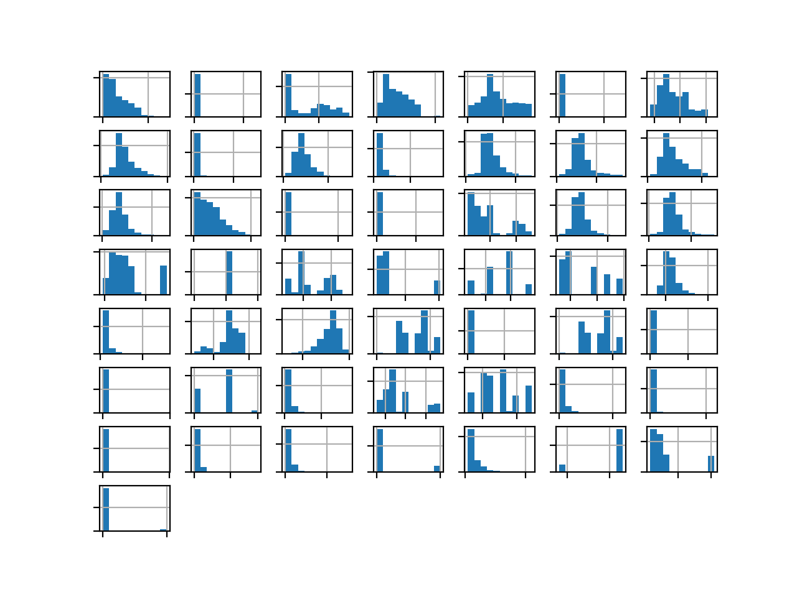
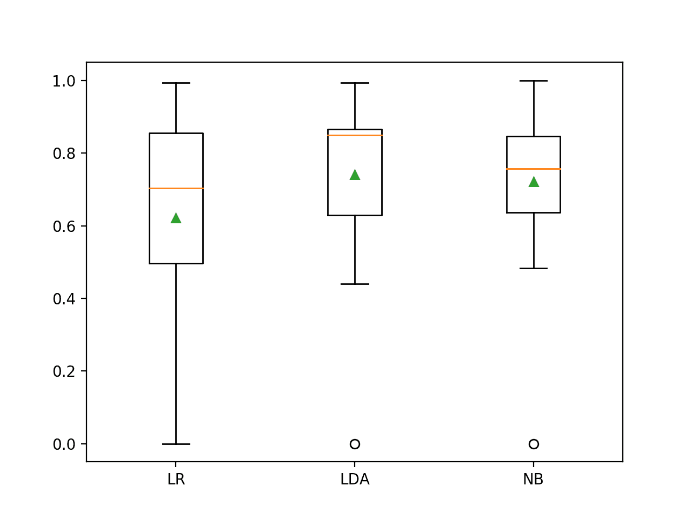
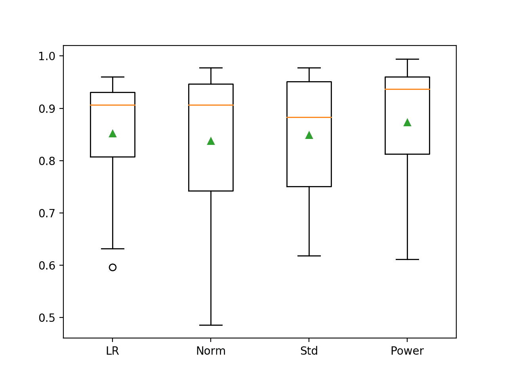

# 如何开发不平衡分类模型来检测溢油

> 原文：<https://machinelearningmastery.com/imbalanced-classification-model-to-detect-oil-spills/>

最后更新于 2021 年 1 月 5 日

许多不平衡的分类任务需要一个熟练的模型来预测一个清晰的类标签，其中两个类同等重要。

不平衡分类问题的一个例子是卫星图像中漏油或油膜的检测，其中需要类别标签，两个类别同等重要。泄漏的检测需要动员昂贵的响应，错过一个事件也同样昂贵，对环境造成损害。

评估预测清晰标签的不平衡分类模型的一种方法是计算阳性类别和阴性类别的单独准确度，称为灵敏度和特异性。然后，可以使用几何平均值(称为 G 平均值)对这两个度量进行平均，该几何平均值对偏斜的类分布不敏感，并正确报告模型在这两个类上的技能。

在本教程中，您将发现如何开发一个模型来预测卫星图像中漏油的存在，并使用 G 均值指标进行评估。

完成本教程后，您将知道:

*   如何加载和探索数据集，并为数据准备和模型选择产生想法。
*   如何评估一套概率模型，并通过适当的数据准备提高它们的表现。
*   如何拟合最终模型并使用它来预测特定情况下的类标签。

**用我的新书[Python 不平衡分类](https://machinelearningmastery.com/imbalanced-classification-with-python/)启动你的项目**，包括*分步教程*和所有示例的 *Python 源代码*文件。

我们开始吧。

*   **2021 年 1 月更新**:更新了 API 文档的链接。


开发不平衡分类模型来检测漏油
图片由[莱尼·K 摄影](https://flickr.com/photos/lennykphotography/35874547205/)拍摄，保留部分权利。

## 教程概述

本教程分为五个部分；它们是:

1.  溢油数据集
2.  浏览数据集
3.  模型测试和基线结果
4.  评估模型
    1.  评估概率模型
    2.  评估平衡逻辑回归
    3.  用概率模型评估重采样
5.  对新数据进行预测

## 溢油数据集

在本项目中，我们将使用标准的不平衡机器学习数据集，称为“*溢油*”数据集，“*油膜*数据集”或简称为“*油*”

该数据集是由米罗斯拉夫·库巴特等人在 1998 年发表的论文中引入的，该论文的标题为“用于检测卫星雷达图像中漏油的 T2 机器学习”该数据集通常被归功于该论文的合著者[罗伯特·霍尔特](https://webdocs.cs.ualberta.ca/~holte/)。

该数据集是从海洋的卫星图像开始开发的，其中一些包含漏油，一些不包含。图像被分割成多个部分，并使用计算机视觉算法进行处理，以提供特征向量来描述图像部分或块的内容。

> [系统]的输入是来自雷达卫星的原始像素图像。使用图像处理技术[……]图像处理的输出是每个可疑区域的固定长度特征向量。在正常操作期间，这些特征向量被馈送到分类器中，以决定图像中的哪些图像和哪些区域呈现给人类检查。

——[卫星雷达图像溢油检测的机器学习](https://link.springer.com/article/10.1023/A:1007452223027)，1998。

该任务被赋予一个矢量，该矢量描述了一幅卫星图像的内容，然后预测该图像是否包含石油泄漏，例如非法或意外倾倒在海洋中的石油。

有 937 例。每个案例由 48 个数字计算机视觉衍生特征、一个补丁编号和一个类别标签组成。

总共有九幅卫星图像被处理成小块。数据集中的案例按图像排序，数据集中的第一列表示图像的面片编号。这是为了估计每个图像的模型表现而提供的。在这种情况下，我们对图像或补丁编号不感兴趣，可以删除第一列。

正常情况下，没有溢油被指定为 0 级标签，而溢油被指定为 1 级标签。无溢油 896 例，溢油 41 例。

> 石油泄漏领域的第二个关键特征可以称为不平衡训练集:反面例子相似物比正面例子油膜多得多。相对于 41 个正面的例子，我们有 896 个负面的例子，因此多数类构成了几乎 96%的数据。

——[卫星雷达图像溢油检测的机器学习](https://link.springer.com/article/10.1023/A:1007452223027)，1998。

我们无法访问用于从卫星图像中准备计算机视觉特征的程序，因此我们只能处理收集并提供的提取特征。

接下来，让我们仔细看看数据。

## 浏览数据集

首先，下载数据集并将其保存在您当前的工作目录中，名称为“*溢油. csv*

*   [下载溢油数据集](https://raw.githubusercontent.com/jbrownlee/Datasets/master/oil-spill.csv)

查看文件的内容。

文件的前几行应该如下所示:

```py
1,2558,1506.09,456.63,90,6395000,40.88,7.89,29780,0.19,214.7,0.21,0.26,0.49,0.1,0.4,99.59,32.19,1.84,0.16,0.2,87.65,0,0.47,132.78,-0.01,3.78,0.22,3.2,-3.71,-0.18,2.19,0,2.19,310,16110,0,138.68,89,69,2850,1000,763.16,135.46,3.73,0,33243.19,65.74,7.95,1
2,22325,79.11,841.03,180,55812500,51.11,1.21,61900,0.02,901.7,0.02,0.03,0.11,0.01,0.11,6058.23,4061.15,2.3,0.02,0.02,87.65,0,0.58,132.78,-0.01,3.78,0.84,7.09,-2.21,0,0,0,0,704,40140,0,68.65,89,69,5750,11500,9593.48,1648.8,0.6,0,51572.04,65.73,6.26,0
3,115,1449.85,608.43,88,287500,40.42,7.34,3340,0.18,86.1,0.21,0.32,0.5,0.17,0.34,71.2,16.73,1.82,0.19,0.29,87.65,0,0.46,132.78,-0.01,3.78,0.7,4.79,-3.36,-0.23,1.95,0,1.95,29,1530,0.01,38.8,89,69,1400,250,150,45.13,9.33,1,31692.84,65.81,7.84,1
4,1201,1562.53,295.65,66,3002500,42.4,7.97,18030,0.19,166.5,0.21,0.26,0.48,0.1,0.38,120.22,33.47,1.91,0.16,0.21,87.65,0,0.48,132.78,-0.01,3.78,0.84,6.78,-3.54,-0.33,2.2,0,2.2,183,10080,0,108.27,89,69,6041.52,761.58,453.21,144.97,13.33,1,37696.21,65.67,8.07,1
5,312,950.27,440.86,37,780000,41.43,7.03,3350,0.17,232.8,0.15,0.19,0.35,0.09,0.26,289.19,48.68,1.86,0.13,0.16,87.65,0,0.47,132.78,-0.01,3.78,0.02,2.28,-3.44,-0.44,2.19,0,2.19,45,2340,0,14.39,89,69,1320.04,710.63,512.54,109.16,2.58,0,29038.17,65.66,7.35,0
...
```

我们可以看到第一列包含补丁号的整数。我们还可以看到，计算机视觉导出的特征是实值的，具有不同的比例，例如第二列中的千分之一和其他列中的分数。

所有输入变量均为数值，没有标有“*”的缺失值？*“性格。

首先，我们可以加载 CSV 数据集并确认行数和列数。

可以使用 [read_csv()熊猫函数](https://pandas.pydata.org/pandas-docs/stable/reference/api/pandas.read_csv.html)将数据集加载为数据帧，指定位置和没有标题行的事实。

```py
...
# define the dataset location
filename = 'oil-spill.csv'
# load the csv file as a data frame
dataframe = read_csv(filename, header=None)
```

加载后，我们可以通过打印[数据框](https://pandas.pydata.org/pandas-docs/stable/reference/api/pandas.DataFrame.html)的形状来总结行数和列数。

```py
...
# summarize the shape of the dataset
print(dataframe.shape)
```

我们还可以使用 [Counter](https://docs.python.org/3/library/collections.html) 对象总结每个类中的示例数量。

```py
...
# summarize the class distribution
target = dataframe.values[:,-1]
counter = Counter(target)
for k,v in counter.items():
	per = v / len(target) * 100
	print('Class=%d, Count=%d, Percentage=%.3f%%' % (k, v, per))
```

将这些联系在一起，下面列出了加载和汇总数据集的完整示例。

```py
# load and summarize the dataset
from pandas import read_csv
from collections import Counter
# define the dataset location
filename = 'oil-spill.csv'
# load the csv file as a data frame
dataframe = read_csv(filename, header=None)
# summarize the shape of the dataset
print(dataframe.shape)
# summarize the class distribution
target = dataframe.values[:,-1]
counter = Counter(target)
for k,v in counter.items():
	per = v / len(target) * 100
	print('Class=%d, Count=%d, Percentage=%.3f%%' % (k, v, per))
```

运行该示例首先加载数据集并确认行数和列数。

然后总结了类别分布，确认了溢油和非溢油的数量以及少数和多数类别中的案例百分比。

```py
(937, 50)
Class=1, Count=41, Percentage=4.376%
Class=0, Count=896, Percentage=95.624%
```

我们还可以通过为每个变量创建直方图来查看每个变量的分布。

有 50 个变量，有很多情节，但我们可能会发现一些有趣的模式。另外，有这么多的图，我们必须关闭轴标签和图标题，以减少混乱。下面列出了完整的示例。

```py
# create histograms of each variable
from pandas import read_csv
from matplotlib import pyplot
# define the dataset location
filename = 'oil-spill.csv'
# load the csv file as a data frame
dataframe = read_csv(filename, header=None)
# create a histogram plot of each variable
ax = dataframe.hist()
# disable axis labels
for axis in ax.flatten():
	axis.set_title('')
	axis.set_xticklabels([])
	axis.set_yticklabels([])
pyplot.show()
```

运行该示例会为数据集中的 50 个变量分别创建一个直方图子图。

我们可以看到许多不同的分布，有些是[类高斯分布](https://machinelearningmastery.com/continuous-probability-distributions-for-machine-learning/)，有些是看似指数或离散分布。

根据建模算法的选择，我们期望将分布缩放到相同的范围是有用的，并且可能使用一些幂变换。



溢油数据集中每个变量的直方图

现在我们已经回顾了数据集，让我们看看开发一个测试工具来评估候选模型。

## 模型测试和基线结果

我们将使用重复的分层 k 折叠交叉验证来评估候选模型。

[k 倍交叉验证程序](https://machinelearningmastery.com/k-fold-cross-validation/)提供了一个良好的模型表现的总体估计，至少与单个列车测试分割相比，不太乐观。我们将使用 k=10，这意味着每个折叠将包含大约 937/10 或大约 94 个示例。

分层意味着每个折叠将包含相同的混合类示例，即大约 96%到 4%的非溢出和溢出。重复意味着评估过程将执行多次，以帮助避免侥幸结果，并更好地捕捉所选模型的方差。我们将使用三次重复。

这意味着单个模型将被拟合和评估 10 * 3 或 30 次，并且将报告这些运行的平均值和标准偏差。

这可以通过使用[repeated stratifiedfold scikit-learn 类](https://scikit-learn.org/stable/modules/generated/sklearn.model_selection.RepeatedStratifiedKFold.html)来实现。

我们正在预测卫星图像补丁是否包含溢出的类别标签。我们可以使用许多测量方法，尽管论文的作者选择报告这两个分数的敏感性、特异性和几何平均值，称为 G 均值。

> 为此，我们主要使用了几何均值(g 均值)[……]这种度量具有独立于类间示例分布的独特性质，因此在这种分布可能随时间变化或在训练和测试集中不同的情况下是稳健的。

——[卫星雷达图像溢油检测的机器学习](https://link.springer.com/article/10.1023/A:1007452223027)，1998。

回想一下，灵敏度是阳性类别准确性的量度，特异性是阴性类别准确性的量度。

*   灵敏度=真阳性/(真阳性+假阴性)
*   特异性=真阴性/(真阴性+假阳性)

G 均值寻求这些分数的平衡，即[几何均值](https://en.wikipedia.org/wiki/Geometric_mean)，其中一个或另一个的不良表现导致低 G 均值分数。

*   g-均值= sqrt(灵敏度*特异性)

我们可以使用不平衡学习库提供的[几何均值分数()函数](https://imbalanced-learn.org/stable/generated/imblearn.metrics.geometric_mean_score.html)来计算模型所做的一组预测的 G 均值。

首先，我们可以定义一个函数来加载数据集，并将列分成输入和输出变量。我们还将删除第 22 列，因为该列包含一个值，第一列定义了图像补丁号。下面的 *load_dataset()* 函数实现了这一点。

```py
# load the dataset
def load_dataset(full_path):
	# load the dataset as a numpy array
	data = read_csv(full_path, header=None)
	# drop unused columns
	data.drop(22, axis=1, inplace=True)
	data.drop(0, axis=1, inplace=True)
	# retrieve numpy array
	data = data.values
	# split into input and output elements
	X, y = data[:, :-1], data[:, -1]
	# label encode the target variable to have the classes 0 and 1
	y = LabelEncoder().fit_transform(y)
	return X, y
```

然后，我们可以定义一个函数来评估数据集上的给定模型，并返回每次折叠和重复的 G 均值分数列表。

下面的 *evaluate_model()* 函数实现了这一点，将数据集和模型作为参数，返回分数列表。

```py
# evaluate a model
def evaluate_model(X, y, model):
	# define evaluation procedure
	cv = RepeatedStratifiedKFold(n_splits=10, n_repeats=3, random_state=1)
	# define the model evaluation metric
	metric = make_scorer(geometric_mean_score)
	# evaluate model
	scores = cross_val_score(model, X, y, scoring=metric, cv=cv, n_jobs=-1)
	return scores
```

最后，我们可以使用这个测试工具在数据集上评估一个基线模型。

预测所有情况下的多数类标签(0)或少数类标签(1)的模型将导致 G 均值为零。因此，一个好的默认策略是以 50%的概率随机预测一个或另一个类别标签，目标是 0.5 左右的 G 均值。

这可以通过使用 scikit-learn 库中的 [DummyClassifier 类](https://scikit-learn.org/stable/modules/generated/sklearn.dummy.DummyClassifier.html)并将“*策略*”参数设置为“*制服*”来实现。

```py
...
# define the reference model
model = DummyClassifier(strategy='uniform')
```

一旦模型得到评估，我们就可以直接报告 G 均值分数的均值和标准差。

```py
...
# evaluate the model
result_m, result_s = evaluate_model(X, y, model)
# summarize performance
print('Mean G-Mean: %.3f (%.3f)' % (result_m, result_s))
```

将这些结合起来，下面列出了加载数据集、评估基线模型和报告表现的完整示例。

```py
# test harness and baseline model evaluation
from collections import Counter
from numpy import mean
from numpy import std
from pandas import read_csv
from sklearn.preprocessing import LabelEncoder
from sklearn.model_selection import cross_val_score
from sklearn.model_selection import RepeatedStratifiedKFold
from imblearn.metrics import geometric_mean_score
from sklearn.metrics import make_scorer
from sklearn.dummy import DummyClassifier

# load the dataset
def load_dataset(full_path):
	# load the dataset as a numpy array
	data = read_csv(full_path, header=None)
	# drop unused columns
	data.drop(22, axis=1, inplace=True)
	data.drop(0, axis=1, inplace=True)
	# retrieve numpy array
	data = data.values
	# split into input and output elements
	X, y = data[:, :-1], data[:, -1]
	# label encode the target variable to have the classes 0 and 1
	y = LabelEncoder().fit_transform(y)
	return X, y

# evaluate a model
def evaluate_model(X, y, model):
	# define evaluation procedure
	cv = RepeatedStratifiedKFold(n_splits=10, n_repeats=3, random_state=1)
	# define the model evaluation metric
	metric = make_scorer(geometric_mean_score)
	# evaluate model
	scores = cross_val_score(model, X, y, scoring=metric, cv=cv, n_jobs=-1)
	return scores

# define the location of the dataset
full_path = 'oil-spill.csv'
# load the dataset
X, y = load_dataset(full_path)
# summarize the loaded dataset
print(X.shape, y.shape, Counter(y))
# define the reference model
model = DummyClassifier(strategy='uniform')
# evaluate the model
scores = evaluate_model(X, y, model)
# summarize performance
print('Mean G-Mean: %.3f (%.3f)' % (mean(scores), std(scores)))
```

运行该示例首先加载和汇总数据集。

我们可以看到我们加载了正确的行数，并且我们有 47 个计算机视觉导出的输入变量，删除了常数值列(索引 22)和补丁号列(索引 0)。

重要的是，我们可以看到类标签正确映射到整数，多数类为 0，少数类为 1，这是不平衡二进制分类数据集的惯例。

接下来，报告 G 均值分数的平均值。

在这种情况下，我们可以看到基线算法实现了约 0.47 的 G 均值，接近理论最大值 0.5。这个分数提供了模特技能的下限；任何平均 G 均值高于约 0.47(或真正高于 0.5)的模型都有技能，而得分低于该值的模型在该数据集上没有技能。

```py
(937, 47) (937,) Counter({0: 896, 1: 41})
Mean G-Mean: 0.478 (0.143)
```

有趣的是，尽管模型评估程序不同，但论文中报告的良好 G 均值约为 0.811。这为该数据集上的“*良好的*”表现提供了一个粗略的目标。

现在我们已经有了测试工具和表现基线，我们可以开始在这个数据集上评估一些模型了。

## 评估模型

在本节中，我们将使用上一节中开发的测试工具来评估数据集上的一套不同技术。

目标是既演示如何系统地解决问题，又演示为不平衡分类问题设计的一些技术的能力。

报告的表现良好，但没有高度优化(例如，超参数没有调整)。

**能得多少分？**如果你能用同样的测试装具获得更好的 G 均值表现，我很想听听。请在下面的评论中告诉我。

### 评估概率模型

让我们从评估数据集上的一些概率模型开始。

概率模型是那些在概率框架下适合于数据的模型，并且通常对于不平衡分类数据集表现良好。

我们将使用数据集中的默认超参数评估以下概率模型:

*   逻辑回归
*   线性判别分析
*   高斯朴素贝叶斯

LR 和 LDA 都对输入变量的规模敏感，并且通常期望和/或执行得更好，如果具有不同规模的输入变量被标准化或规范化作为预处理步骤。

在这种情况下，我们将在拟合每个模型之前标准化数据集。这将使用[管道](https://scikit-learn.org/stable/modules/generated/sklearn.pipeline.Pipeline.html)和[标准缩放器](https://scikit-learn.org/stable/modules/generated/sklearn.preprocessing.StandardScaler.html)类来实现。管道的使用确保了标准缩放器适合训练数据集，并应用于每个 k 倍交叉验证评估中的训练集和测试集，避免了任何可能导致乐观结果的数据泄漏。

我们可以定义一个模型列表来评估我们的测试工具，如下所示:

```py
...
# define models
models, names, results = list(), list(), list()
# LR
models.append(Pipeline(steps=[('t', StandardScaler()),('m',LogisticRegression(solver='liblinear'))]))
names.append('LR')
# LDA
models.append(Pipeline(steps=[('t', StandardScaler()),('m',LinearDiscriminantAnalysis())]))
names.append('LDA')
# NB
models.append(GaussianNB())
names.append('NB')
```

一旦定义好，我们就可以枚举列表并依次评估每个列表。评估时可打印 G 均值分数的均值和标准差，并可存储分数样本。

算法可以直接根据它们的平均 G 均值分数进行比较。

```py
...
# evaluate each model
for i in range(len(models)):
	# evaluate the model and store results
	scores = evaluate_model(X, y, models[i])
	results.append(scores)
	# summarize and store
	print('>%s %.3f (%.3f)' % (names[i], mean(scores), std(scores)))
```

在运行结束时，我们可以使用分数为每个算法创建一个方框和触须图。

并排创建图可以比较平均得分的分布，也可以比较第 25 和第 75 个百分点之间的中间 50%的分布。

```py
...
# plot the results
pyplot.boxplot(results, labels=names, showmeans=True)
pyplot.show()
```

将这些联系在一起，下面列出了使用测试工具对溢油数据集上的三个概率模型进行比较的完整示例。

```py
# compare probabilistic model on the oil spill dataset
from numpy import mean
from numpy import std
from pandas import read_csv
from matplotlib import pyplot
from sklearn.preprocessing import LabelEncoder
from sklearn.model_selection import cross_val_score
from sklearn.model_selection import RepeatedStratifiedKFold
from sklearn.metrics import make_scorer
from sklearn.linear_model import LogisticRegression
from sklearn.discriminant_analysis import LinearDiscriminantAnalysis
from sklearn.naive_bayes import GaussianNB
from imblearn.metrics import geometric_mean_score
from sklearn.pipeline import Pipeline
from sklearn.preprocessing import StandardScaler

# load the dataset
def load_dataset(full_path):
	# load the dataset as a numpy array
	data = read_csv(full_path, header=None)
	# drop unused columns
	data.drop(22, axis=1, inplace=True)
	data.drop(0, axis=1, inplace=True)
	# retrieve numpy array
	data = data.values
	# split into input and output elements
	X, y = data[:, :-1], data[:, -1]
	# label encode the target variable to have the classes 0 and 1
	y = LabelEncoder().fit_transform(y)
	return X, y

# evaluate a model
def evaluate_model(X, y, model):
	# define evaluation procedure
	cv = RepeatedStratifiedKFold(n_splits=10, n_repeats=3, random_state=1)
	# define the model evaluation metric
	metric = make_scorer(geometric_mean_score)
	# evaluate model
	scores = cross_val_score(model, X, y, scoring=metric, cv=cv, n_jobs=-1)
	return scores

# define the location of the dataset
full_path = 'oil-spill.csv'
# load the dataset
X, y = load_dataset(full_path)
# define models
models, names, results = list(), list(), list()
# LR
models.append(Pipeline(steps=[('t', StandardScaler()),('m',LogisticRegression(solver='liblinear'))]))
names.append('LR')
# LDA
models.append(Pipeline(steps=[('t', StandardScaler()),('m',LinearDiscriminantAnalysis())]))
names.append('LDA')
# NB
models.append(GaussianNB())
names.append('NB')
# evaluate each model
for i in range(len(models)):
	# evaluate the model and store results
	scores = evaluate_model(X, y, models[i])
	results.append(scores)
	# summarize and store
	print('>%s %.3f (%.3f)' % (names[i], mean(scores), std(scores)))
# plot the results
pyplot.boxplot(results, labels=names, showmeans=True)
pyplot.show()
```

运行该示例评估数据集上的每个概率模型。

**注**:考虑到算法或评估程序的随机性，或数值精度的差异，您的[结果可能会有所不同](https://machinelearningmastery.com/different-results-each-time-in-machine-learning/)。考虑运行该示例几次，并比较平均结果。

您可能会从 LDA 算法中看到一些警告，例如“*变量共线*”。目前可以安全地忽略这些，但是建议该算法可以受益于特征选择来移除一些变量。

在这种情况下，我们可以看到每个算法都有技巧，实现了 0.5 以上的平均 G 均值。结果表明，线性判别分析可能是测试模型中表现最好的。

```py
>LR 0.621 (0.261)
>LDA 0.741 (0.220)
>NB 0.721 (0.197)
```

G 均值分数的分布通过每个算法的方框图和触须图进行总结。我们可以看到，LDA 和 NB 的分布都是紧凑而巧妙的，LR 在运行过程中可能会有一些结果，其中该方法表现不佳，从而压低了分布。

这突出表明，选择模型时不仅要考虑平均表现，还要考虑模型的一致性。



不平衡溢油数据集上概率模型的盒须图

我们有一个好的开始，但我们可以做得更好。

### 评估平衡逻辑回归

逻辑回归算法支持将分类错误的重要性调整为与类别权重成反比的修改。

这允许模型更好地学习有利于少数类的类边界，这可能有助于整体 G 均值表现。我们可以通过将[物流配送](https://scikit-learn.org/stable/modules/generated/sklearn.linear_model.LogisticRegression.html)的“*类权重*参数设置为“*平衡*来实现这一点。

```py
...
LogisticRegression(solver='liblinear', class_weight='balanced')
```

如上所述，逻辑回归对输入变量的规模很敏感，在标准化或标准化输入下表现更好；因此，对于给定的数据集，测试这两者是一个好主意。此外，可以使用功率分布来分散每个输入变量的分布，并使那些具有类似高斯分布的变量更具高斯性。这有利于像逻辑回归这样对输入变量的分布做出假设的模型。

power transom 将使用支持正输入和负输入的 Yeo-Johnson 方法，但我们也将在转换前对数据进行标准化。此外，用于转换的[电力变压器](https://scikit-learn.org/stable/modules/generated/sklearn.preprocessing.PowerTransformer.html)类也将在转换后标准化每个变量。

我们将使用三种不同的数据准备方案，特别是归一化、标准化和幂变换，将具有平衡类权重的*逻辑推理*与相同算法进行比较。

```py
...
# define models
models, names, results = list(), list(), list()
# LR Balanced
models.append(LogisticRegression(solver='liblinear', class_weight='balanced'))
names.append('Balanced')
# LR Balanced + Normalization
models.append(Pipeline(steps=[('t', MinMaxScaler()),('m', LogisticRegression(solver='liblinear', class_weight='balanced'))]))
names.append('Balanced-Norm')
# LR Balanced + Standardization
models.append(Pipeline(steps=[('t', StandardScaler()),('m', LogisticRegression(solver='liblinear', class_weight='balanced'))]))
names.append('Balanced-Std')
# LR Balanced  + Power
models.append(Pipeline(steps=[('t1', MinMaxScaler()), ('t2', PowerTransformer()),('m', LogisticRegression(solver='liblinear', class_weight='balanced'))]))
names.append('Balanced-Power')
```

将这些联系在一起，下面列出了平衡逻辑回归与不同数据准备方案的比较。

```py
# compare balanced logistic regression on the oil spill dataset
from numpy import mean
from numpy import std
from pandas import read_csv
from matplotlib import pyplot
from sklearn.preprocessing import LabelEncoder
from sklearn.model_selection import cross_val_score
from sklearn.model_selection import RepeatedStratifiedKFold
from sklearn.metrics import make_scorer
from sklearn.linear_model import LogisticRegression
from imblearn.metrics import geometric_mean_score
from sklearn.pipeline import Pipeline
from sklearn.preprocessing import StandardScaler
from sklearn.preprocessing import MinMaxScaler
from sklearn.preprocessing import PowerTransformer

# load the dataset
def load_dataset(full_path):
	# load the dataset as a numpy array
	data = read_csv(full_path, header=None)
	# drop unused columns
	data.drop(22, axis=1, inplace=True)
	data.drop(0, axis=1, inplace=True)
	# retrieve numpy array
	data = data.values
	# split into input and output elements
	X, y = data[:, :-1], data[:, -1]
	# label encode the target variable to have the classes 0 and 1
	y = LabelEncoder().fit_transform(y)
	return X, y

# evaluate a model
def evaluate_model(X, y, model):
	# define evaluation procedure
	cv = RepeatedStratifiedKFold(n_splits=10, n_repeats=3, random_state=1)
	# define the model evaluation metric
	metric = make_scorer(geometric_mean_score)
	# evaluate model
	scores = cross_val_score(model, X, y, scoring=metric, cv=cv, n_jobs=-1)
	return scores

# define the location of the dataset
full_path = 'oil-spill.csv'
# load the dataset
X, y = load_dataset(full_path)
# define models
models, names, results = list(), list(), list()
# LR Balanced
models.append(LogisticRegression(solver='liblinear', class_weight='balanced'))
names.append('Balanced')
# LR Balanced + Normalization
models.append(Pipeline(steps=[('t', MinMaxScaler()),('m', LogisticRegression(solver='liblinear', class_weight='balanced'))]))
names.append('Balanced-Norm')
# LR Balanced + Standardization
models.append(Pipeline(steps=[('t', StandardScaler()),('m', LogisticRegression(solver='liblinear', class_weight='balanced'))]))
names.append('Balanced-Std')
# LR Balanced  + Power
models.append(Pipeline(steps=[('t1', MinMaxScaler()), ('t2', PowerTransformer()),('m', LogisticRegression(solver='liblinear', class_weight='balanced'))]))
names.append('Balanced-Power')
# evaluate each model
for i in range(len(models)):
	# evaluate the model and store results
	scores = evaluate_model(X, y, models[i])
	results.append(scores)
	# summarize and store
	print('>%s %.3f (%.3f)' % (names[i], mean(scores), std(scores)))
# plot the results
pyplot.boxplot(results, labels=names, showmeans=True)
pyplot.show()
```

运行该示例评估数据集上平衡逻辑回归模型的每个版本。

**注**:考虑到算法或评估程序的随机性，或数值精度的差异，您的[结果可能会有所不同](https://machinelearningmastery.com/different-results-each-time-in-machine-learning/)。考虑运行该示例几次，并比较平均结果。

你可能会看到第一个平衡 LR 模型的一些警告，比如“ *Liblinear 未能收敛*”。这些警告目前可以安全地忽略，但是建议该算法可以受益于特征选择来移除一些变量。

在这种情况下，我们可以看到逻辑回归的平衡版本比前面部分评估的所有概率模型表现得更好。

结果表明，也许使用平衡的 LR 和数据归一化进行预处理在这个数据集上表现最好，平均 G 均值得分约为 0.852。这在 1998 年论文报告的结果的范围内或更好。

```py
>Balanced 0.846 (0.142)
>Balanced-Norm 0.852 (0.119)
>Balanced-Std 0.843 (0.124)
>Balanced-Power 0.847 (0.130)
```

为每种算法创建一个带有方框图和须图的图形，允许比较结果的分布。

我们可以看到，平衡 LR 的分布总体上比前一节中的非平衡版本更紧密。我们还可以看到标准化版本的中值结果(橙色线)高于平均值，高于 0.9，这令人印象深刻。与中间值不同的平均值表明结果的分布是偏斜的，将平均值拉低会有一些不好的结果。


不平衡溢油数据集上平衡逻辑回归模型的盒须图

我们现在用很少的工作就取得了优异的成绩；让我们看看能否更进一步。

### 用概率模型评估数据抽样

数据采样提供了一种在拟合模型之前更好地准备不平衡训练数据集的方法。

也许最流行的数据采样是 [SMOTE](https://imbalanced-learn.org/stable/generated/imblearn.over_sampling.SMOTE.html) 过采样技术，用于为少数民族创建新的合成示例。这可以与[编辑的最近邻](https://imbalanced-learn.org/stable/generated/imblearn.under_sampling.EditedNearestNeighbours.html) (ENN)算法配对，该算法将从数据集中定位和移除不明确的示例，使模型更容易学会区分这两个类别。

这种组合被称为 SMOTE-ENN，可以使用不平衡学习库中的 [SMOTEENN](https://imbalanced-learn.org/stable/generated/imblearn.combine.SMOTEENN.html) 类来实现；例如:

```py
...
# define SMOTE-ENN data sampling method
e = SMOTEENN(enn=EditedNearestNeighbours(sampling_strategy='majority')))
```

当输入数据被预先缩放时，SMOTE 和 ENN 都工作得更好。这是因为这两种技术都涉及在内部使用最近邻算法，并且该算法对不同尺度的输入变量敏感。因此，我们将要求首先对数据进行标准化，然后进行采样，然后将其用作(不平衡的)逻辑回归模型的输入。

因此，我们可以使用不平衡学习库提供的管道类来创建一系列数据转换，包括数据采样方法，并以逻辑回归模型结束。

我们将比较数据抽样的逻辑回归模型的四种变体，具体来说:

*   sm teen+lr
*   归一化+SMOTENN+LR
*   标准化+SMOTENN+LR
*   归一化+幂+ SMOTEENN + LR

期望 LR 在 smooteen 上表现更好，而 smooteen 在标准化或规范化上表现更好。最后一个案例做了很多工作，首先标准化数据集，然后应用功率变换，标准化结果(回想一下，默认情况下，功率变换器类将标准化输出)，应用 SMOTEENN，然后最终拟合逻辑回归模型。

这些组合可以定义如下:

```py
...
# SMOTEENN
models.append(Pipeline(steps=[('e', SMOTEENN(enn=EditedNearestNeighbours(sampling_strategy='majority'))), ('m', LogisticRegression(solver='liblinear'))]))
names.append('LR')
# SMOTEENN + Norm
models.append(Pipeline(steps=[('t', MinMaxScaler()), ('e', SMOTEENN(enn=EditedNearestNeighbours(sampling_strategy='majority'))), ('m', LogisticRegression(solver='liblinear'))]))
names.append('Norm')
# SMOTEENN + Std
models.append(Pipeline(steps=[('t', StandardScaler()), ('e', SMOTEENN(enn=EditedNearestNeighbours(sampling_strategy='majority'))), ('m', LogisticRegression(solver='liblinear'))]))
names.append('Std')
# SMOTEENN + Power
models.append(Pipeline(steps=[('t1', MinMaxScaler()), ('t2', PowerTransformer()), ('e', SMOTEENN(enn=EditedNearestNeighbours(sampling_strategy='majority'))), ('m', LogisticRegression(solver='liblinear'))]))
names.append('Power')
```

将这些联系在一起，完整的示例如下所示。

```py
# compare data sampling with logistic regression on the oil spill dataset
from numpy import mean
from numpy import std
from pandas import read_csv
from matplotlib import pyplot
from sklearn.preprocessing import LabelEncoder
from sklearn.model_selection import cross_val_score
from sklearn.model_selection import RepeatedStratifiedKFold
from sklearn.metrics import make_scorer
from sklearn.linear_model import LogisticRegression
from imblearn.metrics import geometric_mean_score
from sklearn.preprocessing import PowerTransformer
from sklearn.preprocessing import StandardScaler
from sklearn.preprocessing import MinMaxScaler
from imblearn.pipeline import Pipeline
from imblearn.combine import SMOTEENN
from imblearn.under_sampling import EditedNearestNeighbours

# load the dataset
def load_dataset(full_path):
	# load the dataset as a numpy array
	data = read_csv(full_path, header=None)
	# drop unused columns
	data.drop(22, axis=1, inplace=True)
	data.drop(0, axis=1, inplace=True)
	# retrieve numpy array
	data = data.values
	# split into input and output elements
	X, y = data[:, :-1], data[:, -1]
	# label encode the target variable to have the classes 0 and 1
	y = LabelEncoder().fit_transform(y)
	return X, y

# evaluate a model
def evaluate_model(X, y, model):
	# define evaluation procedure
	cv = RepeatedStratifiedKFold(n_splits=10, n_repeats=3, random_state=1)
	# define the model evaluation metric
	metric = make_scorer(geometric_mean_score)
	# evaluate model
	scores = cross_val_score(model, X, y, scoring=metric, cv=cv, n_jobs=-1)
	return scores

# define the location of the dataset
full_path = 'oil-spill.csv'
# load the dataset
X, y = load_dataset(full_path)
# define models
models, names, results = list(), list(), list()
# SMOTEENN
models.append(Pipeline(steps=[('e', SMOTEENN(enn=EditedNearestNeighbours(sampling_strategy='majority'))), ('m', LogisticRegression(solver='liblinear'))]))
names.append('LR')
# SMOTEENN + Norm
models.append(Pipeline(steps=[('t', MinMaxScaler()), ('e', SMOTEENN(enn=EditedNearestNeighbours(sampling_strategy='majority'))), ('m', LogisticRegression(solver='liblinear'))]))
names.append('Norm')
# SMOTEENN + Std
models.append(Pipeline(steps=[('t', StandardScaler()), ('e', SMOTEENN(enn=EditedNearestNeighbours(sampling_strategy='majority'))), ('m', LogisticRegression(solver='liblinear'))]))
names.append('Std')
# SMOTEENN + Power
models.append(Pipeline(steps=[('t1', MinMaxScaler()), ('t2', PowerTransformer()), ('e', SMOTEENN(enn=EditedNearestNeighbours(sampling_strategy='majority'))), ('m', LogisticRegression(solver='liblinear'))]))
names.append('Power')
# evaluate each model
for i in range(len(models)):
	# evaluate the model and store results
	scores = evaluate_model(X, y, models[i])
	# summarize and store
	print('>%s %.3f (%.3f)' % (names[i], mean(scores), std(scores)))
	results.append(scores)
# plot the results
pyplot.boxplot(results, labels=names, showmeans=True)
pyplot.show()
```

运行该示例使用数据集上的逻辑回归模型评估每个版本的 SMOTEENN。

**注**:考虑到算法或评估程序的随机性，或数值精度的差异，您的[结果可能会有所不同](https://machinelearningmastery.com/different-results-each-time-in-machine-learning/)。考虑运行该示例几次，并比较平均结果。

在这种情况下，我们可以看到 SMOTEENN 的加入提高了默认 LR 算法的表现，实现了 0.852 的平均 G 均值，而在第一组实验结果中看到的是 0.621。这甚至比没有任何数据缩放的平衡 LR(上一节)更好，后者的 G 均值约为 0.846。

结果表明，标准化、幂变换和标准化的最终组合可能比 SMOTEENN 的默认 LR 得分略高，G 均值约为 0.873，尽管警告消息暗示了一些需要解决的问题。

```py
>LR 0.852 (0.105)
>Norm 0.838 (0.130)
>Std 0.849 (0.113)
>Power 0.873 (0.118)
```

结果的分布可以与箱线图和须线图进行比较。我们可以看到这些分布都有大致相同的紧密分布，结果平均值的差异可以用来选择模型。



不平衡溢油数据集上数据采样的 Logistic 回归模型的盒须图

## 对新数据进行预测

在没有任何数据缩放的情况下，直接将 SMOTEENN 与逻辑回归结合使用，可能会提供最简单且表现良好的模型，可用于未来。

在我们的测试线束上，该模型的平均重力平均值约为 0.852。

我们将把它作为我们的最终模型，并利用它对新数据进行预测。

首先，我们可以将模型定义为管道。

```py
...
# define the model
smoteenn = SMOTEENN(enn=EditedNearestNeighbours(sampling_strategy='majority'))
model = LogisticRegression(solver='liblinear')
pipeline = Pipeline(steps=[('e', smoteenn), ('m', model)])
```

一旦定义好了，我们就可以在整个训练数据集中使用它。

```py
...
# fit the model
pipeline.fit(X, y)
```

一旦适合，我们可以通过调用 *predict()* 函数来使用它对新数据进行预测。这将返回分类标签 0，表示没有漏油，或 1 表示漏油。

例如:

```py
...
# define a row of data
row = [...]
# make prediction
yhat = pipeline.predict([row])
# get the label
label = yhat[0]
```

为了证明这一点，我们可以使用拟合模型对一些我们知道没有漏油的情况和一些我们知道有漏油的情况下的标签进行一些预测。

下面列出了完整的示例。

```py
# fit a model and make predictions for the on the oil spill dataset
from pandas import read_csv
from sklearn.preprocessing import LabelEncoder
from sklearn.linear_model import LogisticRegression
from imblearn.pipeline import Pipeline
from imblearn.combine import SMOTEENN
from imblearn.under_sampling import EditedNearestNeighbours

# load the dataset
def load_dataset(full_path):
	# load the dataset as a numpy array
	data = read_csv(full_path, header=None)
	# retrieve numpy array
	data = data.values
	# split into input and output elements
	X, y = data[:, 1:-1], data[:, -1]
	# label encode the target variable to have the classes 0 and 1
	y = LabelEncoder().fit_transform(y)
	return X, y

# define the location of the dataset
full_path = 'oil-spill.csv'
# load the dataset
X, y = load_dataset(full_path)
# define the model
smoteenn = SMOTEENN(enn=EditedNearestNeighbours(sampling_strategy='majority'))
model = LogisticRegression(solver='liblinear')
pipeline = Pipeline(steps=[('e', smoteenn), ('m', model)])
# fit the model
pipeline.fit(X, y)
# evaluate on some non-spill cases (known class 0)
print('Non-Spill Cases:')
data = [[329,1627.54,1409.43,51,822500,35,6.1,4610,0.17,178.4,0.2,0.24,0.39,0.12,0.27,138.32,34.81,2.02,0.14,0.19,75.26,0,0.47,351.67,0.18,9.24,0.38,2.57,-2.96,-0.28,1.93,0,1.93,34,1710,0,25.84,78,55,1460.31,710.63,451.78,150.85,3.23,0,4530.75,66.25,7.85],
	[3234,1091.56,1357.96,32,8085000,40.08,8.98,25450,0.22,317.7,0.18,0.2,0.49,0.09,0.41,114.69,41.87,2.31,0.15,0.18,75.26,0,0.53,351.67,0.18,9.24,0.24,3.56,-3.09,-0.31,2.17,0,2.17,281,14490,0,80.11,78,55,4287.77,3095.56,1937.42,773.69,2.21,0,4927.51,66.15,7.24],
	[2339,1537.68,1633.02,45,5847500,38.13,9.29,22110,0.24,264.5,0.21,0.26,0.79,0.08,0.71,89.49,32.23,2.2,0.17,0.22,75.26,0,0.51,351.67,0.18,9.24,0.27,4.21,-2.84,-0.29,2.16,0,2.16,228,12150,0,83.6,78,55,3959.8,2404.16,1530.38,659.67,2.59,0,4732.04,66.34,7.67]]
for row in data:
	# make prediction
	yhat = pipeline.predict([row])
	# get the label
	label = yhat[0]
	# summarize
	print('>Predicted=%d (expected 0)' % (label))
# evaluate on some spill cases (known class 1)
print('Spill Cases:')
data = [[2971,1020.91,630.8,59,7427500,32.76,10.48,17380,0.32,427.4,0.22,0.29,0.5,0.08,0.42,149.87,50.99,1.89,0.14,0.18,75.26,0,0.44,351.67,0.18,9.24,2.5,10.63,-3.07,-0.28,2.18,0,2.18,164,8730,0,40.67,78,55,5650.88,1749.29,1245.07,348.7,4.54,0,25579.34,65.78,7.41],
	[3155,1118.08,469.39,11,7887500,30.41,7.99,15880,0.26,496.7,0.2,0.26,0.69,0.11,0.58,118.11,43.96,1.76,0.15,0.18,75.26,0,0.4,351.67,0.18,9.24,0.78,8.68,-3.19,-0.33,2.19,0,2.19,150,8100,0,31.97,78,55,3471.31,3059.41,2043.9,477.23,1.7,0,28172.07,65.72,7.58],
	[115,1449.85,608.43,88,287500,40.42,7.34,3340,0.18,86.1,0.21,0.32,0.5,0.17,0.34,71.2,16.73,1.82,0.19,0.29,87.65,0,0.46,132.78,-0.01,3.78,0.7,4.79,-3.36,-0.23,1.95,0,1.95,29,1530,0.01,38.8,89,69,1400,250,150,45.13,9.33,1,31692.84,65.81,7.84]]
for row in data:
	# make prediction
	yhat = pipeline.predict([row])
	# get the label
	label = yhat[0]
	# summarize
	print('>Predicted=%d (expected 1)' % (label))
```

运行该示例首先在整个训练数据集上拟合模型。

然后，从数据集文件中选择拟合模型，用于预测我们知道没有溢油的情况下的溢油标签。我们可以看到所有的情况都是正确预测的。

然后将实际溢油的一些情况用作模型的输入，并对标签进行预测。正如我们所希望的，正确的标签再次被预测。

```py
Non-Spill Cases:
>Predicted=0 (expected 0)
>Predicted=0 (expected 0)
>Predicted=0 (expected 0)
Spill Cases:
>Predicted=1 (expected 1)
>Predicted=1 (expected 1)
>Predicted=1 (expected 1)
```

## 进一步阅读

如果您想更深入地了解这个主题，本节将提供更多资源。

### 报纸

*   [卫星雷达图像溢油检测的机器学习](https://link.springer.com/article/10.1023/A:1007452223027)，1998。

### 蜜蜂

*   [熊猫. read_csv API](https://pandas.pydata.org/pandas-docs/stable/reference/api/pandas.read_csv.html) 。
*   [sklearn.model_selection。重复的策略应用编程接口](https://scikit-learn.org/stable/modules/generated/sklearn.model_selection.RepeatedStratifiedKFold.html)。
*   [硬化. dummy . dummy class ification API](https://scikit-learn.org/stable/modules/generated/sklearn.dummy.DummyClassifier.html)。
*   [imb learn . metrics . geometry _ mean _ score API](https://imbalanced-learn.org/stable/generated/imblearn.metrics.geometric_mean_score.html)。
*   [sklearn . pipeline . pipeline API](https://scikit-learn.org/stable/modules/generated/sklearn.pipeline.Pipeline.html)。
*   [sklearn.linear_model。物流配送应用编程接口](https://scikit-learn.org/stable/modules/generated/sklearn.linear_model.LogisticRegression.html)。
*   [imb learn . combine . SMOTENN API](https://imbalanced-learn.org/stable/generated/imblearn.combine.SMOTEENN.html)。

### 文章

*   [溢油数据集 CSV](https://raw.githubusercontent.com/jbrownlee/Datasets/master/oil-spill.csv) 。
*   [溢油数据集详情](https://raw.githubusercontent.com/jbrownlee/Datasets/master/oil-spill.names)。

## 摘要

在本教程中，您发现了如何开发一个模型来预测卫星图像中是否存在漏油，并使用 G 均值指标对其进行评估。

具体来说，您了解到:

*   如何加载和探索数据集，并为数据准备和模型选择产生想法。
*   如何评估一套概率模型，并通过适当的数据准备提高它们的表现。
*   如何拟合最终模型并使用它来预测特定情况下的类标签。

你有什么问题吗？
在下面的评论中提问，我会尽力回答。