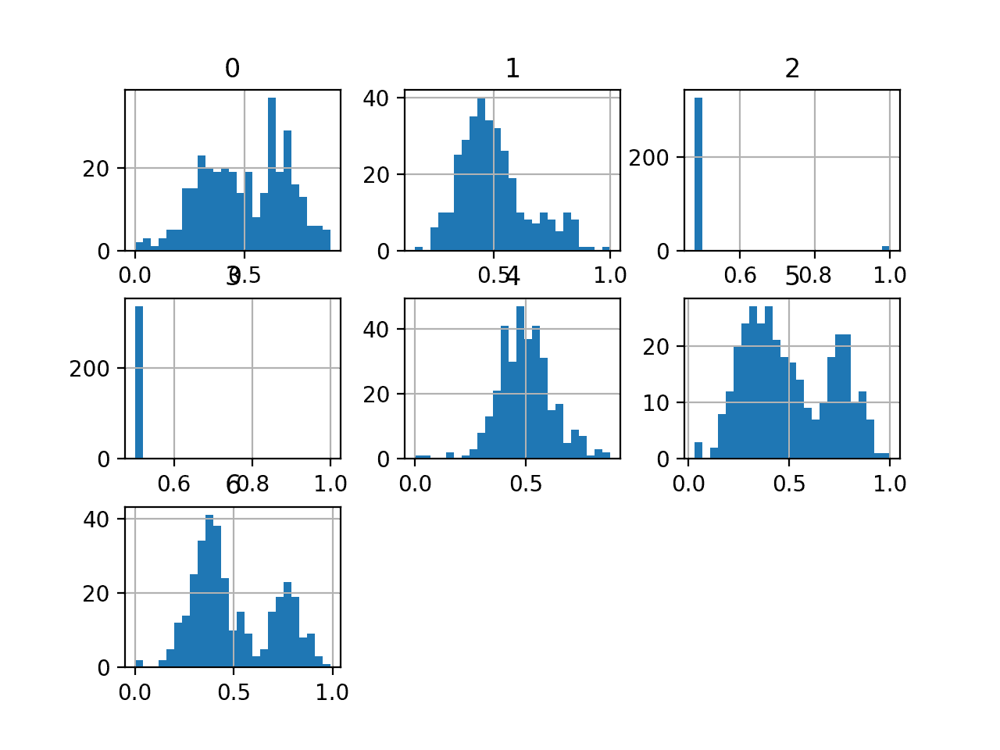
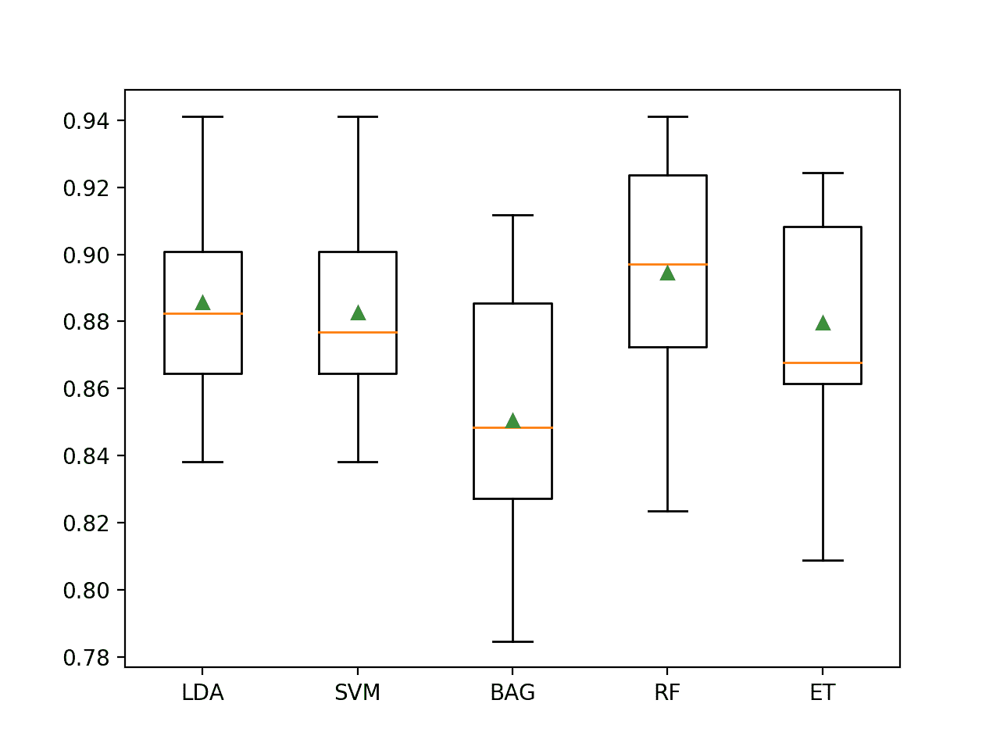

# 大肠杆菌数据集的不平衡多类分类

> 原文：<https://machinelearningmastery.com/imbalanced-multiclass-classification-with-the-e-coli-dataset/>

最后更新于 2021 年 1 月 5 日

多类分类问题是指一个标签必须被预测，但是有两个以上的标签可以被预测。

这些都是具有挑战性的预测建模问题，因为一个模型学习问题需要足够数量的每个类的代表性例子。当每个类中的例子数量不平衡，或者偏向一个或几个类，而其他类的例子很少时，这就变得很有挑战性。

这类问题被称为不平衡多类分类问题，它们需要仔细设计评估指标和测试工具，并选择机器学习模型。大肠杆菌蛋白质定位位点数据集是探索不平衡多类分类挑战的标准数据集。

在本教程中，您将发现如何为不平衡的多类大肠杆菌数据集开发和评估模型。

完成本教程后，您将知道:

*   如何加载和探索数据集，并为数据准备和模型选择产生想法。
*   如何系统地评估一套具有强大测试工具的机器学习模型。
*   如何拟合最终模型并使用它来预测特定示例的类标签。

**用我的新书[Python 不平衡分类](https://machinelearningmastery.com/imbalanced-classification-with-python/)启动你的项目**，包括*分步教程*和所有示例的 *Python 源代码*文件。

我们开始吧。

*   **2021 年 1 月更新**:更新了 API 文档的链接。


大肠杆菌数据集的不平衡多类分类
图片由[马库斯](https://flickr.com/photos/tempoworld/16957865281/)提供，保留部分权利。

## 教程概述

本教程分为五个部分；它们是:

1.  大肠杆菌数据集
2.  浏览数据集
3.  模型测试和基线结果
4.  评估模型
    1.  评估机器学习算法
    2.  评估数据过采样
5.  对新数据进行预测

## 大肠杆菌数据集

在这个项目中，我们将使用标准的不平衡机器学习数据集，称为“*大肠杆菌*”数据集，也称为“*蛋白质定位位点*”数据集。

该数据集描述了利用大肠杆菌蛋白质在细胞定位位点的氨基酸序列对其进行分类的问题。也就是说，根据蛋白质折叠前的化学成分来预测蛋白质如何与细胞结合。

该数据集归功于中井贤三，并由[保罗·霍顿](https://paulhorton.gitlab.io/)和[中井贤三在 1996 年发表的论文《预测蛋白质细胞定位位点的概率分类系统》](https://www.hgc.jp/~knakai/)中发展成目前的形式其中，他们达到了 81%的分类准确率。

> 336 个大肠杆菌蛋白被分为 8 类，准确率为 81%

——[预测蛋白质细胞定位位点的概率分类系统](https://www.ncbi.nlm.nih.gov/pubmed/8877510)，1996。

数据集由 336 个大肠杆菌蛋白质的例子组成，每个例子使用从蛋白质氨基酸序列计算的七个输入变量来描述。

忽略序列名称，输入特征描述如下:

*   **mcg** : McGeoch 的信号序列识别方法。
*   **gvh** :冯·海涅的信号序列识别方法。
*   **lip** :冯·海金氏信号肽酶 II 共有序列评分。
*   **chg** :预测脂蛋白的氮末端存在电荷。
*   **aac** :外膜和周质蛋白氨基酸含量判别分析得分。
*   **ALM 1**:ALOM 跨膜区预测项目得分。
*   **alm2** :从序列中排除假定的可裂解信号区后的 ALOM 程序评分。

有八个类别描述如下:

*   **cp** :细胞质
*   **im** :内膜无信号序列
*   **pp** :周质
*   **imU** :内膜，不可分裂信号序列
*   **om** :外膜
*   **omL** :外膜脂蛋白
*   **imL** :内膜脂蛋白
*   **imS** :内膜，可裂解信号序列

各班级之间的范例分布不均衡，在某些情况下严重失衡。

例如，“ *cp* ”类有 143 个例子，而“ *imL* ”和“ *imS* ”类各只有两个例子。

接下来，让我们仔细看看数据。

## 浏览数据集

首先，下载并解压缩数据集，并将其保存在您当前的工作目录中，名称为“ *ecoli.csv* ”。

请注意，此版本的数据集删除了第一列(序列名称)，因为它不包含建模的通用信息。

*   [下载大肠杆菌数据集(ecoli.csv)](https://raw.githubusercontent.com/jbrownlee/Datasets/master/ecoli.csv)

查看文件的内容。

文件的前几行应该如下所示:

```py
0.49,0.29,0.48,0.50,0.56,0.24,0.35,cp
0.07,0.40,0.48,0.50,0.54,0.35,0.44,cp
0.56,0.40,0.48,0.50,0.49,0.37,0.46,cp
0.59,0.49,0.48,0.50,0.52,0.45,0.36,cp
0.23,0.32,0.48,0.50,0.55,0.25,0.35,cp
...
```

我们可以看到输入变量都是数字，类标签是字符串值，需要在建模之前进行标签编码。

可以使用 [read_csv()熊猫函数](https://pandas.pydata.org/pandas-docs/stable/reference/api/pandas.read_csv.html)将数据集加载为数据帧，指定文件的位置和没有标题行的事实。

```py
...
# define the dataset location
filename = 'ecoli.csv'
# load the csv file as a data frame
dataframe = read_csv(filename, header=None)
```

加载后，我们可以通过打印[数据框](https://pandas.pydata.org/pandas-docs/stable/reference/api/pandas.DataFrame.html)的形状来总结行数和列数。

```py
...
# summarize the shape of the dataset
print(dataframe.shape)
```

接下来，我们可以为每个输入变量计算一个五位数的摘要。

```py
...
# describe the dataset
set_option('precision', 3)
print(dataframe.describe())
```

最后，我们还可以使用 [Counter](https://docs.python.org/3/library/collections.html) 对象总结每个类中的示例数量。

```py
...
# summarize the class distribution
target = dataframe.values[:,-1]
counter = Counter(target)
for k,v in counter.items():
	per = v / len(target) * 100
	print('Class=%s, Count=%d, Percentage=%.3f%%' % (k, v, per))
```

将这些联系在一起，下面列出了加载和汇总数据集的完整示例。

```py
# load and summarize the dataset
from pandas import read_csv
from pandas import set_option
from collections import Counter
# define the dataset location
filename = 'ecoli.csv'
# load the csv file as a data frame
dataframe = read_csv(filename, header=None)
# summarize the shape of the dataset
print(dataframe.shape)
# describe the dataset
set_option('precision', 3)
print(dataframe.describe())
# summarize the class distribution
target = dataframe.values[:,-1]
counter = Counter(target)
for k,v in counter.items():
	per = v / len(target) * 100
	print('Class=%s, Count=%d, Percentage=%.3f%%' % (k, v, per))
```

运行该示例首先加载数据集并确认行数和列数，它们是 336 行、7 个输入变量和 1 个目标变量。

回顾每个变量的摘要，似乎变量已经居中，也就是说，移动到平均值为 0.5。看起来变量已经被标准化了，这意味着所有的值都在大约 0 到 1 的范围内；至少没有变量的值超出这个范围。

然后总结类别分布，确认每个类别的观测值存在严重偏差。我们可以看到“ *cp* ”类占优势，约占 42%的例子，少数类如“ *imS* ”、“ *imL* ”和“ *omL* ”约占数据集的 1%或更少。

可能没有足够的数据来概括这些少数群体。一种方法可能是简单地删除这些类的示例。

```py
(336, 8)
             0        1        2        3        4        5        6
count  336.000  336.000  336.000  336.000  336.000  336.000  336.000
mean     0.500    0.500    0.495    0.501    0.500    0.500    0.500
std      0.195    0.148    0.088    0.027    0.122    0.216    0.209
min      0.000    0.160    0.480    0.500    0.000    0.030    0.000
25%      0.340    0.400    0.480    0.500    0.420    0.330    0.350
50%      0.500    0.470    0.480    0.500    0.495    0.455    0.430
75%      0.662    0.570    0.480    0.500    0.570    0.710    0.710
max      0.890    1.000    1.000    1.000    0.880    1.000    0.990

Class=cp, Count=143, Percentage=42.560%
Class=im, Count=77, Percentage=22.917%
Class=imS, Count=2, Percentage=0.595%
Class=imL, Count=2, Percentage=0.595%
Class=imU, Count=35, Percentage=10.417%
Class=om, Count=20, Percentage=5.952%
Class=omL, Count=5, Percentage=1.488%
Class=pp, Count=52, Percentage=15.476%
```

我们还可以通过为每个变量创建直方图来查看输入变量的分布。

下面列出了创建所有输入变量直方图的完整示例。

```py
# create histograms of all variables
from pandas import read_csv
from matplotlib import pyplot
# define the dataset location
filename = 'ecoli.csv'
# load the csv file as a data frame
df = read_csv(filename, header=None)
# create a histogram plot of each variable
df.hist(bins=25)
# show the plot
pyplot.show()
```

我们可以看到，变量如 0、5 和 6 可能具有多模态分布。变量 2 和 3 可以具有二进制分布，而变量 1 和 4 可以具有类似于[高斯分布](https://machinelearningmastery.com/continuous-probability-distributions-for-machine-learning/)。

根据模型的选择，数据集可能会受益于标准化、规范化，也许还会受益于幂变换。



大肠杆菌数据集中变量的直方图

现在我们已经回顾了数据集，让我们看看开发一个测试工具来评估候选模型。

## 模型测试和基线结果

k-fold 交叉验证程序对模型表现提供了一个良好的总体估计，至少与单个列车试验分割相比，不会过于乐观。我们将使用 *k=5* ，这意味着每个折叠将包含大约 336/5 或大约 67 个示例。

分层意味着每个文件夹的目标是按类包含与整个训练数据集相同的混合示例。重复意味着评估过程将执行多次，以帮助避免侥幸结果，并更好地捕捉所选模型的方差。我们将使用三次重复。

这意味着单个模型将被拟合和评估 5 * 3 或 15 次，并且将报告这些运行的平均值和标准偏差。

这可以使用[repeated stratifiedfold](https://Sklearn.org/stable/modules/generated/sklearn.model_selection.RepeatedStratifiedKFold.html)Sklearn 类来实现。

所有的课都同等重要。因此，在这种情况下，我们将使用分类精度来评估模型。

首先，我们可以定义一个函数来加载数据集，并将输入变量分成输入和输出变量，并使用标签编码器来确保类标签按顺序编号。

```py
# load the dataset
def load_dataset(full_path):
	# load the dataset as a numpy array
	data = read_csv(full_path, header=None)
	# retrieve numpy array
	data = data.values
	# split into input and output elements
	X, y = data[:, :-1], data[:, -1]
	# label encode the target variable to have the classes 0 and 1
	y = LabelEncoder().fit_transform(y)
	return X, y
```

我们可以定义一个函数，使用分层重复的 5 重交叉验证来评估候选模型，然后返回一个在模型上为每次重复计算的分数列表。

下面的 *evaluate_model()* 函数实现了这一点。

```py
# evaluate a model
def evaluate_model(X, y, model):
	# define evaluation procedure
	cv = RepeatedStratifiedKFold(n_splits=5, n_repeats=3, random_state=1)
	# evaluate model
	scores = cross_val_score(model, X, y, scoring='accuracy', cv=cv, n_jobs=-1)
	return scores
```

然后我们可以调用 *load_dataset()* 函数加载并确认大肠杆菌数据集。

```py
...
# define the location of the dataset
full_path = 'ecoli.csv'
# load the dataset
X, y = load_dataset(full_path)
# summarize the loaded dataset
print(X.shape, y.shape, Counter(y))
```

在这种情况下，我们将评估在所有情况下预测多数类的基线策略。

这可以通过使用 [DummyClassifier](https://machinelearningmastery.com/how-to-develop-and-evaluate-naive-classifier-strategies-using-probability/) 类并将“*策略*”设置为“*最频繁*”来自动实现，该策略将预测训练数据集中最常见的类(例如类' *cp* ')。因此，鉴于这是训练数据集中最常见类别的分布，我们预计该模型将达到约 42%的分类准确率。

```py
...
# define the reference model
model = DummyClassifier(strategy='most_frequent')
```

然后，我们可以通过调用我们的 *evaluate_model()* 函数来评估模型，并报告结果的平均值和标准差。

```py
...
# evaluate the model
scores = evaluate_model(X, y, model)
# summarize performance
print('Mean Accuracy: %.3f (%.3f)' % (mean(scores), std(scores)))
```

将所有这些结合在一起，下面列出了在大肠杆菌数据集上使用分类精度评估基线模型的完整示例。

```py
# baseline model and test harness for the ecoli dataset
from collections import Counter
from numpy import mean
from numpy import std
from pandas import read_csv
from sklearn.preprocessing import LabelEncoder
from sklearn.model_selection import cross_val_score
from sklearn.model_selection import RepeatedStratifiedKFold
from sklearn.dummy import DummyClassifier

# load the dataset
def load_dataset(full_path):
	# load the dataset as a numpy array
	data = read_csv(full_path, header=None)
	# retrieve numpy array
	data = data.values
	# split into input and output elements
	X, y = data[:, :-1], data[:, -1]
	# label encode the target variable to have the classes 0 and 1
	y = LabelEncoder().fit_transform(y)
	return X, y

# evaluate a model
def evaluate_model(X, y, model):
	# define evaluation procedure
	cv = RepeatedStratifiedKFold(n_splits=5, n_repeats=3, random_state=1)
	# evaluate model
	scores = cross_val_score(model, X, y, scoring='accuracy', cv=cv, n_jobs=-1)
	return scores

# define the location of the dataset
full_path = 'ecoli.csv'
# load the dataset
X, y = load_dataset(full_path)
# summarize the loaded dataset
print(X.shape, y.shape, Counter(y))
# define the reference model
model = DummyClassifier(strategy='most_frequent')
# evaluate the model
scores = evaluate_model(X, y, model)
# summarize performance
print('Mean Accuracy: %.3f (%.3f)' % (mean(scores), std(scores)))
```

运行该示例首先加载数据集，并按照我们的预期正确地报告案例数为 336，以及类标签的分布。

然后使用重复分层的 [k 倍交叉验证](https://machinelearningmastery.com/k-fold-cross-validation/)评估带有我们默认策略的*Dummy 分类器*，分类精度的平均值和标准偏差报告为大约 42.6%。

```py
(336, 7) (336,) Counter({0: 143, 1: 77, 7: 52, 4: 35, 5: 20, 6: 5, 3: 2, 2: 2})
Mean Accuracy: 0.426 (0.006)
```

模型评估期间会报告警告；例如:

```py
Warning: The least populated class in y has only 2 members, which is too few. The minimum number of members in any class cannot be less than n_splits=5.
```

这是因为有些类没有足够数量的 5 重交叉验证示例，例如类“ *imS* ”和“ *imL* ”。

在这种情况下，我们将从数据集中移除这些示例。这可以通过更新 *load_dataset()* 来移除具有这些类的行来实现，例如四行。

```py
# load the dataset
def load_dataset(full_path):
	# load the dataset as a numpy array
	df = read_csv(full_path, header=None)
	# remove rows for the minority classes
	df = df[df[7] != 'imS']
	df = df[df[7] != 'imL']
	# retrieve numpy array
	data = df.values
	# split into input and output elements
	X, y = data[:, :-1], data[:, -1]
	# label encode the target variable to have the classes 0 and 1
	y = LabelEncoder().fit_transform(y)
	return X, y
```

然后，我们可以重新运行该示例来建立分类准确性的基线。

下面列出了完整的示例。

```py
# baseline model and test harness for the ecoli dataset
from collections import Counter
from numpy import mean
from numpy import std
from pandas import read_csv
from sklearn.preprocessing import LabelEncoder
from sklearn.model_selection import cross_val_score
from sklearn.model_selection import RepeatedStratifiedKFold
from sklearn.dummy import DummyClassifier

# load the dataset
def load_dataset(full_path):
	# load the dataset as a numpy array
	df = read_csv(full_path, header=None)
	# remove rows for the minority classes
	df = df[df[7] != 'imS']
	df = df[df[7] != 'imL']
	# retrieve numpy array
	data = df.values
	# split into input and output elements
	X, y = data[:, :-1], data[:, -1]
	# label encode the target variable to have the classes 0 and 1
	y = LabelEncoder().fit_transform(y)
	return X, y

# evaluate a model
def evaluate_model(X, y, model):
	# define evaluation procedure
	cv = RepeatedStratifiedKFold(n_splits=5, n_repeats=3, random_state=1)
	# evaluate model
	scores = cross_val_score(model, X, y, scoring='accuracy', cv=cv, n_jobs=-1)
	return scores

# define the location of the dataset
full_path = 'ecoli.csv'
# load the dataset
X, y = load_dataset(full_path)
# summarize the loaded dataset
print(X.shape, y.shape, Counter(y))
# define the reference model
model = DummyClassifier(strategy='most_frequent')
# evaluate the model
scores = evaluate_model(X, y, model)
# summarize performance
print('Mean Accuracy: %.3f (%.3f)' % (mean(scores), std(scores)))
```

运行该示例确认示例数量减少了四个，从 336 个减少到 332 个。

我们还可以看到班级数量从八个减少到六个(从 0 班到 5 班)。

表现的基线被确定为 43.1%。该分数提供了该数据集的基线，通过该基线可以比较所有其他分类算法。得分高于约 43.1%表示模型在此数据集上有技能，得分等于或低于此值表示模型在此数据集上没有技能。

```py
(332, 7) (332,) Counter({0: 143, 1: 77, 5: 52, 2: 35, 3: 20, 4: 5})
Mean Accuracy: 0.431 (0.005)
```

现在我们已经有了测试工具和表现基线，我们可以开始在这个数据集上评估一些模型了。

## 评估模型

在本节中，我们将使用上一节中开发的测试工具来评估数据集上的一套不同技术。

报告的表现良好，但没有高度优化(例如，超参数没有调整)。

**你能做得更好吗？**如果你能用同样的测试装具达到更好的分类准确率，我很想听听。请在下面的评论中告诉我。

### 评估机器学习算法

让我们从评估数据集上的混合机器学习模型开始。

在数据集上抽查一套不同的非线性算法可能是一个好主意，以便快速找出哪些算法运行良好，值得进一步关注，哪些算法运行不佳。

我们将在大肠杆菌数据集上评估以下机器学习模型:

*   线性判别分析
*   支持向量机(SVM)
*   袋装决策树
*   随机森林
*   额外树

我们将主要使用默认的模型超参数，除了集成算法中的树的数量，我们将设置为合理的默认值 1000。

我们将依次定义每个模型，并将它们添加到一个列表中，以便我们可以顺序评估它们。下面的 *get_models()* 函数定义了用于评估的模型列表，以及用于以后绘制结果的模型简称列表。

```py
# define models to test
def get_models():
	models, names = list(), list()
	# LDA
	models.append(LinearDiscriminantAnalysis())
	names.append('LDA')
	# SVM
	models.append(LinearSVC())
	names.append('SVM')
	# Bagging
	models.append(BaggingClassifier(n_estimators=1000))
	names.append('BAG')
	# RF
	models.append(RandomForestClassifier(n_estimators=1000))
	names.append('RF')
	# ET
	models.append(ExtraTreesClassifier(n_estimators=1000))
	names.append('ET')
	return models, names
```

然后，我们可以依次列举模型列表，并对每个模型进行评估，存储分数供以后评估。

```py
...
# define models
models, names = get_models()
results = list()
# evaluate each model
for i in range(len(models)):
	# evaluate the model and store results
	scores = evaluate_model(X, y, models[i])
	results.append(scores)
	# summarize performance
	print('>%s %.3f (%.3f)' % (names[i], mean(scores), std(scores)))
```

在运行结束时，我们可以将每个分数样本绘制成一个方框，并用相同的比例绘制晶须图，这样我们就可以直接比较分布。

```py
...
# plot the results
pyplot.boxplot(results, labels=names, showmeans=True)
pyplot.show()
```

下面列出了在大肠杆菌数据集上评估一套机器学习算法的完整示例。

```py
# spot check machine learning algorithms on the ecoli dataset
from numpy import mean
from numpy import std
from pandas import read_csv
from matplotlib import pyplot
from sklearn.preprocessing import LabelEncoder
from sklearn.model_selection import cross_val_score
from sklearn.model_selection import RepeatedStratifiedKFold
from sklearn.svm import LinearSVC
from sklearn.discriminant_analysis import LinearDiscriminantAnalysis
from sklearn.ensemble import RandomForestClassifier
from sklearn.ensemble import ExtraTreesClassifier
from sklearn.ensemble import BaggingClassifier

# load the dataset
def load_dataset(full_path):
	# load the dataset as a numpy array
	df = read_csv(full_path, header=None)
	# remove rows for the minority classes
	df = df[df[7] != 'imS']
	df = df[df[7] != 'imL']
	# retrieve numpy array
	data = df.values
	# split into input and output elements
	X, y = data[:, :-1], data[:, -1]
	# label encode the target variable
	y = LabelEncoder().fit_transform(y)
	return X, y

# evaluate a model
def evaluate_model(X, y, model):
	# define evaluation procedure
	cv = RepeatedStratifiedKFold(n_splits=5, n_repeats=3, random_state=1)
	# evaluate model
	scores = cross_val_score(model, X, y, scoring='accuracy', cv=cv, n_jobs=-1)
	return scores

# define models to test
def get_models():
	models, names = list(), list()
	# LDA
	models.append(LinearDiscriminantAnalysis())
	names.append('LDA')
	# SVM
	models.append(LinearSVC())
	names.append('SVM')
	# Bagging
	models.append(BaggingClassifier(n_estimators=1000))
	names.append('BAG')
	# RF
	models.append(RandomForestClassifier(n_estimators=1000))
	names.append('RF')
	# ET
	models.append(ExtraTreesClassifier(n_estimators=1000))
	names.append('ET')
	return models, names

# define the location of the dataset
full_path = 'ecoli.csv'
# load the dataset
X, y = load_dataset(full_path)
# define models
models, names = get_models()
results = list()
# evaluate each model
for i in range(len(models)):
	# evaluate the model and store results
	scores = evaluate_model(X, y, models[i])
	results.append(scores)
	# summarize performance
	print('>%s %.3f (%.3f)' % (names[i], mean(scores), std(scores)))
# plot the results
pyplot.boxplot(results, labels=names, showmeans=True)
pyplot.show()
```

运行该示例依次评估每个算法，并报告平均和标准偏差分类精度。

**注**:考虑到算法或评估程序的随机性，或数值精度的差异，您的[结果可能会有所不同](https://machinelearningmastery.com/different-results-each-time-in-machine-learning/)。考虑运行该示例几次，并比较平均结果。

在这种情况下，我们可以看到所有测试的算法都有技巧，达到了高于默认的 43.1%的准确率。

结果表明，大多数算法在这个数据集上表现良好，决策树的集成表现最好，额外树达到 88%的准确率，随机森林达到 89.5%的准确率。

```py
>LDA 0.886 (0.027)
>SVM 0.883 (0.027)
>BAG 0.851 (0.037)
>RF 0.895 (0.032)
>ET 0.880 (0.030)
```

创建一个图形，显示每个算法结果样本的一个方框和须图。方框显示中间 50%的数据，每个方框中间的橙色线显示样本的中值，每个方框中的绿色三角形显示样本的平均值。

我们可以看到，聚类在一起的决策树集合的分数分布与测试的其他算法是分开的。在大多数情况下，图中的平均值和中位数很接近，这表明分数的分布有些对称，这可能表明模型是稳定的。



不平衡大肠杆菌数据集上机器学习模型的盒须图

### 评估数据过采样

由于许多类中的类如此之多，示例如此之少，数据集可能会受益于过采样。

我们可以测试适用于除多数类( *cp* )之外的所有类的 SMOTE 算法，从而提升表现。

一般来说，SMOTE 似乎不能帮助决策树的集成，因此我们将测试的算法集更改为以下内容:

*   多项式逻辑回归
*   线性判别分析
*   支持向量机(SVM)
*   k 近邻(KNN)
*   高斯过程

定义这些模型的 *get_models()* 函数的更新版本如下。

```py
# define models to test
def get_models():
	models, names = list(), list()
	# LR
	models.append(LogisticRegression(solver='lbfgs', multi_class='multinomial'))
	names.append('LR')
	# LDA
	models.append(LinearDiscriminantAnalysis())
	names.append('LDA')
	# SVM
	models.append(LinearSVC())
	names.append('SVM')
	# KNN
	models.append(KNeighborsClassifier(n_neighbors=3))
	names.append('KNN')
	# GP
	models.append(GaussianProcessClassifier())
	names.append('GP')
	return models, names
```

我们可以使用不平衡学习库中的 [SMOTE](https://imbalanced-learn.org/stable/generated/imblearn.over_sampling.SMOTE.html) 实现和同一库中的[管道](https://imbalanced-learn.org/stable/generated/imblearn.pipeline.Pipeline.html)首先将 SMOTE 应用于训练数据集，然后拟合给定的模型作为交叉验证过程的一部分。

SMOTE 将使用训练数据集中的 k 近邻合成新示例，其中默认情况下， *k* 设置为 5。

这对于我们数据集中的一些类来说太大了。因此，我们将尝试 2 的 *k* 值。

```py
...
# create pipeline
steps = [('o', SMOTE(k_neighbors=2)), ('m', models[i])]
pipeline = Pipeline(steps=steps)
# evaluate the model and store results
scores = evaluate_model(X, y, pipeline)
```

综上所述，下面列出了在大肠杆菌数据集上使用 SMOTE 过采样的完整示例。

```py
# spot check smote with machine learning algorithms on the ecoli dataset
from numpy import mean
from numpy import std
from pandas import read_csv
from matplotlib import pyplot
from sklearn.preprocessing import LabelEncoder
from sklearn.model_selection import cross_val_score
from sklearn.model_selection import RepeatedStratifiedKFold
from sklearn.svm import LinearSVC
from sklearn.discriminant_analysis import LinearDiscriminantAnalysis
from sklearn.neighbors import KNeighborsClassifier
from sklearn.gaussian_process import GaussianProcessClassifier
from sklearn.linear_model import LogisticRegression
from imblearn.pipeline import Pipeline
from imblearn.over_sampling import SMOTE

# load the dataset
def load_dataset(full_path):
	# load the dataset as a numpy array
	df = read_csv(full_path, header=None)
	# remove rows for the minority classes
	df = df[df[7] != 'imS']
	df = df[df[7] != 'imL']
	# retrieve numpy array
	data = df.values
	# split into input and output elements
	X, y = data[:, :-1], data[:, -1]
	# label encode the target variable
	y = LabelEncoder().fit_transform(y)
	return X, y

# evaluate a model
def evaluate_model(X, y, model):
	# define evaluation procedure
	cv = RepeatedStratifiedKFold(n_splits=5, n_repeats=3, random_state=1)
	# evaluate model
	scores = cross_val_score(model, X, y, scoring='accuracy', cv=cv, n_jobs=-1)
	return scores

# define models to test
def get_models():
	models, names = list(), list()
	# LR
	models.append(LogisticRegression(solver='lbfgs', multi_class='multinomial'))
	names.append('LR')
	# LDA
	models.append(LinearDiscriminantAnalysis())
	names.append('LDA')
	# SVM
	models.append(LinearSVC())
	names.append('SVM')
	# KNN
	models.append(KNeighborsClassifier(n_neighbors=3))
	names.append('KNN')
	# GP
	models.append(GaussianProcessClassifier())
	names.append('GP')
	return models, names

# define the location of the dataset
full_path = 'ecoli.csv'
# load the dataset
X, y = load_dataset(full_path)
# define models
models, names = get_models()
results = list()
# evaluate each model
for i in range(len(models)):
	# create pipeline
	steps = [('o', SMOTE(k_neighbors=2)), ('m', models[i])]
	pipeline = Pipeline(steps=steps)
	# evaluate the model and store results
	scores = evaluate_model(X, y, pipeline)
	results.append(scores)
	# summarize performance
	print('>%s %.3f (%.3f)' % (names[i], mean(scores), std(scores)))
# plot the results
pyplot.boxplot(results, labels=names, showmeans=True)
pyplot.show()
```

运行该示例依次评估每个算法，并报告平均和标准偏差分类精度。

**注**:考虑到算法或评估程序的随机性，或数值精度的差异，您的[结果可能会有所不同](https://machinelearningmastery.com/different-results-each-time-in-machine-learning/)。考虑运行该示例几次，并比较平均结果。

在这种情况下，我们可以看到，使用 SMOTE 的 LDA 导致了从 88.6%到大约 87.9%的小幅下降，而使用 SMOTE 的 SVM 看到了从大约 88.3%到大约 88.8%的小幅上升。

在这种情况下，使用 SMOTE 时，SVM 似乎也是表现最好的方法，尽管与上一节中的随机森林相比，它没有实现任何改进。

```py
>LR 0.875 (0.024)
>LDA 0.879 (0.029)
>SVM 0.888 (0.025)
>KNN 0.835 (0.040)
>GP 0.876 (0.023)
```

为每个算法创建分类准确度分数的方框图和触须图。

我们可以看到，LDA 有许多表现异常值，90%的值都很高，这非常有趣。这可能表明，如果专注于丰富的课程，线性判别分析可以表现得更好。


非平衡大肠杆菌数据集上机器学习模型的 SMOTE 盒须图

既然我们已经看到了如何在这个数据集上评估模型，让我们看看如何使用最终模型来进行预测。

## 对新数据进行预测

在本节中，我们可以拟合最终模型，并使用它对单行数据进行预测。

我们将使用随机森林模型作为最终模型，该模型的分类准确率约为 89.5%。

首先，我们可以定义模型。

```py
...
# define model to evaluate
model = RandomForestClassifier(n_estimators=1000)
```

一旦定义好了，我们就可以在整个训练数据集中使用它。

```py
...
# fit the model
model.fit(X, y)
```

一旦适合，我们可以通过调用 *predict()* 函数来使用它对新数据进行预测。这将返回每个示例的编码类标签。

然后我们可以使用标签编码器进行逆变换，得到字符串类标签。

例如:

```py
...
# define a row of data
row = [...]
# predict the class label
yhat = model.predict([row])
label = le.inverse_transform(yhat)[0]
```

为了证明这一点，我们可以使用拟合模型对一些我们知道结果的情况下的标签进行一些预测。

下面列出了完整的示例。

```py
# fit a model and make predictions for the on the ecoli dataset
from pandas import read_csv
from sklearn.preprocessing import LabelEncoder
from sklearn.ensemble import RandomForestClassifier

# load the dataset
def load_dataset(full_path):
	# load the dataset as a numpy array
	df = read_csv(full_path, header=None)
	# remove rows for the minority classes
	df = df[df[7] != 'imS']
	df = df[df[7] != 'imL']
	# retrieve numpy array
	data = df.values
	# split into input and output elements
	X, y = data[:, :-1], data[:, -1]
	# label encode the target variable
	le = LabelEncoder()
	y = le.fit_transform(y)
	return X, y, le

# define the location of the dataset
full_path = 'ecoli.csv'
# load the dataset
X, y, le = load_dataset(full_path)
# define model to evaluate
model = RandomForestClassifier(n_estimators=1000)
# fit the model
model.fit(X, y)
# known class "cp"
row = [0.49,0.29,0.48,0.50,0.56,0.24,0.35]
yhat = model.predict([row])
label = le.inverse_transform(yhat)[0]
print('>Predicted=%s (expected cp)' % (label))
# known class "im"
row = [0.06,0.61,0.48,0.50,0.49,0.92,0.37]
yhat = model.predict([row])
label = le.inverse_transform(yhat)[0]
print('>Predicted=%s (expected im)' % (label))
# known class "imU"
row = [0.72,0.42,0.48,0.50,0.65,0.77,0.79]
yhat = model.predict([row])
label = le.inverse_transform(yhat)[0]
print('>Predicted=%s (expected imU)' % (label))
# known class "om"
row = [0.78,0.68,0.48,0.50,0.83,0.40,0.29]
yhat = model.predict([row])
label = le.inverse_transform(yhat)[0]
print('>Predicted=%s (expected om)' % (label))
# known class "omL"
row = [0.77,0.57,1.00,0.50,0.37,0.54,0.0]
yhat = model.predict([row])
label = le.inverse_transform(yhat)[0]
print('>Predicted=%s (expected omL)' % (label))
# known class "pp"
row = [0.74,0.49,0.48,0.50,0.42,0.54,0.36]
yhat = model.predict([row])
label = le.inverse_transform(yhat)[0]
print('>Predicted=%s (expected pp)' % (label))
```

运行该示例首先在整个训练数据集上拟合模型。

然后，拟合模型用于预测从六个类别中的每一个类别中选取的一个示例的标签。

我们可以看到为每个选择的例子预测了正确的类标签。尽管如此，平均而言，我们预计 10 个预测中有 1 个是错误的，这些错误可能不会平均分布在各个班级。

```py
>Predicted=cp (expected cp)
>Predicted=im (expected im)
>Predicted=imU (expected imU)
>Predicted=om (expected om)
>Predicted=omL (expected omL)
>Predicted=pp (expected pp)
```

## 进一步阅读

如果您想更深入地了解这个主题，本节将提供更多资源。

### 报纸

*   [预测革兰氏阴性菌蛋白质定位位点的专家系统](https://onlinelibrary.wiley.com/doi/abs/10.1002/prot.340110203)，1991。
*   [预测真核细胞中蛋白质定位位点的知识库](https://www.sciencedirect.com/science/article/pii/S0888754305801119)，1992。
*   [预测蛋白质细胞定位位点的概率分类系统](https://www.ncbi.nlm.nih.gov/pubmed/8877510)，1996。

### 蜜蜂

*   [熊猫. read_csv API](https://pandas.pydata.org/pandas-docs/stable/reference/api/pandas.read_csv.html) 。
*   [硬化. dummy . dummy class ification API](https://Sklearn.org/stable/modules/generated/sklearn.dummy.DummyClassifier.html)。
*   [imblearn.over_sampling。SMOTE API](https://imbalanced-learn.org/stable/generated/imblearn.over_sampling.SMOTE.html) 。
*   [imb learn . pipeline . pipeline API](https://imbalanced-learn.org/stable/generated/imblearn.pipeline.Pipeline.html)。

### 资料组

*   [Ecoli 数据集，UCI 机器学习资源库](https://archive.ics.uci.edu/ml/datasets/ecoli)。
*   [Ecoli 数据集下载](https://raw.githubusercontent.com/jbrownlee/Datasets/master/ecoli.csv)。
*   [Ecoli 数据集描述](https://raw.githubusercontent.com/jbrownlee/Datasets/master/ecoli.names)。

## 摘要

在本教程中，您发现了如何为不平衡的多类大肠杆菌数据集开发和评估模型。

具体来说，您了解到:

*   如何加载和探索数据集，并为数据准备和模型选择产生想法。
*   如何系统地评估一套具有强大测试工具的机器学习模型。
*   如何拟合最终模型并使用它来预测特定示例的类标签。

你有什么问题吗？
在下面的评论中提问，我会尽力回答。