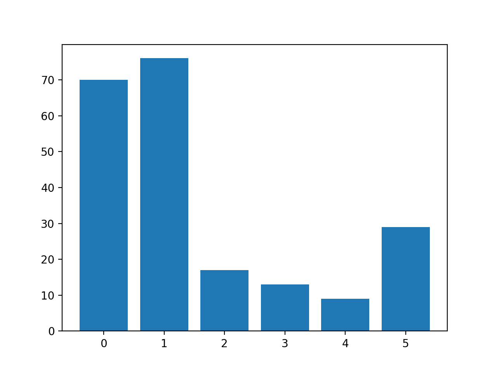
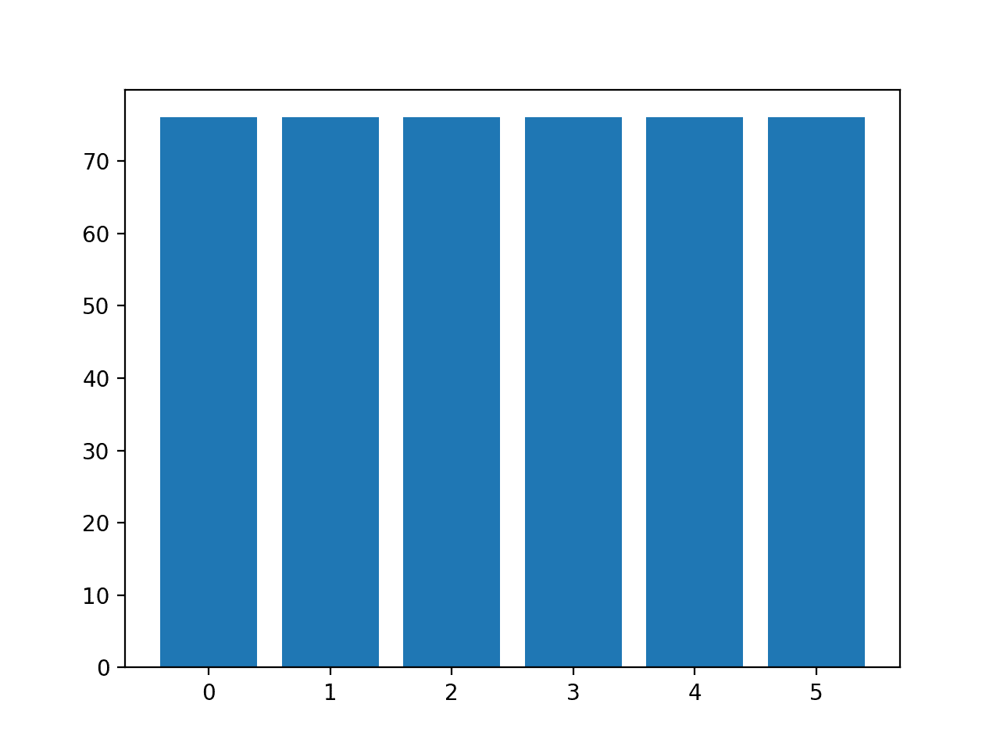
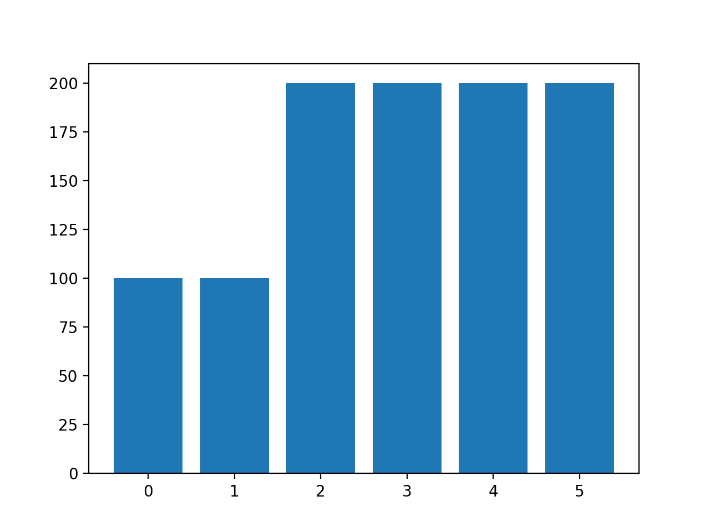

# 多类不平衡分类

> 原文：<https://machinelearningmastery.com/multi-class-imbalanced-classification/>

最后更新于 2021 年 1 月 5 日

不平衡分类是那些预测任务，其中示例在类标签上的分布不相等。

大多数不平衡分类的例子集中在二元分类任务上，然而许多不平衡分类的工具和技术也直接支持多类分类问题。

在本教程中，您将发现如何在多类数据集上使用不平衡分类工具。

完成本教程后，您将知道:

*   关于玻璃鉴定标准不平衡多类预测问题。
*   如何使用 SMOTE 过采样进行不平衡多类分类？
*   如何利用代价敏感学习进行不平衡多类分类？

**用我的新书[Python 不平衡分类](https://machinelearningmastery.com/imbalanced-classification-with-python/)启动你的项目**，包括*分步教程*和所有示例的 *Python 源代码*文件。

我们开始吧。

*   **2021 年 1 月更新**:更新了 API 文档的链接。


多类不平衡分类
图片由 [istolethetv](https://www.flickr.com/photos/istolethetv/8623391483/) 提供，保留部分权利。

## 教程概述

本教程分为三个部分；它们是:

1.  玻璃多类别数据集
2.  多类分类的过采样
3.  面向多类分类的代价敏感学习

## 玻璃多类别数据集

在本教程中，我们将重点讨论标准不平衡多类分类问题，简称为“**玻璃识别**”或简称为“*玻璃*”

该数据集描述了玻璃的化学性质，并涉及使用玻璃样品的化学性质将其分类为六个类别之一。该数据集于 1987 年被记入维娜·斯皮勒名下。

忽略样本识别号，有九个输入变量总结了玻璃数据集的属性；它们是:

*   折射率
*   Na:钠
*   镁:镁
*   铝:铝
*   硅:硅
*   钾:钾
*   钙:钙
*   钡
*   铁

化学成分以相应氧化物的重量百分比来测量。

列出了七种类型的玻璃；它们是:

*   类别 1:构建窗口(浮动处理)
*   类别 2:建筑窗户(非浮动处理)
*   类别 3:车窗(浮动处理)
*   第 4 类:车窗(非浮动处理)
*   第 5 类:容器
*   第 6 类:餐具
*   第 7 类:前照灯

[浮法玻璃](https://en.wikipedia.org/wiki/Float_glass)是指用来制作玻璃的工艺。

数据集中有 214 个观测值，每个类中的观测值数量不平衡。请注意，数据集中没有类别 4(非浮动处理的车窗)的示例。

*   第 1 类:70 个例子
*   第二类:76 个例子
*   第 3 课:17 个例子
*   第 4 类:0 个例子
*   第 5 类:13 个例子
*   第 6 课:9 个例子
*   第 7 课:29 个例子

虽然有少数类，但在这个预测问题中，所有类都同等重要。

数据集可分为窗玻璃(1-4 类)和非窗玻璃(5-7 类)。窗玻璃有 163 个例子，非窗玻璃有 51 个例子。

*   窗玻璃:163 个例子
*   非窗户玻璃:51 个例子

观察的另一个部分是浮法加工玻璃和非浮法加工玻璃，仅针对窗户玻璃。这种划分更加平衡。

*   浮法玻璃:87 个例子
*   非浮法玻璃:76 个例子

您可以在此了解有关数据集的更多信息:

*   [玻璃数据集(glass.csv)](https://raw.githubusercontent.com/jbrownlee/Datasets/master/glass.csv)
*   [玻璃数据集描述(玻璃.名称)](https://raw.githubusercontent.com/jbrownlee/Datasets/master/glass.names)

不需要下载数据集；我们将自动下载它作为工作示例的一部分。

下面是前几行数据的示例。

```py
1.52101,13.64,4.49,1.10,71.78,0.06,8.75,0.00,0.00,1
1.51761,13.89,3.60,1.36,72.73,0.48,7.83,0.00,0.00,1
1.51618,13.53,3.55,1.54,72.99,0.39,7.78,0.00,0.00,1
1.51766,13.21,3.69,1.29,72.61,0.57,8.22,0.00,0.00,1
1.51742,13.27,3.62,1.24,73.08,0.55,8.07,0.00,0.00,1
...
```

我们可以看到所有的输入都是数字，最后一列中的目标变量是整数编码的类标签。

在本教程中，您可以了解有关如何将此数据集作为项目的一部分进行处理的更多信息:

*   [玻璃识别数据集的不平衡多类分类](https://machinelearningmastery.com/)

现在我们已经熟悉了玻璃多类类别数据集，让我们探索如何使用标准的不平衡分类工具。

## 多类分类的过采样

过采样是指复制或合成少数类的新示例，使少数类中的示例数量更接近或匹配多数类中的示例数量。

也许最广泛使用的合成新例子的方法叫做合成少数过采样技术，简称 SMOTE。Nitesh Chawla 等人在 2002 年的论文中描述了这种技术，该论文以名为“ [SMOTE:合成少数过采样技术](https://arxiv.org/abs/1106.1813)的技术命名

您可以在教程中了解有关 SMOTE 的更多信息:

*   [使用 Python 进行不平衡分类的 SMOTE】](https://machinelearningmastery.com/smote-oversampling-for-imbalanced-classification/)

[不平衡学习库](https://imbalanced-learn.org/stable/index.html)提供了一个我们可以使用的 [SMOTE](https://imbalanced-learn.org/stable/generated/imblearn.over_sampling.SMOTE.html) 的实现，它与流行的 Sklearn 库兼容。

首先，必须安装库。我们可以使用 pip 安装它，如下所示:

sudo pip 安装不平衡-学习

我们可以通过打印已安装库的版本来确认安装成功:

```py
# check version number
import imblearn
print(imblearn.__version__)
```

运行该示例将打印已安装库的版本号；例如:

```py
0.6.2
```

在应用 SMOTE 之前，让我们首先加载数据集，并确认每个类中的示例数量。

```py
# load and summarize the dataset
from pandas import read_csv
from collections import Counter
from matplotlib import pyplot
from sklearn.preprocessing import LabelEncoder
# define the dataset location
url = 'https://raw.githubusercontent.com/jbrownlee/Datasets/master/glass.csv'
# load the csv file as a data frame
df = read_csv(url, header=None)
data = df.values
# split into input and output elements
X, y = data[:, :-1], data[:, -1]
# label encode the target variable
y = LabelEncoder().fit_transform(y)
# summarize distribution
counter = Counter(y)
for k,v in counter.items():
	per = v / len(y) * 100
	print('Class=%d, n=%d (%.3f%%)' % (k, v, per))
# plot the distribution
pyplot.bar(counter.keys(), counter.values())
pyplot.show()
```

运行该示例首先下载数据集，并将其分成训练集和测试集。

然后报告每个类中的行数，确认某些类(如 0 和 1)比其他类(如 3 和 4(小于 15))有更多的示例(超过 70 个)。

```py
Class=0, n=70 (32.710%)
Class=1, n=76 (35.514%)
Class=2, n=17 (7.944%)
Class=3, n=13 (6.075%)
Class=4, n=9 (4.206%)
Class=5, n=29 (13.551%)
```

创建了一个条形图，提供数据集的类细分的可视化。

这给出了一个更清晰的概念，即类 0 和 1 比类 2、3、4 和 5 有更多的例子。



玻璃多类类别数据集中每个类的示例直方图

接下来，我们可以应用 SMOTE 对数据集进行过采样。

默认情况下，SMOTE 将对所有类进行过采样，以使其实例数量与实例最多的类相同。

在这种情况下，类 1 的例子最多，为 76 个，因此，SMOTE 将对所有类进行过采样，以获得 76 个例子。

下面列出了使用 SMOTE 对玻璃数据集进行过采样的完整示例。

```py
# example of oversampling a multi-class classification dataset
from pandas import read_csv
from imblearn.over_sampling import SMOTE
from collections import Counter
from matplotlib import pyplot
from sklearn.preprocessing import LabelEncoder
# define the dataset location
url = 'https://raw.githubusercontent.com/jbrownlee/Datasets/master/glass.csv'
# load the csv file as a data frame
df = read_csv(url, header=None)
data = df.values
# split into input and output elements
X, y = data[:, :-1], data[:, -1]
# label encode the target variable
y = LabelEncoder().fit_transform(y)
# transform the dataset
oversample = SMOTE()
X, y = oversample.fit_resample(X, y)
# summarize distribution
counter = Counter(y)
for k,v in counter.items():
	per = v / len(y) * 100
	print('Class=%d, n=%d (%.3f%%)' % (k, v, per))
# plot the distribution
pyplot.bar(counter.keys(), counter.values())
pyplot.show()
```

运行该示例首先加载数据集，并对其应用 SMOTE。

然后报告每个班级中的例子分布，确认每个班级现在有 76 个例子，正如我们所期望的。

```py
Class=0, n=76 (16.667%)
Class=1, n=76 (16.667%)
Class=2, n=76 (16.667%)
Class=3, n=76 (16.667%)
Class=4, n=76 (16.667%)
Class=5, n=76 (16.667%)
```

还创建了类别分布的条形图，提供了一个强有力的视觉指示，表明所有类别现在都有相同数量的示例。



默认 SMOTE 过采样后玻璃多类类别数据集中每个类的示例直方图

我们可以指定每个类中要过采样的示例数，而不是使用 SMOTE 的默认策略将所有类过采样为多数类中的示例数。

例如，我们可以在类 0 和 1 中对 100 个示例进行过采样，在其余类中对 200 个示例进行过采样。这可以通过创建一个字典来实现，该字典将类标签映射到每个类中所需的示例数量，然后通过 SMOTE 类的“ *sampling_strategy* ”参数来指定。

```py
...
# transform the dataset
strategy = {0:100, 1:100, 2:200, 3:200, 4:200, 5:200}
oversample = SMOTE(sampling_strategy=strategy)
X, y = oversample.fit_resample(X, y)
```

综上所述，下面列出了对 SMOTE 使用定制过采样策略的完整示例。

```py
# example of oversampling a multi-class classification dataset with a custom strategy
from pandas import read_csv
from imblearn.over_sampling import SMOTE
from collections import Counter
from matplotlib import pyplot
from sklearn.preprocessing import LabelEncoder
# define the dataset location
url = 'https://raw.githubusercontent.com/jbrownlee/Datasets/master/glass.csv'
# load the csv file as a data frame
df = read_csv(url, header=None)
data = df.values
# split into input and output elements
X, y = data[:, :-1], data[:, -1]
# label encode the target variable
y = LabelEncoder().fit_transform(y)
# transform the dataset
strategy = {0:100, 1:100, 2:200, 3:200, 4:200, 5:200}
oversample = SMOTE(sampling_strategy=strategy)
X, y = oversample.fit_resample(X, y)
# summarize distribution
counter = Counter(y)
for k,v in counter.items():
	per = v / len(y) * 100
	print('Class=%d, n=%d (%.3f%%)' % (k, v, per))
# plot the distribution
pyplot.bar(counter.keys(), counter.values())
pyplot.show()
```

运行该示例会创建所需的采样并总结对数据集的影响，从而确认预期的结果。

```py
Class=0, n=100 (10.000%)
Class=1, n=100 (10.000%)
Class=2, n=200 (20.000%)
Class=3, n=200 (20.000%)
Class=4, n=200 (20.000%)
Class=5, n=200 (20.000%)
```

注意:对于本示例，您可能会看到可以安全忽略的警告，例如:

```py
UserWarning: After over-sampling, the number of samples (200) in class 5 will be larger than the number of samples in the majority class (class #1 -> 76)
```

还会创建一个类别分布的条形图，用于在数据采样后确认指定的类别分布。



定制 SMOTE 过采样后玻璃多类类别数据集中每个类的示例直方图

**注**:使用 SMOTE 这样的数据采样时，必须只应用于训练数据集，不能应用于整个数据集。我建议使用管道来确保在评估模型和使用模型进行预测时正确使用 SMOTE 方法。

在本教程中，您可以看到在管道中正确使用 SMOTE 的示例:

*   [使用 Python 进行不平衡分类的 SMOTE】](https://machinelearningmastery.com/smote-oversampling-for-imbalanced-classification/)

## 面向多类分类的代价敏感学习

大多数机器学习算法假设所有的类都有相同数量的例子。

多类不平衡分类就不是这样了。可以修改算法来改变执行学习的方式，以偏向于那些在训练数据集中具有较少示例的类。这通常被称为成本敏感学习。

有关成本敏感学习的更多信息，请参见教程:

*   [不平衡分类的成本敏感学习](https://machinelearningmastery.com/cost-sensitive-learning-for-imbalanced-classification/)

Sklearn 中的 [RandomForestClassifier 类](https://Sklearn.org/stable/modules/generated/sklearn.ensemble.RandomForestClassifier.html)通过“ *class_weight* ”参数支持对成本敏感的学习。

默认情况下，随机森林类为每个类分配相同的权重。

我们可以在玻璃不平衡多类类别数据集上评估默认随机森林类权重的分类准确率。

下面列出了完整的示例。

```py
# baseline model and test harness for the glass identification dataset
from numpy import mean
from numpy import std
from pandas import read_csv
from sklearn.preprocessing import LabelEncoder
from sklearn.model_selection import cross_val_score
from sklearn.model_selection import RepeatedStratifiedKFold
from sklearn.ensemble import RandomForestClassifier

# load the dataset
def load_dataset(full_path):
	# load the dataset as a numpy array
	data = read_csv(full_path, header=None)
	# retrieve numpy array
	data = data.values
	# split into input and output elements
	X, y = data[:, :-1], data[:, -1]
	# label encode the target variable to have the classes 0 and 1
	y = LabelEncoder().fit_transform(y)
	return X, y

# evaluate a model
def evaluate_model(X, y, model):
	# define evaluation procedure
	cv = RepeatedStratifiedKFold(n_splits=5, n_repeats=3, random_state=1)
	# evaluate model
	scores = cross_val_score(model, X, y, scoring='accuracy', cv=cv, n_jobs=-1)
	return scores

# define the location of the dataset
full_path = 'https://raw.githubusercontent.com/jbrownlee/Datasets/master/glass.csv'
# load the dataset
X, y = load_dataset(full_path)
# define the reference model
model = RandomForestClassifier(n_estimators=1000)
# evaluate the model
scores = evaluate_model(X, y, model)
# summarize performance
print('Mean Accuracy: %.3f (%.3f)' % (mean(scores), std(scores)))
```

运行该示例使用[重复分层 k 倍交叉验证](https://machinelearningmastery.com/k-fold-cross-validation/)评估玻璃数据集上具有 1000 棵树的默认随机森林算法。

平均和标准偏差分类准确度在运行结束时报告。

**注**:考虑到算法或评估程序的随机性，或数值准确率的差异，您的[结果可能会有所不同](https://machinelearningmastery.com/different-results-each-time-in-machine-learning/)。考虑运行该示例几次，并比较平均结果。

在这种情况下，我们可以看到默认模型实现了大约 79.6%的分类准确率。

```py
Mean Accuracy: 0.796 (0.047)
```

我们可以将“ *class_weight* ”参数指定为值“ *balanced* ”，该值将自动计算类权重，以确保每个类在模型训练期间获得相等的权重。

```py
...
# define the model
model = RandomForestClassifier(n_estimators=1000, class_weight='balanced')
```

将这些联系在一起，完整的示例如下所示。

```py
# cost sensitive random forest with default class weights
from numpy import mean
from numpy import std
from pandas import read_csv
from sklearn.preprocessing import LabelEncoder
from sklearn.model_selection import cross_val_score
from sklearn.model_selection import RepeatedStratifiedKFold
from sklearn.ensemble import RandomForestClassifier

# load the dataset
def load_dataset(full_path):
	# load the dataset as a numpy array
	data = read_csv(full_path, header=None)
	# retrieve numpy array
	data = data.values
	# split into input and output elements
	X, y = data[:, :-1], data[:, -1]
	# label encode the target variable
	y = LabelEncoder().fit_transform(y)
	return X, y

# evaluate a model
def evaluate_model(X, y, model):
	# define evaluation procedure
	cv = RepeatedStratifiedKFold(n_splits=5, n_repeats=3, random_state=1)
	# evaluate model
	scores = cross_val_score(model, X, y, scoring='accuracy', cv=cv, n_jobs=-1)
	return scores

# define the location of the dataset
full_path = 'https://raw.githubusercontent.com/jbrownlee/Datasets/master/glass.csv'
# load the dataset
X, y = load_dataset(full_path)
# define the model
model = RandomForestClassifier(n_estimators=1000, class_weight='balanced')
# evaluate the model
scores = evaluate_model(X, y, model)
# summarize performance
print('Mean Accuracy: %.3f (%.3f)' % (mean(scores), std(scores)))
```

运行该示例报告了成本敏感型随机森林在玻璃数据集上的平均和标准偏差分类准确率。

**注**:考虑到算法或评估程序的随机性，或数值准确率的差异，您的[结果可能会有所不同](https://machinelearningmastery.com/different-results-each-time-in-machine-learning/)。考虑运行该示例几次，并比较平均结果。

在这种情况下，我们可以看到默认模型在分类准确率上比成本不敏感的算法版本有所提高，分类准确率为 80.2%，而不是 79.6%。

```py
Mean Accuracy: 0.802 (0.044)
```

“*类权重*”参数获取映射到类权重值的类标签字典。

我们可以用它来指定一个自定义的权重，比如有很多例子的类 0 和 1.0 的默认权重，以及其他类的双类权重 2.0。

```py
...
# define the model
weights = {0:1.0, 1:1.0, 2:2.0, 3:2.0, 4:2.0, 5:2.0}
model = RandomForestClassifier(n_estimators=1000, class_weight=weights)
```

将这些联系在一起，下面列出了在玻璃多类不平衡分类问题上使用自定义类权重进行成本敏感学习的完整示例。

```py
# cost sensitive random forest with custom class weightings
from numpy import mean
from numpy import std
from pandas import read_csv
from sklearn.preprocessing import LabelEncoder
from sklearn.model_selection import cross_val_score
from sklearn.model_selection import RepeatedStratifiedKFold
from sklearn.ensemble import RandomForestClassifier

# load the dataset
def load_dataset(full_path):
	# load the dataset as a numpy array
	data = read_csv(full_path, header=None)
	# retrieve numpy array
	data = data.values
	# split into input and output elements
	X, y = data[:, :-1], data[:, -1]
	# label encode the target variable
	y = LabelEncoder().fit_transform(y)
	return X, y

# evaluate a model
def evaluate_model(X, y, model):
	# define evaluation procedure
	cv = RepeatedStratifiedKFold(n_splits=5, n_repeats=3, random_state=1)
	# evaluate model
	scores = cross_val_score(model, X, y, scoring='accuracy', cv=cv, n_jobs=-1)
	return scores

# define the location of the dataset
full_path = 'https://raw.githubusercontent.com/jbrownlee/Datasets/master/glass.csv'
# load the dataset
X, y = load_dataset(full_path)
# define the model
weights = {0:1.0, 1:1.0, 2:2.0, 3:2.0, 4:2.0, 5:2.0}
model = RandomForestClassifier(n_estimators=1000, class_weight=weights)
# evaluate the model
scores = evaluate_model(X, y, model)
# summarize performance
print('Mean Accuracy: %.3f (%.3f)' % (mean(scores), std(scores)))
```

运行该示例报告了具有自定义权重的玻璃数据集上随机森林的成本敏感版本的均值和标准差分类准确率。

**注**:考虑到算法或评估程序的随机性，或数值准确率的差异，您的[结果可能会有所不同](https://machinelearningmastery.com/different-results-each-time-in-machine-learning/)。考虑运行该示例几次，并比较平均结果。

在这种情况下，我们可以看到，我们实现了准确性的进一步提升，从平衡类权重的 80.2%提升到更偏向类权重的 80.8%。

```py
Mean Accuracy: 0.808 (0.059)
```

## 进一步阅读

如果您想更深入地了解这个主题，本节将提供更多资源。

### 相关教程

*   [玻璃识别数据集的不平衡多类分类](https://machinelearningmastery.com/imbalanced-multiclass-classification-with-the-glass-identification-dataset/)
*   [使用 Python 进行不平衡分类的 SMOTE】](https://machinelearningmastery.com/smote-oversampling-for-imbalanced-classification/)
*   [不平衡分类的成本敏感逻辑回归](https://machinelearningmastery.com/cost-sensitive-logistic-regression/)
*   [不平衡分类的成本敏感学习](https://machinelearningmastery.com/cost-sensitive-learning-for-imbalanced-classification/)

### 蜜蜂

*   [imblearn.over_sampling。SMOTE API](https://imbalanced-learn.org/stable/generated/imblearn.over_sampling.SMOTE.html) 。
*   [硬化。一起。随机应变分类 API](https://Sklearn.org/stable/modules/generated/sklearn.ensemble.RandomForestClassifier.html) 。

## 摘要

在本教程中，您发现了如何对多类数据集使用不平衡分类工具。

具体来说，您了解到:

*   关于玻璃鉴定标准不平衡多类预测问题。
*   如何使用 SMOTE 过采样进行不平衡多类分类？
*   如何利用代价敏感学习进行不平衡多类分类？

**你有什么问题吗？**
在下面的评论中提问，我会尽力回答。