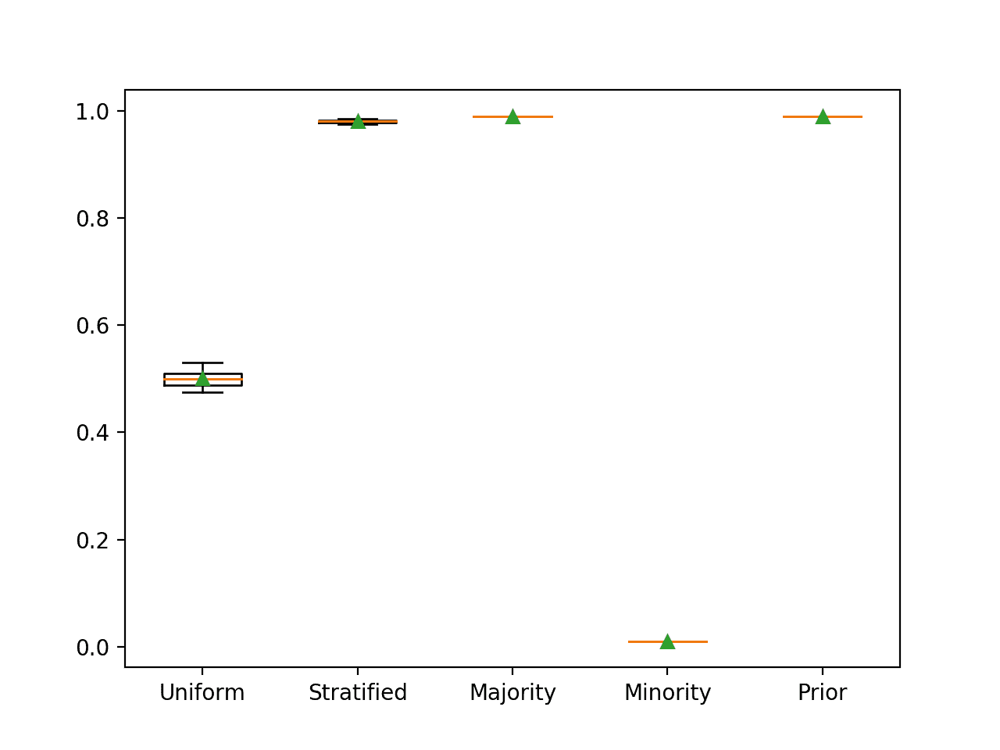
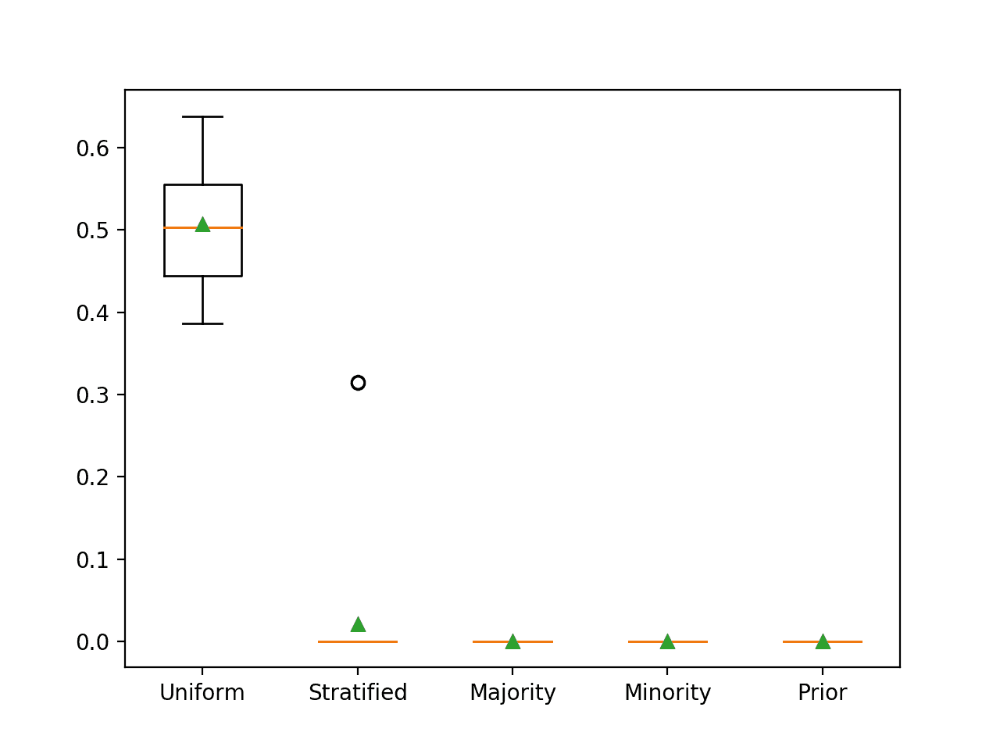
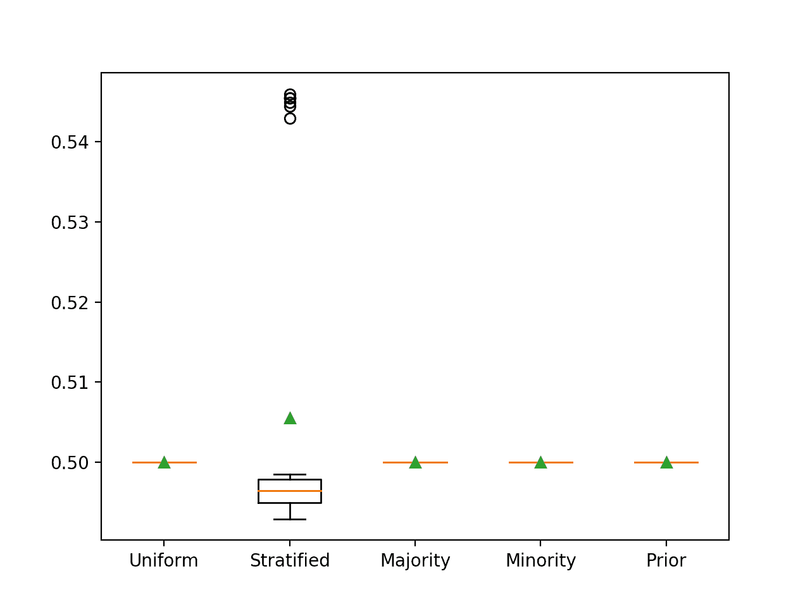
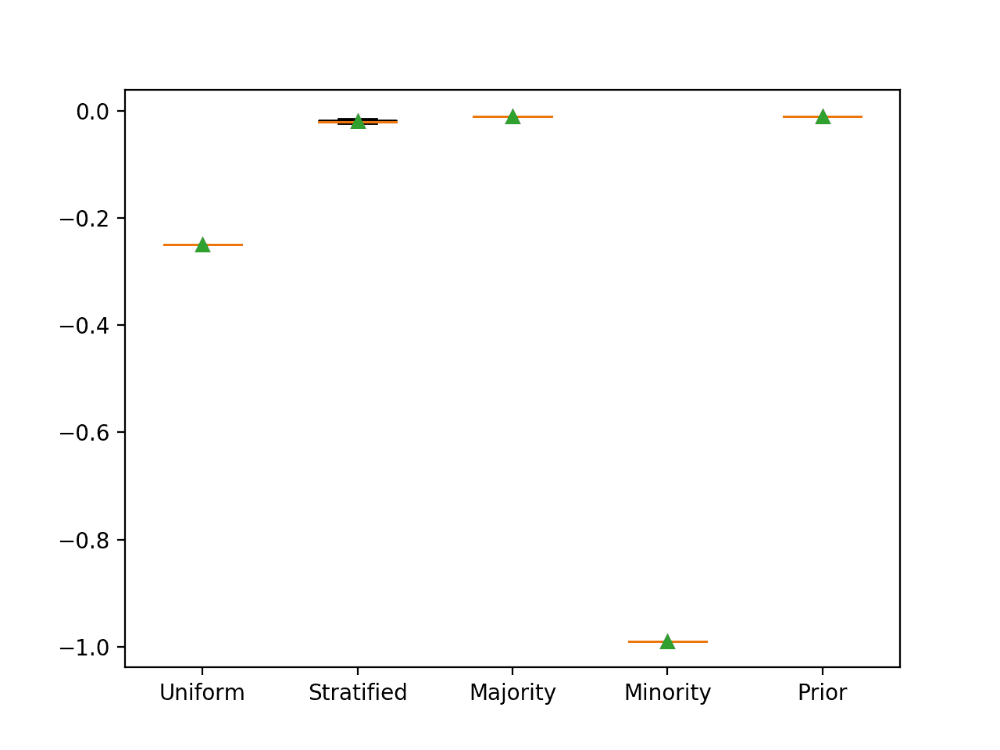

# 每个不平衡分类度量的朴素分类器是什么？

> 原文：<https://machinelearningmastery.com/naive-classifiers-imbalanced-classification-metrics/>

最后更新于 2020 年 8 月 27 日

初学者常犯的一个错误是在没有建立表现基线的情况下将机器学习算法应用到问题中。

一个[表现基线](https://machinelearningmastery.com/how-to-know-if-your-machine-learning-model-has-good-performance/)提供了一个最小分数，超过这个分数，一个模型被认为在数据集上有技能。它还为数据集上评估的所有模型提供了一个相对改进点。可以使用简单的分类器建立基线，例如为测试数据集中的所有示例预测一个类标签。

初学者犯的另一个常见错误是使用分类准确率作为具有不平衡类分布的问题的表现度量。即使预测所有情况下的多数类，这也会导致高准确度分数。相反，必须在一组分类度量中选择一个替代表现度量。

挑战在于表现的基线取决于表现指标的选择。因此，为了选择合适的朴素分类器来建立表现基线，可能需要对每个表现度量有深入的了解。

在本教程中，您将发现为每个不平衡的分类表现度量使用哪个朴素分类器。

完成本教程后，您将知道:

*   评估不平衡分类问题的机器学习模型时要考虑的指标。
*   可用于计算模型表现基线的简单分类策略。
*   用于每个度量的朴素分类器，包括基本原理和演示结果的工作示例。

**用我的新书[Python 不平衡分类](https://machinelearningmastery.com/imbalanced-classification-with-python/)启动你的项目**，包括*分步教程*和所有示例的 *Python 源代码*文件。

我们开始吧。


每个不平衡分类度量的朴素分类器是什么？
土地管理局摄影，版权所有。

## 教程概述

本教程分为四个部分；它们是:

1.  不平衡分类的度量
2.  朴素分类模型
3.  分类度量的朴素分类器
    1.  准确性的朴素分类器
    2.  G 均值的朴素分类器
    3.  F-测度的朴素分类器
    4.  ROC AUC 的朴素分类器
    5.  精确召回 AUC 的朴素分类器
    6.  布瑞尔分数的朴素分类器
4.  映射摘要

## 不平衡分类的度量

不平衡分类有许多标准可供选择。

选择度量标准可能是项目最重要的一步，因为选择错误的度量标准可能会导致优化和选择一个模型来解决与您实际想要解决的问题不同的问题。

因此，从几十或几百个最常用的度量中，可能有 5 个度量用于不平衡分类。它们如下:

评估预测类别标签的指标:

*   准确性。
*   平均。
*   F1-测量。
*   f 0.5-测量。
*   F2-测量。

评估预测概率的指标:

*   曲线下面积。
*   曲线下精确召回区域。
*   布瑞尔分数。

有关如何计算每个指标的更多信息，请参见教程:

*   [不平衡分类评估指标之旅](https://machinelearningmastery.com/tour-of-evaluation-metrics-for-imbalanced-classification/)

## 朴素分类模型

[朴素分类器](https://machinelearningmastery.com/how-to-develop-and-evaluate-naive-classifier-strategies-using-probability/)是一种没有逻辑的分类算法，它为类别数据集提供了表现基线。

为类别数据集建立表现基线非常重要。它在沙地上提供了一条线，通过这条线可以比较所有其他算法。得分低于朴素分类模型的算法在数据集上没有技能，而得分高于朴素分类模型的算法在数据集上有一些技能。

也许有五种不同的朴素分类方法可以用来建立数据集的表现基线。

在不平衡两类(二进制)分类问题的背景下解释，朴素分类方法如下:

*   **均匀随机猜测**:等概率预测 0 或 1。
*   **先验随机猜测**:预测数据集中与先验概率成正比的 0 或 1。
*   **多数类**:预测 0。
*   **少数民族类**:预测 1。
*   **类先验**:预测每个类的先验概率。

这些可以使用 Sklearn 库的[DummyCollector](https://Sklearn.org/stable/modules/generated/sklearn.dummy.DummyClassifier.html)类来实现。

这个类提供了策略参数，允许使用不同的朴素分类器技术。例子包括:

*   **齐刷刷随机猜测**:将“*战略*参数设置为“*齐刷刷*”。
*   **先验随机猜测**:将“*战略*论证设置为“*分层*”。
*   **多数类**:将“*战略*论证设置为“*最 _ 频繁*”。
*   **少数民族类**:将“*战略*”参数设置为“*常量*”，将“*常量*参数设置为 1。
*   **类优先**:将“*策略*参数设置为“*优先*”。

有关朴素分类器的更多信息，请参见教程:

*   [如何利用概率开发和评估朴素分类器策略](https://machinelearningmastery.com/how-to-develop-and-evaluate-naive-classifier-strategies-using-probability/)

## 分类度量的朴素分类器

我们已经确定，对于不平衡的分类问题，有许多不同的度量可供选择。

我们还发现，使用一个简单的分类器来确定一个新分类问题的表现基线是至关重要的。

挑战在于，每个分类指标都需要谨慎选择特定的幼稚分类策略，以实现适当的“*无技能*”表现。这可以并且应该使用每个度量的知识来选择，并且可以通过仔细的实验来确认。

在本节中，我们将为每个不平衡的分类度量合理地选择合适的朴素分类器，然后在合成的二进制类别数据集上用经验结果来确认选择。

合成数据集有 10，000 个示例，其中 99%属于多数类(负案例或类别标签 0)，1%属于少数类(正案例或类别标签 1)。

使用三次重复的分层 10 倍交叉验证评估每个朴素分类器策略，并使用这些运行的平均值和标准偏差总结表现。

从度量到朴素分类器的映射可以用于下一个不平衡分类项目，经验结果证实了理论基础，并有助于为每个映射建立直觉。

让我们开始吧。

### 准确性的朴素分类器

分类准确率是正确预测的总数除以所做预测的总数。

分类准确率的合适的朴素分类器是预测所有情况下的多数类。这将最大限度地增加真实底片，最小限度地减少假底片。

我们可以通过一个工作示例来演示这一点，该示例比较了二元分类问题上的每个朴素分类器策略。我们预计，预测多数类将导致该数据集的分类准确率约为 99%。

下面列出了完整的示例。

```py
# compare naive classifiers with classification accuracy metric
from numpy import mean
from numpy import std
from sklearn.datasets import make_classification
from sklearn.model_selection import cross_val_score
from sklearn.model_selection import RepeatedStratifiedKFold
from sklearn.dummy import DummyClassifier
from matplotlib import pyplot

# evaluate a model
def evaluate_model(X, y, model):
	# define evaluation procedure
	cv = RepeatedStratifiedKFold(n_splits=10, n_repeats=3, random_state=1)
	# evaluate model
	scores = cross_val_score(model, X, y, scoring='accuracy', cv=cv, n_jobs=-1)
	return scores

# define models to test
def get_models():
	models, names = list(), list()
	# Uniformly Random Guess
	models.append(DummyClassifier(strategy='uniform'))
	names.append('Uniform')
	# Prior Random Guess
	models.append(DummyClassifier(strategy='stratified'))
	names.append('Stratified')
	# Majority Class: Predict 0
	models.append(DummyClassifier(strategy='most_frequent'))
	names.append('Majority')
	# Minority Class: Predict 1
	models.append(DummyClassifier(strategy='constant', constant=1))
	names.append('Minority')
	# Class Prior
	models.append(DummyClassifier(strategy='prior'))
	names.append('Prior')
	return models, names

# define dataset
X, y = make_classification(n_samples=10000, n_features=2, n_redundant=0,
	n_clusters_per_class=1, weights=[0.99], flip_y=0, random_state=4)
# define models
models, names = get_models()
results = list()
# evaluate each model
for i in range(len(models)):
	# evaluate the model and store results
	scores = evaluate_model(X, y, models[i])
	results.append(scores)
	# summarize and store
	print('>%s %.3f (%.3f)' % (names[i], mean(scores), std(scores)))
# plot the results
pyplot.boxplot(results, labels=names, showmeans=True)
pyplot.show()
```

运行该示例会报告每个朴素分类器策略的分类准确率。

**注**:考虑到算法或评估程序的随机性，或数值准确率的差异，您的[结果可能会有所不同](https://machinelearningmastery.com/different-results-each-time-in-machine-learning/)。考虑运行该示例几次，并比较平均结果。

在这种情况下，我们可以看到，如我们所料，多数策略实现了 99%的最佳分类准确率。我们还可以看到，先前的策略获得了相同的结果，因为它预测在所有情况下大多数为 0.01(正类为 1%)，这被映射到多数类标签 0。

```py
>Uniform 0.501 (0.015)
>Stratified 0.980 (0.003)
>Majority 0.990 (0.000)
>Minority 0.010 (0.000)
>Prior 0.990 (0.000)
```

还创建了每个朴素分类器的方框图和触须图，允许直观地比较分数的分布。



利用分类准确率评估朴素分类器策略的盒须图

### G 均值的朴素分类器

几何平均值，或称 G-Mean，是敏感性和特异性评分的[几何平均值](https://en.wikipedia.org/wiki/Geometric_mean)。

敏感性总结了阳性分类的预测程度，特异性总结了阴性分类的预测程度。

在多数派或少数派上表现得非常好将会以另一个阶级的最差表现为代价，这将导致零平均分数。

因此，最合适的朴素分类策略是以相等的概率预测每个类，这将为每个类提供一个正确预测的机会。

我们可以通过一个工作示例来演示这一点，该示例比较了二元分类问题上的每个朴素分类器策略。我们预计，预测一个均匀随机的类标签将导致这个数据集上的 G 均值约为 0.5。

下面列出了完整的示例。

```py
# compare naive classifiers with g-mean metric
from numpy import mean
from numpy import std
from sklearn.datasets import make_classification
from sklearn.model_selection import cross_val_score
from sklearn.model_selection import RepeatedStratifiedKFold
from sklearn.dummy import DummyClassifier
from imblearn.metrics import geometric_mean_score
from sklearn.metrics import make_scorer
from matplotlib import pyplot

# evaluate a model
def evaluate_model(X, y, model):
	# define evaluation procedure
	cv = RepeatedStratifiedKFold(n_splits=10, n_repeats=3, random_state=1)
	# define the model evaluation the metric
	metric = make_scorer(geometric_mean_score)
	# evaluate model
	scores = cross_val_score(model, X, y, scoring=metric, cv=cv, n_jobs=-1)
	return scores

# define models to test
def get_models():
	models, names = list(), list()
	# Uniformly Random Guess
	models.append(DummyClassifier(strategy='uniform'))
	names.append('Uniform')
	# Prior Random Guess
	models.append(DummyClassifier(strategy='stratified'))
	names.append('Stratified')
	# Majority Class: Predict 0
	models.append(DummyClassifier(strategy='most_frequent'))
	names.append('Majority')
	# Minority Class: Predict 1
	models.append(DummyClassifier(strategy='constant', constant=1))
	names.append('Minority')
	# Class Prior
	models.append(DummyClassifier(strategy='prior'))
	names.append('Prior')
	return models, names

# define dataset
X, y = make_classification(n_samples=10000, n_features=2, n_redundant=0,
	n_clusters_per_class=1, weights=[0.99], flip_y=0, random_state=4)
# define models
models, names = get_models()
results = list()
# evaluate each model
for i in range(len(models)):
	# evaluate the model and store results
	scores = evaluate_model(X, y, models[i])
	results.append(scores)
	# summarize and store
	print('>%s %.3f (%.3f)' % (names[i], mean(scores), std(scores)))
# plot the results
pyplot.boxplot(results, labels=names, showmeans=True)
pyplot.show()
```

运行该示例会报告每个朴素分类器策略的 G 均值。

**注**:考虑到算法或评估程序的随机性，或数值准确率的差异，您的[结果可能会有所不同](https://machinelearningmastery.com/different-results-each-time-in-machine-learning/)。考虑运行该示例几次，并比较平均结果。

在这种情况下，我们可以看到，正如预期的那样，一致随机的朴素分类器的 G 均值为 0.5，所有其他策略的 G 均值得分为 0。

```py
>Uniform 0.507 (0.074)
>Stratified 0.021 (0.079)
>Majority 0.000 (0.000)
>Minority 0.000 (0.000)
>Prior 0.000 (0.000)
```

还创建了每个朴素分类器的方框图和触须图，允许直观地比较分数的分布。



使用 G 均值评估的朴素分类器策略的盒须图

### F-测度的朴素分类器

F-测度(也称为 F1-分数)被计算为精确度和召回率之间的调和平均值。

准确率总结了分配给正类的属于正类的例子的分数，回忆总结了在所有可能做出的正类预测中，正类被预测得有多好。

做出有利于精确度的预测(例如预测少数族裔)也会导致召回率的下限。

因此，F-测度的天真策略是预测所有情况下的少数阶级。

我们可以通过一个工作示例来演示这一点，该示例比较了二元分类问题上的每个朴素分类器策略。

当只预测该数据集的少数类时，F 度量最初并不明显。回忆会很完美，还是 1.0。准确率相当于少数类的先验，即 1%或 0.01。因此，F 测度是 1.0 和 0.01 之间的谐波平均值，约为 0.02。

下面列出了完整的示例。

```py
# compare naive classifiers with f1-measure
from numpy import mean
from numpy import std
from sklearn.datasets import make_classification
from sklearn.model_selection import cross_val_score
from sklearn.model_selection import RepeatedStratifiedKFold
from sklearn.dummy import DummyClassifier
from matplotlib import pyplot

# evaluate a model
def evaluate_model(X, y, model):
	# define evaluation procedure
	cv = RepeatedStratifiedKFold(n_splits=10, n_repeats=3, random_state=1)
	# evaluate model
	scores = cross_val_score(model, X, y, scoring='f1', cv=cv, n_jobs=-1)
	return scores

# define models to test
def get_models():
	models, names = list(), list()
	# Uniformly Random Guess
	models.append(DummyClassifier(strategy='uniform'))
	names.append('Uniform')
	# Prior Random Guess
	models.append(DummyClassifier(strategy='stratified'))
	names.append('Stratified')
	# Majority Class: Predict 0
	models.append(DummyClassifier(strategy='most_frequent'))
	names.append('Majority')
	# Minority Class: Predict 1
	models.append(DummyClassifier(strategy='constant', constant=1))
	names.append('Minority')
	# Class Prior
	models.append(DummyClassifier(strategy='prior'))
	names.append('Prior')
	return models, names

# define dataset
X, y = make_classification(n_samples=10000, n_features=2, n_redundant=0,
	n_clusters_per_class=1, weights=[0.99], flip_y=0, random_state=4)
# define models
models, names = get_models()
results = list()
# evaluate each model
for i in range(len(models)):
	# evaluate the model and store results
	scores = evaluate_model(X, y, models[i])
	results.append(scores)
	# summarize and store
	print('>%s %.3f (%.3f)' % (names[i], mean(scores), std(scores)))
# plot the results
pyplot.boxplot(results, labels=names, showmeans=True)
pyplot.show()
```

运行该示例会报告每个朴素分类器策略的 ROC AUC。

**注**:考虑到算法或评估程序的随机性，或数值准确率的差异，您的[结果可能会有所不同](https://machinelearningmastery.com/different-results-each-time-in-machine-learning/)。考虑运行该示例几次，并比较平均结果。

在评估只预测少数类的幼稚分类器时，您可能会收到警告，因为没有预测到任何阳性案例。您将看到如下警告:

```py
UndefinedMetricWarning: F-score is ill-defined and being set to 0.0 due to no predicted samples.
```

在这种情况下，我们可以看到，预测少数民族类别会产生大约 0.02 的预期 f 测度。我们还可以看到，当使用统一和分层策略时，我们近似这个分数。

```py
>Uniform 0.020 (0.007)
>Stratified 0.020 (0.040)
>Majority 0.000 (0.000)
>Minority 0.020 (0.000)
>Prior 0.000 (0.000)
```

还创建了每个朴素分类器的方框图和触须图，允许直观地比较分数的分布。


用 F-测度评估朴素分类器策略的盒须图

当使用 F0.5 和 F2 度量时，这种预测少数类的相同的朴素分类器策略也是合适的。

### ROC AUC 的朴素分类器

ROC 曲线是不同概率阈值范围内假阳性率与真阳性率的关系图。

曲线下的 ROC 面积是 ROC 曲线下的积分或面积的近似值，总结了算法在概率阈值范围内的表现。

无技能模型的 ROC AUC 为 0.5，可以通过随机预测类别标签来实现，但与它们的基本比率成比例(例如，无辨别能力)。这就是分层方法。

预测一个常数值，如多数类或少数类，将导致一个无效的 ROC 曲线(如一个点)，进而导致一个无效的 ROC AUC 分数。预测常数值的模型分数应该忽略。

下面列出了完整的示例。

```py
# compare naive classifiers with roc auc
from numpy import mean
from numpy import std
from sklearn.datasets import make_classification
from sklearn.model_selection import cross_val_score
from sklearn.model_selection import RepeatedStratifiedKFold
from sklearn.dummy import DummyClassifier
from matplotlib import pyplot

# evaluate a model
def evaluate_model(X, y, model):
	# define evaluation procedure
	cv = RepeatedStratifiedKFold(n_splits=10, n_repeats=3, random_state=1)
	# evaluate model
	scores = cross_val_score(model, X, y, scoring='roc_auc', cv=cv, n_jobs=-1)
	return scores

# define models to test
def get_models():
	models, names = list(), list()
	# Uniformly Random Guess
	models.append(DummyClassifier(strategy='uniform'))
	names.append('Uniform')
	# Prior Random Guess
	models.append(DummyClassifier(strategy='stratified'))
	names.append('Stratified')
	# Majority Class: Predict 0
	models.append(DummyClassifier(strategy='most_frequent'))
	names.append('Majority')
	# Minority Class: Predict 1
	models.append(DummyClassifier(strategy='constant', constant=1))
	names.append('Minority')
	# Class Prior
	models.append(DummyClassifier(strategy='prior'))
	names.append('Prior')
	return models, names

# define dataset
X, y = make_classification(n_samples=10000, n_features=2, n_redundant=0,
	n_clusters_per_class=1, weights=[0.99], flip_y=0, random_state=4)
# define models
models, names = get_models()
results = list()
# evaluate each model
for i in range(len(models)):
	# evaluate the model and store results
	scores = evaluate_model(X, y, models[i])
	results.append(scores)
	# summarize and store
	print('>%s %.3f (%.3f)' % (names[i], mean(scores), std(scores)))
# plot the results
pyplot.boxplot(results, labels=names, showmeans=True)
pyplot.show()
```

运行该示例会报告每个朴素分类器策略的 ROC AUC。

**注**:考虑到算法或评估程序的随机性，或数值准确率的差异，您的[结果可能会有所不同](https://machinelearningmastery.com/different-results-each-time-in-machine-learning/)。考虑运行该示例几次，并比较平均结果。

在这种情况下，我们可以看到，正如预期的那样，预测分层随机标签会产生 0.5 的最坏情况 ROC AUC。

```py
>Uniform 0.500 (0.000)
>Stratified 0.506 (0.020)
>Majority 0.500 (0.000)
>Minority 0.500 (0.000)
>Prior 0.500 (0.000)
```

还创建了每个朴素分类器的方框图和触须图，允许直观地比较分数的分布。



使用 ROC AUC 评估的朴素分类器策略的盒须图

### 精确召回 AUC 的朴素分类器

准确率-召回曲线(或称 PR 曲线)是一系列不同概率阈值下召回率与准确率的关系图。

曲线下的准确率-召回区域是准确率-召回曲线下的积分或区域的近似值，总结了算法在概率阈值范围内的表现。

无技能模型的 PR AUC 与正类的基本比率相匹配，例如 0.01。这可以通过随机预测类别标签来实现，但是与它们的基本速率成比例(例如，没有辨别能力)。这就是分层方法。

预测一个常数值，如多数类或少数类，将导致无效的 PR 曲线(如一个点)，进而导致无效的 PR AUC 分数。预测常数值的模型分数应该忽略。

下面列出了完整的示例。

```py
# compare naive classifiers with precision-recall auc metric
from numpy import mean
from numpy import std
from sklearn.datasets import make_classification
from sklearn.model_selection import cross_val_score
from sklearn.model_selection import RepeatedStratifiedKFold
from sklearn.dummy import DummyClassifier
from sklearn.metrics import precision_recall_curve
from sklearn.metrics import auc
from sklearn.metrics import make_scorer
from matplotlib import pyplot

# calculate precision-recall area under curve
def pr_auc(y_true, probas_pred):
	# calculate precision-recall curve
	p, r, _ = precision_recall_curve(y_true, probas_pred)
	# calculate area under curve
	return auc(r, p)

# evaluate a model
def evaluate_model(X, y, model):
	# define evaluation procedure
	cv = RepeatedStratifiedKFold(n_splits=10, n_repeats=3, random_state=1)
	# define the model evaluation the metric
	metric = make_scorer(pr_auc, needs_proba=True)
	# evaluate model
	scores = cross_val_score(model, X, y, scoring=metric, cv=cv, n_jobs=-1)
	return scores

# define models to test
def get_models():
	models, names = list(), list()
	# Uniformly Random Guess
	models.append(DummyClassifier(strategy='uniform'))
	names.append('Uniform')
	# Prior Random Guess
	models.append(DummyClassifier(strategy='stratified'))
	names.append('Stratified')
	# Majority Class: Predict 0
	models.append(DummyClassifier(strategy='most_frequent'))
	names.append('Majority')
	# Minority Class: Predict 1
	models.append(DummyClassifier(strategy='constant', constant=1))
	names.append('Minority')
	# Class Prior
	models.append(DummyClassifier(strategy='prior'))
	names.append('Prior')
	return models, names

# define dataset
X, y = make_classification(n_samples=10000, n_features=2, n_redundant=0,
	n_clusters_per_class=1, weights=[0.99], flip_y=0, random_state=4)
# define models
models, names = get_models()
results = list()
# evaluate each model
for i in range(len(models)):
	# evaluate the model and store results
	scores = evaluate_model(X, y, models[i])
	results.append(scores)
	# summarize and store
	print('>%s %.3f (%.3f)' % (names[i], mean(scores), std(scores)))
# plot the results
pyplot.boxplot(results, labels=names, showmeans=True)
pyplot.show()
```

运行该示例会报告每个朴素分类器策略的 PR AUC 分数。

**注**:考虑到算法或评估程序的随机性，或数值准确率的差异，您的[结果可能会有所不同](https://machinelearningmastery.com/different-results-each-time-in-machine-learning/)。考虑运行该示例几次，并比较平均结果。

在这种情况下，我们可以看到，正如预期的那样，预测分层随机类别标签会导致最差情况下的 PR AUC 接近 0.01。

```py
>Uniform 0.505 (0.000)
>Stratified 0.015 (0.037)
>Majority 0.505 (0.000)
>Minority 0.505 (0.000)
>Prior 0.505 (0.000)
```

还创建了每个朴素分类器的方框图和触须图，允许直观地比较分数的分布。


使用查准率-召回率 AUC 评估的朴素分类器策略的盒须图

### 布瑞尔分数的朴素分类器

Brier score 计算预期概率和预测概率之间的均方误差。

布瑞尔分数的合适的朴素分类器是预测测试集中每个例子的类先验。对于涉及预测二项式分布的二元分类问题，这将是 0 类的先验和 1 类的先验。

我们可以通过一个工作示例来演示这一点，该示例比较了二元分类问题上的每个朴素分类器策略。

该模型可以预测所有情况下的概率[0.99，0.01]。我们预计这将导致少数类的均方误差接近先验值，例如，在这个数据集上为 0.01。这是因为大多数示例的二项式概率为 0.0，只有 1%的示例具有 1.0，这导致 1%的情况下最大误差为 0.01，或者 Brier 评分为 0.01。

下面列出了完整的示例。

```py
# compare naive classifiers with brier score metric
from numpy import mean
from numpy import std
from sklearn.datasets import make_classification
from sklearn.model_selection import cross_val_score
from sklearn.model_selection import RepeatedStratifiedKFold
from sklearn.dummy import DummyClassifier
from matplotlib import pyplot

# evaluate a model
def evaluate_model(X, y, model):
	# define evaluation procedure
	cv = RepeatedStratifiedKFold(n_splits=10, n_repeats=3, random_state=1)
	# evaluate model
	scores = cross_val_score(model, X, y, scoring='brier_score_loss', cv=cv, n_jobs=-1)
	return scores

# define models to test
def get_models():
	models, names = list(), list()
	# Uniformly Random Guess
	models.append(DummyClassifier(strategy='uniform'))
	names.append('Uniform')
	# Prior Random Guess
	models.append(DummyClassifier(strategy='stratified'))
	names.append('Stratified')
	# Majority Class: Predict 0
	models.append(DummyClassifier(strategy='most_frequent'))
	names.append('Majority')
	# Minority Class: Predict 1
	models.append(DummyClassifier(strategy='constant', constant=1))
	names.append('Minority')
	# Class Prior
	models.append(DummyClassifier(strategy='prior'))
	names.append('Prior')
	return models, names

# define dataset
X, y = make_classification(n_samples=10000, n_features=2, n_redundant=0,
	n_clusters_per_class=1, weights=[0.99], flip_y=0, random_state=4)
# define models
models, names = get_models()
results = list()
# evaluate each model
for i in range(len(models)):
	# evaluate the model and store results
	scores = evaluate_model(X, y, models[i])
	results.append(scores)
	# summarize and store
	print('>%s %.3f (%.3f)' % (names[i], mean(scores), std(scores)))
# plot the results
pyplot.boxplot(results, labels=names, showmeans=True)
pyplot.show()
```

运行该示例会报告每个朴素分类器策略的 Brier 分数。

**注**:考虑到算法或评估程序的随机性，或数值准确率的差异，您的[结果可能会有所不同](https://machinelearningmastery.com/different-results-each-time-in-machine-learning/)。考虑运行该示例几次，并比较平均结果。

Brier 分数被最小化，0.0 代表可能的最低分数。

因此，Sklearn 通过使分数为负来反转分数，因此每个朴素分类器的负平均 Brier 分数为负。因此，这个标志可以忽略。

不出所料，我们可以看到预测先验概率会得到最好的分数。我们还可以看到，预测多数类也会得到相同的最佳 Brier 分数。

```py
>Uniform -0.250 (0.000)
>Stratified -0.020 (0.003)
>Majority -0.010 (0.000)
>Minority -0.990 (0.000)
>Prior -0.010 (0.000)
```

还创建了每个朴素分类器的方框图和触须图，允许直观地比较分数的分布。



使用 Brier 评分评估的朴素分类器策略的盒须图

## 映射摘要

我们可以总结一下不平衡分类度量到朴素分类方法的映射。

这提供了一个查找表，您可以在下一个不平衡分类项目中查阅。

*   **准确度**:预测多数类(0 类)。
*   **G 均值**:预测一个一致随机类。
*   **F1-测量**:预测少数类(1 类)。
*   **f 0.5-测量**:预测少数类(1 类)。
*   **F2-测量**:预测少数类(1 类)。
*   **ROC AUC** :预测一个分层随机类。
*   **PR ROC** :预测一个分层随机类。
*   **Brier 评分**:预测多数类优先。

## 进一步阅读

如果您想更深入地了解这个主题，本节将提供更多资源。

### 教程

*   [不平衡分类评估指标之旅](https://machinelearningmastery.com/tour-of-evaluation-metrics-for-imbalanced-classification/)
*   [如何利用概率开发和评估朴素分类器策略](https://machinelearningmastery.com/how-to-develop-and-evaluate-naive-classifier-strategies-using-probability/)

### 蜜蜂

*   [硬化. dummy . dummy class ification API](https://Sklearn.org/stable/modules/generated/sklearn.dummy.DummyClassifier.html)。
*   [sklearn . metrics . make _ scorer API](https://Sklearn.org/stable/modules/generated/sklearn.metrics.make_scorer.html)。

## 摘要

在本教程中，您发现了为每个不平衡的分类表现度量使用哪个简单的分类器。

具体来说，您了解到:

*   评估不平衡分类问题的机器学习模型时要考虑的指标。
*   可用于计算模型表现基线的简单分类策略。
*   用于每个度量的朴素分类器，包括基本原理和演示结果的工作示例。

你有什么问题吗？
在下面的评论中提问，我会尽力回答。