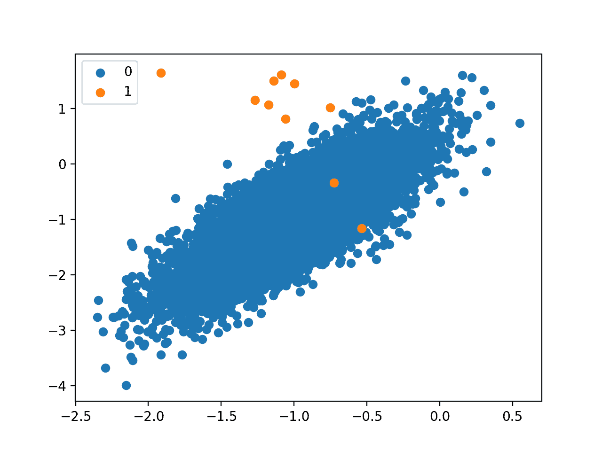

# 不平衡数据集的一类分类算法

> 原文:[https://machinelearning master . com/一类-分类-算法/](https://machinelearningmastery.com/one-class-classification-algorithms/)

最后更新于 2020 年 8 月 21 日

离群值或异常值是不符合其余数据的罕见例子。

识别数据中的异常值被称为异常值或异常检测，而机器学习中关注这个问题的一个子领域被称为一类分类。这些是无监督学习算法，试图对“*正常*”示例进行建模，以便将新示例分类为正常或异常(例如异常值)。

一类分类算法可用于类别分布严重偏斜的二进制分类任务。这些技术可以适用于训练数据集中多数类的输入示例，然后在保持测试数据集上进行评估。

尽管单类分类算法不是为这些类型的问题而设计的，但对于不存在或很少存在少数类的不平衡分类数据集，或者对于没有连贯结构来分离可由监督算法学习的类的数据集，单类分类算法可能是有效的。

在本教程中，您将发现如何对具有严重倾斜类分布的数据集使用单类分类算法。

完成本教程后，您将知道:

*   一类分类是机器学习的一个领域，它为异常值和异常检测提供技术。
*   如何将单类分类算法应用于类别分布严重倾斜的不平衡分类？
*   如何拟合和评价一类分类算法，如 SVM、隔离林、椭圆包络和局部离群因子。

**用我的新书[Python 不平衡分类](https://machinelearningmastery.com/imbalanced-classification-with-python/)启动你的项目**，包括*分步教程*和所有示例的 *Python 源代码*文件。

我们开始吧。


不平衡分类的一类分类算法
图片由[科萨拉·班达拉](https://flickr.com/photos/kosalabandara/13907897377/)提供，保留部分权利。

## 教程概述

本教程分为五个部分；它们是:

1.  不平衡数据的一类分类
2.  一类支持向量机
3.  隔离林
4.  最小协方差行列式
5.  局部异常因子

## 不平衡数据的一类分类

[异常值](https://machinelearningmastery.com/how-to-use-statistics-to-identify-outliers-in-data/)既罕见又不寻常。

稀有性表明它们相对于非异常数据(所谓的内联数据)具有较低的频率。不寻常表明它们不适合数据分布。

异常值的存在会导致问题。例如，单个变量可能有一个远离大量示例的异常值，这可能会扭曲汇总统计信息，如平均值和方差。

作为一种数据准备技术，拟合机器学习模型可能需要识别和去除异常值。

识别数据集中异常值的过程一般称为[异常检测](https://en.wikipedia.org/wiki/Anomaly_detection)，其中异常值为“*异常*”，其余数据为“*正常*”离群点检测或异常检测是一个具有挑战性的问题，由一系列技术组成。

在机器学习中，解决异常检测问题的一种方法是[一类分类](https://en.wikipedia.org/wiki/One-class_classification)。

一类分类，简称 OCC，包括在“*正常*数据上拟合一个模型，并预测新数据是正常的还是异常的。

> 一类分类器旨在捕获训练实例的特征，以便能够区分它们和可能出现的异常值。

—第 139 页，[从不平衡数据集](https://amzn.to/307Xlva)中学习，2018。

单类分类器适用于仅包含普通类示例的训练数据集。一旦准备好，该模型被用于将新的例子分类为正常或非正常，即异常值或异常值。

一类分类技术可用于二进制(两类)不平衡分类问题，其中负案例(类别 0)被视为“*正常*”，而正案例(类别 1)被视为异常值或异常。

*   **阴性情况**:正常或内联。
*   **阳性病例**:异常或异常值。

鉴于这种方法的性质，单类分类最适合那些正案例在特征空间中没有一致模式或结构的任务，这使得其他分类算法很难学习类边界。相反，将阳性病例视为异常值，它允许一类分类器忽略辨别任务，而是关注偏离正常或预期的情况。

> 事实证明，当少数民族缺乏任何结构时，这种解决方案特别有用，因为少数民族主要由小的间断或嘈杂的实例组成。

—第 139 页，[从不平衡数据集](https://amzn.to/307Xlva)中学习，2018。

如果训练集中的阳性病例数量很少，以至于不值得包含在模型中，例如几十个或更少的例子，也可能是合适的。或者对于在训练模型之前无法收集到正面案例的问题。

明确地说，这种针对不平衡分类的单类分类算法的适应性是不寻常的，但是在某些问题上是有效的。这种方法的缺点是，我们在训练过程中遇到的任何异常值(正例)都不会被单类分类器使用，而是被丢弃。这表明，或许可以并行尝试问题的反向建模(例如，将正案例建模为正常情况)。它还建议一类分类器可以为一组算法提供输入，每个算法以不同的方式使用训练数据集。

> 人们必须记住，单类分类器的优势是以丢弃所有关于多数类的可用信息为代价的。因此，该解决方案应谨慎使用，可能不适合某些特定应用。

—第 140 页，[从不平衡数据集](https://amzn.to/307Xlva)中学习，2018。

scikit-learn 库提供了一些常用的一类分类算法，用于异常值或异常检测和变化检测，例如一类 SVM、隔离森林、椭圆包络和局部异常因子。

在接下来的部分中，我们将依次看一看每一个。

在此之前，我们将设计一个二元分类数据集来演示算法。我们将使用[make _ classification()sci kit-learn 函数](https://scikit-learn.org/stable/modules/generated/sklearn.datasets.make_classification.html)创建 10，000 个示例，少数类中有 10 个示例，多数类中有 9，990 个示例，或者 0.1%对 99.9%，或者大约 1:1000 的类分布。

下面的示例创建并总结了这个数据集。

```py
# Generate and plot a synthetic imbalanced classification dataset
from collections import Counter
from sklearn.datasets import make_classification
from matplotlib import pyplot
from numpy import where
# define dataset
X, y = make_classification(n_samples=10000, n_features=2, n_redundant=0,
	n_clusters_per_class=1, weights=[0.999], flip_y=0, random_state=4)
# summarize class distribution
counter = Counter(y)
print(counter)
# scatter plot of examples by class label
for label, _ in counter.items():
	row_ix = where(y == label)[0]
	pyplot.scatter(X[row_ix, 0], X[row_ix, 1], label=str(label))
pyplot.legend()
pyplot.show()
```

运行该示例首先总结了类分布，确认不平衡是按预期创建的。

```py
Counter({0: 9990, 1: 10})
```

接下来，创建散点图，并将示例绘制为由类标签着色的点，显示多数类的大质量(蓝色)和少数类的几个点(橙色)。

正类中的例子如此之少，而正类中的例子又如此之少，这种严重的类不平衡可能为使用单类分类方法奠定了良好的基础。



1 到 1000 类不平衡二元分类问题的散点图

## 一类支持向量机

最初为二进制分类开发的[支持向量机](https://machinelearningmastery.com/support-vector-machines-for-machine-learning/)或 SVM 算法可用于一类分类。

如果用于不平衡分类，在测试单类版本之前，最好在数据集上评估标准 SVM 和加权 SVM。

当对一个类建模时，该算法捕获多数类的密度，并将密度函数极值上的例子分类为异常值。SVM 的这种修改被称为一级 SVM。

> …一种计算二进制函数的算法，该二进制函数应该捕获输入空间中概率密度所在的区域(它的支持)，也就是说，一个函数使得大部分数据将位于该函数非零的区域。

——[估计高维分布的支持](https://dl.acm.org/citation.cfm?id=1119749)，2001。

scikit-learn 库在 [OneClassSVM 类](https://scikit-learn.org/stable/modules/generated/sklearn.svm.OneClassSVM.html)中提供了一个一类 SVM 的实现。

与标准 SVM 的主要区别在于，它以无监督的方式进行拟合，并且不像 *C* 那样提供用于调整余量的正常超参数。取而代之的是，它提供了一个超参数“ *nu* ”，该参数控制支持向量的灵敏度，并且应该被调整到数据中离群值的近似比率，例如 0.01%。

```py
...
# define outlier detection model
model = OneClassSVM(gamma='scale', nu=0.01)
```

该模型可以适用于训练数据集中的所有示例，或者只适用于多数类中的那些示例。也许在你的问题上两者都试试。

在这种情况下，我们将尝试只适合训练集中属于多数类的那些示例。

```py
# fit on majority class
trainX = trainX[trainy==0]
model.fit(trainX)
```

一旦拟合，该模型可用于识别新数据中的异常值。

在模型上调用 *predict()* 函数时，对于正常例子会输出 a +1，即所谓的内联，对于异常值会输出 a -1。

*   **内联预测** : +1
*   **异常值预测** : -1

```py
...
# detect outliers in the test set
yhat = model.predict(testX)
```

如果我们想评估模型作为二进制分类器的性能，我们必须将测试数据集中的标签从多数类和少数类的 0 和 1 分别更改为+1 和-1。

```py
...
# mark inliers 1, outliers -1
testy[testy == 1] = -1
testy[testy == 0] = 1
```

然后，我们可以将模型的预测与预期目标值进行比较，并计算得分。假设我们有清晰的类标签，我们可以使用像精度、召回率这样的分数，或者两者的组合，比如 F-measure (F1-score)。

在这种情况下，我们将使用 F-measure 得分，这是精度和召回率的调和平均值。我们可以使用 *f1_score()* 函数计算 F-measure，并通过“ *pos_label* 参数将少数民族类的标签指定为-1。

```py
...
# calculate score
score = f1_score(testy, yhat, pos_label=-1)
print('F1 Score: %.3f' % score)
```

将这些联系在一起，我们可以在合成数据集上评估单类 SVM 算法。我们将数据集一分为二，用一半以无监督的方式训练模型，另一半评估模型。

下面列出了完整的示例。

```py
# one-class svm for imbalanced binary classification
from sklearn.datasets import make_classification
from sklearn.model_selection import train_test_split
from sklearn.metrics import f1_score
from sklearn.svm import OneClassSVM
# generate dataset
X, y = make_classification(n_samples=10000, n_features=2, n_redundant=0,
	n_clusters_per_class=1, weights=[0.999], flip_y=0, random_state=4)
# split into train/test sets
trainX, testX, trainy, testy = train_test_split(X, y, test_size=0.5, random_state=2, stratify=y)
# define outlier detection model
model = OneClassSVM(gamma='scale', nu=0.01)
# fit on majority class
trainX = trainX[trainy==0]
model.fit(trainX)
# detect outliers in the test set
yhat = model.predict(testX)
# mark inliers 1, outliers -1
testy[testy == 1] = -1
testy[testy == 0] = 1
# calculate score
score = f1_score(testy, yhat, pos_label=-1)
print('F1 Score: %.3f' % score)
```

运行该示例使模型适合训练集中多数类的输入示例。然后使用该模型将测试集中的示例分类为内联和外联。

**注**:考虑到算法或评估程序的随机性，或数值精度的差异，您的[结果可能会有所不同](https://machinelearningmastery.com/different-results-each-time-in-machine-learning/)。考虑运行该示例几次，并比较平均结果。

在这种情况下，获得了 0.123 的 F1 分数。

```py
F1 Score: 0.123
```

## 隔离林

隔离森林，简称 iForest，是一种基于树的异常检测算法。

> ……隔离森林(iForest)，它纯粹基于隔离的概念检测异常，而不采用任何距离或密度测量

——[基于隔离的异常检测](https://dl.acm.org/citation.cfm?id=2133363)，2012。

它基于对正常数据进行建模，从而隔离特征空间中数量少且不同的异常。

> ……我们提出的方法利用了两个异常的数量属性:I)它们是由较少实例组成的少数，以及 ii)它们具有与正常实例非常不同的属性值。

——[隔离森林](https://ieeexplore.ieee.org/abstract/document/4781136)，2008 年。

创建树形结构来隔离异常。结果是孤立的示例在树中具有相对较短的深度，而正常数据则不那么孤立，在树中具有更大的深度。

> ……可以有效地构建树形结构来隔离每个实例。因为异常容易被隔离，所以它们会被隔离在更靠近树根的地方；而正常点被隔离在树的较深端。

——[隔离森林](https://ieeexplore.ieee.org/abstract/document/4781136)，2008 年。

scikit-learn 库在 [IsolationForest 类](https://scikit-learn.org/stable/modules/generated/sklearn.ensemble.IsolationForest.html)中提供了隔离林的实现。

该模型最重要的超参数可能是设置要创建的树的数量的“*n _ estimates*”参数和用于帮助定义数据集中异常值数量的“*污染*”参数。

我们知道污染大约是阳性病例与阴性病例的 0.01%，因此我们可以将“*污染*”参数设置为 0.01。

```py
...
# define outlier detection model
model = IsolationForest(contamination=0.01, behaviour='new')
```

该模型可能在排除异常值的例子上训练得最好。在这种情况下，我们只针对多数类的示例，在输入特征上拟合模型。

```py
...
# fit on majority class
trainX = trainX[trainy==0]
model.fit(trainX)
```

像一类 SVM 一样，该模型将预测标签为+1 的内联体和标签为-1 的外联体，因此，在评估预测之前，必须更改测试集的标签。

将这些联系在一起，完整的示例如下所示。

```py
# isolation forest for imbalanced classification
from sklearn.datasets import make_classification
from sklearn.model_selection import train_test_split
from sklearn.metrics import f1_score
from sklearn.ensemble import IsolationForest
# generate dataset
X, y = make_classification(n_samples=10000, n_features=2, n_redundant=0,
	n_clusters_per_class=1, weights=[0.999], flip_y=0, random_state=4)
# split into train/test sets
trainX, testX, trainy, testy = train_test_split(X, y, test_size=0.5, random_state=2, stratify=y)
# define outlier detection model
model = IsolationForest(contamination=0.01, behaviour='new')
# fit on majority class
trainX = trainX[trainy==0]
model.fit(trainX)
# detect outliers in the test set
yhat = model.predict(testX)
# mark inliers 1, outliers -1
testy[testy == 1] = -1
testy[testy == 0] = 1
# calculate score
score = f1_score(testy, yhat, pos_label=-1)
print('F1 Score: %.3f' % score)
```

运行示例以无监督的方式在训练数据集上拟合隔离森林模型，然后将测试集中的示例分类为内联和外联，并对结果进行评分。

**注**:考虑到算法或评估程序的随机性，或数值精度的差异，您的[结果可能会有所不同](https://machinelearningmastery.com/different-results-each-time-in-machine-learning/)。考虑运行该示例几次，并比较平均结果。

在这种情况下，获得了 0.154 的 F1 分数。

```py
F1 Score: 0.154
```

**注**:污染程度很低，可能会导致多次跑 F1 得分为 0.0。

要提高此数据集上方法的稳定性，请尝试将污染增加到 0.05 甚至 0.1，然后重新运行该示例。

## 最小协方差行列式

如果输入变量具有[高斯分布](https://machinelearningmastery.com/continuous-probability-distributions-for-machine-learning/)，则可以使用简单的统计方法来检测异常值。

例如，如果数据集有两个输入变量，并且都是高斯的，那么特征空间形成多维高斯，并且可以使用这种分布的知识来识别远离该分布的值。

这种方法可以通过定义一个覆盖正常数据的超球(椭球)来推广，超出这个形状的数据被认为是异常值。对于多变量数据，这种技术的有效实现被称为最小协方差行列式，简称 MCD。

拥有这样表现良好的数据是不寻常的，但是如果数据集是这种情况，或者您可以使用幂变换来使变量高斯化，那么这种方法可能是合适的。

> 最小协方差行列式(MCD)方法是一种高度稳健的多元定位和散射估计方法，其快速算法是可用的。[……]它也是一个方便有效的异常值检测工具。

——[最小协方差行列式与延拓](https://arxiv.org/abs/1709.07045)，2017。

scikit-learn 库通过[椭圆包络类](https://scikit-learn.org/stable/modules/generated/sklearn.covariance.EllipticEnvelope.html)提供对该方法的访问。

它提供了“*污染*”参数，该参数定义了在实践中观察到的异常值的预期比率。我们知道这在我们的合成数据集中是 0.01%，所以我们可以相应地设置它。

```py
...
# define outlier detection model
model = EllipticEnvelope(contamination=0.01)
```

该模型只能拟合来自多数类的输入数据，以便以无监督的方式估计“*正常*”数据的分布。

```py
...
# fit on majority class
trainX = trainX[trainy==0]
model.fit(trainX)
```

然后，该模型将用于将新示例分类为正常(+1)或异常值(-1)。

```py
...
# detect outliers in the test set
yhat = model.predict(testX)
```

将这些联系在一起，下面列出了在我们的合成二进制分类数据集上使用椭圆包络离群点检测模型进行不平衡分类的完整示例。

```py
# elliptic envelope for imbalanced classification
from sklearn.datasets import make_classification
from sklearn.model_selection import train_test_split
from sklearn.metrics import f1_score
from sklearn.covariance import EllipticEnvelope
# generate dataset
X, y = make_classification(n_samples=10000, n_features=2, n_redundant=0,
	n_clusters_per_class=1, weights=[0.999], flip_y=0, random_state=4)
# split into train/test sets
trainX, testX, trainy, testy = train_test_split(X, y, test_size=0.5, random_state=2, stratify=y)
# define outlier detection model
model = EllipticEnvelope(contamination=0.01)
# fit on majority class
trainX = trainX[trainy==0]
model.fit(trainX)
# detect outliers in the test set
yhat = model.predict(testX)
# mark inliers 1, outliers -1
testy[testy == 1] = -1
testy[testy == 0] = 1
# calculate score
score = f1_score(testy, yhat, pos_label=-1)
print('F1 Score: %.3f' % score)
```

运行示例以无监督方式在训练数据集上拟合椭圆包络模型，然后将测试集中的示例分类为内联和外联，并对结果进行评分。

**注**:考虑到算法或评估程序的随机性，或数值精度的差异，您的[结果可能会有所不同](https://machinelearningmastery.com/different-results-each-time-in-machine-learning/)。考虑运行该示例几次，并比较平均结果。

在这种情况下，获得了 0.157 的 F1 分数。

```py
F1 Score: 0.157
```

## 局部异常因子

识别异常值的一个简单方法是定位那些在特征空间中远离其他示例的示例。

这对于低维度(很少特征)的特征空间可以很好地工作，尽管随着特征数量的增加，它会变得不那么可靠，这被称为维度的诅咒。

局部离群因子，简称 LOF，是一种试图利用最近邻概念进行离群点检测的技术。每个例子都被分配了一个分数，根据其局部邻域的大小来衡量孤立的程度或异常值出现的可能性。得分最高的例子更有可能是异常值。

> 我们为数据集中的每个对象引入一个局部离群值(LOF)，指示其离群程度。

——[LOF:识别基于密度的局部异常值](https://dl.acm.org/citation.cfm?id=335388)，2000 年。

scikit-learn 库在[localhoutlierfactor 类](https://scikit-learn.org/stable/modules/generated/sklearn.neighbors.LocalOutlierFactor.html)中提供了这种方法的实现。

该模型可以被定义，并且要求指示数据集中异常值的预期百分比，例如在我们的合成数据集中为 0.01%。

```py
...
# define outlier detection model
model = LocalOutlierFactor(contamination=0.01)
```

模型不合适。相反，通过调用 *fit_predict()* ，使用“*正常*数据集作为识别新数据中异常值的基础。

要使用这个模型来识别测试数据集中的异常值，我们必须首先准备训练数据集，使其只包含多数类的输入示例。

```py
...
# get examples for just the majority class
trainX = trainX[trainy==0]
```

接下来，我们可以将这些示例与测试数据集中的输入示例连接起来。

```py
...
# create one large dataset
composite = vstack((trainX, testX))
```

然后，我们可以通过调用 *fit_predict()* 进行预测，并且只检索测试集中示例的那些标签。

```py
...
# make prediction on composite dataset
yhat = model.fit_predict(composite)
# get just the predictions on the test set
yhat yhat[len(trainX):]
```

为了使事情变得更简单，我们可以将它包装成一个新的函数，其名称为 *lof_predict()* ，如下所示。

```py
# make a prediction with a lof model
def lof_predict(model, trainX, testX):
	# create one large dataset
	composite = vstack((trainX, testX))
	# make prediction on composite dataset
	yhat = model.fit_predict(composite)
	# return just the predictions on the test set
	return yhat[len(trainX):]
```

像 scikit-learn 中的其他离群点检测算法一样，预测的标签对于正常值为+1，对于离群值为-1。

将这些联系在一起，下面列出了使用 LOF 离群点检测算法进行分类的完整示例。

```py
# local outlier factor for imbalanced classification
from numpy import vstack
from sklearn.datasets import make_classification
from sklearn.model_selection import train_test_split
from sklearn.metrics import f1_score
from sklearn.neighbors import LocalOutlierFactor

# make a prediction with a lof model
def lof_predict(model, trainX, testX):
	# create one large dataset
	composite = vstack((trainX, testX))
	# make prediction on composite dataset
	yhat = model.fit_predict(composite)
	# return just the predictions on the test set
	return yhat[len(trainX):]

# generate dataset
X, y = make_classification(n_samples=10000, n_features=2, n_redundant=0,
	n_clusters_per_class=1, weights=[0.999], flip_y=0, random_state=4)
# split into train/test sets
trainX, testX, trainy, testy = train_test_split(X, y, test_size=0.5, random_state=2, stratify=y)
# define outlier detection model
model = LocalOutlierFactor(contamination=0.01)
# get examples for just the majority class
trainX = trainX[trainy==0]
# detect outliers in the test set
yhat = lof_predict(model, trainX, testX)
# mark inliers 1, outliers -1
testy[testy == 1] = -1
testy[testy == 0] = 1
# calculate score
score = f1_score(testy, yhat, pos_label=-1)
print('F1 Score: %.3f' % score)
```

运行该示例使用本地离群因子模型和训练数据集，以无监督的方式将测试集中的示例分类为内联和离群，然后对结果进行评分。

**注**:考虑到算法或评估程序的随机性，或数值精度的差异，您的[结果可能会有所不同](https://machinelearningmastery.com/different-results-each-time-in-machine-learning/)。考虑运行该示例几次，并比较平均结果。

在这种情况下，获得了 0.138 的 F1 分数。

```py
F1 Score: 0.138
```

## 进一步阅读

如果您想更深入地了解这个主题，本节将提供更多资源。

### 报纸

*   [估计高维分布的支持](https://dl.acm.org/citation.cfm?id=1119749)，2001。
*   [隔离森林](https://ieeexplore.ieee.org/abstract/document/4781136)，2008 年。
*   [基于隔离的异常检测](https://dl.acm.org/citation.cfm?id=2133363)，2012。
*   [最小协方差行列式估计量的快速算法](https://amstat.tandfonline.com/doi/abs/10.1080/00401706.1999.10485670)，2012。
*   [最小协方差行列式与延拓](https://arxiv.org/abs/1709.07045)，2017。
*   [LOF:识别基于密度的局部异常值](https://dl.acm.org/citation.cfm?id=335388)，2000。

### 书

*   [从不平衡数据集中学习](https://amzn.to/307Xlva)，2018。
*   [不平衡学习:基础、算法和应用](https://amzn.to/32K9K6d)，2013。

### 蜜蜂

*   [新颖性和异常值检测，scikit-learn API](https://scikit-learn.org/stable/modules/outlier_detection.html) 。
*   [硬化. svm.OneClassSVM API](https://scikit-learn.org/stable/modules/generated/sklearn.svm.OneClassSVM.html) 。
*   [硬化。一起。绝缘林 API](https://scikit-learn.org/stable/modules/generated/sklearn.ensemble.IsolationForest.html) 。
*   [硬化。协方差。椭圆包络 API](https://scikit-learn.org/stable/modules/generated/sklearn.covariance.EllipticEnvelope.html) 。
*   [硬化。邻居。局部外显性因子 API](https://scikit-learn.org/stable/modules/generated/sklearn.neighbors.LocalOutlierFactor.html) 。

### 文章

*   [外景，维基百科](https://en.wikipedia.org/wiki/Outlier)。
*   [异常检测，维基百科](https://en.wikipedia.org/wiki/Anomaly_detection)。
*   [一级分类，维基百科](https://en.wikipedia.org/wiki/One-class_classification)。

## 摘要

在本教程中，您发现了如何对具有严重倾斜类分布的数据集使用单类分类算法。

具体来说，您了解到:

*   一类分类是机器学习的一个领域，它为异常值和异常检测提供技术。
*   如何将单类分类算法应用于类别分布严重倾斜的不平衡分类？
*   如何拟合和评价 SVM、隔离林、椭圆包络和局部离群因子等一类分类算法。

你有什么问题吗？
在下面的评论中提问，我会尽力回答。