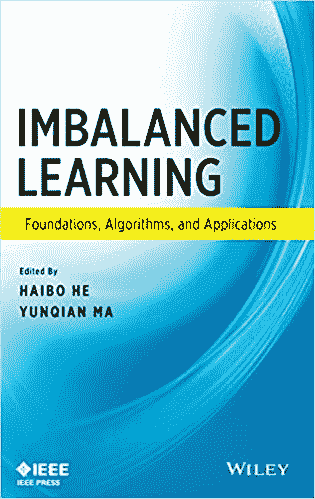
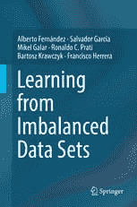

# 不平衡分类的最佳资源

> 原文：<https://machinelearningmastery.com/resources-for-imbalanced-classification/>

最后更新于 2021 年 1 月 5 日

分类是一个预测建模问题，涉及到预测给定示例的类标签。

通常假设训练数据集中的示例分布在所有类中是均匀的。实际上，情况很少如此。

那些分类预测模型中的例子在类标签上的分布不相等(例如，是偏斜的)，被称为“不平衡分类”

 *通常，轻微的不平衡不是问题，可以使用标准的机器学习技术。在不平衡严重的情况下，如 1:100、1:1000 或少数与多数的比例较高，则需要专门的技术。

类别严重不平衡的分类问题需要专门技术的原因是，大多数用于分类的机器学习模型都是围绕类别分布相等的假设设计和测试的。因此，它们经常失败或导致误导性结果。

在本教程中，您将发现可以用来开始不平衡分类的最佳资源。

完成本教程后，您将知道:

*   不平衡分类的最佳机器学习书籍。
*   介绍阶级不平衡话题的最佳调查论文。
*   您可以用来为不平衡数据集开发解决方案的最佳 Python 库。

**用我的新书[Python 不平衡分类](https://machinelearningmastery.com/imbalanced-classification-with-python/)启动你的项目**，包括*分步教程*和所有示例的 *Python 源代码*文件。

我们开始吧。

*   **2021 年 1 月更新**:更新了 API 文档的链接。

不平衡分类最佳资源
图片由[拉德克·库恰尔斯基](https://flickr.com/photos/137294100@N08/43771396701/)提供，保留部分权利。

## 教程概述

本教程分为三个部分；它们是:

1.  不平衡分类书籍
2.  不平衡分类综述
3.  不平衡分类的 Python 库

## 不平衡分类书籍

用机器学习解决不平衡分类预测建模问题是一个相对较新的研究领域。

然而，考虑到不平衡分类数据集的普遍性，关于这个主题有几本书和几个章节。

在本节中，我们将仔细阅读以下关于机器学习不平衡分类的书籍:

*   [不平衡学习:基础、算法和应用](https://amzn.to/32K9K6d)，2013。
*   [从不平衡数据集中学习](https://amzn.to/307Xlva)，2018。

我还将包括以下这本书，其中有一章专门讨论这个主题:

*   [应用预测建模](https://amzn.to/32M80ta)，2013。

我发现还有另外两本书是相关的，但可能更切实际，我就不详细介绍了；他们是:

*   [生态与生物研究不平衡数据的统计方法](https://amzn.to/2ObEgSm)，2019。
*   [用模糊和粗糙集方法处理机器学习中不平衡和弱标记的数据](https://amzn.to/32IICVh)，2018。

让我们仔细看看这些书。

### 不平衡学习:基础、算法和应用

这本书是由两个学者编辑的论文集，这两个学者写了很多关于这个主题的文章:和马云钱。

该书于 2013 年出版。

*   [不平衡学习:基础、算法和应用](https://amzn.to/32K9K6d)，2013。

不平衡学习——基础、算法和应用

这本书旨在让研究生或学者跟上不平衡学习的领域。这是比不平衡分类更一般的领域，因为它包括训练数据集可能不平衡的其他问题类型，例如回归和聚类。

> 具体来说，我们将不平衡学习定义为具有严重数据分布偏差的数据表示和信息提取的学习过程，以开发有效的决策边界来支持决策过程。学习过程可以包括监督学习、非监督学习、半监督学习或两者或全部的组合。不平衡学习的任务也可以应用于回归、分类或聚类任务。

—第 1-2 页，[不平衡学习:基础、算法和应用](https://amzn.to/32K9K6d)，2013。

它为从业者提供了一个很好的起点来获得该领域和技术的概述。

这本书的目录如下。

*   1.介绍
*   2.不平衡学习的基础
*   3.不平衡数据集:从采样到分类器
*   4.班级不平衡学习的集成方法
*   5.支持向量机的类不平衡学习方法
*   6.班级失衡与主动学习
*   7.类分布不均衡的非平稳流数据学习
*   8.不平衡学习的评估指标

[在这里了解更多关于本书的信息](https://amzn.to/32K9K6d)。

### 从不平衡数据集中学习

这本书也是关于不平衡数据集的机器学习主题的论文集，尽管感觉比之前的书“*不平衡学习*”更有凝聚力。”

该书由一系列学者阿尔韦托·费尔南德斯、萨尔瓦多·加西亚、米克尔·加拉、罗纳尔多·普拉蒂、巴托兹·科劳兹克和弗朗西斯科·埃雷拉撰写或编辑，于 2018 年出版。

*   [从不平衡数据集中学习](https://amzn.to/307Xlva)，2018。

从不平衡数据集中学习

与前一本书类似，这本书旨在让研究生和工程师了解不平衡数据集的机器学习领域。

> 这本书的目标读者是旨在应用不平衡学习技术来解决不同类型的现实世界问题的开发人员和工程师，以及需要全面回顾从不平衡数据中学习的技术、方法和工具的研究人员和学生。

—第八页，[从不平衡数据集](https://amzn.to/307Xlva)中学习，2018。

这本书看起来比以前的书更系统(例如，从头到尾完成一个项目)和实用，以前的书看起来更学术(pet 方法或子领域)。如果你有预算，我建议两者一起买。

这本书的目录如下。

*   1.KDD 与数据科学导论
*   2.不平衡分类的基础
*   3.绩效指标
*   4.对成本敏感的学习
*   5.数据级预处理方法
*   6.算法级方法
*   7.集成学习
*   8.多类不平衡分类
*   9.不平衡学习的降维
*   10.数据内在特征
*   11.从不平衡数据流中学习
*   12.非经典不平衡分类问题
*   13.大数据的不平衡分类
*   14.不平衡分类软件和库

[在这里了解更多关于本书的信息](https://amzn.to/307Xlva)。

### 应用预测建模

这是我最喜欢的应用机器学习手册之一，由 [Max Kuhn](https://github.com/topepo) 和 [Kjell Johnson](https://www.linkedin.com/in/kjell-johnson-9a65b33/) 编写，重点是 r

这本书出版于 2013 年，但总的建议可能是永恒的。

*   [应用预测建模](https://amzn.to/32M80ta)，2013。

应用预测建模

虽然整本书读起来很棒，但这本书有一章专门讨论不平衡分类的问题。

*   第 16 章:严重阶级失衡的补救措施

本章的方法是对“[房车保单所有权](https://archive.ics.uci.edu/ml/datasets/Insurance+Company+Benchmark+(COIL+2000))”数据集的案例研究。作者通过这个问题展示了一套不同的实用技术来处理严重的阶级不平衡。

本章是阅读如何使用现代方法处理现实世界不平衡数据集的实际演示的必读。

本章各节如下:

*   16.1 案例研究:预测房车保单所有权
*   16.2 阶级不平衡的影响
*   16.3 模型调整
*   16.4 替代截止值
*   16.5 调整先验概率
*   16.6 不相等的案例权重
*   16.7 取样方法
*   16.8 成本敏感型培训
*   16.9 计算

[在这里了解更多关于本书的信息](https://amzn.to/32M80ta)。

## 不平衡分类综述

关于不平衡分类的机器学习方法以及相关的问题和技术有成千上万的出版物。

在本节中，我们将看一些最好的调查论文，而不是列举该领域最好的论文。

综述性论文是对该领域和该领域技术的地位以及它们之间的相互关系进行广泛概述的论文。它们旨在帮助刚进入该领域的人，如研究生和工程师，快速掌握最新知识。

作为一个实践者，阅读一篇调查论文可能比浏览关于这个主题的书籍更有效率。

有许多优秀的调查论文可供选择；我推荐的收藏夹如下:

*   [从不平衡的数据中学习:开放的挑战和未来的方向](https://link.springer.com/article/10.1007/s13748-016-0094-0)，巴托兹·科劳兹克，2016。
*   [不平衡分布下的预测建模综述](https://arxiv.org/abs/1505.01658)，保拉·布兰科，路易斯·托戈和丽塔·里贝罗，2015。
*   [不平衡数据的分类:综述](https://www.worldscientific.com/doi/abs/10.1142/S0218001409007326)，孙，黄安祥，穆罕默德·卡迈勒，2009。
*   [从不平衡数据中学习](https://ieeexplore.ieee.org/abstract/document/5128907)，何海波和爱德华多·加西亚，2009。

我也推荐学习论文，用一套标准的机器学习数据集来演示一种或多种标准技术的论文。在这种情况下，这些技术被设计来解决不平衡的类分布，并且标准数据集具有偏斜的类分布。

这些论文很快就找出了哪些方法有效(或者流行)以及哪些数据集可用作基准。

这类好论文的一些例子包括:

*   [对不平衡数据分类的洞察:关于使用数据内在特征的经验结果和当前趋势](https://www.sciencedirect.com/science/article/pii/S0020025513005124)，2013。
*   [平衡机器学习训练数据的几种方法的行为研究](https://dl.acm.org/citation.cfm?id=1007735)，2004。

## 不平衡分类的 Python 库

Python 已经迅速成为应用机器学习的首选编程语言。

### 科学工具包-学习库

Python 中机器学习的 go-to 库是 [scikit-learn](https://scikit-learn.org/) ，它提供数据准备、机器学习算法和模型评估方案等技术。

> Scikit-learn 是一个 Python 模块，集成了各种最先进的机器学习算法，用于中等规模的有监督和无监督问题。这个包侧重于使用通用高级语言将机器学习带给非专家。

——[Scikit-learn:Python 中的机器学习](http://www.jmlr.org/papers/v12/pedregosa11a)，2011。

尽管 scikit-learn 库不是围绕不平衡分类问题设计的，但它确实提供了一些处理不平衡数据集的工具，例如:

*   支持一系列指标，例如 ROC AUC 和精度/召回率、F1、Brier 评分等。
*   支持类别加权，例如决策树、SVM 等。

### 不平衡学习库

一个与 scikit-learn 相关的致力于不平衡分类问题的项目叫做不平衡学习。

它结合 scikit-learn 库提供了可用于不平衡分类的技术，允许库之间共享学习算法和模型评估技术。

> 不平衡学习是一个开源的 python 工具箱，旨在提供广泛的方法来应对机器学习和模式识别中经常遇到的不平衡数据集问题。

——[不平衡学习:一个应对机器学习中不平衡数据集魔咒的 Python 工具箱](https://arxiv.org/abs/1609.06570)，2016。

该库侧重于提供过采样和欠采样技术，以便在拟合给定的机器学习模型之前，使训练数据集中的类分布更加均匀。

有关不平衡学习的更多信息，请参见:

*   [不平衡学习项目，GitHub](https://github.com/scikit-learn-contrib/imbalanced-learn) 。
*   [不平衡学习文档](https://imbalanced-learn.org)。
*   [不平衡学习:解决机器学习中不平衡数据集诅咒的 Python 工具箱](https://arxiv.org/abs/1609.06570)，2016。

## 摘要

在本教程中，您发现了可以用来开始不平衡分类的最佳资源。

具体来说，您了解到:

*   不平衡分类的最佳机器学习书籍。
*   介绍阶级不平衡话题的最佳调查论文。
*   您可以用来为不平衡数据集开发解决方案的最佳 Python 库。

你有什么问题吗？
在下面的评论中提问，我会尽力回答。*