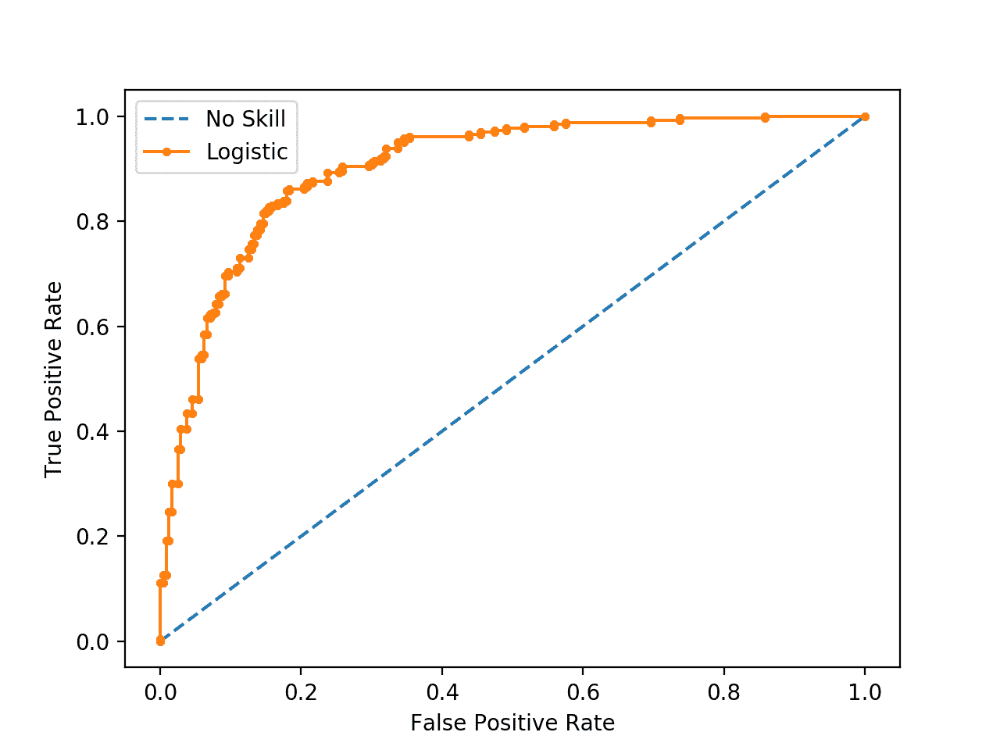
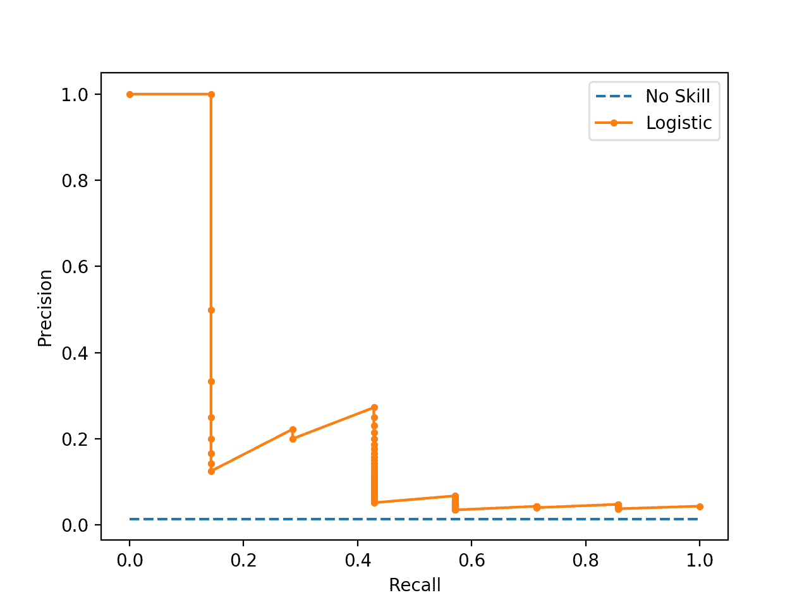
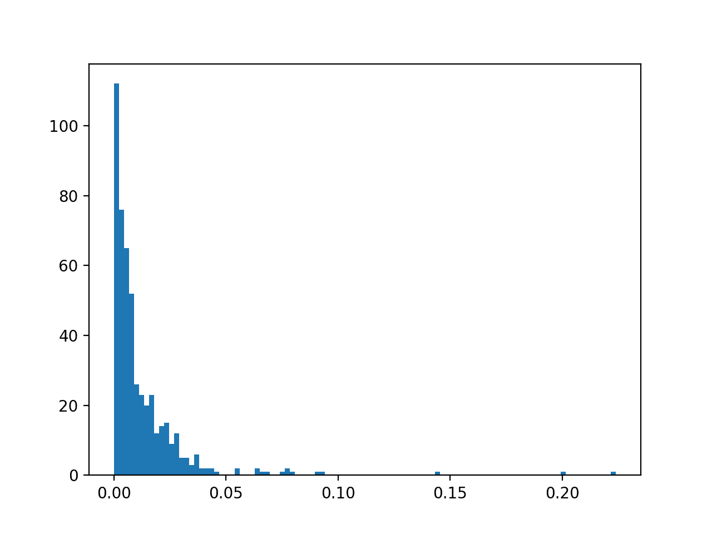

# 不平衡分类的 ROC 曲线和精度-召回曲线

> 原文：<https://machinelearningmastery.com/roc-curves-and-precision-recall-curves-for-imbalanced-classification/>

最后更新于 2020 年 9 月 16 日

大多数不平衡分类问题涉及两类:一类是包含大多数例子的否定情况，另一类是包含少数例子的肯定情况。

有助于解释二进制(两类)分类预测模型的两个诊断工具是 ROC 曲线和精度-召回曲线。

在解释概率预测时，可以根据曲线创建曲线图，并用于了解不同阈值的表现权衡。每个图还可以用曲线分数下的区域进行总结，该区域可用于直接比较分类模型。

在本教程中，您将发现用于不平衡分类的 ROC 曲线和精度-召回曲线。

完成本教程后，您将知道:

*   ROC 曲线和精度-召回曲线为二元分类模型提供了诊断工具。
*   ROC AUC 和精度-召回 AUC 提供总结曲线的分数，可用于比较分类器。
*   ROC 曲线和 ROC AUC 对于少数类样本很少的严重不平衡分类问题是乐观的。

**用我的新书[Python 不平衡分类](https://machinelearningmastery.com/imbalanced-classification-with-python/)启动你的项目**，包括*分步教程*和所有示例的 *Python 源代码*文件。

我们开始吧。


不平衡分类的 ROC 曲线和精度-召回曲线
图片由[尼古拉斯·阿·托内利](https://flickr.com/photos/nicholas_t/15577562391/)提供，保留部分权利。

## 教程概述

本教程分为四个部分；它们是:

1.  混淆矩阵述评
2.  ROC 曲线和 ROC 曲线面积比
3.  精度-召回曲线和 AUC
4.  具有严重不平衡的 ROC 曲线和精度-召回曲线

## 混淆矩阵述评

在我们深入研究 ROC 曲线和 PR 曲线之前，回顾一下[混淆矩阵](https://machinelearningmastery.com/confusion-matrix-machine-learning/)是很重要的。

对于不平衡分类问题，多数类通常称为阴性结果(如“*无变化*”或“*阴性检测结果*”)，少数类通常称为阳性结果(如“*变化*”或“*阳性检测结果*”)。

混淆矩阵不仅能更深入地了解预测模型的表现，还能更深入地了解哪些类被正确预测，哪些被错误预测，以及出现了什么类型的错误。

最简单的混淆矩阵是针对两类分类问题，有负(0 类)和正(1 类)类。

在这种类型的混淆矩阵中，表中的每个单元格都有一个具体且易于理解的名称，总结如下:

```py
               | Positive Prediction | Negative Prediction
Positive Class | True Positive (TP)  | False Negative (FN)
Negative Class | False Positive (FP) | True Negative (TN)
```

组成 ROC 曲线和精度-召回曲线的度量标准是根据混淆矩阵中的单元格来定义的。

现在我们已经复习了混淆矩阵，让我们仔细看看 ROC 曲线度量。

## ROC 曲线和 ROC 曲线面积比

ROC 曲线(或接收器工作特性曲线)是总结正类上二元分类模型表现的图。

x 轴表示假阳性率，y 轴表示真阳性率。

*   **ROC 曲线**:假阳性率(x)与真阳性率(y)的关系图。

真阳性率是一个分数，计算方法是真阳性预测的总数除以真阳性和假阴性的总和(例如阳性类别中的所有例子)。真正的阳性率被称为敏感度或召回率。

*   **真阳性** =真阳性/(真阳性+假阴性)

假阳性率的计算方法是假阳性预测的总数除以假阳性和真阴性的总和(例如阴性类别中的所有例子)。

*   **假阳性** =假阳性/(假阳性+真阴性)

我们可以将该图视为正类(y 轴)的正确预测分数与负类(x 轴)的误差分数之比。

理想情况下，我们希望正确的正类预测的分数为 1(图的顶部)，不正确的负类预测的分数为 0(图的左侧)。这强调了实现完美技能的最佳分类器是图的左上角(坐标 0，1)。

*   **完美技能**:剧情左上角的一个点。

阈值应用于正类和负类之间的概率分界点，默认情况下，对于任何分类器，该分界点将被设置为 0.5，在每个结果(0 和 1)的中间。

真正平均和假正平均之间存在权衡，因此改变分类阈值将改变预测的平衡，以假正平均为代价提高真正平均，或者相反。

通过评估不同阈值的真阳性和假阳性，可以构建从左下方延伸到右上方并向左上方弯曲的曲线。这条曲线被称为 ROC 曲线。

在阳性和阴性类别之间没有辨别能力的分类器将在假阳性率 0 和真阳性率 0(坐标(0，0)或预测所有阴性类别)到假阳性率 1 和真阳性率 1(坐标(1，1)或预测所有阳性类别)之间形成对角线。这条线以下的点代表的模型比没有技能更糟糕。

该曲线提供了一种方便的诊断工具，用于研究具有不同阈值的一个分类器以及对真阳性和假阳性的影响。人们可能会选择一个阈值来偏向分类模型的预测行为。

它是一种流行的诊断工具，用于平衡和不平衡二进制预测问题的分类器，因为它不偏向多数或少数类。

> ROC 分析不偏向于以牺牲多数类为代价在少数类上表现良好的模型——这种特性在处理不平衡数据时非常有吸引力。

—第 27 页，[不平衡学习:基础、算法和应用](https://amzn.to/32K9K6d)，2013。

我们可以使用 [roc_curve() scikit-learn 函数](https://scikit-learn.org/stable/modules/generated/sklearn.metrics.roc_curve.html)在 Python 中绘制模型的 ROC 曲线。

该函数获取测试集中的真实结果(0，1)和 1 类的预测概率。该函数返回每个阈值的假阳性率、每个阈值的真阳性率和阈值。

```py
...
# calculate roc curve
fpr, tpr, thresholds = roc_curve(testy, pos_probs)
```

大多数 scikit-learn 模型可以通过调用 *predict_proba()* 函数来预测概率。

这将为测试集中的每个样本返回每个类别的概率，例如，在二进制分类问题中，两个类别中的每个类别有两个数字。正类的概率可以作为概率数组中的第二列来检索。

```py
...
# predict probabilities
yhat = model.predict_proba(testX)
# retrieve just the probabilities for the positive class
pos_probs = yhat[:, 1]
```

我们可以在合成数据集上演示这一点，并绘制无技能分类器和逻辑回归模型的 ROC 曲线。

[make _ classing()函数](https://scikit-learn.org/stable/modules/generated/sklearn.datasets.make_classification.html)可以用来创建综合分类问题。在这种情况下，我们将为二进制分类问题创建 1000 个示例(每个类大约 500 个示例)。然后，我们将数据集分割成一个训练集，并测试大小相等的集合，以便拟合和评估模型。

```py
...
# generate 2 class dataset
X, y = make_classification(n_samples=1000, n_classes=2, random_state=1)
# split into train/test sets
trainX, testX, trainy, testy = train_test_split(X, y, test_size=0.5, random_state=2)
```

逻辑回归模型是一个很好的演示模型，因为预测的概率经过了很好的校准，而其他机器学习模型不是围绕概率模型开发的，在这种情况下，它们的[概率可能需要首先校准](https://machinelearningmastery.com/calibrated-classification-model-in-scikit-learn/)(例如 SVM)。

```py
...
# fit a model
model = LogisticRegression(solver='lbfgs')
model.fit(trainX, trainy)
```

下面列出了完整的示例。

```py
# example of a roc curve for a predictive model
from sklearn.datasets import make_classification
from sklearn.linear_model import LogisticRegression
from sklearn.model_selection import train_test_split
from sklearn.metrics import roc_curve
from matplotlib import pyplot
# generate 2 class dataset
X, y = make_classification(n_samples=1000, n_classes=2, random_state=1)
# split into train/test sets
trainX, testX, trainy, testy = train_test_split(X, y, test_size=0.5, random_state=2)
# fit a model
model = LogisticRegression(solver='lbfgs')
model.fit(trainX, trainy)
# predict probabilities
yhat = model.predict_proba(testX)
# retrieve just the probabilities for the positive class
pos_probs = yhat[:, 1]
# plot no skill roc curve
pyplot.plot([0, 1], [0, 1], linestyle='--', label='No Skill')
# calculate roc curve for model
fpr, tpr, _ = roc_curve(testy, pos_probs)
# plot model roc curve
pyplot.plot(fpr, tpr, marker='.', label='Logistic')
# axis labels
pyplot.xlabel('False Positive Rate')
pyplot.ylabel('True Positive Rate')
# show the legend
pyplot.legend()
# show the plot
pyplot.show()
```

运行该示例会创建合成数据集，拆分为训练集和测试集，然后在训练数据集上拟合逻辑回归模型，并使用它对测试集进行预测。

显示了逻辑回归模型的 ROC 曲线(橙色带点)。对角线形式的无技能分类器(蓝色带破折号)。



逻辑回归模型和无技能分类器的 ROC 曲线

现在我们已经看到了 ROC 曲线，让我们仔细看看曲线评分下的 ROC 区域。

### 曲线下面积评分

虽然 ROC 曲线是一个有用的诊断工具，但根据曲线比较两个或多个分类器可能很有挑战性。

相反，可以计算曲线下的面积，以给出分类器模型在所有阈值下的单一分数。这被称为曲线下的 ROC 面积或 ROCAUC，有时也称为 ROC AUC。

对于一个完美的分类器，分数是一个介于 0.0 和 1.0 之间的值。

> AUCROC 可以解释为分类器给出的分数将随机选择的正实例排名高于随机选择的负实例的概率。

—第 54 页，[从不平衡数据集](https://amzn.to/307Xlva)中学习，2018。

这个单一的分数可以用来直接比较二元分类器模型。因此，这个分数可能是最常用于比较不平衡问题的分类模型。

> 最常见的度量包括接收器操作特性(ROC)分析和 ROC 曲线下的面积(AUC)。

—第 27 页，[不平衡学习:基础、算法和应用](https://amzn.to/32K9K6d)，2013。

可以在 scikit-learn 中使用 [roc_auc_score()函数](https://scikit-learn.org/stable/modules/generated/sklearn.metrics.roc_auc_score.html)计算 ROC 的 AUC。

像 *roc_curve()* 函数一样，AUC 函数同时采用测试集中的真实结果(0，1)和正类的预测概率。

```py
...
# calculate roc auc
roc_auc = roc_auc_score(testy, pos_probs)
```

我们可以用一个逻辑回归模型来演示同一个合成数据集。

下面列出了完整的示例。

```py
# example of a roc auc for a predictive model
from sklearn.datasets import make_classification
from sklearn.dummy import DummyClassifier
from sklearn.linear_model import LogisticRegression
from sklearn.model_selection import train_test_split
from sklearn.metrics import roc_auc_score
# generate 2 class dataset
X, y = make_classification(n_samples=1000, n_classes=2, random_state=1)
# split into train/test sets
trainX, testX, trainy, testy = train_test_split(X, y, test_size=0.5, random_state=2)
# no skill model, stratified random class predictions
model = DummyClassifier(strategy='stratified')
model.fit(trainX, trainy)
yhat = model.predict_proba(testX)
pos_probs = yhat[:, 1]
# calculate roc auc
roc_auc = roc_auc_score(testy, pos_probs)
print('No Skill ROC AUC %.3f' % roc_auc)
# skilled model
model = LogisticRegression(solver='lbfgs')
model.fit(trainX, trainy)
yhat = model.predict_proba(testX)
pos_probs = yhat[:, 1]
# calculate roc auc
roc_auc = roc_auc_score(testy, pos_probs)
print('Logistic ROC AUC %.3f' % roc_auc)
```

运行该示例会创建和拆分合成数据集，拟合模型，并使用拟合模型预测测试数据集上的概率。

**注**:考虑到算法或评估程序的随机性，或数值精度的差异，您的[结果可能会有所不同](https://machinelearningmastery.com/different-results-each-time-in-machine-learning/)。考虑运行该示例几次，并比较平均结果。

在这种情况下，我们可以看到逻辑回归模型在合成数据集上的 ROC AUC 约为 0.903，这比得分约为 0.5 的无技能分类器好得多。

```py
No Skill ROC AUC 0.509
Logistic ROC AUC 0.903
```

虽然使用广泛，但 ROC AUC 也不是没有问题。

对于严重倾斜的不平衡分类和少数民族的例子，ROC AUC 可能会产生误导。这是因为少量正确或不正确的预测会导致 ROC 曲线或 ROC AUC 评分的巨大变化。

> 尽管 ROC 图被广泛用于在存在类不平衡的情况下评估分类器，但它有一个缺点:在类稀有性下，即当类不平衡的问题与少数实例的低样本量的存在相关联时，因为估计可能是不可靠的。

—第 55 页，[从不平衡数据集](https://amzn.to/307Xlva)中学习，2018。

一种常见的替代方法是精度-召回曲线和曲线下面积。

## 精度-召回曲线和 AUC

精度是一个度量标准，它量化了正确的积极预测的数量。

它的计算方法是真阳性数除以真阳性和假阳性总数。

*   **精度** =真阳性/(真阳性+假阳性)

结果是一个介于 0.0(无精度)和 1.0(完全或完美精度)之间的值。

回忆是一个度量标准，它量化了从所有可能做出的积极预测中做出的正确积极预测的数量。

它的计算方法是真阳性数除以真阳性和假阴性总数(例如，它是真阳性率)。

*   **回忆** =真阳性/(真阳性+假阴性)

结果是 0.0(无召回)到 1.0(完全或完美召回)之间的值。

精确度和召回率都集中在积极类(少数类)上，而与真正的消极类(多数类)无关。

> ……精确度和召回率使得评估少数民族分类器的表现成为可能。

—第 27 页，[不平衡学习:基础、算法和应用](https://amzn.to/32K9K6d)，2013。

精度-召回曲线(或 PR 曲线)是不同概率阈值的精度(y 轴)和召回率(x 轴)的曲线图。

*   **PR 曲线**:召回率(x)对精度(y)的曲线图。

具有完美技巧的模型被描绘为坐标为(1，1)的点。一个巧妙的模型由一条向(1，1)坐标弯曲的曲线表示。无技能分类器将是图上的一条水平线，其精度与数据集中的正例数成正比。对于平衡数据集，这将是 0.5。

PR 曲线对少数类的关注使其成为不平衡二元分类模型的有效诊断工具。

> 精度-召回曲线(PR 曲线)推荐用于高度倾斜的区域，在这些区域 ROC 曲线可能会提供过于乐观的表现视图。

——[不平衡分布下的预测建模综述](https://arxiv.org/abs/1505.01658)，2015 年。

可以在 scikit-learn 中使用 [precision_recall_curve()函数](https://scikit-learn.org/stable/modules/generated/sklearn.metrics.precision_recall_curve.html)计算精度-召回率曲线，该函数获取少数类的类标签和预测概率，并返回精度、召回率和阈值。

```py
...
# calculate precision-recall curve
precision, recall, _ = precision_recall_curve(testy, pos_probs)
```

我们可以在预测模型的合成数据集上演示这一点。

下面列出了完整的示例。

```py
# example of a precision-recall curve for a predictive model
from sklearn.datasets import make_classification
from sklearn.linear_model import LogisticRegression
from sklearn.model_selection import train_test_split
from sklearn.metrics import precision_recall_curve
from matplotlib import pyplot
# generate 2 class dataset
X, y = make_classification(n_samples=1000, n_classes=2, random_state=1)
# split into train/test sets
trainX, testX, trainy, testy = train_test_split(X, y, test_size=0.5, random_state=2)
# fit a model
model = LogisticRegression(solver='lbfgs')
model.fit(trainX, trainy)
# predict probabilities
yhat = model.predict_proba(testX)
# retrieve just the probabilities for the positive class
pos_probs = yhat[:, 1]
# calculate the no skill line as the proportion of the positive class
no_skill = len(y[y==1]) / len(y)
# plot the no skill precision-recall curve
pyplot.plot([0, 1], [no_skill, no_skill], linestyle='--', label='No Skill')
# calculate model precision-recall curve
precision, recall, _ = precision_recall_curve(testy, pos_probs)
# plot the model precision-recall curve
pyplot.plot(recall, precision, marker='.', label='Logistic')
# axis labels
pyplot.xlabel('Recall')
pyplot.ylabel('Precision')
# show the legend
pyplot.legend()
# show the plot
pyplot.show()
```

运行该示例会创建合成数据集，拆分为训练集和测试集，然后在训练数据集上拟合逻辑回归模型，并使用它对测试集进行预测。

显示了逻辑回归模型的精度-召回曲线(橙色，带点)。随机或基线分类器显示为水平线(蓝色带破折号)。


逻辑回归模型和无技能分类器的精度-召回曲线

现在我们已经看到了精度-召回曲线，让我们仔细看看曲线得分下的 ROC 区域。

### 精确-召回曲线下面积分数

精度-召回 AUC 就像 ROC AUC 一样，它将具有一系列阈值的曲线总结为一个分数。

然后，该分数可以用作二元分类问题上不同模型之间的比较点，其中分数 1.0 代表具有完美技能的模型。

精度-召回 AUC 分数可以使用 scikit-learn 中的 [auc()函数](https://scikit-learn.org/stable/modules/generated/sklearn.metrics.auc.html)计算，以精度和召回值为参数。

```py
...
# calculate the precision-recall auc
auc_score = auc(recall, precision)
```

同样，我们可以演示在合成数据集上计算逻辑回归的精度-召回率 AUC。

下面列出了完整的示例。

```py
# example of a precision-recall auc for a predictive model
from sklearn.datasets import make_classification
from sklearn.dummy import DummyClassifier
from sklearn.linear_model import LogisticRegression
from sklearn.model_selection import train_test_split
from sklearn.metrics import precision_recall_curve
from sklearn.metrics import auc
# generate 2 class dataset
X, y = make_classification(n_samples=1000, n_classes=2, random_state=1)
# split into train/test sets
trainX, testX, trainy, testy = train_test_split(X, y, test_size=0.5, random_state=2)
# no skill model, stratified random class predictions
model = DummyClassifier(strategy='stratified')
model.fit(trainX, trainy)
yhat = model.predict_proba(testX)
pos_probs = yhat[:, 1]
# calculate the precision-recall auc
precision, recall, _ = precision_recall_curve(testy, pos_probs)
auc_score = auc(recall, precision)
print('No Skill PR AUC: %.3f' % auc_score)
# fit a model
model = LogisticRegression(solver='lbfgs')
model.fit(trainX, trainy)
yhat = model.predict_proba(testX)
pos_probs = yhat[:, 1]
# calculate the precision-recall auc
precision, recall, _ = precision_recall_curve(testy, pos_probs)
auc_score = auc(recall, precision)
print('Logistic PR AUC: %.3f' % auc_score)
```

运行该示例会创建和拆分合成数据集，拟合模型，并使用拟合模型预测测试数据集上的概率。

**注**:考虑到算法或评估程序的随机性，或数值精度的差异，您的[结果可能会有所不同](https://machinelearningmastery.com/different-results-each-time-in-machine-learning/)。考虑运行该示例几次，并比较平均结果。

在这种情况下，我们可以看到逻辑回归模型在合成数据集上的精度-召回率 AUC 约为 0.898，这比在这种情况下得分为 0.632 的无技能分类器好得多。

```py
No Skill PR AUC: 0.632
Logistic PR AUC: 0.898
```

## 具有严重不平衡的 ROC 曲线和精度-召回曲线

在这一节中，我们将探讨使用 ROC 曲线和精度-召回曲线处理具有严重类别不平衡的二元分类问题的情况。

首先，我们可以使用 *make_classification()* 函数为一个分类问题创建 1000 个例子，少数与多数类的比例大约为 1:100。这可以通过设置“*权重*参数并指定从每个类生成的实例的权重来实现。

我们将对 1000 个示例使用 99%和 1%的权重，这意味着 0 类大约有 990 个，1 类大约有 10 个。

```py
...
# generate 2 class dataset
X, y = make_classification(n_samples=1000, n_classes=2, weights=[0.99, 0.01], random_state=1)
```

然后，我们可以将数据集拆分为训练集和测试集，并通过在调用 *train_test_split()* 函数时设置“*分层*”参数并将其设置为目标变量数组来确保两者具有相同的一般类比率。

```py
...
# split into train/test sets with same class ratio
trainX, testX, trainy, testy = train_test_split(X, y, test_size=0.5, random_state=2, stratify=y)
```

将这些联系在一起，下面列出了准备不平衡数据集的完整示例。

```py
# create an imbalanced dataset
from sklearn.datasets import make_classification
from sklearn.model_selection import train_test_split
# generate 2 class dataset
X, y = make_classification(n_samples=1000, n_classes=2, weights=[0.99, 0.01], random_state=1)
# split into train/test sets with same class ratio
trainX, testX, trainy, testy = train_test_split(X, y, test_size=0.5, random_state=2, stratify=y)
# summarize dataset
print('Dataset: Class0=%d, Class1=%d' % (len(y[y==0]), len(y[y==1])))
print('Train: Class0=%d, Class1=%d' % (len(trainy[trainy==0]), len(trainy[trainy==1])))
print('Test: Class0=%d, Class1=%d' % (len(testy[testy==0]), len(testy[testy==1])))
```

运行该示例首先总结整个数据集的类比率，然后是每个训练集和测试集的比率，确认数据集的分割保持相同的比率。

```py
Dataset: Class0=985, Class1=15
Train: Class0=492, Class1=8
Test: Class0=493, Class1=7
```

接下来，我们可以在数据集上开发一个逻辑回归模型，并使用 ROC 曲线和 ROC AUC 评分来评估模型的表现，并将结果与无技能分类器进行比较，就像我们在上一节中所做的那样。

下面列出了完整的示例。

```py
# roc curve and roc auc on an imbalanced dataset
from sklearn.datasets import make_classification
from sklearn.linear_model import LogisticRegression
from sklearn.dummy import DummyClassifier
from sklearn.model_selection import train_test_split
from sklearn.metrics import roc_curve
from sklearn.metrics import roc_auc_score
from matplotlib import pyplot

# plot no skill and model roc curves
def plot_roc_curve(test_y, naive_probs, model_probs):
	# plot naive skill roc curve
	fpr, tpr, _ = roc_curve(test_y, naive_probs)
	pyplot.plot(fpr, tpr, linestyle='--', label='No Skill')
	# plot model roc curve
	fpr, tpr, _ = roc_curve(test_y, model_probs)
	pyplot.plot(fpr, tpr, marker='.', label='Logistic')
	# axis labels
	pyplot.xlabel('False Positive Rate')
	pyplot.ylabel('True Positive Rate')
	# show the legend
	pyplot.legend()
	# show the plot
	pyplot.show()

# generate 2 class dataset
X, y = make_classification(n_samples=1000, n_classes=2, weights=[0.99, 0.01], random_state=1)
# split into train/test sets with same class ratio
trainX, testX, trainy, testy = train_test_split(X, y, test_size=0.5, random_state=2, stratify=y)
# no skill model, stratified random class predictions
model = DummyClassifier(strategy='stratified')
model.fit(trainX, trainy)
yhat = model.predict_proba(testX)
naive_probs = yhat[:, 1]
# calculate roc auc
roc_auc = roc_auc_score(testy, naive_probs)
print('No Skill ROC AUC %.3f' % roc_auc)
# skilled model
model = LogisticRegression(solver='lbfgs')
model.fit(trainX, trainy)
yhat = model.predict_proba(testX)
model_probs = yhat[:, 1]
# calculate roc auc
roc_auc = roc_auc_score(testy, model_probs)
print('Logistic ROC AUC %.3f' % roc_auc)
# plot roc curves
plot_roc_curve(testy, naive_probs, model_probs)
```

运行该示例会像以前一样创建不平衡的二进制分类数据集。

然后在训练数据集上拟合逻辑回归模型，并在测试数据集上进行评估。一个无技能分类器被评估在旁边作为参考。

**注**:考虑到算法或评估程序的随机性，或数值精度的差异，您的[结果可能会有所不同](https://machinelearningmastery.com/different-results-each-time-in-machine-learning/)。考虑运行该示例几次，并比较平均结果。

报告了两个分类器的 ROC AUC 分数，显示无技能分类器达到了预期的大约 0.5 的最低分数。逻辑回归模型的结果表明它有一些技巧，得分约为 0.869。

```py
No Skill ROC AUC 0.490
Logistic ROC AUC 0.869
```

还为模型和无技能分类器创建了 ROC 曲线，与对角线无技能分类器相比，该曲线显示的不是出色的表现，而是绝对熟练的表现。


不平衡分类数据集上逻辑回归的 ROC 曲线绘制

接下来，我们可以对相同的模型拟合进行分析，并使用精度-召回曲线和 AUC 评分对相同的数据进行评估。

下面列出了完整的示例。

```py
# pr curve and pr auc on an imbalanced dataset
from sklearn.datasets import make_classification
from sklearn.dummy import DummyClassifier
from sklearn.linear_model import LogisticRegression
from sklearn.model_selection import train_test_split
from sklearn.metrics import precision_recall_curve
from sklearn.metrics import auc
from matplotlib import pyplot

# plot no skill and model precision-recall curves
def plot_pr_curve(test_y, model_probs):
	# calculate the no skill line as the proportion of the positive class
	no_skill = len(test_y[test_y==1]) / len(test_y)
	# plot the no skill precision-recall curve
	pyplot.plot([0, 1], [no_skill, no_skill], linestyle='--', label='No Skill')
	# plot model precision-recall curve
	precision, recall, _ = precision_recall_curve(testy, model_probs)
	pyplot.plot(recall, precision, marker='.', label='Logistic')
	# axis labels
	pyplot.xlabel('Recall')
	pyplot.ylabel('Precision')
	# show the legend
	pyplot.legend()
	# show the plot
	pyplot.show()

# generate 2 class dataset
X, y = make_classification(n_samples=1000, n_classes=2, weights=[0.99, 0.01], random_state=1)
# split into train/test sets with same class ratio
trainX, testX, trainy, testy = train_test_split(X, y, test_size=0.5, random_state=2, stratify=y)
# no skill model, stratified random class predictions
model = DummyClassifier(strategy='stratified')
model.fit(trainX, trainy)
yhat = model.predict_proba(testX)
naive_probs = yhat[:, 1]
# calculate the precision-recall auc
precision, recall, _ = precision_recall_curve(testy, naive_probs)
auc_score = auc(recall, precision)
print('No Skill PR AUC: %.3f' % auc_score)
# fit a model
model = LogisticRegression(solver='lbfgs')
model.fit(trainX, trainy)
yhat = model.predict_proba(testX)
model_probs = yhat[:, 1]
# calculate the precision-recall auc
precision, recall, _ = precision_recall_curve(testy, model_probs)
auc_score = auc(recall, precision)
print('Logistic PR AUC: %.3f' % auc_score)
# plot precision-recall curves
plot_pr_curve(testy, model_probs)
```

像以前一样，运行该示例会创建不平衡的二进制分类数据集。

**注**:考虑到算法或评估程序的随机性，或数值精度的差异，您的[结果可能会有所不同](https://machinelearningmastery.com/different-results-each-time-in-machine-learning/)。考虑运行该示例几次，并比较平均结果。

在这种情况下，我们可以看到逻辑回归模型的公关 AUC 约为 0.228，无技能模型的公关 AUC 约为 0.007。

```py
No Skill PR AUC: 0.007
Logistic PR AUC: 0.228
```

还创建了精度-召回曲线的图。

我们可以像预期的那样看到无技能分类器的水平线，在这种情况下，逻辑回归曲线的之字形线接近无技能线。



不平衡分类数据集上逻辑回归精度-召回率曲线的绘制

为了解释为什么 ROC 曲线和 PR 曲线讲述了一个不同的故事，回想一下 PR 曲线关注的是少数族裔，而 ROC 曲线涵盖了这两个阶层。

如果我们使用阈值 0.5，并使用逻辑回归模型对测试集中的所有示例进行预测，我们会看到它在所有情况下都预测 0 类或多数类。这可以通过使用拟合模型来预测清晰的类标签来确认，这将使用默认阈值 0.5。然后可以总结预测的类标签的分布。

```py
...
# predict class labels
yhat = model.predict(testX)
# summarize the distribution of class labels
print(Counter(yhat))
```

然后，我们可以创建正类的预测概率直方图，以确认预测概率的质量低于 0.5，因此被映射到类 0。

```py
...
# create a histogram of the predicted probabilities
pyplot.hist(pos_probs, bins=100)
pyplot.show()
```

将这些联系在一起，完整的示例如下所示。

```py
# summarize the distribution of predicted probabilities
from collections import Counter
from matplotlib import pyplot
from sklearn.datasets import make_classification
from sklearn.linear_model import LogisticRegression
from sklearn.model_selection import train_test_split
# generate 2 class dataset
X, y = make_classification(n_samples=1000, n_classes=2, weights=[0.99, 0.01], random_state=1)
# split into train/test sets with same class ratio
trainX, testX, trainy, testy = train_test_split(X, y, test_size=0.5, random_state=2, stratify=y)
# fit a model
model = LogisticRegression(solver='lbfgs')
model.fit(trainX, trainy)
# predict probabilities
yhat = model.predict_proba(testX)
# retrieve just the probabilities for the positive class
pos_probs = yhat[:, 1]
# predict class labels
yhat = model.predict(testX)
# summarize the distribution of class labels
print(Counter(yhat))
# create a histogram of the predicted probabilities
pyplot.hist(pos_probs, bins=100)
pyplot.show()
```

运行该示例首先总结了预测类标签的分布。正如我们所料，测试集中的所有示例都预测了多数类(类 0)。

```py
Counter({0: 500})
```

还创建了类别 1 的预测概率直方图，显示质心(大多数预测概率)小于 0.5，实际上通常接近于零。



不平衡分类 1 类的逻辑回归预测概率直方图

这意味着，除非仔细选择概率阈值，否则模型预测中任何巧妙的细微差别都将丢失。选择用于将预测概率解释为清晰类别标签的阈值是一个重要的主题

## 进一步阅读

如果您想更深入地了解这个主题，本节将提供更多资源。

### 教程

*   [如何在 Python 中使用 ROC 曲线和查准率曲线进行分类](https://machinelearningmastery.com/roc-curves-and-precision-recall-curves-for-classification-in-python/)

### 报纸

*   [不平衡分布下的预测建模综述](https://arxiv.org/abs/1505.01658)，2015。

### 书

*   [不平衡学习:基础、算法和应用](https://amzn.to/32K9K6d)，2013。
*   [从不平衡数据集中学习](https://amzn.to/307Xlva)，2018。

### 应用程序接口

*   [sklearn . datasets . make _ classification API](https://scikit-learn.org/stable/modules/generated/sklearn.datasets.make_classification.html)。
*   [硬化. metrics.roc_curve API](https://scikit-learn.org/stable/modules/generated/sklearn.metrics.roc_curve.html) 。
*   [硬化. metrics.roc_auc_score API](https://scikit-learn.org/stable/modules/generated/sklearn.metrics.roc_auc_score.html)
*   [精度 _ 召回 _ 曲线 API](https://scikit-learn.org/stable/modules/generated/sklearn.metrics.precision_recall_curve.html) 。
*   硬化.公制.无 API 。

### 文章

*   [接收机工作特性，维基百科](https://en.wikipedia.org/wiki/Receiver_operating_characteristic)。
*   [精准与召回，维基百科](https://en.wikipedia.org/wiki/Precision_and_recall)。

## 摘要

在本教程中，您发现了用于不平衡分类的 ROC 曲线和精度-召回曲线。

具体来说，您了解到:

*   ROC 曲线和精度-召回曲线为二元分类模型提供了诊断工具。
*   ROC AUC 和精度-召回 AUC 提供总结曲线的分数，可用于比较分类器。
*   ROC 曲线和 ROC AUC 对于少数类样本很少的严重不平衡分类问题是乐观的。

你有什么问题吗？
在下面的评论中提问，我会尽力回答。