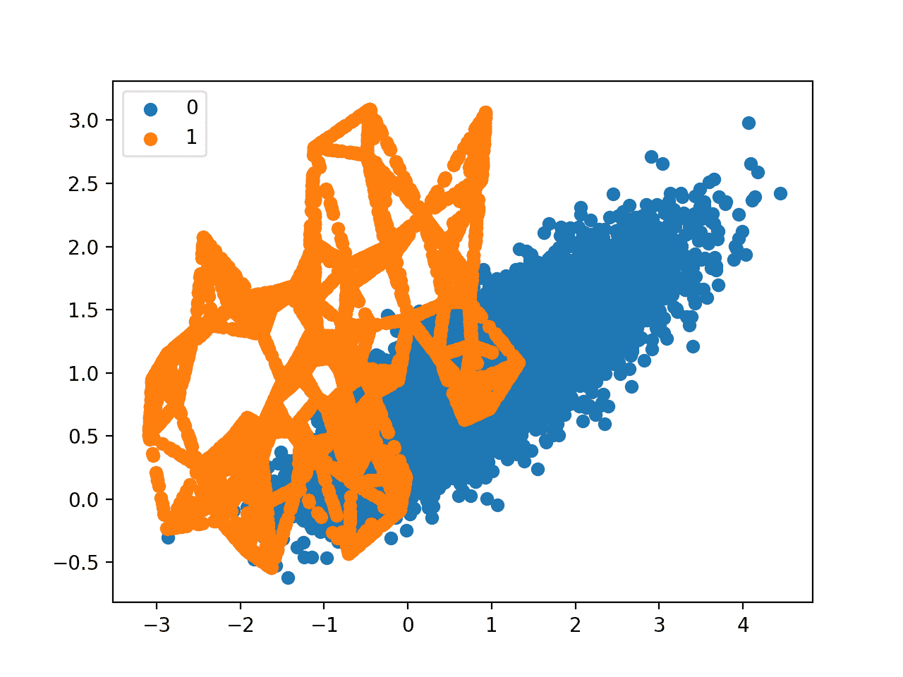
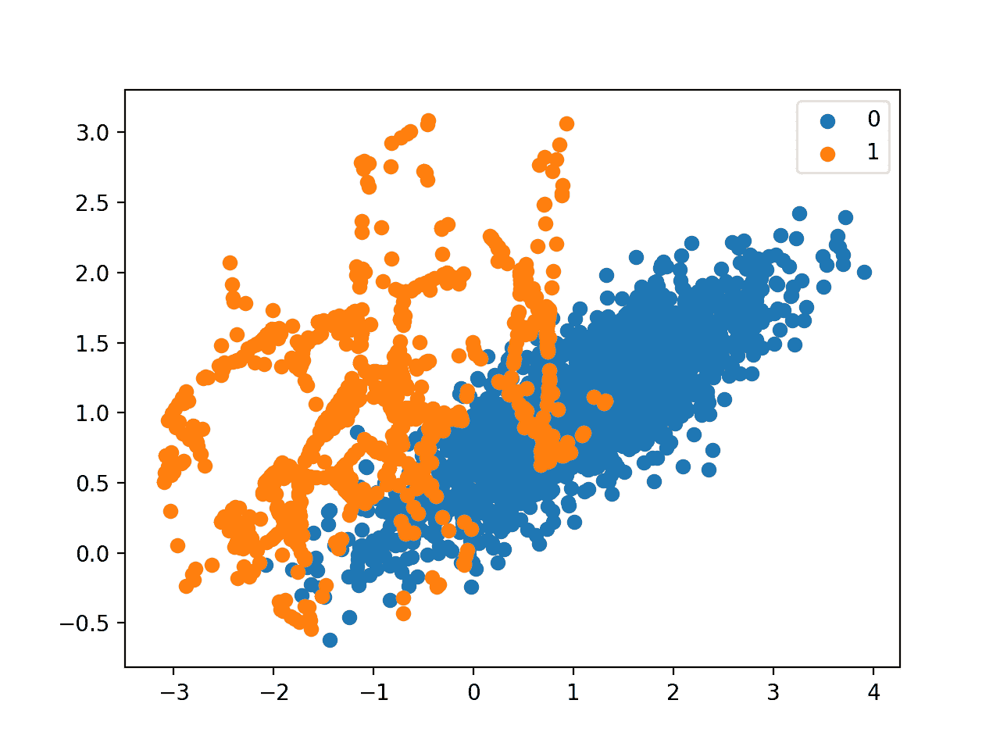
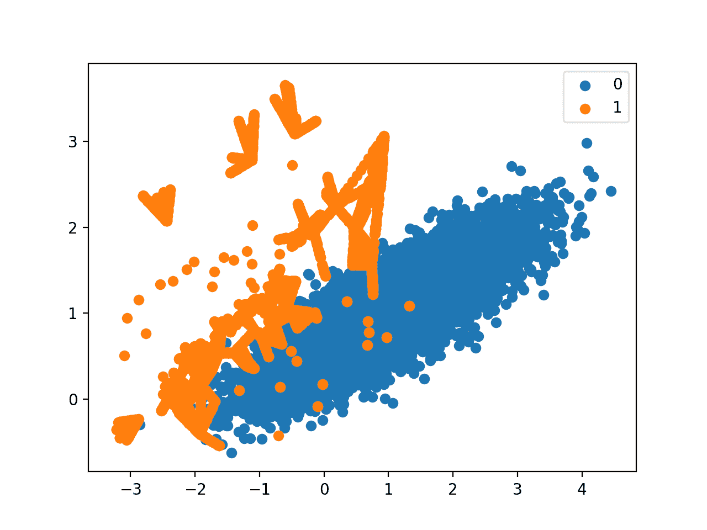

# 使用 Python 进行不平衡分类的 SMOTE】

> 原文：<https://machinelearningmastery.com/smote-oversampling-for-imbalanced-classification/>

最后更新于 2021 年 3 月 17 日

不平衡分类涉及在具有严重类别不平衡的分类数据集上开发预测模型。

使用不平衡数据集的挑战在于，大多数机器学习技术会忽略少数类，从而导致少数类的性能不佳，尽管少数类的性能通常是最重要的。

解决不平衡数据集的一种方法是对少数类进行过采样。最简单的方法是在少数类中复制例子，尽管这些例子没有给模型添加任何新的信息。相反，可以从现有的例子中合成新的例子。这是一种针对少数民族的[数据增强](https://machinelearningmastery.com/how-to-configure-image-data-augmentation-when-training-deep-learning-neural-networks/)，被称为**合成少数民族过采样技术**，简称为 **SMOTE** 。

在本教程中，您将发现针对过采样不平衡分类数据集的 SMOTE。

完成本教程后，您将知道:

*   SMOTE 如何为少数民族阶层综合新的例子。
*   如何在 SMOTE 变换的训练数据集上正确拟合和评估机器学习模型。
*   如何使用 SMOTE 的扩展生成沿着类决策边界的合成例子。

**用我的新书[Python 不平衡分类](https://machinelearningmastery.com/imbalanced-classification-with-python/)启动你的项目**，包括*分步教程*和所有示例的 *Python 源代码*文件。

我们开始吧。

*   **2021 年 1 月更新**:更新了 API 文档的链接。


使用 Python 对不平衡分类进行过采样
图片由 [Victor U](https://flickr.com/photos/viktor_u/11545760004/) 提供，保留部分权利。

## 教程概述

本教程分为五个部分；它们是:

1.  合成少数过采样技术
2.  不平衡学习库
3.  用于平衡数据的 SMOTE
4.  分类标准
5.  选择性合成样品生成
    1.  边界线-SMOTE
    2.  边界线-SVM
    3.  自适应合成采样

## 合成少数过采样技术

不平衡分类的一个问题是，少数类的例子太少，模型无法有效地学习决策边界。

解决这个问题的一个方法是对少数民族的例子进行过采样。这可以通过在拟合模型之前简单地复制训练数据集中少数类的例子来实现。这可以平衡类分布，但不会向模型提供任何附加信息。

复制少数民族的例子的一个改进是综合少数民族的新例子。这是一种针对表格数据的数据扩充，非常有效。

也许最广泛使用的合成新例子的方法叫做**合成少数过采样技术**，简称 SMOTE。该技术由[尼泰什·查瓦拉](https://www3.nd.edu/~nchawla/)等人在他们 2002 年的论文中描述，该论文以标题为“ [SMOTE:合成少数民族过采样技术](https://arxiv.org/abs/1106.1813)的技术命名

SMOTE 的工作方式是选择特征空间中靠近的示例，在特征空间中的示例之间绘制一条线，并在沿着该线的某个点绘制一个新样本。

具体来说，首先从少数民族中随机选择一个例子。然后找到该示例中最近邻居的 *k* (通常 *k=5* )。选择随机选择的邻居，并在特征空间中两个示例之间的随机选择点创建合成示例。

> … SMOTE 首先随机选择一个少数民族类实例 a，并找到它的 k 个最近的少数民族类邻居。然后，通过随机选择 k 个最近邻居 b 中的一个，并连接 a 和 b 以在特征空间中形成线段，来创建合成实例。合成实例被生成为两个选定实例 a 和 b 的凸组合。

—第 47 页，[不平衡学习:基础、算法和应用](https://amzn.to/32K9K6d)，2013。

这个过程可以用来为少数民族创造尽可能多的合成例子。如本文所述，它建议首先使用随机欠采样来修剪多数类中的示例数量，然后使用 SMOTE 对少数类进行过采样来平衡类分布。

> SMOTE 和欠采样的组合比普通欠采样表现更好。

——[SMOTE:合成少数民族过采样技术](https://arxiv.org/abs/1106.1813)，2011 年。

该方法是有效的，因为来自少数类的新的合成示例被创建为似是而非的，也就是说，在特征空间上与来自少数类的现有示例相对接近。

> 我们的合成过采样方法可以使分类器构建包含附近少数类点的更大的决策区域。

——[SMOTE:合成少数民族过采样技术](https://arxiv.org/abs/1106.1813)，2011 年。

这种方法的一个普遍缺点是，创建合成示例时没有考虑多数类，如果类之间有很强的重叠，可能会导致示例不明确。

现在我们已经熟悉了这种技术，让我们来看一个不平衡分类问题的工作示例。

## 不平衡学习库

在这些例子中，我们将使用[不平衡学习 Python 库](https://github.com/scikit-learn-contrib/imbalanced-learn)提供的实现，可以通过 pip 安装如下:

```py
sudo pip install imbalanced-learn
```

您可以通过打印已安装库的版本来确认安装成功:

```py
# check version number
import imblearn
print(imblearn.__version__)
```

运行该示例将打印已安装库的版本号；例如:

```py
0.5.0
```

## 用于平衡数据的 SMOTE

在本节中，我们将通过将 SMOTE 应用于不平衡二进制分类问题来发展它的直觉。

首先，我们可以使用[make _ classification()sci kit-learn 函数](https://scikit-learn.org/stable/modules/generated/sklearn.datasets.make_classification.html)创建一个包含 10，000 个示例和 1:100 类分布的合成二进制分类数据集。

```py
...
# define dataset
X, y = make_classification(n_samples=10000, n_features=2, n_redundant=0,
	n_clusters_per_class=1, weights=[0.99], flip_y=0, random_state=1)
```

我们可以使用[计数器对象](https://docs.python.org/3/library/collections.html#collections.Counter)来总结每个类中的示例数量，以确认数据集创建正确。

```py
...
# summarize class distribution
counter = Counter(y)
print(counter)
```

最后，我们可以创建数据集的散点图，并为每个类的示例涂上不同的颜色，以清楚地看到类不平衡的空间性质。

```py
...
# scatter plot of examples by class label
for label, _ in counter.items():
	row_ix = where(y == label)[0]
	pyplot.scatter(X[row_ix, 0], X[row_ix, 1], label=str(label))
pyplot.legend()
pyplot.show()
```

将所有这些联系在一起，下面列出了生成和绘制合成二元分类问题的完整示例。

```py
# Generate and plot a synthetic imbalanced classification dataset
from collections import Counter
from sklearn.datasets import make_classification
from matplotlib import pyplot
from numpy import where
# define dataset
X, y = make_classification(n_samples=10000, n_features=2, n_redundant=0,
	n_clusters_per_class=1, weights=[0.99], flip_y=0, random_state=1)
# summarize class distribution
counter = Counter(y)
print(counter)
# scatter plot of examples by class label
for label, _ in counter.items():
	row_ix = where(y == label)[0]
	pyplot.scatter(X[row_ix, 0], X[row_ix, 1], label=str(label))
pyplot.legend()
pyplot.show()
```

运行示例首先总结了类分布，确认了 1:100 的比例，在本例中，多数类中有大约 9900 个示例，少数类中有 100 个示例。

```py
Counter({0: 9900, 1: 100})
```

创建数据集的散点图，显示属于多数类的大量点(蓝色)和分散在少数类的少量点(橙色)。我们可以看到这两个类别之间有一定程度的重叠。


不平衡二元分类问题的散点图

接下来，我们可以使用 SMOTE 对少数类进行过采样，并绘制转换后的数据集。

我们可以在 [SMOTE 类](https://imbalanced-learn.org/stable/generated/imblearn.over_sampling.SMOTE.html)中使用不平衡学习 Python 库提供的 SMOTE 实现。

SMOTE 类的作用类似于 scikit-learn 中的数据转换对象，因为它必须被定义和配置，适合数据集，然后应用于创建数据集的新转换版本。

例如，我们可以用默认参数定义一个 SMOTE 实例，该实例将平衡少数类，然后一步适应并应用它来创建数据集的转换版本。

```py
...
# transform the dataset
oversample = SMOTE()
X, y = oversample.fit_resample(X, y)
```

转换后，我们可以总结新转换数据集的类分布，现在可以通过在少数类中创建许多新的合成示例来平衡这种分布。

```py
...
# summarize the new class distribution
counter = Counter(y)
print(counter)
```

还可以创建转换后数据集的散点图，我们预计在少数民族类的原始示例之间的线上会看到更多少数民族类的示例。

将这些联系在一起，下面列出了将 SMOTE 应用于合成数据集，然后汇总并绘制转换结果的完整示例。

```py
# Oversample and plot imbalanced dataset with SMOTE
from collections import Counter
from sklearn.datasets import make_classification
from imblearn.over_sampling import SMOTE
from matplotlib import pyplot
from numpy import where
# define dataset
X, y = make_classification(n_samples=10000, n_features=2, n_redundant=0,
	n_clusters_per_class=1, weights=[0.99], flip_y=0, random_state=1)
# summarize class distribution
counter = Counter(y)
print(counter)
# transform the dataset
oversample = SMOTE()
X, y = oversample.fit_resample(X, y)
# summarize the new class distribution
counter = Counter(y)
print(counter)
# scatter plot of examples by class label
for label, _ in counter.items():
	row_ix = where(y == label)[0]
	pyplot.scatter(X[row_ix, 0], X[row_ix, 1], label=str(label))
pyplot.legend()
pyplot.show()
```

运行该示例首先创建数据集并总结类分布，显示 1:100 的比率。

然后使用 SMOTE 对数据集进行转换，并总结出新的类分布，现在显示了一个平衡的分布，少数类中有 9900 个示例。

```py
Counter({0: 9900, 1: 100})
Counter({0: 9900, 1: 9900})
```

最后，创建转换数据集的散点图。

它显示了少数民族类中更多的例子，这些例子是在少数民族类中的原始例子之间创建的。



非平衡二元分类问题的 SMOTE 变换散点图

关于 SMOTE 的原始论文建议将 SMOTE 与多数类的随机欠采样相结合。

不平衡学习库通过[随机欠采样类](https://imbalanced-learn.org/stable/generated/imblearn.under_sampling.RandomUnderSampler.html)支持随机欠采样。

我们可以更新示例，首先对少数类进行过采样，使其具有多数类示例数量的 10%(例如，大约 1，000 个)，然后使用随机欠采样来减少多数类中的示例数量，使其比少数类多 50%(例如，大约 2，000 个)。

为了实现这一点，我们可以指定期望的比率作为 SMOTE 和*随机欠采样*类的参数；例如:

```py
...
over = SMOTE(sampling_strategy=0.1)
under = RandomUnderSampler(sampling_strategy=0.5)
```

然后，我们可以将这两个变换链接在一起，形成一个[管道](https://imbalanced-learn.org/stable/generated/imblearn.pipeline.Pipeline.html)。

然后，可以将管道应用于数据集，依次执行每个变换，并返回一个最终数据集，该数据集带有应用于该数据集的变换的累积，在这种情况下，先过采样，然后欠采样。

```py
...
steps = [('o', over), ('u', under)]
pipeline = Pipeline(steps=steps)
```

然后，管道可以像单个转换一样适合并应用于我们的数据集:

```py
...
# transform the dataset
X, y = pipeline.fit_resample(X, y)
```

然后，我们可以总结并绘制结果数据集。

我们希望对少数类进行一些 SMOTE 过采样，尽管没有以前数据集平衡时那么多。我们还预计，通过随机欠采样，多数类中的例子会更少。

将这些结合在一起，完整的示例如下所示。

```py
# Oversample with SMOTE and random undersample for imbalanced dataset
from collections import Counter
from sklearn.datasets import make_classification
from imblearn.over_sampling import SMOTE
from imblearn.under_sampling import RandomUnderSampler
from imblearn.pipeline import Pipeline
from matplotlib import pyplot
from numpy import where
# define dataset
X, y = make_classification(n_samples=10000, n_features=2, n_redundant=0,
	n_clusters_per_class=1, weights=[0.99], flip_y=0, random_state=1)
# summarize class distribution
counter = Counter(y)
print(counter)
# define pipeline
over = SMOTE(sampling_strategy=0.1)
under = RandomUnderSampler(sampling_strategy=0.5)
steps = [('o', over), ('u', under)]
pipeline = Pipeline(steps=steps)
# transform the dataset
X, y = pipeline.fit_resample(X, y)
# summarize the new class distribution
counter = Counter(y)
print(counter)
# scatter plot of examples by class label
for label, _ in counter.items():
	row_ix = where(y == label)[0]
	pyplot.scatter(X[row_ix, 0], X[row_ix, 1], label=str(label))
pyplot.legend()
pyplot.show()
```

运行该示例首先创建数据集并总结类分布。

接下来，对数据集进行变换，首先对少数类进行过采样，然后对多数类进行欠采样。经过这一系列转换后的最终类分布与我们的预期相符，在多数类中有 1:2 的比例，即大约 2000 个示例，在少数类中有大约 1000 个示例。

```py
Counter({0: 9900, 1: 100})
Counter({0: 1980, 1: 990})
```

最后，创建转换数据集的散点图，显示过采样的少数类和欠采样的多数类。



基于 SMOTE 和随机欠采样变换的不平衡数据集散点图

现在我们已经熟悉了不平衡数据集的转换，让我们看看在拟合和评估分类模型时使用 SMOTE。

## 分类标准

在本节中，我们将了解在 scikit-learn 中拟合和评估机器学习算法时，如何使用 SMOTE 作为数据准备方法。

首先，我们使用上一节中的二进制分类数据集，然后拟合和评估决策树算法。

算法用任何需要的超参数定义(我们将使用默认值)，然后我们将使用重复分层 [k 倍交叉验证](https://machinelearningmastery.com/k-fold-cross-validation/)来评估模型。我们将使用 10 倍交叉验证的三次重复，这意味着 10 倍交叉验证被应用三次，以拟合和评估数据集上的 30 个模型。

数据集是分层的，这意味着交叉验证拆分的每个折叠都将具有与原始数据集相同的类分布，在本例中，比率为 1:100。我们将使用[曲线下 ROC 面积(AUC)度量](https://machinelearningmastery.com/roc-curves-and-precision-recall-curves-for-classification-in-python/)来评估模型。对于严重不平衡的数据集来说，这可能是乐观的，但对于性能更好的模型来说，这仍然会显示出相对的变化。

```py
...
# define model
model = DecisionTreeClassifier()
# evaluate pipeline
cv = RepeatedStratifiedKFold(n_splits=10, n_repeats=3, random_state=1)
scores = cross_val_score(model, X, y, scoring='roc_auc', cv=cv, n_jobs=-1)
```

一旦适合，我们可以计算和报告跨越折叠和重复的分数的平均值。

```py
...
print('Mean ROC AUC: %.3f' % mean(scores))
```

我们不会期望适合原始不平衡数据集的决策树表现得很好。

将这些联系在一起，完整的示例如下所示。

```py
# decision tree evaluated on imbalanced dataset
from numpy import mean
from sklearn.datasets import make_classification
from sklearn.model_selection import cross_val_score
from sklearn.model_selection import RepeatedStratifiedKFold
from sklearn.tree import DecisionTreeClassifier
# define dataset
X, y = make_classification(n_samples=10000, n_features=2, n_redundant=0,
	n_clusters_per_class=1, weights=[0.99], flip_y=0, random_state=1)
# define model
model = DecisionTreeClassifier()
# evaluate pipeline
cv = RepeatedStratifiedKFold(n_splits=10, n_repeats=3, random_state=1)
scores = cross_val_score(model, X, y, scoring='roc_auc', cv=cv, n_jobs=-1)
print('Mean ROC AUC: %.3f' % mean(scores))
```

运行示例评估模型并报告平均 ROC AUC。

**注**:考虑到算法或评估程序的随机性，或数值精度的差异，您的[结果可能会有所不同](https://machinelearningmastery.com/different-results-each-time-in-machine-learning/)。考虑运行该示例几次，并比较平均结果。

在这种情况下，我们可以看到报告了大约 0.76 的 ROC AUC。

```py
Mean ROC AUC: 0.761
```

现在，我们可以尝试相同的模型和相同的评估方法，尽管使用的是数据集的 SMOTE 转换版本。

在 k 倍交叉验证期间，过采样的正确应用是仅将该方法应用于训练数据集，然后在分层但未转换的测试集上评估模型。

这可以通过定义一个管道来实现，该管道首先用 SMOTE 转换训练数据集，然后拟合模型。

```py
...
# define pipeline
steps = [('over', SMOTE()), ('model', DecisionTreeClassifier())]
pipeline = Pipeline(steps=steps)
```

然后可以使用重复的 k-fold 交叉验证来评估该管道。

将这些联系在一起，下面列出了在训练数据集上使用 SMOTE 过采样评估决策树的完整示例。

```py
# decision tree evaluated on imbalanced dataset with SMOTE oversampling
from numpy import mean
from sklearn.datasets import make_classification
from sklearn.model_selection import cross_val_score
from sklearn.model_selection import RepeatedStratifiedKFold
from sklearn.tree import DecisionTreeClassifier
from imblearn.pipeline import Pipeline
from imblearn.over_sampling import SMOTE
# define dataset
X, y = make_classification(n_samples=10000, n_features=2, n_redundant=0,
	n_clusters_per_class=1, weights=[0.99], flip_y=0, random_state=1)
# define pipeline
steps = [('over', SMOTE()), ('model', DecisionTreeClassifier())]
pipeline = Pipeline(steps=steps)
# evaluate pipeline
cv = RepeatedStratifiedKFold(n_splits=10, n_repeats=3, random_state=1)
scores = cross_val_score(pipeline, X, y, scoring='roc_auc', cv=cv, n_jobs=-1)
print('Mean ROC AUC: %.3f' % mean(scores))
```

运行该示例评估模型，并报告多次折叠和重复的平均 ROC AUC 得分。

**注**:考虑到算法或评估程序的随机性，或数值精度的差异，您的[结果可能会有所不同](https://machinelearningmastery.com/different-results-each-time-in-machine-learning/)。考虑运行该示例几次，并比较平均结果。

在这种情况下，我们可以看到从大约 0.76 到大约 0.80 的 ROC AUC 在性能上的适度改善。

```py
Mean ROC AUC: 0.809
```

正如论文中提到的，当与多数类的欠采样(如随机欠采样)结合使用时，SMOTE 的性能会更好。

我们可以通过简单地向管道添加一个*随机欠采样*步骤来实现这一点。

与上一节一样，我们将首先使用 SMOTE 对少数类进行过采样，使其达到约 1:10 的比例，然后对多数类进行欠采样，使其达到约 1:2 的比例。

```py
...
# define pipeline
model = DecisionTreeClassifier()
over = SMOTE(sampling_strategy=0.1)
under = RandomUnderSampler(sampling_strategy=0.5)
steps = [('over', over), ('under', under), ('model', model)]
pipeline = Pipeline(steps=steps)
```

将这些联系在一起，完整的示例如下所示。

```py
# decision tree  on imbalanced dataset with SMOTE oversampling and random undersampling
from numpy import mean
from sklearn.datasets import make_classification
from sklearn.model_selection import cross_val_score
from sklearn.model_selection import RepeatedStratifiedKFold
from sklearn.tree import DecisionTreeClassifier
from imblearn.pipeline import Pipeline
from imblearn.over_sampling import SMOTE
from imblearn.under_sampling import RandomUnderSampler
# define dataset
X, y = make_classification(n_samples=10000, n_features=2, n_redundant=0,
	n_clusters_per_class=1, weights=[0.99], flip_y=0, random_state=1)
# define pipeline
model = DecisionTreeClassifier()
over = SMOTE(sampling_strategy=0.1)
under = RandomUnderSampler(sampling_strategy=0.5)
steps = [('over', over), ('under', under), ('model', model)]
pipeline = Pipeline(steps=steps)
# evaluate pipeline
cv = RepeatedStratifiedKFold(n_splits=10, n_repeats=3, random_state=1)
scores = cross_val_score(pipeline, X, y, scoring='roc_auc', cv=cv, n_jobs=-1)
print('Mean ROC AUC: %.3f' % mean(scores))
```

运行该示例使用训练数据集上的 SMOTE 过采样和随机欠采样管道来评估模型。

**注**:考虑到算法或评估程序的随机性，或数值精度的差异，您的[结果可能会有所不同](https://machinelearningmastery.com/different-results-each-time-in-machine-learning/)。考虑运行该示例几次，并比较平均结果。

在这种情况下，我们可以看到报告的 ROC AUC 显示额外的提升至约 0.83。

```py
Mean ROC AUC: 0.834
```

您可以尝试测试少数族裔和多数族裔的不同比率(例如，更改 *sampling_strategy* 参数)，看看是否有可能进一步提升性能。

另一个需要探索的领域是，在创建每个新的合成示例时，测试在 SMOTE 过程中选择的 k 近邻的不同值。默认值为 *k=5* ，尽管较大或较小的值会影响创建的示例类型，进而可能影响模型的性能。

例如，我们可以网格搜索 *k* 的一系列值，例如从 1 到 7 的值，并为每个值评估管道。

```py
...
# values to evaluate
k_values = [1, 2, 3, 4, 5, 6, 7]
for k in k_values:
	# define pipeline
	...
```

下面列出了完整的示例。

```py
# grid search k value for SMOTE oversampling for imbalanced classification
from numpy import mean
from sklearn.datasets import make_classification
from sklearn.model_selection import cross_val_score
from sklearn.model_selection import RepeatedStratifiedKFold
from sklearn.tree import DecisionTreeClassifier
from imblearn.pipeline import Pipeline
from imblearn.over_sampling import SMOTE
from imblearn.under_sampling import RandomUnderSampler
# define dataset
X, y = make_classification(n_samples=10000, n_features=2, n_redundant=0,
	n_clusters_per_class=1, weights=[0.99], flip_y=0, random_state=1)
# values to evaluate
k_values = [1, 2, 3, 4, 5, 6, 7]
for k in k_values:
	# define pipeline
	model = DecisionTreeClassifier()
	over = SMOTE(sampling_strategy=0.1, k_neighbors=k)
	under = RandomUnderSampler(sampling_strategy=0.5)
	steps = [('over', over), ('under', under), ('model', model)]
	pipeline = Pipeline(steps=steps)
	# evaluate pipeline
	cv = RepeatedStratifiedKFold(n_splits=10, n_repeats=3, random_state=1)
	scores = cross_val_score(pipeline, X, y, scoring='roc_auc', cv=cv, n_jobs=-1)
	score = mean(scores)
	print('> k=%d, Mean ROC AUC: %.3f' % (k, score))
```

运行该示例将对过程中使用的 KNN 使用不同的 k 值执行 SMOTE 过采样，然后随机欠采样，并在生成的训练数据集上拟合决策树。

报告了每种配置的平均 ROC AUC。

**注**:考虑到算法或评估程序的随机性，或数值精度的差异，您的[结果可能会有所不同](https://machinelearningmastery.com/different-results-each-time-in-machine-learning/)。考虑运行该示例几次，并比较平均结果。

在这种情况下，结果表明 *k=3* 可能是好的，ROC AUC 约为 0.84， *k=7* 也可能是好的，ROC AUC 约为 0.85。

这突出显示了所执行的过采样和欠采样的数量(sampling_strategy 参数)以及从中选择合作伙伴来创建合成示例的示例数量( *k_neighbors* )可能是为数据集选择和调整的重要参数。

```py
> k=1, Mean ROC AUC: 0.827
> k=2, Mean ROC AUC: 0.823
> k=3, Mean ROC AUC: 0.834
> k=4, Mean ROC AUC: 0.840
> k=5, Mean ROC AUC: 0.839
> k=6, Mean ROC AUC: 0.839
> k=7, Mean ROC AUC: 0.853
```

现在我们已经熟悉了如何在拟合和评估分类模型时使用 SMOTE，让我们看看 SMOTE 过程的一些扩展。

## 选择性合成样品生成

我们可以选择使用 SMOTE 过采样的少数民族样本。

在这一节中，我们将回顾 SMOTE 的一些扩展，这些扩展对来自少数类的例子更具选择性，为生成新的合成例子提供了基础。

### 边界线-SMOTE

SMOTE 的一个流行扩展包括选择那些被错误分类的少数类的实例，例如使用 k-最近邻分类模型。

然后，我们可以对这些困难的情况进行过采样，只在可能需要的地方提供更高的分辨率。

> 边界线上的例子和附近的例子比远离边界线的例子更容易被错误分类，因此对分类更重要。

——[边界线-SMOTE:不平衡数据集学习中的一种新的过采样方法](https://link.springer.com/chapter/10.1007/11538059_91)，2005。

这些被错误分类的例子可能是模糊的，并且在决策边界的边缘或边界的区域中，其中类成员可能重叠。因此，这种对 SMOTE 的修改被称为边界-SMOTE，是由韩晖等人在 2005 年发表的题为“[边界-SMOTE:不平衡数据集学习中的一种新的过采样方法”](https://link.springer.com/chapter/10.1007/11538059_91)的论文中提出的

作者还描述了该方法的一个版本，该版本还针对那些导致少数类中的临界实例的错误分类的示例对多数类进行了过采样。这被称为临界 SMOTE1，而对少数类中的临界情况的过采样被称为临界 SMOTE2。

> 边界线-smoth 2 不仅从 DANGER 中的每个示例及其在 P 中的正最近邻生成合成示例，还从其在 n 中的负最近邻生成合成示例

——[边界线-SMOTE:不平衡数据集学习中的一种新的过采样方法](https://link.springer.com/chapter/10.1007/11538059_91)，2005。

我们可以使用不平衡学习中的[边界移动类](https://imbalanced-learn.org/stable/generated/imblearn.over_sampling.BorderlineSMOTE.html)来实现边界移动 1。

我们可以演示前面章节中使用的合成二元分类问题的技巧。

我们不希望盲目地为少数类生成新的合成示例，而是希望边界-SMOTE 方法只沿着两个类之间的决策边界创建合成示例。

下面列出了使用边界扫描对二进制分类数据集进行过采样的完整示例。

```py
# borderline-SMOTE for imbalanced dataset
from collections import Counter
from sklearn.datasets import make_classification
from imblearn.over_sampling import BorderlineSMOTE
from matplotlib import pyplot
from numpy import where
# define dataset
X, y = make_classification(n_samples=10000, n_features=2, n_redundant=0,
	n_clusters_per_class=1, weights=[0.99], flip_y=0, random_state=1)
# summarize class distribution
counter = Counter(y)
print(counter)
# transform the dataset
oversample = BorderlineSMOTE()
X, y = oversample.fit_resample(X, y)
# summarize the new class distribution
counter = Counter(y)
print(counter)
# scatter plot of examples by class label
for label, _ in counter.items():
	row_ix = where(y == label)[0]
	pyplot.scatter(X[row_ix, 0], X[row_ix, 1], label=str(label))
pyplot.legend()
pyplot.show()
```

运行该示例首先创建数据集并总结初始类分布，显示 1:100 的关系。

边界-SMOTE 应用于平衡班级分布，并通过打印的班级总结进行确认。

```py
Counter({0: 9900, 1: 100})
Counter({0: 9900, 1: 9900})
```

最后，创建转换数据集的散点图。该图清楚地显示了选择性过采样方法的效果。少数类决策边界上的示例被集中过采样(橙色)。

该图显示，远离决策边界的示例没有过采样。这包括更容易分类的例子(图左上方的橙色点)和考虑到强烈的类重叠而极难分类的例子(图右下方的橙色点)。


基于边界过采样的不平衡数据集散点图

### 边界线-SVM

Hien Nguyen 等人建议使用边界线-SMOTE 的替代方案，其中使用 SVM 算法而不是 KNN 算法来识别决策边界上的错误分类示例。

他们的方法总结在 2009 年的论文《不平衡数据分类的临界过采样》中 SVM 用于定位由支持向量和少数类中的示例定义的决策边界，该决策边界接近支持向量并成为生成合成示例的焦点。

> ……边界区域通过在原始训练集上训练标准 SVMs 分类器后获得的支持向量来近似。新的实例将沿着连接每一个少数类支持向量和它的一些最近邻居的线使用插值随机创建

——[不平衡数据分类的临界过采样](http://ousar.lib.okayama-u.ac.jp/en/19617)，2009。

除了使用 SVM，这种技术还试图选择少数民族较少的地区，并试图向阶级边界外推。

> 如果多数类实例的数量少于其最近邻居的一半，将使用外推法创建新实例，以将少数类区域向多数类扩展。

——[不平衡数据分类的临界过采样](http://ousar.lib.okayama-u.ac.jp/en/19617)，2009。

这种变化可以通过不平衡学习库中的 [SVMSMOTE 类](https://imbalanced-learn.org/stable/generated/imblearn.over_sampling.SVMSMOTE.html)来实现。

下面的示例演示了在相同的不平衡数据集上使用边界线分割的替代方法。

```py
# borderline-SMOTE with SVM for imbalanced dataset
from collections import Counter
from sklearn.datasets import make_classification
from imblearn.over_sampling import SVMSMOTE
from matplotlib import pyplot
from numpy import where
# define dataset
X, y = make_classification(n_samples=10000, n_features=2, n_redundant=0,
	n_clusters_per_class=1, weights=[0.99], flip_y=0, random_state=1)
# summarize class distribution
counter = Counter(y)
print(counter)
# transform the dataset
oversample = SVMSMOTE()
X, y = oversample.fit_resample(X, y)
# summarize the new class distribution
counter = Counter(y)
print(counter)
# scatter plot of examples by class label
for label, _ in counter.items():
	row_ix = where(y == label)[0]
	pyplot.scatter(X[row_ix, 0], X[row_ix, 1], label=str(label))
pyplot.legend()
pyplot.show()
```

运行该示例首先总结了原始的类分布，然后在使用 SVM 模型应用了边界线-SMOTE 之后总结了平衡的类分布。

```py
Counter({0: 9900, 1: 100})
Counter({0: 9900, 1: 9900})
```

创建数据集的散点图，显示沿决策边界和多数类的定向过采样。

我们还可以看到，与边界线-SMOTE 不同，更多的示例是在远离类重叠区域的地方合成的，例如在图的左上角。



利用 SVM 边界 SMOTE 过采样的不平衡数据集散点图

### 自适应合成采样

另一种方法是生成与少数民族样本密度成反比的合成样本。

也就是说，在少数示例密度低的特征空间区域中生成更多的合成示例，而在密度高的区域中生成更少的合成示例或不生成合成示例。

对 SMOTE 的这种修改被称为自适应综合采样方法，或 ADASN，并在何海波等人 2008 年的论文中被提出，该论文以名为“T2 ADASN:用于不平衡学习的自适应综合采样方法”的方法命名

> ADASYN 基于根据少数类数据样本的分布自适应生成少数类数据样本的思想:与那些更容易学习的少数类样本相比，为更难学习的少数类样本生成更多的合成数据。

——[ADASYN:不平衡学习的自适应综合采样方法](https://ieeexplore.ieee.org/document/4633969)，2008。

使用在线边界-SMOTE，不会创建区分模型。相反，少数类中的示例根据其密度进行加权，然后密度最低的那些示例是 SMOTE 合成示例生成过程的焦点。

> ADASYN 算法的关键思想是使用密度分布作为标准，自动决定需要为每个少数数据示例生成的合成样本的数量。

——[ADASYN:不平衡学习的自适应综合采样方法](https://ieeexplore.ieee.org/document/4633969)，2008。

我们可以使用不平衡学习库中的 [ADASYN 类](https://imbalanced-learn.org/stable/generated/imblearn.over_sampling.ADASYN.html)来实现这个过程。

下面的示例演示了在不平衡二进制分类数据集上进行过采样的替代方法。

```py
# Oversample and plot imbalanced dataset with ADASYN
from collections import Counter
from sklearn.datasets import make_classification
from imblearn.over_sampling import ADASYN
from matplotlib import pyplot
from numpy import where
# define dataset
X, y = make_classification(n_samples=10000, n_features=2, n_redundant=0,
	n_clusters_per_class=1, weights=[0.99], flip_y=0, random_state=1)
# summarize class distribution
counter = Counter(y)
print(counter)
# transform the dataset
oversample = ADASYN()
X, y = oversample.fit_resample(X, y)
# summarize the new class distribution
counter = Counter(y)
print(counter)
# scatter plot of examples by class label
for label, _ in counter.items():
	row_ix = where(y == label)[0]
	pyplot.scatter(X[row_ix, 0], X[row_ix, 1], label=str(label))
pyplot.legend()
pyplot.show()
```

运行该示例首先创建数据集并总结初始类分布，然后在执行过采样后更新类分布。

```py
Counter({0: 9900, 1: 100})
Counter({0: 9900, 1: 9899})
```

创建转换数据集的散点图。像边界线-SMOTE 一样，我们可以看到合成样本生成集中在决策边界周围，因为该区域具有[最低密度](https://machinelearningmastery.com/probability-density-estimation/)。

与边界线-SMOTE 不同，我们可以看到类重叠最多的示例具有最多的焦点。对于这些低密度示例可能是异常值的问题，ADASYN 方法可能会将过多的注意力放在特征空间的这些区域，这可能会导致更差的模型性能。

在应用过采样程序之前，去除异常值可能会有所帮助，这可能是一种更普遍使用的有益启发。


基于自适应合成采样的不平衡数据集散点图

## 进一步阅读

如果您想更深入地了解这个主题，本节将提供更多资源。

### 书

*   [从不平衡数据集中学习](https://amzn.to/307Xlva)，2018。
*   [不平衡学习:基础、算法和应用](https://amzn.to/32K9K6d)，2013。

### 报纸

*   [SMOTE:合成少数过采样技术](https://arxiv.org/abs/1106.1813)，2002。
*   [边界线-SMOTE:一种新的不平衡数据集学习的过采样方法](https://link.springer.com/chapter/10.1007/11538059_91)，2005。
*   [不平衡数据分类的临界过采样](http://ousar.lib.okayama-u.ac.jp/en/19617)，2009。
*   [ADASYN:不平衡学习的自适应综合采样方法](https://ieeexplore.ieee.org/document/4633969)，2008。

### 应用程序接口

*   [imblearn.over_sampling。SMOTE API](https://imbalanced-learn.org/stable/generated/imblearn.over_sampling.SMOTE.html) 。
*   [imblearn.over_sampling。SMOTENC API](https://imbalanced-learn.org/stable/generated/imblearn.over_sampling.SMOTENC.html) 。
*   [imblearn.over_sampling。边境移动应用编程接口](https://imbalanced-learn.org/stable/generated/imblearn.over_sampling.BorderlineSMOTE.html)。
*   [imblearn.over_sampling。SVMSMOTE API](https://imbalanced-learn.org/stable/generated/imblearn.over_sampling.SVMSMOTE.html) 。
*   [imblearn.over_sampling。ADASYN API](https://imbalanced-learn.org/stable/generated/imblearn.over_sampling.ADASYN.html) 。

### 文章

*   [数据分析中的过采样和欠采样，维基百科](https://en.wikipedia.org/wiki/Oversampling_and_undersampling_in_data_analysis)。

## 摘要

在本教程中，您发现了用于过采样不平衡分类数据集的 SMOTE。

具体来说，您了解到:

*   SMOTE 如何为少数民族阶层综合新的例子。
*   如何在 SMOTE 变换的训练数据集上正确拟合和评估机器学习模型。
*   如何使用 SMOTE 的扩展生成沿着类决策边界的合成例子。

**你有什么问题吗？**
在下面的评论中提问，我会尽力回答。