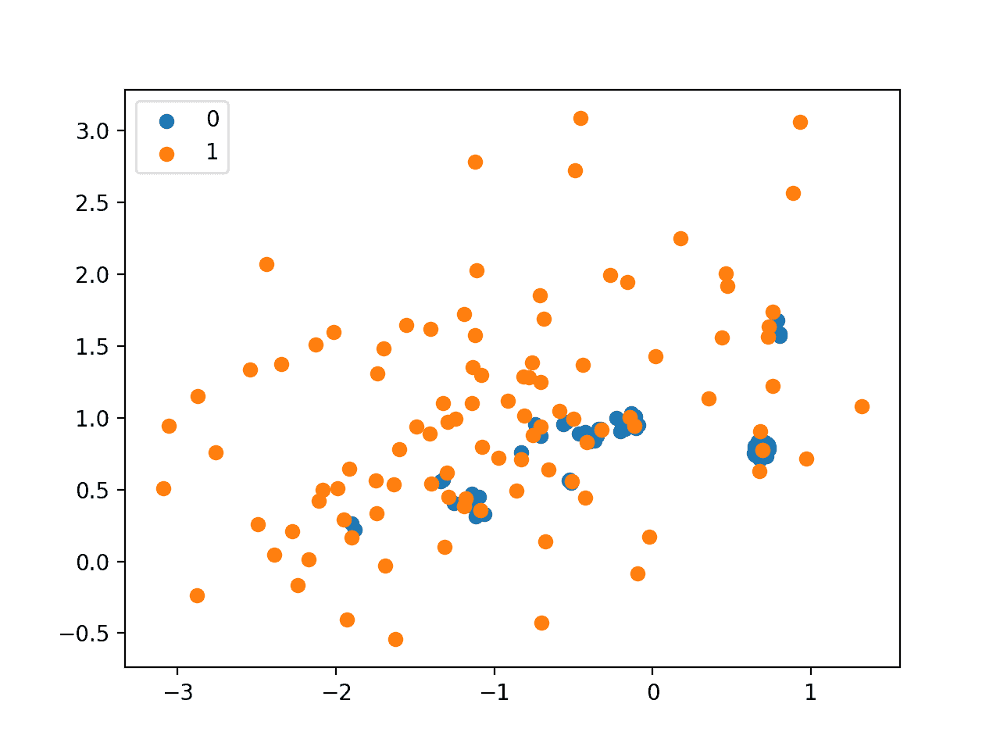
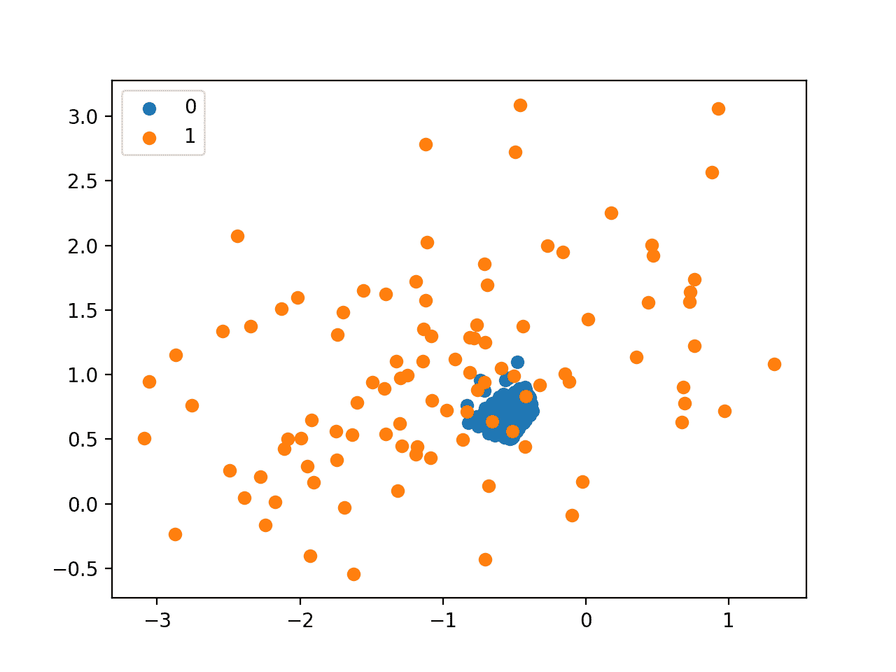
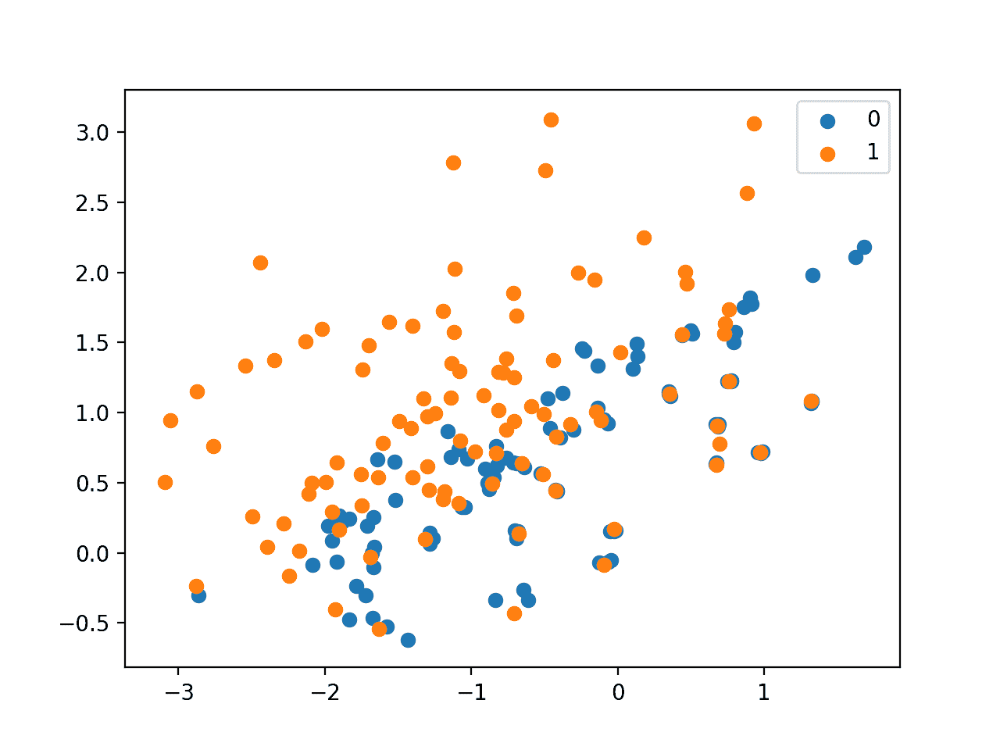
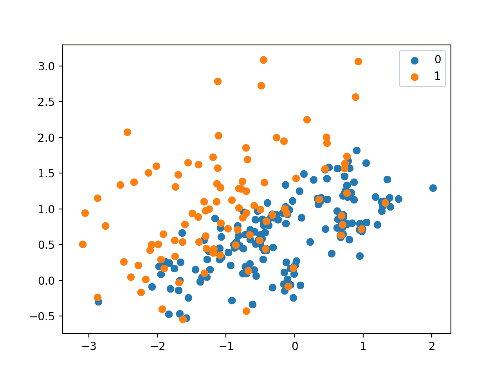
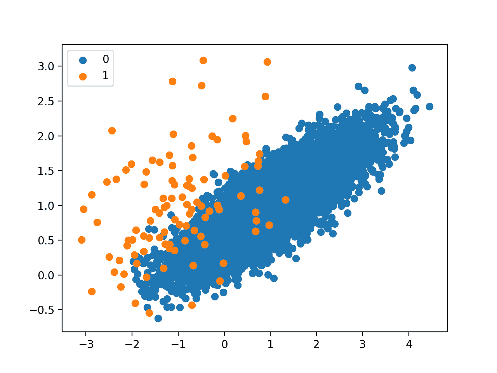
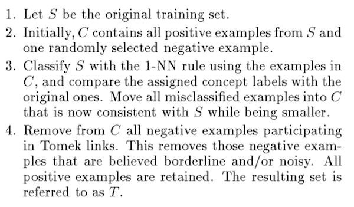
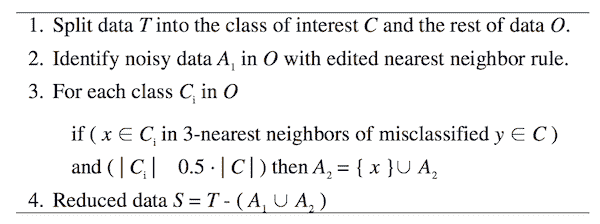
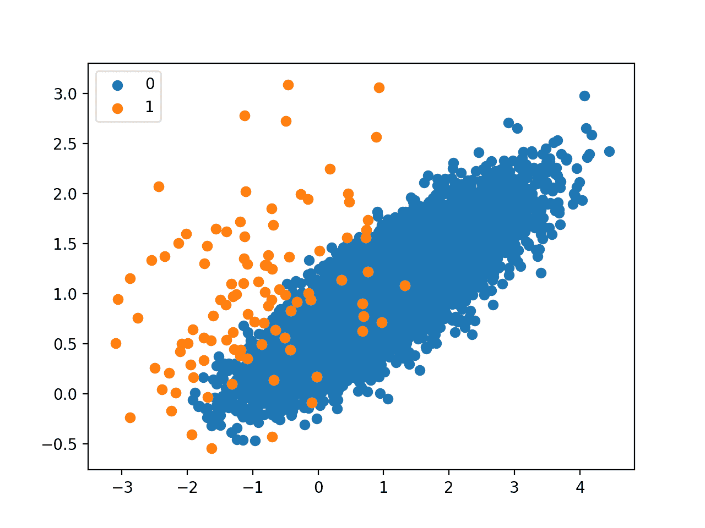

# 不平衡分类的欠采样算法

> 原文：<https://machinelearningmastery.com/undersampling-algorithms-for-imbalanced-classification/>

最后更新于 2021 年 1 月 27 日

重采样方法旨在改变不平衡分类任务的训练数据集的组成。

不平衡分类的重采样方法大多关注对少数类的过采样。然而，已经开发了一套对多数类进行欠采样的技术，可以与有效的过采样方法结合使用。

有许多不同类型的欠采样技术，尽管大多数可以分为选择要保留在转换数据集中的示例、选择要删除的示例以及组合这两种方法的混合。

在本教程中，您将发现不平衡分类的欠采样方法。

完成本教程后，您将知道:

*   如何使用“未遂事件”和“压缩最近邻规则”方法来选择不属于多数类的示例。
*   如何使用 Tomek 链接和编辑的最近邻规则方法从多数类中选择要删除的示例。
*   如何使用“单侧选择”和“邻域清理规则”，这两个规则结合了从多数类中保留和删除示例的选择方法。

**用我的新书[Python 不平衡分类](https://machinelearningmastery.com/imbalanced-classification-with-python/)启动你的项目**，包括*分步教程*和所有示例的 *Python 源代码*文件。

我们开始吧。

*   **2021 年 1 月更新**:更新了 API 文档的链接。


如何使用欠采样算法进行不平衡分类
图片由[诺根](https://flickr.com/photos/vgd1951/40748796933/)提供，保留部分权利。

## 教程概述

本教程分为五个部分；它们是:

1.  不平衡分类的欠采样
2.  不平衡学习库
3.  选择要保留的示例的方法
    1.  差点采样不足
    2.  欠采样的压缩最近邻规则
4.  选择要删除的示例的方法
    1.  用于欠采样的 Tomek 链接
    2.  欠采样的编辑最近邻规则
5.  保留和删除方法的组合
    1.  欠采样的单侧选择
    2.  欠采样的邻域清理规则

## 不平衡分类的欠采样

欠采样是指一组技术，旨在平衡具有倾斜类分布的分类数据集的类分布。

不平衡的类分布会有一个或多个例子很少的类(少数类)和一个或多个例子很多的类(多数类)。最好在二进制(两类)分类问题的上下文中理解，其中类 0 是多数类，类 1 是少数类。

欠采样技术从训练数据集中移除属于多数类的示例，以便更好地平衡类分布，例如将偏斜从 1:100 减少到 1:10、1:2，甚至 1:1 类分布。这与过采样不同，过采样包括向少数类添加示例，以减少类分布的偏差。

> …欠采样，包括通过消除属于多数类的示例来减少数据，目的是均衡每个类的示例数量…

—第 82 页，[从不平衡数据集](https://amzn.to/307Xlva)中学习，2018。

欠采样方法可以直接用于训练数据集，然后再用于拟合机器学习模型。通常，欠采样方法与少数类的过采样技术结合使用，这种组合通常比在训练数据集上单独使用过采样或欠采样带来更好的表现。

最简单的欠采样技术包括从多数类中随机选择示例，并将其从训练数据集中删除。这被称为随机欠采样。虽然简单而有效，但这种技术的一个限制是，在确定类之间的决策边界时，示例被移除，而不考虑它们可能有多有用或多重要。这意味着有用的信息有可能被删除。

> 随机欠采样的主要缺点是，这种方法可能会丢弃对归纳过程可能很重要的潜在有用数据。数据的移除是一个关键的决策，因此许多欠采样的建议使用启发式来克服非启发式决策的局限性。

—第 83 页，[从不平衡数据集](https://amzn.to/307Xlva)中学习，2018。

这种方法的一个扩展是更好地识别被删除的多数类的例子。这通常涉及试探法或学习模型，试图识别冗余的删除示例或有用的未删除示例。

有许多欠采样技术使用这些类型的试探法。在接下来的部分中，我们将回顾一些更常见的方法，并为它们在合成不平衡二进制分类数据集上的操作开发直觉。

我们可以使用 scikit-learn 库中的 [make_classification()函数](https://scikit-learn.org/stable/modules/generated/sklearn.datasets.make_classification.html)定义一个合成的二进制分类数据集。例如，我们可以创建 10，000 个具有两个输入变量和 1:100 分布的示例，如下所示:

```py
...
# define dataset
X, y = make_classification(n_samples=10000, n_features=2, n_redundant=0,
n_clusters_per_class=1, weights=[0.99], flip_y=0, random_state=1)
```

然后，我们可以通过[散点图()Matplotlib 函数](https://matplotlib.org/3.1.1/api/_as_gen/matplotlib.pyplot.scatter.html)创建数据集的散点图，以了解每个类中示例的空间关系及其不平衡。

```py
...
# scatter plot of examples by class label
for label, _ in counter.items():
	row_ix = where(y == label)[0]
	pyplot.scatter(X[row_ix, 0], X[row_ix, 1], label=str(label))
pyplot.legend()
pyplot.show()
```

将这些联系在一起，下面列出了创建不平衡分类数据集并绘制示例的完整示例。

```py
# Generate and plot a synthetic imbalanced classification dataset
from collections import Counter
from sklearn.datasets import make_classification
from matplotlib import pyplot
from numpy import where
# define dataset
X, y = make_classification(n_samples=10000, n_features=2, n_redundant=0,
	n_clusters_per_class=1, weights=[0.99], flip_y=0, random_state=1)
# summarize class distribution
counter = Counter(y)
print(counter)
# scatter plot of examples by class label
for label, _ in counter.items():
	row_ix = where(y == label)[0]
	pyplot.scatter(X[row_ix, 0], X[row_ix, 1], label=str(label))
pyplot.legend()
pyplot.show()
```

运行该示例首先总结了类分布，显示了大约 1:100 的类分布，其中大约 10，000 个示例包含类 0，100 个示例包含类 1。

```py
Counter({0: 9900, 1: 100})
```

接下来，创建散点图，显示数据集中的所有示例。我们可以看到大量 0 类(蓝色)的例子和少量 1 类(橙色)的例子。我们还可以看到，在属于类 0 的特征空间部分中，类与类 1 中的一些示例明显重叠。


不平衡分类数据集的散点图

这个图提供了发展直觉的起点，即不同的欠采样技术对多数类的影响。

接下来，我们可以开始回顾通过[不平衡学习 Python 库](https://github.com/scikit-learn-contrib/imbalanced-learn)提供的流行欠采样方法。

有许多不同的方法可供选择。我们将把它们分成从多数类中选择要保留的示例的方法、选择要删除的示例的方法以及两种方法的组合。

## 不平衡学习库

在这些例子中，我们将使用[不平衡学习 Python 库](https://github.com/scikit-learn-contrib/imbalanced-learn)提供的实现，可以通过 pip 安装如下:

```py
sudo pip install imbalanced-learn
```

您可以通过打印已安装库的版本来确认安装成功:

```py
# check version number
import imblearn
print(imblearn.__version__)
```

运行该示例将打印已安装库的版本号；例如:

```py
0.5.0
```

## 选择要保留的示例的方法

在本节中，我们将仔细研究两种方法，这两种方法从多数类中选择要保留的示例，即方法的未遂家族和流行的压缩最近邻规则。

### 差点采样不足

Miss 指的是欠采样方法的集合，这些方法根据多数类示例到少数类示例的距离来选择示例。

这些方法是由张建平和 Inderjeet Mani 在他们 2003 年发表的题为“不平衡数据分布的 KNN 方法:涉及信息提取的案例研究”的论文中提出的

该技术有三个版本，分别名为“接近缺失-1”、“接近缺失-2”和“接近缺失-3”。

**NearMiss-1** 从多数类中选择与少数类中三个最接近的示例具有最小平均距离的示例。 **NearMiss-2** 从多数类中选择与少数类最远的三个示例之间平均距离最小的示例。 **NearMiss-3** 包括为少数民族中的每个例子选择给定数量的多数民族例子。

这里，使用欧几里德距离等在特征空间中确定距离。

*   **NearMiss-1** :与三个最接近的少数类示例平均距离最小的多数类示例。
*   **NearMiss-2** :多数类示例与三个最远的少数类示例之间的平均距离最小。
*   **NearMiss-3** :多数类示例，与每个少数类示例的距离最小。

NearMiss-3 似乎是可取的，因为它将只保留决策边界上的那些多数类示例。

我们可以使用[接近缺失不平衡学习类](https://imbalanced-learn.org/stable/generated/imblearn.under_sampling.NearMiss.html)来实现接近缺失方法。

所使用的接近未命中策略的类型由“*版本*”参数定义，默认情况下，该参数对于接近未命中-1 设置为 1，但是对于其他两种方法可以设置为 2 或 3。

```py
...
# define the undersampling method
undersample = NearMiss(version=1)
```

默认情况下，该技术将对多数类进行欠采样，使其具有与少数类相同数量的示例，尽管这可以通过将 *sampling_strategy* 参数设置为少数类的一小部分来更改。

首先，我们可以演示 NearMiss-1，它只选择那些与三个少数类实例具有最小距离的多数类实例，由 *n_neighbors* 参数定义。

我们期望多数类例子围绕重叠的少数类例子。

下面列出了完整的示例。

```py
# Undersample imbalanced dataset with NearMiss-1
from collections import Counter
from sklearn.datasets import make_classification
from imblearn.under_sampling import NearMiss
from matplotlib import pyplot
from numpy import where
# define dataset
X, y = make_classification(n_samples=10000, n_features=2, n_redundant=0,
	n_clusters_per_class=1, weights=[0.99], flip_y=0, random_state=1)
# summarize class distribution
counter = Counter(y)
print(counter)
# define the undersampling method
undersample = NearMiss(version=1, n_neighbors=3)
# transform the dataset
X, y = undersample.fit_resample(X, y)
# summarize the new class distribution
counter = Counter(y)
print(counter)
# scatter plot of examples by class label
for label, _ in counter.items():
	row_ix = where(y == label)[0]
	pyplot.scatter(X[row_ix, 0], X[row_ix, 1], label=str(label))
pyplot.legend()
pyplot.show()
```

运行该示例对多数类进行欠采样，并创建转换后数据集的散点图。

我们可以看到，正如预期的那样，只有在重叠区域中最接近少数类示例的多数类中的那些示例被保留。



接近 Miss-1 的欠采样不平衡数据集散点图

接下来，我们可以演示接近缺失-2 策略，它与接近缺失-1 相反。它从少数民族类中选择最接近最遥远的例子，由 *n_neighbors* 参数定义。

单从描述来看，这并不是一个直观的策略。

下面列出了完整的示例。

```py
# Undersample imbalanced dataset with NearMiss-2
from collections import Counter
from sklearn.datasets import make_classification
from imblearn.under_sampling import NearMiss
from matplotlib import pyplot
from numpy import where
# define dataset
X, y = make_classification(n_samples=10000, n_features=2, n_redundant=0,
	n_clusters_per_class=1, weights=[0.99], flip_y=0, random_state=1)
# summarize class distribution
counter = Counter(y)
print(counter)
# define the undersampling method
undersample = NearMiss(version=2, n_neighbors=3)
# transform the dataset
X, y = undersample.fit_resample(X, y)
# summarize the new class distribution
counter = Counter(y)
print(counter)
# scatter plot of examples by class label
for label, _ in counter.items():
	row_ix = where(y == label)[0]
	pyplot.scatter(X[row_ix, 0], X[row_ix, 1], label=str(label))
pyplot.legend()
pyplot.show()
```

运行该示例，我们可以看到 NearMiss-2 选择看起来位于两个类重叠的质心的示例。



接近 Miss-2 的欠采样不平衡数据集散点图

最后，我们可以尝试 NearMiss-3，它从多数类中为每个少数类选择最接近的例子。

*n_neighbors_ver3* 参数确定了每个少数民族示例要选择的示例数量，尽管通过*采样策略*设置的所需平衡比率将对此进行过滤，从而实现所需的平衡。

下面列出了完整的示例。

```py
# Undersample imbalanced dataset with NearMiss-3
from collections import Counter
from sklearn.datasets import make_classification
from imblearn.under_sampling import NearMiss
from matplotlib import pyplot
from numpy import where
# define dataset
X, y = make_classification(n_samples=10000, n_features=2, n_redundant=0,
	n_clusters_per_class=1, weights=[0.99], flip_y=0, random_state=1)
# summarize class distribution
counter = Counter(y)
print(counter)
# define the undersampling method
undersample = NearMiss(version=3, n_neighbors_ver3=3)
# transform the dataset
X, y = undersample.fit_resample(X, y)
# summarize the new class distribution
counter = Counter(y)
print(counter)
# scatter plot of examples by class label
for label, _ in counter.items():
	row_ix = where(y == label)[0]
	pyplot.scatter(X[row_ix, 0], X[row_ix, 1], label=str(label))
pyplot.legend()
pyplot.show()
```

不出所料，我们可以看到，少数族裔中与多数族裔重叠的每个例子都有最多三个来自多数族裔的邻居。



接近 Miss-3 的欠采样不平衡数据集散点图

### 压缩最近邻规则欠采样

压缩最近邻(简称 CNN)是一种欠采样技术，它寻找样本集合中不会导致模型表现损失的子集，称为最小一致集。

> …样本集一致子集的概念。这是一个子集，当用作神经网络规则的存储参考集时，可以正确分类样本集中的所有剩余点。

— [压缩最近邻规则(Corresp。)](https://ieeexplore.ieee.org/document/1054155)，1968 年。

这是通过枚举数据集中的示例并将其添加到“*存储”*中来实现的，前提是它们不能被存储的当前内容正确分类。彼得·哈特在 1968 年题为“[压缩最近邻规则](https://ieeexplore.ieee.org/document/1054155)的通信中提出了这种方法，以减少 k 最近邻(KNN)算法的内存需求

当用于不平衡分类时，存储由少数集合中的所有示例组成，并且只有多数集合中不能正确分类的示例被递增地添加到存储中。

我们可以使用不平衡学习库中的[condensednearestneighbor 类](https://imbalanced-learn.org/stable/generated/imblearn.under_sampling.CondensedNearestNeighbour.html)来实现欠采样的压缩最近邻。

在此过程中，KNN 算法用于对点进行分类，以确定它们是否要添加到商店中。k 值通过 *n_neighbors* 参数设置，默认为 1。

```py
...
# define the undersampling method
undersample = CondensedNearestNeighbour(n_neighbors=1)
```

这是一个相对较慢的过程，所以小数据集和小 *k* 值是首选。

下面列出了演示欠采样的压缩最近邻规则的完整示例。

```py
# Undersample and plot imbalanced dataset with the Condensed Nearest Neighbor Rule
from collections import Counter
from sklearn.datasets import make_classification
from imblearn.under_sampling import CondensedNearestNeighbour
from matplotlib import pyplot
from numpy import where
# define dataset
X, y = make_classification(n_samples=10000, n_features=2, n_redundant=0,
	n_clusters_per_class=1, weights=[0.99], flip_y=0, random_state=1)
# summarize class distribution
counter = Counter(y)
print(counter)
# define the undersampling method
undersample = CondensedNearestNeighbour(n_neighbors=1)
# transform the dataset
X, y = undersample.fit_resample(X, y)
# summarize the new class distribution
counter = Counter(y)
print(counter)
# scatter plot of examples by class label
for label, _ in counter.items():
	row_ix = where(y == label)[0]
	pyplot.scatter(X[row_ix, 0], X[row_ix, 1], label=str(label))
pyplot.legend()
pyplot.show()
```

运行该示例首先报告原始数据集的偏斜分布，然后报告转换后数据集的更平衡的分布。

我们可以看到，最终的分布是少数与多数的比例大约为 1:2。这强调了尽管 *sampling_strategy* 参数试图平衡类分布，但算法将继续向存储(转换后的数据集)添加错误分类的示例。这是一个理想的属性。

```py
Counter({0: 9900, 1: 100})
Counter({0: 188, 1: 100})
```

将创建结果数据集的散点图。我们可以看到，算法的重点是沿着两个类之间的决策边界的少数类中的那些例子，具体来说，是围绕少数类例子的那些多数例子。



基于压缩最近邻规则的欠采样不平衡数据集散点图

## 选择要删除的示例的方法

在本节中，我们将仔细研究从多数类中选择要删除的示例的方法，包括流行的 Tomek Links 方法和编辑最近邻居规则。

### 用于欠采样的 Tomek 链接

对压缩最近邻规则的批评是，示例是随机选择的，尤其是最初。

这样做的效果是允许多余的例子进入商店，并且允许分布质量内部的例子进入商店，而不是在类边界上。

> 压缩最近邻法随机选择样本。这导致 a)保留不必要的样品和 b)偶尔保留内部样品而不是边界样品。

——[CNN](https://ieeexplore.ieee.org/document/4309452)的两次修改，1976 年。

伊万·托梅克在他 1976 年的论文《美国有线电视新闻网的两次修改》中提出了对美国有线电视新闻网程序的两次修改其中一个修改(Method2)是找到成对例子的规则，每个类一个例子；它们在特征空间中彼此之间的欧氏距离最小。

这意味着，在类别为 0 和 1 的二进制分类问题中，每一对都有一个来自每个类别的示例，并且是数据集上最接近的邻居。

> 换句话说，如果(I)实例 a 的最近邻居是 b，(ii)实例 b 的最近邻居是 a，以及(iii)实例 a 和 b 属于不同的类，则实例 a 和 b 定义了 Tomek Link。

—第 46 页，[不平衡学习:基础、算法和应用](https://amzn.to/32K9K6d)，2013。

这些跨类对现在通常被称为“ *Tomek Links* ”，并且在定义类边界时很有价值。

> 方法 2 还有另一个潜在的重要特性:它找到参与(分段线性)边界形成的成对边界点。[……]这种方法可以使用这些对来逐步产生对原始完全指定边界的可接受的精确近似的更简单的描述。

——[CNN](https://ieeexplore.ieee.org/document/4309452)的两次修改，1976 年。

查找 Tomek 链接的过程可用于定位所有跨类最近邻居。如果少数类中的示例保持不变，则该过程可用于查找多数类中最接近少数类的所有示例，然后将其移除。这些都是模棱两可的例子。

> 从这个定义中，我们可以看到在 Tomek Links 中的实例要么是边界实例，要么是有噪声的实例。这是因为只有边界实例和有噪声的实例才会有来自相反类的最近邻居。

—第 46 页，[不平衡学习:基础、算法和应用](https://amzn.to/32K9K6d)，2013。

我们可以使用[TomeLinks 不平衡学习类](https://imbalanced-learn.org/stable/generated/imblearn.under_sampling.TomekLinks.html)实现 Tomek Links 欠采样方法。

```py
...
# define the undersampling method
undersample = TomekLinks()
```

下面列出了演示欠采样的 Tomek 链接的完整示例。

因为该过程只移除所谓的“ *Tomek Links* ”，所以我们不会期望得到的转换数据集是平衡的，只是沿着类边界不那么模糊。

```py
# Undersample and plot imbalanced dataset with Tomek Links
from collections import Counter
from sklearn.datasets import make_classification
from imblearn.under_sampling import TomekLinks
from matplotlib import pyplot
from numpy import where
# define dataset
X, y = make_classification(n_samples=10000, n_features=2, n_redundant=0,
	n_clusters_per_class=1, weights=[0.99], flip_y=0, random_state=1)
# summarize class distribution
counter = Counter(y)
print(counter)
# define the undersampling method
undersample = TomekLinks()
# transform the dataset
X, y = undersample.fit_resample(X, y)
# summarize the new class distribution
counter = Counter(y)
print(counter)
# scatter plot of examples by class label
for label, _ in counter.items():
	row_ix = where(y == label)[0]
	pyplot.scatter(X[row_ix, 0], X[row_ix, 1], label=str(label))
pyplot.legend()
pyplot.show()
```

运行该示例首先总结原始数据集的类分布，然后总结转换后的数据集。

我们可以看到，只有 26 个来自多数派的例子被删除。

```py
Counter({0: 9900, 1: 100})
Counter({0: 9874, 1: 100})
```

转换后数据集的散点图不会使多数类的次要编辑变得明显。

这突出表明，虽然在类边界上找到模糊的例子是有用的，但是单独来看，这并不是一个很好的欠采样技术。在实践中，Tomek Links 过程经常与其他方法结合使用，例如压缩最近邻规则。

> 选择将 Tomek Links 和 CNN 合并是很自然的，因为 Tomek Links 可以说是去除了边界线和嘈杂的实例，而 CNN 则去除了冗余的实例。

—第 46 页，[不平衡学习:基础、算法和应用](https://amzn.to/32K9K6d)，2013。



托梅克链接法欠采样不平衡数据集的散点图

### 欠采样的编辑最近邻规则

另一个在数据集中寻找模糊和有噪声的例子的规则叫做编辑最近邻，有时简称为 ENN。

该规则包括使用 *k=3* 最近邻来定位数据集中那些被错误分类的示例，然后在应用 k=1 分类规则之前将其移除。Dennis Wilson 在 1972 年发表的题为“使用编辑数据的最近邻规则的渐近性质”[的论文中提出了这种重采样和分类方法](https://ieeexplore.ieee.org/document/4309137)

> 改进的三近邻规则是一个特别有吸引力的规则，它使用三近邻规则编辑预分类样本，然后使用单近邻规则进行决策。

——[使用编辑数据的最近邻规则的渐近性质](https://ieeexplore.ieee.org/document/4309137)，1972。

当用作欠采样过程时，该规则可以应用于多数类中的每个示例，允许那些被错误分类为属于少数类的示例被移除，而那些被正确分类的示例被保留。

它也适用于少数类中的每个示例，其中那些被错误分类的示例删除了它们在多数类中的最近邻居。

> …对于数据集中的每个实例 a，计算其三个最近的邻居。如果是多数类实例，并且被其三个最近的邻居错误分类，则从数据集中移除。或者，如果是少数类实例，并且被其三个最近的邻居错误分类，则移除 a 的邻居中的多数类实例。

—第 46 页，[不平衡学习:基础、算法和应用](https://amzn.to/32K9K6d)，2013。

编辑最近邻规则可以使用[编辑最近邻不平衡学习类](https://imbalanced-learn.org/stable/generated/imblearn.under_sampling.EditedNearestNeighbours.html)来实现。

*n_neighbors* 参数控制编辑规则中使用的邻居数量，默认为三个，如本文中所示。

```py
...
# define the undersampling method
undersample = EditedNearestNeighbours(n_neighbors=3)
```

下面列出了演示欠采样 ENN 规则的完整示例。

像 Tomek Links 一样，该过程只移除类边界上有噪声和不明确的点。因此，我们不会期望得到的转换数据集是平衡的。

```py
# Undersample and plot imbalanced dataset with the Edited Nearest Neighbor rule
from collections import Counter
from sklearn.datasets import make_classification
from imblearn.under_sampling import EditedNearestNeighbours
from matplotlib import pyplot
from numpy import where
# define dataset
X, y = make_classification(n_samples=10000, n_features=2, n_redundant=0,
	n_clusters_per_class=1, weights=[0.99], flip_y=0, random_state=1)
# summarize class distribution
counter = Counter(y)
print(counter)
# define the undersampling method
undersample = EditedNearestNeighbours(n_neighbors=3)
# transform the dataset
X, y = undersample.fit_resample(X, y)
# summarize the new class distribution
counter = Counter(y)
print(counter)
# scatter plot of examples by class label
for label, _ in counter.items():
	row_ix = where(y == label)[0]
	pyplot.scatter(X[row_ix, 0], X[row_ix, 1], label=str(label))
pyplot.legend()
pyplot.show()
```

运行该示例首先总结原始数据集的类分布，然后总结转换后的数据集。

我们可以看到，多数派中只有 94 个例子被删除。

```py
Counter({0: 9900, 1: 100})
Counter({0: 9806, 1: 100})
```

考虑到执行的少量欠采样，从图中看，大多数示例的质量变化并不明显。

此外，像 Tomek Links 一样，当与另一种欠采样方法结合使用时，编辑最近邻规则会给出最佳结果。


使用编辑最近邻规则欠采样的不平衡数据集散点图

Tomek Links 的开发者 Ivan Tomek 在他 1976 年的论文《T0:编辑最近邻规则的实验》中探索了编辑最近邻规则的扩展

在他的实验中，有一种重复的 ENN 方法，该方法使用 ENN 规则对数据集进行固定次数的连续编辑，称为“无限编辑”

> ……无限重复威尔逊的编辑(事实上，编辑总是在有限的步骤后停止，因为在一定次数的重复后，设计集变得不受进一步消除的影响)

——[编辑最近邻规则](https://ieeexplore.ieee.org/document/4309523)的实验，1976 年。

他还描述了一种称为“所有 k-NN ”的方法，该方法从数据集中删除了所有分类不正确的示例。

这两个额外的编辑程序也可以通过不平衡学习库通过[重复编辑最近邻居](https://imbalanced-learn.org/stable/generated/imblearn.under_sampling.RepeatedEditedNearestNeighbours.html)和[所有的](https://imbalanced-learn.org/stable/generated/imblearn.under_sampling.AllKNN.html)类获得。

## 保留和删除方法的组合

在本节中，我们将更仔细地研究结合我们已经研究过的技术来保留和删除多数类中的示例的技术，例如单侧选择和邻域清理规则。

### 欠采样的单侧选择

单边选择，简称 OSS，是一种欠采样技术，结合了 Tomek Links 和压缩最近邻规则(CNN)。

具体来说，Tomek 链接是类边界上的模糊点，在多数类中被识别和移除。然后，使用 CNN 方法从远离决策边界的多数类中移除冗余示例。

> 开放源码软件是一种欠采样方法，是在应用美国有线电视新闻网之后应用托梅克链接的结果。Tomek 链接被用作欠采样方法，并删除有噪声和边缘的多数类示例。[……]美国有线电视新闻网旨在从远离决策边界的多数阶级中删除例子。

—第 84 页，[从不平衡数据集](https://amzn.to/307Xlva)中学习，2018。

这种方法的组合是由米罗斯拉夫·库巴特和斯坦·马特温在他们 1997 年的论文《解决不平衡训练集的诅咒:单边选择》中提出的

美国有线电视新闻网程序一步到位，包括首先将所有少数类示例添加到商店和一些多数类示例(例如 1)，然后用 KNN ( *k=1* )对所有剩余的多数类示例进行分类，并将那些错误分类的示例添加到商店。



欠采样程序的单侧选择概述
摘自《解决不平衡训练集的诅咒:单侧选择》。

我们可以通过[one ided selection 不平衡学习类](https://imbalanced-learn.org/stable/generated/imblearn.under_sampling.OneSidedSelection.html)实现 OSS 欠采样策略。

种子示例的数量可以通过 *n_seeds_S* 设置，默认为 1，KNN 的 *k* 可以通过 *n_neighbors* 参数设置，默认为 1。

考虑到 CNN 过程发生在一个块中，为了有效地去除冗余的例子，具有更大的多数类的种子样本更有用。在这种情况下，我们将使用值 200。

```py
...
# define the undersampling method
undersample = OneSidedSelection(n_neighbors=1, n_seeds_S=200)
```

下面列出了在二元分类问题上应用开放源码软件的完整例子。

我们可能期望从分布的内部(例如，远离类边界)移除多数类的大量冗余示例。

```py
# Undersample and plot imbalanced dataset with One-Sided Selection
from collections import Counter
from sklearn.datasets import make_classification
from imblearn.under_sampling import OneSidedSelection
from matplotlib import pyplot
from numpy import where
# define dataset
X, y = make_classification(n_samples=10000, n_features=2, n_redundant=0,
	n_clusters_per_class=1, weights=[0.99], flip_y=0, random_state=1)
# summarize class distribution
counter = Counter(y)
print(counter)
# define the undersampling method
undersample = OneSidedSelection(n_neighbors=1, n_seeds_S=200)
# transform the dataset
X, y = undersample.fit_resample(X, y)
# summarize the new class distribution
counter = Counter(y)
print(counter)
# scatter plot of examples by class label
for label, _ in counter.items():
	row_ix = where(y == label)[0]
	pyplot.scatter(X[row_ix, 0], X[row_ix, 1], label=str(label))
pyplot.legend()
pyplot.show()
```

运行该示例首先报告原始数据集中的类分布，然后报告转换后的数据集。

我们可以看到，多数类中的大量示例被移除，包括冗余示例(通过 CNN 移除)和模糊示例(通过 Tomek Links 移除)。该数据集的比率现在约为 1:10。从 1:100 开始下降。

```py
Counter({0: 9900, 1: 100})
Counter({0: 940, 1: 100})
```

创建转换数据集的散点图，显示大部分剩余的多数类示例属于类边界周围，而重叠的示例来自少数类。

探索来自多数类的更大的种子样本和在一步 CNN 程序中使用的 *k* 的不同值可能是有趣的。


单侧选择欠采样不平衡数据集的散点图

### 欠采样的邻域清理规则

邻域清理规则(简称 NCR)是一种欠采样技术，它结合了压缩最近邻(CNN)规则来移除冗余示例，以及编辑最近邻(ENN)规则来移除有噪声或不明确的示例。

像单侧选择(OSS)一样，CSS 方法以一步的方式应用，然后根据 ENN 规则，根据 KNN 分类器错误分类的例子被移除。与开放源码软件不同，删除的冗余例子更少，更多的注意力放在清理保留的例子上。

这样做的原因是不太注重改善班级分布的平衡，而更多地关注保留在大多数班级中的例子的质量(不模糊性)。

> …分类结果的质量不一定取决于班级的规模。因此，除了类别分布之外，我们还应该考虑其他可能妨碍分类的数据特征，如噪声。

——[通过平衡班级分布提高困难小班的识别](https://link.springer.com/chapter/10.1007%2F3-540-48229-6_9)，2001。

这种方法是由 Jorma Laurikkala 在她 2001 年的论文中提出的，该论文的标题是“通过平衡班级分布来改进困难小班的识别”

该方法包括首先从少数民族中选择所有的例子。然后，使用 ENN 规则识别并移除多数类中的所有模糊示例。最后，使用 CNN 的一步式版本，在该版本中，根据商店错误分类的多数类中的剩余示例将被删除，但前提是多数类中的示例数量大于少数类的一半。



邻域清理规则算法综述。
取自平衡班级分布提高困难小班识别。

这种技术可以使用[邻居清理规则不平衡学习类](https://imbalanced-learn.org/stable/generated/imblearn.under_sampling.NeighbourhoodCleaningRule.html)来实现。ENN 和美国有线电视新闻网步骤中使用的邻居数量可以通过默认为 3 的 *n_neighbors* 参数来指定。*阈值清理*控制 CNN 是否应用于给定的类，如果有多个相似大小的少数民族类，这可能会很有用。这个保持在 0.5。

下面列出了将 NCR 应用于二元分类问题的完整示例。

考虑到数据清理比删除冗余示例更为重要，我们预计多数类中的示例数量只会适度减少。

```py
# Undersample and plot imbalanced dataset with the neighborhood cleaning rule
from collections import Counter
from sklearn.datasets import make_classification
from imblearn.under_sampling import NeighbourhoodCleaningRule
from matplotlib import pyplot
from numpy import where
# define dataset
X, y = make_classification(n_samples=10000, n_features=2, n_redundant=0,
	n_clusters_per_class=1, weights=[0.99], flip_y=0, random_state=1)
# summarize class distribution
counter = Counter(y)
print(counter)
# define the undersampling method
undersample = NeighbourhoodCleaningRule(n_neighbors=3, threshold_cleaning=0.5)
# transform the dataset
X, y = undersample.fit_resample(X, y)
# summarize the new class distribution
counter = Counter(y)
print(counter)
# scatter plot of examples by class label
for label, _ in counter.items():
	row_ix = where(y == label)[0]
	pyplot.scatter(X[row_ix, 0], X[row_ix, 1], label=str(label))
pyplot.legend()
pyplot.show()
```

运行该示例首先报告原始数据集中的类分布，然后报告转换后的数据集。

我们可以看到，只有 114 个来自多数派的例子被删除。

```py
Counter({0: 9900, 1: 100})
Counter({0: 9786, 1: 100})
```

鉴于执行的欠采样数量有限且集中，从创建的散点图来看，大多数示例的质量变化并不明显。



基于邻域清理规则的欠采样不平衡数据集散点图

## 进一步阅读

如果您想更深入地了解这个主题，本节将提供更多资源。

### 报纸

*   [不平衡数据分布的 kNN 方法:涉及信息提取的案例研究](https://www.site.uottawa.ca/~nat/Workshop2003/jzhang.pdf)，2003。
*   [压缩最近邻规则(Corresp。)](https://ieeexplore.ieee.org/document/1054155)，1968 年
*   [CNN](https://ieeexplore.ieee.org/document/4309452)的两次修改，1976 年。
*   [解决不平衡训练集的诅咒:片面选择](https://sci2s.ugr.es/keel/pdf/algorithm/congreso/kubat97addressing.pdf)，1997。
*   [使用编辑数据的最近邻规则的渐近性质](https://ieeexplore.ieee.org/document/4309137)，1972。
*   [编辑最近邻规则的实验](https://ieeexplore.ieee.org/document/4309523)，1976 年。
*   [平衡班级分布提高困难小班识别](https://link.springer.com/chapter/10.1007%2F3-540-48229-6_9)，2001。

### 书

*   [从不平衡数据集中学习](https://amzn.to/307Xlva)，2018。
*   [不平衡学习:基础、算法和应用](https://amzn.to/32K9K6d)，2013。

### 应用程序接口

*   [欠采样、不平衡学习用户指南](https://imbalanced-learn.org/stable/under_sampling.html)。
*   [imblearn.under_sampling。近错过原料药](https://imbalanced-learn.org/stable/generated/imblearn.under_sampling.NearMiss.html)
*   [imblearn.under_sampling。condensednearstneighbor API](https://imbalanced-learn.org/stable/generated/imblearn.under_sampling.CondensedNearestNeighbour.html)
*   [imblearn.under_sampling。托莫克林斯原料药](https://imbalanced-learn.org/stable/generated/imblearn.under_sampling.TomekLinks.html)
*   [imblearn.under_sampling。one idedselection API](https://imbalanced-learn.org/stable/generated/imblearn.under_sampling.OneSidedSelection.html)
*   [imblearn.under_sampling。编辑最近邻居应用编程接口](https://imbalanced-learn.org/stable/generated/imblearn.under_sampling.EditedNearestNeighbours.html)。
*   [imblearn.under_sampling。邻里清洁规则应用编程接口](https://imbalanced-learn.org/stable/generated/imblearn.under_sampling.NeighbourhoodCleaningRule.html)

### 文章

*   [数据分析中的过采样和欠采样，维基百科](https://en.wikipedia.org/wiki/Oversampling_and_undersampling_in_data_analysis)。

## 摘要

在本教程中，您发现了不平衡分类的欠采样方法。

具体来说，您了解到:

*   如何使用“未遂事件”和“压缩最近邻规则”方法来选择不属于多数类的示例。
*   如何使用 Tomek 链接和编辑的最近邻规则方法从多数类中选择要删除的示例。
*   如何使用“单侧选择”和“邻域清理规则”，这两个规则结合了从多数类中保留和删除示例的选择方法。

你有什么问题吗？
在下面的评论中提问，我会尽力回答。