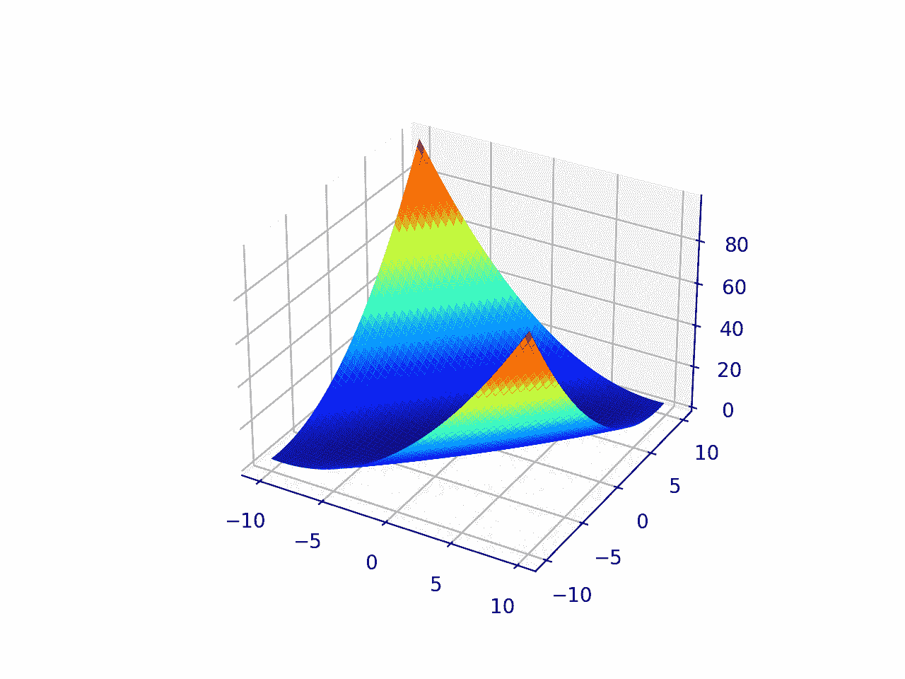
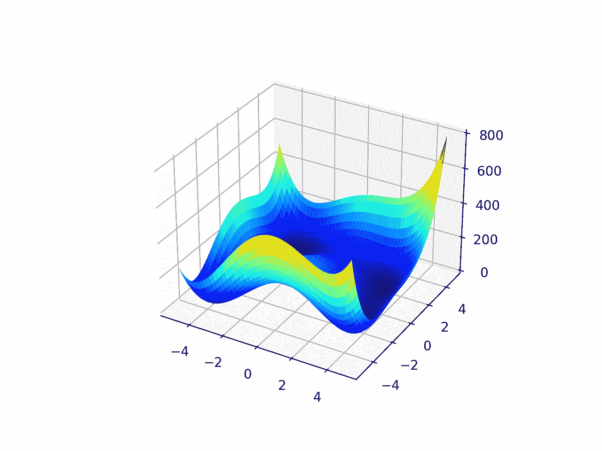
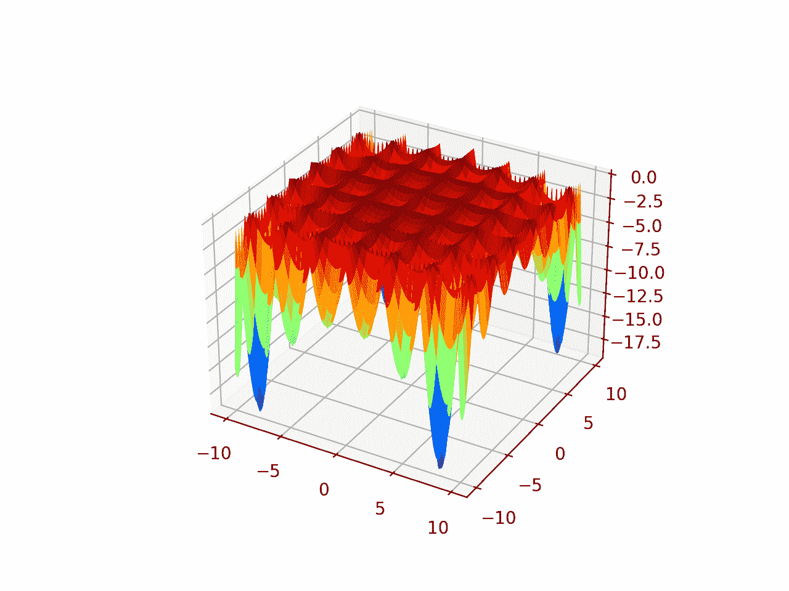

# 用于功能优化的二维(2D)测试函数

> 原文：<https://machinelearningmastery.com/2d-test-functions-for-function-optimization/>

最后更新于 2021 年 10 月 12 日

函数优化是一个研究领域，它寻求函数的输入，从而得到函数的最大或最小输出。

有大量的优化算法，在简单和易于可视化的测试函数上研究和开发优化算法的直觉是很重要的。

**二维函数**取两个输入值(x 和 y)，输出对输入的单次求值。它们是研究函数优化时使用的最简单的测试函数。二维函数的好处是，它们可以被可视化为等高线图或表面图，显示问题域的地形，域的最优值和样本用点标记。

在本教程中，您将发现学习函数优化时可以使用的标准二维函数。

**用我的新书[机器学习优化](https://machinelearningmastery.com/optimization-for-machine-learning/)启动你的项目**，包括*分步教程*和所有示例的 *Python 源代码*文件。

Let’s get started.

功能优化的二维(2D)测试功能
摄于[摄于](https://www.flickr.com/photos/dominart/28909893056/)，版权所有。

## 教程概述

二维函数是采用两个输入变量并计算目标值的函数。

我们可以把两个输入变量想象成一个图上的两个轴，x 和 y，函数的每个输入都是图上的一个点，函数的结果可以作为图上的高度。

这允许将功能概念化为表面，并且我们可以基于表面的结构来表征功能。例如，输入点的丘陵导致目标函数的相对结果较大，输入点的山谷导致目标函数的相对结果较小。

一个曲面可能有一个主要特征或全局最优，或者它可能有许多地方需要优化才能卡住。该表面可能是光滑的、有噪声的、凸的，以及我们在测试优化算法时可能关心的所有其他性质。

我们可以使用许多不同类型的简单二维测试函数。

然而，在函数优化领域中，有一些常用的标准测试函数。在测试不同的算法时，我们可能希望选择测试函数的特定属性。

我们将在本教程中探索少量简单的二维测试函数，并通过它们的属性用两个不同的组来组织它们；它们是:

1.  单峰函数
    1.  单峰函数 1
    2.  单峰函数 2
    3.  单峰函数 3
2.  多模态函数
    1.  多模式功能 1
    2.  多模态函数 2
    3.  多模态函数 3

每个函数都将使用 Python 代码呈现，目标函数的函数实现和函数的采样显示为表面图。

所有函数都表示为最小化函数，例如，找到导致函数最小(最小值)输出的输入。通过给所有输出加上负号，任何最大化函数都可以变成最小化函数。类似地，任何最小化函数都可以用同样的方法最大化。

这些功能不是我发明的；它们取自文献。有关参考资料，请参见进一步阅读部分。

然后，您可以选择并复制粘贴一个或多个要在自己的项目中使用的函数的代码，以研究或比较优化算法的行为。

## 单峰函数

单峰意味着函数有一个全局最优值。

一个[单峰函数](https://en.wikipedia.org/wiki/Unimodality)可以是凸的，也可以不是凸的。凸函数是这样一种函数，其中可以在域中的任意两点之间画一条线，并且这条线保持在域中。对于显示为等高线或曲面图的二维函数，这意味着该函数具有碗形，并且两者之间的线保持在碗的上方或内部。

让我们看几个单峰函数的例子。

### 单峰函数 1

该范围被限制在-5.0 和 5.0，一个全局最优值在[0.0，0.0]。

```py
# unimodal test function
from numpy import arange
from numpy import meshgrid
from matplotlib import pyplot
from mpl_toolkits.mplot3d import Axes3D

# objective function
def objective(x, y):
	return x**2.0 + y**2.0

# define range for input
r_min, r_max = -5.0, 5.0
# sample input range uniformly at 0.1 increments
xaxis = arange(r_min, r_max, 0.1)
yaxis = arange(r_min, r_max, 0.1)
# create a mesh from the axis
x, y = meshgrid(xaxis, yaxis)
# compute targets
results = objective(x, y)
# create a surface plot with the jet color scheme
figure = pyplot.figure()
axis = figure.gca(projection='3d')
axis.plot_surface(x, y, results, cmap='jet')
# show the plot
pyplot.show()
```

运行该示例会创建函数的曲面图。


单峰优化函数 1 的曲面图

### 单峰函数 2

该范围被限制在-10.0 和 10.0，一个全局最优值在[0.0，0.0]。

```py
# unimodal test function
from numpy import arange
from numpy import meshgrid
from matplotlib import pyplot
from mpl_toolkits.mplot3d import Axes3D

# objective function
def objective(x, y):
	return 0.26 * (x**2 + y**2) - 0.48 * x * y

# define range for input
r_min, r_max = -10.0, 10.0
# sample input range uniformly at 0.1 increments
xaxis = arange(r_min, r_max, 0.1)
yaxis = arange(r_min, r_max, 0.1)
# create a mesh from the axis
x, y = meshgrid(xaxis, yaxis)
# compute targets
results = objective(x, y)
# create a surface plot with the jet color scheme
figure = pyplot.figure()
axis = figure.gca(projection='3d')
axis.plot_surface(x, y, results, cmap='jet')
# show the plot
pyplot.show()
```

运行该示例会创建函数的曲面图。



单峰优化函数 2 的曲面图

### 单峰函数 3

该范围被限制在-10.0 和 10.0，并且在[pi，pi]处有一个全局最优值。这个函数被称为 Easom 的函数。

```py
# unimodal test function
from numpy import cos
from numpy import exp
from numpy import pi
from numpy import arange
from numpy import meshgrid
from matplotlib import pyplot
from mpl_toolkits.mplot3d import Axes3D

# objective function
def objective(x, y):
	return -cos(x) * cos(y) * exp(-((x - pi)**2 + (y - pi)**2))

# define range for input
r_min, r_max = -10, 10
# sample input range uniformly at 0.01 increments
xaxis = arange(r_min, r_max, 0.01)
yaxis = arange(r_min, r_max, 0.01)
# create a mesh from the axis
x, y = meshgrid(xaxis, yaxis)
# compute targets
results = objective(x, y)
# create a surface plot with the jet color scheme
figure = pyplot.figure()
axis = figure.gca(projection='3d')
axis.plot_surface(x, y, results, cmap='jet')
# show the plot
pyplot.show()
```

运行该示例会创建函数的曲面图。


单峰优化函数 3 的曲面图

## 多模态函数

A [多模态功能](https://en.wikipedia.org/wiki/Multimodal_distribution)是指具有一个以上“*模式*或 optima(如谷值)的功能。

多峰函数是非凸的。

可能有一个全局最优解和一个或多个局部或欺骗性最优解。或者，可能有多个全局最优值，即多个不同的输入导致相同的函数最小输出。

让我们看几个多模态函数的例子。

### 多模式功能 1

该范围被限制在-5.0 和 5.0，一个全局最优值在[0.0，0.0]。这个函数被称为[阿克利函数](https://en.wikipedia.org/wiki/Ackley_function)。

```py
# multimodal test function
from numpy import arange
from numpy import exp
from numpy import sqrt
from numpy import cos
from numpy import e
from numpy import pi
from numpy import meshgrid
from matplotlib import pyplot
from mpl_toolkits.mplot3d import Axes3D

# objective function
def objective(x, y):
	return -20.0 * exp(-0.2 * sqrt(0.5 * (x**2 + y**2))) - exp(0.5 * (cos(2 * pi * x) + cos(2 * pi * y))) + e + 20

# define range for input
r_min, r_max = -5.0, 5.0
# sample input range uniformly at 0.1 increments
xaxis = arange(r_min, r_max, 0.1)
yaxis = arange(r_min, r_max, 0.1)
# create a mesh from the axis
x, y = meshgrid(xaxis, yaxis)
# compute targets
results = objective(x, y)
# create a surface plot with the jet color scheme
figure = pyplot.figure()
axis = figure.gca(projection='3d')
axis.plot_surface(x, y, results, cmap='jet')
# show the plot
pyplot.show()
```

运行该示例会创建函数的曲面图。


多模态优化函数 1 的曲面图

### 多模态函数 2

该范围以-5.0 和 5.0 为界，并在[3.0，2.0]，[-2.805118，3.131312]，[-3.779310，-3.283186]，[3.584428，-1.848126]处作为四个全局最优。这个功能被称为 [Himmelblau 的功能](https://en.wikipedia.org/wiki/Himmelblau%27s_function)。

```py
# multimodal test function
from numpy import arange
from numpy import meshgrid
from matplotlib import pyplot
from mpl_toolkits.mplot3d import Axes3D

# objective function
def objective(x, y):
	return (x**2 + y - 11)**2 + (x + y**2 -7)**2

# define range for input
r_min, r_max = -5.0, 5.0
# sample input range uniformly at 0.1 increments
xaxis = arange(r_min, r_max, 0.1)
yaxis = arange(r_min, r_max, 0.1)
# create a mesh from the axis
x, y = meshgrid(xaxis, yaxis)
# compute targets
results = objective(x, y)
# create a surface plot with the jet color scheme
figure = pyplot.figure()
axis = figure.gca(projection='3d')
axis.plot_surface(x, y, results, cmap='jet')
# show the plot
pyplot.show()
```

运行该示例会创建函数的曲面图。



多模态优化函数 2 的曲面图

### 多模态函数 3

范围以-10.0 和 10.0 为界，函数为四个全局最优值，分别为[8.05502，9.66459]，[-8.05502，9.66459]，[8.05502，-9.66459]，[-8.05502，-9.66459]。这个函数被称为霍尔德表函数。

```py
# multimodal test function
from numpy import arange
from numpy import exp
from numpy import sqrt
from numpy import cos
from numpy import sin
from numpy import e
from numpy import pi
from numpy import absolute
from numpy import meshgrid
from matplotlib import pyplot
from mpl_toolkits.mplot3d import Axes3D

# objective function
def objective(x, y):
	return -absolute(sin(x) * cos(y) * exp(absolute(1 - (sqrt(x**2 + y**2)/pi))))

# define range for input
r_min, r_max = -10.0, 10.0
# sample input range uniformly at 0.1 increments
xaxis = arange(r_min, r_max, 0.1)
yaxis = arange(r_min, r_max, 0.1)
# create a mesh from the axis
x, y = meshgrid(xaxis, yaxis)
# compute targets
results = objective(x, y)
# create a surface plot with the jet color scheme
figure = pyplot.figure()
axis = figure.gca(projection='3d')
axis.plot_surface(x, y, results, cmap='jet')
# show the plot
pyplot.show()
```

运行该示例会创建函数的曲面图。



多模态优化函数 3 的曲面图

## 进一步阅读

如果您想更深入地了解这个主题，本节将提供更多资源。

### 文章

*   [测试函数进行优化，维基百科](https://en.wikipedia.org/wiki/Test_functions_for_optimization)。
*   [仿真实验虚拟库:测试函数和数据集](https://www.sfu.ca/~ssurjano/optimization.html)
*   [测试功能指数](http://infinity77.net/global_optimization/test_functions.html)
*   [GEA 工具箱–目标函数示例](http://www.geatbx.com/ver_3_3/fcnindex.html)

### 摘要

在本教程中，您发现了学习函数优化时可以使用的标准二维函数。

**您是否在使用上述任何功能？**
下面的评论让我知道是哪一个。

**你有什么问题吗？**
在下面的评论中提问，我会尽力回答。