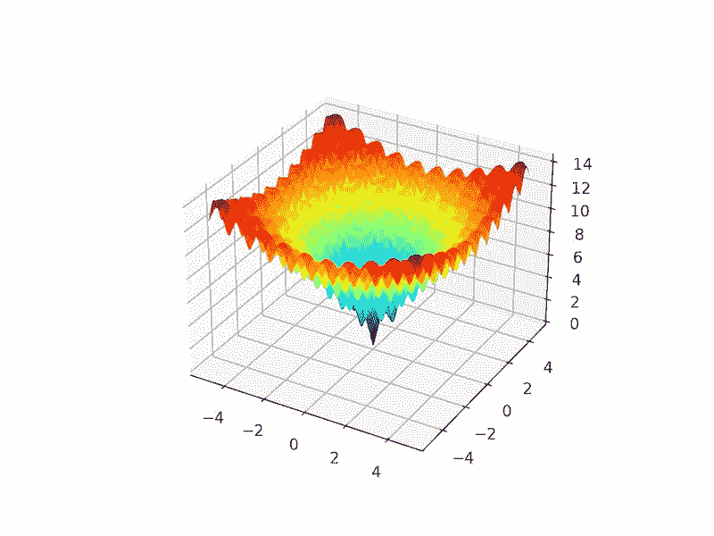
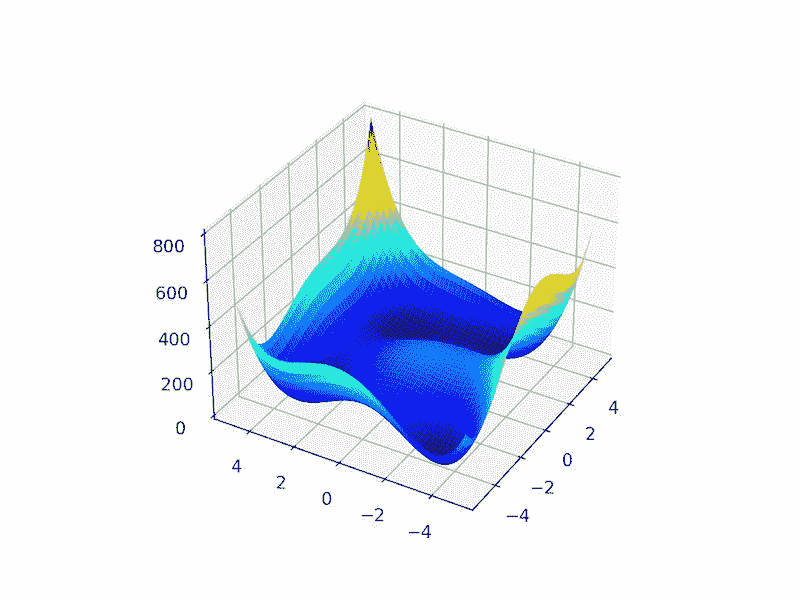

# Python 中的跳盆优化

> 原文：<https://machinelearningmastery.com/basin-hopping-optimization-in-python/>

最后更新于 2021 年 10 月 12 日

**跳盆**是全局优化算法。

它是为了解决化学物理中的问题而发展起来的，尽管它是一种适用于非线性多目标函数的有效算法。

在本教程中，您将发现盆地跳跃全局优化算法。

完成本教程后，您将知道:

*   流域跳跃优化是使用随机扰动来跳跃流域的全局优化，以及用于优化每个流域的局部搜索算法。
*   如何使用 python 中的跳盆优化算法 API？
*   用跳盆法解决多目标全局优化问题的实例。

**用我的新书[机器学习优化](https://machinelearningmastery.com/optimization-for-machine-learning/)启动你的项目**，包括*分步教程*和所有示例的 *Python 源代码*文件。

Let’s get started.

Python 中的跳盆优化
图片由[佩德罗·策克利](https://www.flickr.com/photos/pedrosz/33931224155/)提供，保留部分权利。

## 教程概述

本教程分为三个部分；它们是:

1.  流域跳跃优化
2.  盆地跳跃应用编程接口
3.  盆地跳跃示例
    1.  具有局部最优的多峰优化
    2.  多全局最优的多峰优化

## 流域跳跃优化

盆地跳跃是一种全局优化算法，开发用于[化学物理](https://en.wikipedia.org/wiki/Chemical_physics)领域。

> 跳盆(BH)或蒙特卡罗最小化(MCM)是迄今为止化学物理中最可靠的寻找原子团簇和大分子体系最低能量结构的算法。

——[盆跳偶跳](https://www.sciencedirect.com/science/article/abs/pii/S0009261404016082)，2004。

[局部优化](https://en.wikipedia.org/wiki/Local_search_(optimization))是指旨在定位单变量目标函数的最优值或在认为存在最优值的区域中操作的优化算法。而[全局优化](https://en.wikipedia.org/wiki/Global_optimization)算法旨在定位潜在的多个局部(非全局)最优中的单个全局最优。

大卫·威尔士和乔纳森·多伊在他们 1997 年的论文《通过盆地跳跃和包含多达 110 个原子的伦纳德-琼斯团簇的最低能量结构的全局优化》中描述了盆地跳跃

该算法包括两个循环步骤，一个是扰动好的候选解，另一个是对扰动解进行局部搜索。

> [盆地跳跃]将复杂的能源景观转化为盆地的集合，并通过跳跃来探索它们，这是通过随机蒙特卡罗移动和使用 Metropolis 标准的接受/拒绝来实现的。

——[盆跳偶跳](https://www.sciencedirect.com/science/article/abs/pii/S0009261404016082)，2004。

扰动允许搜索算法跳到搜索空间的新区域，并潜在地定位导致不同最优值的新盆地，例如技术名称中的“T0”盆地跳跃。

局部搜索允许算法穿过新盆地到达最优位置。

新的最优值可以保留作为新的随机扰动的基础，否则，它被丢弃。保留新解的决定由带有“*温度*”变量的随机决策函数控制，很像[模拟退火](https://en.wikipedia.org/wiki/Simulated_annealing)。

温度根据算法的迭代次数进行调整。这允许在运行初期温度较高时接受任意解决方案，并允许在后期温度较低时只接受质量较好的解决方案的更严格政策。

以这种方式，该算法很像具有不同(扰动的)起始点的迭代局部搜索。

该算法运行指定次数的迭代或函数求值，并且可以运行多次以增加全局最优解被定位或相对好的解被定位的信心。

既然我们已经从较高的层次上熟悉了基本的跳转算法，那么我们就来看看 Python 中用于流域跳转的 API。

## 盆地跳跃应用编程接口

通过[盆地跳跃()SciPy 功能](https://docs.scipy.org/doc/scipy/reference/generated/scipy.optimize.basinhopping.html)，在 Python 中可以进行盆地跳跃。

该函数采用要最小化的目标函数的名称和初始起点。

```py
...
# perform the basin hopping search
result = basinhopping(objective, pt)
```

另一个重要的超参数是通过“ *niter* ”参数运行搜索集的迭代次数，默认为 100。

这可以设置为数千次或更多次迭代。

```py
...
# perform the basin hopping search
result = basinhopping(objective, pt, niter=10000)
```

应用于候选解的扰动量可以通过“*步长*”来控制，该步长定义了在问题域边界的上下文中应用的最大变化量。默认情况下，该值设置为 0.5，但应该设置为域中合理的值，这可能允许搜索找到新的盆地。

例如，如果搜索空间的合理界限是-100 到 100，那么 5.0 或 10.0 单位的步长可能是合适的(例如，域的 2.5%或 5%)。

```py
...
# perform the basin hopping search
result = basinhopping(objective, pt, stepsize=10.0)
```

默认情况下，使用的本地搜索算法是“ *L-BFGS-B* ”算法。

可以通过将“ *minimizer_kwargs* ”参数设置为一个目录，该目录的关键字为“ *method* ，该值作为要使用的本地搜索算法的名称，如“*内尔德-米德*”可以使用 SciPy 库提供的任何本地搜索算法。

```py
...
# perform the basin hopping search
result = basinhopping(objective, pt, minimizer_kwargs={'method':'nelder-mead'})
```

搜索的结果是一个[优化结果对象](https://docs.scipy.org/doc/scipy/reference/generated/scipy.optimize.OptimizeResult.html)，在这里可以像字典一样访问属性。搜索成功与否可通过“*成功*或“*消息*键进入。

可通过“ *nfev* 访问功能评估的总数，可通过“ *x* 键访问为搜索找到的最佳输入。

既然我们已经熟悉了 Python 中的跳盆 API，那么让我们来看看一些工作过的例子。

## 盆地跳跃示例

在本节中，我们将看一些在多模态目标函数上使用流域跳跃算法的例子。

多模态目标函数是具有多个最优解的函数，例如一个全局最优解和多个局部最优解，或者具有相同目标函数输出的多个全局最优解。

我们将看看这两个函数的流域跳跃的例子。

### 具有局部最优的多峰优化

[阿克利函数](https://en.wikipedia.org/wiki/Ackley_function)是一个目标函数的例子，它有一个全局最优解和多个局部最优解，局部搜索可能会陷入其中。

因此，需要一种全局优化技术。它是一个二维目标函数，其全局最优值为[0，0]，计算结果为 0.0。

下面的示例实现了 Ackley，并创建了一个显示全局最优值和多个局部最优值的三维曲面图。

```py
# ackley multimodal function
from numpy import arange
from numpy import exp
from numpy import sqrt
from numpy import cos
from numpy import e
from numpy import pi
from numpy import meshgrid
from matplotlib import pyplot
from mpl_toolkits.mplot3d import Axes3D

# objective function
def objective(x, y):
	return -20.0 * exp(-0.2 * sqrt(0.5 * (x**2 + y**2))) - exp(0.5 * (cos(2 * pi * x) + cos(2 * pi * y))) + e + 20

# define range for input
r_min, r_max = -5.0, 5.0
# sample input range uniformly at 0.1 increments
xaxis = arange(r_min, r_max, 0.1)
yaxis = arange(r_min, r_max, 0.1)
# create a mesh from the axis
x, y = meshgrid(xaxis, yaxis)
# compute targets
results = objective(x, y)
# create a surface plot with the jet color scheme
figure = pyplot.figure()
axis = figure.gca(projection='3d')
axis.plot_surface(x, y, results, cmap='jet')
# show the plot
pyplot.show()
```

运行该示例会创建阿克利函数的曲面图，显示大量的局部最优值。



阿克利多峰函数的三维表面图

我们可以将跳盆算法应用于阿克利目标函数。

在这种情况下，我们将使用从-5 到 5 之间的输入域中抽取的随机点开始搜索。

```py
...
# define the starting point as a random sample from the domain
pt = r_min + rand(2) * (r_max - r_min)
```

我们将使用 0.5 的步长，200 次迭代，以及默认的局部搜索算法。这种配置是经过反复试验后选择的。

```py
...
# perform the basin hopping search
result = basinhopping(objective, pt, stepsize=0.5, niter=200)
```

搜索完成后，它将报告搜索状态、执行的迭代次数以及通过评估找到的最佳结果。

```py
...
# summarize the result
print('Status : %s' % result['message'])
print('Total Evaluations: %d' % result['nfev'])
# evaluate solution
solution = result['x']
evaluation = objective(solution)
print('Solution: f(%s) = %.5f' % (solution, evaluation))
```

将这些联系在一起，下面列出了将盆地跳跃应用于阿克利目标函数的完整示例。

```py
# basin hopping global optimization for the ackley multimodal objective function
from scipy.optimize import basinhopping
from numpy.random import rand
from numpy import exp
from numpy import sqrt
from numpy import cos
from numpy import e
from numpy import pi

# objective function
def objective(v):
	x, y = v
	return -20.0 * exp(-0.2 * sqrt(0.5 * (x**2 + y**2))) - exp(0.5 * (cos(2 * pi * x) + cos(2 * pi * y))) + e + 20

# define range for input
r_min, r_max = -5.0, 5.0
# define the starting point as a random sample from the domain
pt = r_min + rand(2) * (r_max - r_min)
# perform the basin hopping search
result = basinhopping(objective, pt, stepsize=0.5, niter=200)
# summarize the result
print('Status : %s' % result['message'])
print('Total Evaluations: %d' % result['nfev'])
# evaluate solution
solution = result['x']
evaluation = objective(solution)
print('Solution: f(%s) = %.5f' % (solution, evaluation))
```

运行该示例会执行优化，然后报告结果。

**注**:考虑到算法或评估程序的随机性，或数值精度的差异，您的[结果可能会有所不同](https://machinelearningmastery.com/different-results-each-time-in-machine-learning/)。考虑运行该示例几次，并比较平均结果。

在这种情况下，我们可以看到，该算法定位了输入非常接近零的最优值，并且目标函数评估实际上为零。

我们可以看到，算法的 200 次迭代导致了 86，020 次函数求值。

```py
Status: ['requested number of basinhopping iterations completed successfully']
Total Evaluations: 86020
Solution: f([ 5.29778873e-10 -2.29022817e-10]) = 0.00000
```

### 多全局最优的多峰优化

[Himmelblau](https://en.wikipedia.org/wiki/Himmelblau%27s_function) 函数是具有多个全局最优值的目标函数的一个例子。

具体来说，它有四个最优解，每个最优解都有相同的目标函数评估。它是一个二维目标函数，在[3.0，2.0]，[-2.805118，3.131312]，[-3.779310，-3.283186]，[3.584428，-1.848126]处具有全局最优值。

这意味着全局优化算法的每次运行都可能找到不同的全局最优解。

下面的例子实现了 Himmelblau，并创建了一个三维表面图，以给出目标函数的直觉。

```py
# himmelblau multimodal test function
from numpy import arange
from numpy import meshgrid
from matplotlib import pyplot
from mpl_toolkits.mplot3d import Axes3D

# objective function
def objective(x, y):
	return (x**2 + y - 11)**2 + (x + y**2 -7)**2

# define range for input
r_min, r_max = -5.0, 5.0
# sample input range uniformly at 0.1 increments
xaxis = arange(r_min, r_max, 0.1)
yaxis = arange(r_min, r_max, 0.1)
# create a mesh from the axis
x, y = meshgrid(xaxis, yaxis)
# compute targets
results = objective(x, y)
# create a surface plot with the jet color scheme
figure = pyplot.figure()
axis = figure.gca(projection='3d')
axis.plot_surface(x, y, results, cmap='jet')
# show the plot
pyplot.show()
```

运行该示例会创建 Himmelblau 函数的表面图，将四个全局最优值显示为深蓝色盆地。



Himmelblau 多模态函数的三维表面图

我们可以将流域跳跃算法应用于 Himmelblau 目标函数。

与前面的示例一样，我们将使用从输入域中抽取的一个介于-5 和 5 之间的随机点开始搜索。

我们将使用 0.5 的步长，200 次迭代，以及默认的局部搜索算法。在搜索结束时，我们将报告最佳位置 optima 的输入，

```py
# basin hopping global optimization for the himmelblau multimodal objective function
from scipy.optimize import basinhopping
from numpy.random import rand

# objective function
def objective(v):
	x, y = v
	return (x**2 + y - 11)**2 + (x + y**2 -7)**2

# define range for input
r_min, r_max = -5.0, 5.0
# define the starting point as a random sample from the domain
pt = r_min + rand(2) * (r_max - r_min)
# perform the basin hopping search
result = basinhopping(objective, pt, stepsize=0.5, niter=200)
# summarize the result
print('Status : %s' % result['message'])
print('Total Evaluations: %d' % result['nfev'])
# evaluate solution
solution = result['x']
evaluation = objective(solution)
print('Solution: f(%s) = %.5f' % (solution, evaluation))
```

运行该示例会执行优化，然后报告结果。

在这种情况下，我们可以看到算法在大约[3.0，2.0]处定位了一个 optima。

我们可以看到，算法的 200 次迭代导致了 7660 次函数求值。

```py
Status : ['requested number of basinhopping iterations completed successfully']
Total Evaluations: 7660
Solution: f([3\. 1.99999999]) = 0.00000
```

如果我们再次运行搜索，我们可能会发现一个不同的全局最优解。

例如，在下面，我们可以看到一个 optima 位于大约[-2.805118，3.131312]，不同于之前的运行。

```py
Status : ['requested number of basinhopping iterations completed successfully']
Total Evaluations: 7636
Solution: f([-2.80511809 3.13131252]) = 0.00000
```

## 进一步阅读

如果您想更深入地了解这个主题，本节将提供更多资源。

### 报纸

*   [包含多达 110 个原子的 Lennard-Jones 团簇的跳盆和最低能量结构的全局优化](https://pubs.acs.org/doi/abs/10.1021/jp970984n)，1997。
*   [盆跳偶跳](https://www.sciencedirect.com/science/article/abs/pii/S0009261404016082)，2004。

### 书

*   [能源景观:在团簇、生物分子和玻璃方面的应用](https://amzn.to/2HeRKLO)，2004。

### 蜜蜂

*   [scipy . optimize . basin hopping API](https://docs.scipy.org/doc/scipy/reference/generated/scipy.optimize.basinhopping.html)。
*   [scipy . optimize . optimizer result API](https://docs.scipy.org/doc/scipy/reference/generated/scipy.optimize.OptimizeResult.html)。

### 文章

*   [全局优化，维基百科](https://en.wikipedia.org/wiki/Global_optimization)。
*   [跳盆，维基百科](https://en.wikipedia.org/wiki/Basin-hopping)。

## 摘要

在本教程中，您发现了盆地跳跃全局优化算法。

具体来说，您了解到:

*   流域跳跃优化是使用随机扰动来跳跃流域的全局优化，以及用于优化每个流域的局部搜索算法。
*   如何使用 python 中的跳盆优化算法 API？
*   用跳盆法解决多目标全局优化问题的实例。

**你有什么问题吗？**
在下面的评论中提问，我会尽力回答。