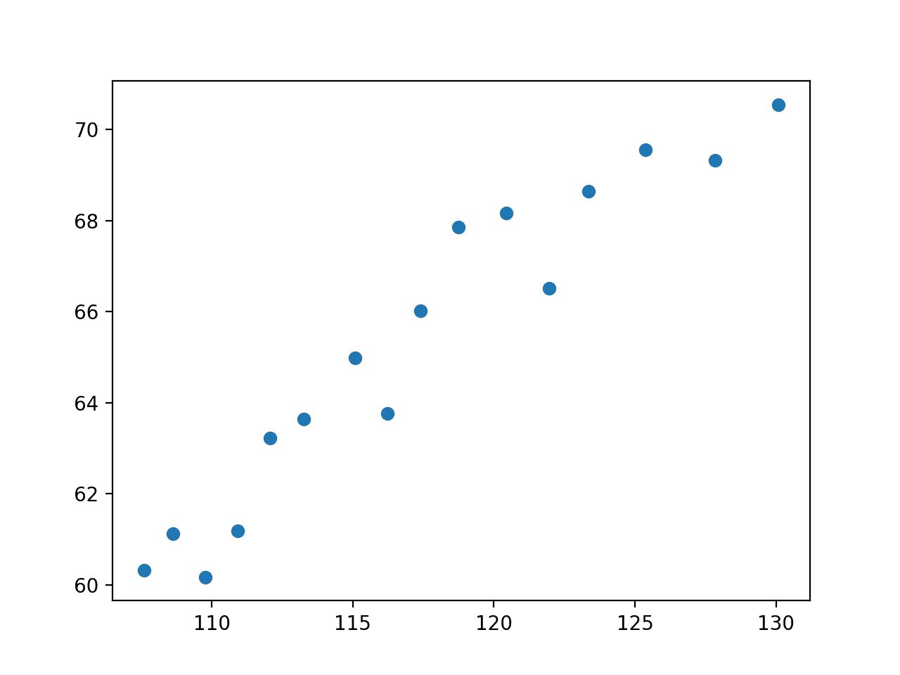
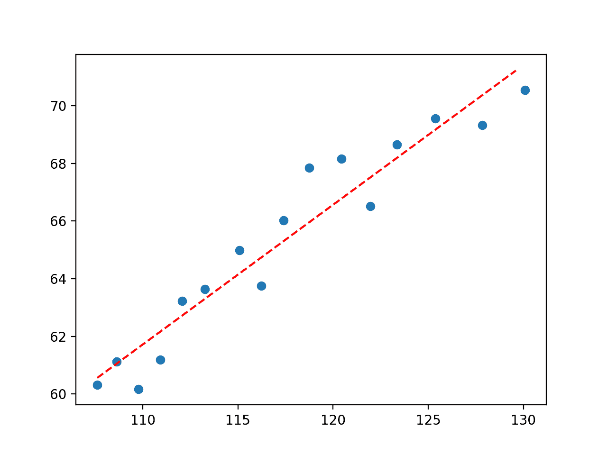
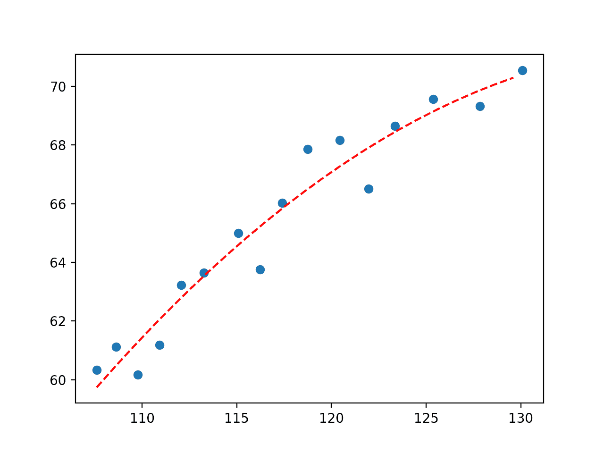
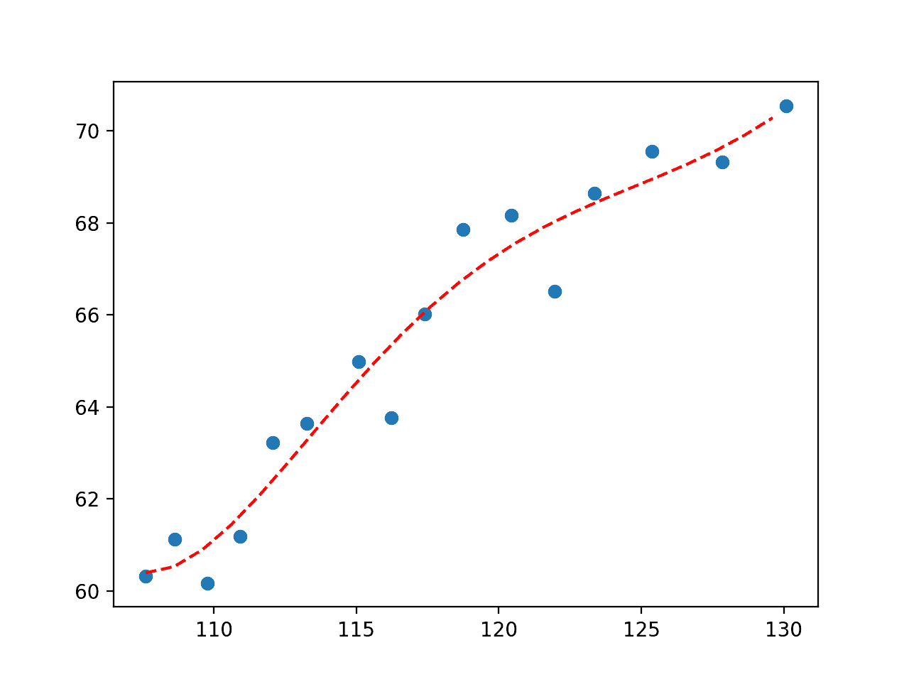
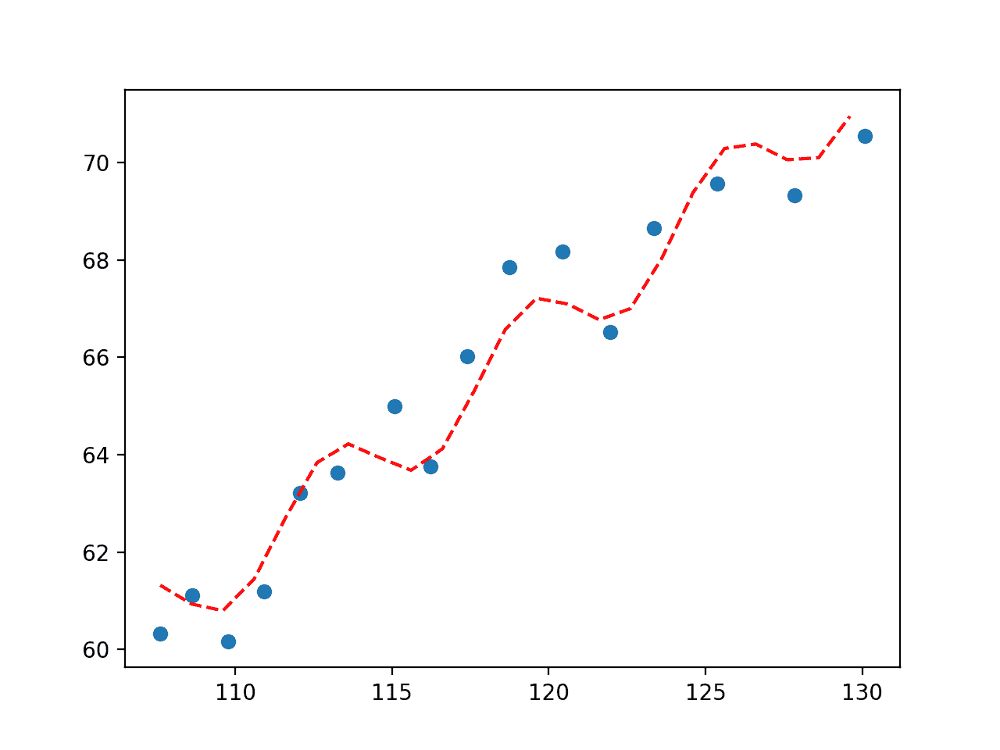

# 用 Python 进行曲线拟合

> 原文:[https://machinelearning master . com/用 python 进行曲线拟合/](https://machinelearningmastery.com/curve-fitting-with-python/)

最后更新于 2021 年 11 月 14 日

**曲线拟合**是一种优化类型，它为定义的函数找到一组最佳参数，最适合给定的一组观察值。

与监督学习不同，曲线拟合要求您定义将输入示例映射到输出的函数。

映射函数，也称为基函数，可以有任何你喜欢的形式，包括直线(线性回归)、曲线(多项式回归)等等。这提供了定义曲线形式的灵活性和控制，其中优化过程用于找到函数的特定最佳参数。

在本教程中，您将发现如何在 Python 中执行曲线拟合。

完成本教程后，您将知道:

*   曲线拟合包括找到将输入示例映射到输出的函数的最佳参数。
*   SciPy Python 库提供了一个将曲线拟合到数据集的应用编程接口。
*   如何在 SciPy 中使用曲线拟合将一系列不同的曲线拟合到一组观测值。

**用我的新书[机器学习优化](https://machinelearningmastery.com/optimization-for-machine-learning/)启动你的项目**，包括*分步教程*和所有示例的 *Python 源代码*文件。

Let’s get started.

用 Python 进行曲线拟合
图片由[盖尔·瓦洛夸](https://www.flickr.com/photos/gaelvaroquaux/30355149318/)提供，保留部分权利。

## 教程概述

本教程分为三个部分；它们是:

1.  曲线拟合
2.  曲线拟合
3.  曲线拟合实例

## 曲线拟合

[曲线拟合](https://en.wikipedia.org/wiki/Curve_fitting)是一个寻找最适合一组观测值的直线的优化问题。

最容易想到的是二维的曲线拟合，比如图。

考虑到我们已经收集了来自问题域的带有输入和输出的数据示例。

x 轴是自变量或函数的输入。y 轴是因变量或函数的输出。我们不知道将输入示例映射到输出的函数的形式，但我们怀疑可以用标准函数形式来近似该函数。

曲线拟合包括首先定义映射函数(也称为[基函数](https://en.wikipedia.org/wiki/Basis_function)或目标函数)的函数形式，然后搜索导致最小误差的函数参数。

误差的计算方法是使用来自域的观测值，将输入传递给我们的候选映射函数，并计算输出，然后将计算的输出与观测的输出进行比较。

一旦拟合，我们可以使用映射函数来插值或外推域中的新点。通常，通过映射函数运行一系列输入值来计算一系列输出，然后创建结果的线图，以显示输出如何随输入而变化，以及该线与观察点的拟合程度。

曲线拟合的关键是映射函数的形式。

输入和输出之间的直线可以定义如下:

*   y = a * x + b

其中 *y* 是计算的输出， *x* 是输入， *a* 和 *b* 是使用优化算法找到的映射函数的参数。

这被称为线性方程，因为它是输入的加权和。

在线性回归模型中，这些参数被称为系数；在神经网络中，它们被称为权重。

这个方程可以推广到任何数量的输入，这意味着曲线拟合的概念不限于二维(一个输入和一个输出)，而是可以有许多输入变量。

例如，两个输入变量的线映射函数可能如下所示:

*   y = a1 * x1 + a2 * x2 + b

等式不一定是直线。

我们可以通过添加指数在映射函数中添加曲线。例如，我们可以添加由另一个参数加权的输入的平方版本:

*   y = a * x + b * x^2 + c

这叫[多项式回归](https://en.wikipedia.org/wiki/Polynomial_regression)，平方项表示是二次多项式。

到目前为止，这种类型的线性方程可以通过最小二乘法拟合，并且可以解析计算。这意味着我们可以用一点线性代数找到参数的最优值。

我们可能还想在方程中添加其他数学函数，如正弦、余弦等。每个项都用一个参数加权，并与整体相加得到输出；例如:

*   y = a * sin(b * x) + c

将任意数学函数添加到我们的映射函数中通常意味着我们不能解析地计算参数，相反，我们需要使用迭代优化算法。

这被称为[非线性最小二乘](https://en.wikipedia.org/wiki/Non-linear_least_squares)，因为目标函数不再是凸的(它是非线性的)，也不那么容易求解。

现在我们已经熟悉了曲线拟合，让我们看看如何在 Python 中执行曲线拟合。

## 曲线拟合

我们可以用 Python 对数据集进行曲线拟合。

SciPy 开源库提供了 [curve_fit()函数](https://docs.scipy.org/doc/scipy/reference/generated/scipy.optimize.curve_fit.html)，通过非线性最小二乘法进行曲线拟合。

该函数采用相同的输入和输出数据作为参数，以及要使用的映射函数的名称。

映射函数必须以输入数据和一些参数为例。这些剩余的参数将是通过非线性最小二乘优化过程优化的系数或权重常数。

例如，我们可以从我们的域中加载一些观察值作为输入变量 *x* 和输出变量 *y* 。

```py
...
# load input variables from a file
x_values = ...
y_values = ...
```

接下来，我们需要设计一个映射函数来适应数据，并将其实现为一个接受输入和参数的 Python 函数。

它可能是一条直线，在这种情况下，它看起来如下:

```py
# objective function
def objective(x, a, b, c):
	return a * x + b
```

然后我们可以调用 [curve_fit()函数](https://docs.scipy.org/doc/scipy/reference/generated/scipy.optimize.curve_fit.html)来使用我们定义的函数拟合数据集的直线。

函数 *curve_fit()* 返回映射函数的最佳值，例如系数值。它还返回估计参数的协方差矩阵，但我们现在可以忽略它。

```py
...
# fit curve
popt, _ = curve_fit(objective, x_values, y_values)
```

一旦拟合，我们可以使用最佳参数和我们的映射函数*目标()*来计算任何任意输入的输出。

这可能包括我们已经从域中收集的示例的输出，它可能包括插值观察值的新值，或者它可能包括超出观察值限制的外推值。

```py
...
# define new input values
x_new = ...
# unpack optima parameters for the objective function
a, b, c = popt
# use optimal parameters to calculate new values
y_new = objective(x_new, a, b, c)
```

既然我们已经熟悉了曲线拟合应用编程接口的使用，让我们看一个工作示例。

## 曲线拟合实例

我们将开发一条曲线来拟合一些真实世界的经济数据。

在这个例子中，我们将使用所谓的“*龙利经济回归*”数据集；您可以在这里了解更多信息:

*   [朗利经济回归(longley.csv)](https://raw.githubusercontent.com/jbrownlee/Datasets/master/longley.csv)
*   [龙利经济回归描述(龙利. name)](https://github.com/jbrownlee/Datasets/blob/master/longley.names)

作为工作示例的一部分，我们将自动下载数据集。

有 7 个输入变量和 16 行数据，每行定义了 1947 年至 1962 年间一年的经济细节摘要。

在这个例子中，我们将探索在人口规模和每年的就业人数之间拟合一条线。

下面的示例从 URL 加载数据集，选择输入变量为“*人口*”，输出变量为“*”采用*，并创建散点图。

```py
# plot "Population" vs "Employed"
from pandas import read_csv
from matplotlib import pyplot
# load the dataset
url = 'https://raw.githubusercontent.com/jbrownlee/Datasets/master/longley.csv'
dataframe = read_csv(url, header=None)
data = dataframe.values
# choose the input and output variables
x, y = data[:, 4], data[:, -1]
# plot input vs output
pyplot.scatter(x, y)
pyplot.show()
```

运行该示例加载数据集、选择变量并创建散点图。

我们可以看到这两个变量之间是有关系的。具体来说，就是随着人口的增加，员工总数也在增加。

认为我们可以用一条线来拟合这个数据并不是没有道理的。



人口与总就业人口的散点图

首先，我们将尝试对此数据拟合一条直线，如下所示:

```py
# define the true objective function
def objective(x, a, b):
	return a * x + b
```

我们可以使用曲线拟合来找到“ *a* ”和“ *b* ”的最佳值，并总结找到的值:

```py
...
# curve fit
popt, _ = curve_fit(objective, x, y)
# summarize the parameter values
a, b = popt
print('y = %.5f * x + %.5f' % (a, b))
```

然后我们可以像以前一样创建散点图。

```py
...
# plot input vs output
pyplot.scatter(x, y)
```

在散点图的顶部，我们可以用优化的参数值为函数画一条线。

这包括首先定义在数据集中观察到的最小值和最大值之间的输入值序列(例如，在大约 120 和大约 130 之间)。

```py
...
# define a sequence of inputs between the smallest and largest known inputs
x_line = arange(min(x), max(x), 1)
```

然后，我们可以计算每个输入值的输出值。

```py
...
# calculate the output for the range
y_line = objective(x_line, a, b)
```

然后创建输入与输出的线图，以查看一条线:

```py
...
# create a line plot for the mapping function
pyplot.plot(x_line, y_line, '--', color='red')
```

将这些联系在一起，下面的例子使用曲线拟合来为我们的经济数据找到直线的参数。

```py
# fit a straight line to the economic data
from numpy import arange
from pandas import read_csv
from scipy.optimize import curve_fit
from matplotlib import pyplot

# define the true objective function
def objective(x, a, b):
	return a * x + b

# load the dataset
url = 'https://raw.githubusercontent.com/jbrownlee/Datasets/master/longley.csv'
dataframe = read_csv(url, header=None)
data = dataframe.values
# choose the input and output variables
x, y = data[:, 4], data[:, -1]
# curve fit
popt, _ = curve_fit(objective, x, y)
# summarize the parameter values
a, b = popt
print('y = %.5f * x + %.5f' % (a, b))
# plot input vs output
pyplot.scatter(x, y)
# define a sequence of inputs between the smallest and largest known inputs
x_line = arange(min(x), max(x), 1)
# calculate the output for the range
y_line = objective(x_line, a, b)
# create a line plot for the mapping function
pyplot.plot(x_line, y_line, '--', color='red')
pyplot.show()
```

运行该示例执行曲线拟合，并找到目标函数的最佳参数。

首先，报告参数值。

```py
y = 0.48488 * x + 8.38067
```

接下来，创建一个图，显示原始数据和适合数据的线。

我们可以看到，这是一个相当好的匹配。



符合经济数据集的直线图

到目前为止，这还不是很令人兴奋，因为我们可以通过在数据集上拟合线性回归模型来达到同样的效果。

让我们通过向目标函数添加平方项来尝试多项式回归模型。

```py
# define the true objective function
def objective(x, a, b, c):
	return a * x + b * x**2 + c
```

将这些联系在一起，完整的示例如下所示。

```py
# fit a second degree polynomial to the economic data
from numpy import arange
from pandas import read_csv
from scipy.optimize import curve_fit
from matplotlib import pyplot

# define the true objective function
def objective(x, a, b, c):
	return a * x + b * x**2 + c

# load the dataset
url = 'https://raw.githubusercontent.com/jbrownlee/Datasets/master/longley.csv'
dataframe = read_csv(url, header=None)
data = dataframe.values
# choose the input and output variables
x, y = data[:, 4], data[:, -1]
# curve fit
popt, _ = curve_fit(objective, x, y)
# summarize the parameter values
a, b, c = popt
print('y = %.5f * x + %.5f * x^2 + %.5f' % (a, b, c))
# plot input vs output
pyplot.scatter(x, y)
# define a sequence of inputs between the smallest and largest known inputs
x_line = arange(min(x), max(x), 1)
# calculate the output for the range
y_line = objective(x_line, a, b, c)
# create a line plot for the mapping function
pyplot.plot(x_line, y_line, '--', color='red')
pyplot.show()
```

首先报告最佳参数。

```py
y = 3.25443 * x + -0.01170 * x^2 + -155.02783
```

接下来，创建一个图，显示在来自域的观察值的上下文中的线。

我们可以看到，我们定义的二次多项式方程在视觉上比我们首先测试的直线更适合数据。



二次多项式拟合经济数据集的图

我们可以继续下去，在方程中加入更多的多项式项，以更好地拟合曲线。

例如，下面是一个五次多项式拟合数据的例子。

```py
# fit a fifth degree polynomial to the economic data
from numpy import arange
from pandas import read_csv
from scipy.optimize import curve_fit
from matplotlib import pyplot

# define the true objective function
def objective(x, a, b, c, d, e, f):
	return (a * x) + (b * x**2) + (c * x**3) + (d * x**4) + (e * x**5) + f

# load the dataset
url = 'https://raw.githubusercontent.com/jbrownlee/Datasets/master/longley.csv'
dataframe = read_csv(url, header=None)
data = dataframe.values
# choose the input and output variables
x, y = data[:, 4], data[:, -1]
# curve fit
popt, _ = curve_fit(objective, x, y)
# summarize the parameter values
a, b, c, d, e, f = popt
# plot input vs output
pyplot.scatter(x, y)
# define a sequence of inputs between the smallest and largest known inputs
x_line = arange(min(x), max(x), 1)
# calculate the output for the range
y_line = objective(x_line, a, b, c, d, e, f)
# create a line plot for the mapping function
pyplot.plot(x_line, y_line, '--', color='red')
pyplot.show()
```

运行该示例拟合曲线并绘制结果，再次捕捉到数据关系随时间变化的细微差别。



五次多项式拟合经济数据集的图

重要的是，我们不局限于线性回归或多项式回归。我们可以使用任意的基函数。

例如，也许我们想要一条摆动的线来捕捉观察中的短期运动。我们可以在方程中添加一条正弦曲线，并找到在方程中最好地整合该元素的参数。

例如，下面列出了使用正弦波和二次多项式的任意函数:

```py
# define the true objective function
def objective(x, a, b, c, d):
	return a * sin(b - x) + c * x**2 + d
```

下面列出了使用该基函数拟合曲线的完整示例。

```py
# fit a line to the economic data
from numpy import sin
from numpy import sqrt
from numpy import arange
from pandas import read_csv
from scipy.optimize import curve_fit
from matplotlib import pyplot

# define the true objective function
def objective(x, a, b, c, d):
	return a * sin(b - x) + c * x**2 + d

# load the dataset
url = 'https://raw.githubusercontent.com/jbrownlee/Datasets/master/longley.csv'
dataframe = read_csv(url, header=None)
data = dataframe.values
# choose the input and output variables
x, y = data[:, 4], data[:, -1]
# curve fit
popt, _ = curve_fit(objective, x, y)
# summarize the parameter values
a, b, c, d = popt
print(popt)
# plot input vs output
pyplot.scatter(x, y)
# define a sequence of inputs between the smallest and largest known inputs
x_line = arange(min(x), max(x), 1)
# calculate the output for the range
y_line = objective(x_line, a, b, c, d)
# create a line plot for the mapping function
pyplot.plot(x_line, y_line, '--', color='red')
pyplot.show()
```

运行该示例拟合一条曲线并绘制结果。

我们可以看到，添加一个正弦波会产生预期的效果，显示出一个具有上升趋势的周期性摆动，这为捕捉数据中的关系提供了另一种方式。



正弦波拟合经济数据集图

**如何选择最合适的？**

如果你想要最佳拟合，你可以将问题建模为一个回归监督学习问题，并测试一套算法，以便发现哪种算法最能减少误差。

在这种情况下，当您想要显式定义函数，然后发现最适合数据的函数参数时，曲线拟合是合适的。

## 进一步阅读

如果您想更深入地了解这个主题，本节将提供更多资源。

### 书

*   [模式识别与机器学习](https://amzn.to/36yvG9w)，2006。

### 蜜蜂

*   [scipy . optimize . curve _ fit API](https://docs.scipy.org/doc/scipy/reference/generated/scipy.optimize.curve_fit.html)。
*   num py . random . rann API。

### 文章

*   [曲线拟合，维基百科](https://en.wikipedia.org/wiki/Curve_fitting)。
*   [非线性最小二乘法，维基百科](https://en.wikipedia.org/wiki/Non-linear_least_squares)。
*   [多项式回归，维基百科](https://en.wikipedia.org/wiki/Polynomial_regression)。

## 摘要

在本教程中，您发现了如何在 Python 中执行曲线拟合。

具体来说，您了解到:

*   曲线拟合包括找到将输入示例映射到输出的函数的最佳参数。
*   与监督学习不同，曲线拟合要求您定义将输入示例映射到输出的函数。
*   如何在 SciPy 中使用曲线拟合将一系列不同的曲线拟合到一组观测值。

**你有什么问题吗？**
在下面的评论中提问，我会尽力回答。