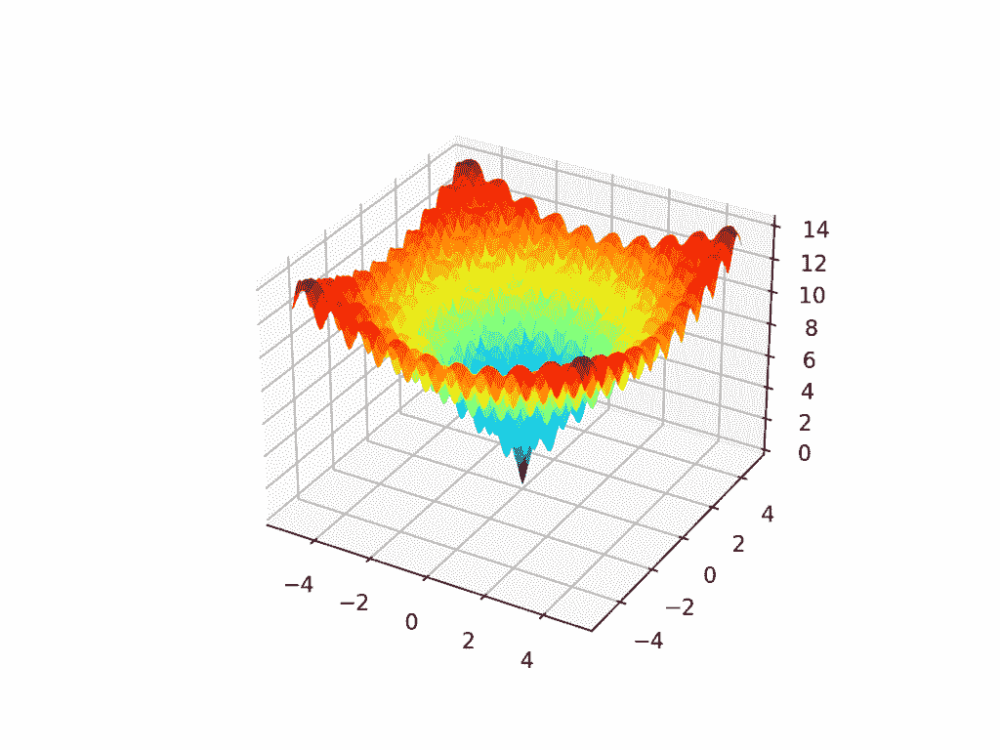

# 如何在 Python 中使用内尔德-米德优化

> 原文:[https://machinelearningmaster . com/how-to-use-nelder-mead-optimization-in-python/](https://machinelearningmastery.com/how-to-use-nelder-mead-optimization-in-python/)

最后更新于 2021 年 10 月 12 日

内尔德-米德优化算法是一种广泛用于不可微目标函数的方法。

因此，它通常被称为模式搜索算法，并被用作局部或全局搜索过程，挑战非线性和潜在的噪声和多峰函数优化问题。

在本教程中，您将发现内尔德-米德优化算法。

完成本教程后，您将知道:

*   奈尔德-米德优化算法是一种不使用函数梯度的模式搜索。
*   如何在 Python 中应用内尔德-米德算法进行函数优化。
*   如何解释内尔德-米德算法对噪声和多模态目标函数的结果。

**用我的新书[机器学习优化](https://machinelearningmastery.com/optimization-for-machine-learning/)启动你的项目**，包括*分步教程*和所有示例的 *Python 源代码*文件。

Let’s get started.

如何使用 Python 中的内尔德-米德优化
图片由[唐·格雷厄姆](https://www.flickr.com/photos/23155134@N06/47126513761/)提供，保留部分权利。

## 教程概述

本教程分为三个部分；它们是:

1.  内尔德-米德算法
2.  Python 中的内尔德-米德示例
3.  内尔德-米德挑战函数
    1.  噪声优化问题
    2.  多模态优化问题

## 内尔德-米德算法

[内尔德-米德](https://en.wikipedia.org/wiki/Nelder%E2%80%93Mead_method)是一种优化算法，以该技术的开发者[约翰内尔德](https://en.wikipedia.org/wiki/John_Nelder)和[罗杰米德](https://en.wikipedia.org/wiki/Roger_Mead)的名字命名。

该算法在他们 1965 年发表的题为“函数最小化的单纯形法”的论文中进行了描述，并已成为函数优化的标准和广泛使用的技术。

它适用于具有数字输入的一维或多维函数。

内尔德-米德是一种[模式搜索优化算法](https://en.wikipedia.org/wiki/Pattern_search_(optimization))，这意味着它不需要或使用函数梯度信息，适用于函数梯度未知或无法合理计算的优化问题。

它经常被用于多维非线性函数优化问题，尽管它会陷入局部最优。

> 内尔德-米德算法的实际性能通常是合理的，尽管已经观察到停滞出现在非最佳点。当检测到停滞时，可以使用重启。

—第 239 页，[数值优化](https://amzn.to/3lCRqX9)，2006。

必须为算法提供一个起点，该起点可以是另一个全局优化算法的终点，也可以是从域中提取的随机点。

考虑到算法可能会卡住，它可能会受益于具有不同起始点的多次重启。

> 奈尔德-米德单纯形法使用一个单纯形遍历空间以寻找最小值。

—第 105 页，[优化算法](https://amzn.to/31J3I8l)，2019。

该算法通过使用由 *n* + 1 个点(顶点)组成的形状结构(称为单纯形)工作，其中 *n* 是函数的输入维数。

例如，在一个可以绘制为曲面的二维问题上，形状结构将由三个表示为三角形的点组成。

> 奈尔德-米德方法使用一系列规则，这些规则规定了如何根据目标函数在其顶点的评估来更新单纯形。

—第 106 页，[优化算法](https://amzn.to/31J3I8l)，2019。

评估形状结构的点，并使用简单的规则来决定如何根据它们的相对评估来移动形状的点。这包括诸如目标函数表面上的单纯形形状的“*反射*”、“*扩展*、“*收缩*”和“*收缩*”的操作。

> 在内尔德-米德算法的单次迭代中，我们试图移除函数值最差的顶点，并用另一个具有更好值的点来替换它。通过沿连接最差顶点和其余顶点质心的直线反射、扩展或收缩单形来获得新点。如果我们不能以这种方式找到更好的点，我们只保留具有最佳函数值的顶点，并通过将所有其他顶点移向该值来收缩单纯形。

—第 238 页，[数值优化](https://amzn.to/3lCRqX9)，2006。

当点收敛到最优值时，当观察到评估之间的最小差异时，或者当执行最大数量的功能评估时，搜索停止。

现在，我们已经对算法的工作原理有了一个高层次的了解，让我们看看如何在实践中使用它。

## Python 中的内尔德-米德示例

内尔德-米德优化算法可以通过[最小化()函数](https://docs.scipy.org/doc/scipy/reference/optimize.minimize-neldermead.html)在 Python 中使用。

该函数要求将“*方法*”参数设置为“*内尔德-米德*”以使用内尔德-米德算法。它将目标函数最小化，并作为搜索的起始点。

```
...
# perform the search
result = minimize(objective, pt, method='nelder-mead')
```

结果是一个[optimizer result](https://docs.scipy.org/doc/scipy/reference/generated/scipy.optimize.OptimizeResult.html)对象，该对象包含可通过键访问的优化结果信息。

例如，“*成功*”布尔表示搜索是否成功完成，“*消息*提供关于搜索成功或失败的人类可读消息，“ *nfev* 键表示执行的功能评估的数量。

重要的是，“ *x* ”键指定输入值，如果搜索成功，该输入值指示通过搜索找到的最优值。

```
...
# summarize the result
print('Status : %s' % result['message'])
print('Total Evaluations: %d' % result['nfev'])
print('Solution: %s' % result['x'])
```

我们可以在一个表现良好的函数上演示内尔德-米德优化算法，以表明它可以快速有效地找到最优解，而无需使用函数的任何导数信息。

在这种情况下，我们将使用二维的 x^2 函数，在-5.0 到 5.0 的范围内定义，已知的 optima 为[0.0，0.0]。

我们可以在下面定义*目标()*函数。

```
# objective function
def objective(x):
	return x[0]**2.0 + x[1]**2.0
```

我们将使用定义的域中的随机点作为搜索的起点。

```
...
# define range for input
r_min, r_max = -5.0, 5.0
# define the starting point as a random sample from the domain
pt = r_min + rand(2) * (r_max - r_min)
```

然后可以执行搜索。我们使用通过“ *maxiter* 设置的默认最大函数求值次数，并设置为 N*200，其中 N 是输入变量的数量，在这种情况下为 2，例如 400 次求值。

```
...
# perform the search
result = minimize(objective, pt, method='nelder-mead')
```

搜索完成后，我们将报告用于查找 optima 的总功能评估和搜索成功消息，在这种情况下，我们希望是肯定的。

```
...
# summarize the result
print('Status : %s' % result['message'])
print('Total Evaluations: %d' % result['nfev'])
```

最后，我们将检索已定位 optima 的输入值，使用目标函数对其进行评估，并以人类可读的方式报告两者。

```
...
# evaluate solution
solution = result['x']
evaluation = objective(solution)
print('Solution: f(%s) = %.5f' % (solution, evaluation))
```

将这些联系在一起，下面列出了在简单凸目标函数上使用内尔德-米德优化算法的完整示例。

```
# nelder-mead optimization of a convex function
from scipy.optimize import minimize
from numpy.random import rand

# objective function
def objective(x):
	return x[0]**2.0 + x[1]**2.0

# define range for input
r_min, r_max = -5.0, 5.0
# define the starting point as a random sample from the domain
pt = r_min + rand(2) * (r_max - r_min)
# perform the search
result = minimize(objective, pt, method='nelder-mead')
# summarize the result
print('Status : %s' % result['message'])
print('Total Evaluations: %d' % result['nfev'])
# evaluate solution
solution = result['x']
evaluation = objective(solution)
print('Solution: f(%s) = %.5f' % (solution, evaluation))
```

运行该示例会执行优化，然后报告结果。

**注**:考虑到算法或评估程序的随机性，或数值精度的差异，您的[结果可能会有所不同](https://machinelearningmastery.com/different-results-each-time-in-machine-learning/)。考虑运行该示例几次，并比较平均结果。

在这种情况下，我们可以看到搜索是成功的，正如我们所料，并且在 88 次功能评估后完成。

我们可以看到 optima 位于输入非常接近[0，0]的位置，其评估为最小目标值 0.0。

```
Status: Optimization terminated successfully.
Total Evaluations: 88
Solution: f([ 2.25680716e-05 -3.87021351e-05]) = 0.00000
```

既然我们已经看到了如何成功地使用内尔德-米德优化算法，让我们看看一些它表现不太好的例子。

## 内尔德-米德挑战函数

内尔德-米德优化算法适用于一系列具有挑战性的非线性和不可微的目标函数。

然而，它会陷入多模态优化问题和噪声问题。

为了使这一点具体化，让我们看一个例子。

### 噪声优化问题

噪声目标函数是每次评估相同输入时给出不同答案的函数。

我们可以通过在评估之前向输入中添加小的高斯随机数来人为地制造一个有噪声的目标函数。

例如，我们可以定义一维版本的 x^2 函数，并使用 [randn()函数](https://numpy.org/doc/stable/reference/random/generated/numpy.random.randn.html)将均值为 0.0、标准差为 0.3 的小高斯随机数添加到输入中。

```
# objective function
def objective(x):
	return (x + randn(len(x))*0.3)**2.0
```

噪声将使函数难以优化算法，并且很可能无法在 x=0.0 时找到最优值。

下面列出了使用内尔德-米德优化噪声目标函数的完整示例。

```
# nelder-mead optimization of noisy one-dimensional convex function
from scipy.optimize import minimize
from numpy.random import rand
from numpy.random import randn

# objective function
def objective(x):
	return (x + randn(len(x))*0.3)**2.0

# define range for input
r_min, r_max = -5.0, 5.0
# define the starting point as a random sample from the domain
pt = r_min + rand(1) * (r_max - r_min)
# perform the search
result = minimize(objective, pt, method='nelder-mead')
# summarize the result
print('Status : %s' % result['message'])
print('Total Evaluations: %d' % result['nfev'])
# evaluate solution
solution = result['x']
evaluation = objective(solution)
print('Solution: f(%s) = %.5f' % (solution, evaluation))
```

运行该示例会执行优化，然后报告结果。

**注**:考虑到算法或评估程序的随机性，或数值精度的差异，您的[结果可能会有所不同](https://machinelearningmastery.com/different-results-each-time-in-machine-learning/)。考虑运行该示例几次，并比较平均结果。

在这种情况下，算法不收敛，而是使用最大函数求值次数，即 200。

```
Status: Maximum number of function evaluations has been exceeded.
Total Evaluations: 200
Solution: f([-0.6918238]) = 0.79431
```

该算法可能会在代码的某些运行中收敛，但会到达远离最优值的某个点。

### 多模态优化问题

许多非线性目标函数可能有多个最优解，称为多峰问题。

问题的结构可能是，它有多个具有等价函数求值的全局最优解，或者一个全局最优解和多个局部最优解，其中像内尔德-米德这样的算法可能会陷入局部最优解的搜索。

[阿克利函数](https://en.wikipedia.org/wiki/Ackley_function)就是后者的一个例子。它是一个二维目标函数，在[0，0]有一个全局最优值，但有许多局部最优值。

下面的示例实现了阿克利，并创建了一个显示全局最优值和多个局部最优值的三维图。

```
# ackley multimodal function
from numpy import arange
from numpy import exp
from numpy import sqrt
from numpy import cos
from numpy import e
from numpy import pi
from numpy import meshgrid
from matplotlib import pyplot
from mpl_toolkits.mplot3d import Axes3D

# objective function
def objective(x, y):
	return -20.0 * exp(-0.2 * sqrt(0.5 * (x**2 + y**2))) - exp(0.5 * (cos(2 * pi * x) + cos(2 * pi * y))) + e + 20

# define range for input
r_min, r_max = -5.0, 5.0
# sample input range uniformly at 0.1 increments
xaxis = arange(r_min, r_max, 0.1)
yaxis = arange(r_min, r_max, 0.1)
# create a mesh from the axis
x, y = meshgrid(xaxis, yaxis)
# compute targets
results = objective(x, y)
# create a surface plot with the jet color scheme
figure = pyplot.figure()
axis = figure.gca(projection='3d')
axis.plot_surface(x, y, results, cmap='jet')
# show the plot
pyplot.show()
```

运行该示例会创建阿克利函数的曲面图，显示大量的局部最优值。



阿克利多峰函数的三维表面图

我们希望奈尔德-米德函数在寻找全局最优解时，会陷入局部最优解。

最初，当单纯形很大时，算法可能会跳过许多局部最优解，但当它收缩时，就会卡住。

我们可以通过下面的例子来探讨这一点，这个例子演示了阿克利函数的内尔德-米德算法。

```
# nelder-mead for multimodal function optimization
from scipy.optimize import minimize
from numpy.random import rand
from numpy import exp
from numpy import sqrt
from numpy import cos
from numpy import e
from numpy import pi

# objective function
def objective(v):
	x, y = v
	return -20.0 * exp(-0.2 * sqrt(0.5 * (x**2 + y**2))) - exp(0.5 * (cos(2 * pi * x) + cos(2 * pi * y))) + e + 20

# define range for input
r_min, r_max = -5.0, 5.0
# define the starting point as a random sample from the domain
pt = r_min + rand(2) * (r_max - r_min)
# perform the search
result = minimize(objective, pt, method='nelder-mead')
# summarize the result
print('Status : %s' % result['message'])
print('Total Evaluations: %d' % result['nfev'])
# evaluate solution
solution = result['x']
evaluation = objective(solution)
print('Solution: f(%s) = %.5f' % (solution, evaluation))
```

运行该示例会执行优化，然后报告结果。

**注**:考虑到算法或评估程序的随机性，或数值精度的差异，您的[结果可能会有所不同](https://machinelearningmastery.com/different-results-each-time-in-machine-learning/)。考虑运行该示例几次，并比较平均结果。

在这种情况下，我们可以看到搜索成功完成，但没有找到全局最优解。它卡住了，找到了一个本地的 optima。

每次我们运行这个例子，给定不同的搜索随机起点，我们会找到不同的局部最优解。

```
Status: Optimization terminated successfully.
Total Evaluations: 62
Solution: f([-4.9831427 -3.98656015]) = 11.90126
```

## 进一步阅读

如果您想更深入地了解这个主题，本节将提供更多资源。

### 报纸

*   [函数最小化的单纯形法](https://academic.oup.com/comjnl/article-abstract/7/4/308/354237)，1965。

### 书

*   [优化算法](https://amzn.to/31J3I8l)，2019。
*   [数值优化](https://amzn.to/3lCRqX9)，2006。

### 蜜蜂

*   [内尔德-米德单纯形算法(方法= '内尔德-米德')](https://docs.scipy.org/doc/scipy/reference/tutorial/optimize.html#nelder-mead-simplex-algorithm-method-nelder-mead)
*   [scipy . optimize . minimum API](https://docs.scipy.org/doc/scipy/reference/optimize.minimize-neldermead.html)。
*   [scipy . optimize . optimizer result API](https://docs.scipy.org/doc/scipy/reference/generated/scipy.optimize.OptimizeResult.html)。
*   num py . random . rann API。

### 文章

*   [内尔德-米德法，维基百科](https://en.wikipedia.org/wiki/Nelder%E2%80%93Mead_method)。
*   [内尔德-米德算法，维基百科](http://www.scholarpedia.org/article/Nelder-Mead_algorithm)。

## 摘要

在本教程中，您发现了内尔德-米德优化算法。

具体来说，您了解到:

*   奈尔德-米德优化算法是一种不使用函数梯度的模式搜索。
*   如何在 Python 中应用内尔德-米德算法进行函数优化。
*   如何解释内尔德-米德算法对噪声和多模态目标函数的结果。

**你有什么问题吗？**
在下面的评论中提问，我会尽力回答。