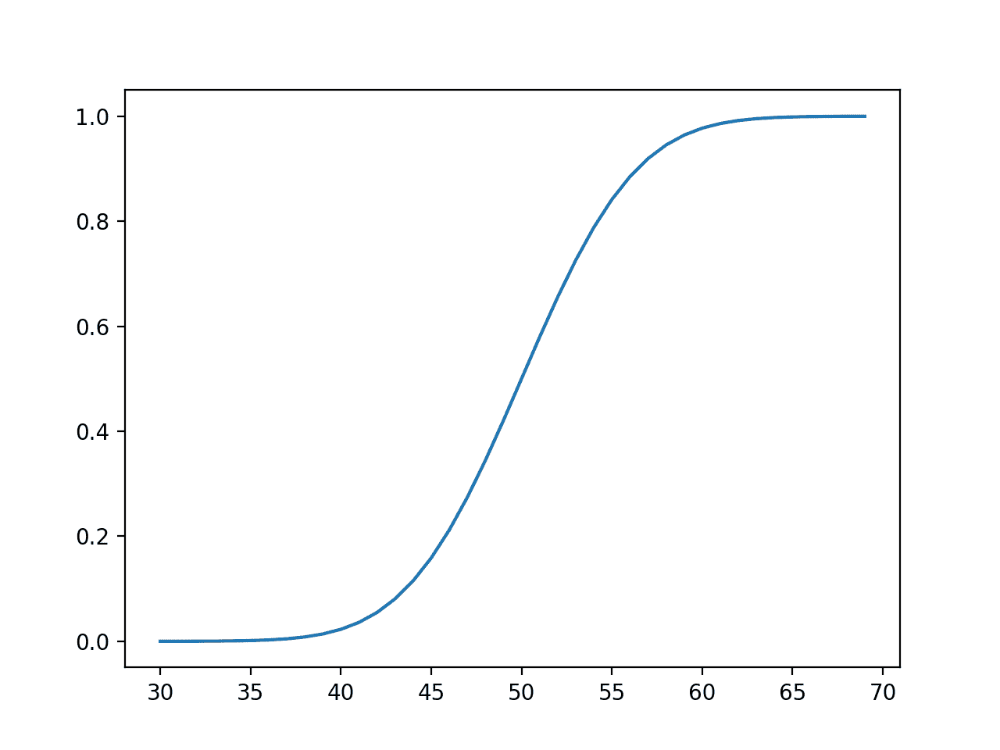
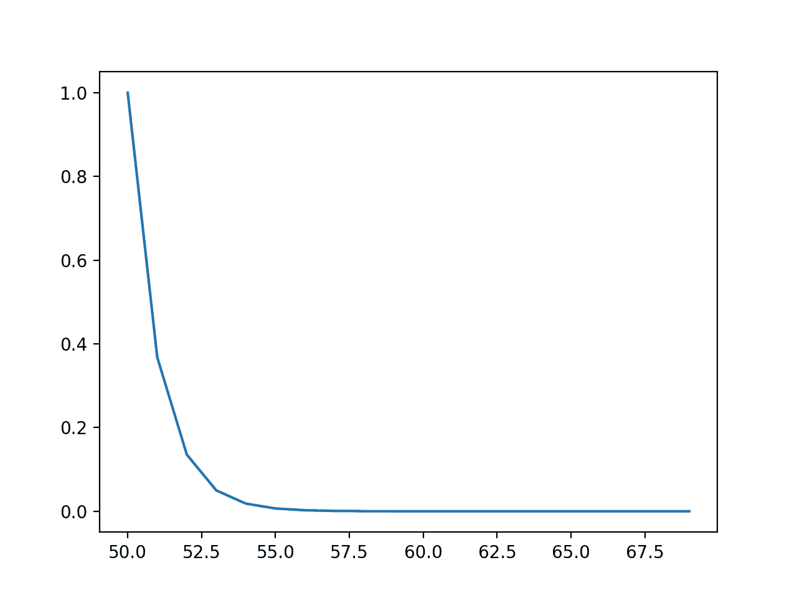
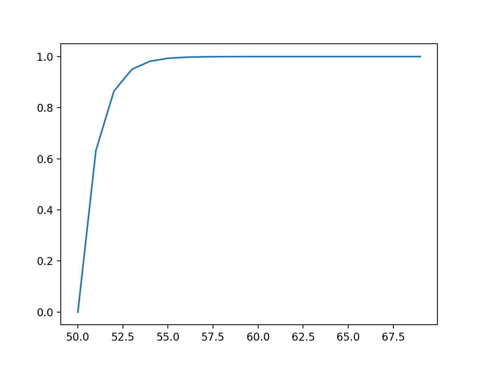
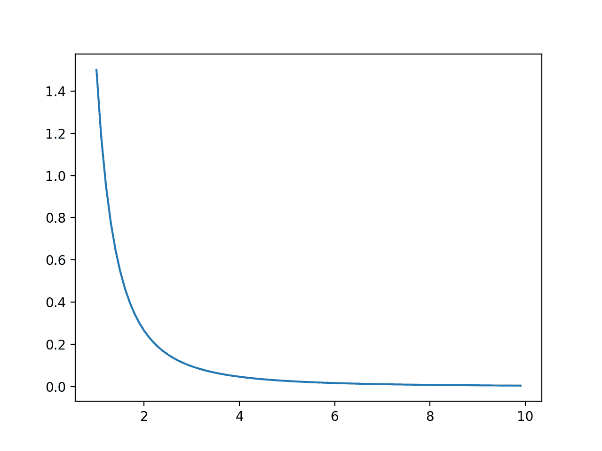
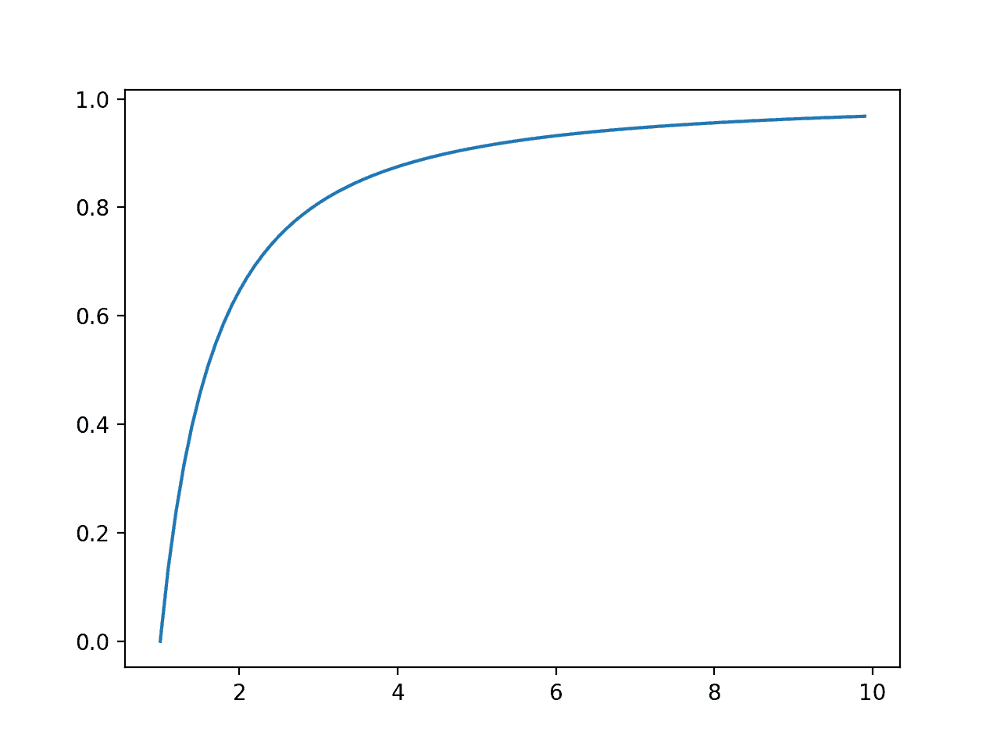

# 机器学习的连续概率分布

> 原文：<https://machinelearningmastery.com/continuous-probability-distributions-for-machine-learning/>

最后更新于 2019 年 9 月 25 日

连续随机变量的概率可以用连续概率分布来概括。

连续概率分布在机器学习中遇到，最显著的是在模型的数值输入和输出变量的分布中，以及在模型产生的误差的分布中。在许多机器学习模型执行的密度和参数估计中，通常也需要正态连续概率分布的知识。

因此，连续概率分布在应用机器学习中起着重要作用，从业者必须了解一些分布。

在本教程中，您将发现机器学习中使用的连续概率分布。

完成本教程后，您将知道:

*   连续随机变量的结果概率可以用连续概率分布来概括。
*   如何从常见的连续概率分布中参数化、定义和随机抽样。
*   如何为常见的连续概率分布创建概率密度和累积密度图？

**用我的新书[机器学习概率](https://machinelearningmastery.com/probability-for-machine-learning/)启动你的项目**，包括*分步教程*和所有示例的 *Python 源代码*文件。

我们开始吧。


机器学习的连续概率分布
图片由[土地管理局](https://www.flickr.com/photos/blmoregon/11343624354/)提供，保留部分权利。

## 教程概述

本教程分为四个部分；它们是:

1.  连续概率分布
2.  正态分布
3.  指数分布
4.  帕累托分布

## 连续概率分布

随机变量是由随机过程产生的量。

连续随机变量是具有真实数值的随机变量。

连续随机变量的每个数值结果都可以被赋予一个概率。

连续随机变量的事件与其概率之间的关系称为连续概率分布，由[概率密度函数](https://en.wikipedia.org/wiki/Probability_density_function)或简称为 PDF 来概括。

与离散随机变量不同，给定连续随机变量的概率不能直接指定；相反，它被计算为特定结果周围微小间隔的积分(曲线下的面积)。

事件等于或小于给定值的概率由累积分布函数(简称 CDF)定义。CDF 的倒数称为百分点函数，它将给出小于或等于概率的离散结果。

*   **PDF** :概率密度函数，返回给定连续结果的概率。
*   **CDF** :累积分布函数，返回小于等于给定结果的概率值。
*   **PPF** :百分点函数，返回小于等于给定概率的离散值。

有许多常见的连续概率分布。最常见的是正态概率分布。实际上，所有感兴趣的连续概率分布都属于所谓的[指数族分布](https://en.wikipedia.org/wiki/Exponential_family)，它们只是参数化概率分布(例如，基于参数值变化的分布)的集合。

连续概率分布在机器学习中扮演着重要的角色，从输入变量到模型的分布，模型产生的误差的分布，以及在模型本身中，当估计输入和输出之间的映射时。

在接下来的几节中，我们将仔细研究一些更常见的连续概率分布。

## 正态分布

[正态分布](https://en.wikipedia.org/wiki/Normal_distribution)也称为高斯分布(以[卡尔·弗里德里希·高斯](https://en.wikipedia.org/wiki/Carl_Friedrich_Gauss)命名)或钟形曲线分布。

该分布涵盖了来自许多不同问题领域的实值事件的概率，使其成为一个常见且众所周知的分布，因此得名“ *normal* ”具有正态分布的连续随机变量称为“*正态*或“*正态分布*”

具有正常分布事件的域的一些示例包括:

*   人的高度。
*   婴儿的体重。
*   考试表现。

可以使用两个参数来定义分布:

*   **均值** ( *亩*):期望值。
*   **方差** ( *sigma^2* ):均值的离差。

通常，使用标准偏差代替方差，方差计算为方差的平方根，例如归一化。

*   **标准差** ( *西格玛*):平均值与平均值的偏差。

均值为零、标准差为 1 的分布称为标准正态分布，为了便于解释和比较，通常会将数据简化或*标准化为*。

我们可以定义一个均值为 50、标准差为 5 的分布，并从这个分布中抽取随机数。我们可以使用[正常()NumPy 功能](https://docs.scipy.org/doc/numpy/reference/generated/numpy.random.normal.html)来实现。

下面的示例从这个分布中采样并打印了 10 个数字。

```py
# sample a normal distribution
from numpy.random import normal
# define the distribution
mu = 50
sigma = 5
n = 10
# generate the sample
sample = normal(mu, sigma, n)
print(sample)
```

运行该示例将打印从定义的正态分布中随机采样的 10 个数字。

```py
[48.71009029 49.36970461 45.58247748 51.96846616 46.05793544 40.3903483
 48.39189421 50.08693721 46.85896352 44.83757824]
```

可以通过绘制数据样本并检查熟悉的正常形状或使用统计测试来检查数据样本是否随机。如果一个随机变量的观测值样本是正态分布的，那么它们可以用平均值和方差来概括，直接对样本进行计算。

我们可以使用概率密度函数来计算每次观测的概率。这些值的图表会给我们一个钟形的提示。

我们可以使用[范数()SciPy 函数](https://docs.scipy.org/doc/scipy/reference/generated/scipy.stats.norm.html)定义一个正态分布，然后计算诸如矩、PDF、CDF 等属性。

下面的示例计算我们的分布中 30 到 70 之间的整数值的概率，并绘制结果，然后对累积概率进行同样的操作。

```py
# pdf and cdf for a normal distribution
from scipy.stats import norm
from matplotlib import pyplot
# define distribution parameters
mu = 50
sigma = 5
# create distribution
dist = norm(mu, sigma)
# plot pdf
values = [value for value in range(30, 70)]
probabilities = [dist.pdf(value) for value in values]
pyplot.plot(values, probabilities)
pyplot.show()
# plot cdf
cprobs = [dist.cdf(value) for value in values]
pyplot.plot(values, cprobs)
pyplot.show()
```

运行该示例首先计算[30，70]范围内整数的概率，并创建一个值和概率的线图。

该图显示了高斯或钟形，最高概率峰值在期望值或平均值 50 附近，概率约为 8%。


事件对概率或正态分布概率密度函数的线图

然后计算相同范围内观测值的累积概率，表明在平均值时，我们已经覆盖了约 50%的期望值，在与平均值有约 65 或 3 个标准偏差(50 + (3 * 5))后，我们已经非常接近 100%。



事件的线图与正态分布的累积概率或累积密度函数的关系

事实上，正态分布有一个启发式或经验法则，它通过平均值的标准偏差数来定义给定范围所覆盖的数据百分比。它被称为 [68-95-99.7 规则](https://en.wikipedia.org/wiki/68%E2%80%9395%E2%80%9399.7_rule)，它是由 1、2 和 3 个标准差定义的范围所覆盖的数据与平均值的近似百分比。

例如，在我们的分布中，平均值为 50，标准偏差为 5，我们预计 95%的数据将被平均值的 2 个标准偏差，或 50 –( 2 * 5)和 50 + (2 * 5)或 40 到 60 之间的值覆盖。

我们可以通过使用百分点函数计算精确值来证实这一点。

中间的 95%将由低端 2.5%和高端 97.5%的百分点函数值来定义，其中 97.5–2.5 表示中间的 95%。

下面列出了完整的示例。

```py
# calculate the values that define the middle 95%
from scipy.stats import norm
# define distribution parameters
mu = 50
sigma = 5
# create distribution
dist = norm(mu, sigma)
low_end = dist.ppf(0.025)
high_end = dist.ppf(0.975)
print('Middle 95%% between %.1f and %.1f' % (low_end, high_end))
```

运行这个例子给出了精确的结果，定义了中间 95%的预期结果，非常接近我们基于标准偏差的启发式算法 40 和 60。

```py
Middle 95% between 40.2 and 59.8
```

一个重要的相关分布是[对数正态概率分布](https://en.wikipedia.org/wiki/Log-normal_distribution)。

## 指数分布

[指数分布](https://en.wikipedia.org/wiki/Exponential_distribution)是一个连续的概率分布，其中少数结果最有可能，而所有其他结果的概率迅速下降。

对于离散随机变量，它是等效于[几何概率分布](https://en.wikipedia.org/wiki/Geometric_distribution)的连续随机变量。

具有指数分布事件的域的一些示例包括:

*   点击盖革计数器的间隔时间。
*   零件失效前的时间。
*   贷款违约前的时间。

可以使用一个参数定义分布:

*   **标度** ( *贝塔*):分布的均值和标准差。

有时，用参数*λ*或速率更正式地定义分布。*β*参数定义为*λ*参数的倒数(*β= 1/λ*

*   **速率**(*λ*)=分布的变化速率。

我们可以定义一个平均值为 50 的分布，并从这个分布中抽取随机数。我们可以使用[指数()NumPy 函数](https://docs.scipy.org/doc/numpy/reference/generated/numpy.random.exponential.html)来实现这一点。

下面的示例从这个分布中采样并打印了 10 个数字。

```py
# sample an exponential distribution
from numpy.random import exponential
# define the distribution
beta = 50
n = 10
# generate the sample
sample = exponential(beta, n)
print(sample)
```

运行该示例将打印从定义的分布中随机抽样的 10 个数字。

```py
[  3.32742946  39.10165624  41.86856606  85.0030387   28.18425491
  68.20434637 106.34826579  19.63637359  17.13805423  15.91135881]
```

我们可以使用[指数函数](https://docs.scipy.org/doc/scipy/reference/generated/scipy.stats.expon.html)定义指数分布，然后计算矩、PDF、CDF 等属性。

下面的例子定义了一个介于 50 和 70 之间的观测值范围，计算了每个观测值的概率和累积概率，并绘制了结果图。

```py
# pdf and cdf for an exponential distribution
from scipy.stats import expon
from matplotlib import pyplot
# define distribution parameter
beta = 50
# create distribution
dist = expon(beta)
# plot pdf
values = [value for value in range(50, 70)]
probabilities = [dist.pdf(value) for value in values]
pyplot.plot(values, probabilities)
pyplot.show()
# plot cdf
cprobs = [dist.cdf(value) for value in values]
pyplot.plot(values, cprobs)
pyplot.show()
```

运行该示例首先创建结果与概率的折线图，显示熟悉的指数概率分布形状。



事件对概率或指数分布的概率密度函数的线图

接下来，计算每个结果的累积概率，并绘制成线形图，表明在值 55 之后，将观察到几乎 100%的期望值。



事件与指数分布的累积概率或累积密度函数的线图

一个重要的相关分布是双指数分布，也称为[拉普拉斯分布](https://en.wikipedia.org/wiki/Laplace_distribution)。

## 帕累托分布

一个[帕累托分布](https://en.wikipedia.org/wiki/Pareto_distribution)以[维尔弗雷多·帕累托](https://en.wikipedia.org/wiki/Vilfredo_Pareto)命名，可以称为一个[幂律分布](https://en.wikipedia.org/wiki/Power_law)。

它还与[帕累托原则](https://en.wikipedia.org/wiki/Pareto_principle)(或 80/20 规则)有关，这是一种遵循帕累托分布的连续随机变量的启发式方法，其中 80%的事件被 20%的结果范围覆盖，例如，大多数事件仅来自连续变量范围的 20%。

帕累托原则只是一个特定帕累托分布的启发，特别是帕累托第二类分布，这可能是最有趣的，我们将集中讨论。

具有帕累托分布事件的域的一些示例包括:

*   一个国家家庭的收入。
*   图书销售总额。
*   运动队队员的得分。

可以使用一个参数定义分布:

*   **形状**(*α*):概率下降的陡度。

形状参数的值通常很小，例如在 1 和 3 之间，当 alpha 设置为 1.161 时给出了 Pareto 原则。

我们可以定义一个形状为 1.1 的分布，并从这个分布中抽取随机数。我们可以使用 [pareto() NumPy 函数](https://docs.scipy.org/doc/numpy/reference/generated/numpy.random.pareto.html)来实现。

```py
# sample a pareto distribution
from numpy.random import pareto
# define the distribution
alpha = 1.1
n = 10
# generate the sample
sample = pareto(alpha, n)
print(sample)
```

运行该示例将打印从定义的分布中随机抽样的 10 个数字。

```py
[0.5049704  0.0140647  2.13105224 3.10991217 2.87575892 1.06602639
 0.22776379 0.37405415 0.96618778 3.94789299]
```

我们可以使用 [pareto() SciPy 函数](https://docs.scipy.org/doc/scipy/reference/generated/scipy.stats.pareto.html)定义一个 Pareto 分布，然后计算属性，比如矩、PDF、CDF 等等。

下面的例子定义了一个介于 1 到 10 之间的观测值范围，计算了每个观测值的概率和累积概率，并绘制了结果图。

```py
# pdf and cdf for a pareto distribution
from scipy.stats import pareto
from matplotlib import pyplot
# define distribution parameter
alpha = 1.5
# create distribution
dist = pareto(alpha)
# plot pdf
values = [value/10.0 for value in range(10, 100)]
probabilities = [dist.pdf(value) for value in values]
pyplot.plot(values, probabilities)
pyplot.show()
# plot cdf
cprobs = [dist.cdf(value) for value in values]
pyplot.plot(values, cprobs)
pyplot.show()
```

运行该示例首先创建结果与概率的折线图，显示熟悉的帕累托概率分布形状。



事件与概率或帕累托分布的概率密度函数的线图

接下来，计算每个结果的累积概率，并绘制成线形图，显示上升幅度小于上一节中看到的指数分布。



事件的线图与累积概率或帕累托分布的累积密度函数

## 进一步阅读

如果您想更深入地了解这个主题，本节将提供更多资源。

### 书

*   第二章:概率分布，[模式识别与机器学习](https://amzn.to/2JwHE7I)，2006。
*   第 3.9 节:常见概率分布，[深度学习](https://amzn.to/2lnc3vL)，2016。
*   第 2.3 节:一些常见的离散分布，[机器学习:概率观点](https://amzn.to/2xKSTCP)，2012。

### 应用程序接口

*   [连续统计分布，SciPy](https://docs.scipy.org/doc/scipy/reference/tutorial/stats/continuous.html) 。
*   [随机抽样(numpy.random)，NumPy](https://docs.scipy.org/doc/numpy/reference/routines.random.html) 。

### 文章

*   [正态分布，维基百科](https://en.wikipedia.org/wiki/Normal_distribution)。
*   [68–95–99.7 规则，维基百科](https://en.wikipedia.org/wiki/68%E2%80%9395%E2%80%9399.7_rule)。
*   [指数分布，维基百科](https://en.wikipedia.org/wiki/Exponential_distribution)。
*   [帕累托分布，维基百科](https://en.wikipedia.org/wiki/Pareto_distribution)。

## 摘要

在本教程中，您发现了机器学习中使用的连续概率分布。

具体来说，您了解到:

*   连续随机变量的结果概率可以用连续概率分布来概括。
*   如何从常见的连续概率分布中参数化、定义和随机抽样。
*   如何为常见的连续概率分布创建概率密度和累积密度图？

你有什么问题吗？
在下面的评论中提问，我会尽力回答。