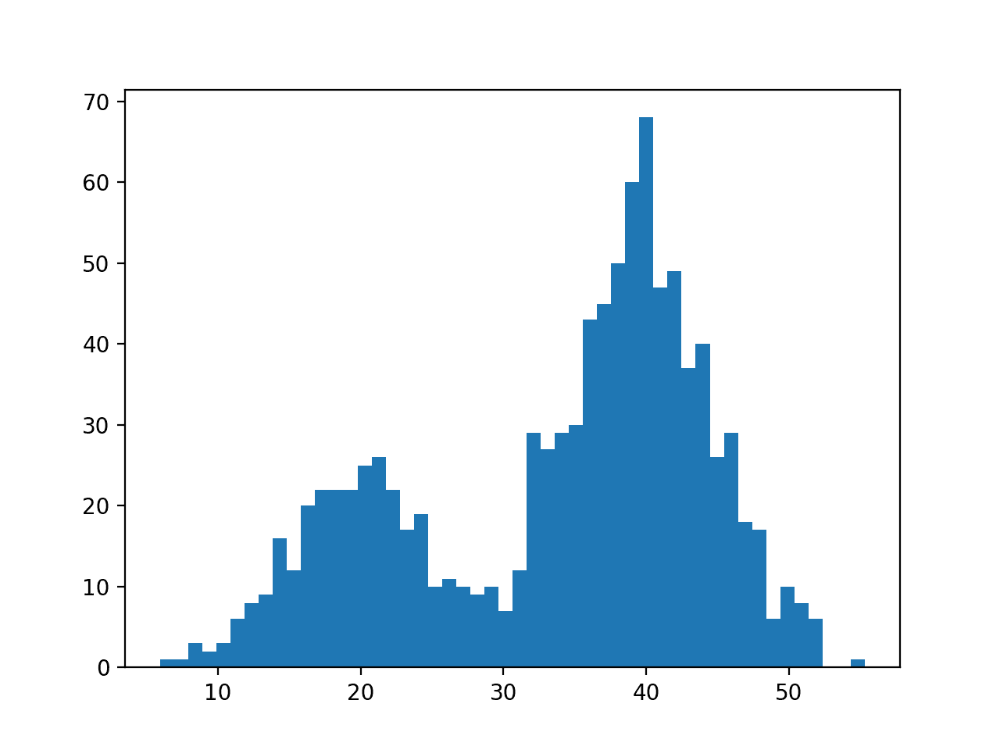
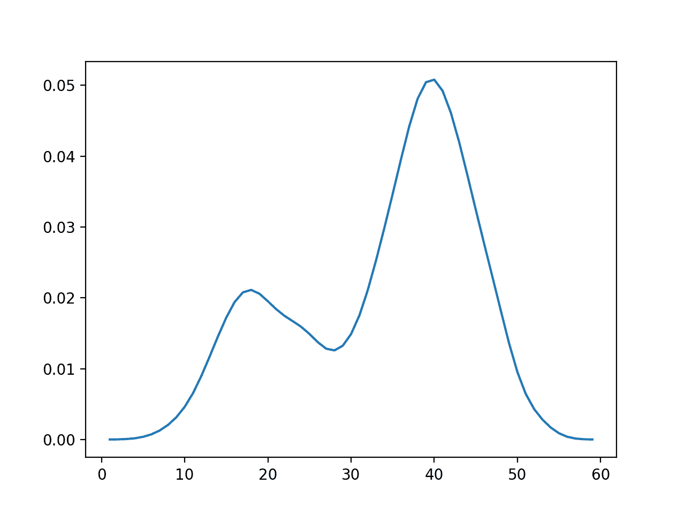
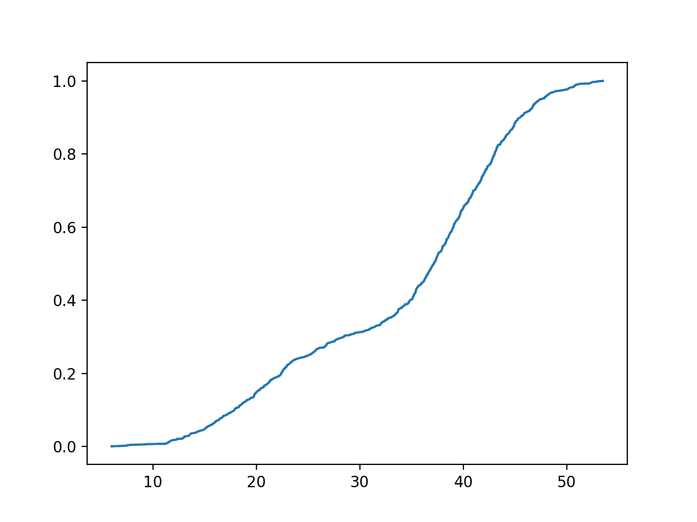

# 如何在 Python 中使用经验分布函数

> 原文：<https://machinelearningmastery.com/empirical-distribution-function-in-python/>

最后更新于 2020 年 8 月 28 日

经验分布函数为不符合标准概率分布的数据样本提供了一种建模和采样累积概率的方法。

因此，它有时被称为**经验累积分布函数**，简称 ECDF。

在本教程中，您将发现经验概率分布函数。

完成本教程后，您将知道:

*   有些数据样本无法使用标准分布进行汇总。
*   经验分布函数提供了一种对数据样本的累积概率建模的方法。
*   如何使用 statsmodels 库对经验累积分布函数进行建模和采样？

**用我的新书[机器学习概率](https://machinelearningmastery.com/probability-for-machine-learning/)启动你的项目**，包括*分步教程*和所有示例的 *Python 源代码*文件。

我们开始吧。


如何在 Python 中使用经验分布函数
图片由 [Gigi Griffis](https://flickr.com/photos/resonant/37487576646/) 提供，保留部分权利。

## 教程概述

本教程分为三个部分；它们是:

1.  经验分布函数
2.  双峰数据分布
3.  抽样经验分布

## 经验分布函数

通常，数据样本的观测值分布符合众所周知的[概率分布](https://machinelearningmastery.com/what-are-probability-distributions/)。

例如，人类的身高将符合正态(高斯)概率分布。

情况并非总是如此。有时，收集到的数据样本中的观测值不符合任何已知的概率分布，并且不能通过数据转换或分布函数的参数化而轻易地强制转换为现有的分布。

相反，必须使用经验概率分布。

我们可能需要对两种主要类型的概率分布函数进行采样；它们是:

*   概率密度函数。
*   累积分布函数。

PDF 返回观察一个值的预期概率。对于离散数据，PDF 被称为概率质量函数(PMF)。CDF 返回观察到小于或等于给定值的预期概率。

使用非参数密度估计方法，例如[核密度估计(KDE)](https://machinelearningmastery.com/probability-density-estimation/) ，可以拟合经验概率密度函数并将其用于数据采样。

经验累积分布函数被称为经验分布函数，简称 EDF。它也被称为经验累积分布函数，或 ECDF。

EDF 的计算方法是对数据样本中的所有唯一观测值进行排序，并计算每个观测值的累积概率，即小于或等于给定观测值的观测值数除以观测值总数。

如下所示:

*   EDF(x) =观测次数< = x / n

像其他累积分布函数一样，概率的总和将从 0.0 到 1.0，因为域中的观测值是从最小到最大枚举的。

为了使经验分布函数具体化，让我们看一个数据集明显不符合已知概率分布的例子。

## 双峰数据分布

我们可以定义一个明显不符合标准概率分布函数的数据集。

一个常见的例子是当数据具有两个峰值(双峰分布)或多个峰值(多峰分布)时。

我们可以通过组合来自两个不同正态分布的样本来构建双峰分布。具体而言，300 个实例的平均值为 20，标准偏差为 5(较小的峰值)，700 个实例的平均值为 40，标准偏差为 5(较大的峰值)。

平均值选择得很接近，以确保组合样本中的分布重叠。

下面列出了创建具有双峰概率分布的样本并绘制直方图的完整示例。

```py
# example of a bimodal data sample
from matplotlib import pyplot
from numpy.random import normal
from numpy import hstack
# generate a sample
sample1 = normal(loc=20, scale=5, size=300)
sample2 = normal(loc=40, scale=5, size=700)
sample = hstack((sample1, sample2))
# plot the histogram
pyplot.hist(sample, bins=50)
pyplot.show()
```

运行该示例会创建数据样本并绘制直方图。

**注**:考虑到算法或评估程序的随机性，或数值准确率的差异，您的[结果可能会有所不同](https://machinelearningmastery.com/different-results-each-time-in-machine-learning/)。考虑运行该示例几次，并比较平均结果。

平均值为 20 的样本比平均值为 40 的样本要少，这可以在直方图中看到，40 左右的样本密度大于 20 左右的样本密度。



双峰概率分布数据样本的直方图

根据设计，这种分布的数据不能很好地符合常见的概率分布。

下面是这个数据样本的概率密度函数(PDF)图。



双峰数据样本的经验概率密度函数

这是一个使用经验分布函数的好例子。

## 计算经验分布函数

经验分布函数可以适用于 Python 中的数据样本。

statmodels Python 库提供了 [ECDF 类](http://www.statsmodels.org/stable/generated/statsmodels.distributions.empirical_distribution.ECDF.html)，用于拟合经验累积分布函数和计算域中特定观测值的累积概率。

通过调用 ECDF()并传入原始数据样本来拟合分布。

```py
...
# fit a cdf
ecdf = ECDF(sample)
```

一旦拟合，就可以调用该函数来计算给定观测值的累积概率。

```py
...
# get cumulative probability for values
print('P(x<20): %.3f' % ecdf(20))
print('P(x<40): %.3f' % ecdf(40))
print('P(x<60): %.3f' % ecdf(60))
```

该类还提供了数据中独特观察的有序列表(T0)。x 属性)及其关联概率(*)。y* 属性)。我们可以访问这些属性并直接绘制 CDF 函数。

```py
...
# plot the cdf
pyplot.plot(ecdf.x, ecdf.y)
pyplot.show()
```

将这些联系在一起，下面是为双峰数据样本拟合经验分布函数的完整示例。

```py
# fit an empirical cdf to a bimodal dataset
from matplotlib import pyplot
from numpy.random import normal
from numpy import hstack
from statsmodels.distributions.empirical_distribution import ECDF
# generate a sample
sample1 = normal(loc=20, scale=5, size=300)
sample2 = normal(loc=40, scale=5, size=700)
sample = hstack((sample1, sample2))
# fit a cdf
ecdf = ECDF(sample)
# get cumulative probability for values
print('P(x<20): %.3f' % ecdf(20))
print('P(x<40): %.3f' % ecdf(40))
print('P(x<60): %.3f' % ecdf(60))
# plot the cdf
pyplot.plot(ecdf.x, ecdf.y)
pyplot.show()
```

**注**:考虑到算法或评估程序的随机性，或数值准确率的差异，您的[结果可能会有所不同](https://machinelearningmastery.com/different-results-each-time-in-machine-learning/)。考虑运行该示例几次，并比较平均结果。

运行该示例将经验 CDF 拟合到数据样本，然后打印观察三个值的累积概率。

```py
P(x<20): 0.149
P(x<40): 0.654
P(x<60): 1.000
```

然后计算整个域的累积概率，并显示为线图。

在这里，我们可以看到大多数累积分布函数的熟悉的 S 形曲线，这里双峰分布的两个峰值的平均值周围有凸起。



双峰数据样本的经验累积分布函数

## 进一步阅读

如果您想更深入地了解这个主题，本节将提供更多资源。

### 书

*   第 2.3.4 节经验分布，[机器学习:概率视角](https://amzn.to/2xKSTCP)，2012。
*   第 3.9.5 节狄拉克分布和经验分布，[深度学习](https://amzn.to/2lnc3vL)，2016。

### 应用程序接口

*   [stats models . distributions . experimental _ distribution。ECDF 原料药](http://www.statsmodels.org/stable/generated/statsmodels.distributions.empirical_distribution.ECDF.html)

### 文章

*   [经验分布函数，维基百科](https://en.wikipedia.org/wiki/Empirical_distribution_function)。
*   [累计分布函数，维基百科](https://en.wikipedia.org/wiki/Cumulative_distribution_function)。
*   [概率密度函数，维基百科](https://en.wikipedia.org/wiki/Probability_density_function)。
*   [核密度估计，维基百科](https://en.wikipedia.org/wiki/Kernel_density_estimation)。

## 摘要

在本教程中，您发现了经验概率分布函数。

具体来说，您了解到:

*   有些数据样本无法使用标准分布进行汇总。
*   经验分布函数提供了一种对数据样本的累积概率建模的方法。
*   如何使用 statsmodels 库对经验累积分布函数进行建模和采样？

你有什么问题吗？
在下面的评论中提问，我会尽力回答。