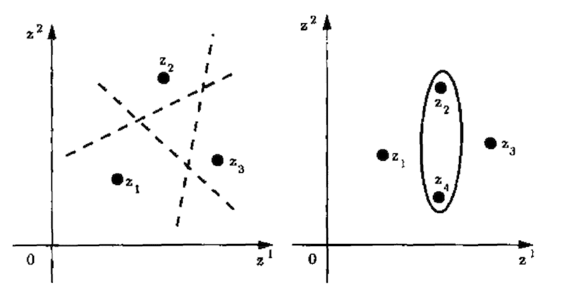

# 计算学习理论的温和介绍

> 原文:[https://machinelearning master . com/计算学习理论入门/](https://machinelearningmastery.com/introduction-to-computational-learning-theory/)

最后更新于 2020 年 9 月 7 日

计算学习理论，或称统计学习理论，是指量化学习任务和算法的数学框架。

这些都是机器学习的子领域，机器学习实践者不需要深入了解这些子领域就可以在广泛的问题上取得好的结果。然而，这是一个子领域，在这个领域中，对一些比较突出的方法有一个高层次的理解可以提供对从数据中学习的更广泛任务的洞察。

在这篇文章中，你会发现机器学习的计算学习理论的温和介绍。

看完这篇文章，你会知道:

*   计算学习理论使用形式化的方法来研究学习任务和学习算法。
*   PAC 学习提供了一种量化机器学习任务计算难度的方法。
*   VC Dimension 提供了一种量化机器学习算法计算能力的方法。

**用我的新书[机器学习概率](https://machinelearningmastery.com/probability-for-machine-learning/)启动你的项目**，包括*分步教程*和所有示例的 *Python 源代码*文件。

我们开始吧。

计算学习理论的温和介绍
图片由某人 10x 拍摄，版权所有。

## 教程概述

本教程分为三个部分；它们是:

1.  计算学习理论
2.  学习问题理论
3.  学习算法理论

## 计算学习理论

[计算学习理论](https://en.wikipedia.org/wiki/Computational_learning_theory)，简称*柯尔特*，是一个研究领域，关注的是应用于学习系统的形式数学方法的使用。

它寻求使用理论计算机科学的工具来量化学习问题。这包括描述学习特定任务的难度。

计算学习理论可以被认为是[统计学习理论](https://en.wikipedia.org/wiki/Statistical_learning_theory)或者简称为 *SLT* 的延伸或兄弟，其使用形式方法来量化学习算法。

*   **计算学习理论** ( *柯尔特*):学习任务的正式学习。
*   **统计学习理论** ( *SLT* ):学习算法的形式化研究。

这种学习任务与学习算法的划分是任意的，实际上，这两个领域之间有很多重叠。

> 人们可以通过考虑学习者的计算复杂性来扩展统计学习理论。这个领域被称为计算学习理论或 COLT。

—第 210 页，[机器学习:概率视角](https://amzn.to/2ULwqSL)，2012。

在现代用法中，它们可能被认为是同义词。

> …一个被称为计算学习理论的理论框架，有时也被称为统计学习理论。

—第 344 页，[模式识别与机器学习](https://amzn.to/31IIZ2W)，2006。

计算学习理论的焦点通常集中在监督学习任务上。真实问题和真实算法的形式分析非常具有挑战性。因此，通常通过关注二进制分类任务甚至简单的基于二进制规则的系统来降低分析的复杂性。因此，定理的实际应用对于解释真实问题和算法可能是有限的或具有挑战性的。

> 学习中主要的未回答的问题是:我们如何确定我们的学习算法已经产生了一个假设，该假设将预测以前看不见的输入的正确值？

—第 713 页，[人工智能:现代方法](https://amzn.to/2Sirt2p)，第 3 版，2009 年。

计算学习理论中探讨的问题可能包括:

*   我们如何知道一个模型对目标函数有很好的逼近？
*   应该用什么假设空间？
*   我们如何知道我们是否有本地或全球的好解决方案？
*   我们如何避免过度拟合？
*   需要多少数据示例？

作为一名机器学习实践者，了解计算学习理论和一些主要的研究领域可能是有用的。该领域为我们试图在数据上拟合模型时实现的目标提供了有用的基础，并且它可能提供对方法的洞察。

有许多子领域的研究，尽管也许计算学习理论中讨论最广泛的两个研究领域是:

*   PAC 学习。
*   风险投资维度。

简而言之，可以说 PAC 学习是机器学习问题的理论，VC 维是机器学习算法的理论。

作为一名从业者，你可能会遇到这些话题，对它们的内容有一个大概的了解是很有用的。让我们仔细看看每一个。

如果你想更深入地研究计算学习理论，我推荐这本书:

*   [计算学习理论导论](https://amzn.to/2ONs1Lz)，1994。

## 学习问题理论

**大概大概正确**学习，或者说 PAC 学习，指的是由[莱斯利·瓦里安](https://en.wikipedia.org/wiki/Leslie_Valiant)开发的理论机器学习框架。

PAC 学习寻求量化学习任务的难度，可能被认为是计算学习理论的首要子领域。

考虑到在监督学习中，我们试图从输入到输出逼近一个未知的潜在映射函数。我们不知道这个映射函数是什么样子的，但我们怀疑它存在，我们有函数产生的数据的例子。

PAC 学习关注的是找到与未知目标函数紧密匹配的假设(拟合模型)需要多少计算量。

有关在机器学习中使用“*假设”*来引用拟合模型的更多信息，请参见教程:

*   [什么是机器学习中的假设？](https://machinelearningmastery.com/what-is-a-hypothesis-in-machine-learning/)

这个想法是，一个坏的假设将被发现基于它对新数据的预测，例如基于它的泛化误差。

获得大多数或大量正确预测的假设，例如具有小的泛化误差，可能是目标函数的良好近似。

> 潜在的原理是，任何严重错误的假设，经过少量的例子，几乎肯定会被高概率“发现”，因为它会做出不正确的预测。因此，任何与足够大的训练样本集相一致的假设都不太可能是严重错误的:也就是说，它必须是近似正确的。

—第 714 页，[人工智能:现代方法](https://amzn.to/2Sirt2p)，第 3 版，2009 年。

这个概率语言给这个定理起了个名字:“*概率近似正确*”也就是说，假设试图“*近似*一个目标函数，并且如果它具有低的泛化误差，则“*可能是*”好。

PAC 学习算法是指返回 PAC 假设的算法。

使用形式方法，可以为监督学习任务指定最小泛化误差。然后，该定理可用于估计问题域中样本的预期数量，这将是确定假设是否是 PAC 所必需的。也就是说，它提供了一种方法来估计找到 PAC 假设所需的样本数量。

> PAC 框架的目标是理解一个数据集需要多大才能给出好的概括。它也给出了学习的计算成本的界限…

—第 344 页，[模式识别与机器学习](https://amzn.to/31IIZ2W)，2006。

另外，假设空间(机器学习算法)在 PAC 框架下是有效的，如果算法能够在多项式时间内找到 PAC 假设(拟合模型)。

> 如果有一个多项式时间算法可以识别一个被打包的函数，那么假设空间被认为是有效可打包的。

—第 210 页，[机器学习:概率视角](https://amzn.to/2ULwqSL)，2012。

有关 PAC 学习的更多信息，请参考主题为:

*   [大概大致正确:自然界在复杂世界中学习和繁荣的算法](https://amzn.to/31MOgqk)，2013。

## 学习算法理论

Vapnik–chervonnekis 理论，简称 VC 理论，是指由 [Vladimir Vapnik](https://en.wikipedia.org/wiki/Vladimir_Vapnik) 和[Alexey chervonnekis](https://en.wikipedia.org/wiki/Alexey_Chervonenkis)开发的理论机器学习框架。

风险投资理论学习试图量化学习算法的能力，并可能被认为是统计学习理论的首要子领域。

风险投资理论由许多要素组成，最显著的是[风险投资维度](https://en.wikipedia.org/wiki/Vapnik%E2%80%93Chervonenkis_dimension)。

VC 维度量化了假设空间的复杂性，例如，给定表示和学习算法，可以拟合的模型。

考虑假设空间(可能适合的模型空间)复杂性的一种方式是基于它包含的不同假设的数量，以及可能如何导航该空间。风险投资维度是一种聪明的方法，它测量目标问题中可以被空间中的假设区分的例子的数量。

> VC 维度通过使用 h 可以完全区分的来自 X 的不同实例的数量来衡量假设空间[…]的复杂性

—第 214 页，[机器学习](https://amzn.to/38llqzw)，1997。

VC 维度估计特定数据集的分类机器学习算法的能力或容量(示例的数量和维度)。

从形式上来说，VC 维是训练数据集中假设空间能够“粉碎”的最大数量的例子

> 在实例空间 X 上定义的假设空间 H 的 Vapnik-Chervonenkis 维数 VC(H)是被 H 粉碎的 X 的最大有限子集的大小

—第 215 页，[机器学习](https://amzn.to/38llqzw)，1997。

粉碎或[粉碎集](https://en.wikipedia.org/wiki/Shattered_set)，在数据集的情况下，意味着可以使用空间中的假设来选择特征空间中的点或将其彼此分离，使得分离组中的示例的标签是正确的(无论它们碰巧是什么)。

一组点能否被算法粉碎，取决于假设空间和点数。

例如，一条线(假设空间)可以用来粉碎三个点，但不能粉碎四个点。

类别标签为 0 或 1 的二维平面上三个点的任何位置都可以被标签用线正确地“*”分割，例如粉碎。但是，平面上有四个点的位置带有二进制类标签，这些标签不能被一条线正确分割，例如不能被粉碎。相反，必须使用另一种“算法”，例如椭圆。*

 *下图说明了这一点。

打破 3 点的线假设和打破 4 点的椭圆的例子
摘自第 81 页[统计学习理论的本质](https://amzn.to/2SmxgUN)，1999。

因此，机器学习算法的 VC 维是数据集中算法的特定配置(超参数)或特定拟合模型可以粉碎的最大数据点数量。

在所有情况下预测相同值的分类器的 VC 维度为 0，没有点数。较大的 VC 维数表明算法非常灵活，尽管这种灵活性可能会以过度拟合的额外风险为代价。

风险投资维度被用作 PAC 学习框架的一部分。

> PAC 学习中的一个关键量是 Vapnik-chervonnenkis 维度，或 VC 维度，它提供了函数空间复杂性的度量，并允许 PAC 框架扩展到包含无限个函数的空间。

—第 344 页，[模式识别与机器学习](https://amzn.to/31IIZ2W)，2006。

有关主成分分析学习的更多信息，请参考主题为:

*   [统计学习理论的本质](https://amzn.to/2SmxgUN)，1999。

## 进一步阅读

如果您想更深入地了解这个主题，本节将提供更多资源。

### 书

*   [大概大致正确:自然界在复杂世界中学习和繁荣的算法](https://amzn.to/31MOgqk)，2013。
*   [人工智能:现代方法，第 3 版](https://amzn.to/2Sirt2p)，2009。
*   [计算学习理论导论](https://amzn.to/2ONs1Lz)，1994。
*   [机器学习:概率视角](https://amzn.to/2ULwqSL)，2012。
*   [统计学习理论的本质](https://amzn.to/2SmxgUN)，1999。
*   [模式识别与机器学习](https://amzn.to/31IIZ2W)，2006。
*   [机器学习](https://amzn.to/38llqzw)，1997。

### 文章

*   [统计学习理论，维基百科](https://en.wikipedia.org/wiki/Statistical_learning_theory)。
*   [计算学习理论，维基百科](https://en.wikipedia.org/wiki/Computational_learning_theory)。
*   [大概大致正确的学习，维基百科](https://en.wikipedia.org/wiki/Probably_approximately_correct_learning)。
*   [vapnik-chervo nkis 理论，维基百科](https://en.wikipedia.org/wiki/Vapnik%E2%80%93Chervonenkis_theory)。
*   [vapnik–chervo nki 维度，维基百科](https://en.wikipedia.org/wiki/Vapnik%E2%80%93Chervonenkis_dimension)。

## 摘要

在这篇文章中，你发现了机器学习的计算学习理论的温和介绍。

具体来说，您了解到:

*   计算学习理论使用形式化的方法来研究学习任务和学习算法。
*   PAC 学习提供了一种量化机器学习任务计算难度的方法。
*   VC Dimension 提供了一种量化机器学习算法计算能力的方法。

**你有什么问题吗？**
在下面的评论中提问，我会尽力回答。*