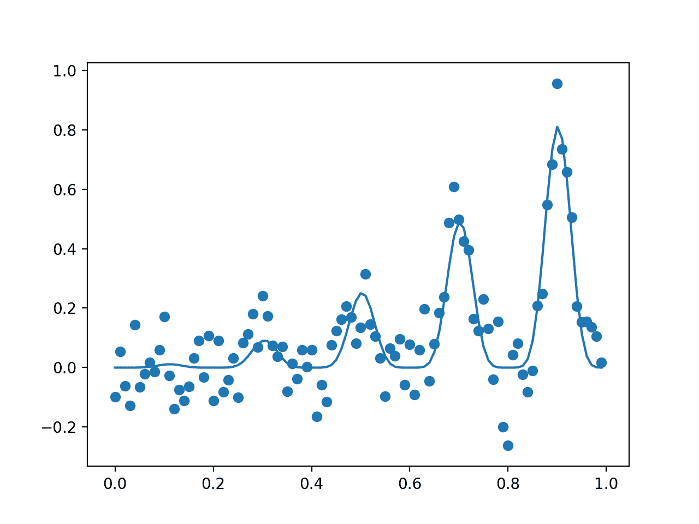
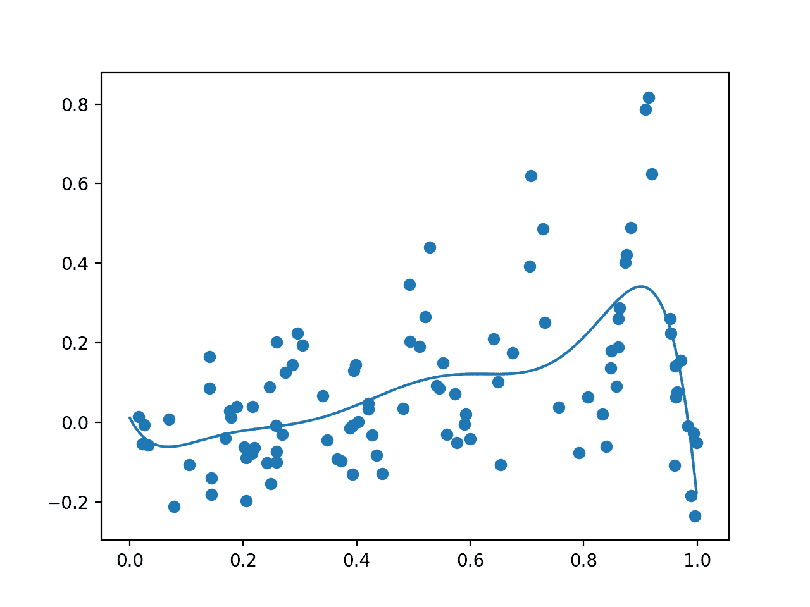
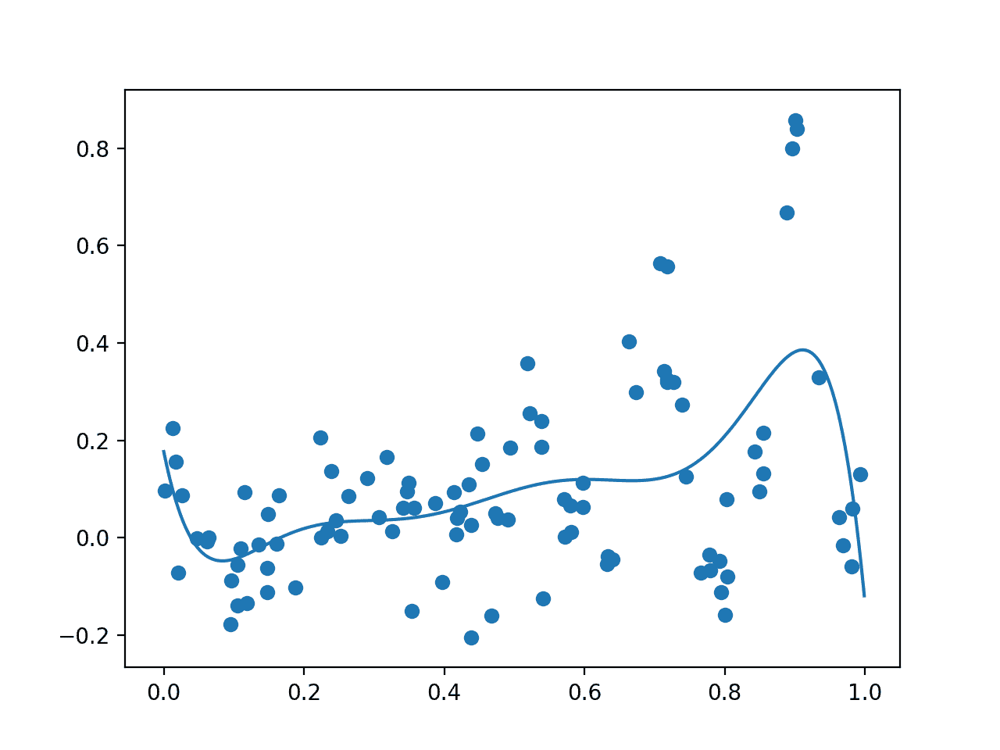
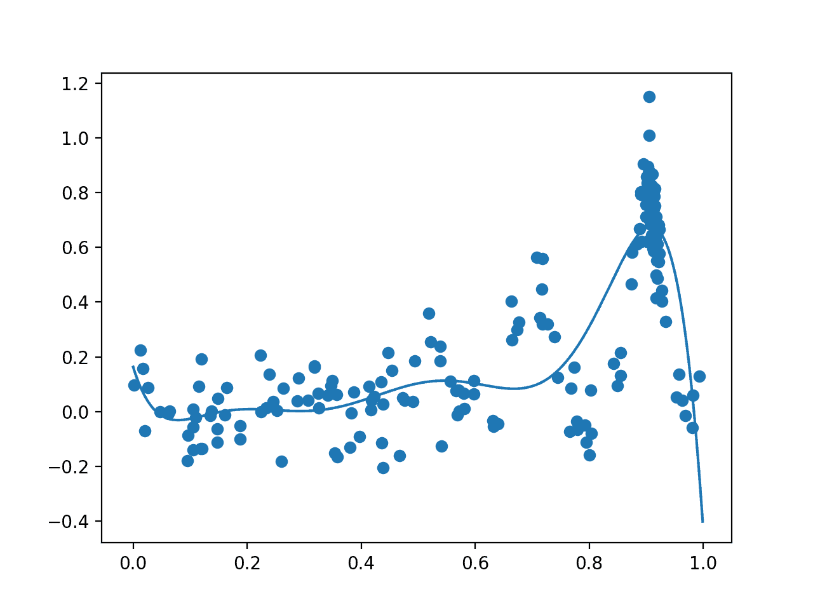

# 如何在 Python 中从头实现贝叶斯优化

> 原文:[https://machinelearning master . com/什么是贝叶斯优化/](https://machinelearningmastery.com/what-is-bayesian-optimization/)

最后更新于 2020 年 8 月 22 日

在本教程中，您将发现如何针对复杂的优化问题实现**贝叶斯优化算法**。

全局优化是一个具有挑战性的问题，寻找一个输入，导致最小或最大的成本给定的目标函数。

通常，目标函数的形式复杂且难以分析，并且通常是非凸的、非线性的、高维的、有噪声的，并且评估起来计算成本高。

贝叶斯优化提供了一种基于贝叶斯定理的有原则的技术，用于指导高效且有效的全局优化问题的搜索。它的工作原理是建立一个目标函数的概率模型，称为替代函数，然后在选择候选样本对真实目标函数进行评估之前，使用获取函数对其进行有效搜索。

贝叶斯优化通常用于应用机器学习，以在验证数据集上调整给定的表现良好的模型的超参数。

完成本教程后，您将知道:

*   全局优化是一个具有挑战性的问题，它涉及黑盒和通常非凸的、非线性的、有噪声的和计算昂贵的目标函数。
*   贝叶斯优化为全局优化提供了一种概率原则方法。
*   如何从头开始实现贝叶斯优化，以及如何使用开源实现。

**用我的新书[机器学习概率](https://machinelearningmastery.com/probability-for-machine-learning/)启动你的项目**，包括*分步教程*和所有示例的 *Python 源代码*文件。

我们开始吧。

*   **2020 年 1 月更新**:针对 scikit-learn v0.22 API 的变化进行了更新。


贝氏优化的温和介绍
图片由[贝尼阿诺德](https://www.flickr.com/photos/banjipark/19636375808/)提供，保留部分权利。

## 教程概述

本教程分为四个部分；它们是:

1.  函数优化的挑战
2.  什么是贝叶斯优化
3.  如何执行贝叶斯优化
4.  基于贝叶斯优化的超参数整定

## 函数优化的挑战

[全局函数优化](https://en.wikipedia.org/wiki/Global_optimization)，简称函数优化，涉及寻找目标函数的最小值或最大值。

从域中抽取样本，并通过目标函数进行评估，以给出分数或成本。

让我们定义一些常用术语:

*   **样品**。域的一个例子，表示为向量。
*   **搜索空间**:可以从中抽取样本的领域范围。
*   **目标函数**。获取样本并返回成本的函数。
*   **成本**。通过目标函数计算的样本数值分数。

样本由一个或多个变量组成，通常易于设计或创建。一个样本通常被定义为 n 维空间中具有预定范围的变量向量。必须对这个空间进行采样和探索，以便找到产生最佳成本的变量值的特定组合。

成本通常有特定于给定领域的单位。优化通常用最小化成本来描述，因为最大化问题可以很容易地通过反转计算的成本而转化为最小化问题。函数的最小值和最大值统称为函数的极值(或复数极值)。

目标函数通常很容易指定，但计算起来可能很有挑战性，或者随着时间的推移，成本计算会很麻烦。目标函数的形式是未知的，并且通常是高度非线性的，并且是由输入变量的数量定义的高度多维的。这个函数也可能是非凸的。这意味着局部极值可能是也可能不是全局极值(例如，可能会误导并导致过早收敛)，因此任务的名称为全局而不是局部优化。

尽管对目标函数知之甚少(已知是否从函数中寻求最小或最大成本)，因此，它通常被称为黑盒函数，搜索过程被称为黑盒优化。此外，目标函数有时被称为只给出答案的神谕。

函数优化是机器学习的一个基本部分。大多数机器学习算法都涉及参数(权重、系数等)的优化。)来响应训练数据。优化也指的是找到配置机器学习算法训练的最佳超参数集的过程。再高一步，训练数据的选择、数据准备、机器学习算法本身也是一个函数优化的问题。

机器学习优化综述；

*   **算法训练**。模型参数的优化。
*   **算法调整**。模型超参数的优化。
*   **预测建模**。数据优化、数据准备和算法选择。

存在许多函数优化方法，例如随机采样变量搜索空间，称为随机搜索，或者在搜索空间的网格中系统地评估样本，称为网格搜索。

更有原则的方法能够从空间采样中学习，以便将来的样本指向搜索空间中最有可能包含极值的部分。

使用概率的有向全局优化方法称为贝叶斯优化。

## 什么是贝叶斯优化

[贝叶斯优化](https://en.wikipedia.org/wiki/Bayesian_optimization)是一种使用[贝叶斯定理](https://machinelearningmastery.com/bayes-theorem-for-machine-learning/)指导搜索以找到目标函数的最小值或最大值的方法。

这是一种对复杂、有噪声和/或评估成本高的目标函数最有用的方法。

> 贝叶斯优化是一种寻找目标函数极值的强有力的策略，但评估成本很高。[……]当这些评估成本高昂、无法获得衍生工具或手头的问题是非凸性的时候，这一点尤其有用。

——[昂贵成本函数贝叶斯优化教程，应用于主动用户建模和分层强化学习](https://arxiv.org/abs/1012.2599)，2010。

回想一下，贝叶斯定理是一种计算事件条件概率的方法:

*   P(A|B) = P(B|A) * P(A) / P(B)

我们可以通过去掉 *P(B)* 的归一化值来简化这一计算，将条件概率描述为一个比例量。这很有用，因为我们对计算特定的条件概率不感兴趣，而是对优化一个量感兴趣。

*   P(A|B) = P(B|A) * P(A)

我们正在计算的条件概率一般称为*后验*概率；反向条件概率有时称为似然，边际概率称为*先验*概率；例如:

*   后验=可能性*先验

这提供了一个框架，可以用来量化关于未知目标函数的信念，给定来自域的样本以及它们通过目标函数的评估。

我们可以设计特定的样本( *x1，x2，…，xn* )并使用目标函数 *f(xi)* 对其进行评估，该函数返回样本 xi 的成本或结果。样本及其结果按顺序收集并定义我们的数据 *D* ，例如 *D = {xi，f(xi)，… xn，f(xn)}* 并用于定义先验。似然函数定义为给定函数 *P(D | f)* 观察数据的概率。随着收集到更多的观测值，这个似然函数将会改变。

*   P(f|D) = P(D|f) * P(f)

后验线代表我们所知道的关于目标函数的一切。它是目标函数的近似值，可用于估计我们可能想要评估的不同候选样本的成本。

这样，后验概率就是一个替代目标函数。

> 后验捕捉关于未知目标函数的更新信念。也可以将贝叶斯优化的这一步解释为用替代函数(也称为响应面)来估计目标函数。

——[昂贵成本函数贝叶斯优化教程，应用于主动用户建模和分层强化学习](https://arxiv.org/abs/1012.2599)，2010。

*   **替代函数**:可以高效采样的目标函数的贝叶斯近似。

代理函数给我们一个目标函数的估计，可以用来指导未来的采样。采样包括在被称为“*采集*功能的功能中仔细使用后验，例如用于采集更多的样本。我们希望利用我们对目标函数的信念，对搜索空间中最有可能获得回报的区域进行采样，因此，采集将优化搜索中位置的条件概率，以生成下一个样本。

*   **采集功能**:利用后验从搜索空间中选择下一个样本的技术。

一旦通过目标函数 *f()* 收集了额外的样本及其评估，它们就被添加到数据 *D* 中，然后更新后验。

重复这个过程，直到找到目标函数的极值，找到足够好的结果，或者资源耗尽。

贝叶斯优化算法可以总结如下:

*   1.通过优化采集功能选择样本。
*   2.用目标函数评估样本。
*   3.更新数据，然后更新代理函数。
*   4.转到 1。

## 如何执行贝叶斯优化

在本节中，我们将通过为一个简单的一维测试函数从头开发一个实现来探索贝叶斯优化是如何工作的。

首先，我们将定义测试问题，然后如何用代理函数来建模输入到输出的映射。接下来，我们将看到在将所有这些元素结合到贝叶斯优化过程中之前，如何使用获取函数有效地搜索代理函数。

### 测试问题

第一步是定义一个测试问题。

我们将使用具有五个峰值的多峰问题，计算如下:

*   y = x^2 *辛(5 *皮* x)^6

其中 *x* 是范围【0，1】内的实数值， *PI* 是 PI 的值。

我们将通过添加均值为零、标准偏差为 0.1 的高斯噪声来扩充这个函数。这将意味着真正的评估将有一个正的或负的随机值添加到其中，使函数具有优化的挑战性。

下面的*目标()*函数实现了这一点。

```py
# objective function
def objective(x, noise=0.1):
	noise = normal(loc=0, scale=noise)
	return (x**2 * sin(5 * pi * x)**6.0) + noise
```

我们可以测试这个函数，首先定义一个基于网格的输入样本，从 0 到 1，在整个域中步长为 0.01。

```py
...
# grid-based sample of the domain [0,1]
X = arange(0, 1, 0.01)
```

然后，我们可以在没有任何噪声的情况下使用目标函数评估这些样本，以了解真实的目标函数是什么样子的。

```py
...
# sample the domain without noise
y = [objective(x, 0) for x in X]
```

然后，我们可以用噪声评估这些相同的点，看看优化目标函数时它会是什么样子。

```py
...
# sample the domain with noise
ynoise = [objective(x) for x in X]
```

我们可以查看所有无噪声的目标函数值，以找到导致最佳得分的输入并报告它。这将是最优值，在这种情况下是最大值，因为我们正在最大化目标函数的输出。

我们在实践中不会知道这一点，但是对于我们的测试问题，最好知道函数的真正最佳输入和输出，看看贝叶斯优化算法是否能找到它。

```py
...
# find best result
ix = argmax(y)
print('Optima: x=%.3f, y=%.3f' % (X[ix], y[ix]))
```

最后，我们可以创建一个图，首先将有噪声的评估显示为散点图，x 轴为输入，y 轴为分数，然后是没有任何噪声的分数线图。

```py
...
# plot the points with noise
pyplot.scatter(X, ynoise)
# plot the points without noise
pyplot.plot(X, y)
# show the plot
pyplot.show()
```

下面列出了查看我们希望优化的测试功能的完整示例。

```py
# example of the test problem
from math import sin
from math import pi
from numpy import arange
from numpy import argmax
from numpy.random import normal
from matplotlib import pyplot

# objective function
def objective(x, noise=0.1):
	noise = normal(loc=0, scale=noise)
	return (x**2 * sin(5 * pi * x)**6.0) + noise

# grid-based sample of the domain [0,1]
X = arange(0, 1, 0.01)
# sample the domain without noise
y = [objective(x, 0) for x in X]
# sample the domain with noise
ynoise = [objective(x) for x in X]
# find best result
ix = argmax(y)
print('Optima: x=%.3f, y=%.3f' % (X[ix], y[ix]))
# plot the points with noise
pyplot.scatter(X, ynoise)
# plot the points without noise
pyplot.plot(X, y)
# show the plot
pyplot.show()
```

运行该示例首先报告全局 optima 作为输入，值为 0.9，得分为 0.81。

```py
Optima: x=0.900, y=0.810
```

然后创建一个图，显示样本的噪声评估(点)和目标函数的非噪声和真实形状(线)。

**注**:考虑到算法或评估程序的随机性，或数值精度的差异，您的[结果可能会有所不同](https://machinelearningmastery.com/different-results-each-time-in-machine-learning/)。考虑运行该示例几次，并比较平均结果。



用有噪声(点)和无噪声(线)目标函数评估的输入样本图

现在我们有了一个测试问题，让我们回顾一下如何训练一个代理函数。

### 代理函数

代理函数是一种用于最佳逼近输入示例到输出分数的映射的技术。

概率上，它总结了一个目标函数( *f* )的条件概率，给定可用数据( *D* )或 *P(f|D)* 。

为此可以使用许多技术，尽管最流行的是将问题作为回归预测建模问题来处理，数据代表模型的输入，分数代表模型的输出。这通常最好使用随机森林或高斯过程来建模。

一个[高斯过程](https://en.wikipedia.org/wiki/Gaussian_process)，或者 GP，是一个在变量上构建联合概率分布的模型，假设一个多元高斯分布。因此，当更多的观测值可用于模型时，它能够高效和有效地总结大量函数并平滑过渡。

这种基于数据的平滑结构和向新函数的平滑过渡是我们对域进行采样时所期望的特性，并且模型的多变量高斯基意味着来自模型的估计将是具有标准偏差的分布的平均值；这将有助于后面的采集功能。

因此，使用 GP 回归模型通常是首选。

我们可以使用[高斯过程回归器](https://scikit-learn.org/stable/modules/generated/sklearn.gaussian_process.GaussianProcessRegressor.html)scikit-从输入样本( *X* )和来自目标函数( *y* )的噪声评估中学习实现来拟合 GP 回归模型。

首先，必须定义模型。定义 GP 模型的一个重要方面是内核。这将根据实际数据观测值之间的距离测量值来控制特定点的函数形状。可以使用许多不同的内核函数，有些可以为特定数据集提供更好的性能。

默认情况下，使用一个能够很好工作的[径向基函数](https://en.wikipedia.org/wiki/Radial_basis_function)，或者径向基函数。

```py
...
# define the model
model = GaussianProcessRegressor()
```

一旦定义，就可以通过调用 *fit()* 函数直接在训练数据集上拟合模型。

通过对 *fit()* 的另一次调用，定义的模型可以在任何时候用连接到现有数据的更新数据再次拟合。

```py
...
# fit the model
model.fit(X, y)
```

该模型将估计提供给它的一个或多个样本的成本。

通过调用 *predict()* 函数来使用该模型。给定样本的结果将是该点分布的平均值。我们也可以通过指定参数 *return_std=True* 得到函数中该点的分布的标准差；例如:

```py
...
yhat = model.predict(X, return_std=True)
```

如果分布在我们感兴趣的给定点很薄，这个函数会导致警告。

因此，在做预测时，我们可以沉默所有的警告。下面的*代理()*函数获取拟合模型和一个或多个样本，并返回估计成本的平均值和标准偏差，同时不打印任何警告。

```py
# surrogate or approximation for the objective function
def surrogate(model, X):
	# catch any warning generated when making a prediction
	with catch_warnings():
		# ignore generated warnings
		simplefilter("ignore")
		return model.predict(X, return_std=True)
```

我们可以随时调用该函数来估计一个或多个样本的成本，例如当我们想要在下一节中优化采集函数时。

目前，在随机样本上训练代理函数后，看看它在整个领域中的样子是很有趣的。

我们可以通过首先在 100 个数据点的随机样本上拟合 GP 模型，并用噪声拟合它们的真实目标函数值来实现这一点。然后我们可以绘制这些点的散点图。接下来，我们可以在整个输入域中执行基于网格的采样，并使用代理函数估计每个点的成本，并将结果绘制成一条线。

我们希望替代函数具有真实无噪声目标函数的粗略近似。

给定真实噪声目标函数的随机数据样本和拟合模型，下面的*图()*函数创建该图。

```py
# plot real observations vs surrogate function
def plot(X, y, model):
	# scatter plot of inputs and real objective function
	pyplot.scatter(X, y)
	# line plot of surrogate function across domain
	Xsamples = asarray(arange(0, 1, 0.001))
	Xsamples = Xsamples.reshape(len(Xsamples), 1)
	ysamples, _ = surrogate(model, Xsamples)
	pyplot.plot(Xsamples, ysamples)
	# show the plot
	pyplot.show()
```

将这些联系在一起，下面列出了在噪声样本上拟合高斯过程回归模型并绘制样本与替代函数的关系的完整示例。

```py
# example of a gaussian process surrogate function
from math import sin
from math import pi
from numpy import arange
from numpy import asarray
from numpy.random import normal
from numpy.random import random
from matplotlib import pyplot
from warnings import catch_warnings
from warnings import simplefilter
from sklearn.gaussian_process import GaussianProcessRegressor

# objective function
def objective(x, noise=0.1):
	noise = normal(loc=0, scale=noise)
	return (x**2 * sin(5 * pi * x)**6.0) + noise

# surrogate or approximation for the objective function
def surrogate(model, X):
	# catch any warning generated when making a prediction
	with catch_warnings():
		# ignore generated warnings
		simplefilter("ignore")
		return model.predict(X, return_std=True)

# plot real observations vs surrogate function
def plot(X, y, model):
	# scatter plot of inputs and real objective function
	pyplot.scatter(X, y)
	# line plot of surrogate function across domain
	Xsamples = asarray(arange(0, 1, 0.001))
	Xsamples = Xsamples.reshape(len(Xsamples), 1)
	ysamples, _ = surrogate(model, Xsamples)
	pyplot.plot(Xsamples, ysamples)
	# show the plot
	pyplot.show()

# sample the domain sparsely with noise
X = random(100)
y = asarray([objective(x) for x in X])
# reshape into rows and cols
X = X.reshape(len(X), 1)
y = y.reshape(len(y), 1)
# define the model
model = GaussianProcessRegressor()
# fit the model
model.fit(X, y)
# plot the surrogate function
plot(X, y, model)
```

运行该示例首先绘制随机样本，用噪声目标函数对其进行评估，然后拟合 GP 模型。

然后，通过替代函数评估的数据样本和跨域点网格分别绘制为点和线。

**注**:考虑到算法或评估程序的随机性，或数值精度的差异，您的[结果可能会有所不同](https://machinelearningmastery.com/different-results-each-time-in-machine-learning/)。考虑运行该示例几次，并比较平均结果。

在这种情况下，如我们所料，该图类似于基础无噪声目标函数的粗略版本，重要的是峰值在 0.9 左右，我们知道真正的最大值位于该处。



显示随机样本的图，带有噪声评估(点)和跨域(线)的替代函数。

接下来，我们必须定义一个代理函数采样策略。

### 采集功能

代理函数用于测试领域中的一系列候选样本。

从这些结果中，可以选择一个或多个候选项，并用真实的，并且在正常实践中计算量很大的代价函数进行评估。

这包括两个部分:用于响应代理函数在域中导航的搜索策略，以及用于解释和评分代理函数响应的获取函数。

可以使用简单的搜索策略，例如随机样本或基于网格的样本，尽管更常见的是使用局部搜索策略，例如流行的 [BFGS 算法](https://en.wikipedia.org/wiki/Broyden%E2%80%93Fletcher%E2%80%93Goldfarb%E2%80%93Shanno_algorithm)。在这种情况下，我们将使用随机搜索或随机样本的领域，以保持简单的例子。

这包括首先从域中抽取候选样本的随机样本，用获取函数对其进行评估，然后最大化获取函数或选择给出最佳分数的候选样本。下面的 *opt_acquisition()* 函数实现了这一点。

```py
# optimize the acquisition function
def opt_acquisition(X, y, model):
	# random search, generate random samples
	Xsamples = random(100)
	Xsamples = Xsamples.reshape(len(Xsamples), 1)
	# calculate the acquisition function for each sample
	scores = acquisition(X, Xsamples, model)
	# locate the index of the largest scores
	ix = argmax(scores)
	return Xsamples[ix, 0]
```

获取函数负责对给定候选样本(输入)值得用真实目标函数评估的可能性进行评分或估计。

我们可以直接使用代理分数。或者，假设我们选择了高斯过程模型作为替代函数，我们可以在获取函数中使用来自该模型的概率信息来计算给定样本值得评估的概率。

有许多不同类型的概率获取函数可以使用，每一种都提供了一种不同的权衡，来衡量它们的剥削性(贪婪)和探索性。

三个常见的例子包括:

*   改善概率。
*   预期改进。
*   置信下限(LCB)。

改进概率法是最简单的，而期望改进法是最常用的。

在这种情况下，我们将使用更简单的改进概率方法，该方法计算为标准化预期改进的正常累积概率，计算如下:

*   PI = CDF((mu–best _ mu)/stdev)

其中 PI 为改善概率， *cdf()* 为正态累积分布函数，*μ*为给定样本的替代函数均值 *x* ， *stdev* 为给定样本的替代函数标准差 *x* ， *best_mu* 为目前找到的最佳样本的替代函数均值。

我们可以在标准差上加一个非常小的数字，以避免被零除的误差。

下面的*采集()*函数在给定输入样本的当前训练数据集、一组新的候选样本和拟合 GP 模型的情况下实现了这一点。

```py
# probability of improvement acquisition function
def acquisition(X, Xsamples, model):
	# calculate the best surrogate score found so far
	yhat, _ = surrogate(model, X)
	best = max(yhat)
	# calculate mean and stdev via surrogate function
	mu, std = surrogate(model, Xsamples)
	mu = mu[:, 0]
	# calculate the probability of improvement
	probs = norm.cdf((mu - best) / (std+1E-9))
	return probs
```

### 完全贝叶斯优化算法

我们可以将所有这些结合到贝叶斯优化算法中。

主要算法包括选择候选样本、用目标函数评估它们、然后更新 GP 模型的循环。

```py
...
# perform the optimization process
for i in range(100):
	# select the next point to sample
	x = opt_acquisition(X, y, model)
	# sample the point
	actual = objective(x)
	# summarize the finding for our own reporting
	est, _ = surrogate(model, [[x]])
	print('>x=%.3f, f()=%3f, actual=%.3f' % (x, est, actual))
	# add the data to the dataset
	X = vstack((X, [[x]]))
	y = vstack((y, [[actual]]))
	# update the model
	model.fit(X, y)
```

下面列出了完整的示例。

```py
# example of bayesian optimization for a 1d function from scratch
from math import sin
from math import pi
from numpy import arange
from numpy import vstack
from numpy import argmax
from numpy import asarray
from numpy.random import normal
from numpy.random import random
from scipy.stats import norm
from sklearn.gaussian_process import GaussianProcessRegressor
from warnings import catch_warnings
from warnings import simplefilter
from matplotlib import pyplot

# objective function
def objective(x, noise=0.1):
	noise = normal(loc=0, scale=noise)
	return (x**2 * sin(5 * pi * x)**6.0) + noise

# surrogate or approximation for the objective function
def surrogate(model, X):
	# catch any warning generated when making a prediction
	with catch_warnings():
		# ignore generated warnings
		simplefilter("ignore")
		return model.predict(X, return_std=True)

# probability of improvement acquisition function
def acquisition(X, Xsamples, model):
	# calculate the best surrogate score found so far
	yhat, _ = surrogate(model, X)
	best = max(yhat)
	# calculate mean and stdev via surrogate function
	mu, std = surrogate(model, Xsamples)
	mu = mu[:, 0]
	# calculate the probability of improvement
	probs = norm.cdf((mu - best) / (std+1E-9))
	return probs

# optimize the acquisition function
def opt_acquisition(X, y, model):
	# random search, generate random samples
	Xsamples = random(100)
	Xsamples = Xsamples.reshape(len(Xsamples), 1)
	# calculate the acquisition function for each sample
	scores = acquisition(X, Xsamples, model)
	# locate the index of the largest scores
	ix = argmax(scores)
	return Xsamples[ix, 0]

# plot real observations vs surrogate function
def plot(X, y, model):
	# scatter plot of inputs and real objective function
	pyplot.scatter(X, y)
	# line plot of surrogate function across domain
	Xsamples = asarray(arange(0, 1, 0.001))
	Xsamples = Xsamples.reshape(len(Xsamples), 1)
	ysamples, _ = surrogate(model, Xsamples)
	pyplot.plot(Xsamples, ysamples)
	# show the plot
	pyplot.show()

# sample the domain sparsely with noise
X = random(100)
y = asarray([objective(x) for x in X])
# reshape into rows and cols
X = X.reshape(len(X), 1)
y = y.reshape(len(y), 1)
# define the model
model = GaussianProcessRegressor()
# fit the model
model.fit(X, y)
# plot before hand
plot(X, y, model)
# perform the optimization process
for i in range(100):
	# select the next point to sample
	x = opt_acquisition(X, y, model)
	# sample the point
	actual = objective(x)
	# summarize the finding
	est, _ = surrogate(model, [[x]])
	print('>x=%.3f, f()=%3f, actual=%.3f' % (x, est, actual))
	# add the data to the dataset
	X = vstack((X, [[x]]))
	y = vstack((y, [[actual]]))
	# update the model
	model.fit(X, y)

# plot all samples and the final surrogate function
plot(X, y, model)
# best result
ix = argmax(y)
print('Best Result: x=%.3f, y=%.3f' % (X[ix], y[ix]))
```

运行该示例首先创建搜索空间的初始随机样本和结果评估。然后在此数据上拟合一个 GP 模型。

**注**:考虑到算法或评估程序的随机性，或数值精度的差异，您的[结果可能会有所不同](https://machinelearningmastery.com/different-results-each-time-in-machine-learning/)。考虑运行该示例几次，并比较平均结果。

创建一个图，将原始观察结果显示为点，并在整个域中显示替代函数。在这种情况下，初始样本在整个域中有很好的分布，代理函数偏向我们知道 optima 所在的域部分。



跨域(线)的初始样本(点)和替代函数图。

然后，该算法迭代 100 个周期，选择样本，评估样本，并将其添加到数据集以更新代理函数，如此反复。

每个周期报告选定的输入值、代理函数的估计分数和实际分数。理想情况下，随着算法收敛到搜索空间的一个区域，这些分数会越来越接近。

```py
...
>x=0.922, f()=0.661501, actual=0.682
>x=0.895, f()=0.661668, actual=0.905
>x=0.928, f()=0.648008, actual=0.403
>x=0.908, f()=0.674864, actual=0.750
>x=0.436, f()=0.071377, actual=-0.115
```

接下来，创建一个与前一个图形式相同的最终图。

这一次，绘制了优化任务期间评估的所有 200 个样本。我们预计在已知的最佳值附近会有过多的采样，这就是我们所看到的，5 月点在 0.9 左右。我们还看到代理函数对底层目标域有更强的表示。



贝叶斯优化后所有样本(点)和替代函数在整个域(线)中的图。

最后，报告最佳输入及其目标函数得分。

我们知道，如果没有采样噪声，optima 的输入为 0.9，输出为 0.810。

给定采样噪声，优化算法在这种情况下变得接近，建议输入为 0.905。

```py
Best Result: x=0.905, y=1.150
```

## 基于贝叶斯优化的超参数整定

这可能是一个有用的练习来实现贝叶斯优化，以了解它是如何工作的。

实际上，在项目中使用贝叶斯优化时，最好使用开源库中提供的标准实现。这既是为了避免错误，也是为了利用更广泛的配置选项和速度改进。

贝叶斯优化的两个流行库包括 [Scikit-Optimize](https://github.com/scikit-optimize/scikit-optimize) 和 [HyperOpt](https://github.com/hyperopt/hyperopt) 。在机器学习中，这些库通常用于调整算法的超参数。

超参数调整非常适合贝叶斯优化，因为评估函数计算成本高(例如，每组超参数的训练模型)且有噪声(例如，训练数据和随机学习算法中的噪声)。

在本节中，我们将简要介绍如何使用 Scikit-Optimize 库为一个简单的测试分类问题优化 k 近邻分类器的超参数。这将提供一个有用的模板，您可以在自己的项目中使用。

[Scikit-Optimize 项目](https://github.com/scikit-optimize/scikit-optimize)旨在为使用 SciPy 和 NumPy 的应用程序或使用 scikit-learn 机器学习算法的应用程序提供贝叶斯优化访问。

首先，必须安装库，这可以使用 pip 轻松实现；例如:

```py
sudo pip install scikit-optimize
```

本例还假设您安装了 [scikit-learn](https://scikit-learn.org/stable/index.html) 。

一旦安装，scikit-optimize 有两种方法可以用来优化 scikit-learn 算法的超参数。第一种是直接在搜索空间上执行优化，第二种是使用 BayesSearchCV 类，scikit-learn 原生类的同级来进行随机和网格搜索。

在本例中，将使用更简单的方法直接优化超参数。

第一步是准备数据和定义模型。我们将通过 [make_blobs()函数](https://scikit-learn.org/stable/modules/generated/sklearn.datasets.make_blobs.html)使用一个简单的测试分类问题，有 500 个例子，每个例子有两个特征和三个类标签。然后我们将使用一个[kneighgborcsclassifier 算法](https://scikit-learn.org/stable/modules/generated/sklearn.neighbors.KNeighborsClassifier.html)。

```py
...
# generate 2d classification dataset
X, y = make_blobs(n_samples=500, centers=3, n_features=2)
# define the model
model = KNeighborsClassifier()
```

接下来，我们必须定义搜索空间。

在这种情况下，我们将调整邻居的数量( *n_neighbors* )和邻居函数的形状( *p* )。这要求为给定的数据类型定义范围。在这种情况下，它们是整数，用最小、最大和 scikit-learn 模型的参数名称来定义。对于您的算法，您可以同样轻松地优化*真实()*和*分类()*数据类型。

```py
...
# define the space of hyperparameters to search
search_space = [Integer(1, 5, name='n_neighbors'), Integer(1, 2, name='p')]
```

接下来，我们需要定义一个函数，用于评估一组给定的超参数。我们希望最小化这个函数，因此返回的值越小，表示模型的性能越好。

我们可以在函数定义上使用 scikit-optimize 项目中的*use _ name _ args()*装饰器，它允许使用搜索空间中的一组特定参数直接调用函数。

因此，我们的自定义函数将把超参数值作为参数，这些参数可以直接提供给模型，以便对其进行配置。我们可以在 python 中使用函数的** *参数*参数来定义这些参数，然后通过 [set_params(**)函数](https://scikit-learn.org/stable/modules/generated/sklearn.neighbors.KNeighborsClassifier.html#sklearn.neighbors.KNeighborsClassifier.set_params)将它们传递给模型。

既然模型已经配置好了，我们就可以进行评估了。在这种情况下，我们将在数据集上使用 5 倍交叉验证，并评估每一倍的准确性。然后，我们可以将模型的性能报告为 1 减去这些折叠的平均精度。这意味着精度为 1.0 的完美模型将返回 0.0 的值(1.0–平均精度)。

这个函数是在我们加载数据集并定义模型之后定义的，这样数据集和模型都在范围内，可以直接使用。

```py
# define the function used to evaluate a given configuration
@use_named_args(search_space)
def evaluate_model(**params):
	# something
	model.set_params(**params)
	# calculate 5-fold cross validation
	result = cross_val_score(model, X, y, cv=5, n_jobs=-1, scoring='accuracy')
	# calculate the mean of the scores
	estimate = mean(result)
	return 1.0 - estimate
```

接下来，我们可以执行优化。

这是通过用目标函数的名称和定义的搜索空间调用[gp _ minimum()函数](https://scikit-optimize.github.io/#skopt.gp_minimize)来实现的。

默认情况下，该函数将使用“ *gp_hedge* ”获取函数来尝试找出最佳策略，但这可以通过 *acq_func* 参数进行配置。默认情况下，优化也将运行 100 次迭代，但是这可以通过 *n_calls* 参数来控制。

```py
...
# perform optimization
result = gp_minimize(evaluate_model, search_space)
```

一旦运行，我们就可以通过“有趣”属性获得最佳分数，并通过“ *x* ”数组属性获得最佳超参数集。

```py
...
# summarizing finding:
print('Best Accuracy: %.3f' % (1.0 - result.fun))
print('Best Parameters: n_neighbors=%d, p=%d' % (result.x[0], result.x[1]))
```

将这些结合在一起，完整的示例如下所示。

```py
# example of bayesian optimization with scikit-optimize
from numpy import mean
from sklearn.datasets import make_blobs
from sklearn.model_selection import cross_val_score
from sklearn.neighbors import KNeighborsClassifier
from skopt.space import Integer
from skopt.utils import use_named_args
from skopt import gp_minimize

# generate 2d classification dataset
X, y = make_blobs(n_samples=500, centers=3, n_features=2)
# define the model
model = KNeighborsClassifier()
# define the space of hyperparameters to search
search_space = [Integer(1, 5, name='n_neighbors'), Integer(1, 2, name='p')]

# define the function used to evaluate a given configuration
@use_named_args(search_space)
def evaluate_model(**params):
	# something
	model.set_params(**params)
	# calculate 5-fold cross validation
	result = cross_val_score(model, X, y, cv=5, n_jobs=-1, scoring='accuracy')
	# calculate the mean of the scores
	estimate = mean(result)
	return 1.0 - estimate

# perform optimization
result = gp_minimize(evaluate_model, search_space)
# summarizing finding:
print('Best Accuracy: %.3f' % (1.0 - result.fun))
print('Best Parameters: n_neighbors=%d, p=%d' % (result.x[0], result.x[1]))
```

运行该示例使用贝叶斯优化执行超参数调整。

该代码可能会报告许多警告消息，例如:

```py
UserWarning: The objective has been evaluated at this point before.
```

这是意料之中的，是由同一超参数配置被多次评估引起的。

**注**:考虑到算法或评估程序的随机性，或数值精度的差异，您的[结果可能会有所不同](https://machinelearningmastery.com/different-results-each-time-in-machine-learning/)。考虑运行该示例几次，并比较平均结果。

在这种情况下，该模型通过与 3 个邻居和 p 值为 2 的平均 5 倍交叉验证获得了约 97%的准确性。

```py
Best Accuracy: 0.976
Best Parameters: n_neighbors=3, p=2
```

## 进一步阅读

如果您想更深入地了解这个主题，本节将提供更多资源。

### 报纸

*   [昂贵成本函数的贝叶斯优化教程，应用于主动用户建模和分层强化学习](https://arxiv.org/abs/1012.2599)，2010。
*   [机器学习算法的实用贝叶斯优化](http://papers.nips.cc/paper/4522-practical-bayesian-optimization)，2012。
*   [贝叶斯优化教程](https://arxiv.org/abs/1807.02811)，2018。

### 应用程序接口

*   [高斯过程，Scikit-Learn API](https://scikit-learn.org/stable/modules/gaussian_process.html) 。
*   [超点:分布式异步超参数优化](https://github.com/hyperopt/hyperopt)
*   [Scikit-优化项目。](https://github.com/scikit-optimize/scikit-optimize)
*   [用 skopt](https://github.com/scikit-optimize/scikit-optimize/blob/master/examples/hyperparameter-optimization.ipynb) 调整 scikit 学习估计器

### 文章

*   [全局优化，维基百科](https://en.wikipedia.org/wiki/Global_optimization)。
*   [贝叶斯优化，维基百科](https://en.wikipedia.org/wiki/Bayesian_optimization)。
*   [贝叶斯优化](https://krasserm.github.io/2018/03/21/bayesian-optimization/)，2018。
*   [贝叶斯优化是如何工作的？，Quora](https://www.quora.com/How-does-Bayesian-optimization-work) 。

## 摘要

在本教程中，您发现了用于复杂优化问题的定向搜索的贝叶斯优化。

具体来说，您了解到:

*   全局优化是一个具有挑战性的问题，它涉及黑盒和通常非凸的、非线性的、有噪声的和计算昂贵的目标函数。
*   贝叶斯优化为全局优化提供了一种概率原则方法。
*   如何从头开始实现贝叶斯优化，以及如何使用开源实现。

你有什么问题吗？
在下面的评论中提问，我会尽力回答。