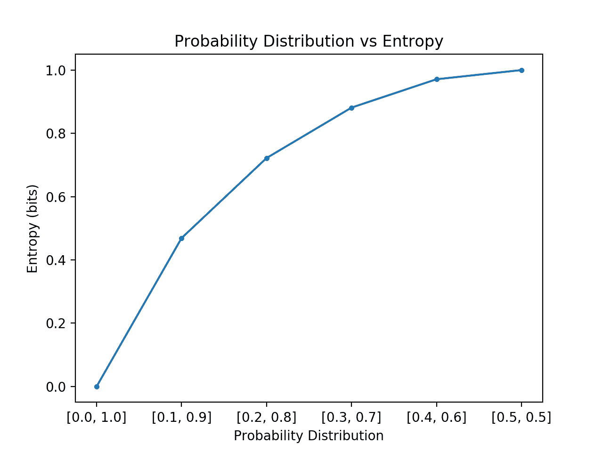

# 信息熵的温和介绍

> 原文:[https://machinelearning master . com/什么是信息熵/](https://machinelearningmastery.com/what-is-information-entropy/)

最后更新于 2020 年 7 月 13 日

信息论是数学的一个分支，研究在有噪声的信道上传输数据。

信息论的一个基石是量化信息中有多少信息的想法。更一般地说，这可以用来量化事件和随机变量中的信息，称为熵，并使用概率进行计算。

计算信息和熵是机器学习中的一个有用工具，被用作特征选择、建立决策树以及更一般地拟合分类模型等技术的基础。因此，机器学习实践者需要对信息和熵有很强的理解和直觉。

在这篇文章中，你会发现一个关于信息熵的温和介绍。

看完这篇文章，你会知道:

*   信息论关注数据压缩和传输，建立在概率的基础上，支持机器学习。
*   信息提供了一种以比特为单位量化事件惊喜程度的方法。
*   熵提供了从随机变量的概率分布中提取表示事件所需的平均信息量的度量。

**用我的新书[机器学习概率](https://machinelearningmastery.com/probability-for-machine-learning/)启动你的项目**，包括*分步教程*和所有示例的 *Python 源代码*文件。

我们开始吧。

*   **2019 年 11 月更新**:增加了概率 vs 信息的例子以及更多关于熵的直觉。


克里斯蒂亚诺·梅德罗斯·达尔本拍摄的《信息熵的温柔介绍》，版权所有。

## 概观

本教程分为三个部分；它们是:

1.  什么是信息论？
2.  计算事件的信息
3.  计算随机变量的熵

## 什么是信息论？

[信息论](https://en.wikipedia.org/wiki/Information_theory)是一个研究领域，涉及量化信息用于交流。

它是数学的一个分支，与数据压缩和信号处理的极限等主题有关。该领域是由克劳德·香农在美国电话公司贝尔实验室工作时提出和开发的。

> 信息论关注以紧凑的方式表示数据(称为数据压缩或源编码的任务)，以及以抗差错的方式传输和存储数据(称为纠错或信道编码的任务)。

—第 56 页，[机器学习:概率视角](https://amzn.to/2xKSTCP)，2012。

信息的一个基本概念是量化事件、随机变量和分布等事物中的信息量。

量化信息量需要使用概率，因此信息论与概率的关系。

信息的度量广泛应用于人工智能和机器学习中，例如决策树的构建和分类器模型的优化。

因此，信息论和机器学习之间有着重要的关系，从业者必须熟悉该领域的一些基本概念。

> 为什么要把信息论和机器学习统一起来？因为它们是同一枚硬币的两面。[……]信息论和机器学习仍然属于一起。大脑是终极的压缩和交流系统。数据压缩和纠错码的最先进算法使用与机器学习相同的工具。

—第五页，[信息论、推理和学习算法](https://amzn.to/2KfDDF7)，2003。

## 计算事件的信息

量化信息是信息论领域的基础。

量化信息背后的直觉是衡量一个事件中有多少惊喜的想法。那些罕见的事件(低概率)更令人惊讶，因此比那些常见的事件(高概率)拥有更多的信息。

*   **低概率事件**:高信息(*惊人*)。
*   **高概率事件**:低信息(*不出所料*)。

> 信息论背后的基本直觉是，学习一个不太可能发生的事件比学习一个可能发生的事件信息更丰富。

—第 73 页，[深度学习](https://amzn.to/2lnc3vL)，2016。

罕见事件比常见事件更不确定或更令人惊讶，需要更多的信息来表示它们。

我们可以利用事件发生的概率来计算事件中的信息量。这被称为“*香农信息*”、“*自我信息*”或简称为“*信息*”，并且可以为离散事件 *x* 计算如下:

*   信息(x)=-对数(p(x))

其中 *log()* 为以 2 为底的对数， *p(x)* 为事件发生的概率 *x* 。

选择以 2 为底的对数意味着信息度量的单位是位(二进制数字)。在信息处理的意义上，这可以直接解释为表示事件所需的位数。

信息的计算常写成*h()*；例如:

*   h(x)=-对数(p(x))

负号确保结果始终为正或零。

当事件的概率为 1.0 或确定性时，信息将为零，例如没有惊喜。

让我们用一些例子来具体说明这一点。

考虑抛一枚公平的硬币。正面(和反面)的概率是 0.5。我们可以使用 [log2()函数](https://docs.python.org/3/library/math.html)计算 Python 中翻转头部的信息。

```
# calculate the information for a coin flip
from math import log2
# probability of the event
p = 0.5
# calculate information for event
h = -log2(p)
# print the result
print('p(x)=%.3f, information: %.3f bits' % (p, h))
```

运行该示例会将事件的概率打印为 50%，并将事件的信息内容打印为 1 位。

```
p(x)=0.500, information: 1.000 bits
```

如果同一枚硬币被翻转 n 次，那么这一系列翻转的信息将是 n 位。

如果硬币不公平，头像出现的概率反而是 10% (0.1)，那么这个事件将更加罕见，需要 3 位以上的信息。

```
p(x)=0.100, information: 3.322 bits
```

我们也可以在一轮公平的六面骰子中探索信息，例如掷出 6 的信息。

我们知道滚动任何数字的概率是 1/6，这比掷硬币的 1/2 小，因此我们会期待更多的惊喜或更多的信息。

```
# calculate the information for a dice roll
from math import log2
# probability of the event
p = 1.0 / 6.0
# calculate information for event
h = -log2(p)
# print the result
print('p(x)=%.3f, information: %.3f bits' % (p, h))
```

运行该示例，我们可以看到我们的直觉是正确的，事实上，在一卷公平骰子中有超过 2.5 位的信息。

```
p(x)=0.167, information: 2.585 bits
```

可以使用其他对数来代替基数-2。例如，在计算信息时，使用以-e 为底的自然对数([欧拉数](https://en.wikipedia.org/wiki/E_(mathematical_constant)))也很常见，在这种情况下，单位被称为“*纳特*”

我们可以进一步发展低概率事件有更多信息的直觉。

为了说明这一点，我们可以计算 0 到 1 之间概率的信息，并绘制每个概率的相应信息。然后，我们可以创建概率与信息的关系图。我们预计该图将从高信息的低概率向下弯曲到低信息的高概率。

下面列出了完整的示例。

```
# compare probability vs information entropy
from math import log2
from matplotlib import pyplot
# list of probabilities
probs = [0.1, 0.2, 0.3, 0.4, 0.5, 0.6, 0.7, 0.8, 0.9, 1.0]
# calculate information
info = [-log2(p) for p in probs]
# plot probability vs information
pyplot.plot(probs, info, marker='.')
pyplot.title('Probability vs Information')
pyplot.xlabel('Probability')
pyplot.ylabel('Information')
pyplot.show()
```

运行该示例会创建概率与位信息的关系图。

我们可以看到低概率事件更令人惊讶并携带更多信息，而高概率事件的补充携带更少信息的预期关系。

我们还可以看到，这种关系不是线性的，它实际上是稍微亚线性的。考虑到日志函数的使用，这是有意义的。


概率与信息图

## 计算随机变量的熵

我们也可以量化一个随机变量中有多少信息。

例如，如果我们想用概率分布 *p* 计算随机变量 *X* 的信息，这可以写成函数*H()*；例如:

*   高(十)

实际上，计算随机变量的信息与计算随机变量事件概率分布的信息是一样的。

计算一个随机变量的信息被称为“*信息熵*”、“*香农熵*”或简称为“*熵*”。通过类比，它与物理学中熵的概念有关，因为两者都与不确定性有关。

熵的直觉是，它是从随机变量的概率分布中提取的表示或传输事件所需的平均位数。

> ……分布的香农熵是从该分布中提取的事件中的预期信息量。它给出了对来自分布 p 的符号进行编码平均所需的比特数的下限

—第 74 页，[深度学习](https://amzn.to/2lnc3vL)，2016。

对于随机变量 *X* ，在 *K* 离散状态下 *k* ，熵可以计算如下:

*   h(X)=-和(K p(k) * log(p(k))中的每个 K)

即每个事件的概率之和乘以每个事件概率的对数的负数。

和信息一样， *log()* 函数使用 base-2，单位为位。可以使用自然对数，单位为*纳特*。

最低熵是为一个随机变量计算的，该变量有一个概率为 1.0 的单一事件，这是一个确定性。一个随机变量的最大熵是所有事件的可能性相等。

我们可以考虑一卷公平骰子，计算变量的熵。每个结果都有相同的 1/6 概率，因此是一个均匀的概率分布。因此，我们希望平均信息与上一节计算的单个事件的信息相同。

```
# calculate the entropy for a dice roll
from math import log2
# the number of events
n = 6
# probability of one event
p = 1.0 /n
# calculate entropy
entropy = -sum([p * log2(p) for _ in range(n)])
# print the result
print('entropy: %.3f bits' % entropy)
```

运行该示例将熵计算为超过 2.5 位，这与单个结果的信息相同。这是有意义的，因为平均信息与信息的下限相同，因为所有的结果都是相同的。

```
entropy: 2.585 bits
```

如果我们知道每个事件的概率，我们可以使用[熵()SciPy 函数](https://docs.scipy.org/doc/scipy/reference/generated/scipy.stats.entropy.html)直接计算熵。

例如:

```
# calculate the entropy for a dice roll
from scipy.stats import entropy
# discrete probabilities
p = [1/6, 1/6, 1/6, 1/6, 1/6, 1/6]
# calculate entropy
e = entropy(p, base=2)
# print the result
print('entropy: %.3f bits' % e)
```

运行该示例会报告与我们手动计算的结果相同的结果。

```
entropy: 2.585 bits
```

我们可以进一步发展概率分布熵的直觉。

回想一下，熵是表示从分布中随机抽取的偶数所需的位数，例如平均事件。我们可以用两个事件的简单分布来探索这一点，就像掷硬币一样，但是要探索这两个事件的不同概率，并计算每个事件的熵。

在一个事件占主导地位的情况下，比如一个偏斜的概率分布，那么惊喜就少了，分布的熵也就低了。在没有事件支配另一个事件的情况下，例如相等或近似相等的概率分布，那么我们将期望更大或最大的熵。

*   **偏斜概率分布** ( *不出所料*):低熵。
*   **均衡概率分布** ( *惊人*):高熵。

如果我们从分布中事件的偏斜概率过渡到相等概率，我们将期望熵从低开始并增加，特别是从不可能/确定性事件的最低熵 0.0(概率分别为 0 和 1)到相等概率事件的最大熵 1.0。

下面的例子实现了这一点，在这个转换中创建每个概率分布，计算每个概率分布的熵并绘制结果。

```
# compare probability distributions vs entropy
from math import log2
from matplotlib import pyplot

# calculate entropy
def entropy(events, ets=1e-15):
	return -sum([p * log2(p + ets) for p in events])

# define probabilities
probs = [0.0, 0.1, 0.2, 0.3, 0.4, 0.5]
# create probability distribution
dists = [[p, 1.0 - p] for p in probs]
# calculate entropy for each distribution
ents = [entropy(d) for d in dists]
# plot probability distribution vs entropy
pyplot.plot(probs, ents, marker='.')
pyplot.title('Probability Distribution vs Entropy')
pyplot.xticks(probs, [str(d) for d in dists])
pyplot.xlabel('Probability Distribution')
pyplot.ylabel('Entropy (bits)')
pyplot.show()
```

运行该示例会创建从[0，1]概率到[0.5，0.5]概率的 6 个概率分布。

正如预期的那样，我们可以看到，随着事件的分布从偏斜变为平衡，熵从最小值增加到最大值。

也就是说，如果从概率分布中得出的平均事件不令人惊讶，我们会得到一个较低的熵，而如果令人惊讶，我们会得到一个较大的熵。

我们可以看到过渡不是线性的，它是超线性的。我们还可以看到，如果我们继续过渡到[0.6，0.4]并向前过渡到[1.0，0.0]这两个事件，形成一个倒[抛物线](https://en.wikipedia.org/wiki/Parabola)形状，这条曲线是对称的。

注意，在计算熵时，我们必须给概率加上一个很小的值，以避免计算零值的对数，这将导致一个无穷大而不是一个数。



概率分布与熵的关系图

计算一个随机变量的熵为其他度量提供了基础，如[互信息](https://machinelearningmastery.com/information-gain-and-mutual-information/)(信息增益)。

熵也为计算两个概率分布之间的差异提供了基础，即[交叉熵](https://machinelearningmastery.com/cross-entropy-for-machine-learning/)和[KL-散度](https://machinelearningmastery.com/divergence-between-probability-distributions/)。

## 进一步阅读

如果您想更深入地了解这个主题，本节将提供更多资源。

### 书

*   [信息论、推理和学习算法](https://amzn.to/2KfDDF7)，2003。

### 章

*   [第 2.8 节:信息论，机器学习:概率视角](https://amzn.to/2xKSTCP)，2012。
*   [1.6 节:信息论、模式识别与机器学习](https://amzn.to/2JwHE7I)，2006。
*   【3.13 节信息论，深度学习，2016。

### 应用程序接口

*   [scipy.stats.entropy API](https://docs.scipy.org/doc/scipy/reference/generated/scipy.stats.entropy.html)

### 文章

*   [熵(信息论)，维基百科](https://en.wikipedia.org/wiki/Entropy_(information_theory))。
*   [决策树中的信息增益，维基百科](https://en.wikipedia.org/wiki/Information_gain_in_decision_trees)。
*   [信息增益比，维基百科](https://en.wikipedia.org/wiki/Information_gain_ratio)。

## 摘要

在这篇文章中，你发现了一个关于信息熵的温和介绍。

具体来说，您了解到:

*   信息论关注数据压缩和传输，建立在概率的基础上，支持机器学习。
*   信息提供了一种以比特为单位量化事件惊喜程度的方法。
*   熵提供了从随机变量的概率分布中提取表示事件所需的平均信息量的度量。

你有什么问题吗？
在下面的评论中提问，我会尽力回答。