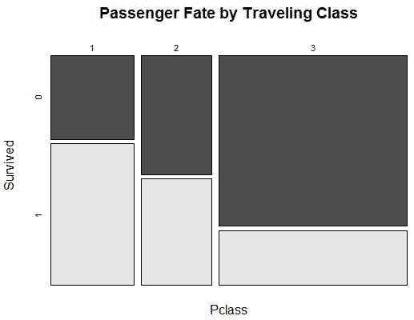
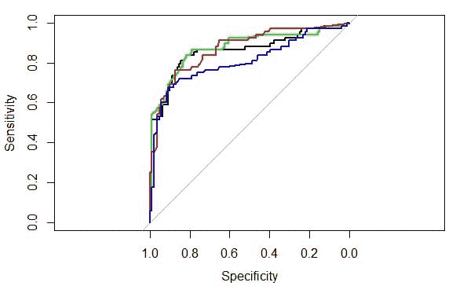

# 从乘客生存预测案例研究中获得的应用机器学习经验

> 原文：<https://machinelearningmastery.com/applied-machine-learning-lessons-from-a-case-study-of-passenger-survival-prediction/>

最后更新于 2019 年 8 月 22 日

在学习和实践机器学习时，一个有价值的练习是研究其他人如何应用方法和解决问题。它很有价值，因为你可以了解新的流程、软件、图表和算法。

但是，用机器学习来思考解决问题的过程的新方法是这项练习最有价值的部分。

在这篇文章中，你将回顾一下[预测泰坦尼克号](https://github.com/wehrley/wehrley.github.io/blob/master/SOUPTONUTS.md)乘客存活率的方法[科特·韦赫利](https://www.kaggle.com/users/130117/curt-wehrley)，这是一个用作[初学者卡格尔竞赛](https://en.wikipedia.org/wiki/RMS_Titanic)基础的数据集。

Curt 使用 [R](https://machinelearningmastery.com/books-for-machine-learning-with-r/ "Books for Machine Learning with R") 进行分析，并提供了一种调查问题的逻辑方法，你可以从中吸取很多教训。

**用我的新书[用 R](https://machinelearningmastery.com/machine-learning-with-r/) 启动你的项目**，包括*一步一步的教程*和所有例子的 *R 源代码*文件。

我们开始吧。

## 研究问题

科特首先描述了这个问题。他链接到资源，如 [RMS 泰坦尼克号维基百科条目](https://en.wikipedia.org/wiki/RMS_Titanic)，并记录了一些关于泰坦尼克号和沉没事件的事实。

这表明 Curt 考虑的是更广泛的问题，而不是深入数据集。它不是对一个空变量的预测，而是发生在现实世界中的一个事件，我们可以从中做出一些假设。

Curt 做到了这一点，并列出了一些假设，这些假设可以根据乘客等级、船舱到救生艇的距离以及妇女和儿童优先协议等数据进行测试。

## 研究数据

Curt 评论说，他看到了问题的数据准备阶段的大部分努力(和回报)。他认为这是一个机会，可以让他的手变脏，并获得对数据的颗粒感觉。他说他对这个问题最深刻的见解来自这个阶段。

### 缺失数据

Curt 研究缺失的数据，创建一个图(来自 [Amelia 包](https://cran.r-project.org/web/packages/Amelia/index.html)的 missmap 函数)，该图总结了缺失数据的属性。他对不同属性的缺失数据量进行了评论，并推测了各种方法及其应用。

### 属性分布

Curt 孤立地研究属性的分布，查看名义属性的直方图。他提取一般趋势并解释数据，评论它们在领域背景下的意义，如年龄和阶级。

属性分布
由[科特·韦赫利](https://github.com/wehrley/wehrley.github.io/blob/master/SOUPTONUTS.md)创建的图形

### 属性与生存的关系

接下来，Curt 在预测变量生存的背景下研究属性的分布。他使用马赛克图(来自 [vcd 包](https://cran.r-project.org/web/packages/vcd/index.html)的马赛克图)来评估预测变量的分类属性，并使用相关图(来自[相关图包](https://cran.r-project.org/web/packages/corrgram/)的相关图函数)来支持他的解释。

通过每一个关键属性，Curt 挑选出关键关系和解释，比如阶级影响生存概率和性别与生存的关系。

有一个有用的模式需要注意，那就是可视化、解释和确认。这种确认是通过另一种主观的方法进行的，但是假设也可以很容易地在过程的后期进行建模。

由[科特·韦赫利](https://github.com/wehrley/wehrley.github.io/blob/master/SOUPTONUTS.md)创建的按旅行等级划分的乘客命运图

### 特征工程

Curt 从年龄开始，考虑用不同的方法来估算大约 20%的缺失值。他着眼于平均年龄，首先是总体年龄，然后是班级年龄，然后是性别，甚至是头衔。

这是使用简单统计方法提高数据质量的一个重要例子。鉴于这是一场比赛，我想看看不同年龄模型对最终得分的贡献。

Curt 大量使用名字字段中的标题前缀，提取它，并使用有意义的解释(先生和先生，贵族等)将其合并。).这是一个很好的特性，有很大的空间来探索它对模型的贡献。

最后，Curt 从数据中导出了许多其他特征，例如对女性孩子的偏好、带有船舱属性的记录的甲板和船舷。

## 研究模型

Curt 没有抛出一堆最先进的模型来解决这个问题，至少一开始没有。

### 适合理解良好的模型

Curt 从一个很好理解的方法开始:逻辑回归。

他用它对数据进行简单的 80/20 分割，用于训练和测试，并研究不同的属性如何有助于预测乘客的存活率。他使用卡方统计来评估模型，并通过运行方差分析来查看不同属性的方差减少情况。

这是聪明的第一步，因为它允许 Curt 验证关于问题的假设，并寻找容易的胜利，比如放弃不相关的特性。

然后，他切换到插入符号包，用 3 次重复的 10 倍交叉验证运行逻辑回归。他小心翼翼地在每次跑步中使用相同的随机种子，以便结果可以直接比较。有了这个更强大的测试工具，他尝试了不同的特性组合，删除特性，甚至一些进一步的特性工程。

### 适合其他型号

在对功能的选择建立了一些信心后，Curt 挑选出了另外三个强大的模型:Adaboost、Random Forest 和 SVM。

Curt 没有盲目地运行模型，而是使用插入符号包的特性来调整每个模型的参数。他为每个算法选择表现更好的参数集，用于模型评估。

### 评估模型

Curt 评估问题上的每个模型，并准备一个混淆矩阵来总结结果。他对这些结果提供了一些细微的解释，为更深入的分析留下了很大的空间。

柯特·韦赫利绘制的模型表现的 ROC 曲线
图

结果通过灵敏度-特异性图上结果的 ROC 曲线进行图形比较。这是一种基于预测准确性的权衡来比较模型的常见方法。

Curt 还使用点图、方框图和触须图来比较每个模型的 ROC 分数。他评论说，所有四个模型在预测死亡人数方面都比存活人数更好，如果他必须选择一个模型来应用，他会选择逻辑回归。

科特·韦赫利绘制的模型表现点图
图

## 经验教训

Curt 小心翼翼地指出，这只是解决这个问题的一个例子，远远不是解决这个问题的最佳方法。我认为它是如何处理问题和应用机器学习算法的一个很好的例子。

您可以从本案例研究中学到以下几点:

*   **研究你的问题**:在更广阔的背景下回顾问题，列出所有你认为可能相关的假设，以及你可以用实际数据挑战的假设。
*   **查看你的数据**:研究现有的数据。寻找缺失的值，并思考如何估算它们。仔细查看每个属性和每个属性在预测变量上下文中的分布，并确保写下您注意到的解释和趋势，这些也可以在模型构建期间进行测试和利用。
*   **衍生特征**:超越所提供的数据，设计新的属性，在数据中展示一个你认为有助于模型做出预测的结构。
*   **研究一个模型**:挑选一个你很了解和理解的模型，用它来学习更多关于问题的知识，测试假设，挑选出可能有助于预测也可能没有帮助的属性。
*   **稳健的模型评估**:使用稳健的方法，如重复交叉验证，在看不见的数据上评估模型表现，并使用对结果(真阳性/假阴性)敏感的度量来比较模型