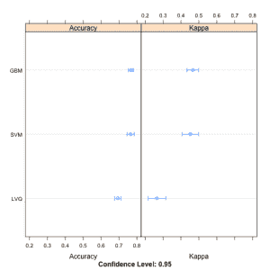

# 使用插入符号 R 包比较模型并选择最佳方案

> 原文:[https://machinelearning master . com/compare-models-and-select-best-use-caret-r-package/](https://machinelearningmastery.com/compare-models-and-select-the-best-using-the-caret-r-package/)

最后更新于 2019 年 12 月 13 日

Caret R 包允许您轻松构建许多不同的模型类型并调整它们的参数。

在创建和调整许多模型类型之后，您可能想要知道并选择最佳模型，以便您可以使用它进行预测，也许是在操作环境中。

在这篇文章中，你会发现如何使用插入符号包来比较多个模型的结果。

**用我的新书[用 R](https://machinelearningmastery.com/machine-learning-with-r/) 启动你的项目**，包括*一步一步的教程*和所有例子的 *R 源代码*文件。

我们开始吧。

## 比较机器学习模型

在解决问题时，你会选择一个或几个表现良好的模型。在调整每个模型的参数后，您将希望比较模型，并发现哪些模型表现最好，哪些表现最差。

了解模型的传播是很有用的，也许一个模型可以改进，或者你可以停止研究一个明显比其他模型表现差的模型。

在下面的例子中，我们比较了皮马印第安人糖尿病数据集中的三种复杂的机器学习模型。该数据集是一组医学报告的汇总，表明患者在五年内出现糖尿病。

您可以在此了解有关数据集的更多信息:

*   [数据集文件](https://raw.githubusercontent.com/jbrownlee/Datasets/master/pima-indians-diabetes.csv)。
*   [数据集详细信息](https://raw.githubusercontent.com/jbrownlee/Datasets/master/pima-indians-diabetes.names)

构建和调整的三个模型分别是[学习矢量量化](https://machinelearningmastery.com/learning-vector-quantization-for-machine-learning/) (LVQ)、[随机梯度增强](https://en.wikipedia.org/wiki/Gradient_boosting)(也称为梯度增强机或 GBM)和[支持向量机](https://en.wikipedia.org/wiki/Support_vector_machine) (SVM)。每个模型都是自动调整的，并使用 3 次重复的 10 倍交叉验证进行评估。

随机数种子在每个算法被训练之前被设置，以确保每个算法获得相同的数据分区并重复。这使我们能够在最终结果中比较苹果和苹果。或者，我们可以忽略这个问题，将重复次数增加到 30 或 100 次，利用随机性来控制数据分区的变化。

一旦模型被训练并且为每个模型找到最佳参数配置，从每个最佳模型收集精度结果。每个“获胜”模型有 30 个结果(10 倍交叉验证的 3 次重复)。比较结果的目的是比较模型之间的精度分布(30 个值)。

这是通过三种方式完成的。分布以百分位数概括。分布被总结为箱线图，最后分布被总结为点线图。

```
# load the library
library(mlbench)
library(caret)
# load the dataset
data(PimaIndiansDiabetes)
# prepare training scheme
control <- trainControl(method="repeatedcv", number=10, repeats=3)
# train the LVQ model
set.seed(7)
modelLvq <- train(diabetes~., data=PimaIndiansDiabetes, method="lvq", trControl=control)
# train the GBM model
set.seed(7)
modelGbm <- train(diabetes~., data=PimaIndiansDiabetes, method="gbm", trControl=control, verbose=FALSE)
# train the SVM model
set.seed(7)
modelSvm <- train(diabetes~., data=PimaIndiansDiabetes, method="svmRadial", trControl=control)
# collect resamples
results <- resamples(list(LVQ=modelLvq, GBM=modelGbm, SVM=modelSvm))
# summarize the distributions
summary(results)
# boxplots of results
bwplot(results)
# dot plots of results
dotplot(results)
```

下面是总结每个模型分布的结果表。

```
Models: LVQ, GBM, SVM 
Number of resamples: 30 

Accuracy 
      Min. 1st Qu. Median   Mean 3rd Qu.   Max. NA's
LVQ 0.5921  0.6623 0.6928 0.6935  0.7273 0.7922    0
GBM 0.7013  0.7403 0.7662 0.7665  0.7890 0.8442    0
SVM 0.6711  0.7403 0.7582 0.7651  0.7890 0.8961    0

Kappa 
       Min. 1st Qu. Median   Mean 3rd Qu.   Max. NA's
LVQ 0.03125  0.1607 0.2819 0.2650  0.3845 0.5103    0
GBM 0.32690  0.3981 0.4638 0.4663  0.5213 0.6426    0
SVM 0.21870  0.3889 0.4167 0.4520  0.5003 0.7638    0
```

[](https://machinelearningmastery.com/wp-content/uploads/2014/09/boxplot_compare_models.png)

使用插入符号包比较模型结果的箱线图

[](https://machinelearningmastery.com/wp-content/uploads/2014/09/dotplot_compare_models.png)

使用插入符号包比较模型结果的点图

如果你需要对哪种算法更好提出有力的主张，你也可以使用统计假设检验来统计显示结果的差异是显著的。

类似于学生 t 检验，如果结果是正态分布，或者秩和检验，如果分布未知。

## 摘要

在这篇文章中，你发现了如何使用插入符号包来比较来自多个不同模型的结果，即使它们的参数已经被优化。你看到了三种比较结果的方法，表格，方框图和点图。

本文中的示例是独立的，您可以轻松地将它们复制并粘贴到您自己的项目中，并根据您的问题进行调整。