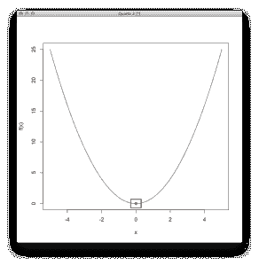
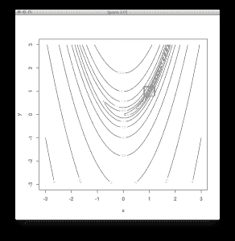

# R 中的凸优化

> 原文:[https://machinelearning master . com/凸优化 in-r/](https://machinelearningmastery.com/convex-optimization-in-r/)

最后更新于 2019 年 8 月 22 日

优化是机器学习的一大部分。它是最流行的方法的核心，从最小二乘回归到人工神经网络。

在这篇文章中，你将发现 5 种优化算法的配方

这些方法可能对你自己实现机器学习算法的核心有用。您可能希望实现自己的算法调整方案，以优化某个成本函数的模型参数。

一个很好的例子是，您希望优化来自多个子模型集合的混合预测的超参数。

**用我的新书[用 R](https://machinelearningmastery.com/machine-learning-with-r/) 启动你的项目**，包括*一步一步的教程*和所有例子的 *R 源代码*文件。

我们开始吧。

## 黄金分割搜索

黄金分割搜索是一种一维全局优化的线搜索方法。这是一种直接搜索(模式搜索)方法，因为它对函数进行采样以逼近导数，而不是直接计算导数。

黄金分割搜索与离散有序列表的模式搜索相关，例如二分搜索法和斐波那契搜索。它与其他线搜索算法(如布伦特法)相关，更一般地说，与其他直接搜索优化方法(如内尔德-米德法)相关。

该方法的信息处理目标是定位函数的极值。它通过使用三点模式直接对函数进行采样来实现这一点。这些点构成了搜索的括号:第一个点和最后一个点是搜索的当前边界，第三个点划分了中间的空间。选择划分点，使较大分区与整个区间的比值等于较大分区与较小分区的比值，称为黄金比值(*φ*)。基于分区的功能评估来比较分区，并且选择性能更好的分区作为搜索的新边界。该过程反复进行，直到获得所需的精度水平(包围最佳值)或搜索停止。

下面的例子提供了一个代码清单黄金分割搜索方法在解决一维非线性无约束优化函数。

```
# define a 1D basin function, optima at f(0)=0
basin <- function(x) {
x[1]^2
}

# locate the minimum of the function using a Golden Section Line Search
result <- optimize( 
basin, # the function to be minimized
c(-5, 5), # the bounds on the function parameter
maximum=FALSE, # we are concerned with the function minima
tol=1e-8) # the size of the final bracketing

# display the results
print(result$minimum)
print(result$objective)

# plot the function 
x <- seq(-5, 5, length.out=100)
y <- basin(expand.grid(x))
plot(x, y, xlab="x",ylab="f(x)", type="l")
# plot the solution as a point
points(result$minimum, result$objective, col="red", pch=19)
# draw a square around the optima to highlight it
rect(result$minimum-0.3, result$objective-0.7, result$minimum+0.3, result$objective+0.7, lwd=2)
```

[](https://machinelearningmastery.com/wp-content/uploads/2014/08/Golden-Section-Search-Results.png)

黄金分割搜索结果

### 使用启发法

*   假设该函数是凸的并且是单峰的，该函数有一个最佳值，并且它位于包围点之间。
*   意在寻找一维连续函数的极值。
*   它被证明比同等大小的分割线搜索更有效。
*   终止标准是关于最佳支架之间最小距离的规范。
*   它可以快速定位最优值的括号区域，但在定位特定最优值时效率较低。
*   一旦找到所需精度的解，就可以将其作为具有更快收敛速度的第二搜索算法的基础。

## 内德尔米德

内尔德-米德方法是一种多维非线性无约束函数的优化算法。
这是一种直接搜索方法，因为它在过程中不使用函数梯度。它是一种模式搜索，因为它使用几何模式来探索问题空间。

它与其他直接搜索优化方法相关，如胡克和吉夫斯的模式搜索，也使用几何模式来优化目标函数。

内尔德-米德方法的信息处理目标是定位函数的极值。这是通过在域中覆盖单形(几何图案)并迭代地增加和/或减小其尺寸直到找到最佳值来实现的。单纯形总是用 *n* +1 个顶点来定义，其中 *n* 是搜索空间的维数(即 2D 问题的三角形)。

该过程包括识别复合体中表现最差的点，并将其替换为通过其余点的质心(中心点)反射的点。通过远离最差点扩展、沿着远离最差点的一维收缩或在所有维度上朝着最佳点收缩，单纯形可以变形(使其自身适应搜索空间的拓扑结构)。

以下示例提供了求解二维非线性优化函数的内尔德-米德方法的代码列表。

```
# definition of the 2D Rosenbrock function, optima is at (1,1)
rosenbrock <- function(v) { 
(1 - v[1])^2 + 100 * (v[2] - v[1]*v[1])^2
}

# locate the minimum of the function using the Nelder-Mead method
result <- optim(
c(runif(1,-3,3), runif(1,-3,3)), # start at a random position
rosenbrock, # the function to minimize
NULL, # no function gradient 
method="Nelder-Mead", # use the Nelder-Mead method
control=c( # configure Nelder-Mead
maxit=100, # maximum iterations of 100
reltol=1e-8, # response tolerance over-one step
alpha=1.0, # reflection factor
beta=0.5, # contraction factor
gamma=2.0)) # expansion factor

# summarize results
# the coordinate of the minimum
print(result$par) 
# the function response of the minimum
print(result$value) 
# the number of function calls performed
print(result$counts)

# display the function as a contour plot
x <- seq(-3, 3, length.out=100)
y <- seq(-3, 3, length.out=100)
z <- rosenbrock(expand.grid(x, y))
contour(x, y, matrix(log10(z), length(x)), xlab="x",ylab="y")
# draw the optima as a point
points(result$par[1], result$par[2], col="red", pch=19)
# draw a square around the optima to highlight it
rect(result$par[1]-0.2, result$par[2]-0.2, result$par[1]+0.2, result$par[2]+0.2, lwd=2)
```

[](https://machinelearningmastery.com/wp-content/uploads/2014/08/Nelder-Mead-Results.png)

内尔德·米德结果

### 使用启发法

*   它可以用于多维函数(一个或多个参数)和非线性响应面。
*   它不使用函数导数，这意味着它可以用于不可微函数、不连续函数、非光滑函数和噪声函数。
*   作为一种直接搜索方法，相对于现代基于导数的方法，它被认为是低效和缓慢的。
*   它依赖于起始位置，并且可以被多模态函数中的局部最优捕获。
*   停止标准可以是最佳位置的最小变化。
*   单纯形结构的性质可能意味着它会陷入搜索空间的非最优区域，如果初始单纯形的大小太大，这种情况更有可能发生。
*   当该方法工作时(适用于被优化的函数)，它被证明是快速和健壮的。

## 梯度下降

梯度下降法是一种无约束非线性函数优化的一阶导数优化方法。它被称为梯度下降，因为它被设想为函数最小化。当应用于函数最大化时，它可以被称为梯度上升。

最陡下降搜索是在梯度线上执行直线搜索以定位最佳邻近点(最佳步长或最陡步长)的扩展。批量梯度下降是一种扩展，其中成本函数及其导数被计算为训练示例集合上的总误差。随机梯度下降(或在线梯度下降)类似于批量梯度下降，除了为每个训练示例计算成本函数和导数。

该方法的信息处理目标是定位函数的极值。这是通过首先在搜索空间中选择起点来实现的。对于搜索空间中的给定点，计算成本函数的导数，并且在距离当前点*α*(步长参数)的距离处沿着函数导数的梯度选择新点。

该示例提供了求解二维非线性优化函数的梯度下降算法的代码列表。

```
# define a 2D basin function, optima is at (0,0)
basin <- function(x) {
x[1]^2 + x[2]^2
}

# define the derivative for a 2D basin function
derivative <- function(x) {
c(2*x[1], 2*x[2])
}

# definition of the gradient descent method in 2D
gradient_descent <- function(func, derv, start, step=0.05, tol=1e-8) {
pt1 <- start
grdnt <- derv(pt1)
pt2 <- c(pt1[1] - step*grdnt[1], pt1[2] - step*grdnt[2])
while (abs(func(pt1)-func(pt2)) > tol) {
pt1 <- pt2
grdnt <- derv(pt1)
pt2 <- c(pt1[1] - step*grdnt[1], pt1[2] - step*grdnt[2])
print(func(pt2)) # print progress
}
pt2 # return the last point
}

# locate the minimum of the function using the Gradient Descent method
result <- gradient_descent(
basin, # the function to optimize
derivative, # the gradient of the function
c(runif(1,-3,3), runif(1,-3,3)), # start point of the search 
0.05, # step size (alpha)
1e-8) # relative tolerance for one step

# display a summary of the results
print(result) # coordinate of fucntion minimum
print(basin(result)) # response of fucntion minimum

# display the function as a contour plot
x <- seq(-3, 3, length.out=100)
y <- seq(-3, 3, length.out=100)
z <- basin(expand.grid(x, y))
contour(x, y, matrix(z, length(x)), xlab="x",ylab="y")
# draw the optima as a point
points(result[1], result[2], col="red", pch=19)
# draw a square around the optima to highlight it
rect(result[1]-0.2, result[2]-0.2, result[1]+0.2, result[2]+0.2, lwd=2)
```

[](https://machinelearningmastery.com/wp-content/uploads/2014/08/Gradient-Descent-Results.png)

梯度下降结果

### 使用启发法

*   该方法仅限于寻找局部最优解，如果函数是凸的，它也是全局最优解。
*   相对于现代方法，它被认为是低效和缓慢的(线性)收敛。如果最佳梯度变平(梯度缓慢地变为零)，收敛可能会很慢。如果黑森条件不好(梯度在某些方向变化很快，而在另一些方向变化较慢)，收敛也会很慢。
*   步长(*α*)可以是恒定的，可以随着搜索而调整，并且可以整体地或针对每个维度来保持。
*   该方法对初始条件敏感，因此，使用随机选择的初始位置多次重复搜索过程是很常见的。
*   如果步长参数(*α*)太小，搜索一般需要大量迭代才能收敛，如果参数太大会超调函数的最优值。
*   与非迭代函数优化方法相比，梯度下降在与特征(维数)的数量成比例时具有一些相对效率。

## 共轭梯度

共轭梯度法是多维非线性无约束函数的一阶导数优化方法。它与其他一阶导数优化算法如梯度下降和最速下降有关。

该技术的信息处理目标是定位函数的极值。从起始位置开始，该方法首先计算梯度以定位最陡下降的方向，然后执行直线搜索以定位最佳步长(*α*)。然后，该方法重复计算最陡方向、计算搜索方向以及执行线搜索以定位最佳步长的过程。参数*β*定义了基于梯度的方向更新规则，可以使用多种方法之一进行计算。

共轭梯度和最速下降的区别在于，它使用共轭方向而不是局部梯度向函数最小值下坡，这可能非常有效。

该示例提供了求解二维非线性优化函数的共轭梯度法的代码列表。

```
# definition of the 2D Rosenbrock function, optima is at (1,1)
rosenbrock <- function(v) { 
(1 - v[1])^2 + 100 * (v[2] - v[1]*v[1])^2
}

# definition of the gradient of the 2D Rosenbrock function
derivative <- function(v) {
c(-400 * v[1] * (v[2] - v[1]*v[1]) - 2 * (1 - v[1]), 
200 * (v[2] - v[1]*v[1]))
}

# locate the minimum of the function using the Conjugate Gradient method
result <- optim(
c(runif(1,-3,3), runif(1,-3,3)), # start at a random position
rosenbrock, # the function to minimize
derivative, # no function gradient 
method="CG", # use the Conjugate Gradient method
control=c( # configure Conjugate Gradient
maxit=100, # maximum iterations of 100
reltol=1e-8, # response tolerance over-one step
type=2)) # use the Polak-Ribiere update method

# summarize results
print(result$par) # the coordinate of the minimum
print(result$value) # the function response of the minimum
print(result$counts) # the number of function calls performed

# display the function as a contour plot
x <- seq(-3, 3, length.out=100)
y <- seq(-3, 3, length.out=100)
z <- rosenbrock(expand.grid(x, y))
contour(x, y, matrix(log10(z), length(x)), xlab="x", ylab="y")
# draw the optima as a point
points(result$par[1], result$par[2], col="red", pch=19)
# draw a square around the optima to highlight it
rect(result$par[1]-0.2, result$par[2]-0.2, result$par[1]+0.2, result$par[2]+0.2, lwd=2)
```

[](https://machinelearningmastery.com/wp-content/uploads/2014/08/Conjugate-Gradient-Results.png)

共轭梯度结果

### 使用启发法

*   它比最速下降更有效，例如，它可能采取一条直线路径沿着狭窄的山谷下降，而最速下降将不得不之字形(弹球)沿着山谷下降。
*   如果每次迭代都重置共轭方向，则下降为最速下降。
*   它几乎和二阶梯度法一样快，只需要 *n* 次迭代就能找到合适函数的最优值(其中 *n* 是参数个数)。
*   它不保持黑森矩阵(像 BFGS)，因此可能适用于具有许多变量的较大问题。
*   该方法对于二次函数或类似二次函数，或者函数接近二次最优时，效率最高(效果最好)。
*   该方法对其在非凸问题上的起始位置很敏感。
*   学习速率(步长*α*)不必指定，因为线搜索用于根据需要定位最佳值。
*   计算方向更新规则( *beta* )的常用方法有赫斯廷斯-斯蒂费尔法、弗莱彻-里夫斯法、波拉克-里比埃法和比尔-索伦森法。对于非二次函数，Polak-Ribiere 方法通常在实践中效果更好。
*   它取决于线搜索的精度，由此引入的误差和响应面的小于二次的特性将导致方向更新更频繁，搜索效率更低。
*   为避免搜索退化，考虑在 *n* 次迭代后重新开始搜索过程，其中 *n* 为函数参数个数。

## BFGS

BFGS 是一种多维非线性无约束函数的优化方法。

BFGS 属于准牛顿(可变度量)优化方法的家族，该方法利用被优化函数的基于一阶导数(梯度)和二阶导数(海森矩阵)的信息。更具体地说，它是一种准牛顿法，这意味着它近似二阶导数，而不是直接计算它。它与其他拟牛顿法有关，如密度泛函方法、布赖登方法和 SR1 方法。

BFGS 的两个流行扩展是 L-BFGS(有限内存 BFGS)和 L-BFGS-B(有限内存盒装 BFGS)，前者具有较低的内存资源要求，后者扩展了 L-BFGS 并对方法施加了盒约束。

BFGS 方法的信息处理目标是定位函数的极值。

这是通过迭代建立逆黑森矩阵的良好近似来实现的。给定一个初始起始位置，它准备一个黑森矩阵的近似值(二阶偏导数的平方矩阵)。然后，它重复使用近似的 Hessian 计算搜索方向的过程，然后使用线搜索计算最佳步长，更新位置，并更新 Hessian 的近似。每次迭代更新黑森矩阵的方法称为 BFGS 规则，它保证更新后的矩阵是正定的。

该示例提供了求解二维非线性优化函数的 BFGS 方法的代码列表。

```
# definition of the 2D Rosenbrock function, optima is at (1,1)
rosenbrock <- function(v) { 
(1 - v[1])^2 + 100 * (v[2] - v[1]*v[1])^2
}

# definition of the gradient of the 2D Rosenbrock function
derivative <- function(v) {
c(-400 * v[1] * (v[2] - v[1]*v[1]) - 2 * (1 - v[1]), 200 * (v[2] - v[1]*v[1]))
}

# locate the minimum of the function using the BFGS method
result <- optim(
c(runif(1,-3,3), runif(1,-3,3)), # start at a random position
rosenbrock, # the function to minimize
derivative, # no function gradient 
method="BFGS", # use the BFGS method
control=c( # configure BFGS
maxit=100, # maximum iterations of 100
reltol=1e-8)) # response tolerance over-one step

# summarize results
print(result$par) # the coordinate of the minimum
print(result$value) # the function response of the minimum
print(result$counts) # the number of function calls performed

# display the function as a contour plot
x <- seq(-3, 3, length.out=100)
y <- seq(-3, 3, length.out=100)
z <- rosenbrock(expand.grid(x, y))
contour(x, y, matrix(log10(z), length(x)), xlab="x", ylab="y")
# draw the optima as a point
points(result$par[1], result$par[2], col="red", pch=19)
# draw a square around the optima to highlight it
rect(result$par[1]-0.2, result$par[2]-0.2, result$par[1]+0.2, result$par[2]+0.2, lwd=2)
```

[](https://machinelearningmastery.com/wp-content/uploads/2014/08/BFGS-Results.png)

BFGS 结果

### 使用启发法

*   它需要一个函数，函数梯度(一阶偏导数)可以在任意点计算。
*   它不需要二阶导数，因为它近似黑森矩阵，与牛顿方法相比，计算成本更低。
*   它需要相对较大的内存占用，因为它维护一个 *n*n* Hessian 矩阵，其中 *n* 是变量的数量。这是对方法可伸缩性的限制。
*   收敛速度是超线性的，每次迭代的计算成本是 O(n^2).
*   BFGS 的 L-BFGS 扩展是为具有大量参数(> 1000)的函数设计的。
*   停止条件通常是响应的最小变化或最小梯度。
*   就搜索方向而言，BFGS 有些稳健和自校正，因此在确定步长时不需要使用精确的线搜索。

## 摘要

优化是应用机器学习中需要仔细理解和应用的一个重要概念。

在这篇文章中，你发现了 5 个凸优化算法，它们的配方在 R 中，可以复制粘贴到你自己的问题中。

您还学习了每种方法的一些背景知识以及操作每种算法的一般启发式方法。

我错过了你最喜欢的凸优化算法吗？留言告诉我。