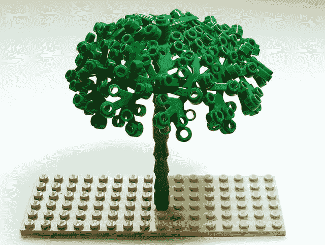

# 带决策树的 R 中非线性回归

> 原文：<https://machinelearningmastery.com/non-linear-regression-in-r-with-decision-trees/>

最后更新于 2020 年 8 月 15 日

在这篇文章中，你将发现 8 个非线性回归的方法，决策树在 r。

本文中的每个示例都使用了 r 附带的[数据集包](http://stat.ethz.ch/R-manual/R-devel/library/datasets/html/00Index.html)中提供的 [longley](http://stat.ethz.ch/R-manual/R-devel/library/datasets/html/longley.html) 数据集

longley 数据集描述了从 1947 年到 1962 年观察到的 7 个经济变量，用于预测每年的就业人数。

**用我的新书[用 R](https://machinelearningmastery.com/machine-learning-with-r/) 启动你的项目**，包括*一步一步的教程*和所有例子的 *R 源代码*文件。

我们开始吧。

[](https://machinelearningmastery.com/wp-content/uploads/2014/07/decision-tree.jpg)

决策树
图片作者[凯蒂·沃克](https://www.flickr.com/photos/eilonwy77/7229389076)，版权所有

## 分类和回归树

分类和回归树(CART)根据最小化损失函数的值(如误差平方和)分割属性。

下面的方法演示了 longley 数据集上的递归分区决策树方法。

```py
# load the package
library(rpart)
# load data
data(longley)
# fit model
fit <- rpart(Employed~., data=longley, control=rpart.control(minsplit=5))
# summarize the fit
summary(fit)
# make predictions
predictions <- predict(fit, longley[,1:6])
# summarize accuracy
mse <- mean((longley$Employed - predictions)^2)
print(mse)
```

了解更多关于 **rpart** 功能和 [rpart 包](https://cran.r-project.org/web/packages/rpart/index.html)的信息。

## 条件决策树

条件决策树是使用统计测试来选择属性上的分割点而不是损失函数来创建的。

下面的方法演示了 longley 数据集上的条件推理树方法。

```py
# load the package
library(party)
# load data
data(longley)
# fit model
fit <- ctree(Employed~., data=longley, controls=ctree_control(minsplit=2,minbucket=2,testtype="Univariate"))
# summarize the fit
summary(fit)
# make predictions
predictions <- predict(fit, longley[,1:6])
# summarize accuracy
mse <- mean((longley$Employed - predictions)^2)
print(mse)
```

了解更多关于**携程**功能和[派对套餐](https://cran.r-project.org/web/packages/party/index.html)的信息。

## 模型树

模型树创建决策树，并在每个节点使用线性模型进行预测，而不是使用平均值。

下面的方法演示了 longley 数据集上的 M5P 模型树方法。

```py
# load the package
library(RWeka)
# load data
data(longley)
# fit model
fit <- M5P(Employed~., data=longley)
# summarize the fit
summary(fit)
# make predictions
predictions <- predict(fit, longley[,1:6])
# summarize accuracy
mse <- mean((longley$Employed - predictions)^2)
print(mse)
```

了解更多关于 **M5P** 功能和 [RWeka 套装](https://cran.r-project.org/web/packages/RWeka/index.html)的信息。

## 规则系统

可以通过从决策树中提取和简化规则来创建规则系统。

下面的方法演示了 longley 数据集上的 M5Rules 规则系统。

```py
# load the package
library(RWeka)
# load data
data(longley)
# fit model
fit <- M5Rules(Employed~., data=longley)
# summarize the fit
summary(fit)
# make predictions
predictions <- predict(fit, longley[,1:6])
# summarize accuracy
mse <- mean((longley$Employed - predictions)^2)
print(mse)
```

了解更多关于 **M5Rules** 功能和 [RWeka 套装](https://cran.r-project.org/web/packages/RWeka/index.html)的信息。

## 装袋车

自举聚合(Bagging)是一种集成方法，它从同一数据集的不同子样本创建多个相同类型的模型。来自每个单独模型的预测被组合在一起以提供更好的结果。这种方法对于像决策树这样的高方差方法特别有效。

下面的方法演示了将 bagging 应用于递归分区决策树。

```py
# load the package
library(ipred)
# load data
data(longley)
# fit model
fit <- bagging(Employed~., data=longley, control=rpart.control(minsplit=5))
# summarize the fit
summary(fit)
# make predictions
predictions <- predict(fit, longley[,1:6])
# summarize accuracy
mse <- mean((longley$Employed - predictions)^2)
print(mse)
```

了解更多关于**装袋**功能和[智能包装](https://cran.r-project.org/web/packages/ipred/index.html)的信息。

## 随机森林

随机森林是决策树装袋的变体，它通过将每个决策点的树的可用属性减少为随机子样本。这进一步增加了树的方差，需要更多的树。

```py
# load the package
library(randomForest)
# load data
data(longley)
# fit model
fit <- randomForest(Employed~., data=longley)
# summarize the fit
summary(fit)
# make predictions
predictions <- predict(fit, longley[,1:6])
# summarize accuracy
mse <- mean((longley$Employed - predictions)^2)
print(mse)
```

了解更多关于**随机森林**功能和[随机森林套装](https://cran.r-project.org/web/packages/randomForest/index.html)的信息。

## 梯度增压机

Boosting 是一种集成方法，开发用于分类以减少偏差，其中添加模型来学习现有模型中的错误分类错误。它以梯度增强机器(GBM)的形式进行了推广和调整，用于 CART 决策树的分类和回归。

```py
# load the package
library(gbm)
# load data
data(longley)
# fit model
fit <- gbm(Employed~., data=longley, distribution="gaussian")
# summarize the fit
summary(fit)
# make predictions
predictions <- predict(fit, longley)
# summarize accuracy
mse <- mean((longley$Employed - predictions)^2)
print(mse)
```

了解更多关于 **gbm** 功能和 [gbm 包](https://cran.r-project.org/web/packages/gbm/index.html)的信息。

## 立体派的

立体决策树是另一种集成方法。它们像模型树一样构建，但是包含一个类似助推的过程，叫做委员会，它是类似规则的模型。

```py
# load the package
library(Cubist)
# load data
data(longley)
# fit model
fit <- cubist(longley[,1:6], longley[,7])
# summarize the fit
summary(fit)
# make predictions
predictions <- predict(fit, longley[,1:6])
# summarize accuracy
mse <- mean((longley$Employed - predictions)^2)
print(mse)
```

了解更多关于**立体书**功能和[立体书套装](https://cran.r-project.org/web/packages/Cubist/index.html)的信息。

## 摘要

在这篇文章中，你发现了 r 中非线性回归决策树的 8 个方法。每个方法都可以复制粘贴到你自己的工作空间中，并根据你的需要进行修改。

有关更多信息，请参见库恩和约翰逊的[应用预测建模](https://amzn.to/3iFPHhq)第 8 章，该章为初学者提供了关于带有 R 的决策树的非线性回归的出色介绍。