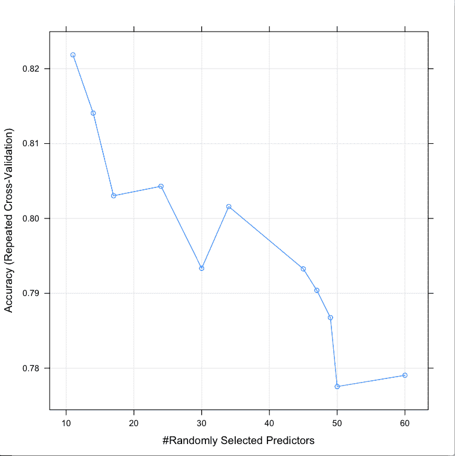
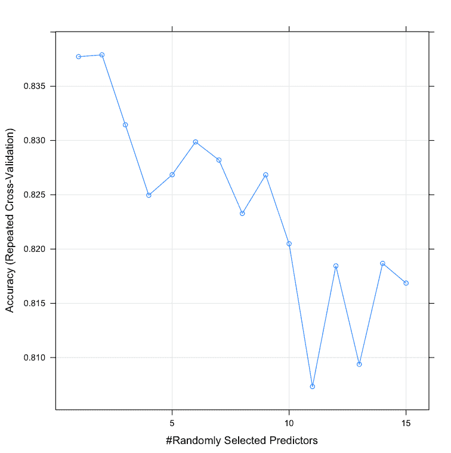
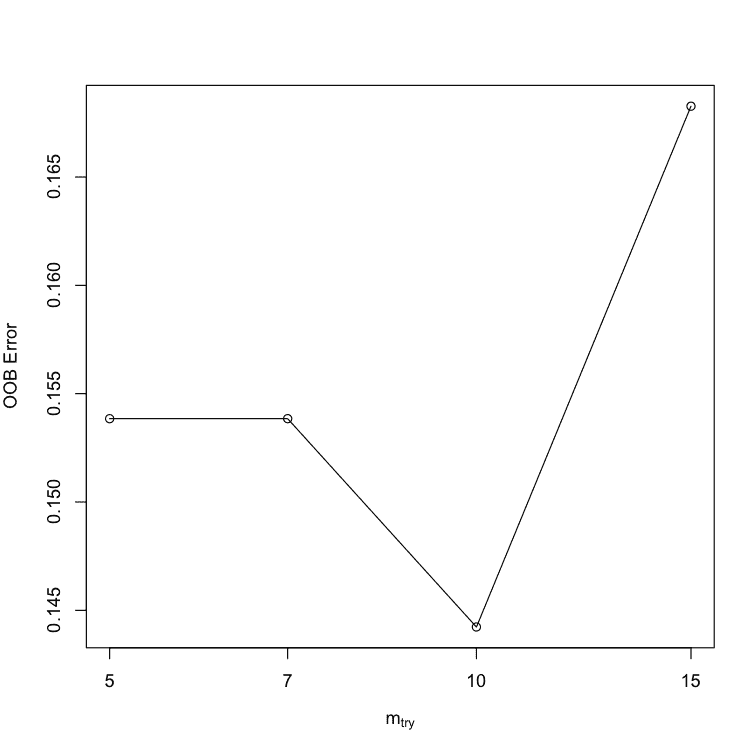

# 调整 R(随机森林案例研究)中的机器学习算法

> 原文：<https://machinelearningmastery.com/tune-machine-learning-algorithms-in-r/>

最后更新于 2020 年 7 月 31 日

很难为你的问题找到一个好的机器学习算法。但是一旦你这样做了，你如何从中获得最好的表现。

在这篇文章中，你将发现三种方法，你可以在 r。

用 r 中的工作代码一步一步地浏览一个真实的例子。使用代码作为模板，在您当前或下一个机器学习项目中调整机器学习算法。

**用我的新书[用 R](https://machinelearningmastery.com/machine-learning-with-r/) 启动你的项目**，包括*一步一步的教程*和所有例子的 *R 源代码*文件。

我们开始吧。


在 r . r .
调谐随机森林[苏姗娜·尼尔森](https://www.flickr.com/photos/infomastern/17229720529/)摄，版权所有。

## 从顶级算法中获得更高的精度

很难为您的数据集找到一个好的甚至表现良好的机器学习算法。

通过一个反复试验的过程，你可以确定一个显示有希望的算法的简短列表，但是你怎么知道哪个是最好的。

您可以为每个算法使用默认参数。这些参数是由书本和研究论文中的经验法则或建议设定的。但是你怎么知道你正在解决的算法显示出了最好的表现呢？

### 使用算法调整搜索算法参数

答案是为你的问题寻找好的甚至最好的算法参数组合。

您需要一个过程来调整每个机器学习算法，以知道您正在从中获得最大收益。调整后，您可以对候选列表中的算法进行客观的比较。

搜索算法参数可能很困难，有许多选项，例如:

*   要调什么参数？
*   用什么搜索方法定位好的算法参数？
*   使用什么测试选项来限制训练数据的过度拟合？

## 调整机器学习算法

您可以在 r 中调整您的机器学习算法参数。

通常，本节中的方法假设您已经有了一个针对您的问题的表现良好的机器学习算法的简短列表，您希望从中获得更好的表现。

创建表现良好的算法候选列表的一个很好的方法是使用脱字符号包。

有关如何使用插入符号包的更多信息，请参见:

*   [用于应用预测建模的脱字符号包](https://machinelearningmastery.com/caret-r-package-for-applied-predictive-modeling/)

在本节中，我们将了解三种方法，您可以在 R 中使用它们来调整算法参数:

1.  使用插入符号 R 包。
2.  使用算法自带的工具。
3.  设计自己的参数搜索。

在开始调优之前，让我们设置环境和测试数据。

### 测试设置

让我们快速看一下数据和我们将在这个案例研究中使用的算法。

#### 测试数据集

在本案例研究中，我们将使用声纳测试问题。

这是来自 [UCI 机器学习资源库](https://machinelearningmastery.com/practice-machine-learning-with-small-in-memory-datasets-from-the-uci-machine-learning-repository/)的数据集，描述了雷达回波是从金属还是岩石上反弹回来的。

这是一个二元分类问题，有 60 个数字输入特征来描述雷达回波的特性。你可以在这里了解更多这个问题:[声纳数据集](https://archive.ics.uci.edu/ml/datasets/Connectionist+Bench+(Sonar,+Mines+vs.+Rocks))。您可以在此处看到该数据集的世界级发布结果:[声纳数据集的精度](http://www.is.umk.pl/projects/datasets.html#Sonar)。

这并不是一个特别困难的数据集，但是对于这个例子来说，它并不平凡而且有趣。

让我们从 *mlbench* 包加载所需的库和数据集。

```py
library(randomForest)
library(mlbench)
library(caret)

# Load Dataset
data(Sonar)
dataset <- Sonar
x <- dataset[,1:60]
y <- dataset[,61]
```

#### 测试算法

我们将使用流行的[随机森林](https://machinelearningmastery.com/random-forest-ensemble-in-python/)算法作为我们算法调整的主题。

随机森林不一定是这个数据集的最佳算法，但它是一个非常受欢迎的算法，毫无疑问，您会发现在自己的机器学习工作中，调整它是一个有用的练习。

在调整算法时，很好地理解您的算法非常重要，这样您就可以知道哪些参数会影响您正在创建的模型。

在本案例研究中，我们将坚持调整两个参数，即 *mtry* 和 *ntree* 参数，它们对我们的随机森林模型有以下影响。还有许多其他参数，但这两个参数可能是最有可能对您的最终精度产生最大影响的。

直接从帮助页面获取 R:

*   **mtry** :每次分割时随机抽样作为候选的变量数量。
*   **ntree** :要生长的树木数量。

让我们通过使用每个参数的推荐默认值和*mtry = floor(sqrt(ncol(x)))*或 mtry=7 和 ntree=500 来创建一个比较基线。

```py
# Create model with default paramters
control <- trainControl(method="repeatedcv", number=10, repeats=3)
seed <- 7
metric <- "Accuracy"
set.seed(seed)
mtry <- sqrt(ncol(x))
tunegrid <- expand.grid(.mtry=mtry)
rf_default <- train(Class~., data=dataset, method="rf", metric=metric, tuneGrid=tunegrid, trControl=control)
print(rf_default)
```

我们可以看到我们的估计准确率为 81.3%。

```py
Resampling results

  Accuracy   Kappa      Accuracy SD  Kappa SD 
  0.8138384  0.6209924  0.0747572    0.1569159
```

### 1.使用插入符号调谐

R 中的脱字符号包为调整机器学习算法参数提供了极好的工具。

并非所有的机器学习算法都可以在脱字符号中进行调整。参数的选择留给包的开发者，即 Max Khun。只有那些具有较大影响的算法参数(例如，在 Khun 看来确实需要调整)才可在插入符号中进行调整。

因此，插入符号中只有 *mtry* 参数可用于调谐。原因是它对最终精度的影响，并且它必须根据经验为数据集找到。

*ntree* 参数的不同之处在于，它可以随您的喜好而变大，并在某种程度上继续提高精度。它不太难调整，也不太重要，可能比任何东西都更受可用计算时间的限制。

#### 随机搜索

我们可以使用的一种搜索策略是尝试一定范围内的随机值。

如果我们不确定值可能是多少，并且想要克服设置参数时可能存在的任何偏差(如上面建议的等式)，这可能是件好事。

让我们尝试使用插入符号随机搜索 *mtry* :

```py
# Random Search
control <- trainControl(method="repeatedcv", number=10, repeats=3, search="random")
set.seed(seed)
mtry <- sqrt(ncol(x))
rf_random <- train(Class~., data=dataset, method="rf", metric=metric, tuneLength=15, trControl=control)
print(rf_random)
plot(rf_random)
```

注意，我们使用的测试工具类似于我们用来抽查算法的工具。10 倍交叉验证和 3 次重复都会减慢搜索过程，但目的是限制和减少训练集的过度拟合。它不会完全消除过度拟合。如果你有多余的数据，保留一个用于最终检查的验证集是个好主意。

```py
Resampling results across tuning parameters:

  mtry  Accuracy   Kappa      Accuracy SD  Kappa SD 
  11    0.8218470  0.6365181  0.09124610   0.1906693
  14    0.8140620  0.6215867  0.08475785   0.1750848
  17    0.8030231  0.5990734  0.09595988   0.1986971
  24    0.8042929  0.6002362  0.09847815   0.2053314
  30    0.7933333  0.5798250  0.09110171   0.1879681
  34    0.8015873  0.5970248  0.07931664   0.1621170
  45    0.7932612  0.5796828  0.09195386   0.1887363
  47    0.7903896  0.5738230  0.10325010   0.2123314
  49    0.7867532  0.5673879  0.09256912   0.1899197
  50    0.7775397  0.5483207  0.10118502   0.2063198
  60    0.7790476  0.5513705  0.09810647   0.2005012
```

我们可以看到，mtry 的最准确值是 11，准确率为 82.1%。



使用随机搜索调整随机森林参数

#### 网格搜索

另一种搜索是定义一个算法参数网格来尝试。

网格的每个轴都是一个算法参数，网格中的点是参数的特定组合。因为我们只调整一个参数，所以网格搜索是通过候选值向量的线性搜索。

```py
control <- trainControl(method="repeatedcv", number=10, repeats=3, search="grid")
set.seed(seed)
tunegrid <- expand.grid(.mtry=c(1:15))
rf_gridsearch <- train(Class~., data=dataset, method="rf", metric=metric, tuneGrid=tunegrid, trControl=control)
print(rf_gridsearch)
plot(rf_gridsearch)
```

我们可以看到，mtry 的最准确值是 2，准确率为 83.78%。

```py
Resampling results across tuning parameters:

  mtry  Accuracy   Kappa      Accuracy SD  Kappa SD 
   1    0.8377273  0.6688712  0.07154794   0.1507990
   2    0.8378932  0.6693593  0.07185686   0.1513988
   3    0.8314502  0.6564856  0.08191277   0.1700197
   4    0.8249567  0.6435956  0.07653933   0.1590840
   5    0.8268470  0.6472114  0.06787878   0.1418983
   6    0.8298701  0.6537667  0.07968069   0.1654484
   7    0.8282035  0.6493708  0.07492042   0.1584772
   8    0.8232828  0.6396484  0.07468091   0.1571185
   9    0.8268398  0.6476575  0.07355522   0.1529670
  10    0.8204906  0.6346991  0.08499469   0.1756645
  11    0.8073304  0.6071477  0.09882638   0.2055589
  12    0.8184488  0.6299098  0.09038264   0.1884499
  13    0.8093795  0.6119327  0.08788302   0.1821910
  14    0.8186797  0.6304113  0.08178957   0.1715189
  15    0.8168615  0.6265481  0.10074984   0.2091663
```



使用网格 Search.png 调整随机森林参数

### 2.使用算法工具进行调整

一些算法提供了调整算法参数的工具。

例如，random forest 包中的随机森林算法实现提供了 *tuneRF()* 函数，该函数在给定数据的情况下搜索最佳 *mtry* 值。

```py
# Algorithm Tune (tuneRF)
set.seed(seed)
bestmtry <- tuneRF(x, y, stepFactor=1.5, improve=1e-5, ntree=500)
print(bestmtry)
```

可以看到 *mtry* 最准确的值是 10，OOBError 为 0.1442308。

这与我们在上面的插入符号重复交叉验证实验中看到的不太匹配，其中 *mtry=10* 给出的准确率为 82.04%。然而，这是调整算法的另一种方法。

```py
       mtry  OOBError
5.OOB     5 0.1538462
7.OOB     7 0.1538462
10.OOB   10 0.1442308
15.OOB   15 0.1682692
```



使用调谐射频调谐随机森林参数

### 3.创建自己的参数搜索

通常，您希望搜索必须调整的参数(由插入符号处理)和需要针对数据集进行更一般的缩放或调整的参数。

你必须精心设计自己的参数搜索。

我推荐的两个流行选项是:

1.  **手动调整**:编写 R 代码来创建大量模型，并使用插入符号比较它们的准确性
2.  **扩展插入符号**:为插入符号创建一个扩展，为要调整的算法向插入符号添加附加参数。

#### 手动调谐

我们希望继续使用插入符号，因为它提供了与我们以前模型的直接比较点(苹果对苹果，甚至相同的数据分割)，并且因为我们喜欢重复的交叉验证测试工具，因为它降低了过度拟合的严重性。

一种方法是为我们的算法创建许多插入符号模型，并手动将不同的参数直接传递给算法。让我们看一个例子，在保持 *mtry* 不变的情况下，这样做是为了评估 *ntree* 的不同值。

```py
# Manual Search
control <- trainControl(method="repeatedcv", number=10, repeats=3, search="grid")
tunegrid <- expand.grid(.mtry=c(sqrt(ncol(x))))
modellist <- list()
for (ntree in c(1000, 1500, 2000, 2500)) {
	set.seed(seed)
	fit <- train(Class~., data=dataset, method="rf", metric=metric, tuneGrid=tunegrid, trControl=control, ntree=ntree)
	key <- toString(ntree)
	modellist[[key]] <- fit
}
# compare results
results <- resamples(modellist)
summary(results)
dotplot(results)
```

你可以看到 *ntree* 最准确的值可能是 2000 年，平均准确率为 82.02%(比我们第一次使用默认 mtry 值的实验提高了一倍)。

这个结果也许暗示了 ntree 在 2000 到 2500 之间的最佳值。还要注意，我们将 mtry 保持在默认值。我们可以用上面实验中可能更好的 *mtry=2* 重复实验，或者尝试 ntree 和 mtry 的组合，以防它们有交互作用。

```py
Models: 1000, 1500, 2000, 2500 
Number of resamples: 30 

Accuracy 
      Min. 1st Qu. Median   Mean 3rd Qu.   Max. NA's
1000 0.600  0.8024 0.8500 0.8186  0.8571 0.9048    0
1500 0.600  0.8024 0.8095 0.8169  0.8571 0.9500    0
2000 0.619  0.8024 0.8095 0.8202  0.8620 0.9048    0
2500 0.619  0.8000 0.8095 0.8201  0.8893 0.9091    0
```


手动调整随机森林参数

#### 扩展插入符号

另一种方法是为脱字符号创建一个“新”算法来支持。

这与您正在使用的随机森林算法相同，只是进行了修改，使其支持多个参数的多次调整。

这种方法的一个风险是，对算法的脱字符号本地支持有额外的或花哨的代码包装它，微妙但重要的是改变它的行为。您可能需要在自定义算法支持下重复之前的实验。

我们可以通过定义一个列表来定义自己的算法，以便在脱字符号中使用，该列表包含脱字符号包要查找的许多自定义命名元素，例如如何适应和如何预测。下面是自定义随机森林算法的定义，该算法与同时接受 mtry 和 ntree 参数的脱字符号一起使用。

```py
customRF <- list(type = "Classification", library = "randomForest", loop = NULL)
customRF$parameters <- data.frame(parameter = c("mtry", "ntree"), class = rep("numeric", 2), label = c("mtry", "ntree"))
customRF$grid <- function(x, y, len = NULL, search = "grid") {}
customRF$fit <- function(x, y, wts, param, lev, last, weights, classProbs, ...) {
  randomForest(x, y, mtry = param$mtry, ntree=param$ntree, ...)
}
customRF$predict <- function(modelFit, newdata, preProc = NULL, submodels = NULL)
   predict(modelFit, newdata)
customRF$prob <- function(modelFit, newdata, preProc = NULL, submodels = NULL)
   predict(modelFit, newdata, type = "prob")
customRF$sort <- function(x) x[order(x[,1]),]
customRF$levels <- function(x) x$classes
```

现在，让我们在对插入符号训练函数的调用中使用这个自定义列表，并尝试为 ntree 和 mtry 调整不同的值。

```py
# train model
control <- trainControl(method="repeatedcv", number=10, repeats=3)
tunegrid <- expand.grid(.mtry=c(1:15), .ntree=c(1000, 1500, 2000, 2500))
set.seed(seed)
custom <- train(Class~., data=dataset, method=customRF, metric=metric, tuneGrid=tunegrid, trControl=control)
summary(custom)
plot(custom)
```

这可能需要一两分钟来运行。

可以看到 *ntree* 和 *mtry* 最准确的数值是 2000 和 2，准确率为 84.43%。

我们也许确实看到了树的数量和树的价值之间的一些交互作用。然而，如果我们选择了使用网格搜索 2 找到的最佳值 *mtry* (上图)和使用网格搜索 2000 找到的最佳值 *ntree* (上图)，在这种情况下，我们将会达到在这个组合搜索中找到的相同的调优水平。这是一个很好的证实。

```py
  mtry  ntree  Accuracy   Kappa      Accuracy SD  Kappa SD 
   1    1000   0.8442424  0.6828299  0.06505226   0.1352640
   1    1500   0.8394805  0.6730868  0.05797828   0.1215990
   1    2000   0.8314646  0.6564643  0.06630279   0.1381197
   1    2500   0.8379654  0.6693773  0.06576468   0.1375408
   2    1000   0.8313781  0.6562819  0.06909608   0.1436961
   2    1500   0.8427345  0.6793793  0.07005975   0.1451269
   2    2000   0.8443218  0.6830115  0.06754346   0.1403497
   2    2500   0.8428066  0.6791639  0.06488132   0.1361329
   3    1000   0.8350216  0.6637523  0.06530816   0.1362839
   3    1500   0.8347908  0.6633405  0.06836512   0.1418106
   3    2000   0.8428066  0.6800703  0.06643838   0.1382763
   3    2500   0.8365296  0.6668480  0.06401429   0.1336583
   4    1000   0.8316955  0.6574476  0.06292132   0.1317857
   4    1500   0.8331241  0.6605244  0.07543919   0.1563171
   4    2000   0.8378860  0.6699428  0.07147459   0.1488322
   4    2500   0.8315368  0.6568128  0.06981259   0.1450390
   5    1000   0.8284343  0.6505097  0.07278539   0.1516109
   5    1500   0.8283622  0.6506604  0.07166975   0.1488037
   5    2000   0.8219336  0.6375155  0.07548501   0.1564718
   5    2500   0.8315440  0.6570792  0.07067743   0.1472716
   6    1000   0.8203391  0.6341073  0.08076304   0.1689558
   6    1500   0.8186797  0.6302188  0.07559694   0.1588256
   6    2000   0.8187590  0.6310555  0.07081621   0.1468780
   6    2500   0.8153463  0.6230495  0.07728249   0.1623253
   7    1000   0.8217027  0.6367189  0.07649651   0.1606837
   7    1500   0.8282828  0.6503808  0.06628953   0.1381925
   7    2000   0.8108081  0.6147563  0.07605609   0.1573067
   7    2500   0.8250361  0.6437397  0.07737756   0.1602434
   8    1000   0.8187590  0.6314307  0.08378631   0.1722251
   8    1500   0.8201876  0.6335679  0.07380001   0.1551340
   8    2000   0.8266883  0.6472907  0.06965118   0.1450607
   8    2500   0.8251082  0.6434251  0.07745300   0.1628087
   9    1000   0.8121717  0.6177751  0.08218598   0.1709987
   9    1500   0.8184488  0.6300547  0.08077766   0.1674261
   9    2000   0.8247980  0.6429315  0.07260439   0.1513512
   9    2500   0.8186003  0.6302674  0.07356916   0.1547231
  10    1000   0.8235209  0.6407121  0.07991334   0.1656978
  10    1500   0.8125541  0.6183581  0.06851683   0.1421993
  10    2000   0.8187518  0.6308120  0.08538951   0.1782368
  10    2500   0.8169336  0.6263682  0.07847066   0.1649216
  11    1000   0.8203463  0.6341158  0.07222587   0.1497558
  11    1500   0.8153463  0.6235878  0.09131621   0.1904418
  11    2000   0.8234416  0.6402906  0.07586609   0.1576765
  11    2500   0.8154906  0.6236875  0.07485835   0.1576576
  12    1000   0.8201948  0.6336913  0.08672139   0.1806589
  12    1500   0.8139105  0.6206994  0.08638618   0.1804780
  12    2000   0.8137590  0.6204461  0.07771424   0.1629707
  12    2500   0.8201876  0.6333194  0.07799832   0.1636237
  13    1000   0.8123232  0.6173280  0.09299062   0.1936232
  13    1500   0.8108802  0.6142721  0.08416414   0.1760527
  13    2000   0.8154257  0.6236191  0.08079923   0.1693634
  13    2500   0.8106566  0.6138814  0.08074394   0.1687437
  14    1000   0.8171645  0.6270292  0.08608806   0.1799346
  14    1500   0.8139033  0.6207263  0.08522205   0.1781396
  14    2000   0.8170924  0.6276518  0.08766645   0.1822010
  14    2500   0.8137590  0.6207371  0.08353328   0.1746425
  15    1000   0.8091486  0.6110154  0.08455439   0.1745129
  15    1500   0.8109668  0.6154780  0.08928549   0.1838700
  15    2000   0.8059740  0.6047791  0.08829659   0.1837809
  15    2500   0.8122511  0.6172771  0.08863418   0.1845635
```


随机森林参数的自定义调整

有关在插入符号中定义自定义算法的更多信息，请参见:

*   [在列车上使用自己的模型](https://topepo.github.io/caret/custom_models.html)

要查看脱字符号使用的随机林的实际包装，您可以将其用作起点，请参见:

*   [插入符号列车的随机森林包装器](https://github.com/topepo/caret/blob/master/models/files/rf.R)

## 摘要

在这篇文章中，您发现了调整表现良好的机器学习算法以获得最佳表现的重要性。

您在 R 中完成了一个调优随机森林算法的示例，并发现了三种调优表现良好的算法的方法。

1.  使用插入符号 R 包。
2.  使用算法自带的工具。
3.  设计自己的参数搜索。

你现在有一个工作的例子和模板，你可以用它来调整你当前或下一个项目中的机器学习算法。

## 下一步

完成这篇文章中的例子。

1.  打开你的 R 交互环境。
2.  键入或复制粘贴上面的示例代码。
3.  慢慢来，了解发生了什么，使用帮助阅读函数。

你有什么问题吗？在评论中提问，我会尽力回答。