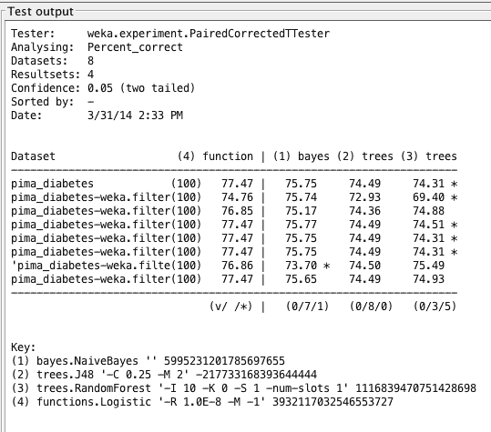
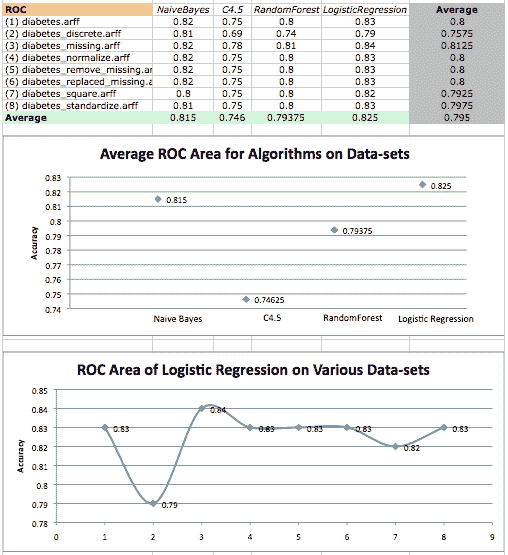
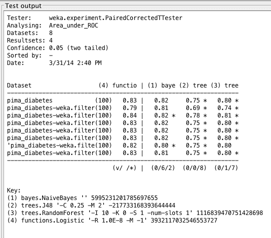
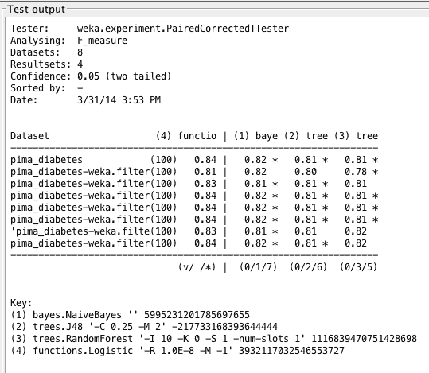

# 案例研究:预测五年内糖尿病的发作(第 2 部分，共 3 部分)

> 原文：<https://machinelearningmastery.com/case-study-predicting-the-onset-of-diabetes-within-five-years-part-2-of-3/>

最后更新于 2019 年 8 月 22 日

这是我一直在辅导的聪明的年轻学生伊戈尔·什瓦尔策尔的客座博文。

这篇文章是关于建模著名的[皮马印第安人糖尿病数据集](https://archive.ics.uci.edu/ml/datasets/Pima+Indians+Diabetes)的 3 部分系列文章的第 2 部分(更新:[从这里下载](https://raw.githubusercontent.com/jbrownlee/Datasets/master/pima-indians-diabetes.data.csv))。在[第 1 部分](https://machinelearningmastery.com/case-study-predicting-the-onset-of-diabetes-within-five-years-part-1-of-3/ "Case Study: Predicting the Onset of Diabetes Within Five Years (part 1 of 3)")中，我们定义了问题并查看了数据集，根据我们在数据中注意到的模式描述了观察结果。

在本文中，我们将介绍方法论、抽查算法，并回顾初步结果。

**用我的新书[用 Weka](https://machinelearningmastery.com/machine-learning-mastery-weka/) 启动你的项目**，包括*的分步教程*和清晰的*截图*所有示例。

## 方法学

研究中的分析和数据处理使用[韦卡机器学习软件](https://machinelearningmastery.com/design-and-run-your-first-experiment-in-weka/ "Design and Run your First Experiment in Weka")进行。十倍[交叉验证](https://machinelearningmastery.com/how-to-choose-the-right-test-options-when-evaluating-machine-learning-algorithms/ "How To Choose The Right Test Options When Evaluating Machine Learning Algorithms")用于实验。其工作原理如下:

*   从给定数据生成 10 个大小相等的数据集
*   将每套分为两组:90%用于培训，10%用于测试。
*   从 90%的标记数据中生成一个带有算法的分类器，并将其应用于集合 1 的 10%测试数据。
*   继续第 2 集到第 10 集
*   对从 10 个相同大小(训练和测试)的集合中产生的 10 个分类器的表现进行平均

## 算法

在本研究中，我们将研究 4 种算法的表现:

*   逻辑回归
*   朴素贝叶斯(约翰·T2·兰利，1995 年)
*   随机森林( [Breiman，2001](http://oz.berkeley.edu/~breiman/randomforest2001.pdf) )
*   C4.5 ( [昆兰，1993](https://link.springer.com/article/10.1007%2FBF00993309#page-1) )

这些算法是相关的，因为它们对数据集执行分类，适当地处理缺失或错误的数据，并且在专注于医学诊断的科学文章中具有某种意义，参见论文[医学诊断的机器学习:历史、现状和前景](http://citeseerx.ist.psu.edu/viewdoc/download?doi=10.1.1.96.184&rep=rep1&type=pdf)和[医学诊断中的人工神经网络](http://jab.zsf.jcu.cz//11_2/havel.pdf)。

逻辑回归是一种概率统计分类器，用于根据一个或多个预测变量预测分类因变量的结果。该算法测量因变量和一个或多个自变量之间的关系。

朴素贝叶斯是基于贝叶斯定理的简单概率分类器，具有很强的独立性假设。贝叶斯定理如下:

贝叶斯定理

一般来说，我们可以通过观察事件的一些证据或概率来预测事件的结果。我们掌握的事件发生的证据越多，我们就越能支持它的预测。有时，我们拥有的证据可能依赖于其他事件，这使得我们的预测更加复杂。为了创建一个简化的(或“天真的”)模型，我们假设特定事件的所有证据都是独立于任何其他证据的。

根据布瑞曼的说法，随机森林创造了一种对特定结果进行投票的树的组合。森林选择包含最多投票的分类。这个算法令人兴奋，因为它是一个 bagging 算法，并且它[可以通过在不同的训练数据子集上训练算法来潜在地改善我们的结果](https://machinelearningmastery.com/how-to-improve-machine-learning-results/)。随机森林学习者的成长方式如下:

*   从训练集中抽样替换成员形成输入数据。三分之一的训练集不存在，并且被认为是“现成的”
*   为每棵树选择随机数量的属性，这些属性形成节点和叶子。
*   每棵树都在不修剪的情况下尽可能长得大(去掉那些在分类中没有什么意义的部分)。
*   然后用袋外数据评估每棵树和整个森林的准确性。

C4.5(在 Weka 中也称为“J48”)是一种用于生成分类决策树的算法。C4.5 中的决策树以下列方式生长:

1.  在每个节点上，选择最能有效地将样本分成不同类别的子集的数据。
2.  设置具有最高归一化信息增益的属性。
3.  使用此属性创建决策节点并进行预测。

在这种情况下，[信息增益](https://en.wikipedia.org/wiki/Information_gain_ratio)是两个概率分布两个属性之差的度量。让这个算法对我们有帮助的是，它解决了[昆兰早期算法 ID3 可能遗漏的几个问题](http://www2.cs.uregina.ca/~dbd/cs831/notes/ml/dtrees/c4.5/tutorial.html)。根据昆兰的说法，这些包括但不限于:

*   避免数据过拟合(决定决策树的深度)。
*   减少错误修剪。
*   规则后修剪。
*   处理连续属性(例如，温度)
*   选择合适的属性选择度量。
*   处理缺少属性值的训练数据。
*   处理不同成本的属性。
*   提高计算效率。

## 估价

在数据集上执行[交叉验证](https://machinelearningmastery.com/how-to-choose-the-right-test-options-when-evaluating-machine-learning-algorithms/ "How To Choose The Right Test Options When Evaluating Machine Learning Algorithms")后，我将通过三个指标的镜头重点分析算法:[精度、ROC 面积和 F1 度量](https://machinelearningmastery.com/classification-accuracy-is-not-enough-more-performance-measures-you-can-use/)。

基于测试，准确性将决定算法正确分类的实例的百分比。这是我们分析的一个重要开始，因为它将为我们提供每种算法的表现基线。

[ROC 曲线](https://en.wikipedia.org/wiki/Roc_curve)是通过绘制真阳性率与假阳性率的比值来创建的。最佳分类器的 ROC 面积值接近 1.0，0.5 相当于随机猜测。我相信，看看我们的算法如何在这个规模上进行预测将会非常有趣。

最后，F1 测量将是分类的重要统计分析，因为它将测量测试精度。F1 measure 使用**精度**(真阳性数除以真阳性和假阳性数)和**召回**(真阳性数除以真阳性数和假阴性数)来输出 0 到 1 之间的值，其中值越高意味着表现越好。

我坚信，所有算法的表现都将相当相似，因为我们处理的是一个小数据集进行分类。然而，这 4 种算法都应该比给出大约 65%准确度的类基线预测表现得更好。

## 结果

为了对各种算法进行严格的分析，我使用[韦卡实验者](https://machinelearningmastery.com/design-and-run-your-first-experiment-in-weka/ "Design and Run your First Experiment in Weka")对所有创建的数据集进行了表现评估。结果如下所示。

糖尿病数据集上的算法分类精度平均值和各种数据集上逻辑回归表现的散点图。

这里的数据表明，逻辑回归在标准的、未改变的数据集上表现最好，而随机森林表现最差。然而，任何算法之间都没有明显的赢家。

平均而言，标准化和规范化数据集似乎具有更高的精度，而离散数据集的精度最差。这可能是因为标称值不允许对我考虑的算法进行准确预测。

Weka Experimenter 输出将逻辑回归的表现与其他算法的表现进行比较。

归一化数据集上的尺度调整可能会略微改善结果。然而，转换和重新调整数据并没有显著改善结果，因此可能没有暴露数据中的任何结构。

我们还可以通过与第一列中的值(逻辑回归的准确性)相比具有统计学显著差异的值来看到星号(*)。Weka 通过使用标准 T-Test 或校正的重采样 T-Test 对方案进行成对比较，得出统计上无意义的结论，参见论文[对泛化误差的推断](https://link.springer.com/article/10.1023%2FA%3A1024068626366#page-2)。

算法在糖尿病数据集上的 ROC 面积平均值和在不同数据集上的 logistic 回归表现散点图

结果再次表明，物流出口表现最好，而 C4.5 表现最差。平均而言，校正缺失值的数据集表现最好，而离散数据集表现最差。

在这两种情况下，我们发现树算法在这个数据集上的表现都不好。事实上，C4.5 给出的所有结果(以及 RandomForest 给出的除一个结果之外的所有结果)与 LogisticRegression 给出的结果相比，具有统计学上的显著差异。

Weka Experimenter 输出将逻辑回归的 ROC 曲线面积与其他算法的 ROC 曲线面积进行比较。

这种较差的表现可能是树算法复杂的结果。测量因变量和自变量之间的关系可能是一个优势。此外，C4.5 可能没有为其分析选择正确的属性，因此恶化了基于最高信息增益的预测。

糖尿病数据集上的 F1 测量值和各种数据集上的逻辑回归 F1 测量的散点图。

在前两个分析中，我们发现朴素贝叶斯的表现紧跟在物流配送的表现之后。现在我们发现，除了一个结果之外，朴素贝叶斯的所有结果与逻辑推理给出的结果相比都有统计学上的显著差异。

Weka Experimenter 输出将逻辑回归的 F1 分数与其他算法的 F1 分数进行比较。

结果显示，物流出口表现最好，但差不了多少。这意味着在这种情况下，LogisticRegression 具有最准确的测试，并且在这个数据集上学习得相当好。回想一下 F1-measure 背后的计算，我们知道:

*   **回忆:** R = TP / (TP + FN)，
*   **精度:** P = TP / (TP + FP)，和
*   **F1-测量:** F1 = 2[ (R * P) / (R + P) ]，

其中 TP =真阳性，FP =假阳性，FN =假阴性。

然后，我们的结果表明，物流分离最大化了真阳性率，最小化了假阴性率和假阳性率。至于糟糕的表现，我被引导相信朴素贝叶斯所做的预测只是太“天真”了，因此算法过于自由地使用独立性。

我们可能需要更多的数据来为特定事件的发生提供更多的证据，这应该更好地支持它的预测。在这种情况下，树算法可能会因为其复杂性，或者仅仅因为选择不正确的属性进行分析而受到影响。对于更大的数据集来说，这可能不是什么大问题。

有趣的是，我们还发现，在*diabetes _ distributed . ARFF*数据集上，表现最好的算法 LogisticRegression 的表现最差。可以很有把握地假设，对于 LogisticRegression，所有的数据转换(除了*diabetes _ distributed . ARFF*)似乎都会产生更好的非常相似的结果，这一点通过每个散点图中的相似趋势非常明显！

接下来在[第 3 部分中，我们将研究分类精度的改进和结果的最终呈现](https://machinelearningmastery.com/case-study-predicting-the-onset-of-diabetes-within-five-years-part-3-of-3/ "Case Study: Predicting the Onset of Diabetes Within Five Years (part 3 of 3)")。