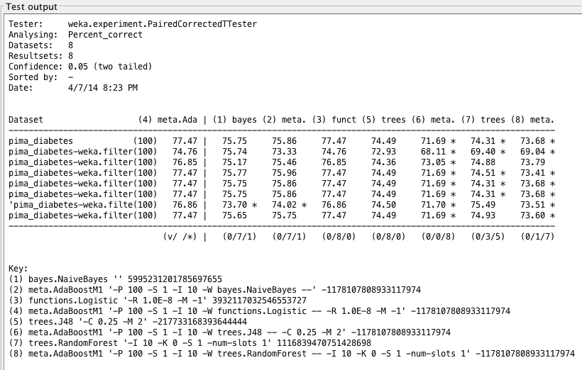
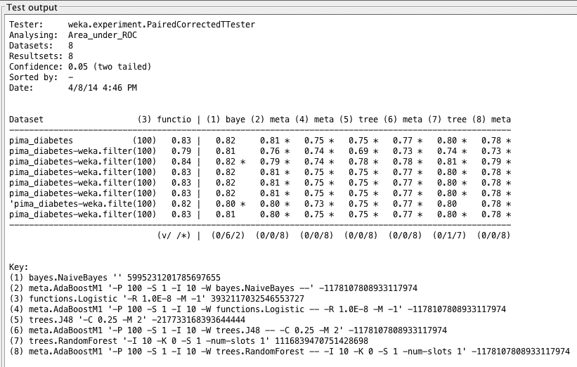
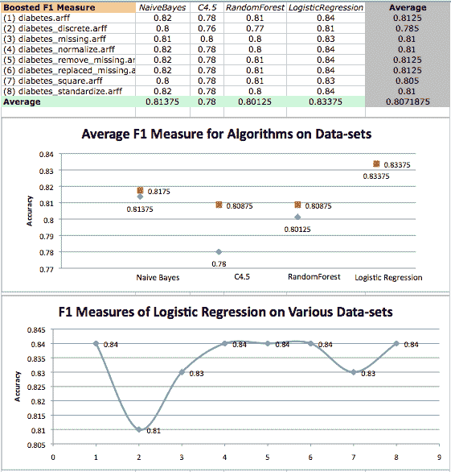
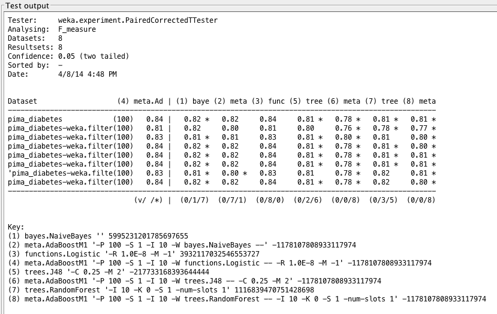
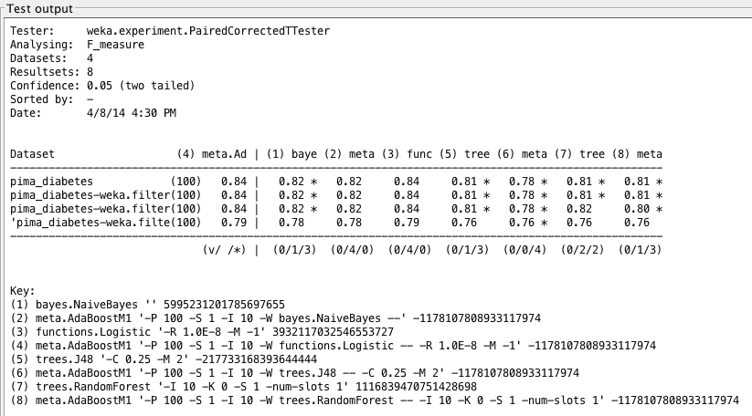

# 案例研究:预测五年内糖尿病的发作(第 3 部分，共 3 部分)

> 原文:[https://machinelearning master . com/案例研究-预测五年内糖尿病发作-三分之三/](https://machinelearningmastery.com/case-study-predicting-the-onset-of-diabetes-within-five-years-part-3-of-3/)

最后更新于 2019 年 8 月 22 日

这是我一直在辅导的聪明的年轻学生伊戈尔·什瓦尔策尔的客座博文。

这篇文章是关于模拟著名的[皮马印第安人糖尿病数据集](https://archive.ics.uci.edu/ml/datasets/Pima+Indians+Diabetes)的 3 部分系列文章的第 3 部分，该数据集将调查分类准确性的改进并呈现最终结果(更新:[从这里下载](https://raw.githubusercontent.com/jbrownlee/Datasets/master/pima-indians-diabetes.data.csv))。

在[第 1 部分](https://machinelearningmastery.com/case-study-predicting-the-onset-of-diabetes-within-five-years-part-1-of-3/ "Case Study: Predicting the Onset of Diabetes Within Five Years (part 1 of 3)")中，我们定义了问题并查看了数据集，根据我们在数据中注意到的模式描述了观察结果。在[第二部分](https://machinelearningmastery.com/case-study-predicting-the-onset-of-diabetes-within-five-years-part-2-of-3/ "Case Study: Predicting the Onset of Diabetes Within Five Years (part 2 of 3)")中，我们定义了实验方法并给出了初步结果。

**用我的新书[用 Weka](https://machinelearningmastery.com/machine-learning-mastery-weka/) 启动你的项目**，包括*的分步教程*和清晰的*截图*所有示例。

## 改善结果

为了提高结果，我们可以求助于[集成方法，比如增强](https://machinelearningmastery.com/improve-machine-learning-results-with-boosting-bagging-and-blending-ensemble-methods-in-weka/ "Improve Machine Learning Results with Boosting, Bagging and Blending Ensemble Methods in Weka")。Boosting 是一种集成方法，从基于训练数据准备的基本分类器开始。然后在它后面创建第二个分类器，以关注训练数据中第一个分类器出错的实例。

该过程继续添加分类器，直到达到模型数量或精度的极限。Weka 在 AdaBoostM1(自适应升压)算法中提供了升压功能。结果如下所示:

提高了糖尿病数据集上的算法精度平均值和各种数据集上逻辑回归性能的散点图。原始结果为红色，而增强结果为蓝色。

很明显，boosting 对 LogisticRegression 没有影响，但是明显恶化了树算法的性能。根据韦卡实验者的结果，与增强的 C4.5、随机森林和增强的随机森林给出的结果相比，增强的物流出口的性能具有统计学上的显著差异。

由于 RandomForest 已经包含了一种集成方法，即装袋，增加助推可能会导致过度拟合，因此可以解释表现不佳的原因。

Weka Experimenter 输出将增强逻辑回归的性能与其他算法的性能进行比较。

无论如何，我们仍然无法用性能最好的算法 LogisticRegression 超过 77.47%的准确率。这可能是由于数据的限制或交叉验证值低。我们发现，在某些情况下，例如使用 C4.5，执行 AdaBoost 后，准确率从 74.28%急剧下降到 71.4%。

接下来，我们将看看每个增强算法的 ROC 区域。

增强算法在糖尿病数据集上的 ROC 面积平均值和在各种数据集上的 logistic 回归性能散点图。原始结果为红色，而增强结果为蓝色。

我们可以看到散点图上的点形成了比较平滑的趋势。换句话说，数据点之间的差异较小。我们在这里的结果非常有趣:除了 C4.5 之外的所有增强算法都显示 ROC 面积的较小值。这意味着与其他增强的算法相比，增强的 C4.5 给出的假阳性稍少，而真阳性稍多。

Weka Experimenter 输出将逻辑回归的 ROC 曲线面积与其他算法的 ROC 曲线面积进行比较。

乍一看这似乎有点奇怪:提升 C4.5 会降低精度，但增加 ROC 面积。如果我们考虑到准确性实际上是真阳性和假阳性的总结，而 ROC 区域是命中率和虚警率的综合，那么差异就很明显了。无论哪种方式，我们发现增强的 C4.5 与 LogisticRegression(默认和增强形式)给出的结果相比，具有统计学上的显著差异。

最后，我们将看一看 F1 对增强算法的度量。

糖尿病数据集上的增强型 F1 测量值和各种数据集上的逻辑回归 F1 测量的散点图。原始结果为红色，而增强结果为蓝色。

我们再次发现，logisticreduction 表现相当不错，但在分析 F1 测度时，boosting 对 logisticreduction 没有影响。我们似乎已经突破了逻辑推理的极限，并再次看到它在统计上优于树算法。

Weka Experimenter 输出将 Boosted Logistic 回归的 F1 分数与其他算法的 F1 分数进行比较。

## 移除测试假设的属性

我们可能也有兴趣改变研究，使其非侵入性，因此只分析算法在四个属性上的性能:质量、皮肤、年龄和 pedi。这可能有助于允许医疗专业人员进行更大规模的糖尿病测试，并使测试更快。当然，有了这些优势，我们可能会失去一些准确性。

基于我们在散点图中看到的数据，我相信我们的算法在数据集上会表现得很好，但不如标准数据集。创建一个新的数据集(并将其命名为 diabetes _ noninvasive.arff)是检验我们自己对糖尿病发病假设的一种方法，即风险随着肥胖和年龄的增长而增加。以类似的方式，我能够使用 Weka Explorer 移除属性，然后使用 Weka Experimenter 分析算法性能。结果如下所示:

有创和无创糖尿病数据集上的算法精度平均值。非侵入性结果为红色，而原始结果为蓝色。

Weka Experimenter 输出将逻辑回归的性能与其他算法的性能进行比较。

通过所有指标，正如预测的那样，无创数据集没有提供非常准确的结果。我们发现类似的趋势，正如我们在早期的分析中所做的那样，即物流出口仍然表现得最准确。

算法 ROC 面积平均在侵入性和非侵入性糖尿病数据集。非侵入性结果为红色，而原始结果为蓝色。

Weka 实验者输出比较逻辑回归的 ROC 面积和其他算法的 ROC 面积。

我们的无创测试结果实际上与标准数据集的结果相当。我们可能会发现，从长远来看，这种准确性的下降可能是昂贵的，但我们可能会使用这种测试作为官方糖尿病测试的前兆。借助今天的技术，可以在线进行无创测试来预测糖尿病的发作——假设我们可以接受更多的错误——然后可以向患者建议是否需要进一步测试。

算法 F1 测量侵入性和非侵入性糖尿病数据集的平均值。非侵入性结果为红色，而原始结果为蓝色。

Weka Experimenter 输出将 Boosted Logistic 回归的 F1 度量与其他算法的 F1 度量进行比较。

## 结论

在这项研究中，我们比较了各种算法的性能，发现逻辑回归在标准的、未改变的数据集上表现良好。我们试图了解不同的改变数据集如何影响我们的结果。

此外，我们密切关注物流配送，并通过各种指标分析其性能。这里的工作让我对机器学习在医学诊断中的应用有了更好的理解。这也是关于数据转换和算法分析的重要一课。

有些不幸的是，许多医学数据集很小(这可能是由于患者的保密性)，因为更大的数据集会给我们分析带来更大的灵活性和鲁棒性。然而，我坚信这项研究是一个良好的开端，有助于建立帮助诊断患者的方法，并弥合医生和大数据集之间的差距。