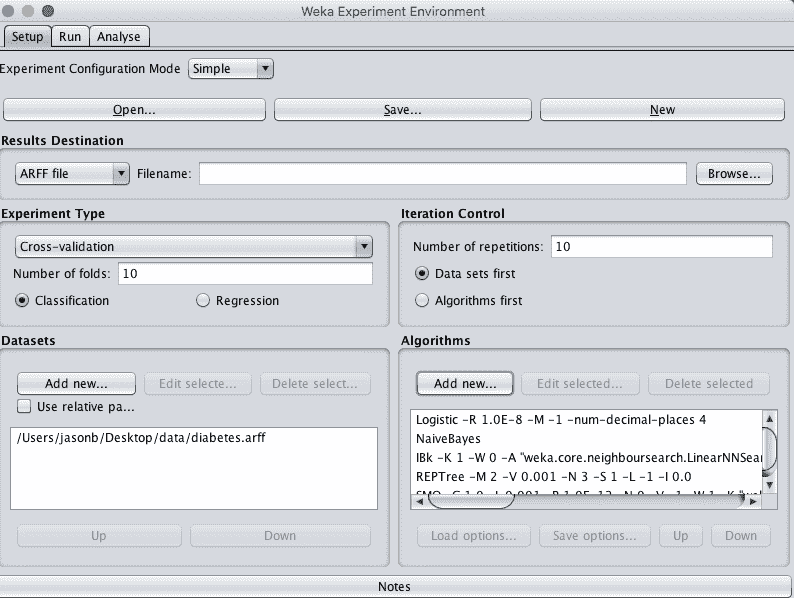
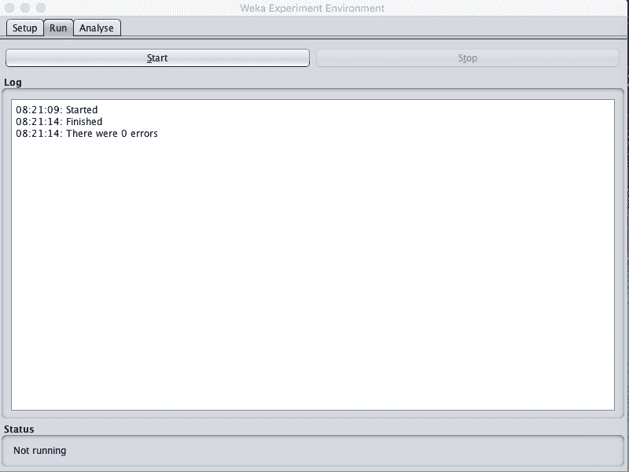
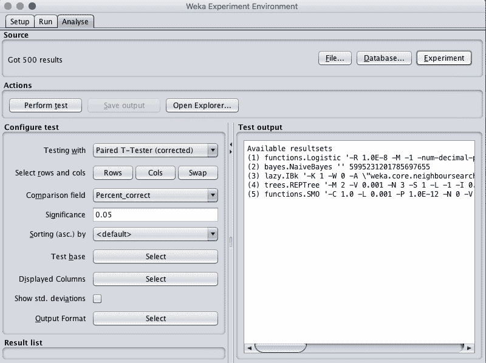
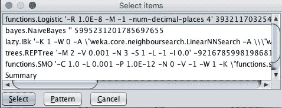

# 如何比较 Weka

中机器学习算法的性能

> 原文:[https://machinelearning master . com/compare-performance-machine-learning-algorithms-WEKA/](https://machinelearningmastery.com/compare-performance-machine-learning-algorithms-weka/)

最后更新于 2019 年 12 月 11 日

对于给定的机器学习问题，应该使用什么算法？

这就是应用机器学习的挑战。这个问题没有快速的答案，但是有一个可靠的过程，你可以使用。

在这篇文章中，你将发现如何通过在 Weka 中直接比较来为数据集找到好的甚至最好的机器学习算法。

看完这篇文章你会知道:

*   为一个问题发现好的甚至最好的机器学习算法的过程。
*   如何在 Weka 设计一个实验来比较不同机器学习算法的性能？
*   如何分析 Weka 的实验结果？

**用我的新书[用 Weka](https://machinelearningmastery.com/machine-learning-mastery-weka/) 启动你的项目**，包括*的分步教程*和清晰的*截图*所有示例。

我们开始吧。


如何比较 Weka
中机器学习算法的性能图片作者: [Clark H](https://www.flickr.com/photos/clarkh/5432875630/) ，保留部分权利。

## 一个问题的最佳机器算法

应用机器学习中最常见的问题是:

> 什么算法最适合我的问题？

答案无法提前知道。如果你足够了解你的问题，知道哪种算法最好，你就不需要使用机器学习。你会简单地解决你的问题。

机器学习技术是针对那些必须从数据中学习解决方案的难题。传统技术无法使用的地方。

选择算法有很多经验法则。例如，如果一个算法期望特定分布的数据，而您的数据具有该分布，那么该算法可能非常适合您的问题。这有两个问题:

1.  许多算法可能有期望，使它们适合您的问题。
2.  有时，当算法的期望被违背时，可以获得好的甚至最好的结果。

经验法则是很好的起点，但不是算法的最终选择。

针对您的问题的最佳机器学习算法是根据经验找到的。通过反复试验。

这是通过对你的问题评估一套非常不同类型的算法来完成的，找到有效的算法，并对那些有希望的 2-3 算法加倍。我称这种方法为抽查。

流程如下:

1.  设计一个测试工具，包括训练数据集、任何数据准备和测试选项，如 10 倍交叉验证。
    1.  要获得加分，请对数据集的多个不同演示或视图重复实验。这将有助于最好地将问题的结构暴露给愿意学习它的算法。
2.  选择一套对问题有非常不同假设的不同算法，例如线性模型、树、基于实例的方法、概率方法、神经网络等等。
    1.  对于奖励积分，允许每种算法发挥其最大优势，包括每种算法在不同常用配置方案下的变化。
3.  评估训练数据集中的算法套件。
4.  分析结果并确定 2 到 3 种不同的算法，以便进一步研究。

这个过程总是会引导你找到在机器学习问题上表现良好的算法。实际上，你真的只需要一个尽可能做得好的模型，只要你有时间。

找到最适合你的问题的模型是一个你愿意投入多少时间去尝试不同的算法并调整那些表现良好的算法的问题。

## 比较 Weka 中的算法性能

您可以使用实验环境在 Weka 中抽查您的问题的机器学习算法。

在本教程中，您将设计、运行和分析您的第一个机器学习实验。

我们将使用皮马印第安人糖尿病发病数据集。每个实例代表一名患者的医疗细节，任务是预测该患者在未来五年内是否会出现糖尿病。有 8 个数值输入变量都有不同的尺度。

*   [数据集文件](https://raw.githubusercontent.com/jbrownlee/Datasets/master/pima-indians-diabetes.csv)。
*   [数据集详细信息](https://raw.githubusercontent.com/jbrownlee/Datasets/master/pima-indians-diabetes.names)。

最高的结果大约是 77%的准确率。

我们将在原始数据集上评估 5 种不同的机器学习算法:

*   逻辑回归(逻辑回归)
*   朴素贝叶斯
*   分类和回归树
*   最近的邻居或 KNN
*   支持向量机或 SVM (SMO)

将使用默认算法配置评估每个算法。你可以自己研究这个实验的自然延伸是:

*   创建数据集的多个不同视图来评估算法，如标准化、规范化等。
*   向套件中添加更多算法进行评估。
*   使用通用或标准算法配置添加每个算法的更多变体。

本教程分为 3 个部分:

1.  设计实验。
2.  运行实验。
3.  查看实验结果。

## 1.设计实验

Weka 实验环境是一个工具，您可以使用它在数据集上使用机器学习算法运行受控实验。

Weka 实验环境允许您定义一个或多个数据集和一个或多个算法来处理数据集。然后，您可以运行并监控实验。最后，所有的结果都被收集并呈现给你分析。

在本节中，我们将使用皮马印第安人糖尿病发病数据集、10 倍交叉验证(默认)和 5 种常见分类算法来定义实验。

每个算法将在数据集上用不同的随机数种子评估 10 次(10 次交叉验证的 10 次运行)。这将导致每个评估算法有 10 个稍微不同的结果，这是一个小群体，我们可以稍后使用统计方法来解释。

1.打开韦卡图形用户界面选择器。


Weka 图形用户界面选择器

2.点击“实验者”按钮，打开韦卡实验者界面。


韦卡实验环境设置选项卡

3.在“设置”选项卡上，单击“新建”按钮开始新的实验。

4.在“数据集”面板中，点击“添加新……”按钮，选择*数据/糖尿病。*

5.在“算法”窗格中，单击“添加新...”按钮，单击“选择”按钮，并在“函数”组下选择“逻辑”算法。点击“确定”按钮添加。

重复并添加以下 4 个附加算法:

*   “贝叶斯”小组下的朴素贝叶斯。
*   “树”组下的 REPTree。
*   “懒”组下的 IBk。
*   “职能”小组下的 SMO。

您可以通过单击“设置”面板顶部的“保存”按钮来保存该实验定义。如果您想在将来的实验中创建新的变体，这将非常有用。您可以使用“打开”按钮加载定义。

最后，您可以将实验结果保存到 ARFF 文件中。如果您想在以后加载和分析结果，这很有用。您可以在“结果目标”窗格中指定保存实验结果的文件。



韦卡实验环境配置实验

## 2.运行实验

现在是进行实验的时候了。

1.单击“运行”选项卡。

这里几乎没有选择。你所能做的就是开始一个实验或者停止一个正在运行的实验。

2.点击“开始”按钮并运行实验。它应该在几秒钟内完成。这是因为数据集很小。



韦卡实验环境运行实验

## 3.查看实验结果

韦卡实验环境的第三个面板用于分析实验结果。


韦卡实验环境分析选项卡

您可以从以下位置加载结果:

*   文件，如果您将实验配置为将结果保存到“设置”选项卡上的文件中。
*   数据库，如果您将实验配置为将结果保存到“设置”选项卡上的数据库中。
*   一个实验，如果你刚刚在实验环境中运行了一个实验(我们刚刚做了)。

通过单击“源”窗格中的“实验”按钮，加载我们刚刚执行的实验的结果。

您将看到加载了 500 个结果。这是因为我们有 5 个算法，每个算法被评估 100 次，10 次交叉验证乘以 10 次重复。



韦卡实验环境负载结果

收集了许多不同性能指标的结果，例如分类精度。

实验环境允许我们对不同的性能指标进行统计测试，以便我们从实验中得出结论。

例如，我们对实验中的两个问题感兴趣:

*   实验中评估的哪种算法性能最好？这对于了解我们是否想要立即创建一个好的性能模型非常有用。
*   算法的性能排名是多少？这有助于了解我们是否想进一步研究和调整在这个问题上表现最好的 2 对 3 算法。

我们可以将结果摘要配置为显示在“配置测试”窗格中。

统计测试的类型可以在“测试方式”选项中选择，默认情况下，该选项设置为“配对测试器(已更正)”。这很好，将成对比较每个算法，并对收集的结果的分布做出一些合理的假设，例如它们是从高斯分布中得出的。显著性级别在“显著性”参数中设置，默认为 0.05 (5%)，这也是可以的。

我们不需要陷入统计显著性检验的技术细节。这些有用的缺省值将告知我们，我们所审查的任何成对算法性能比较之间的差异是否在 95%的置信度下具有统计显著性。

我们可以在“比较字段”选项中选择比较算法的性能度量。默认值是“百分比 _ 正确”度量(准确性)，这正是我们第一次通过时感兴趣的。

我们可以将所有的算法结果与一个基本结果进行比较。这可以通过“测试基础”选项来指定。默认值是列表中评估的第一个算法，在本例中是逻辑回归。我们可以通过点击“测试基地”旁边的“选择”按钮来看到这一点。



韦卡实验环境测试基地

单击“操作”窗格中的“执行测试”按钮，执行统计测试并生成一些我们可以查看的输出。您应该会看到如下所示的结果。

```
Tester:     weka.experiment.PairedCorrectedTTester -G 4,5,6 -D 1 -R 2 -S 0.05 -result-matrix "weka.experiment.ResultMatrixPlainText -mean-prec 2 -stddev-prec 2 -col-name-width 0 -row-name-width 25 -mean-width 0 -stddev-width 0 -sig-width 0 -count-width 5 -print-col-names -print-row-names -enum-col-names"
Analysing:  Percent_correct
Datasets:   1
Resultsets: 5
Confidence: 0.05 (two tailed)
Sorted by:  -
Date:       8/06/16 8:41 AM

Dataset                   (1) function | (2) bayes (3) lazy. (4) trees (5) funct
--------------------------------------------------------------------------------
pima_diabetes            (100)   77.47 |   75.75     70.62 *   74.46 *   76.80
--------------------------------------------------------------------------------
                               (v/ /*) |   (0/1/0)   (0/0/1)   (0/0/1)   (0/1/0)

Key:
(1) functions.Logistic '-R 1.0E-8 -M -1 -num-decimal-places 4' 3932117032546553727
(2) bayes.NaiveBayes '' 5995231201785697655
(3) lazy.IBk '-K 1 -W 0 -A \"weka.core.neighboursearch.LinearNNSearch -A \\\"weka.core.EuclideanDistance -R first-last\\\"\"' -3080186098777067172
(4) trees.REPTree '-M 2 -V 0.001 -N 3 -S 1 -L -1 -I 0.0' -9216785998198681299
(5) functions.SMO '-C 1.0 -L 0.001 -P 1.0E-12 -N 0 -V -1 -W 1 -K \"functions.supportVector.PolyKernel -E 1.0 -C 250007\" -calibrator \"functions.Logistic -R 1.0E-8 -M -1 -num-decimal-places 4\"' -6585883636378691736
```

我们可以看到，逻辑回归，我们的比较基础标记为(1)有 77.47%的问题的准确性。将该结果与其他 4 种算法进行比较，并用数字表示，并映射到结果表底部的图例中。

请注意 IBk 和 REPTree 结果旁边的“*”。这表明结果与逻辑结果有显著差异，但分数较低。在表中，朴素贝叶斯和 SMO 的结果旁边没有任何字符，这表明结果与逻辑斯蒂没有显著差异。如果一个算法的结果大于基本算法，并且差异显著，那么在结果旁边会出现一个小的“v”。

如果我们必须立即建立一个模型，我们可以选择逻辑回归，但我们也可以选择朴素贝叶斯或 SMO，因为它们的结果没有显著差异。逻辑回归是一个很好的模型选择，因为它简单，我们理解和快速训练。

我们可能不会选择 IBk 或决策树，至少不会选择它们的默认配置，因为我们知道逻辑回归可以做得更好，并且这个结果具有统计学意义。

## 用韦卡实验调试误差

你有时会在运行实验时出错。

“运行”选项卡中的日志将报告“有 1 个错误”并且没有更多信息。


实验中的韦卡误差

通过查看 Weka 日志，您可以很容易地找出问题所在。

在韦卡图形用户界面选择器中，单击“程序”菜单和“日志菜单”。


韦卡开放日志

这将打开韦卡日志。

从上到下滚动日志，查找与您的实验相对应的错误。这可能是日志中的最后一个错误(在底部)。


韦卡日志窗口

通常，实验误差会由两个原因之一引起:

*   您在韦卡实验者的“设置”选项卡上的“实验类型”窗格中选择了错误的问题类型。例如，您的问题可能是“回归”类型的问题，您选择了“分类”。
*   您在“韦卡实验者”的“设置”选项卡上的“算法”窗格中向实验添加了错误类型的算法。例如，您可能向分类类型问题添加了一个仅支持回归的算法(如线性回归)。

查看 Weka 日志中的错误时，请留意提示上述问题之一的消息。

## 摘要

在这篇文章中，你发现了如何为你的数据问题找到好的甚至最好的机器学习算法。
具体你学到了:

*   对一个问题的一套不同算法进行抽查的过程，目的是找到一个算法子集，为进一步研究做好准备。
*   如何设计和运行一个实验来比较机器学习算法在数据集上的性能。
*   如何解释机器学习实验的结果，以回答关于你的问题的问题。

关于在你的数据集上比较机器学习算法的性能，或者关于这篇文章，你有什么问题吗？在评论中提出你的问题，我会尽力回答。