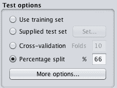
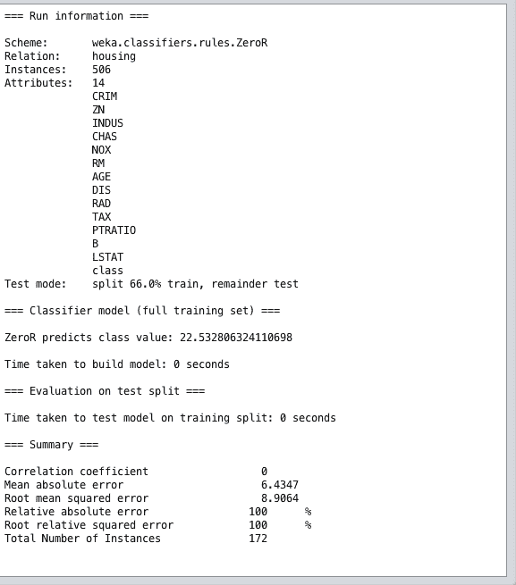

# 如何估计 Weka 中机器学习算法的性能

> 原文：<https://machinelearningmastery.com/estimate-performance-machine-learning-algorithms-weka/>

最后更新于 2019 年 8 月 22 日

预测建模的问题是创建具有良好性能的模型，对新的未知数据进行预测。

因此，使用稳健的技术根据可用的训练数据来训练和评估模型是至关重要的。对模型性能的估计越可靠，您就可以进一步推动性能，并确信它会转化为模型的操作使用。

在这篇文章中，你将发现各种不同的方法，你可以估计你的机器学习模型在韦卡的表现。

看完这篇文章你会知道:

*   如何使用训练数据集评估模型。
*   如何使用随机训练和测试分割来评估您的模型？
*   如何使用 k-fold 交叉验证评估您的模型？

**用我的新书[用 Weka](https://machinelearningmastery.com/machine-learning-mastery-weka/) 启动你的项目**，包括*的分步教程*和清晰的*截图*所有示例。

我们开始吧。

如何评估 Weka
中机器学习算法的性能图片作者: [Will Fisher](https://www.flickr.com/photos/fireatwillrva/15120126914/) ，版权所有。

## 模型评估技术

有许多模型评估技术可供您选择，Weka 机器学习工作台提供了其中四种，如下所示:

### 训练数据集

在整个训练数据集上准备模型，然后在同一数据集上评估模型。这通常是有问题的，尤其是因为一个完美的算法可以通过简单地记忆(存储)所有的训练模式来玩这个评估技术，并获得一个完美的分数，这将是误导。

### 提供的测试集

使用另一个程序手动拆分数据集。在整个训练数据集上准备您的模型，并使用单独的测试集来评估模型的性能。如果您有一个大数据集(成千上万个实例)，这是一个很好的方法。

### 百分比分割

每次评估模型时，随机将数据集分为训练分区和测试分区。这可以给你一个非常快速的性能评估，就像使用一个提供的测试集一样，只有当你有一个大的数据集时才更好。

### 交互效度分析

将数据集分割成 k 个分区或折叠。在除了作为测试集的分区之外的所有分区上训练一个模型，然后重复这个过程创建 k 个不同的模型，并给每个折叠一个作为测试集的机会。然后计算所有 k 个模型的平均性能。这是评估模型性能的黄金标准，但却有创建更多模型的代价。

加载数据集后，您可以在“分类”选项卡上的 Weka 资源管理器中看到这些技术。

韦卡算法评估测试选项

## 使用哪个测试选项

鉴于有四种不同的测试选项可供选择，您应该使用哪一种？

每个测试选项都有时间和地点，总结如下:

*   **训练数据集**:仅当您拥有所有数据并且您有兴趣创建描述性模型而不是预测性模型时使用。因为你有所有的数据，你不需要做出新的预测。您有兴趣创建一个模型来更好地理解问题。
*   **提供的测试集**:当数据非常大，例如数百万条记录，并且您不需要全部数据来训练模型时。当测试集已由第三方定义时也很有用。
*   **百分比分割**:非常适合用来快速了解模型的性能。除非您有非常大的数据集，并且确信(例如，您已经测试过)分割足以描述问题，否则不要用于决策。对于训练集和测试集，常见的分割值分别为 66%到 34%。
*   **交叉验证**:默认。在你不确定的时候使用。通常提供比其他技术更准确的性能估计。当你有非常大的数据时不要使用。k 的常用值是 5 和 10，这取决于数据集的大小。

如果有疑问，使用 k 倍交叉验证，其中 k 设置为 10。

## 最终模型怎么样

测试选项与根据看不见的数据评估模型的性能有关。

这是一个需要内化的重要概念。预测建模的目标是创建一个在我们不完全理解的情况下表现最好的模型，未来有新的未知数据。在这种情况下，我们必须使用这些强大的统计技术来最好地估计模型的性能。

话虽如此，一旦我们选择了一个模式，就必须最终确定下来。这些测试选项都不用于此目的。

模型必须在整个训练数据集上训练并保存。模型最终确定的主题超出了本文的范围。

请注意，最终模型的性能不需要计算，它是使用上面讨论的测试选项技术来估计的。

## 绩效总结

当您评估模型时，会在 Weka 中提供性能摘要。

在“分类”选项卡中，单击“开始”按钮评估算法后，结果将显示在“分类器输出”窗格中。

该窗格包含许多信息，包括:

*   运行信息，如算法及其配置、数据集及其属性以及测试选项
*   构建模型的细节，如果有的话。
*   绩效总结包括许多不同的衡量标准。

### 分类绩效总结

在分类问题上评估机器学习算法时，您会得到大量的性能信息需要消化。

这是因为分类可能是预测建模问题中研究最多的类型，并且有很多不同的方法来考虑分类算法的性能。

分类算法的性能总结中有三点需要注意:

1.  **分类精度**。这是所有预测中正确预测数量的比率，通常以百分比表示，其中 100%是算法能够达到的最佳值。如果你的数据中有不平衡的类，你可能需要查看 Kappa 度量，它提供了考虑类平衡的相同信息。
2.  **精度等级**。注意每个类别的预测的真阳性和假阳性率，这对于问题的分类是不均匀的或者有两个以上的类别是有指导意义的。如果预测一个类比预测另一个类更重要，这可以帮助你解释结果。
3.  [**【混乱矩阵】**](https://machinelearningmastery.com/confusion-matrix-machine-learning/) 。显示每个类的预测数与实际属于每个类的实例数的对比表。这对于概述算法所犯的错误类型非常有用。

Weka 分类性能总结

### 回归性能总结

当在回归问题上评估机器学习算法时，会给你一些不同的性能度量来回顾。

值得注意的是，回归算法的性能总结有两点:

1.  **相关系数**。这就是预测与实际产值的关联或变化程度。值 0 是最差的，值 1 是完全相关的一组预测。
2.  **均方根误差**。这是以输出变量为单位的测试集的平均误差量。这个标准帮助你了解一个给定的预测平均可能是错误的。

Weka 回归性能总结

## 摘要

在这篇文章中，你发现了如何根据 Weka 中看不见的数据来评估机器学习模型的性能。

具体来说，您了解到:

*   关于机器学习模型对未知数据的性能评估作为预测建模的核心问题的重要性。
*   关于 4 个不同的测试选项以及何时使用每个选项，特别注意训练和测试拆分和 k-fold 交叉验证。
*   关于分类和回归问题的性能总结以及需要注意的指标。

你对 Weka 中的模型性能估计或这篇文章有什么问题吗？在评论中提出你的问题，我会尽力回答。