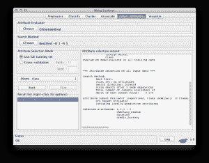
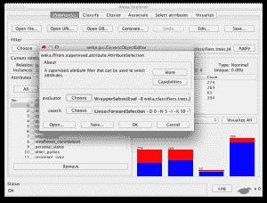
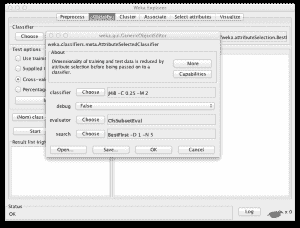

# 特征选择，提高准确率，减少训练时间

> 原文：<https://machinelearningmastery.com/feature-selection-to-improve-accuracy-and-decrease-training-time/>

最后更新于 2020 年 8 月 16 日

处理问题时，您总是希望从现有数据中获得最大收益。你想要最好的精确度。

通常，最大的胜利是更好地理解你正在解决的问题。这就是为什么我强调你要花这么多时间提前[定义你的问题](https://machinelearningmastery.com/how-to-define-your-machine-learning-problem/ "How to Define Your Machine Learning Problem")、[分析数据](https://machinelearningmastery.com/quick-and-dirty-data-analysis-for-your-machine-learning-problem/ "Quick and Dirty Data Analysis for your Machine Learning Problem")、[为你的模型准备数据集](https://machinelearningmastery.com/how-to-prepare-data-for-machine-learning/ "How to Prepare Data For Machine Learning")。

[数据准备](https://machinelearningmastery.com/how-to-prepare-data-for-machine-learning/ "How to Prepare Data For Machine Learning")的一个关键部分是创建数据集的转换，例如重新缩放的属性值和分解为其组成部分的属性，所有这些都是为了向建模算法展示更多有用的结构。

准备数据集时要使用的一套重要方法是自动特征选择算法。在这篇文章中，你将发现特征选择，简单特征选择的好处，以及如何在数据集上最好地利用 Weka 中的这些算法。

**用我的新书[用 Weka](https://machinelearningmastery.com/machine-learning-mastery-weka/) 启动你的项目**，包括*的分步教程*和清晰的*截图*所有示例。

我们开始吧。

在数据集
中仔细选择要素[加布照片](https://www.flickr.com/photos/ravescuritiba/728057039/sizes/o/)，保留部分权利

## 并非所有属性都相等

无论您是自己选择和收集样本数据，还是由领域专家提供给您，属性的选择都至关重要。这很重要，因为这意味着成功地和有意义地建模问题之间的区别。

### 引入歧途的

包含冗余属性可能会误导建模算法。基于实例的方法，如 k 最近邻，使用属性空间中的小邻域来确定分类和回归预测。这些预测可能会被冗余属性严重偏斜。

### 过拟合

在数据集中保留不相关的属性会导致过拟合。像 C4.5 这样的决策树算法寻求在属性值上做出最优选择。那些与预测更相关的属性首先被拆分。在树的更深处，不太相关和不相关的属性被用来做出预测决策，这些决策可能只是偶然有益于训练数据集中。训练数据的这种过拟合会对该方法的建模能力产生负面影响，并削弱预测准确率。

在评估算法之前，从数据集中移除冗余和不相关的属性非常重要。这个任务应该在应用机器学习过程的[准备数据](https://machinelearningmastery.com/how-to-prepare-data-for-machine-learning/ "How to Prepare Data For Machine Learning")步骤中处理。

## 特征选择

[特征选择](https://en.wikipedia.org/wiki/Feature_selection)或属性选择是一个过程，通过该过程，您可以在数据集中自动搜索属性的最佳子集。“最好”的概念是相对于你试图解决的问题而言的，但通常意味着最高的准确性。

思考选择属性问题的一个有用方法是[状态空间搜索](https://en.wikipedia.org/wiki/State_space_search)。搜索空间是离散的，由您可以从数据集中选择的所有可能的属性组合组成。目标是在搜索空间中导航，找到最佳或足够好的组合，从而提高选择所有属性的表现。

对数据执行特征选择的三个主要好处是:

*   **减少过拟合**:冗余数据越少，基于噪声做出决策的机会就越少。
*   **提高准确率**:误导数据少意味着建模准确率提高。
*   **减少训练时间**:数据少意味着算法训练更快。

## 韦卡中的属性选择

Weka 提供了一个属性选择工具。该过程分为两个部分:

*   **属性评估器**:评估属性子集的方法。
*   **搜索方法**:搜索可能子集空间的方法。

### 属性求值器

属性评估器是评估属性子集的方法。例如，可以通过建立模型和评估模型的准确性来评估它们。

属性评估方法的一些示例有:

*   **cfssbsteval**:与类值高度相关而彼此相关性较低的值子集。
*   **分类子集评估**:使用预测算法和您指定的另一个数据集评估子集。
*   **wrappsurbsteval**:使用您指定的分类器和 n 倍交叉验证来评估子集。

### 搜索方法

搜索方法是一种结构化的方法，在这种方法中，基于子集评估来导航可能属性子集的搜索空间。基线方法包括随机搜索和穷举搜索，尽管图形搜索算法很流行，如最佳第一搜索。

属性评估方法的一些示例有:

*   **穷举**:测试所有属性组合。
*   **最佳优先**:使用最佳优先搜索策略导航属性子集。
*   **greeddyspewise**:使用前向(加法)或后向(减法)步进策略来导航属性子集。

## 如何在 Weka 中使用属性选择

在这一节中，我想和大家分享三种在 Weka 中使用属性选择的聪明方法。

### 1.探索属性选择

当你只是陈述属性选择的时候，我推荐使用一些韦卡浏览器中的方法。

加载数据集，然后单击“选择属性”选项卡。在数据集上尝试不同的属性赋值器和搜索方法，并在输出窗口中查看结果。

韦卡浏览器中的功能选择方法

这个想法是为了获得一种感觉，并建立一种直觉，知道 1)为你的问题选择了多少和 2)哪些属性。您可以将这些信息用于接下来的一个或两个步骤。

### 2.准备带有属性选择的数据

下一步将使用属性选择作为数据准备步骤的一部分。

预处理数据集时可以使用一个过滤器，该过滤器将运行属性选择方案，然后将数据集修剪为仅包含选定的属性。在无监督属性过滤器下，该过滤器被称为“属性选择”。

在 Weka 中使用要素选择方法创建数据集的转换

然后，您可以保存数据集，以便在抽查算法时在实验中使用。

### 3.使用属性选择运行算法

最后，还有一个更聪明的方法可以合并属性选择，那就是直接将其与算法合并。

有一个元算法，你可以运行，并包括在实验中，选择运行算法的属性。该算法被称为“元”算法组下的“属性选择分类器”。您可以将此算法配置为使用您选择的算法以及您选择的属性评估器和搜索方法。

Weka 元算法中分类器和属性选择的耦合

您可以包含该元算法的多个版本，这些版本配置有属性选择方案的不同变体和配置，并查看它们之间的比较情况。

## 摘要

在这篇文章中，你发现特征选择是一套可以提高模型准确率、减少模型训练时间和减少过拟合的方法。

您还发现 Weka 内置了特征选择方法，并在 Weka 中学习了在数据集上使用特征选择方法的三种巧妙方法，即探索、准备数据以及在元分类器中将其与算法耦合。

维基百科在[特征选择](https://en.wikipedia.org/wiki/Feature_selection)上有一个很好的条目。

如果你正在寻找下一步，我推荐书[特征提取:基础与应用](https://amzn.to/342dLH3)。这是一个由学者撰写的文章集，涵盖了与功能选择相关的一系列问题。它很贵，但是很值得，因为它在解决你的问题上有不同的方法。

有关 Weka 功能选择的最新观点，请参见帖子:

*   [如何在 Weka](https://machinelearningmastery.com/perform-feature-selection-machine-learning-data-weka/) 中用机器学习数据进行特征选择

另一本书你可能会发现有用(在 kindle 上更便宜)是[特征选择的计算方法](https://amzn.to/3g29F40)。