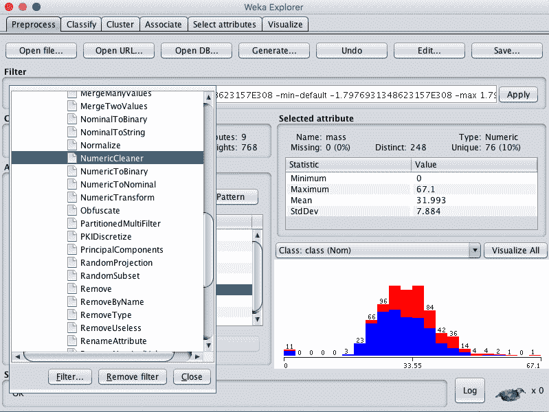
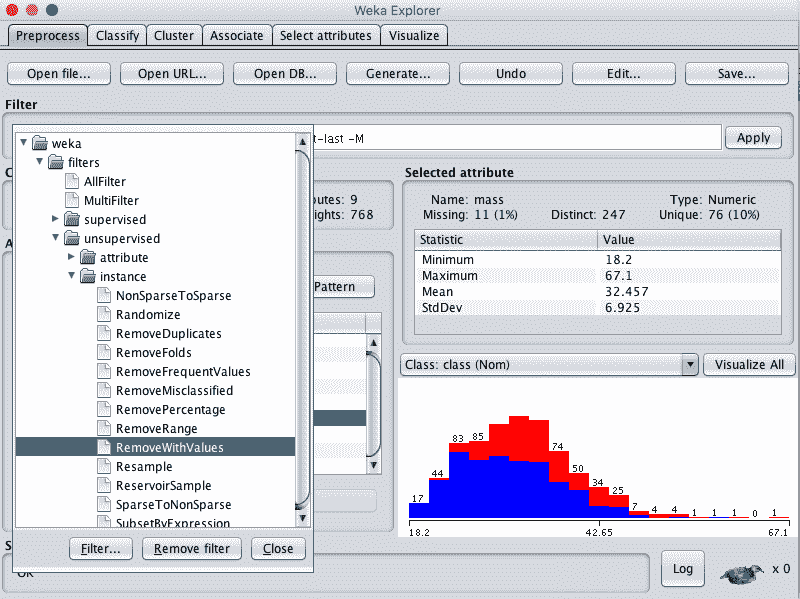
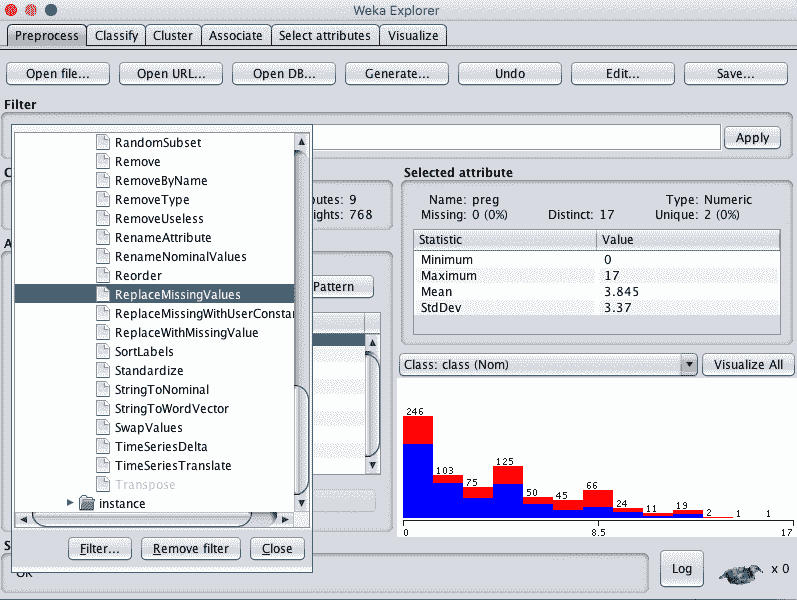

# 如何用 Weka 处理机器学习数据中的缺失值

> 原文：<https://machinelearningmastery.com/how-to-handle-missing-values-in-machine-learning-data-with-weka/>

最后更新于 2019 年 12 月 13 日

数据很少是干净的，并且经常会有损坏或丢失的值。

在开发机器学习模型时，为了获得最佳表现，识别、标记和处理丢失的数据非常重要。

在这篇文章中，您将发现如何使用 Weka 处理机器学习数据中缺失的值。

看完这篇文章你会知道:

*   如何标记数据集中缺失的值。
*   如何从数据集中删除缺少值的数据。
*   如何估计缺失值？

**用我的新书[用 Weka](https://machinelearningmastery.com/machine-learning-mastery-weka/) 启动你的项目**，包括*的分步教程*和清晰的*截图*所有示例。

我们开始吧。

如何处理 Weka
中机器学习丢失的数据图片作者: [Peter Sitte](https://www.flickr.com/photos/67623309@N07/6290891545/) ，版权所有。

## 预测糖尿病的发作

本例中使用的问题是皮马印第安人糖尿病发病数据集。

这是一个分类问题，其中每个实例代表一个患者的医疗细节，任务是预测该患者是否会在未来五年内出现糖尿病。

您可以在此了解有关数据集的更多信息:

*   [数据集文件](https://raw.githubusercontent.com/jbrownlee/Datasets/master/pima-indians-diabetes.csv)。
*   [数据集详细信息](https://raw.githubusercontent.com/jbrownlee/Datasets/master/pima-indians-diabetes.names)

您也可以在您的 Weka 安装中，在名为 *diabetes.arff* 的文件中的 *data/* 目录下访问该数据集。

## 标记缺失值

皮马印第安人数据集是探索缺失数据的良好基础。

血压(pres)和体重指数(Mass)等一些属性的值为零，这是不可能的。这些是必须手动标记的损坏或丢失数据的示例。

您可以使用 NumericalCleaner 筛选器标记 Weka 中的缺失值。下面的秘籍向您展示了如何使用这个过滤器来标记身体质量指数属性上的 11 个缺失值。

1.打开韦卡浏览器。

2.加载皮马印第安人糖尿病发病数据集。

3.单击过滤器的“选择”按钮，并选择数值过滤器，它位于未监督的属性下

Weka 选择数字清洁器数据过滤器

4.单击过滤器进行配置。

5.将*属性标记*设置为 6，即质量属性的索引。

6.将*最小阈值*设置为 0.1E-8(接近零)，这是属性允许的最小值。

7.将 *minDefault* 设置为 NaN，该值未知，将替换阈值以下的值。

8.单击过滤器配置上的“确定”按钮。

9.单击“应用”按钮应用过滤器。

单击“属性”窗格中的“质量”，查看“选定属性”的详细信息。请注意，正式设置为 0 的 11 个属性值没有标记为缺失。

Weka 缺失数据已标记

在本例中，我们将低于阈值的值标记为缺失。

你也可以很容易地用一个特定的数值来标记它们。您还可以标记值的上下范围之间缺少的值。

接下来，让我们看看如何从数据集中移除缺少值的实例。

## 删除丢失的数据

既然您知道如何标记数据中缺失的值，那么您需要学习如何处理它们。

处理缺失数据的一种简单方法是移除那些具有一个或多个缺失值的实例。

您可以在 Weka 中使用 RemoveWithValues 过滤器来实现这一点。

从上述方法继续标记缺失值，您可以按如下方式删除缺失值:

1.单击过滤器的“选择”按钮，并选择移除带值，它位于未监督的实例下。

Weka 选择移除带值数据过滤器

2.单击过滤器进行配置。

3.将*属性标记*设置为 6，即质量属性的索引。

4.将*匹配缺省值*设置为“真”。

5.单击“确定”按钮使用过滤器的配置。

6.单击“应用”按钮应用过滤器。

单击“属性”部分中的“质量”，查看“选定属性”的详细信息。

请注意，标记为缺失的 11 个属性值已从数据集中删除。

删除了 Weka 缺失值

注意，您可以通过单击“撤消”按钮来撤消此操作。

## 输入缺少的值

不一定要删除缺少值的实例，您可以用其他值替换缺少的值。

这被称为输入缺失值。

用数字分布的平均值来估计缺失值是很常见的。您可以在 Weka 中使用 ReplaceMissingValues 过滤器轻松实现这一点。

从上面的第一个配方继续标记缺失值，您可以如下估计缺失值:

1.单击过滤器的“选择”按钮，并选择“替换缺失值”，它位于“未监督的”属性下。

Weka 替换缺失值数据过滤器

2.单击“应用”按钮将过滤器应用到您的数据集。

单击“属性”部分中的“质量”，查看“选定属性”的详细信息。

请注意，标记为缺失的 11 个属性值已被设置为分布的平均值。

韦卡估计值

## 摘要

在这篇文章中，您发现了如何使用 Weka 处理机器学习数据集中缺失的数据。

具体来说，您了解到:

*   如何在数据集中将损坏的值标记为缺失。
*   如何从数据集中移除缺少值的实例。
*   如何估计数据集中缺失值的平均值。

你对缺失的数据或本教程有什么疑问吗？在下面的评论中提问，我会尽力回答。