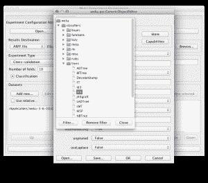
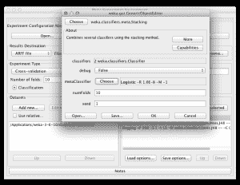
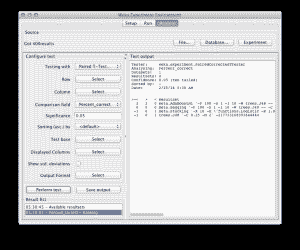
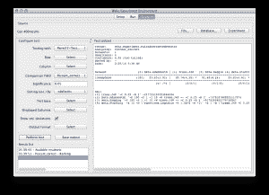

# 在 Weka

中使用助推、装袋和混合集成进行更好的预测

> 原文：<https://machinelearningmastery.com/improve-machine-learning-results-with-boosting-bagging-and-blending-ensemble-methods-in-weka/>

最后更新于 2020 年 12 月 10 日

[Weka](https://machinelearningmastery.com/what-is-the-weka-machine-learning-workbench/ "What is the Weka Machine Learning Workbench") 是研究机器学习的完美平台。

它提供了一个图形用户界面，用于在数据集上探索和实验机器学习算法，而您不必担心数学或编程。

在之前的一篇文章中，我们研究了如何[设计和运行在数据集](https://machinelearningmastery.com/design-and-run-your-first-experiment-in-weka/ "Design and Run your First Experiment in Weka")上运行 3 个算法的实验，以及如何分析和报告结果。我们还研究了[如何设计和运行一个实验来调整机器学习算法](https://machinelearningmastery.com/how-to-tune-a-machine-learning-algorithm-in-weka/ "How to Tune a Machine Learning Algorithm in Weka")的配置

在这篇文章中，你将发现如何使用 Weka 实验员通过将多种算法的结果组合成一个整体来提高你的结果。如果你按照一步一步的指导，你将在五分钟内设计并运行一个集成机器学习实验。

**用我的新书[用 Weka](https://machinelearningmastery.com/machine-learning-mastery-weka/) 启动你的项目**，包括*的分步教程*和清晰的*截图*所有示例。

## 1.下载 Weka 并安装

访问 [Weka 下载页面](https://waikato.github.io/weka-wiki/downloading_weka/)找到适合你电脑的 Weka 版本(Windows、Mac 或 Linux)。

Weka 需要 Java。您可能已经安装了 Java，如果没有，下载页面上列出的 Weka 版本(适用于 Windows)包含 Java，并将为您安装。我自己也在苹果电脑上，就像苹果电脑上的其他东西一样，Weka 开箱即用。

如果你对机器学习感兴趣，那么我知道你可以想出如何将软件下载并安装到自己的计算机中。

## 2.启动 Weka

启动 Weka。这可能需要在程序启动器中找到它，或者双击 weka.jar 文件。这将启动韦卡图形用户界面选择器。

Weka 图形用户界面选择器

Weka 图形用户界面选择器允许您选择资源管理器、实验器、知识管理器和简单命令行界面(命令行界面)之一。

点击*实验者*按钮，启动韦卡实验者。

Weka Experimenter 允许您设计自己的在数据集上运行算法的实验，运行实验并分析结果。这是一个强大的工具。

## 3.设计实验

点击*新建*按钮，创建新的实验配置。

### 测试选项

实验者用合理的默认值为你配置测试选项。实验配置为使用 10 倍的[交叉验证。这是一个“分类”类型的问题，每个算法+数据集组合运行 10 次(迭代控制)。](https://machinelearningmastery.com/how-to-choose-the-right-test-options-when-evaluating-machine-learning-algorithms/ "How To Choose The Right Test Options When Evaluating Machine Learning Algorithms")

### 电离层数据集

让我们从选择数据集开始。

1.  在*数据集*中，选择点击*添加新…* 按钮。
2.  打开*数据*目录，选择*电离层*数据集。

[电离层数据集](https://archive.ics.uci.edu/ml/datasets/Ionosphere)是一个经典的机器学习数据集。问题是在给定雷达信号的情况下，预测电离层中自由电子结构的存在与否。它由 16 对实值雷达信号(34 个属性)和一个具有两个值的单一类别属性组成:好的和坏的雷达回波。

您可以在电离层数据集的 [UCI 机器学习知识库页面上了解更多关于此问题的信息。](https://archive.ics.uci.edu/ml/datasets/Ionosphere)

### 集成方法

J48 ( [C4.8](https://en.wikipedia.org/wiki/C4.5) )是一种强大的决策树方法，在电离层数据集上表现良好。在本实验中，我们将研究是否可以使用[集成方法](https://en.wikipedia.org/wiki/Ensemble_learning)来改进 J48 算法的结果。我们将尝试三种流行的集成方法:助推、装袋和混合。

让我们从将 J48 算法添加到实验开始，这样我们就可以将其结果与该算法的集成版本进行比较。

将 J48 算法添加到 Weka 实验者中。

1.  在*算法*部分点击*添加新的……*。
2.  点击*选择*按钮。
3.  点击*树*选择下的 *J48* 。
4.  点击 *AdaBoostM1* 配置上的*确定*按钮。

### 助推

[Boosting](https://en.wikipedia.org/wiki/Boosting_(machine_learning)) 是一种集成方法，从基于训练数据准备的基本分类器开始。然后在它后面创建第二个分类器，以关注训练数据中第一个分类器出错的实例。该过程继续添加分类器，直到达到模型数量或准确率的极限。

在 [AdaBoostM1(自适应升压)算法](https://en.wikipedia.org/wiki/AdaBoost)中，在 Weka 中提供了升压。

1.  在*算法*部分点击*添加新的……*。
2.  点击*选择*按钮。
3.  点击*元*选择下的 *AdaBoostM1* 。
4.  点击*分类器*的*选择*按钮，选择*树*部分下的 *J48* ，点击*选择*按钮。
5.  点击 *AdaBoostM1* 配置上的*确定*按钮。

### 制袋材料

bagging([Bootstrap aggregation](https://en.wikipedia.org/wiki/Bootstrap_aggregating))是一种集成方法，它创建训练数据集的单独样本，并为每个样本创建一个分类器。这些多个分类器的结果然后被组合(例如平均或多数投票)。诀窍是训练数据集的每个样本都是不同的，给每个被训练的分类器一个微妙不同的焦点和问题视角。

1.  在*算法*部分点击*添加新的……*。
2.  点击*选择*按钮。
3.  点击“元”选项下的“*装袋*”。
4.  点击*分类器*的*选择*按钮，选择*树*部分下的 *J48* ，点击*选择*按钮。
5.  点击*装袋*配置上的*确定*按钮。

### 混合

混合是一种集成方法，其中对训练数据准备多个不同的算法，并准备一个元分类器，该分类器学习如何利用每个分类器的预测，并对看不见的数据做出准确的预测。

在 Weka 中，混合被称为[堆叠](https://machinelearningmastery.com/stacking-ensemble-for-deep-learning-neural-networks/)(在堆叠概括方法之后)。我们将使用两个分类器(J48 和 IBk)添加堆叠，并使用逻辑回归作为元分类器。

J48 和 IBk (k 近邻)是非常不同的算法，我们希望在我们的混合中包含“好的”(可以对问题做出有意义的预测)和多种多样(对问题有不同的观点，进而做出不同的有用预测)的算法。逻辑回归是一个很好的可靠和简单的方法来学习如何结合这两种方法的预测，并且非常适合这个二元分类问题，因为它本身会产生二元输出。

配置并将混合 J48 和 IBk 的堆叠算法添加到 Weka 实验者。

1.  在*算法*部分点击*添加新的……*。
2.  点击*选择*按钮。
3.  点击*元*选择下的*叠加*。
4.  点击*元分类器*的*选择*按钮，在*功能*部分选择*物流*，点击*选择*按钮。
5.  点击“*分类器*”的值(算法名，其实是一个按钮)。
6.  点击*归零*，点击*删除*按钮。
7.  点击*分类器*的*选择*按钮，选择*树*部分下的 *J48* ，点击*关闭*按钮。
8.  点击*分类器*的*选择*按钮，在*惰性*部分选择 *IBk* ，点击*关闭*按钮。
9.  单击“ *X* ”关闭算法选择器。
10.  点击*装袋*配置上的*确定*按钮。

## 4.运行实验

点击屏幕顶部的“*运行*”标签。

该选项卡是运行当前配置实验的控制面板。

点击大的*开始*按钮开始实验，观看*日志*和*状态*部分，关注进展情况。

## 5.查看结果

点击屏幕顶部的“*分析*”标签。

这将打开实验结果分析面板。

### 算法等级

我们首先想知道的是哪种算法是最好的。我们可以通过给定算法击败其他算法的次数来对算法进行排名。

1.  点击*测试基地*的*选择*按钮，选择*排名*。
2.  现在点击*执行测试*按钮。

排名表显示了每种算法相对于数据集中所有其他算法的统计显著优势。一次胜利意味着比另一种算法的准确率更高的准确率，并且差异具有统计学意义。

在韦卡实验器中分析结果时的算法排名

我们可以看到，AdaBoostM1 版本的 J48 排名最高，与其他算法相比取得了 2 次重大胜利。我们还可以看到 Stacking 和普通老 J48 排名最低。J48 排名靠后是一个好的迹象，这表明至少一些集成方法提高了问题的准确性。

### 算法准确率

接下来我们想知道算法取得了什么表现。

1.  点击*测试基地*的*选择*按钮，在列表中选择 *J48* 算法，点击*选择*按钮。
2.  单击“显示标准”旁边的复选框。偏差”。
3.  现在点击*执行测试*按钮。

韦卡实验者的算法平均准确率和统计意义。

我们可以看到，AdaBoostM1 算法实现了 93.05% (+/- 3.92%)的分类准确率。我们可以看到，这个值比 J48 高 89.74% (+/- 4.38%)。我们可以在表中的 J48 准确率旁边看到一个“*”，这表明增强的 J48 算法之间的差异是有意义的(具有统计显著性)。

我们还可以看到，AdaBoostM1 算法在 92.40% (+/- 4.40%)时获得了高于 Bagging 的值，但我们没有看到一点“*”，这表明差异没有意义(没有统计意义)。

## 摘要

在这篇文章中，你发现了如何在 Weka 中用一个数据集和一个算法的三个集成来配置机器学习实验。您发现了如何使用 Weka 实验者来使用集成方法提高数据集上机器学习算法的准确性，以及如何分析结果。

如果你已经走了这么远，为什么不呢:

*   看看能不能用其他的集成方法，得到更好的效果。
*   看看你是否可以使用不同的配置为装袋，增压或混合算法，并获得更好的结果。