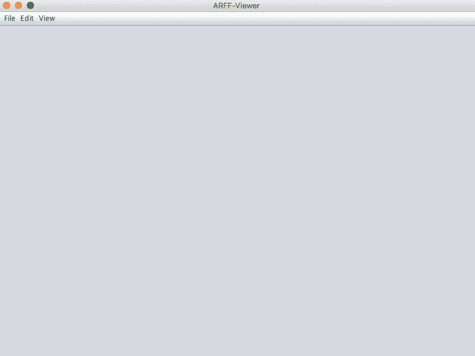
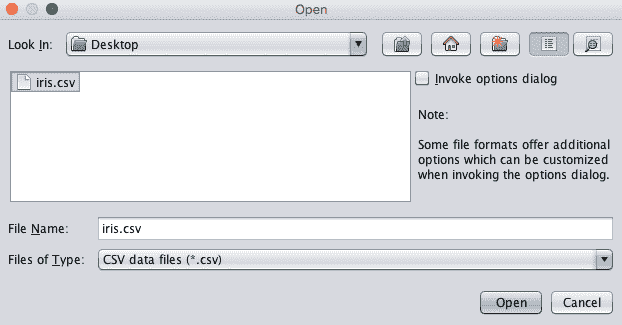
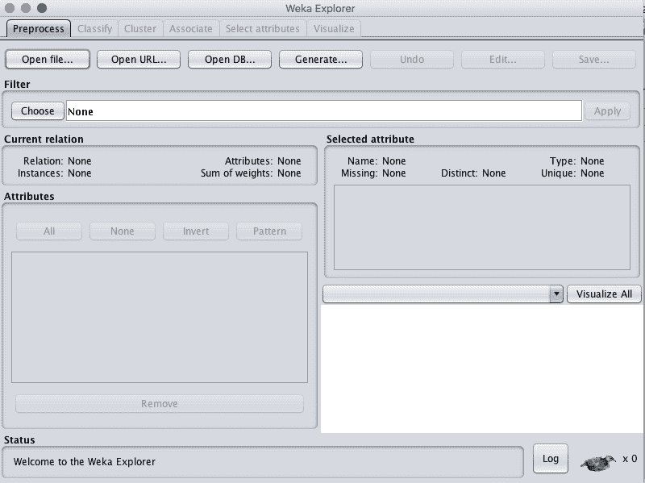

# 如何在 Weka

加载 CSV 机器学习数据

> 原文：<https://machinelearningmastery.com/load-csv-machine-learning-data-weka/>

最后更新于 2020 年 12 月 10 日

在开始建模之前，您必须能够加载数据。

在这篇文章中，您将发现如何在 Weka 中加载您的 CSV 数据集。看完这篇文章，你会知道:

*   关于 ARFF 文件格式以及它是如何用 Weka 表示数据的默认方式。
*   如何在韦卡浏览器中加载 CSV 文件并将其保存为 ARFF 格式。
*   如何在 ArffViewer 工具中加载 CSV 文件并将其保存为 ARFF 格式。

本教程假设您已经安装了 Weka。

**用我的新书[用 Weka](https://machinelearningmastery.com/machine-learning-mastery-weka/) 启动你的项目**，包括*的分步教程*和清晰的*截图*所有示例。

我们开始吧。


如何在 Weka 加载 CSV 机器学习数据
图片由[泰利斯](https://www.flickr.com/photos/thales/9371458918/)提供，保留部分权利。

## 如何谈论 Weka 中的数据

机器学习算法主要设计用于数字阵列。

这被称为表格或结构化数据，因为它是数据在电子表格中的外观，由行和列组成。

Weka 在描述数据时有一个特定的以计算机科学为中心的词汇:

*   **实例**:一行数据被称为实例，就像问题域中的实例或观察一样。
*   **属性**:一列数据被称为特征或属性，就像观测的特征一样。

每个属性可以有不同的类型，例如:

*   **实数**为 1.2 这样的数值。
*   **整数**表示没有小数部分的数值，如 5。
*   **名词性**表示“狗”和“猫”等类别数据。
*   **字符串**为单词列表，如这句话。

在分类问题上，输出变量必须是标称的。对于回归问题，输出变量必须是真实的。

## 韦卡的数据

Weka 更喜欢以 ARFF 格式加载数据。

ARFF 是代表属性关系文件格式的缩写。它是 CSV 文件格式的扩展，其中使用了一个标题，提供了有关列中数据类型的元数据。

例如，CSV 格式的经典鸢尾花数据集的前几行如下所示:

```py
5.1,3.5,1.4,0.2,Iris-setosa
4.9,3.0,1.4,0.2,Iris-setosa
4.7,3.2,1.3,0.2,Iris-setosa
4.6,3.1,1.5,0.2,Iris-setosa
5.0,3.6,1.4,0.2,Iris-setosa
```

ARFF 格式的相同文件如下所示:

```py
@RELATION iris

@ATTRIBUTE sepallength REAL
@ATTRIBUTE sepalwidth REAL
@ATTRIBUTE petallength REAL
@ATTRIBUTE petalwidth REAL
@ATTRIBUTE class {Iris-setosa,Iris-versicolor,Iris-virginica}

@DATA
5.1,3.5,1.4,0.2,Iris-setosa
4.9,3.0,1.4,0.2,Iris-setosa
4.7,3.2,1.3,0.2,Iris-setosa
4.6,3.1,1.5,0.2,Iris-setosa
5.0,3.6,1.4,0.2,Iris-setosa
```

您可以看到指令以 at 符号(@)开始，并且有一个用于数据集名称的指令(例如@RELATION iris)，有一个用于定义每个属性的名称和数据类型的指令(例如@ATTRIBUTE sepallength REAL)，还有一个用于指示原始数据开始的指令(例如@DATA)。

ARFF 文件中以百分比符号(%)开头的行表示注释。

原始数据部分中带有问号符号(？)表示未知或缺失的值。该格式支持数字和分类值，如上面的 iris 示例，但也支持日期和字符串值。

根据您安装的 Weka，您的 Weka 安装目录中的 *data/* 子目录下可能有也可能没有一些默认数据集。这些与 Weka 一起分发的默认数据集是 ARFF 格式的，并且具有。arff 文件扩展名。

## 在 ARFF 浏览器中加载 CSV 文件

您的数据不太可能是 ARFF 格式。

事实上，它更有可能是逗号分隔值(CSV)格式。这是一种简单的格式，其中数据以行和列的形式排列，逗号用于分隔行中的值。引号也可以用于包围值，尤其是当数据包含带空格的文本字符串时。

CSV 格式很容易从微软 Excel 导出，所以一旦您可以将数据导入 Excel，就可以轻松地将其转换为 CSV 格式。

Weka 提供了一个方便的工具来加载 CSV 文件并保存在 ARFF。您只需要对数据集执行一次此操作。

使用下面的步骤，您可以将数据集从 CSV 格式转换为 ARFF 格式，并与 Weka 工作台一起使用。如果手边没有 CSV 文件，可以使用鸢尾花数据集。从 [UCI 机器学习资源库](https://archive.ics.uci.edu/ml/datasets/Iris) ( [直接链接](https://archive.ics.uci.edu/ml/machine-learning-databases/iris/iris.data))下载文件，保存到当前工作目录为 *iris.csv* 。

1.启动 Weka 选择器。


韦卡图形用户界面选择器截图

2.单击菜单中的“工具”打开 ARFF 查看器，并选择“自动查看器”。

3.您将看到一个空的 ARFF 查看器窗口。



韦卡·ARFF 观众

4.通过单击“文件”菜单并选择“打开”，在 ARFF 查看器中打开您的 CSV 文件。导航到当前工作目录。将“文件类型:”过滤器更改为“CSV 数据文件(*。csv)"。选择您的文件，然后单击“打开”按钮。



在 ARFF 浏览器中加载 CSV

5.您应该会看到一个加载到 ARFF 查看器中的 CSV 文件示例。

6.通过单击“文件”菜单并选择“另存为...”，以 ARFF 格式保存数据集。输入扩展名为. arff 的文件名，然后单击“保存”按钮。

您现在可以加载已保存的。arff 文件直接进入 Weka。

注意，ARFF 查看器提供了在保存之前修改数据集的选项。例如，您可以更改值、更改属性的名称以及更改它们的数据类型。

强烈建议您指定每个属性的名称，因为这将有助于以后的数据分析。此外，确保每个属性的数据类型都是正确的。

## 在韦卡浏览器中加载 CSV 文件

您也可以直接在 Weka Explorer 界面中加载您的 CSV 文件。

如果你赶时间，想快速测试一个想法，这很方便。

本节向您展示了如何在 Weka 资源管理器界面中加载您的 CSV 文件。如果没有要加载的 CSV 数据集，您可以再次使用 iris 数据集进行练习。

1.启动韦卡图形用户界面选择器。

2.通过单击“浏览器”按钮启动韦卡浏览器。



韦卡探险家的截图

3.单击“打开文件...”按钮。

4.导航到当前工作目录。将“文件类型”更改为“CSV 数据文件(*)。csv)"。选择您的文件，然后单击“打开”按钮。

您可以直接处理数据。您也可以通过单击“保存”按钮并键入文件名，将数据集保存为 ARFF 格式。

## 将 Excel 用于其他文件格式

如果您有其他格式的数据，请先将其加载到 Microsoft Excel 中。

使用不同的分隔符或固定宽度字段以另一种格式(如 CSV)获取数据是很常见的。Excel 有强大的工具来加载各种格式的表格数据。使用这些工具，首先将数据加载到 Excel 中。

将数据加载到 Excel 后，可以将其导出为 CSV 格式。然后，您可以在 Weka 中使用它，或者直接使用，或者首先将其转换为 ARFF 格式。

## 资源

以下是一些额外的资源，当您在 Weka 中处理 CSV 数据时，这些资源可能会很有用。

*   [属性-关系文件格式](https://waikato.github.io/weka-wiki/formats_and_processing/arff/)
*   [可以使用 CSV 文件吗？](https://waikato.github.io/weka-wiki/formats_and_processing/converting_csv_to_arff/)
*   [CSV 文件格式](https://en.wikipedia.org/wiki/Comma-separated_values)

## 摘要

在这篇文章中，你发现了如何将你的 CSV 数据加载到 Weka 中进行机器学习。

具体来说，您了解到:

*   关于 ARFF 文件格式以及韦卡如何使用它来表示机器学习的数据集。
*   如何使用 ARFF 查看器加载您的 CSV 数据并将其保存为 ARFF 格式。
*   如何在 Weka Explorer 中直接加载你的 CSV 数据并用于建模。

你对在 Weka 加载数据或这篇文章有什么问题吗？在评论中提问，我会尽力回答。