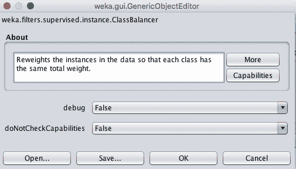
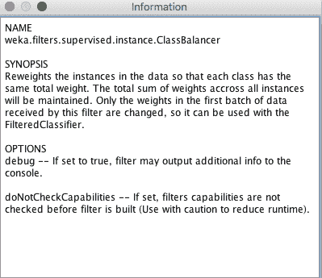
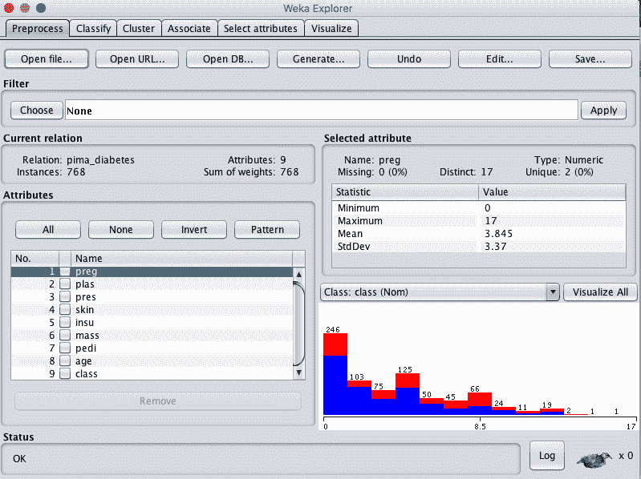
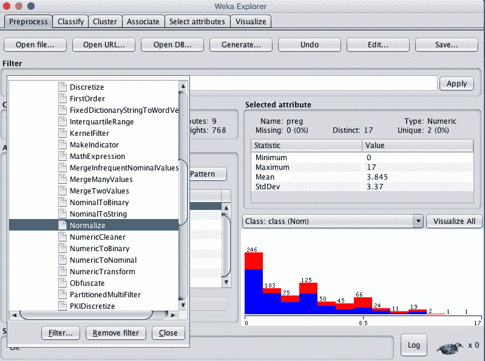
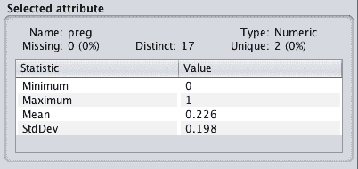
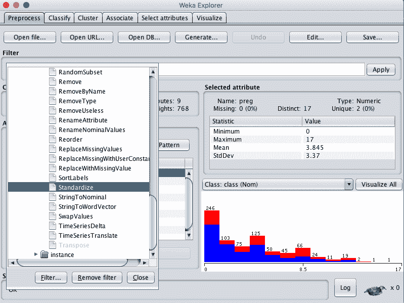
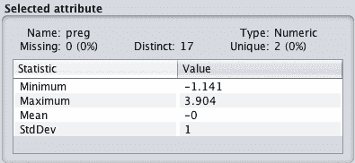

# 如何在 Weka

中规范和标准化你的机器学习数据

> 原文：<https://machinelearningmastery.com/normalize-standardize-machine-learning-data-weka/>

最后更新于 2019 年 12 月 11 日

机器学习算法对您正在建模的数据集进行假设。

通常，原始数据由不同比例的属性组成。例如，一个属性可以是千克，另一个属性可以是计数。虽然不是必需的，但是通过仔细选择重新缩放数据的方法，您通常可以提高性能。

在这篇文章中，您将发现如何重新缩放数据，以便所有数据都具有相同的比例。

看完这篇文章你会知道:

*   如何在 0 和 1 之间规范化数值属性。
*   如何标准化您的数字属性，使其具有 0 均值和单位方差。
*   什么时候选择规范化还是标准化。

**用我的新书[用 Weka](https://machinelearningmastery.com/machine-learning-mastery-weka/) 启动你的项目**，包括*的分步教程*和清晰的*截图*所有示例。

我们开始吧。

*   **2018 年 3 月更新**:增加了下载数据集的替代链接，因为原件似乎已经被取下来。

## 预测糖尿病的发作

本例中使用的数据集是皮马印第安人糖尿病发病数据集。

这是一个分类问题，其中每个实例代表一个患者的医疗细节，任务是预测该患者是否会在未来五年内出现糖尿病。

这是一个很好的练习缩放的数据集，因为 8 个输入变量都有不同的缩放，例如患者怀孕次数的计数( *preg* )和患者体重指数( *mass* )的计算。

下载数据集并将其放在当前工作目录中。

*   [数据集文件](https://raw.githubusercontent.com/jbrownlee/Datasets/master/pima-indians-diabetes.csv)。
*   [数据集详细信息](https://raw.githubusercontent.com/jbrownlee/Datasets/master/pima-indians-diabetes.names)。

您也可以在您的 Weka 安装中，在名为 *diabetes.arff* 的文件中的 *data/* 目录下访问该数据集。

韦卡负荷糖尿病数据集

## 关于韦卡的数据过滤器

Weka 提供了转换数据集的过滤器。查看支持哪些过滤器并在数据集上使用它们的最好方法是使用 Weka Explorer。

“过滤器”面板允许您选择过滤器。

用于选择数据过滤器的 Weka 过滤器窗格

过滤器分为两种类型:

*   **监督过滤器**:可以应用，但在某些方面需要用户控制。例如重新平衡一个类的实例。
*   **无监督过滤器**:可以以无方向的方式应用。例如，将所有值重新缩放到 0 到 1 的范围。

我个人认为这两种过滤器的区分有点武断和混乱。然而，这就是它们的布局。

在这两个组中，过滤器进一步分为属性过滤器和实例过滤器:

*   **属性过滤器**:对属性或一次一个属性进行操作。
*   **实例过滤器**:一次对一个实例或一个实例应用一个操作。

这种区别更有意义。

选择过滤器后，其名称将出现在“选择”按钮旁边的框中。

您可以通过单击过滤器的名称来配置过滤器，这将打开配置窗口。您可以更改过滤器的参数，甚至保存或加载过滤器本身的配置。这对于再现性非常重要。

Weka 数据过滤器配置

您可以通过悬停在每个配置选项上并阅读工具提示来了解更多信息。

单击“更多”按钮，您还可以阅读关于过滤器的所有详细信息，包括配置、论文和书籍，以便进一步阅读和了解关于过滤器工作的更多信息。

Weka 数据过滤器更多信息

您可以通过单击“确定”按钮关闭帮助并应用配置。

您可以通过单击过滤器名称旁边的“应用”按钮，将过滤器应用于加载的数据集。

## 规范化您的数字属性

数据规范化是将一个或多个属性重新缩放到 0 到 1 范围的过程。这意味着每个属性的最大值是 1，最小值是 0。

当您不知道数据的分布或知道分布不是高斯分布(钟形曲线)时，归一化是一种很好的技术。

您可以使用 Weka 对数据集中的所有属性进行规范化，方法是选择“规范化”过滤器并将其应用到数据集中。

您可以使用以下方法来标准化数据集:

1.打开韦卡浏览器。

2.加载数据集。

韦卡浏览器加载的糖尿病数据集

3.点击“选择”按钮选择一个过滤器并选择*无监督。属性。归一化*。

韦卡选择标准化数据过滤器

4.单击“应用”按钮来规范化数据集。

5.单击“保存”按钮并键入文件名以保存数据集的规范化副本。

在“选定属性”窗口中查看每个属性的详细信息将使您确信筛选成功，并且每个属性都被重新缩放到 0 到 1 的范围内。

韦卡归一化数据分布

您可以使用其他比例，例如-1 比 1，这在使用支持向量机和 adaboost 时非常有用。

当您的数据具有不同的规模，并且您使用的算法不对数据的分布做出假设时，例如 k 近邻和人工神经网络，规范化非常有用。

## 标准化您的数字属性

数据标准化是重新调整一个或多个属性的过程，使它们的平均值为 0，标准偏差为 1。

标准化假设您的数据具有高斯(钟形曲线)分布。严格来说，这并不一定是真的，但是如果您的属性分布是高斯分布，该技术会更有效。

通过选择标准化过滤器并将其应用于数据集，您可以使用 Weka 标准化数据集中的所有属性。

您可以使用以下方法来标准化数据集:

1.打开韦卡浏览器

2.加载数据集。

3.单击“选择”按钮选择一个过滤器，然后选择无监督。属性。标准化

Weka 选择标准化数据过滤器

4.单击“应用”按钮来规范化数据集。

5.单击“保存”按钮并键入文件名以保存数据集的标准化副本。

在“选定属性”窗口中查看每个属性的详细信息将使您确信筛选是成功的，并且每个属性的平均值为 0，标准偏差为 1。

韦卡标准化数据分发

当您的数据具有不同的标度，并且您使用的算法确实假设您的数据具有高斯分布时，例如线性回归、逻辑回归和线性判别分析，标准化非常有用。

## 摘要

在这篇文章中，你发现了如何在 Weka 中重新缩放数据集。

具体来说，您了解到:

*   如何将数据集规范化到 0 到 1 的范围。
*   如何标准化你的数据，使平均值为 0，标准差为 1。
*   何时使用规范化和标准化。

你对你的数据或这篇文章有什么疑问吗？在评论中提问，我会尽力回答。