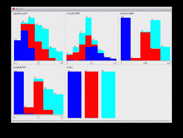
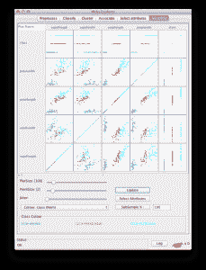

# 针对机器学习问题的快速脏数据分析

> 原文：<https://machinelearningmastery.com/quick-and-dirty-data-analysis-for-your-machine-learning-problem/>

最后更新于 2019 年 8 月 22 日

要很好地理解你正在研究的机器学习问题，你需要密切了解数据。

我个人觉得这一步有时很繁重，只是想继续定义我的测试工具，但我知道它总是会冲出感兴趣的想法和假设来测试。因此，在应用机器学习过程的下一步之前，我使用一个逐步的过程来捕获关于实际数据集的最少数量的观察。

快速和肮脏的数据分析
图片由[蒂姆·帕金森](https://www.flickr.com/photos/timparkinson/3788737796/sizes/l/)提供，保留部分权利

在这篇文章中，你将发现我分析数据集并从给定数据集获得最少观测值(和最少理解)的快速而简单的过程。

**用我的新书[用 Weka](https://machinelearningmastery.com/machine-learning-mastery-weka/) 启动你的项目**，包括*的分步教程*和清晰的*截图*所有示例。

## 数据分析

数据分析步骤的目标是通过更好地理解问题数据来增加对问题的理解。

这包括提供多种不同的方式来描述数据，作为一个机会来审查和捕捉可以在以后的实验中测试的观察和假设。

我使用了两种不同的方法来描述给定的数据集:

1.  **汇总数据**:描述数据和数据分布。
2.  **可视化数据**:创建数据的各种图形摘要。

这里的关键是在数据集上创建不同的视角或视图，以便让您对数据有所了解。

## 1.汇总数据

总结数据就是描述数据的实际结构。我通常使用很多自动化工具来描述像属性分布这样的事情。我喜欢总结的数据的最基本方面是结构和分布。

### 数据结构

总结数据结构就是描述属性的数量和数据类型。例如，经历这个过程突出了数据准备步骤中的转换思想，用于将属性从一种类型转换为另一种类型(例如实数到序数或序数到二进制)。

该步骤的一些激励性问题包括:

*   有多少属性和实例？
*   每个属性的数据类型是什么(例如，名词、序数、整数、实数等)。)?

### 数据分布

总结每个属性的分布也可以为数据准备步骤中可能的数据转换提供思路，例如离散化、[规范化](https://en.wikipedia.org/wiki/Normalization_(statistics))和[标准化](https://en.wikipedia.org/wiki/Standardizing)的需要和效果。

我喜欢捕捉每个实值属性分布的概要。这通常包括最小值、最大值、中值、模式、平均值、标准偏差和缺失值的数量。

该步骤的一些激励性问题包括:

*   创建每个实值属性的五位数摘要。
*   类属性的值分布如何？

了解类属性(或回归输出变量的平均值)的分布是有用的，因为您可以使用它来定义预测模型的最小准确率。

例如，如果有一个二进制分类问题(2 类)，80%的苹果和 20%的香蕉分布，那么预测器可以预测每个测试实例的“苹果”，并确保达到 80%的准确率。当评估算法时，这是测试线束中所有算法必须击败的最坏情况算法。

此外，如果我有时间或兴趣，我喜欢使用参数([皮尔逊](https://en.wikipedia.org/wiki/Pearson%27s_correlation_coefficient))和非参数([斯皮尔曼](https://en.wikipedia.org/wiki/Spearman%27s_correlation))相关系数来生成成对属性相关性的摘要。这可以突出显示可能是要删除的候选属性(彼此高度相关)和其他可能是高度可预测的属性(与结果属性高度相关)。

## 2.可视化数据

可视化数据是关于创建总结数据的图表，捕获它们并研究它们，以获得可以描述的有趣结构。

你似乎可以创建无限多的图表(尤其是在像 R 这样的软件中)，所以我喜欢保持简单，专注于直方图和散点图。

### 属性直方图

我喜欢创建所有属性的直方图，并标记类值。我喜欢这个，因为我在学习机器学习的时候经常使用 Weka，它为你做到了这一点。尽管如此，在其他软件如 r 中也很容易做到。

用图形表示离散分布可以快速突出显示可能的分布族(如正态分布或指数分布)以及类值如何映射到这些分布上。

显示类别值的属性直方图

该步骤的一些激励性问题包括:

*   显示了哪些分布族(如果有):
*   映射到类值的属性中有什么明显的结构吗？

### 成对散点图

散点图在每个轴上绘制一个属性。此外，可以以映射到类值的绘制点的颜色的形式添加第三个轴。可以为所有属性对创建成对散点图。

这些图表可以快速突出属性之间的二维结构(如相关性)以及属性到类值的映射中的跨属性趋势。

显示类别值的成对散点图

该步骤的一些激励性问题包括:

*   展示了哪些有趣的二维结构？
*   属性与类值之间有什么有趣的关系？

## 摘要

在这篇文章中，你发现了一个数据分析的过程，该过程寻求对数据创建不同的视图，以引出对数据的观察和假设。

使用的两种方法是:

1.  **汇总数据**:描述数据和数据分布。
2.  **可视化数据**:创建数据的各种图形摘要。