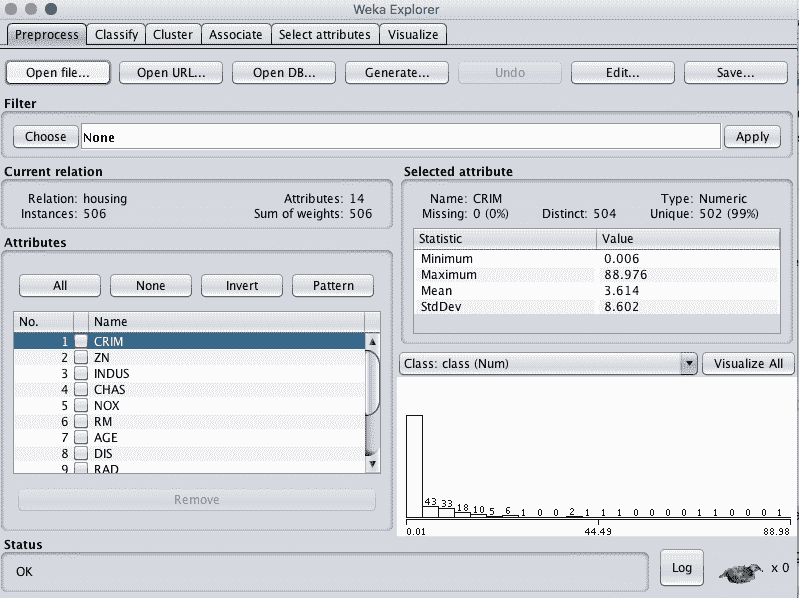
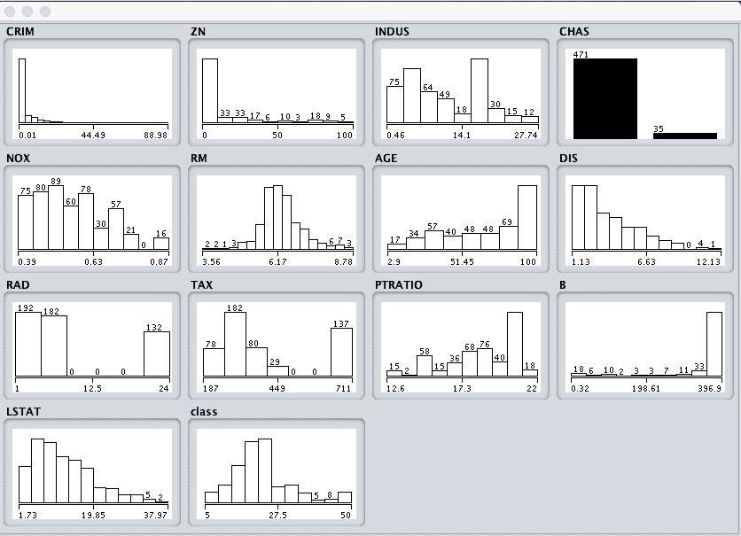
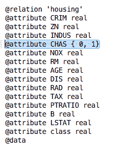
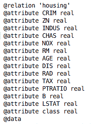
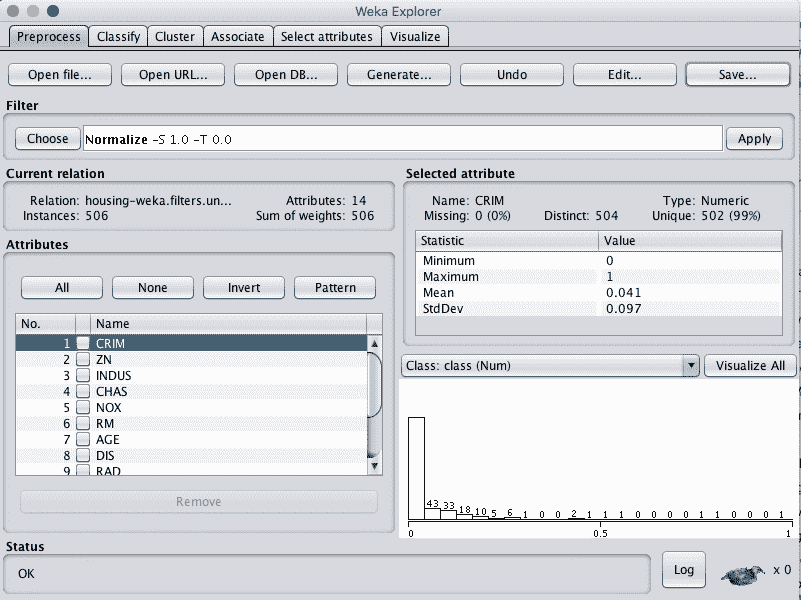
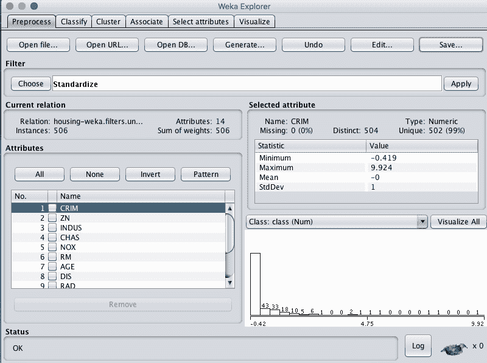
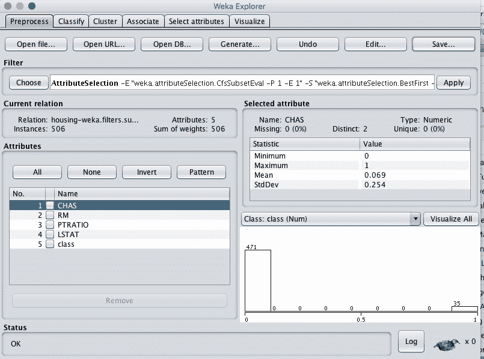
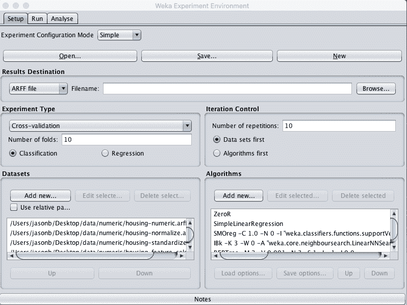
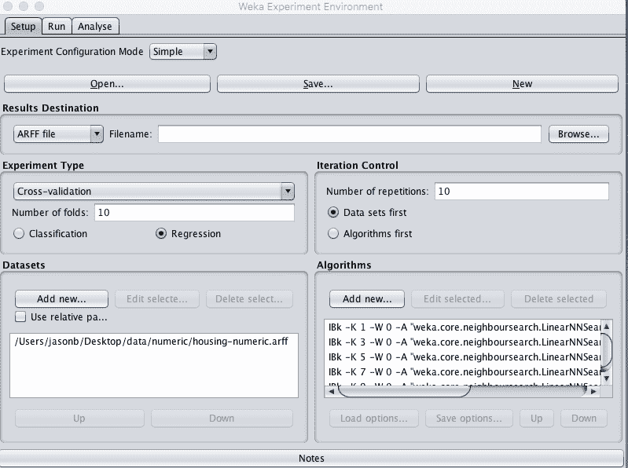
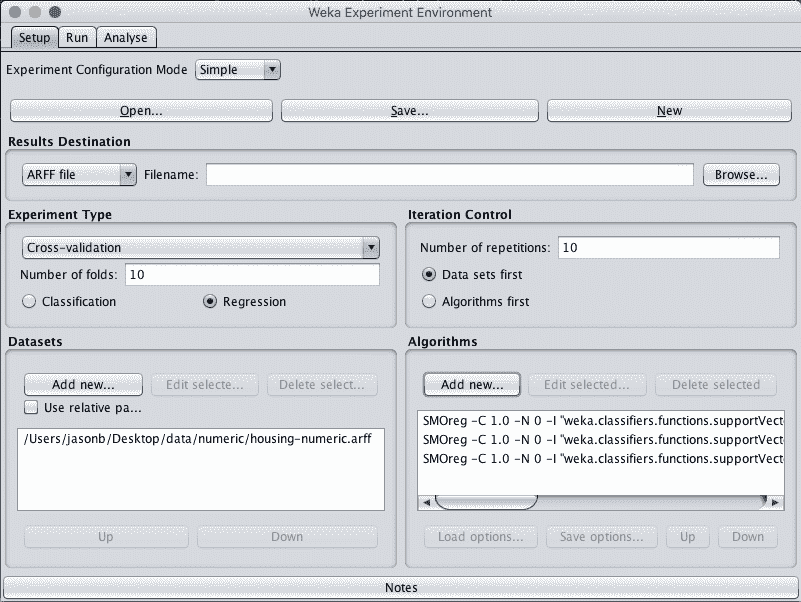

# 如何通过 Weka 的回归机器学习项目工作

> 原文：<https://machinelearningmastery.com/regression-machine-learning-tutorial-weka/>

最后更新于 2020 年 12 月 10 日

擅长应用机器学习的最快方法是在端到端项目上练习。

在这篇文章中，你将发现如何在 Weka 中端到端地解决一个回归问题。看完这篇文章你会知道:

*   如何在 Weka 中加载和分析回归数据集？
*   如何创建多个不同的数据转换视图，并对每个视图评估一套算法。
*   如何最终确定并呈现模型的结果，以便对新数据进行预测。

**用我的新书[用 Weka](https://machinelearningmastery.com/machine-learning-mastery-weka/) 启动你的项目**，包括*的分步教程*和清晰的*截图*所有示例。

我们开始吧。


Weka
逐步回归机器学习项目教程图片由 [vagawi](https://www.flickr.com/photos/vagawi/2478028446/) 提供，保留部分权利。

## 教程概述

本教程将指导您完成在 Weka 完成机器学习项目所需的关键步骤。

我们将通过以下步骤开展工作:

1.  加载数据集。
2.  分析数据集。
3.  准备数据集的视图。
4.  评估算法。
5.  调整算法性能。
6.  评估集成算法。
7.  展示结果。

## 1.加载数据集

你的 Weka 安装的*数据/* 目录中回归问题的选择比较少。回归是一类重要的预测建模问题。从 UCI 机器学习资源库下载回归问题的免费附加包。

它可从 Weka 网页上的[数据集页面获得，并且是列表中的第一个，名为:](https://sourceforge.net/projects/weka/files/datasets/)

*   一个包含 37 个回归问题的 jar 文件，从不同的来源获得

它是一个. jar 文件，是一种压缩的 Java 档案。你应该可以用大多数现代的解压程序来解压。如果您安装了 Java(很可能使用 Weka)，您也可以解压缩。在下载 jar 的目录中，使用以下命令在命令行上手动创建 jar 文件:

```py
jar -xvf datasets-numeric.jar
```

解压缩文件将创建一个名为 numeric 的新目录，其中包含 37 个 ARFF 本地 Weka 格式的回归数据集。

在本教程中，我们将研究波士顿房价数据集。

在这个数据集中，每个实例描述了波士顿郊区的属性，任务是以千美元为单位预测房价。有 13 个不同尺度的数值输入变量描述郊区的特性。您可以在 [UCI 机器学习资源库](https://archive.ics.uci.edu/ml/datasets/Housing)上了解更多关于该数据集的信息。

1.  打开韦卡图形用户界面选择器
2.  单击“浏览器”按钮打开韦卡浏览器。
3.  点击“打开文件...”按钮，导航至*数字/* 目录，选择*房屋. arff* 。单击“打开”按钮。

数据集现在被加载到 Weka 中。



韦卡加载波士顿房价数据集

## 2.分析数据集

在开始建模之前，查看您的数据非常重要。

回顾每个属性的分布和属性之间的交互可能会对我们可以使用的特定数据转换和特定建模技术有所启发。

### 汇总统计

在“当前关系”窗格中查看数据集的详细信息。我们可以注意到一些事情:

*   数据集称为住房。
*   有 506 个实例。如果我们稍后使用 10 倍交叉验证来评估算法，那么每个折叠将由大约 50 个实例组成，这很好。
*   共有 14 个属性、13 个输入和 1 个输出变量。

单击“属性”窗格中的每个属性，并查看“选定属性”窗格中的汇总统计信息。

我们可以注意到一些关于数据的事实:

*   任何属性都没有缺失值。
*   除了一个二进制属性之外，所有输入都是数字，并且具有不同范围的值。
*   最后一个属性是名为 class 的输出变量，它是数字。

我们可能会从数据的规范化或标准化中看到一些好处。

### 属性分布

单击“全部可视化”按钮，查看每个属性的图形分布。



Weka 波士顿房价单变量属性分布

我们可以注意到一些关于数据形状的事情:

*   我们可以看到属性有一系列不同的分布。
*   CHAS 属性看起来像二进制分布(两个值)。
*   RM 属性看起来像是高斯分布。

我们可能会看到使用像决策树这样的非线性回归方法比使用像线性回归这样的线性回归方法更有好处。

### 属性交互

单击“可视化”选项卡，让我们查看属性之间的一些交互。

1.  将“绘图大小”减小到 50，并调整窗口大小，以便所有绘图都可见。
2.  将“点大小”增加到 3，使点更容易看到。
3.  单击“更新”按钮应用更改。


韦卡波士顿房价散点图矩阵

纵观这些图表，我们可以看到一些有助于建模的结构化关系，例如 DIS 对 NOX 和 AGE 对 NOX。

我们还可以看到输入属性和输出属性之间的一些结构关系，比如 LSTAT 和 CLASS 以及 RM 和 CLASS。

## 3.准备数据集视图

在本节中，我们将创建一些不同的数据视图，这样当我们在下一节中评估算法时，我们就可以了解哪些视图通常更擅长将回归问题的结构暴露给模型。

我们首先将创建原始 *housing.arff* 数据文件的修改副本，然后对数据进行 3 次附加转换。我们将从原始数据集的修改副本创建数据集的每个视图，并将其保存到一个新文件中，以供以后在实验中使用。

### 修改的副本

CHAS 属性是标称的(二进制)，值为“0”和“1”。

我们想复制原来的 *housing.arff* 数据文件，把 CHAS 改成数字属性，这样所有输入的属性都是数字。这将有助于数据集的转换和建模。

找到 *housing.arff* 数据集，并在名为 *housing-numeric.arff* 的相同目录中创建它的副本。

在文本编辑器中打开这个修改过的文件*并向下滚动到定义属性的地方，特别是第 56 行的 CHAS 属性。*



Weka 波士顿房价属性数据类型

将 CHAS 属性的定义从:

```py
@attribute CHAS { 0, 1}
```

到

```py
@attribute CHAS real
```

CHAS 属性现在是数字的，而不是名义的。这个数据集*的修改副本将被用作基线数据集。*



带有数字数据类型的 Weka 波士顿房价数据集

### 标准化数据集

我们将创建的第一个视图是将所有输入属性规范化为 0 到 1 的范围。这可能有利于多种算法，这些算法会受到属性规模的影响，比如回归和基于实例的方法。

1.  打开韦卡浏览器。
2.  打开修改后的数值数据集*外壳-numeric.arff* 。
3.  点按“过滤器”面板中的“选择”按钮，然后选择“无监督.属性.规范化”过滤器。
4.  单击“应用”按钮应用过滤器。
5.  单击“属性”窗格中的每个属性，并查看“选定属性”窗格中的最小值和最大值，以确认它们是 0 和 1。
6.  单击“保存...”按钮，导航到合适的目录，并为此转换后的数据集键入合适的名称，例如“ *housing-normalize.arff* ”。
7.  关闭浏览器界面。



Weka 波士顿房价数据集标准化数据过滤器

### 标准化数据集

我们在前一节中注意到，一些属性具有类似高斯的分布。我们可以重新缩放数据，并通过使用标准化过滤器将这种分布考虑在内。

这将创建一个数据集副本，其中每个属性的平均值为 0，标准差(平均方差)为 1。这可能有利于下一节中假设输入属性为高斯分布的算法，如逻辑回归和朴素贝叶斯。

1.  打开韦卡浏览器。
2.  打开修改后的数值数据集*外壳-numeric.arff* 。
3.  点按“过滤器”面板中的“选择”按钮，然后选择“无监督.属性.标准化”过滤器。
4.  单击“应用”按钮应用过滤器。
5.  单击“属性”窗格中的每个属性，并查看“选定属性”窗格中的平均值和标准偏差值，以确认它们分别为 0 和 1。
6.  单击“保存...”按钮，导航到合适的目录，并为此转换后的数据集键入合适的名称，例如“*housing-standard . ARFF*”。
7.  关闭浏览器界面。



Weka 波士顿房价数据集标准化数据过滤器

### 特征选择

我们不确定是否真的需要所有的属性来进行预测。

在这里，我们可以使用自动特征选择来仅选择数据集中那些最相关的属性。

1.  打开韦卡浏览器。
2.  打开修改后的数值数据集*外壳-numeric.arff* 。
3.  单击“过滤器”面板中的“选择”按钮，选择“监督属性选择”过滤器。
4.  单击“应用”按钮应用过滤器。
5.  单击“属性”窗格中的每个属性，查看所选的 5 个属性。
6.  单击“保存...”按钮，导航到合适的目录，并为该转换后的数据集键入合适的名称，例如“*住房-特征-选择. arff* ”。
7.  关闭浏览器界面。



Weka 波士顿房价数据集特征选择数据过滤器

## 4.评估算法

让我们设计一个实验，根据我们创建的问题的不同观点来评估一套标准的分类算法。

1.单击韦卡图形用户界面选择器上的“实验者”按钮，启动韦卡实验环境。

2.点击“新建”开始新的实验。

3.在“实验类型”窗格中，将问题类型从“分类”更改为“回归”。

4.在“数据集”窗格中，单击“添加新项…”并选择以下 4 个数据集:

*   外壳-数字. arff
*   房屋-标准化. arff
*   住房标准化. arff
*   房屋特征选择

5.在“算法”窗格中，单击“添加新的…”并添加以下 8 种多类分类算法:

*   规则。零
*   bayes 先生。简单线性回归
*   功能。SMOreg
*   放松，IBk
*   树木。REPTree

6.在算法列表中选择 IBK，然后单击“编辑所选...”按钮。

7.将“KNN”从“1”更改为“3”，然后单击“确定”按钮保存设置。



韦卡波士顿房价算法比较实验设计

8.点击“运行”打开“运行”标签，点击“开始”按钮运行实验。实验应该在几秒钟内完成。

9.点击“分析”打开“分析”标签。单击“实验”按钮加载实验结果。


Weka 波士顿房价数据集负载算法对比实验结果

10.将“比较字段”更改为“均方根误差”。

11.单击“执行测试”按钮，执行成对测试，将所有结果与 ZeroR 的结果进行比较。

```py
Tester:     weka.experiment.PairedCorrectedTTester -G 4,5,6 -D 1 -R 2 -S 0.05 -result-matrix "weka.experiment.ResultMatrixPlainText -mean-prec 2 -stddev-prec 2 -col-name-width 0 -row-name-width 25 -mean-width 3 -stddev-width 2 -sig-width 1 -count-width 5 -print-col-names -print-row-names -enum-col-names"
Analysing:  Root_mean_squared_error
Datasets:   4
Resultsets: 5
Confidence: 0.05 (two tailed)
Sorted by:  -
Date:       10/06/16 11:06 AM

Dataset                   (1) rules.Z | (2) func (3) func (4) lazy (5) tree
---------------------------------------------------------------------------
housing                  (100)   9.11 |   6.22 *   4.95 *   4.41 *   4.64 *
housing-weka.filters.unsu(100)   9.11 |   6.22 *   4.94 *   4.41 *   4.63 *
housing-weka.filters.unsu(100)   9.11 |   6.22 *   4.95 *   4.41 *   4.64 *
'housing-weka.filters.sup(100)   9.11 |   6.22 *   5.19 *   4.27 *   4.64 *
---------------------------------------------------------------------------
                              (v/ /*) |  (0/0/4)  (0/0/4)  (0/0/4)  (0/0/4)

Key:
(1) rules.ZeroR '' 48055541465867954
(2) functions.SimpleLinearRegression '' 1679336022895414137
(3) functions.SMOreg '-C 1.0 -N 0 -I \"functions.supportVector.RegSMOImproved -T 0.001 -V -P 1.0E-12 -L 0.001 -W 1\" -K \"functions.supportVector.PolyKernel -E 1.0 -C 250007\"' -7149606251113102827
(4) lazy.IBk '-K 3 -W 0 -A \"weka.core.neighboursearch.LinearNNSearch -A \\\"weka.core.EuclideanDistance -R first-last\\\"\"' -3080186098777067172
(5) trees.REPTree '-M 2 -V 0.001 -N 3 -S 1 -L -1 -I 0.0' -9216785998198681299
```

记住，RMSE 越低越好。

这些结果很能说明问题。

首先，我们可以看到所有的算法都优于 ZeroR 的基线技能，并且差异显著(每个分数旁边有一个小“*”。我们还可以看到，对数据进行标准化或规范化对评估算法似乎没有太大好处。

至少对于 IBk 来说，从数据集的选择较少要素视图来看，我们可能会看到一个小的改进。

最后，看起来 IBk (KNN)可能有最低的误差。让我们进一步调查。

12.点击“测试基地”的“选择”按钮，选择懒惰。IBk 算法作为新的测试库。

13.单击“执行测试”按钮重新运行分析。

```py
Tester:     weka.experiment.PairedCorrectedTTester -G 4,5,6 -D 1 -R 2 -S 0.05 -result-matrix "weka.experiment.ResultMatrixPlainText -mean-prec 2 -stddev-prec 2 -col-name-width 0 -row-name-width 25 -mean-width 2 -stddev-width 2 -sig-width 1 -count-width 5 -print-col-names -print-row-names -enum-col-names"
Analysing:  Root_mean_squared_error
Datasets:   4
Resultsets: 5
Confidence: 0.05 (two tailed)
Sorted by:  -
Date:       10/06/16 11:10 AM

Dataset                   (4) lazy.IB | (1) rule (2) func (3) func (5) tree
---------------------------------------------------------------------------
housing                  (100)   4.41 |   9.11 v   6.22 v   4.95     4.64
housing-weka.filters.unsu(100)   4.41 |   9.11 v   6.22 v   4.94     4.63
housing-weka.filters.unsu(100)   4.41 |   9.11 v   6.22 v   4.95     4.64
'housing-weka.filters.sup(100)   4.27 |   9.11 v   6.22 v   5.19 v   4.64
---------------------------------------------------------------------------
                              (v/ /*) |  (4/0/0)  (4/0/0)  (1/3/0)  (0/4/0)

Key:
(1) rules.ZeroR '' 48055541465867954
(2) functions.SimpleLinearRegression '' 1679336022895414137
(3) functions.SMOreg '-C 1.0 -N 0 -I \"functions.supportVector.RegSMOImproved -T 0.001 -V -P 1.0E-12 -L 0.001 -W 1\" -K \"functions.supportVector.PolyKernel -E 1.0 -C 250007\"' -7149606251113102827
(4) lazy.IBk '-K 3 -W 0 -A \"weka.core.neighboursearch.LinearNNSearch -A \\\"weka.core.EuclideanDistance -R first-last\\\"\"' -3080186098777067172
(5) trees.REPTree '-M 2 -V 0.001 -N 3 -S 1 -L -1 -I 0.0' -9216785998198681299
```

我们可以看到，除了与 REPTree 算法和 SMOreg 进行比较之外，IBk 和其他算法之间确实有显著的差异。IBk 和 SMOreg 算法都是可以进一步调整的非线性回归算法，我们可以在下一节中看到。

## 5.调整算法性能

在前一节中，有两种算法在这个问题上表现良好，是进一步调优的好选择:k 近邻(IBk)和支持向量回归(SMOreg)。

在本节中，我们将设计实验来调整这两种算法，并看看我们是否可以进一步降低均方根误差。

我们将在这些实验中使用基线 *housing-numeric.arff* 数据集，因为使用数据集的这种变化和其他视图之间似乎没有很大的性能差异。

### 调谐 k-最近邻

在本节中，我们将调整 IBk 算法。具体来说，我们将研究使用不同的 k 参数值。

1.打开韦卡实验环境界面。

2.点击“新建”开始新的实验。

3.在“实验类型”窗格中，将问题类型从“分类”更改为“回归”。

4.在“数据集”窗格中，添加 housing-numeric.arff 数据集。

5.在“算法”窗格中，懒惰。IBk 算法，并将“K”参数的值设置为 1(默认值)。重复此过程，并为 IBk 算法添加以下附加配置:

*   懒惰。K=3 的 IBk
*   懒惰。K=5 的 IBk
*   懒惰。K=7 的 IBk
*   懒惰。K=9 的 IBk



Weka 波士顿房价数据集调整 k 近邻算法

6.点击“运行”打开“运行”标签，点击“开始”按钮运行实验。实验应该在几秒钟内完成。

7.点击“分析”打开“分析”标签。单击“实验”按钮加载实验结果。

8.将“比较字段”更改为“均方根误差”。

9.单击“执行测试”按钮执行成对测试。

```py
Tester:     weka.experiment.PairedCorrectedTTester -G 4,5,6 -D 1 -R 2 -S 0.05 -result-matrix "weka.experiment.ResultMatrixPlainText -mean-prec 2 -stddev-prec 2 -col-name-width 0 -row-name-width 25 -mean-width 0 -stddev-width 0 -sig-width 0 -count-width 5 -print-col-names -print-row-names -enum-col-names"
Analysing:  Root_mean_squared_error
Datasets:   1
Resultsets: 5
Confidence: 0.05 (two tailed)
Sorted by:  -
Date:       10/06/16 11:27 AM

Dataset                   (1) lazy.IB | (2) lazy (3) lazy (4) lazy (5) lazy
---------------------------------------------------------------------------
housing                  (100)   4.61 |   4.41     4.71     5.00     5.16
---------------------------------------------------------------------------
                              (v/ /*) |  (0/1/0)  (0/1/0)  (0/1/0)  (0/1/0)

Key:
(1) lazy.IBk '-K 1 -W 0 -A \"weka.core.neighboursearch.LinearNNSearch -A \\\"weka.core.EuclideanDistance -R first-last\\\"\"' -3080186098777067172
(2) lazy.IBk '-K 3 -W 0 -A \"weka.core.neighboursearch.LinearNNSearch -A \\\"weka.core.EuclideanDistance -R first-last\\\"\"' -3080186098777067172
(3) lazy.IBk '-K 5 -W 0 -A \"weka.core.neighboursearch.LinearNNSearch -A \\\"weka.core.EuclideanDistance -R first-last\\\"\"' -3080186098777067172
(4) lazy.IBk '-K 7 -W 0 -A \"weka.core.neighboursearch.LinearNNSearch -A \\\"weka.core.EuclideanDistance -R first-last\\\"\"' -3080186098777067172
(5) lazy.IBk '-K 9 -W 0 -A \"weka.core.neighboursearch.LinearNNSearch -A \\\"weka.core.EuclideanDistance -R first-last\\\"\"' -3080186098777067172
```

我们看到 K=3 实现了最低的误差。

10.点击“测试基地”的“选择”按钮，选择懒惰。以 K=3 为新测试基的 IBk 算法。

11.单击“执行测试”按钮重新运行分析。

```py
Tester:     weka.experiment.PairedCorrectedTTester -G 4,5,6 -D 1 -R 2 -S 0.05 -result-matrix "weka.experiment.ResultMatrixPlainText -mean-prec 2 -stddev-prec 2 -col-name-width 0 -row-name-width 25 -mean-width 2 -stddev-width 2 -sig-width 1 -count-width 5 -print-col-names -print-row-names -enum-col-names"
Analysing:  Root_mean_squared_error
Datasets:   1
Resultsets: 5
Confidence: 0.05 (two tailed)
Sorted by:  -
Date:       10/06/16 11:28 AM

Dataset                   (2) lazy.IB | (1) lazy (3) lazy (4) lazy (5) lazy
---------------------------------------------------------------------------
housing                  (100)   4.41 |   4.61     4.71 v   5.00 v   5.16 v
---------------------------------------------------------------------------
                              (v/ /*) |  (0/1/0)  (1/0/0)  (1/0/0)  (1/0/0)

Key:
(1) lazy.IBk '-K 1 -W 0 -A \"weka.core.neighboursearch.LinearNNSearch -A \\\"weka.core.EuclideanDistance -R first-last\\\"\"' -3080186098777067172
(2) lazy.IBk '-K 3 -W 0 -A \"weka.core.neighboursearch.LinearNNSearch -A \\\"weka.core.EuclideanDistance -R first-last\\\"\"' -3080186098777067172
(3) lazy.IBk '-K 5 -W 0 -A \"weka.core.neighboursearch.LinearNNSearch -A \\\"weka.core.EuclideanDistance -R first-last\\\"\"' -3080186098777067172
(4) lazy.IBk '-K 7 -W 0 -A \"weka.core.neighboursearch.LinearNNSearch -A \\\"weka.core.EuclideanDistance -R first-last\\\"\"' -3080186098777067172
(5) lazy.IBk '-K 9 -W 0 -A \"weka.core.neighboursearch.LinearNNSearch -A \\\"weka.core.EuclideanDistance -R first-last\\\"\"' -3080186098777067172
```

我们可以看到，K=3 与除 K=1 之外的所有其他配置都有显著不同，并且更好。我们了解到，我们不能通过调整 IBk 的 k 来显著提升性能。

进一步的调整可能会考虑使用不同的距离度量，或者使用数据集的不同视图(例如具有选定要素的视图)来调整 IBk 参数。

### 调整支持向量机

在本节中，我们将调整 SMOreg 算法。具体来说，我们将研究多项式核的“指数”参数使用不同的值。

1.打开韦卡实验环境界面。

2.点击“新建”开始新的实验。

3.在“实验类型”窗格中，将问题类型从“分类”更改为“回归”。

4.在“数据集”窗格中，添加 housing-numeric.arff 数据集。

5.在“算法”窗格中，函数。SMOreg 算法，并将多项式内核的“指数”参数值设置为 1(默认值)。重复此过程，并为 SMOreg 算法添加以下附加配置:

*   功能。SMOreg，核=多项式，指数=2
*   功能。SMOreg，核=多项式，指数=3



Weka 波士顿房价数据集调整支持向量回归算法

6.点击“运行”打开“运行”标签，点击“开始”按钮运行实验。实验应该在大约 10 分钟内完成，这取决于您系统的速度。

7.点击“分析”打开“分析”标签。单击“实验”按钮加载实验结果。

8.将“比较字段”更改为“均方根误差”。

9.单击“执行测试”按钮执行成对测试。

```py
Tester:     weka.experiment.PairedCorrectedTTester -G 4,5,6 -D 1 -R 2 -S 0.05 -result-matrix "weka.experiment.ResultMatrixPlainText -mean-prec 2 -stddev-prec 2 -col-name-width 0 -row-name-width 25 -mean-width 2 -stddev-width 2 -sig-width 1 -count-width 5 -print-col-names -print-row-names -enum-col-names"
Analysing:  Root_mean_squared_error
Datasets:   1
Resultsets: 3
Confidence: 0.05 (two tailed)
Sorted by:  -
Date:       10/06/16 11:47 AM

Dataset                   (1) functio | (2) func (3) func
---------------------------------------------------------
housing                  (100)   4.95 |   3.57 *   3.41 *
---------------------------------------------------------
                              (v/ /*) |  (0/0/1)  (0/0/1)

Key:
(1) functions.SMOreg '-C 1.0 -N 0 -I \"functions.supportVector.RegSMOImproved -T 0.001 -V -P 1.0E-12 -L 0.001 -W 1\" -K \"functions.supportVector.PolyKernel -E 1.0 -C 250007\"' -7149606251113102827
(2) functions.SMOreg '-C 1.0 -N 0 -I \"functions.supportVector.RegSMOImproved -T 0.001 -V -P 1.0E-12 -L 0.001 -W 1\" -K \"functions.supportVector.PolyKernel -E 2.0 -C 250007\"' -7149606251113102827
(3) functions.SMOreg '-C 1.0 -N 0 -I \"functions.supportVector.RegSMOImproved -T 0.001 -V -P 1.0E-12 -L 0.001 -W 1\" -K \"functions.supportVector.PolyKernel -E 3.0 -C 250007\"' -7149606251113102827
```

看起来指数=3 的内核达到了最好的结果。将其设置为“测试基准”，然后重新运行分析。

```py
Tester:     weka.experiment.PairedCorrectedTTester -G 4,5,6 -D 1 -R 2 -S 0.05 -result-matrix "weka.experiment.ResultMatrixPlainText -mean-prec 2 -stddev-prec 2 -col-name-width 0 -row-name-width 25 -mean-width 2 -stddev-width 2 -sig-width 1 -count-width 5 -print-col-names -print-row-names -enum-col-names"
Analysing:  Root_mean_squared_error
Datasets:   1
Resultsets: 3
Confidence: 0.05 (two tailed)
Sorted by:  -
Date:       10/06/16 11:48 AM

Dataset                   (3) functio | (1) func (2) func
---------------------------------------------------------
housing                  (100)   3.41 |   4.95 v   3.57
---------------------------------------------------------
                              (v/ /*) |  (1/0/0)  (0/1/0)

Key:
(1) functions.SMOreg '-C 1.0 -N 0 -I \"functions.supportVector.RegSMOImproved -T 0.001 -V -P 1.0E-12 -L 0.001 -W 1\" -K \"functions.supportVector.PolyKernel -E 1.0 -C 250007\"' -7149606251113102827
(2) functions.SMOreg '-C 1.0 -N 0 -I \"functions.supportVector.RegSMOImproved -T 0.001 -V -P 1.0E-12 -L 0.001 -W 1\" -K \"functions.supportVector.PolyKernel -E 2.0 -C 250007\"' -7149606251113102827
(3) functions.SMOreg '-C 1.0 -N 0 -I \"functions.supportVector.RegSMOImproved -T 0.001 -V -P 1.0E-12 -L 0.001 -W 1\" -K \"functions.supportVector.PolyKernel -E 3.0 -C 250007\"' -7149606251113102827
```

指数=3 的结果在统计学上明显好于指数=1，但指数=2 的结果则不然。尽管复杂度指数较低的指数=2 可能更快且不太脆弱，但是可以选择其中的任何一个。

## 6.评估集成算法

在评估算法的部分，我们注意到 REPtree 也取得了很好的结果，与 IBk 或 SMOreg 没有统计学上的显著差异。在本节中，我们考虑使用套袋的回归树的集合变种。

与前面关于算法优化的部分一样，我们将使用房屋数据集的数字副本。

1.打开韦卡实验环境界面。

2.点击“新建”开始新的实验。

3.在“实验类型”窗格中，将问题类型从“分类”更改为“回归”。

4.在“数据集”窗格中，添加 housing-numeric.arff 数据集。

5.在“算法”窗格中，添加以下算法:

*   树木。REPTree
*   树木。随机森林
*   梅塔。制袋材料


Weka 波士顿房价数据集集成实验设计

6.点击“运行”打开“运行”标签，点击“开始”按钮运行实验。实验应该在几秒钟内完成。

7.点击“分析”打开“分析”标签。单击“实验”按钮加载实验结果。

8.将“比较字段”更改为“均方根误差”。

9.单击“执行测试”按钮执行成对测试。

```py
Tester:     weka.experiment.PairedCorrectedTTester -G 4,5,6 -D 1 -R 2 -S 0.05 -result-matrix "weka.experiment.ResultMatrixPlainText -mean-prec 2 -stddev-prec 2 -col-name-width 0 -row-name-width 25 -mean-width 2 -stddev-width 2 -sig-width 1 -count-width 5 -print-col-names -print-row-names -enum-col-names"
Analysing:  Root_mean_squared_error
Datasets:   1
Resultsets: 3
Confidence: 0.05 (two tailed)
Sorted by:  -
Date:       10/06/16 11:50 AM

Dataset                   (1) trees.R | (2) tree (3) meta
---------------------------------------------------------
housing                  (100)   4.64 |   3.14 *   3.78 *
---------------------------------------------------------
                              (v/ /*) |  (0/0/1)  (0/0/1)

Key:
(1) trees.REPTree '-M 2 -V 0.001 -N 3 -S 1 -L -1 -I 0.0' -9216785998198681299
(2) trees.RandomForest '-P 100 -I 100 -num-slots 1 -K 0 -M 1.0 -V 0.001 -S 1' 1116839470751428698
(3) meta.Bagging '-P 100 -S 1 -num-slots 1 -I 10 -W trees.REPTree -- -M 2 -V 0.001 -N 3 -S 1 -L -1 -I 0.0' -115879962237199703
```

10.结果表明，随机森林可能具有最好的性能。选择树。随机森林作为“测试基地”，重新运行分析。

```py
Tester:     weka.experiment.PairedCorrectedTTester -G 4,5,6 -D 1 -R 2 -S 0.05 -result-matrix "weka.experiment.ResultMatrixPlainText -mean-prec 2 -stddev-prec 2 -col-name-width 0 -row-name-width 25 -mean-width 2 -stddev-width 2 -sig-width 1 -count-width 5 -print-col-names -print-row-names -enum-col-names"
Analysing:  Root_mean_squared_error
Datasets:   1
Resultsets: 3
Confidence: 0.05 (two tailed)
Sorted by:  -
Date:       10/06/16 11:51 AM

Dataset                   (2) trees.R | (1) tree (3) meta
---------------------------------------------------------
housing                  (100)   3.14 |   4.64 v   3.78 v
---------------------------------------------------------
                              (v/ /*) |  (1/0/0)  (1/0/0)

Key:
(1) trees.REPTree '-M 2 -V 0.001 -N 3 -S 1 -L -1 -I 0.0' -9216785998198681299
(2) trees.RandomForest '-P 100 -I 100 -num-slots 1 -K 0 -M 1.0 -V 0.001 -S 1' 1116839470751428698
(3) meta.Bagging '-P 100 -S 1 -num-slots 1 -I 10 -W trees.REPTree -- -M 2 -V 0.001 -N 3 -S 1 -L -1 -I 0.0' -115879962237199703
```

这非常令人鼓舞，RandomForest 的结果是我们迄今为止在这个问题上看到的最好的结果，与 Bagging 和 REPtree 相比，这种差异在统计上是显著的。

总结一下，让我们选择 RandomForest 作为这个问题的首选模型。

我们可以执行模型选择，并评估与 K=1 的 IBk 和指数=3 的 SMOreg 相比，RandomForest 的性能差异是否具有统计学意义。这是留给读者的练习。

11.选中“显示标准”。偏差”来表示结果的标准偏差..

12.单击“显示的列”的“选择”按钮，然后选择“树”。随机森林”，点击“选择”接受选择。这将显示随机森林算法的结果。

13.单击“执行测试”重新运行分析。

我们现在有了一个可以用来描述我们模型的最终结果。

```py
Tester:     weka.experiment.PairedCorrectedTTester -G 4,5,6 -D 1 -R 2 -S 0.05 -V -result-matrix "weka.experiment.ResultMatrixPlainText -mean-prec 2 -stddev-prec 2 -col-name-width 0 -row-name-width 25 -mean-width 2 -stddev-width 2 -sig-width 1 -count-width 5 -show-stddev -print-col-names -print-row-names -enum-col-names"
Analysing:  Root_mean_squared_error
Datasets:   1
Resultsets: 3
Confidence: 0.05 (two tailed)
Sorted by:  -
Date:       10/06/16 11:55 AM

Dataset                   (2) trees.RandomFor
---------------------------------------------
housing                  (100)   3.14(0.65) |
---------------------------------------------
(v/ /*) |

Key:
(2) trees.RandomForest '-P 100 -I 100 -num-slots 1 -K 0 -M 1.0 -V 0.001 -S 1' 1116839470751428698
```

我们可以看到，模型在看不见的数据上的估计误差为 3.14(千美元)，标准偏差为 0.64。

## 7.最终确定模型并展示结果

我们可以根据所有训练数据创建模型的最终版本，并将其保存到文件中。

1.  打开 Weka Explorer 并加载*外壳-numeric.arff* 数据集。
2.  点击分类。
3.  选择树。RandomForest 算法。
4.  将“测试选项”从“交叉验证”更改为“使用训练集”。
5.  单击“开始”按钮创建最终模型。
6.  右键单击“结果列表”中的结果项，然后选择“保存模型”。选择合适的位置并键入合适的名称，例如您的模型的“housing-randomforest”。

该模型可以在以后加载，并用于对新数据进行预测。

我们可以使用上一节中收集的模型精度的平均值和标准偏差来帮助量化模型在未知数据上的估计精度的预期可变性。

我们通常可以预计，该模型在看不见的数据上的性能将为 3.14±2 * 0.64 或 1.28。我们可以重申这一点，因为以千美元计算，该模型的误差在 1.86 和 4.42 之间。

## 摘要

在这篇文章中，你发现了如何使用 Weka 机器学习工作台解决回归机器学习问题。

具体来说，你学会了。

*   如何在 Weka 中加载、分析和准备数据集视图。
*   如何使用 Weka 实验员评估一套回归机器学习算法。
*   如何调整表现良好的模型，并研究相关的集成方法，以提高性能。

关于在 Weka 中解决回归机器学习问题，或者这个帖子，你有什么问题吗？在下面的评论中提出你的问题，我会尽力回答。